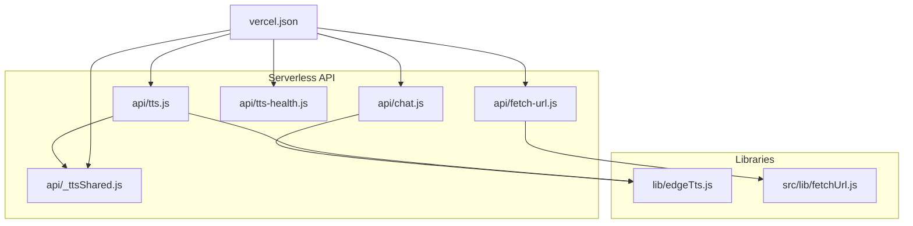
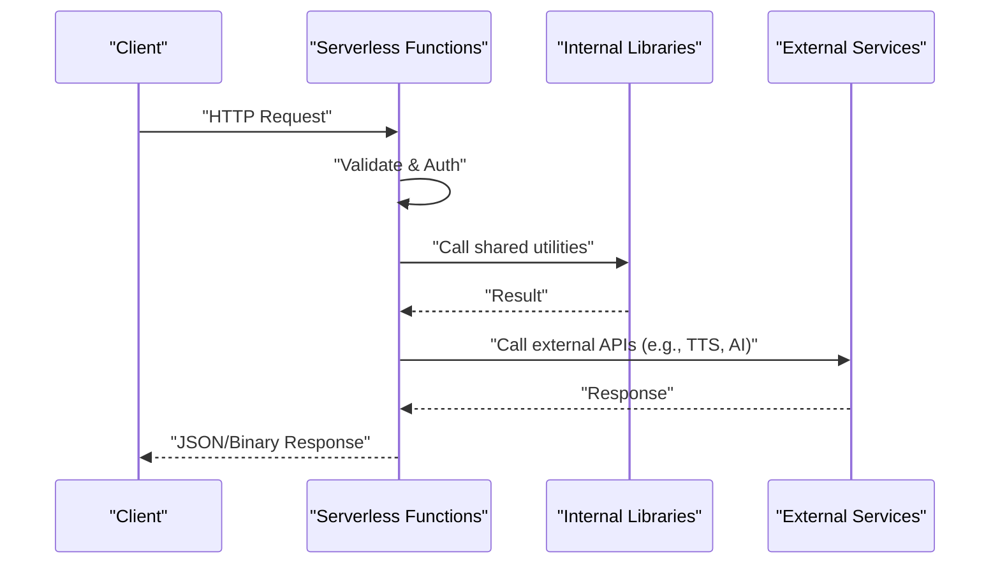
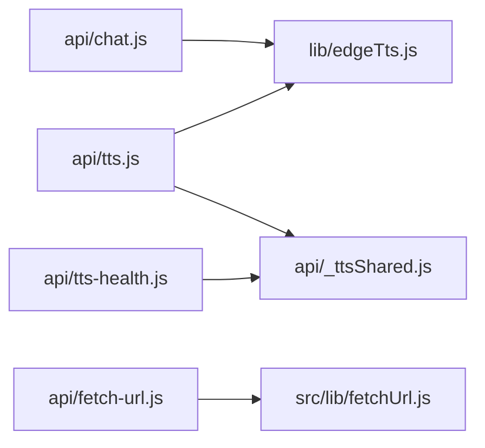

# API Reference

<cite>
**Referenced Files in This Document**
- [api/chat.js](file://api/chat.js)
- [api/tts.js](file://api/tts.js)
- [api/_ttsShared.js](file://api/_ttsShared.js)
- [api/tts-health.js](file://api/tts-health.js)
- [api/fetch-url.js](file://api/fetch-url.js)
- [lib/edgeTts.js](file://lib/edgeTts.js)
- [src/lib/fetchUrl.js](file://src/lib/fetchUrl.js)
- [vercel.json](file://vercel.json)
</cite>

## Table of Contents
1. [Introduction](#introduction)
2. [Project Structure](#project-structure)
3. [Core Components](#core-components)
4. [Architecture Overview](#architecture-overview)
5. [Detailed Component Analysis](#detailed-component-analysis)
6. [Dependency Analysis](#dependency-analysis)
7. [Performance Considerations](#performance-considerations)
8. [Troubleshooting Guide](#troubleshooting-guide)
9. [Conclusion](#conclusion)
10. [Appendices](#appendices)

## Introduction
This document provides comprehensive API documentation for LineCheck’s serverless backend endpoints. It covers:
- Chat API for AI conversations
- Text-to-Speech (TTS) API for audio generation
- TTS Health Check endpoint
- URL Fetch API for external content retrieval

For each endpoint, you will find HTTP methods, request/response schemas, authentication requirements, error codes, rate limiting notes, and practical examples using curl and JavaScript fetch. Shared utilities, error handling patterns, security considerations, versioning strategy, and backwards compatibility are also documented.

## Project Structure
The serverless API is implemented as a set of Node.js modules under the api directory, with shared logic and third-party integrations in lib and src/lib. The project is configured for deployment on Vercel.

**Diagram sources**
- [api/chat.js](file://api/chat.js)
- [api/tts.js](file://api/tts.js)
- [api/_ttsShared.js](file://api/_ttsShared.js)
- [api/tts-health.js](file://api/tts-health.js)
- [api/fetch-url.js](file://api/fetch-url.js)
- [lib/edgeTts.js](file://lib/edgeTts.js)
- [src/lib/fetchUrl.js](file://src/lib/fetchUrl.js)
- [vercel.json](file://vercel.json)

**Section sources**
- [vercel.json](file://vercel.json)

## Core Components
- Chat API: Handles conversational requests to an AI provider.
- TTS API: Converts text to speech using Edge TTS.
- TTS Health Check: Returns service health status for TTS.
- URL Fetch API: Retrieves external content from provided URLs.
- Shared Utilities: Common helpers used by TTS endpoints.
- External Integrations: Edge TTS client and URL fetching utility.

Key responsibilities:
- Request validation and normalization
- Authentication checks (if applicable)
- Rate limiting and quotas (if applicable)
- Error handling and consistent response formats
- Streaming or binary responses where appropriate

**Section sources**
- [api/chat.js](file://api/chat.js)
- [api/tts.js](file://api/tts.js)
- [api/_ttsShared.js](file://api/_ttsShared.js)
- [api/tts-health.js](file://api/tts-health.js)
- [api/fetch-url.js](file://api/fetch-url.js)
- [lib/edgeTts.js](file://lib/edgeTts.js)
- [src/lib/fetchUrl.js](file://src/lib/fetchUrl.js)

## Architecture Overview
High-level flow for each API:
- Client sends HTTP request to a serverless function.
- Serverless function validates input, applies auth/rate limits if configured.
- Function calls internal libraries or external services.
- Response is returned as JSON or binary data.

[No sources needed since this diagram shows conceptual workflow, not actual code structure]

## Detailed Component Analysis

### Chat API
Purpose:
- Accepts conversation messages and returns AI-generated replies.

Endpoint:
- Method: POST
- Path: /api/chat

Authentication:
- Not required unless otherwise configured via environment variables.

Request Schema:
- Content-Type: application/json
- Body fields:
  - messages: array of message objects
    - role: string ("user", "assistant", "system")
    - content: string
  - model: optional string
  - temperature: optional number
  - max_tokens: optional integer
  - stream: optional boolean

Response Schema:
- Success:
  - 200 OK
  - JSON body:
    - id: string
    - created: integer timestamp
    - choices: array of choice objects
      - index: integer
      - message: object { role, content }
      - finish_reason: string
    - usage: object { prompt_tokens, completion_tokens, total_tokens }
- Errors:
  - 400 Bad Request: invalid payload
  - 401 Unauthorized: missing or invalid credentials (if enabled)
  - 429 Too Many Requests: rate limit exceeded
  - 500 Internal Server Error: unexpected failure
  - 503 Service Unavailable: upstream provider unavailable

Rate Limiting:
- If enabled, enforced at the platform level or within the function.

Examples:
- curl:
  - curl -X POST https://your-domain/api/chat -H "Content-Type: application/json" -d '{"messages":[{"role":"user","content":"Hello"}]}'
- JavaScript fetch:
  - fetch("/api/chat", { method: "POST", headers: { "Content-Type": "application/json" }, body: JSON.stringify({ messages: [{ role: "user", content: "Hello" }] }) }).then(r => r.json()).then(console.log)

Notes:
- For streaming responses, set stream: true and handle Server-Sent Events or chunked transfer.

**Section sources**
- [api/chat.js](file://api/chat.js)

### Text-to-Speech (TTS) API
Purpose:
- Converts text into spoken audio using Edge TTS.

Endpoint:
- Method: POST
- Path: /api/tts

Authentication:
- Not required unless otherwise configured via environment variables.

Request Schema:
- Content-Type: application/json
- Body fields:
  - text: string (required)
  - voice: optional string (e.g., language-region variant)
  - rate: optional string or number (speaking rate)
  - pitch: optional string or number (pitch adjustment)
  - format: optional string (audio format; default mp3)

Response Schema:
- Success:
  - 200 OK
  - Binary audio data with Content-Type: audio/mpeg (or specified format)
- Errors:
  - 400 Bad Request: invalid payload
  - 401 Unauthorized: missing or invalid credentials (if enabled)
  - 429 Too Many Requests: rate limit exceeded
  - 500 Internal Server Error: unexpected failure
  - 503 Service Unavailable: TTS provider unavailable

Rate Limiting:
- If enabled, enforced at the platform level or within the function.

Examples:
- curl:
  - curl -X POST https://your-domain/api/tts -H "Content-Type: application/json" -d '{"text":"Hello world","voice":"en-US-AriaNeural"}' --output audio.mp3
- JavaScript fetch:
  - fetch("/api/tts", { method: "POST", headers: { "Content-Type": "application/json" }, body: JSON.stringify({ text: "Hello world", voice: "en-US-AriaNeural" }) }).then(r => r.arrayBuffer()).then(buf => console.log(buf))

Notes:
- Large payloads may be truncated based on provider constraints.
- Use format parameter to control output encoding when supported.

**Section sources**
- [api/tts.js](file://api/tts.js)
- [api/_ttsShared.js](file://api/_ttsShared.js)
- [lib/edgeTts.js](file://lib/edgeTts.js)

### TTS Health Check Endpoint
Purpose:
- Provides a lightweight health check for the TTS service.

Endpoint:
- Method: GET
- Path: /api/tts-health

Authentication:
- Not required.

Request Schema:
- None.

Response Schema:
- Success:
  - 200 OK
  - JSON body:
    - status: string ("ok")
    - timestamp: integer
- Errors:
  - 500 Internal Server Error: unexpected failure

Examples:
- curl:
  - curl https://your-domain/api/tts-health
- JavaScript fetch:
  - fetch("/api/tts-health").then(r => r.json()).then(console.log)

**Section sources**
- [api/tts-health.js](file://api/tts-health.js)

### URL Fetch API
Purpose:
- Retrieves external content from a provided URL. Useful for proxying or scraping public resources.

Endpoint:
- Method: GET
- Path: /api/fetch-url

Authentication:
- Not required unless otherwise configured via environment variables.

Query Parameters:
- url: string (required) — target URL to fetch
- timeout: optional integer (milliseconds)
- follow_redirects: optional boolean (default true)

Response Schema:
- Success:
  - 200 OK
  - Body: raw content from the target URL
  - Headers: forwarded from upstream (sanitized)
- Errors:
  - 400 Bad Request: missing or invalid url
  - 401 Unauthorized: missing or invalid credentials (if enabled)
  - 403 Forbidden: access denied by upstream
  - 404 Not Found: resource not found
  - 429 Too Many Requests: rate limit exceeded
  - 500 Internal Server Error: unexpected failure
  - 503 Service Unavailable: upstream unavailable

Security Considerations:
- Validate and sanitize the target URL.
- Restrict allowed schemes (e.g., http, https).
- Enforce timeouts and size limits.
- Avoid SSRF by blocking private IP ranges.

Examples:
- curl:
  - curl "https://your-domain/api/fetch-url?url=https://example.com"
- JavaScript fetch:
  - fetch("/api/fetch-url?url=" + encodeURIComponent("https://example.com")).then(r => r.text()).then(console.log)

**Section sources**
- [api/fetch-url.js](file://api/fetch-url.js)
- [src/lib/fetchUrl.js](file://src/lib/fetchUrl.js)

## Dependency Analysis
The following diagram maps dependencies between serverless functions and internal libraries.

**Diagram sources**
- [api/chat.js](file://api/chat.js)
- [api/tts.js](file://api/tts.js)
- [api/_ttsShared.js](file://api/_ttsShared.js)
- [api/tts-health.js](file://api/tts-health.js)
- [api/fetch-url.js](file://api/fetch-url.js)
- [lib/edgeTts.js](file://lib/edgeTts.js)
- [src/lib/fetchUrl.js](file://src/lib/fetchUrl.js)

**Section sources**
- [api/chat.js](file://api/chat.js)
- [api/tts.js](file://api/tts.js)
- [api/_ttsShared.js](file://api/_ttsShared.js)
- [api/tts-health.js](file://api/tts-health.js)
- [api/fetch-url.js](file://api/fetch-url.js)
- [lib/edgeTts.js](file://lib/edgeTts.js)
- [src/lib/fetchUrl.js](file://src/lib/fetchUrl.js)

## Performance Considerations
- Prefer streaming responses for long-running operations (e.g., chat streaming, large audio files).
- Cache frequently accessed static assets and responses where safe.
- Set appropriate timeouts for external calls to avoid hanging serverless invocations.
- Minimize payload sizes by compressing responses when possible.
- Monitor cold start times and consider provisioned concurrency if available.

[No sources needed since this section provides general guidance]

## Troubleshooting Guide
Common issues and resolutions:
- Invalid request payload: Ensure required fields are present and correctly typed.
- Authentication failures: Verify environment variables and headers if auth is enabled.
- Rate limiting: Implement exponential backoff and respect retry-after headers.
- Upstream errors: Inspect logs for provider-specific error codes and adjust parameters.
- Network timeouts: Increase timeout values cautiously and validate network policies.

Error Handling Patterns:
- Consistent JSON error responses with code, message, and details.
- Sanitize sensitive information in error messages.
- Log structured errors for observability without exposing secrets.

Security Considerations:
- Validate all inputs rigorously.
- Enforce HTTPS-only endpoints.
- Apply CORS policies appropriately.
- Protect against SSRF in URL Fetch API.
- Rotate secrets and use secure secret management.

**Section sources**
- [api/tts.js](file://api/tts.js)
- [api/fetch-url.js](file://api/fetch-url.js)
- [api/_ttsShared.js](file://api/_ttsShared.js)

## Conclusion
LineCheck’s serverless APIs provide robust capabilities for AI conversations, text-to-speech, health monitoring, and external content retrieval. By following the documented schemas, error codes, and security practices, clients can integrate reliably and securely. Versioning and backwards compatibility strategies ensure smooth evolution of the API surface.

[No sources needed since this section summarizes without analyzing specific files]

## Appendices

### Versioning Strategy and Backwards Compatibility
- Semantic versioning for major changes; minor updates remain backwards compatible.
- Deprecation policy: announce deprecations with migration guides and sunset dates.
- Maintain multiple versions concurrently during transition periods.
- Use feature flags for gradual rollout of new behaviors.

[No sources needed since this section provides general guidance]