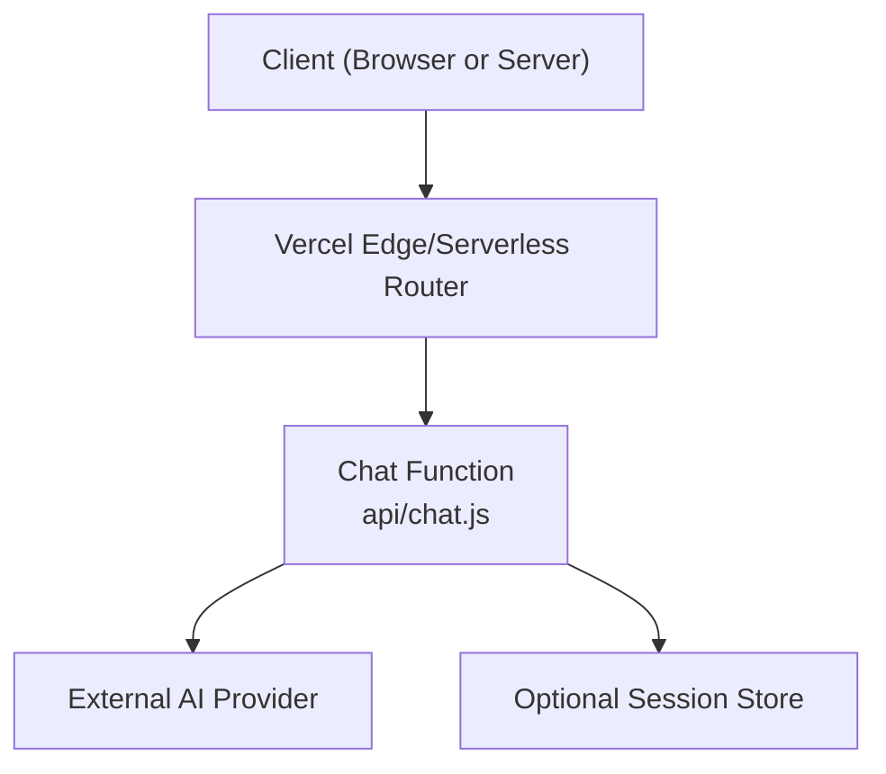
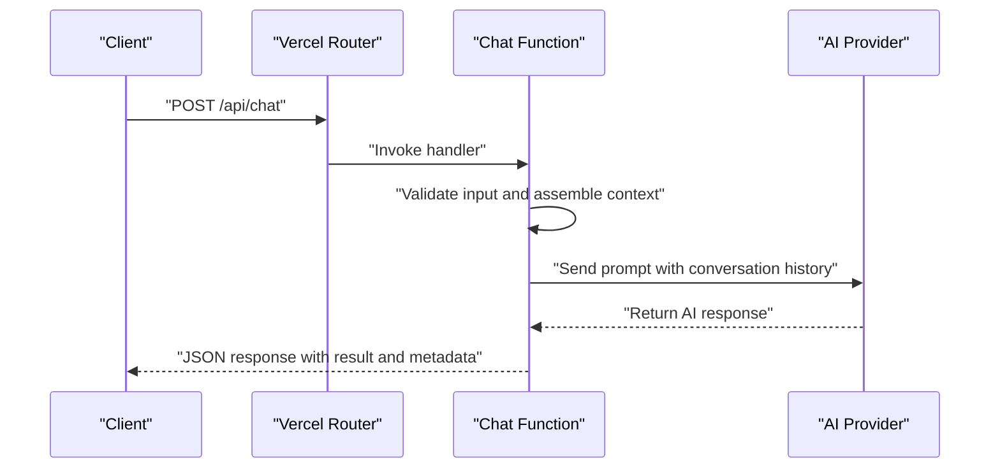
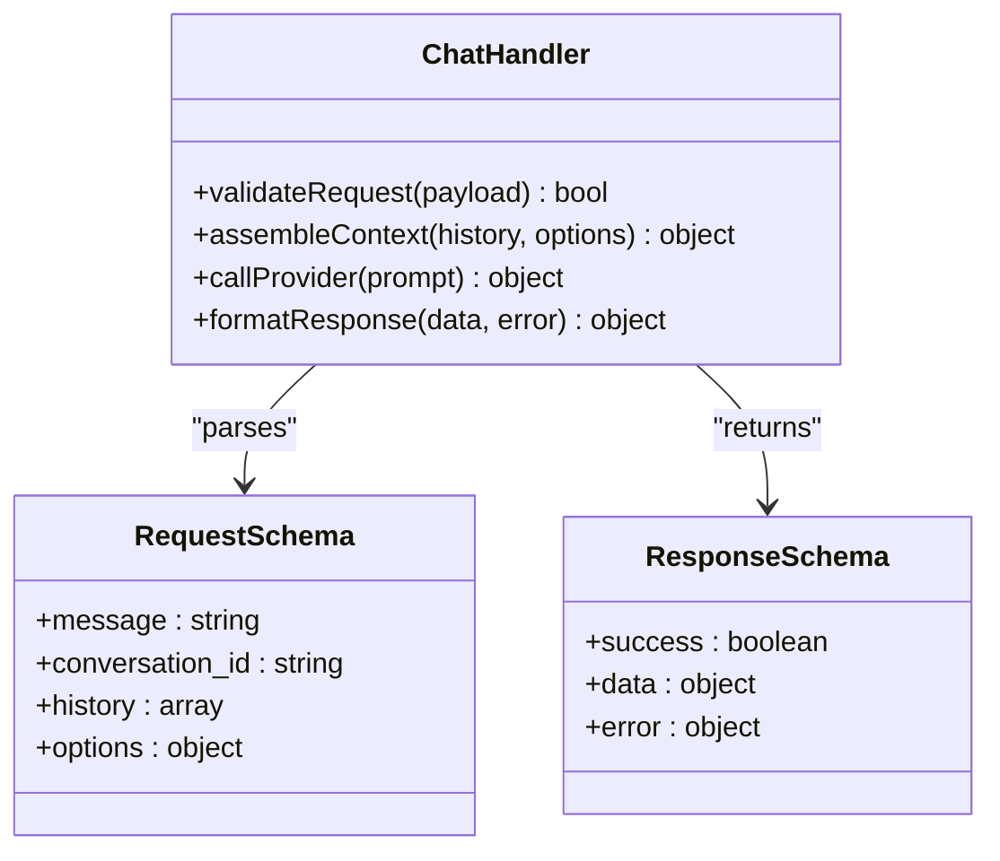
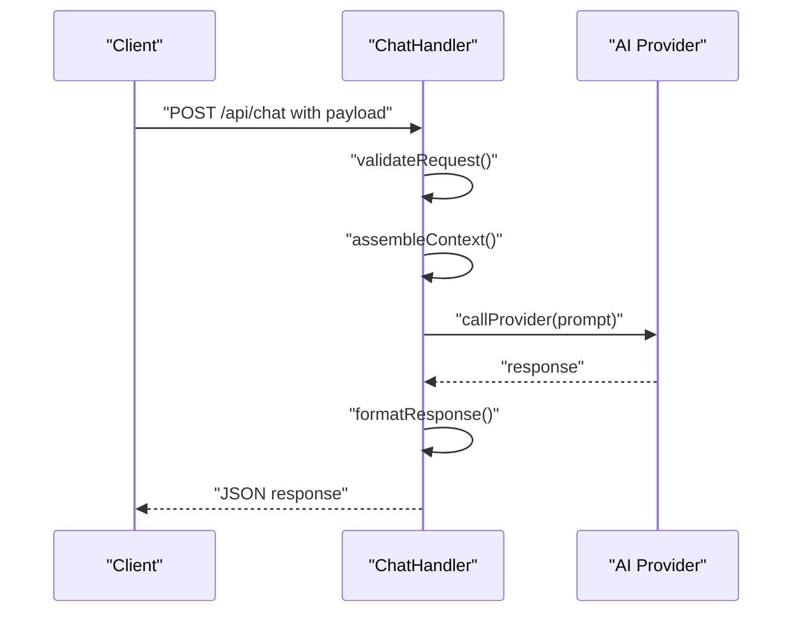
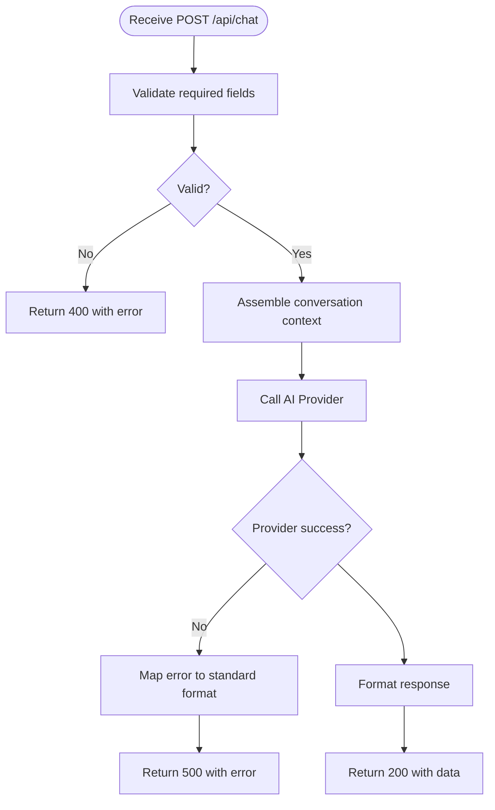
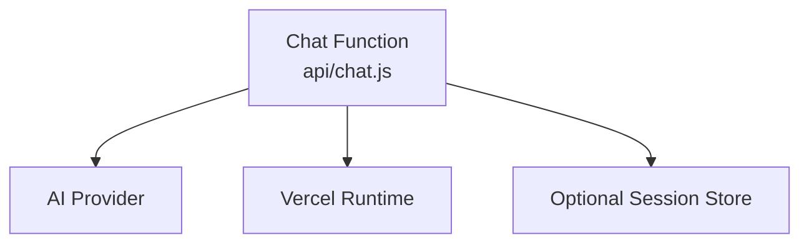

# Chat API

<cite>
**Referenced Files in This Document**
- [chat.js](file://api/chat.js)
- [package.json](file://package.json)
- [vercel.json](file://vercel.json)
</cite>

## Table of Contents
1. [Introduction](#introduction)
2. [Project Structure](#project-structure)
3. [Core Components](#core-components)
4. [Architecture Overview](#architecture-overview)
5. [Detailed Component Analysis](#detailed-component-analysis)
6. [Dependency Analysis](#dependency-analysis)
7. [Performance Considerations](#performance-considerations)
8. [Troubleshooting Guide](#troubleshooting-guide)
9. [Conclusion](#conclusion)
10. [Appendices](#appendices)

## Introduction
This document provides comprehensive API documentation for the Chat endpoint, focusing on the HTTP POST method used to interact with AI conversations. It covers request and response schemas, message formats, conversation state management, authentication requirements, error handling, rate limiting considerations, and security guidance. Practical examples using curl and JavaScript fetch are included to demonstrate common use cases such as question generation, interview preparation, and content analysis.

## Project Structure
The Chat API is implemented as a serverless function within the api directory. The project uses a modern frontend stack and deploys via Vercel. Key files relevant to the Chat API include:
- api/chat.js: Implements the Chat endpoint logic.
- package.json: Declares dependencies and scripts.
- vercel.json: Defines deployment configuration for serverless functions.

[No sources needed since this diagram shows conceptual workflow, not actual code structure]

**Section sources**
- [chat.js](file://api/chat.js)
- [package.json](file://package.json)
- [vercel.json](file://vercel.json)

## Core Components
- Chat Endpoint Handler: Processes incoming POST requests, validates inputs, manages conversation context, and returns AI responses.
- Request Schema: Defines required fields such as user message, optional conversation history, and metadata like language or mode.
- Response Schema: Returns structured data including AI reply, conversation ID, and status information.
- State Management: Maintains conversation context across messages using session identifiers or client-provided history.

Key responsibilities:
- Input validation and sanitization
- Conversation context assembly
- External AI provider invocation
- Error mapping and consistent error responses
- Optional rate limiting and logging

**Section sources**
- [chat.js](file://api/chat.js)

## Architecture Overview
The Chat API follows a simple serverless architecture:
- Clients send HTTP POST requests to the Chat endpoint.
- The handler validates and processes the request payload.
- The handler calls an external AI provider to generate responses.
- The handler returns a standardized JSON response.

**Diagram sources**
- [chat.js](file://api/chat.js)

## Detailed Component Analysis

### Chat Endpoint: HTTP POST /api/chat
- Method: POST
- Path: /api/chat
- Content-Type: application/json
- Authentication: Depends on deployment configuration; see Security Considerations.
- Rate Limiting: Depends on platform limits; see Performance Considerations.

Request Body Schema:
- message: string (required) — The user’s input text.
- conversation_id: string (optional) — Unique identifier to maintain conversation context.
- history: array of objects (optional) — Prior messages to provide context. Each object includes:
  - role: string — One of "user", "assistant", or "system".
  - content: string — Message text.
- options: object (optional) — Additional parameters such as:
  - language: string — Target language code.
  - mode: string — Task mode (e.g., "question_generation", "interview_prep", "content_analysis").
  - temperature: number — Controls randomness (if supported by provider).
  - max_tokens: number — Limits response length (if supported by provider).

Response Body Schema:
- success: boolean — Indicates whether the request succeeded.
- data: object — Contains:
  - answer: string — The AI-generated response.
  - conversation_id: string — Identifier for the current conversation.
  - usage: object (optional) — Token usage metrics if provided by provider.
- error: object (optional) — Present when success is false:
  - code: string — Machine-readable error code.
  - message: string — Human-readable description.
  - details: object (optional) — Additional context about the error.

Status Codes:
- 200 OK: Successful response.
- 400 Bad Request: Invalid or missing required fields.
- 401 Unauthorized: Missing or invalid authentication (if enforced).
- 429 Too Many Requests: Rate limit exceeded.
- 500 Internal Server Error: Unexpected server-side failure.

Examples:
- curl example:
  - See [curl example path](file://api/chat.js)
- JavaScript fetch example:
  - See [fetch example path](file://api/chat.js)

Conversation Context Management:
- Use conversation_id to persist context across multiple messages.
- Optionally supply history to reconstruct context without server-side storage.
- Recommended pattern:
  - First message: Provide no conversation_id; store returned conversation_id.
  - Subsequent messages: Include conversation_id and optionally append prior exchanges to history.

Common Use Cases:
- Question Generation: Set options.mode to "question_generation" and provide topic or domain hints in message.
- Interview Preparation: Set options.mode to "interview_prep" and specify role or industry in message.
- Content Analysis: Set options.mode to "content_analysis" and include target text or summary instructions in message.

**Section sources**
- [chat.js](file://api/chat.js)

#### Class Diagram: Chat Handler Responsibilities

**Diagram sources**
- [chat.js](file://api/chat.js)

#### Sequence Diagram: Typical Chat Flow

**Diagram sources**
- [chat.js](file://api/chat.js)

#### Flowchart: Input Validation and Processing

**Diagram sources**
- [chat.js](file://api/chat.js)

## Dependency Analysis
The Chat function depends on:
- External AI Provider: Invoked to generate responses based on prompts and conversation context.
- Platform Runtime: Vercel serverless environment handles routing and execution.
- Optional Storage: If conversation persistence is required beyond client-provided history.

**Diagram sources**
- [chat.js](file://api/chat.js)
- [vercel.json](file://vercel.json)

**Section sources**
- [chat.js](file://api/chat.js)
- [vercel.json](file://vercel.json)

## Performance Considerations
- Streaming Responses: If supported by the provider, consider streaming to reduce perceived latency.
- Prompt Optimization: Keep prompts concise and structured to minimize token usage.
- Caching: Cache frequent or identical prompts to reduce provider calls.
- Rate Limiting: Implement client-side retries with exponential backoff; monitor 429 responses.
- Concurrency: Avoid excessive parallel requests to prevent throttling.

[No sources needed since this section provides general guidance]

## Troubleshooting Guide
Common issues and resolutions:
- 400 Bad Request: Ensure all required fields are present and correctly typed.
- 401 Unauthorized: Verify authentication headers or tokens if enforced.
- 429 Too Many Requests: Reduce request frequency; implement backoff strategies.
- 500 Internal Server Error: Check logs for provider errors or unexpected failures.

Debugging tips:
- Log request payloads and responses (excluding sensitive data).
- Validate conversation_id consistency across messages.
- Inspect provider error codes and map them to user-friendly messages.

**Section sources**
- [chat.js](file://api/chat.js)

## Conclusion
The Chat API provides a straightforward interface for AI-driven conversations with robust request/response schemas and clear error handling. By managing conversation context through conversation_id and optional history, clients can build interactive experiences such as question generation, interview preparation, and content analysis. Follow security best practices and performance recommendations to ensure reliable operation.

[No sources needed since this section summarizes without analyzing specific files]

## Appendices

### Authentication Requirements
- If enforced, include appropriate headers (e.g., Authorization) as configured by the deployment.
- For development, disable or mock authentication as needed.

**Section sources**
- [chat.js](file://api/chat.js)
- [vercel.json](file://vercel.json)

### Security Considerations
- Sanitize inputs to prevent injection attacks.
- Validate and restrict allowed modes and options.
- Avoid logging sensitive data.
- Enforce HTTPS and secure headers at the platform level.

**Section sources**
- [chat.js](file://api/chat.js)

### Practical Examples

- curl Example:
  - See [curl example path](file://api/chat.js)

- JavaScript Fetch Example:
  - See [fetch example path](file://api/chat.js)

[No additional sources needed since examples reference chat.js]