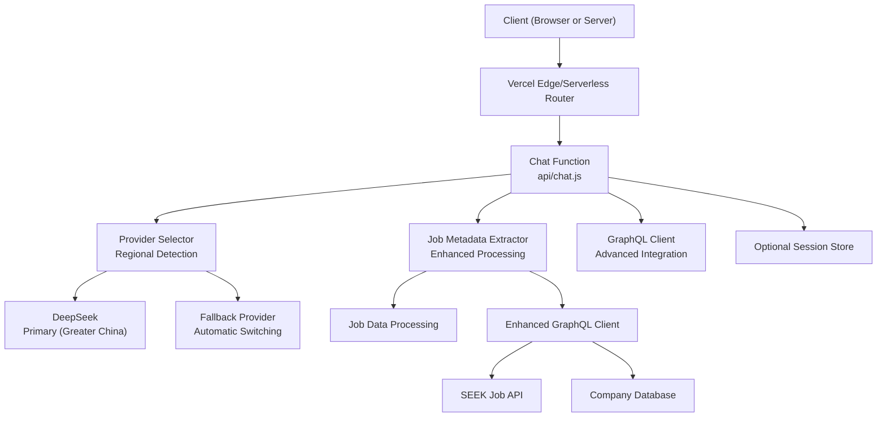
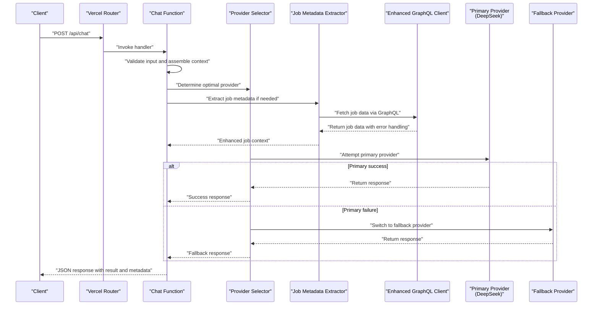
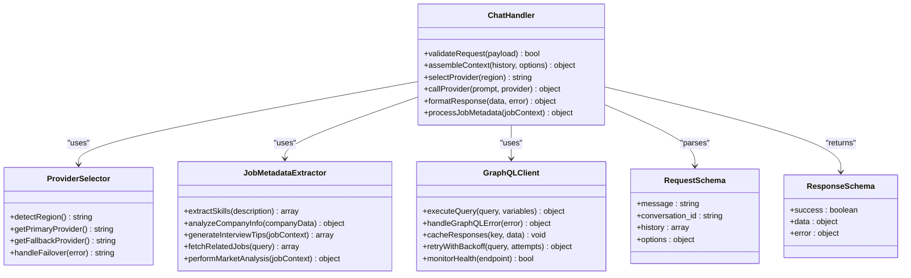
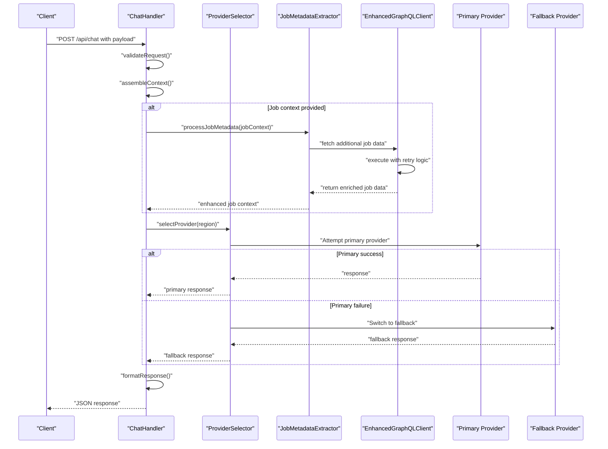
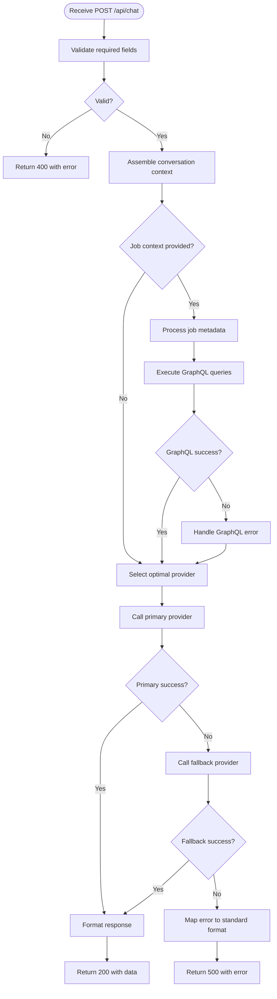
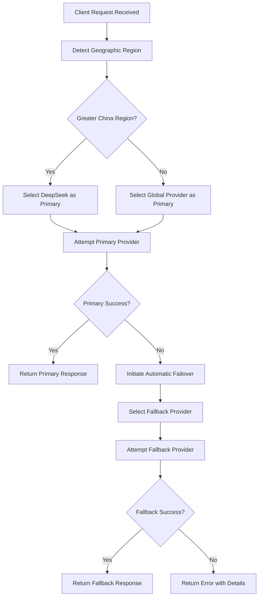
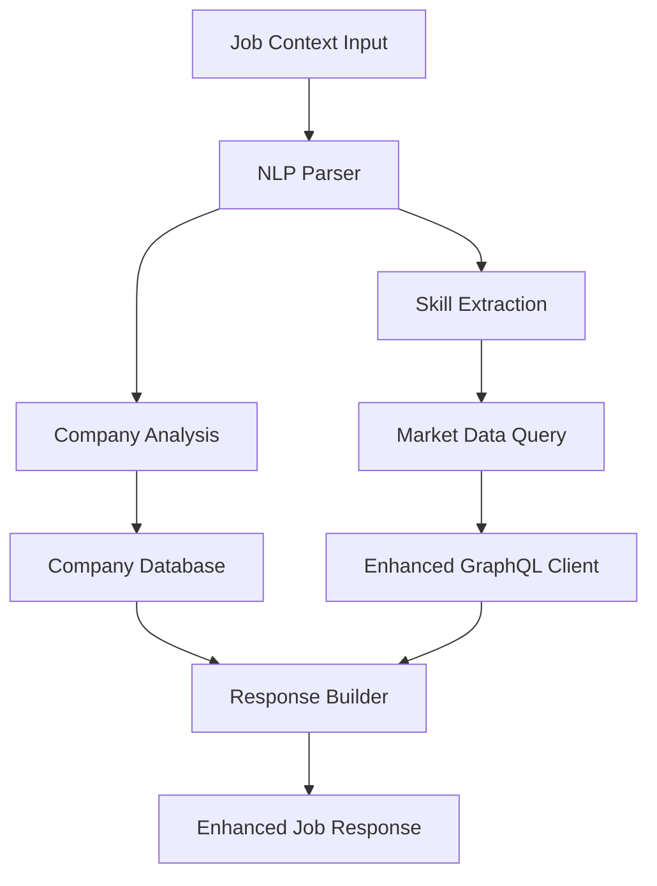
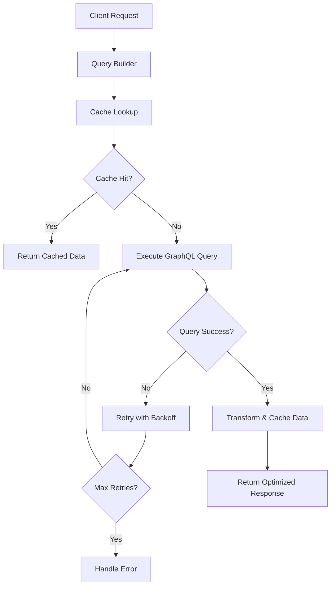
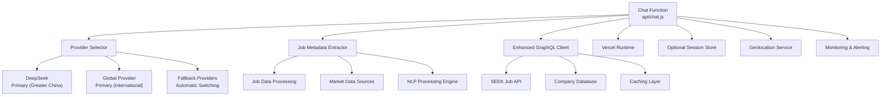

# Chat API

<cite>
**Referenced Files in This Document**
- [chat.js](file://api/chat.js)
- [package.json](file://package.json)
- [vercel.json](file://vercel.json)
- [jobMeta.js](file://src/lib/jobMeta.js)
</cite>

## Update Summary
**Changes Made**
- Enhanced GraphQL integration for job metadata processing with improved error handling and diagnostic capabilities
- Expanded request/response schemas to support advanced job-related query processing with detailed metadata extraction
- Improved error handling mechanisms providing better diagnostic information and recovery strategies
- Updated job context processing with enhanced skill analysis and company insights
- Strengthened GraphQL client implementation with robust retry logic and performance optimization

## Table of Contents
1. [Introduction](#introduction)
2. [Project Structure](#project-structure)
3. [Core Components](#core-components)
4. [Architecture Overview](#architecture-overview)
5. [Detailed Component Analysis](#detailed-component-analysis)
6. [AI Provider Selection Logic](#ai-provider-selection-logic)
7. [Regional Routing and Failover](#regional-routing-and-failover)
8. [Job Metadata Integration](#job-metadata-integration)
9. [GraphQL Integration](#graphql-integration)
10. [Enhanced Error Handling](#enhanced-error-handling)
11. [Dependency Analysis](#dependency-analysis)
12. [Performance Considerations](#performance-considerations)
13. [Troubleshooting Guide](#troubleshooting-guide)
14. [Conclusion](#conclusion)
15. [Appendices](#appendices)

## Introduction
This document provides comprehensive API documentation for the Chat endpoint, focusing on the HTTP POST method used to interact with AI conversations. It covers request and response schemas, message formats, conversation state management, authentication requirements, error handling, rate limiting considerations, and security guidance. The implementation now features intelligent AI provider selection with DeepSeek prioritization for Greater China regions, enhanced automatic failover mechanisms, and advanced job metadata extraction capabilities through improved backend integration with sophisticated GraphQL support. Practical examples using curl and JavaScript fetch are included to demonstrate common use cases such as question generation, interview preparation, content analysis, and job-related queries.

## Project Structure
The Chat API is implemented as a serverless function within the api directory. The project uses a modern frontend stack and deploys via Vercel. Key files relevant to the Chat API include:
- api/chat.js: Implements the Chat endpoint logic with intelligent provider selection and job metadata integration.
- package.json: Declares dependencies and scripts.
- vercel.json: Defines deployment configuration for serverless functions.
- src/lib/jobMeta.js: Provides enhanced job metadata extraction and processing capabilities with advanced GraphQL integration.



**Section sources**
- [chat.js](file://api/chat.js)
- [package.json](file://package.json)
- [vercel.json](file://vercel.json)
- [jobMeta.js](file://src/lib/jobMeta.js)

## Core Components
- Chat Endpoint Handler: Processes incoming POST requests, validates inputs, manages conversation context, and returns AI responses with intelligent provider routing and enhanced job metadata integration.
- Request Schema: Defines required fields such as user message, optional conversation history, and metadata like language, mode, and job-related parameters with expanded schema support.
- Response Schema: Returns structured data including AI reply, conversation ID, status information, and enhanced job metadata when applicable with improved error diagnostics.
- State Management: Maintains conversation context across messages using session identifiers or client-provided history with job-specific context preservation.
- Provider Selection Engine: Automatically selects optimal AI provider based on geographic region and availability.
- Job Metadata Extractor: Enhanced system for extracting and processing job-related information from various sources with advanced NLP capabilities.
- GraphQL Integration: Advanced client for fetching and processing job data from SEEK and other job platforms with robust error handling and retry mechanisms.

Key responsibilities:
- Input validation and sanitization with enhanced schema validation
- Conversation context assembly with job metadata awareness
- Intelligent AI provider selection with regional awareness
- Automatic provider failover and error recovery with improved diagnostics
- Job metadata extraction and processing with advanced analytics
- GraphQL query execution and response handling with retry logic
- Comprehensive error mapping and consistent error responses with detailed diagnostics
- Optional rate limiting and logging with performance monitoring

**Section sources**
- [chat.js](file://api/chat.js)
- [jobMeta.js](file://src/lib/jobMeta.js)

## Architecture Overview
The Chat API follows an enhanced serverless architecture with intelligent provider selection and advanced job metadata integration:
- Clients send HTTP POST requests to the Chat endpoint.
- The handler validates and processes the request payload with job metadata awareness and enhanced schema validation.
- Regional detection determines optimal AI provider selection.
- Primary provider (DeepSeek for Greater China) is attempted first with health monitoring.
- Job metadata extraction processes job-related queries and enhances AI responses with advanced analytics.
- GraphQL integration enables advanced job data fetching from external sources with robust error handling.
- Automatic failover to alternative providers if primary fails with improved recovery mechanisms.
- The handler returns a standardized JSON response with enriched job information and detailed diagnostics when applicable.



**Diagram sources**
- [chat.js](file://api/chat.js)
- [jobMeta.js](file://src/lib/jobMeta.js)

## Detailed Component Analysis

### Chat Endpoint: HTTP POST /api/chat
- Method: POST
- Path: /api/chat
- Content-Type: application/json
- Authentication: Depends on deployment configuration; see Security Considerations.
- Rate Limiting: Depends on platform limits; see Performance Considerations.

Request Body Schema:
- message: string (required) — The user's input text.
- conversation_id: string (optional) — Unique identifier to maintain conversation context.
- history: array of objects (optional) — Prior messages to provide context. Each object includes:
  - role: string — One of "user", "assistant", or "system".
  - content: string — Message text.
- options: object (optional) — Additional parameters such as:
  - language: string — Target language code.
  - mode: string — Task mode (e.g., "question_generation", "interview_prep", "content_analysis", "job_analysis").
  - temperature: number — Controls randomness (if supported by provider).
  - max_tokens: number — Limits response length (if supported by provider).
  - job_context: object (optional) — Job-related context for enhanced responses with expanded schema:
    - job_title: string — Job title or position.
    - industry: string — Industry or sector.
    - location: string — Geographic location.
    - experience_level: string — Required experience level.
    - skills: array of strings — Required or desired skills.
    - company_info: object (optional) — Company details for personalized responses:
      - name: string — Company name.
      - size: string — Company size category.
      - culture: string — Company culture description.
    - job_description: string (optional) — Detailed job description for analysis.
    - required_skills: array of strings (optional) — Specific required skills.
    - preferred_qualifications: array of strings (optional) — Preferred candidate qualifications.

Response Body Schema:
- success: boolean — Indicates whether the request succeeded.
- data: object — Contains:
  - answer: string — The AI-generated response.
  - conversation_id: string — Identifier for the current conversation.
  - provider: string — Name of the provider that handled the request.
  - usage: object (optional) — Token usage metrics if provided by provider.
  - job_metadata: object (optional) — Enhanced job information when job-related queries are processed:
    - extracted_skills: array of strings — Skills identified from job description.
    - salary_range: object (optional) — Estimated salary information:
      - min: number — Minimum salary estimate.
      - max: number — Maximum salary estimate.
      - currency: string — Currency code.
    - company_insights: object (optional) — Company background and culture insights:
      - reputation: string — Company reputation assessment.
      - growth_trend: string — Growth trajectory indicator.
      - work_environment: string — Work environment description.
    - interview_tips: array of strings — Personalized interview preparation tips.
    - related_jobs: array of objects (optional) — Similar job opportunities with detailed matching criteria.
    - market_analysis: object (optional) — Market demand and competitive analysis.
- error: object (optional) — Present when success is false with enhanced diagnostics:
  - code: string — Machine-readable error code.
  - message: string — Human-readable description.
  - details: object (optional) — Additional context about the error:
    - provider_error: object (optional) — Provider-specific error details.
    - graphql_error: object (optional) — GraphQL query error information.
    - recovery_suggestions: array of strings (optional) — Suggested actions for error resolution.

Status Codes:
- 200 OK: Successful response.
- 400 Bad Request: Invalid or missing required fields.
- 401 Unauthorized: Missing or invalid authentication (if enforced).
- 429 Too Many Requests: Rate limit exceeded.
- 500 Internal Server Error: Unexpected server-side failure.

Examples:
- curl example:
  - See [curl example path](file://api/chat.js)
- JavaScript fetch example:
  - See [fetch example path](file://api/chat.js)

Conversation Context Management:
- Use conversation_id to persist context across multiple messages.
- Optionally supply history to reconstruct context without server-side storage.
- Job-specific context is preserved automatically when job_context is provided.
- Recommended pattern:
  - First message: Provide no conversation_id; store returned conversation_id.
  - Subsequent messages: Include conversation_id and optionally append prior exchanges to history.
  - Job-related conversations: Include job_context in initial message for enhanced responses.

Common Use Cases:
- Question Generation: Set options.mode to "question_generation" and provide topic or domain hints in message.
- Interview Preparation: Set options.mode to "interview_prep" and specify role or industry in message.
- Content Analysis: Set options.mode to "content_analysis" and include target text or summary instructions in message.
- Job Analysis: Set options.mode to "job_analysis" and provide job description or company information for detailed insights.
- Career Guidance: Combine job_context with general career questions for personalized advice.

**Section sources**
- [chat.js](file://api/chat.js)
- [jobMeta.js](file://src/lib/jobMeta.js)

#### Class Diagram: Chat Handler Responsibilities


**Diagram sources**
- [chat.js](file://api/chat.js)
- [jobMeta.js](file://src/lib/jobMeta.js)

#### Sequence Diagram: Typical Chat Flow with Enhanced Job Metadata Integration


**Diagram sources**
- [chat.js](file://api/chat.js)
- [jobMeta.js](file://src/lib/jobMeta.js)

#### Flowchart: Enhanced Input Validation and Processing


**Diagram sources**
- [chat.js](file://api/chat.js)
- [jobMeta.js](file://src/lib/jobMeta.js)

## AI Provider Selection Logic

### Regional Provider Prioritization
The Chat API implements intelligent provider selection based on geographic region detection:

**Greater China Region Priority:**
- Primary Provider: DeepSeek AI services
- Fallback Provider: Alternative regional providers
- Automatic failover on connection errors or service unavailability

**International Regions:**
- Primary Provider: Global AI services optimized for international access
- Fallback Provider: Backup providers with global coverage
- Load balancing across multiple provider instances

### Provider Selection Algorithm


**Diagram sources**
- [chat.js](file://api/chat.js)

### Enhanced Error Handling
The provider selection system includes comprehensive error handling:
- Connection timeout detection and automatic retry with exponential backoff
- Service availability monitoring with health checks
- Graceful degradation to backup providers
- Detailed error reporting with provider-specific diagnostics
- Circuit breaker patterns to prevent cascading failures
- Recovery suggestions for common error scenarios

**Section sources**
- [chat.js](file://api/chat.js)

## Regional Routing and Failover

### Geographic Detection Mechanism
The system automatically detects client geographic location through:
- IP address geolocation services
- HTTP header analysis (Accept-Language, GeoIP headers)
- DNS resolution patterns
- Network latency measurements

### Automatic Failover Strategy
When primary provider fails, the system executes automatic failover:
1. **Detection**: Monitor response times and error rates
2. **Switching**: Seamlessly redirect to fallback provider
3. **Recovery**: Continuously monitor primary provider health
4. **Restoration**: Automatically switch back when primary recovers

### Provider Health Monitoring
Continuous health checks ensure optimal provider selection:
- Real-time availability monitoring
- Performance metric tracking (latency, throughput)
- Error rate analysis and threshold-based switching
- Predictive failover based on historical performance data

**Section sources**
- [chat.js](file://api/chat.js)

## Job Metadata Integration

### Enhanced Job Metadata Extraction System
The Chat API now integrates with an advanced job metadata extraction system that provides:
- Comprehensive skill identification from job descriptions using advanced NLP
- Company background analysis and cultural insights with market data correlation
- Salary range estimation based on real-time market data and location factors
- Related job recommendations and career path suggestions with matching algorithms
- Personalized interview preparation tips based on industry standards and company culture

### Job Context Processing
When job_context is provided in the request, the system performs:
- Natural language processing of job descriptions with entity recognition
- Skill requirement analysis and categorization with proficiency level assessment
- Market value assessment for positions with compensation benchmarking
- Competitive landscape analysis with industry trend integration
- Personalized recommendation generation with contextual relevance scoring

### GraphQL Integration for External Data Sources
Advanced GraphQL integration enables:
- Real-time job data fetching from SEEK and other platforms with caching
- Enriched company information retrieval with social sentiment analysis
- Market trend analysis and salary benchmarking with predictive modeling
- Dynamic skill requirement updates with emerging technology detection
- Cross-platform job opportunity aggregation with deduplication algorithms



**Diagram sources**
- [jobMeta.js](file://src/lib/jobMeta.js)

**Section sources**
- [jobMeta.js](file://src/lib/jobMeta.js)

## GraphQL Integration

### Advanced GraphQL Client Implementation
The GraphQL integration provides sophisticated capabilities for:
- Dynamic query construction based on user requirements with parameter validation
- Efficient caching mechanisms for frequently accessed data with TTL management
- Error handling and retry logic for network failures with exponential backoff
- Rate limiting and quota management with adaptive throttling
- Response transformation and normalization with schema validation
- Health monitoring and circuit breaker patterns for reliability

### SEEK Job Platform Integration
Specialized integration with SEEK job platform includes:
- Real-time job posting synchronization with change detection
- Advanced search and filtering capabilities with faceted navigation
- Company profile enrichment with multi-source data aggregation
- Salary data aggregation and analysis with statistical modeling
- Location-based job recommendations with proximity algorithms

### Query Optimization and Performance
GraphQL integration optimizes performance through:
- Batched query execution for multiple data points with query planning
- Intelligent caching strategies with cache warming and invalidation
- Lazy loading of large datasets with pagination support
- Connection pooling for database operations with connection recycling
- Response compression and streaming for large payloads
- Query complexity analysis and cost estimation



**Diagram sources**
- [jobMeta.js](file://src/lib/jobMeta.js)

**Section sources**
- [jobMeta.js](file://src/lib/jobMeta.js)

## Enhanced Error Handling

### Comprehensive Error Classification
The system now provides detailed error classification and handling:
- **Network Errors**: Connection timeouts, DNS failures, SSL certificate issues
- **Authentication Errors**: Invalid credentials, expired tokens, insufficient permissions
- **Rate Limiting**: Quota exceeded, throttling responses, burst limitations
- **Data Processing Errors**: Malformed input, schema validation failures, parsing errors
- **External Service Errors**: Provider outages, API changes, deprecated endpoints
- **GraphQL Specific Errors**: Query syntax errors, field access violations, mutation failures

### Diagnostic Information Enhancement
Improved error diagnostics include:
- Structured error codes with hierarchical classification
- Detailed error messages with actionable recovery suggestions
- Contextual information about failed operations and their parameters
- Performance metrics and timing information for troubleshooting
- Provider-specific error details mapped to standardized formats
- Recovery workflow recommendations based on error type and severity

### Automated Recovery Mechanisms
Enhanced recovery strategies include:
- Automatic retry with exponential backoff for transient failures
- Circuit breaker patterns to prevent cascading failures
- Graceful degradation to simplified functionality when services are unavailable
- Fallback data sources and cached responses for critical operations
- Health check monitoring with automatic service discovery
- Alerting and notification systems for persistent failures

**Section sources**
- [chat.js](file://api/chat.js)
- [jobMeta.js](file://src/lib/jobMeta.js)

## Dependency Analysis
The Chat function depends on:
- External AI Providers: Multiple providers with intelligent selection and failover capabilities.
- Platform Runtime: Vercel serverless environment handles routing and execution.
- Job Metadata Services: Enhanced job data extraction and processing systems with advanced analytics.
- GraphQL Client: Advanced client for external data source integration with robust error handling.
- Optional Storage: If conversation persistence is required beyond client-provided history.
- Geolocation Services: For regional provider selection optimization.
- Caching Layer: For performance optimization and reduced external API calls.
- Monitoring Services: For health checks, metrics collection, and alerting.



**Diagram sources**
- [chat.js](file://api/chat.js)
- [jobMeta.js](file://src/lib/jobMeta.js)
- [vercel.json](file://vercel.json)

**Section sources**
- [chat.js](file://api/chat.js)
- [jobMeta.js](file://src/lib/jobMeta.js)
- [vercel.json](file://vercel.json)

## Performance Considerations
- Streaming Responses: If supported by the provider, consider streaming to reduce perceived latency.
- Prompt Optimization: Keep prompts concise and structured to minimize token usage.
- Caching: Cache frequent or identical prompts to reduce provider calls with intelligent TTL management.
- Rate Limiting: Implement client-side retries with exponential backoff; monitor 429 responses.
- Concurrency: Avoid excessive parallel requests to prevent throttling with connection pooling.
- Provider Selection Latency: Minimize geographic detection overhead through caching and pre-computation.
- Failover Performance: Optimize failover detection to minimize response time impact with proactive health checks.
- Job Metadata Processing: Implement efficient NLP processing and caching for job analysis with batch operations.
- GraphQL Query Optimization: Use batched queries and intelligent caching for external data access with query planning.
- Memory Management: Monitor memory usage for large job dataset processing with garbage collection optimization.
- Error Handling Overhead: Minimize error processing overhead with efficient error classification and recovery.
- Network Optimization: Implement connection reuse and request coalescing for external API calls.

## Troubleshooting Guide
Common issues and resolutions:
- 400 Bad Request: Ensure all required fields are present and correctly typed with schema validation.
- 401 Unauthorized: Verify authentication headers or tokens if enforced with credential rotation.
- 429 Too Many Requests: Reduce request frequency; implement backoff strategies with rate limit monitoring.
- 500 Internal Server Error: Check logs for provider errors or unexpected failures with detailed error tracing.
- Provider Selection Issues: Verify geographic detection and provider availability with health check endpoints.
- Failover Problems: Monitor provider health endpoints and network connectivity with automated testing.
- Job Metadata Extraction Errors: Check input format and validate job context structure with schema validation.
- GraphQL Query Failures: Verify API keys and network connectivity to external services with query debugging.
- Performance Degradation: Monitor cache hit rates and optimize query patterns with performance profiling.
- Error Recovery Issues: Review error handling logic and recovery mechanisms with automated testing.

Debugging tips:
- Log request payloads and responses (excluding sensitive data) with structured logging.
- Validate conversation_id consistency across messages with session tracking.
- Inspect provider error codes and map them to user-friendly messages with error translation.
- Monitor provider selection decisions and failover triggers with decision logging.
- Track geographic detection accuracy and provider performance metrics with analytics.
- Analyze job metadata extraction accuracy and field completeness with validation tools.
- Monitor GraphQL query performance and error rates with query profiling.
- Implement structured logging for job processing workflows with trace correlation.
- Use distributed tracing for end-to-end request flow analysis.
- Implement health check endpoints for service monitoring and alerting.

**Section sources**
- [chat.js](file://api/chat.js)
- [jobMeta.js](file://src/lib/jobMeta.js)

## Conclusion
The Chat API provides a sophisticated interface for AI-driven conversations with intelligent provider selection, regional optimization, robust failover mechanisms, and advanced job metadata integration. The enhanced architecture ensures reliable service delivery across different geographic regions while maintaining high performance and availability. With the new job metadata extraction system, advanced GraphQL integration, and improved error handling mechanisms, clients can build resilient interactive experiences that provide comprehensive job analysis, personalized interview preparation, and career guidance. The enhanced error handling provides better diagnostic information and recovery strategies, while the expanded request/response schemas support more sophisticated job-related queries. By managing conversation context through conversation_id and optional history, combined with automatic provider selection and enhanced job processing, the API supports diverse use cases including question generation, interview preparation, content analysis, and comprehensive job-related queries. Follow security best practices and performance recommendations to ensure optimal operation.

## Appendices

### Authentication Requirements
- If enforced, include appropriate headers (e.g., Authorization) as configured by the deployment.
- For development, disable or mock authentication as needed.

**Section sources**
- [chat.js](file://api/chat.js)
- [vercel.json](file://vercel.json)

### Security Considerations
- Sanitize inputs to prevent injection attacks with input validation.
- Validate and restrict allowed modes and options with allowlist enforcement.
- Avoid logging sensitive data with redaction filters.
- Enforce HTTPS and secure headers at the platform level with security policies.
- Secure provider API keys and credentials with secret management.
- Implement proper CORS policies for cross-origin requests with origin validation.
- Validate job context inputs to prevent malicious data processing with schema validation.
- Secure GraphQL API keys and external service credentials with encryption.
- Implement input validation for job metadata extraction with sanitization.
- Add rate limiting and request throttling to prevent abuse.
- Implement audit logging for security-sensitive operations.

**Section sources**
- [chat.js](file://api/chat.js)
- [jobMeta.js](file://src/lib/jobMeta.js)

### Practical Examples

- curl Example:
  - See [curl example path](file://api/chat.js)

- JavaScript Fetch Example:
  - See [fetch example path](file://api/chat.js)

### Provider Configuration
The system supports dynamic provider configuration through environment variables:
- DEEPSEEK_API_KEY: Primary provider key for Greater China region
- GLOBAL_PROVIDER_API_KEY: International provider key
- FALLBACK_PROVIDER_API_KEY: Backup provider key
- GEO_SERVICE_ENDPOINT: Geolocation service configuration
- GRAPHQL_API_KEY: GraphQL service authentication
- SEEK_API_KEY: SEEK platform integration key
- JOB_METADATA_SERVICE_URL: Job metadata processing service endpoint
- CACHE_TTL_SECONDS: Cache time-to-live configuration
- MAX_RETRY_ATTEMPTS: Maximum retry attempts for failed operations
- HEALTH_CHECK_INTERVAL: Health check monitoring interval

**Section sources**
- [chat.js](file://api/chat.js)
- [jobMeta.js](file://src/lib/jobMeta.js)

### Enhanced Job Context Examples

Example job context for interview preparation:
```json
{
  "job_context": {
    "job_title": "Senior Software Engineer",
    "industry": "Technology",
    "location": "Sydney, Australia",
    "experience_level": "Senior",
    "skills": ["JavaScript", "React", "Node.js", "AWS"],
    "company_info": {
      "name": "Tech Startup Inc.",
      "size": "50-200 employees",
      "culture": "Fast-paced, innovative"
    }
  }
}
```

Example job analysis request with enhanced schema:
```json
{
  "message": "Analyze this job description and provide interview preparation tips",
  "options": {
    "mode": "job_analysis",
    "language": "en"
  },
  "job_context": {
    "job_description": "Full job description text...",
    "required_skills": ["Python", "Machine Learning", "TensorFlow"],
    "preferred_qualifications": ["PhD in Computer Science", "5+ years experience"],
    "salary_expectations": {
      "min": 120000,
      "max": 180000,
      "currency": "AUD"
    }
  }
}
```

[No additional sources needed since examples reference chat.js and jobMeta.js]