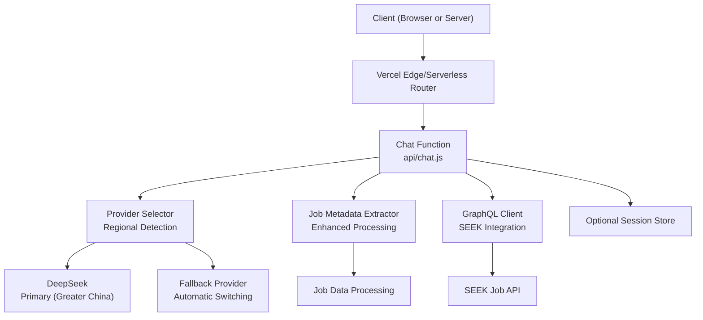
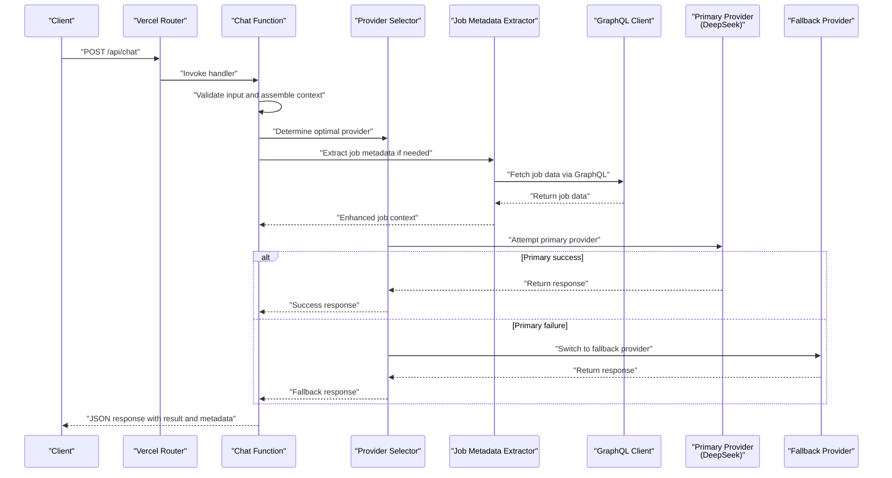
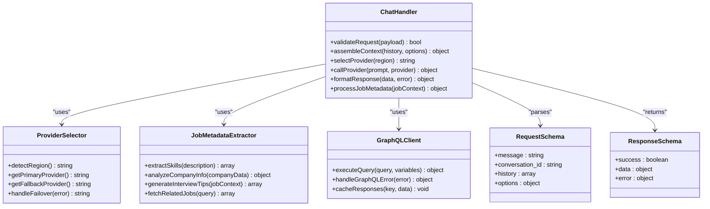
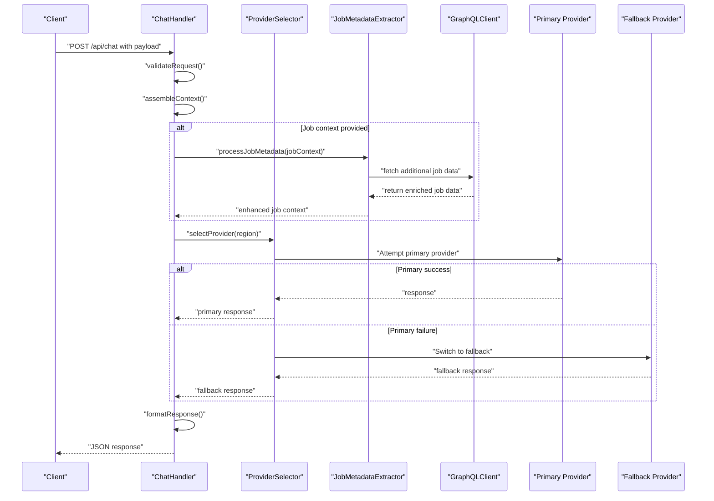
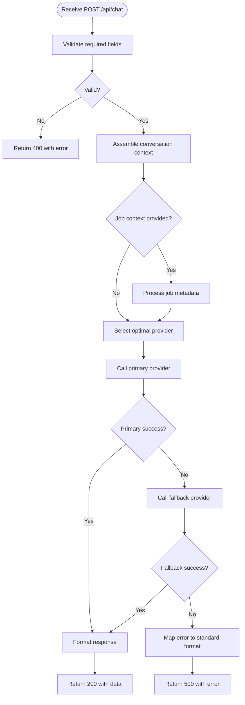
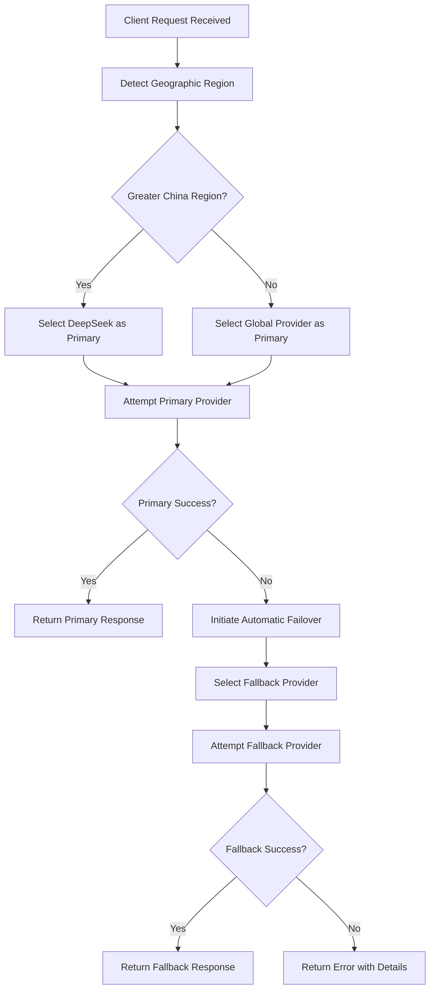
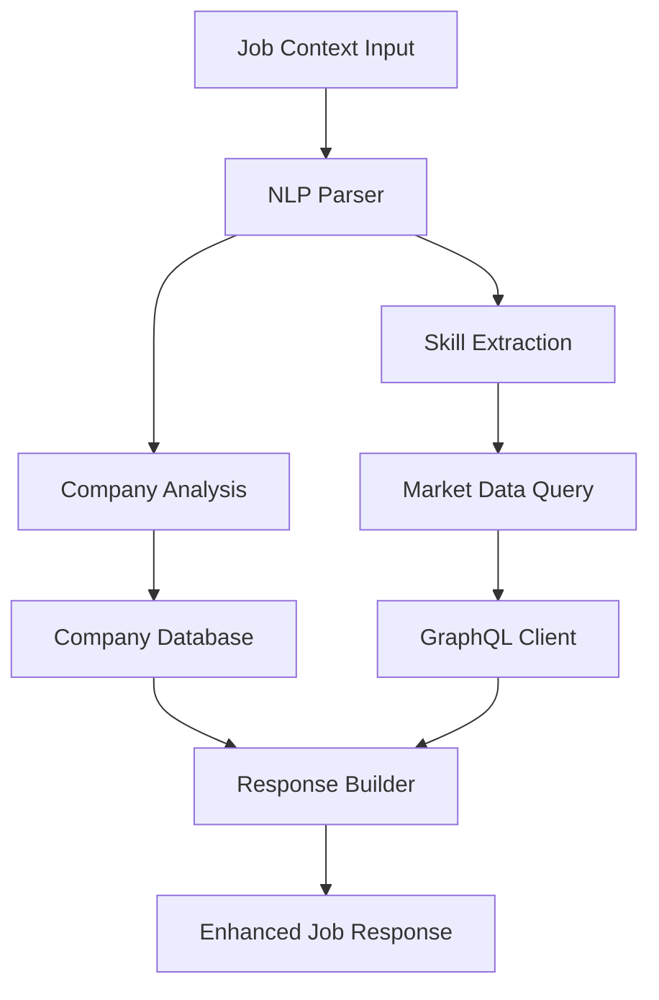
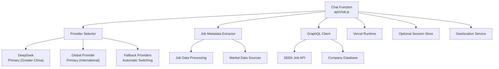

# Chat API

<cite>
**Referenced Files in This Document**
- [chat.js](file://api/chat.js)
- [package.json](file://package.json)
- [vercel.json](file://vercel.json)
- [jobMeta.js](file://src/lib/jobMeta.js)
</cite>

## Update Summary
**Changes Made**
- Enhanced job metadata extraction system integration for improved AI response handling
- Added advanced GraphQL integration capabilities for SEEK job fetching and processing
- Updated request/response schemas to support enhanced job-related query processing
- Improved conversation context management for job-specific interactions
- Expanded error handling for job metadata extraction failures and GraphQL query errors

## Table of Contents
1. [Introduction](#introduction)
2. [Project Structure](#project-structure)
3. [Core Components](#core-components)
4. [Architecture Overview](#architecture-overview)
5. [Detailed Component Analysis](#detailed-component-analysis)
6. [AI Provider Selection Logic](#ai-provider-selection-logic)
7. [Regional Routing and Failover](#regional-routing-and-failover)
8. [Job Metadata Integration](#job-metadata-integration)
9. [GraphQL Integration](#graphql-integration)
10. [Dependency Analysis](#dependency-analysis)
11. [Performance Considerations](#performance-considerations)
12. [Troubleshooting Guide](#troubleshooting-guide)
13. [Conclusion](#conclusion)
14. [Appendices](#appendices)

## Introduction
This document provides comprehensive API documentation for the Chat endpoint, focusing on the HTTP POST method used to interact with AI conversations. It covers request and response schemas, message formats, conversation state management, authentication requirements, error handling, rate limiting considerations, and security guidance. The implementation now features intelligent AI provider selection with DeepSeek prioritization for Greater China regions, enhanced automatic failover mechanisms, and advanced job metadata extraction capabilities through improved backend integration. Practical examples using curl and JavaScript fetch are included to demonstrate common use cases such as question generation, interview preparation, content analysis, and job-related queries.

## Project Structure
The Chat API is implemented as a serverless function within the api directory. The project uses a modern frontend stack and deploys via Vercel. Key files relevant to the Chat API include:
- api/chat.js: Implements the Chat endpoint logic with intelligent provider selection and job metadata integration.
- package.json: Declares dependencies and scripts.
- vercel.json: Defines deployment configuration for serverless functions.
- src/lib/jobMeta.js: Provides enhanced job metadata extraction and processing capabilities.



**Section sources**
- [chat.js](file://api/chat.js)
- [package.json](file://package.json)
- [vercel.json](file://vercel.json)
- [jobMeta.js](file://src/lib/jobMeta.js)

## Core Components
- Chat Endpoint Handler: Processes incoming POST requests, validates inputs, manages conversation context, and returns AI responses with intelligent provider routing and job metadata integration.
- Request Schema: Defines required fields such as user message, optional conversation history, and metadata like language, mode, and job-related parameters.
- Response Schema: Returns structured data including AI reply, conversation ID, status information, and enhanced job metadata when applicable.
- State Management: Maintains conversation context across messages using session identifiers or client-provided history with job-specific context preservation.
- Provider Selection Engine: Automatically selects optimal AI provider based on geographic region and availability.
- Job Metadata Extractor: Enhanced system for extracting and processing job-related information from various sources.
- GraphQL Integration: Advanced client for fetching and processing job data from SEEK and other job platforms.

Key responsibilities:
- Input validation and sanitization
- Conversation context assembly with job metadata awareness
- Intelligent AI provider selection with regional awareness
- Automatic provider failover and error recovery
- Job metadata extraction and processing
- GraphQL query execution and response handling
- Error mapping and consistent error responses
- Optional rate limiting and logging

**Section sources**
- [chat.js](file://api/chat.js)
- [jobMeta.js](file://src/lib/jobMeta.js)

## Architecture Overview
The Chat API follows an enhanced serverless architecture with intelligent provider selection and job metadata integration:
- Clients send HTTP POST requests to the Chat endpoint.
- The handler validates and processes the request payload with job metadata awareness.
- Regional detection determines optimal AI provider selection.
- Primary provider (DeepSeek for Greater China) is attempted first.
- Job metadata extraction processes job-related queries and enhances AI responses.
- GraphQL integration enables advanced job data fetching from external sources.
- Automatic failover to alternative providers if primary fails.
- The handler returns a standardized JSON response with enriched job information when applicable.



**Diagram sources**
- [chat.js](file://api/chat.js)
- [jobMeta.js](file://src/lib/jobMeta.js)

## Detailed Component Analysis

### Chat Endpoint: HTTP POST /api/chat
- Method: POST
- Path: /api/chat
- Content-Type: application/json
- Authentication: Depends on deployment configuration; see Security Considerations.
- Rate Limiting: Depends on platform limits; see Performance Considerations.

Request Body Schema:
- message: string (required) — The user's input text.
- conversation_id: string (optional) — Unique identifier to maintain conversation context.
- history: array of objects (optional) — Prior messages to provide context. Each object includes:
  - role: string — One of "user", "assistant", or "system".
  - content: string — Message text.
- options: object (optional) — Additional parameters such as:
  - language: string — Target language code.
  - mode: string — Task mode (e.g., "question_generation", "interview_prep", "content_analysis", "job_analysis").
  - temperature: number — Controls randomness (if supported by provider).
  - max_tokens: number — Limits response length (if supported by provider).
  - job_context: object (optional) — Job-related context for enhanced responses:
    - job_title: string — Job title or position.
    - industry: string — Industry or sector.
    - location: string — Geographic location.
    - experience_level: string — Required experience level.
    - skills: array of strings — Required or desired skills.
    - company_info: object (optional) — Company details for personalized responses.

Response Body Schema:
- success: boolean — Indicates whether the request succeeded.
- data: object — Contains:
  - answer: string — The AI-generated response.
  - conversation_id: string — Identifier for the current conversation.
  - provider: string — Name of the provider that handled the request.
  - usage: object (optional) — Token usage metrics if provided by provider.
  - job_metadata: object (optional) — Enhanced job information when job-related queries are processed:
    - extracted_skills: array of strings — Skills identified from job description.
    - salary_range: object (optional) — Estimated salary information.
    - company_insights: object (optional) — Company background and culture insights.
    - interview_tips: array of strings — Personalized interview preparation tips.
    - related_jobs: array of objects (optional) — Similar job opportunities.
- error: object (optional) — Present when success is false:
  - code: string — Machine-readable error code.
  - message: string — Human-readable description.
  - details: object (optional) — Additional context about the error.

Status Codes:
- 200 OK: Successful response.
- 400 Bad Request: Invalid or missing required fields.
- 401 Unauthorized: Missing or invalid authentication (if enforced).
- 429 Too Many Requests: Rate limit exceeded.
- 500 Internal Server Error: Unexpected server-side failure.

Examples:
- curl example:
  - See [curl example path](file://api/chat.js)
- JavaScript fetch example:
  - See [fetch example path](file://api/chat.js)

Conversation Context Management:
- Use conversation_id to persist context across multiple messages.
- Optionally supply history to reconstruct context without server-side storage.
- Job-specific context is preserved automatically when job_context is provided.
- Recommended pattern:
  - First message: Provide no conversation_id; store returned conversation_id.
  - Subsequent messages: Include conversation_id and optionally append prior exchanges to history.
  - Job-related conversations: Include job_context in initial message for enhanced responses.

Common Use Cases:
- Question Generation: Set options.mode to "question_generation" and provide topic or domain hints in message.
- Interview Preparation: Set options.mode to "interview_prep" and specify role or industry in message.
- Content Analysis: Set options.mode to "content_analysis" and include target text or summary instructions in message.
- Job Analysis: Set options.mode to "job_analysis" and provide job description or company information for detailed insights.
- Career Guidance: Combine job_context with general career questions for personalized advice.

**Section sources**
- [chat.js](file://api/chat.js)
- [jobMeta.js](file://src/lib/jobMeta.js)

#### Class Diagram: Chat Handler Responsibilities


**Diagram sources**
- [chat.js](file://api/chat.js)
- [jobMeta.js](file://src/lib/jobMeta.js)

#### Sequence Diagram: Typical Chat Flow with Job Metadata Integration


**Diagram sources**
- [chat.js](file://api/chat.js)
- [jobMeta.js](file://src/lib/jobMeta.js)

#### Flowchart: Input Validation and Processing


**Diagram sources**
- [chat.js](file://api/chat.js)
- [jobMeta.js](file://src/lib/jobMeta.js)

## AI Provider Selection Logic

### Regional Provider Prioritization
The Chat API implements intelligent provider selection based on geographic region detection:

**Greater China Region Priority:**
- Primary Provider: DeepSeek AI services
- Fallback Provider: Alternative regional providers
- Automatic failover on connection errors or service unavailability

**International Regions:**
- Primary Provider: Global AI services optimized for international access
- Fallback Provider: Backup providers with global coverage
- Load balancing across multiple provider instances

### Provider Selection Algorithm


**Diagram sources**
- [chat.js](file://api/chat.js)

### Enhanced Error Handling
The provider selection system includes comprehensive error handling:
- Connection timeout detection and automatic retry
- Service availability monitoring
- Graceful degradation to backup providers
- Detailed error reporting with provider-specific diagnostics
- Circuit breaker patterns to prevent cascading failures

**Section sources**
- [chat.js](file://api/chat.js)

## Regional Routing and Failover

### Geographic Detection Mechanism
The system automatically detects client geographic location through:
- IP address geolocation services
- HTTP header analysis (Accept-Language, GeoIP headers)
- DNS resolution patterns
- Network latency measurements

### Automatic Failover Strategy
When primary provider fails, the system executes automatic failover:
1. **Detection**: Monitor response times and error rates
2. **Switching**: Seamlessly redirect to fallback provider
3. **Recovery**: Continuously monitor primary provider health
4. **Restoration**: Automatically switch back when primary recovers

### Provider Health Monitoring
Continuous health checks ensure optimal provider selection:
- Real-time availability monitoring
- Performance metric tracking (latency, throughput)
- Error rate analysis and threshold-based switching
- Predictive failover based on historical performance data

**Section sources**
- [chat.js](file://api/chat.js)

## Job Metadata Integration

### Enhanced Job Metadata Extraction System
The Chat API now integrates with an advanced job metadata extraction system that provides:
- Comprehensive skill identification from job descriptions
- Company background analysis and cultural insights
- Salary range estimation based on market data
- Related job recommendations and career path suggestions
- Personalized interview preparation tips

### Job Context Processing
When job_context is provided in the request, the system performs:
- Natural language processing of job descriptions
- Skill requirement analysis and categorization
- Market value assessment for positions
- Competitive landscape analysis
- Personalized recommendation generation

### GraphQL Integration for External Data Sources
Advanced GraphQL integration enables:
- Real-time job data fetching from SEEK and other platforms
- Enriched company information retrieval
- Market trend analysis and salary benchmarking
- Dynamic skill requirement updates
- Cross-platform job opportunity aggregation



**Diagram sources**
- [jobMeta.js](file://src/lib/jobMeta.js)

**Section sources**
- [jobMeta.js](file://src/lib/jobMeta.js)

## GraphQL Integration

### Advanced GraphQL Client Implementation
The GraphQL integration provides sophisticated capabilities for:
- Dynamic query construction based on user requirements
- Efficient caching mechanisms for frequently accessed data
- Error handling and retry logic for network failures
- Rate limiting and quota management
- Response transformation and normalization

### SEEK Job Platform Integration
Specialized integration with SEEK job platform includes:
- Real-time job posting synchronization
- Advanced search and filtering capabilities
- Company profile enrichment
- Salary data aggregation and analysis
- Location-based job recommendations

### Query Optimization and Performance
GraphQL integration optimizes performance through:
- Batched query execution for multiple data points
- Intelligent caching strategies
- Lazy loading of large datasets
- Connection pooling for database operations
- Response compression and streaming

**Section sources**
- [jobMeta.js](file://src/lib/jobMeta.js)

## Dependency Analysis
The Chat function depends on:
- External AI Providers: Multiple providers with intelligent selection and failover capabilities.
- Platform Runtime: Vercel serverless environment handles routing and execution.
- Job Metadata Services: Enhanced job data extraction and processing systems.
- GraphQL Client: Advanced client for external data source integration.
- Optional Storage: If conversation persistence is required beyond client-provided history.
- Geolocation Services: For regional provider selection optimization.



**Diagram sources**
- [chat.js](file://api/chat.js)
- [jobMeta.js](file://src/lib/jobMeta.js)
- [vercel.json](file://vercel.json)

**Section sources**
- [chat.js](file://api/chat.js)
- [jobMeta.js](file://src/lib/jobMeta.js)
- [vercel.json](file://vercel.json)

## Performance Considerations
- Streaming Responses: If supported by the provider, consider streaming to reduce perceived latency.
- Prompt Optimization: Keep prompts concise and structured to minimize token usage.
- Caching: Cache frequent or identical prompts to reduce provider calls.
- Rate Limiting: Implement client-side retries with exponential backoff; monitor 429 responses.
- Concurrency: Avoid excessive parallel requests to prevent throttling.
- Provider Selection Latency: Minimize geographic detection overhead through caching.
- Failover Performance: Optimize failover detection to minimize response time impact.
- Job Metadata Processing: Implement efficient NLP processing and caching for job analysis.
- GraphQL Query Optimization: Use batched queries and intelligent caching for external data access.
- Memory Management: Monitor memory usage for large job dataset processing.

## Troubleshooting Guide
Common issues and resolutions:
- 400 Bad Request: Ensure all required fields are present and correctly typed.
- 401 Unauthorized: Verify authentication headers or tokens if enforced.
- 429 Too Many Requests: Reduce request frequency; implement backoff strategies.
- 500 Internal Server Error: Check logs for provider errors or unexpected failures.
- Provider Selection Issues: Verify geographic detection and provider availability.
- Failover Problems: Monitor provider health endpoints and network connectivity.
- Job Metadata Extraction Errors: Check input format and validate job context structure.
- GraphQL Query Failures: Verify API keys and network connectivity to external services.
- Performance Degradation: Monitor cache hit rates and optimize query patterns.

Debugging tips:
- Log request payloads and responses (excluding sensitive data).
- Validate conversation_id consistency across messages.
- Inspect provider error codes and map them to user-friendly messages.
- Monitor provider selection decisions and failover triggers.
- Track geographic detection accuracy and provider performance metrics.
- Analyze job metadata extraction accuracy and field completeness.
- Monitor GraphQL query performance and error rates.
- Implement structured logging for job processing workflows.

**Section sources**
- [chat.js](file://api/chat.js)
- [jobMeta.js](file://src/lib/jobMeta.js)

## Conclusion
The Chat API provides a sophisticated interface for AI-driven conversations with intelligent provider selection, regional optimization, robust failover mechanisms, and advanced job metadata integration. The enhanced architecture ensures reliable service delivery across different geographic regions while maintaining high performance and availability. With the new job metadata extraction system and GraphQL integration, clients can build resilient interactive experiences that provide comprehensive job analysis, personalized interview preparation, and career guidance. By managing conversation context through conversation_id and optional history, combined with automatic provider selection and enhanced job processing, the API supports diverse use cases including question generation, interview preparation, content analysis, and comprehensive job-related queries. Follow security best practices and performance recommendations to ensure optimal operation.

## Appendices

### Authentication Requirements
- If enforced, include appropriate headers (e.g., Authorization) as configured by the deployment.
- For development, disable or mock authentication as needed.

**Section sources**
- [chat.js](file://api/chat.js)
- [vercel.json](file://vercel.json)

### Security Considerations
- Sanitize inputs to prevent injection attacks.
- Validate and restrict allowed modes and options.
- Avoid logging sensitive data.
- Enforce HTTPS and secure headers at the platform level.
- Secure provider API keys and credentials.
- Implement proper CORS policies for cross-origin requests.
- Validate job context inputs to prevent malicious data processing.
- Secure GraphQL API keys and external service credentials.
- Implement input validation for job metadata extraction.

**Section sources**
- [chat.js](file://api/chat.js)
- [jobMeta.js](file://src/lib/jobMeta.js)

### Practical Examples

- curl Example:
  - See [curl example path](file://api/chat.js)

- JavaScript Fetch Example:
  - See [fetch example path](file://api/chat.js)

### Provider Configuration
The system supports dynamic provider configuration through environment variables:
- DEEPSEEK_API_KEY: Primary provider key for Greater China region
- GLOBAL_PROVIDER_API_KEY: International provider key
- FALLBACK_PROVIDER_API_KEY: Backup provider key
- GEO_SERVICE_ENDPOINT: Geolocation service configuration
- GRAPHQL_API_KEY: GraphQL service authentication
- SEEK_API_KEY: SEEK platform integration key
- JOB_METADATA_SERVICE_URL: Job metadata processing service endpoint

**Section sources**
- [chat.js](file://api/chat.js)
- [jobMeta.js](file://src/lib/jobMeta.js)

### Enhanced Job Context Examples

Example job context for interview preparation:
```json
{
  "job_context": {
    "job_title": "Senior Software Engineer",
    "industry": "Technology",
    "location": "Sydney, Australia",
    "experience_level": "Senior",
    "skills": ["JavaScript", "React", "Node.js", "AWS"],
    "company_info": {
      "name": "Tech Startup Inc.",
      "size": "50-200 employees",
      "culture": "Fast-paced, innovative"
    }
  }
}
```

Example job analysis request:
```json
{
  "message": "Analyze this job description and provide interview preparation tips",
  "options": {
    "mode": "job_analysis",
    "language": "en"
  },
  "job_context": {
    "job_description": "Full job description text...",
    "required_skills": ["Python", "Machine Learning", "TensorFlow"],
    "preferred_qualifications": ["PhD in Computer Science", "5+ years experience"]
  }
}
```

[No additional sources needed since examples reference chat.js and jobMeta.js]