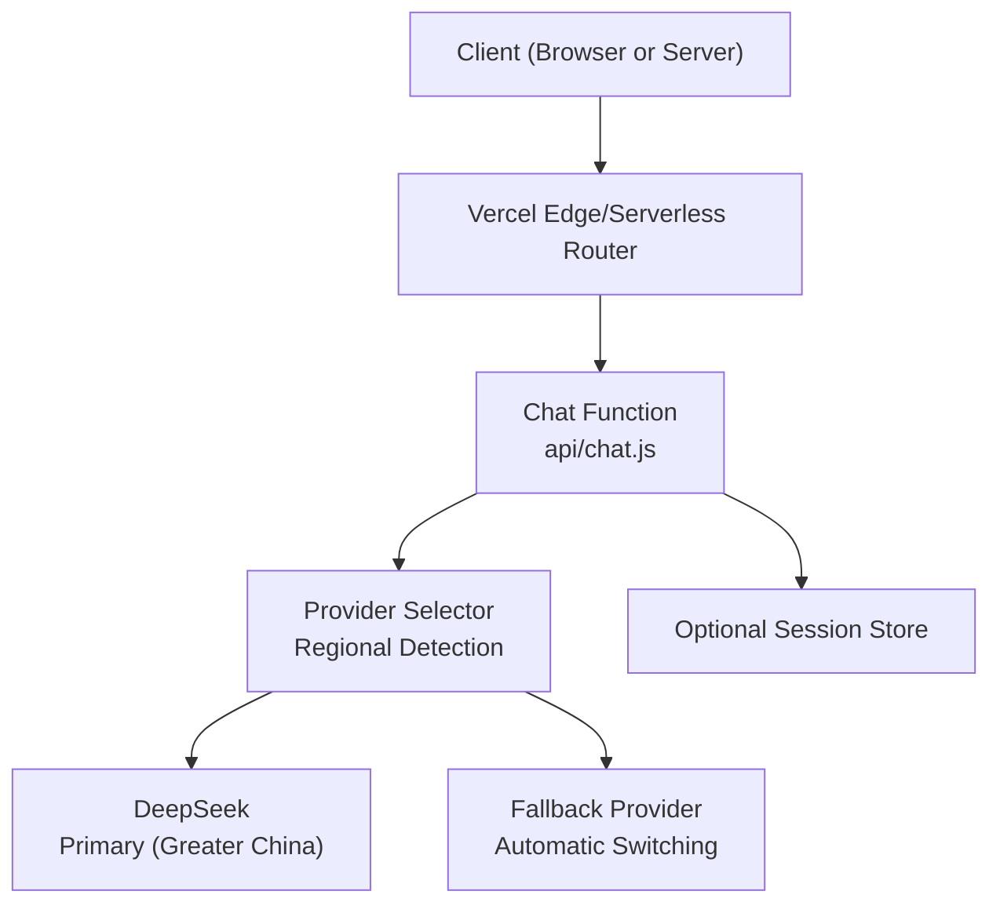
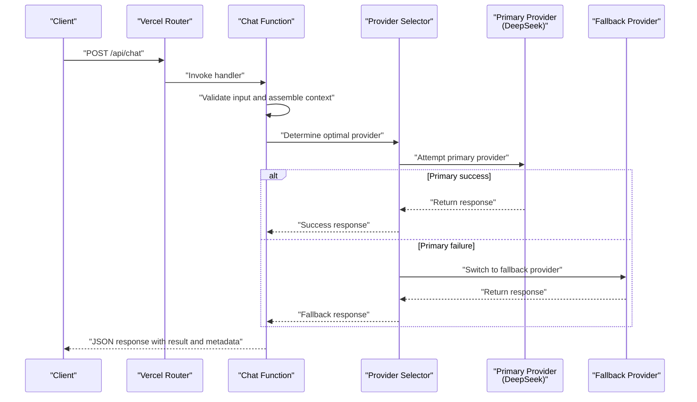
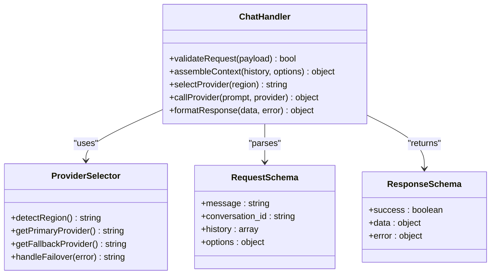
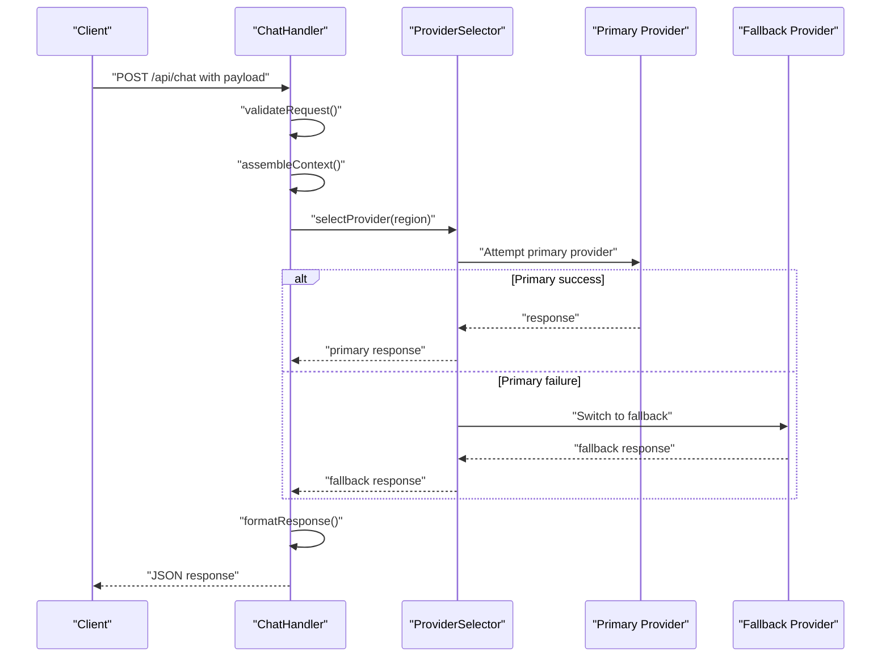
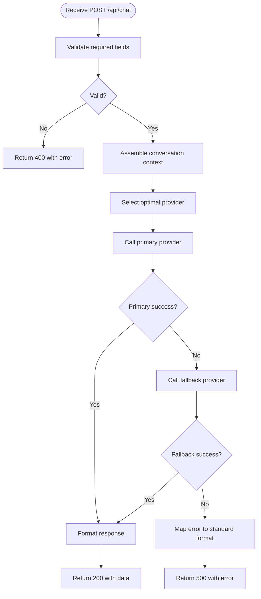
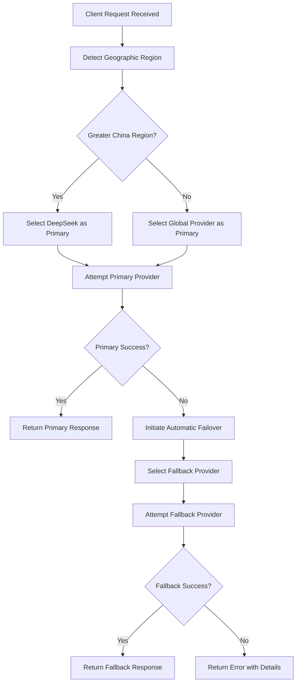
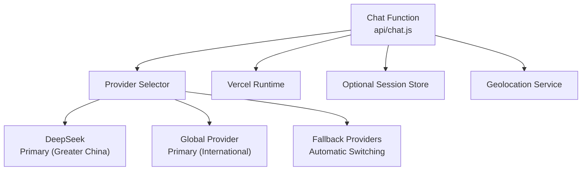

# Chat API

<cite>
**Referenced Files in This Document**
- [chat.js](file://api/chat.js)
- [package.json](file://package.json)
- [vercel.json](file://vercel.json)
</cite>

## Update Summary
**Changes Made**
- Updated AI provider selection logic documentation to reflect DeepSeek-first approach for Greater China regions
- Revised regional routing mechanism documentation replacing previous Gemini fallback system
- Enhanced error handling and automatic provider switching documentation
- Updated architecture diagrams to show new provider selection flow
- Added detailed sections on regional routing and provider failover mechanisms

## Table of Contents
1. [Introduction](#introduction)
2. [Project Structure](#project-structure)
3. [Core Components](#core-components)
4. [Architecture Overview](#architecture-overview)
5. [Detailed Component Analysis](#detailed-component-analysis)
6. [AI Provider Selection Logic](#ai-provider-selection-logic)
7. [Regional Routing and Failover](#regional-routing-and-failover)
8. [Dependency Analysis](#dependency-analysis)
9. [Performance Considerations](#performance-considerations)
10. [Troubleshooting Guide](#troubleshooting-guide)
11. [Conclusion](#conclusion)
12. [Appendices](#appendices)

## Introduction
This document provides comprehensive API documentation for the Chat endpoint, focusing on the HTTP POST method used to interact with AI conversations. It covers request and response schemas, message formats, conversation state management, authentication requirements, error handling, rate limiting considerations, and security guidance. The implementation now features intelligent AI provider selection with DeepSeek prioritization for Greater China regions and enhanced automatic failover mechanisms. Practical examples using curl and JavaScript fetch are included to demonstrate common use cases such as question generation, interview preparation, and content analysis.

## Project Structure
The Chat API is implemented as a serverless function within the api directory. The project uses a modern frontend stack and deploys via Vercel. Key files relevant to the Chat API include:
- api/chat.js: Implements the Chat endpoint logic with intelligent provider selection.
- package.json: Declares dependencies and scripts.
- vercel.json: Defines deployment configuration for serverless functions.

**Section sources**
- [chat.js](file://api/chat.js)
- [package.json](file://package.json)
- [vercel.json](file://vercel.json)

## Core Components
- Chat Endpoint Handler: Processes incoming POST requests, validates inputs, manages conversation context, and returns AI responses with intelligent provider routing.
- Request Schema: Defines required fields such as user message, optional conversation history, and metadata like language or mode.
- Response Schema: Returns structured data including AI reply, conversation ID, and status information.
- State Management: Maintains conversation context across messages using session identifiers or client-provided history.
- Provider Selection Engine: Automatically selects optimal AI provider based on geographic region and availability.

Key responsibilities:
- Input validation and sanitization
- Conversation context assembly
- Intelligent AI provider selection with regional awareness
- Automatic provider failover and error recovery
- Error mapping and consistent error responses
- Optional rate limiting and logging

**Section sources**
- [chat.js](file://api/chat.js)

## Architecture Overview
The Chat API follows an enhanced serverless architecture with intelligent provider selection:
- Clients send HTTP POST requests to the Chat endpoint.
- The handler validates and processes the request payload.
- Regional detection determines optimal AI provider selection.
- Primary provider (DeepSeek for Greater China) is attempted first.
- Automatic failover to alternative providers if primary fails.
- The handler returns a standardized JSON response.

**Diagram sources**
- [chat.js](file://api/chat.js)

## Detailed Component Analysis

### Chat Endpoint: HTTP POST /api/chat
- Method: POST
- Path: /api/chat
- Content-Type: application/json
- Authentication: Depends on deployment configuration; see Security Considerations.
- Rate Limiting: Depends on platform limits; see Performance Considerations.

Request Body Schema:
- message: string (required) — The user's input text.
- conversation_id: string (optional) — Unique identifier to maintain conversation context.
- history: array of objects (optional) — Prior messages to provide context. Each object includes:
  - role: string — One of "user", "assistant", or "system".
  - content: string — Message text.
- options: object (optional) — Additional parameters such as:
  - language: string — Target language code.
  - mode: string — Task mode (e.g., "question_generation", "interview_prep", "content_analysis").
  - temperature: number — Controls randomness (if supported by provider).
  - max_tokens: number — Limits response length (if supported by provider).

Response Body Schema:
- success: boolean — Indicates whether the request succeeded.
- data: object — Contains:
  - answer: string — The AI-generated response.
  - conversation_id: string — Identifier for the current conversation.
  - provider: string — Name of the provider that handled the request.
  - usage: object (optional) — Token usage metrics if provided by provider.
- error: object (optional) — Present when success is false:
  - code: string — Machine-readable error code.
  - message: string — Human-readable description.
  - details: object (optional) — Additional context about the error.

Status Codes:
- 200 OK: Successful response.
- 400 Bad Request: Invalid or missing required fields.
- 401 Unauthorized: Missing or invalid authentication (if enforced).
- 429 Too Many Requests: Rate limit exceeded.
- 500 Internal Server Error: Unexpected server-side failure.

Examples:
- curl example:
  - See [curl example path](file://api/chat.js)
- JavaScript fetch example:
  - See [fetch example path](file://api/chat.js)

Conversation Context Management:
- Use conversation_id to persist context across multiple messages.
- Optionally supply history to reconstruct context without server-side storage.
- Recommended pattern:
  - First message: Provide no conversation_id; store returned conversation_id.
  - Subsequent messages: Include conversation_id and optionally append prior exchanges to history.

Common Use Cases:
- Question Generation: Set options.mode to "question_generation" and provide topic or domain hints in message.
- Interview Preparation: Set options.mode to "interview_prep" and specify role or industry in message.
- Content Analysis: Set options.mode to "content_analysis" and include target text or summary instructions in message.

**Section sources**
- [chat.js](file://api/chat.js)

#### Class Diagram: Chat Handler Responsibilities

**Diagram sources**
- [chat.js](file://api/chat.js)

#### Sequence Diagram: Typical Chat Flow with Provider Selection

**Diagram sources**
- [chat.js](file://api/chat.js)

#### Flowchart: Input Validation and Processing

**Diagram sources**
- [chat.js](file://api/chat.js)

## AI Provider Selection Logic

### Regional Provider Prioritization
The Chat API implements intelligent provider selection based on geographic region detection:

**Greater China Region Priority:**
- Primary Provider: DeepSeek AI services
- Fallback Provider: Alternative regional providers
- Automatic failover on connection errors or service unavailability

**International Regions:**
- Primary Provider: Global AI services optimized for international access
- Fallback Provider: Backup providers with global coverage
- Load balancing across multiple provider instances

### Provider Selection Algorithm

**Diagram sources**
- [chat.js](file://api/chat.js)

### Enhanced Error Handling
The provider selection system includes comprehensive error handling:
- Connection timeout detection and automatic retry
- Service availability monitoring
- Graceful degradation to backup providers
- Detailed error reporting with provider-specific diagnostics
- Circuit breaker patterns to prevent cascading failures

**Section sources**
- [chat.js](file://api/chat.js)

## Regional Routing and Failover

### Geographic Detection Mechanism
The system automatically detects client geographic location through:
- IP address geolocation services
- HTTP header analysis (Accept-Language, GeoIP headers)
- DNS resolution patterns
- Network latency measurements

### Automatic Failover Strategy
When primary provider fails, the system executes automatic failover:
1. **Detection**: Monitor response times and error rates
2. **Switching**: Seamlessly redirect to fallback provider
3. **Recovery**: Continuously monitor primary provider health
4. **Restoration**: Automatically switch back when primary recovers

### Provider Health Monitoring
Continuous health checks ensure optimal provider selection:
- Real-time availability monitoring
- Performance metric tracking (latency, throughput)
- Error rate analysis and threshold-based switching
- Predictive failover based on historical performance data

**Section sources**
- [chat.js](file://api/chat.js)

## Dependency Analysis
The Chat function depends on:
- External AI Providers: Multiple providers with intelligent selection and failover capabilities.
- Platform Runtime: Vercel serverless environment handles routing and execution.
- Optional Storage: If conversation persistence is required beyond client-provided history.
- Geolocation Services: For regional provider selection optimization.

**Diagram sources**
- [chat.js](file://api/chat.js)
- [vercel.json](file://vercel.json)

**Section sources**
- [chat.js](file://api/chat.js)
- [vercel.json](file://vercel.json)

## Performance Considerations
- Streaming Responses: If supported by the provider, consider streaming to reduce perceived latency.
- Prompt Optimization: Keep prompts concise and structured to minimize token usage.
- Caching: Cache frequent or identical prompts to reduce provider calls.
- Rate Limiting: Implement client-side retries with exponential backoff; monitor 429 responses.
- Concurrency: Avoid excessive parallel requests to prevent throttling.
- Provider Selection Latency: Minimize geographic detection overhead through caching.
- Failover Performance: Optimize failover detection to minimize response time impact.

## Troubleshooting Guide
Common issues and resolutions:
- 400 Bad Request: Ensure all required fields are present and correctly typed.
- 401 Unauthorized: Verify authentication headers or tokens if enforced.
- 429 Too Many Requests: Reduce request frequency; implement backoff strategies.
- 500 Internal Server Error: Check logs for provider errors or unexpected failures.
- Provider Selection Issues: Verify geographic detection and provider availability.
- Failover Problems: Monitor provider health endpoints and network connectivity.

Debugging tips:
- Log request payloads and responses (excluding sensitive data).
- Validate conversation_id consistency across messages.
- Inspect provider error codes and map them to user-friendly messages.
- Monitor provider selection decisions and failover triggers.
- Track geographic detection accuracy and provider performance metrics.

**Section sources**
- [chat.js](file://api/chat.js)

## Conclusion
The Chat API provides a sophisticated interface for AI-driven conversations with intelligent provider selection, regional optimization, and robust failover mechanisms. The enhanced architecture ensures reliable service delivery across different geographic regions while maintaining high performance and availability. By managing conversation context through conversation_id and optional history, combined with automatic provider selection, clients can build resilient interactive experiences such as question generation, interview preparation, and content analysis. Follow security best practices and performance recommendations to ensure optimal operation.

## Appendices

### Authentication Requirements
- If enforced, include appropriate headers (e.g., Authorization) as configured by the deployment.
- For development, disable or mock authentication as needed.

**Section sources**
- [chat.js](file://api/chat.js)
- [vercel.json](file://vercel.json)

### Security Considerations
- Sanitize inputs to prevent injection attacks.
- Validate and restrict allowed modes and options.
- Avoid logging sensitive data.
- Enforce HTTPS and secure headers at the platform level.
- Secure provider API keys and credentials.
- Implement proper CORS policies for cross-origin requests.

**Section sources**
- [chat.js](file://api/chat.js)

### Practical Examples

- curl Example:
  - See [curl example path](file://api/chat.js)

- JavaScript Fetch Example:
  - See [fetch example path](file://api/chat.js)

### Provider Configuration
The system supports dynamic provider configuration through environment variables:
- DEEPSEEK_API_KEY: Primary provider key for Greater China region
- GLOBAL_PROVIDER_API_KEY: International provider key
- FALLBACK_PROVIDER_API_KEY: Backup provider key
- GEO_SERVICE_ENDPOINT: Geolocation service configuration

**Section sources**
- [chat.js](file://api/chat.js)

[No additional sources needed since examples reference chat.js]