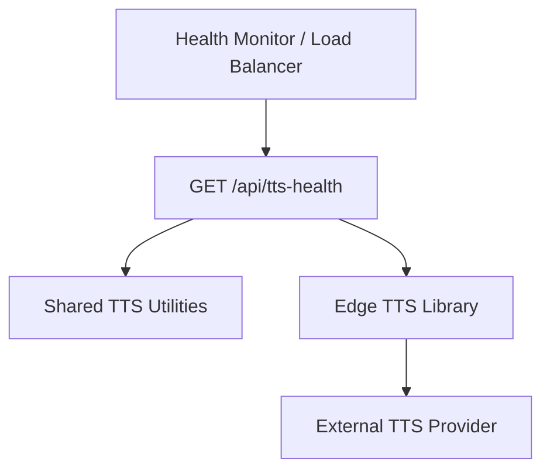
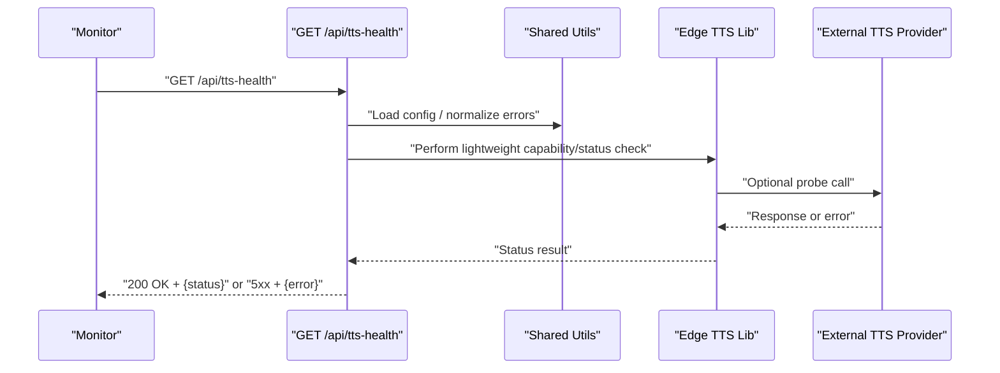
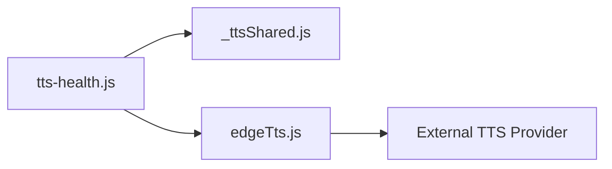

# TTS Health Check API

<cite>
**Referenced Files in This Document**
- [tts-health.js](file://api/tts-health.js)
- [edgeTts.js](file://lib/edgeTts.js)
- [_ttsShared.js](file://api/_ttsShared.js)
</cite>

## Table of Contents
1. [Introduction](#introduction)
2. [Project Structure](#project-structure)
3. [Core Components](#core-components)
4. [Architecture Overview](#architecture-overview)
5. [Detailed Component Analysis](#detailed-component-analysis)
6. [Dependency Analysis](#dependency-analysis)
7. [Performance Considerations](#performance-considerations)
8. [Troubleshooting Guide](#troubleshooting-guide)
9. [Conclusion](#conclusion)

## Introduction
This document describes the TTS Health Check endpoint used to monitor the availability and readiness of the Text-to-Speech (TTS) service. It covers the GET method, response formats for indicating service status, integration patterns for health monitoring systems, example requests and responses, troubleshooting steps when the service is unavailable, and recommended retry strategies and fallback mechanisms for production deployments.

## Project Structure
The TTS Health Check endpoint is implemented as a serverless function under the api directory. The implementation depends on shared utilities and the underlying TTS library.

**Diagram sources**
- [tts-health.js:1-200](file://api/tts-health.js#L1-L200)
- [_ttsShared.js:1-200](file://api/_ttsShared.js#L1-L200)
- [edgeTts.js:1-200](file://lib/edgeTts.js#L1-L200)

**Section sources**
- [tts-health.js:1-200](file://api/tts-health.js#L1-L200)
- [_ttsShared.js:1-200](file://api/_ttsShared.js#L1-L200)
- [edgeTts.js:1-200](file://lib/edgeTts.js#L1-L200)

## Core Components
- Health Check Handler: Implements the GET endpoint that returns a concise status payload suitable for liveness/readiness probes.
- Shared Utilities: Provide common helpers such as configuration access, logging, and error normalization used by the health check.
- Edge TTS Library: Encapsulates calls to the external TTS provider; the health check may perform a lightweight validation or capability check through this layer.

Key responsibilities:
- Return HTTP 200 with a minimal JSON body when the TTS subsystem is healthy.
- Return HTTP 5xx with an informative error payload when the subsystem is unhealthy.
- Avoid heavy operations (e.g., long audio synthesis) to keep latency low.

**Section sources**
- [tts-health.js:1-200](file://api/tts-health.js#L1-L200)
- [_ttsShared.js:1-200](file://api/_ttsShared.js#L1-L200)
- [edgeTts.js:1-200](file://lib/edgeTts.js#L1-L200)

## Architecture Overview
The health check follows a thin handler pattern: it validates inputs, performs a lightweight check against the TTS subsystem, and returns a standardized response.

**Diagram sources**
- [tts-health.js:1-200](file://api/tts-health.js#L1-L200)
- [_ttsShared.js:1-200](file://api/_ttsShared.js#L1-L200)
- [edgeTts.js:1-200](file://lib/edgeTts.js#L1-L200)

## Detailed Component Analysis

### Endpoint: GET /api/tts-health
Purpose:
- Provide a fast, idempotent signal about the health of the TTS subsystem.
- Support both liveness and readiness checks depending on what the handler verifies.

Request:
- Method: GET
- Path: /api/tts-health
- Headers: None required
- Query parameters: None required

Response:
- Success (HTTP 200):
  - Body: JSON object containing at least a status field indicating health.
  - Example shape: {"status": "ok"}
- Failure (HTTP 5xx):
  - Body: JSON object describing the failure reason.
  - Example shape: {"error": "message"}

Notes:
- Keep the payload minimal to reduce cold start overhead and bandwidth usage.
- Avoid generating audio content during health checks.

Integration patterns:
- Liveness probe: Use a simple GET that returns 200 if the process can respond.
- Readiness probe: Use a GET that also validates connectivity to the TTS provider before returning 200.

Retry strategy:
- Exponential backoff with jitter across retries.
- Cap maximum retries based on deployment SLAs.
- Circuit breaker behavior after consecutive failures to avoid cascading load.

Fallback mechanisms:
- If the health check fails, route traffic away from instances reporting unhealthy.
- For client-side integrations, degrade gracefully by queuing or deferring TTS tasks until the service recovers.

**Section sources**
- [tts-health.js:1-200](file://api/tts-health.js#L1-L200)

### Shared Utilities (_ttsShared.js)
Responsibilities:
- Centralized configuration access (e.g., timeouts, feature flags).
- Common error formatting and logging helpers used by the health check.
- Optional helper functions for lightweight validations.

Usage in health check:
- Normalize errors into a consistent JSON structure.
- Apply configured timeouts to prevent slow health checks.

**Section sources**
- [_ttsShared.js:1-200](file://api/_ttsShared.js#L1-L200)

### Edge TTS Library (edgeTts.js)
Responsibilities:
- Encapsulate interactions with the external TTS provider.
- Provide methods suitable for quick capability or connectivity checks.

Usage in health check:
- Perform a minimal operation (such as listing available voices or validating credentials) without synthesizing audio.
- Surface provider-specific errors in a normalized format.

**Section sources**
- [edgeTts.js:1-200](file://lib/edgeTts.js#L1-L200)

## Dependency Analysis
The health check has minimal dependencies to ensure fast startup and low resource consumption.

**Diagram sources**
- [tts-health.js:1-200](file://api/tts-health.js#L1-L200)
- [_ttsShared.js:1-200](file://api/_ttsShared.js#L1-L200)
- [edgeTts.js:1-200](file://lib/edgeTts.js#L1-L200)

**Section sources**
- [tts-health.js:1-200](file://api/tts-health.js#L1-L200)
- [_ttsShared.js:1-200](file://api/_ttsShared.js#L1-L200)
- [edgeTts.js:1-200](file://lib/edgeTts.js#L1-L200)

## Performance Considerations
- Keep the health check lightweight: no audio generation, minimal network calls.
- Configure short timeouts to fail fast when the provider is slow.
- Cache any non-volatile capability metadata if appropriate to reduce repeated calls.
- Ensure the handler is stateless to scale horizontally.

[No sources needed since this section provides general guidance]

## Troubleshooting Guide
Common issues and resolutions:
- HTTP 5xx with error message:
  - Inspect the error payload for details.
  - Verify provider credentials and network connectivity.
  - Check logs for upstream timeouts or rate limits.
- Repeated failures:
  - Enable circuit breaker to protect downstream services.
  - Review retry/backoff settings and adjust thresholds.
- High latency:
  - Reduce timeout values.
  - Validate DNS resolution and TLS handshake performance.
- Cold starts:
  - Minimize initialization work in the handler.
  - Pre-warm endpoints if supported by your platform.

Operational tips:
- Instrument success/failure counts and latency percentiles.
- Alert on sustained failure windows rather than single spikes.
- Maintain runbooks for credential rotation and provider outages.

**Section sources**
- [tts-health.js:1-200](file://api/tts-health.js#L1-L200)
- [_ttsShared.js:1-200](file://api/_ttsShared.js#L1-L200)

## Conclusion
The TTS Health Check endpoint provides a fast, reliable signal for monitoring the availability of the TTS subsystem. By keeping the request lightweight, standardizing responses, and integrating robust retry and fallback strategies, teams can maintain high availability and quickly detect and recover from provider issues.

[No sources needed since this section summarizes without analyzing specific files]