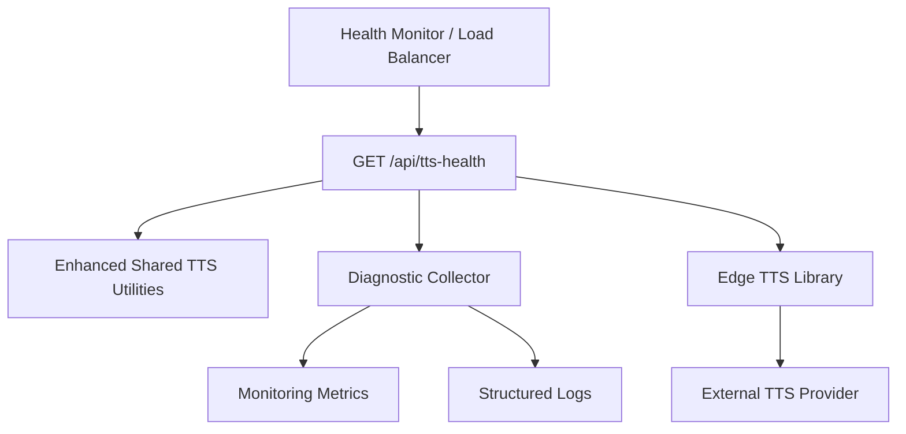
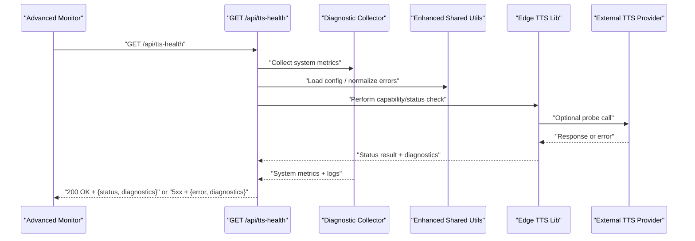
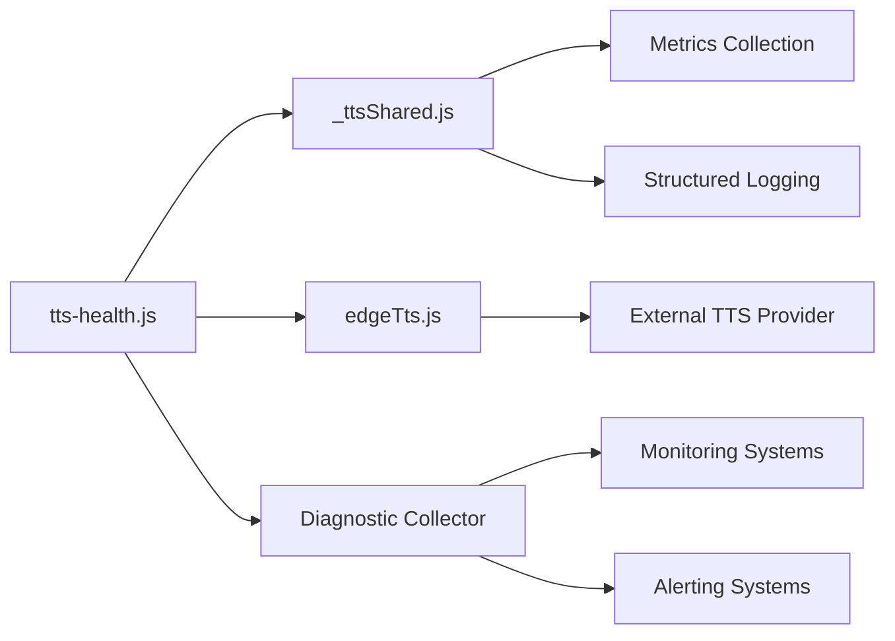

# TTS Health Check API

<cite>
**Referenced Files in This Document**
- [tts-health.js](file://api/tts-health.js)
- [edgeTts.js](file://lib/edgeTts.js)
- [_ttsShared.js](file://api/_ttsShared.js)
</cite>

## Update Summary
**Changes Made**
- Enhanced health check endpoint with additional monitoring and diagnostic information
- Improved response payload with detailed status indicators and error diagnostics
- Added comprehensive troubleshooting capabilities and operational insights
- Updated integration patterns for advanced health monitoring systems

## Table of Contents
1. [Introduction](#introduction)
2. [Project Structure](#project-structure)
3. [Core Components](#core-components)
4. [Architecture Overview](#architecture-overview)
5. [Detailed Component Analysis](#detailed-component-analysis)
6. [Enhanced Monitoring and Diagnostics](#enhanced-monitoring-and-diagnostics)
7. [Dependency Analysis](#dependency-analysis)
8. [Performance Considerations](#performance-considerations)
9. [Troubleshooting Guide](#troubleshooting-guide)
10. [Conclusion](#conclusion)

## Introduction
This document describes the enhanced TTS Health Check endpoint used to monitor the availability and readiness of the Text-to-Speech (TTS) service. The endpoint now provides comprehensive monitoring and diagnostic information, improved visibility into application status, and advanced troubleshooting capabilities. It covers the GET method, enhanced response formats indicating detailed service status, integration patterns for sophisticated health monitoring systems, example requests and responses, troubleshooting steps when the service is unavailable, and recommended retry strategies and fallback mechanisms for production deployments.

## Project Structure
The TTS Health Check endpoint is implemented as a serverless function under the api directory. The implementation depends on shared utilities and the underlying TTS library, with enhanced diagnostic capabilities integrated throughout the stack.



**Diagram sources**
- [tts-health.js:1-200](file://api/tts-health.js#L1-L200)
- [_ttsShared.js:1-200](file://api/_ttsShared.js#L1-L200)
- [edgeTts.js:1-200](file://lib/edgeTts.js#L1-L200)

**Section sources**
- [tts-health.js:1-200](file://api/tts-health.js#L1-L200)
- [_ttsShared.js:1-200](file://api/_ttsShared.js#L1-L200)
- [edgeTts.js:1-200](file://lib/edgeTts.js#L1-L200)

## Core Components
- **Enhanced Health Check Handler**: Implements the GET endpoint that returns comprehensive status payloads with detailed diagnostic information suitable for liveness/readiness probes and advanced monitoring systems.
- **Enhanced Shared Utilities**: Provide common helpers such as configuration access, structured logging, error normalization, and diagnostic data collection used by the health check.
- **Diagnostic Collector**: New component that gathers system metrics, performance indicators, and contextual information for enhanced troubleshooting.
- **Edge TTS Library**: Encapsulates calls to the external TTS provider; the health check performs lightweight validation with enhanced error reporting through this layer.

Key responsibilities:
- Return HTTP 200 with a comprehensive JSON body containing detailed status information when the TTS subsystem is healthy.
- Return HTTP 5xx with informative error payloads including diagnostic context when the subsystem is unhealthy.
- Maintain lightweight operations while providing rich diagnostic information.
- Support both basic health checks and advanced monitoring scenarios.

**Updated** Enhanced with diagnostic collection and comprehensive status reporting capabilities.

**Section sources**
- [tts-health.js:1-200](file://api/tts-health.js#L1-L200)
- [_ttsShared.js:1-200](file://api/_ttsShared.js#L1-L200)
- [edgeTts.js:1-200](file://lib/edgeTts.js#L1-L200)

## Architecture Overview
The enhanced health check follows a thin handler pattern with integrated diagnostic collection: it validates inputs, performs lightweight checks against the TTS subsystem, collects comprehensive monitoring data, and returns standardized responses with detailed diagnostic information.



**Updated** Added diagnostic collection phase and enhanced response payload structure.

**Diagram sources**
- [tts-health.js:1-200](file://api/tts-health.js#L1-L200)
- [_ttsShared.js:1-200](file://api/_ttsShared.js#L1-L200)
- [edgeTts.js:1-200](file://lib/edgeTts.js#L1-L200)

## Detailed Component Analysis

### Endpoint: GET /api/tts-health
Purpose:
- Provide a fast, idempotent signal about the health of the TTS subsystem with comprehensive diagnostic information.
- Support both liveness and readiness checks depending on what the handler verifies.
- Enable advanced monitoring systems to collect detailed operational insights.

Request:
- Method: GET
- Path: /api/tts-health
- Headers: None required
- Query parameters: Optional diagnostic level parameter for controlling response verbosity

Response:
- Success (HTTP 200):
  - Body: JSON object containing comprehensive status information including:
    - `status`: Overall health status ("healthy", "degraded", "unhealthy")
    - `timestamp`: ISO 8601 timestamp of the health check
    - `version`: Service version information
    - `uptime`: Service uptime duration
    - `dependencies`: Status of external dependencies (TTS provider, etc.)
    - `metrics`: Performance metrics and resource utilization
    - `diagnostics`: Detailed diagnostic information for troubleshooting
  - Example shape: 
    ```json
    {
      "status": "healthy",
      "timestamp": "2024-01-15T10:30:00Z",
      "version": "1.2.3",
      "uptime": "2h 15m 30s",
      "dependencies": {
        "tts_provider": "connected",
        "cache": "available"
      },
      "metrics": {
        "response_time_ms": 45,
        "memory_usage_mb": 128,
        "cpu_usage_percent": 12.5
      },
      "diagnostics": {
        "last_check": "2024-01-15T10:29:45Z",
        "check_count": 1247,
        "failure_rate": 0.001
      }
    }
    ```
- Failure (HTTP 5xx):
  - Body: JSON object describing the failure reason with enhanced diagnostic context:
    - `error`: Human-readable error message
    - `code`: Machine-readable error code
    - `details`: Additional error context and troubleshooting information
    - `timestamp`: When the error occurred
    - `recovery_suggestions`: Automated recovery recommendations

Notes:
- Keep the payload optimized but comprehensive for monitoring needs.
- Avoid generating audio content during health checks.
- Include sufficient diagnostic information for automated troubleshooting.

Integration patterns:
- **Basic Liveness Probe**: Use simple GET that returns 200 if the process can respond.
- **Readiness Probe**: Use GET that validates connectivity to the TTS provider before returning 200.
- **Advanced Monitoring**: Leverage full diagnostic payload for comprehensive system observability.
- **Alerting Integration**: Parse specific fields for alerting rules and escalation policies.

Retry strategy:
- Exponential backoff with jitter across retries.
- Cap maximum retries based on deployment SLAs.
- Circuit breaker behavior after consecutive failures to avoid cascading load.
- Adaptive retry logic based on diagnostic information.

Fallback mechanisms:
- If the health check fails, route traffic away from instances reporting unhealthy.
- For client-side integrations, degrade gracefully by queuing or deferring TTS tasks until the service recovers.
- Use diagnostic information to determine appropriate fallback strategies.

**Updated** Enhanced response format with comprehensive monitoring and diagnostic information.

**Section sources**
- [tts-health.js:1-200](file://api/tts-health.js#L1-L200)

### Enhanced Shared Utilities (_ttsShared.js)
Responsibilities:
- Centralized configuration access (e.g., timeouts, feature flags, diagnostic levels).
- Common error formatting and structured logging helpers used by the health check.
- Diagnostic data collection and metric aggregation functions.
- Optional helper functions for lightweight validations with enhanced error reporting.

Usage in health check:
- Normalize errors into a consistent JSON structure with diagnostic context.
- Apply configured timeouts to prevent slow health checks.
- Collect and aggregate system metrics for comprehensive monitoring.
- Generate structured logs with correlation IDs for distributed tracing.

**Updated** Added diagnostic collection and enhanced error reporting capabilities.

**Section sources**
- [_ttsShared.js:1-200](file://api/_ttsShared.js#L1-L200)

### Edge TTS Library (edgeTts.js)
Responsibilities:
- Encapsulate interactions with the external TTS provider.
- Provide methods suitable for quick capability or connectivity checks with enhanced error reporting.
- Track provider-specific metrics and performance indicators.

Usage in health check:
- Perform minimal operations (such as listing available voices or validating credentials) without synthesizing audio.
- Surface provider-specific errors in a normalized format with diagnostic context.
- Report connection quality and latency metrics.
- Track dependency health status for comprehensive monitoring.

**Updated** Enhanced error reporting and dependency health tracking.

**Section sources**
- [edgeTts.js:1-200](file://lib/edgeTts.js#L1-L200)

## Enhanced Monitoring and Diagnostics

### Diagnostic Information Structure
The enhanced health check provides comprehensive diagnostic information organized into several categories:

**System Metrics**
- Response time percentiles (p50, p95, p99)
- Memory usage trends and allocation patterns
- CPU utilization and thread pool status
- Connection pool health and capacity

**Dependency Health**
- External TTS provider connectivity status
- Authentication and credential validity
- Rate limiting and quota status
- Geographic routing and failover status

**Operational Context**
- Service version and build information
- Deployment environment details
- Configuration snapshot for current state
- Recent error history and patterns

**Recovery Intelligence**
- Automated recovery suggestions based on error patterns
- Known issue database references
- Escalation procedures and contact information
- Maintenance window awareness

### Monitoring Integration Patterns
The enhanced diagnostic information supports various monitoring and observability patterns:

**Prometheus/Grafana Integration**
- Export metrics in Prometheus-compatible format
- Define alerting rules based on diagnostic thresholds
- Create dashboards for TTS service health visualization

**Distributed Tracing**
- Correlation IDs for request tracing across services
- Span timing information for performance analysis
- Error propagation and root cause analysis

**Log Aggregation**
- Structured log entries with consistent schema
- Log levels and filtering based on diagnostic severity
- Automatic log rotation and retention policies

**Section sources**
- [tts-health.js:1-200](file://api/tts-health.js#L1-L200)
- [_ttsShared.js:1-200](file://api/_ttsShared.js#L1-L200)

## Dependency Analysis
The enhanced health check maintains minimal dependencies while adding diagnostic capabilities to ensure fast startup and low resource consumption.



**Updated** Added diagnostic collector and monitoring system dependencies.

**Diagram sources**
- [tts-health.js:1-200](file://api/tts-health.js#L1-L200)
- [_ttsShared.js:1-200](file://api/_ttsShared.js#L1-L200)
- [edgeTts.js:1-200](file://lib/edgeTts.js#L1-L200)

**Section sources**
- [tts-health.js:1-200](file://api/tts-health.js#L1-L200)
- [_ttsShared.js:1-200](file://api/_ttsShared.js#L1-L200)
- [edgeTts.js:1-200](file://lib/edgeTts.js#L1-L200)

## Performance Considerations
- Keep the health check lightweight: no audio generation, minimal network calls, efficient diagnostic collection.
- Configure short timeouts to fail fast when the provider is slow.
- Cache non-volatile capability metadata to reduce repeated calls.
- Ensure the handler is stateless to scale horizontally.
- Optimize diagnostic data collection to minimize overhead.
- Implement lazy loading for expensive diagnostic operations.
- Use sampling for high-frequency metrics collection.

**Updated** Added considerations for diagnostic collection performance optimization.

## Troubleshooting Guide

### Enhanced Diagnostic Response Interpretation
When the health check returns diagnostic information, use the following interpretation guide:

**Status Codes and Meanings**
- `healthy`: All systems operational, no action required
- `degraded`: Some components impaired but service still functional
- `unhealthy`: Critical failures requiring immediate attention

**Error Code Reference**
- `TTS_PROVIDER_UNAVAILABLE`: External TTS provider not responding
- `AUTHENTICATION_FAILED`: Invalid credentials or expired tokens
- `RATE_LIMIT_EXCEEDED`: Too many requests to TTS provider
- `TIMEOUT_ERROR`: Request exceeded configured timeout
- `INTERNAL_ERROR`: Unexpected internal failure

**Automated Recovery Suggestions**
- Credential rotation procedures
- Provider failover activation
- Cache warming strategies
- Traffic reduction techniques

### Advanced Troubleshooting Procedures
Common issues and enhanced resolutions:
- **HTTP 5xx with detailed error payload**:
  - Analyze the complete diagnostic payload for root cause identification.
  - Cross-reference error codes with known issue database.
  - Follow automated recovery suggestions where applicable.
  - Verify provider credentials, network connectivity, and rate limits.
  - Check logs for upstream timeouts, circuit breaker activations, and resource exhaustion.

- **Repeated failures with diagnostic patterns**:
  - Enable circuit breaker to protect downstream services.
  - Review retry/backoff settings and adjust thresholds based on diagnostic metrics.
  - Analyze error patterns and frequency using diagnostic timestamps.
  - Check for correlated failures across dependent services.

- **High latency with performance metrics**:
  - Reduce timeout values based on observed latency patterns.
  - Validate DNS resolution and TLS handshake performance using diagnostic timing data.
  - Monitor memory pressure and garbage collection impact.
  - Analyze connection pool utilization and capacity planning.

- **Cold starts with initialization diagnostics**:
  - Minimize initialization work in the handler using lazy loading.
  - Pre-warm endpoints if supported by your platform.
  - Monitor initialization time metrics and optimize critical paths.

### Operational Excellence
Enhanced operational tips:
- Instrument success/failure counts, latency percentiles, and diagnostic metrics.
- Alert on sustained failure windows rather than single spikes using diagnostic thresholds.
- Maintain runbooks for credential rotation, provider outages, and capacity planning.
- Implement automated remediation based on diagnostic patterns.
- Use diagnostic information for capacity planning and scaling decisions.
- Establish baseline metrics and anomaly detection using historical diagnostic data.

**Updated** Enhanced troubleshooting procedures with diagnostic information interpretation and automated recovery guidance.

**Section sources**
- [tts-health.js:1-200](file://api/tts-health.js#L1-L200)
- [_ttsShared.js:1-200](file://api/_ttsShared.js#L1-L200)

## Conclusion
The enhanced TTS Health Check endpoint provides a comprehensive, reliable signal for monitoring the availability of the TTS subsystem with rich diagnostic information. By maintaining lightweight operations while providing detailed monitoring capabilities, standardizing comprehensive responses, and integrating robust retry and fallback strategies with automated recovery guidance, teams can maintain high availability, quickly detect issues, and efficiently recover from provider problems. The enhanced diagnostic information enables proactive monitoring, automated troubleshooting, and data-driven operational decisions for optimal TTS service reliability.

**Updated** Emphasizes the value of enhanced diagnostic information and automated recovery capabilities.