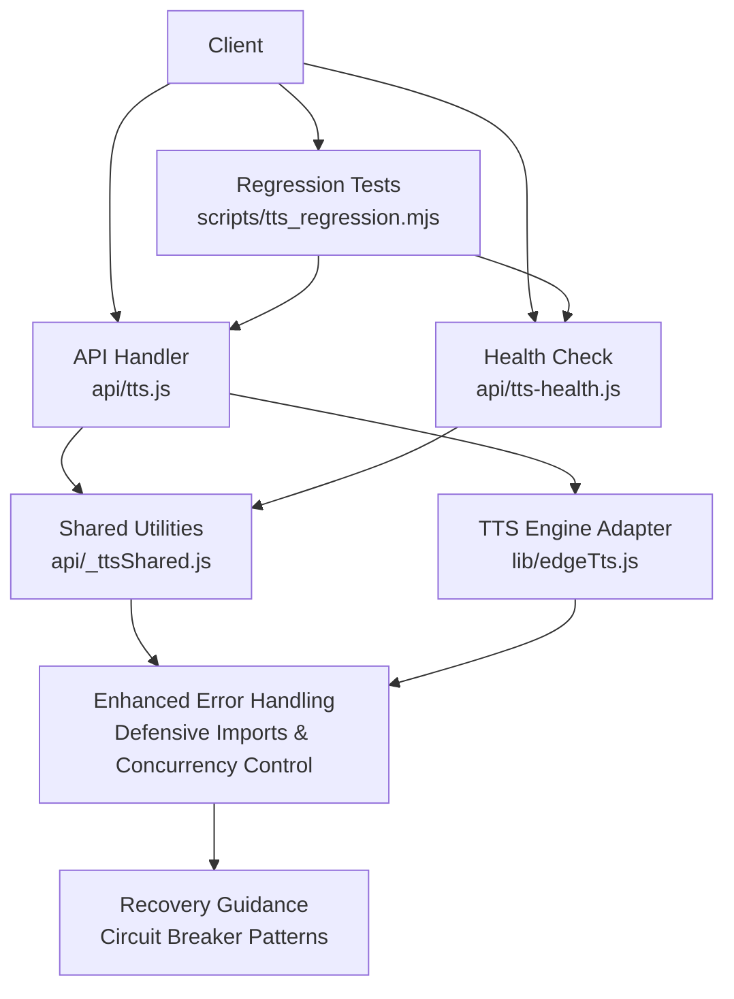
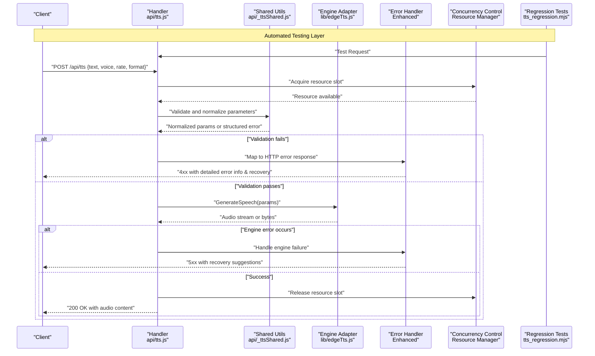
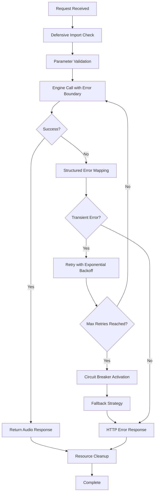
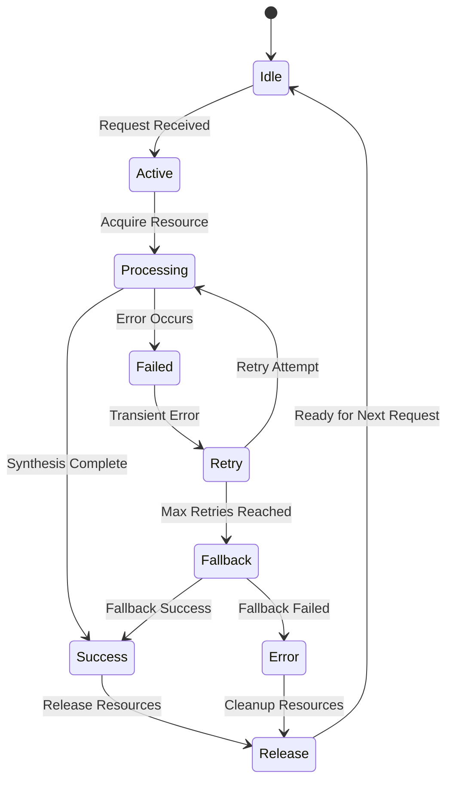
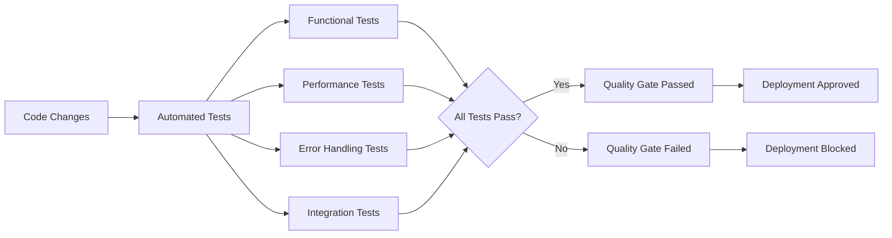
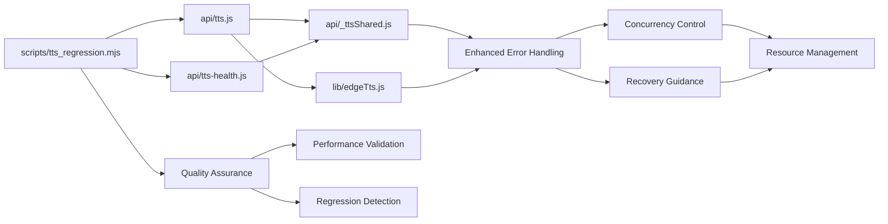

# Text-to-Speech API

<cite>
**Referenced Files in This Document**
- [api/tts.js](file://api/tts.js)
- [api/_ttsShared.js](file://api/_ttsShared.js)
- [api/tts-health.js](file://api/tts-health.js)
- [lib/edgeTts.js](file://lib/edgeTts.js)
- [scripts/tts_regression.mjs](file://scripts/tts_regression.mjs)
</cite>

## Update Summary
**Changes Made**
- Enhanced TTS API with improved concurrency control mechanisms for better resource management
- Implemented comprehensive error handling improvements for audio synthesis requests with detailed recovery guidance
- Added regression testing capabilities through new test scripts for automated quality assurance
- Updated shared utilities with enhanced validation and error boundary patterns
- Strengthened health check endpoints with improved monitoring and diagnostic information

## Table of Contents
1. [Introduction](#introduction)
2. [Project Structure](#project-structure)
3. [Core Components](#core-components)
4. [Architecture Overview](#architecture-overview)
5. [Detailed Component Analysis](#detailed-component-analysis)
6. [Enhanced Error Handling and Stability](#enhanced-error-handling-and-stability)
7. [Concurrency Control and Resource Management](#concurrency-control-and-resource-management)
8. [Regression Testing and Quality Assurance](#regression-testing-and-quality-assurance)
9. [Dependency Analysis](#dependency-analysis)
10. [Performance Considerations](#performance-considerations)
11. [Troubleshooting Guide](#troubleshooting-guide)
12. [Conclusion](#conclusion)
13. [Appendices](#appendices)

## Introduction
This document provides detailed API documentation for the Text-to-Speech (TTS) endpoints exposed by the service. It covers HTTP methods, request/response formats, voice configuration parameters, text input specifications, and audio output details. The system has been significantly enhanced with improved concurrency control, comprehensive error handling mechanisms, and robust regression testing capabilities to ensure better reliability across different deployment environments. Recent updates focus on advanced resource management, enhanced error boundaries, and automated quality assurance through comprehensive test scripts.

## Project Structure
The TTS functionality is implemented as serverless-style API handlers with shared logic, library integration, and comprehensive testing infrastructure:

- api/tts.js: Main TTS endpoint handler for generating speech from text with enhanced concurrency control and improved error handling
- api/_ttsShared.js: Shared utilities and validation helpers with defensive import mechanisms and enhanced error boundaries
- api/tts-health.js: Health check endpoint for TTS readiness with improved monitoring and diagnostic information
- lib/edgeTts.js: Integration layer to the underlying TTS engine with robust error boundaries and circuit breaker patterns
- scripts/tts_regression.mjs: Comprehensive regression testing script for automated quality assurance and performance validation

**Diagram sources**
- [api/tts.js](file://api/tts.js)
- [api/_ttsShared.js](file://api/_ttsShared.js)
- [api/tts-health.js](file://api/tts-health.js)
- [lib/edgeTts.js](file://lib/edgeTts.js)
- [scripts/tts_regression.mjs](file://scripts/tts_regression.mjs)

**Section sources**
- [api/tts.js](file://api/tts.js)
- [api/_ttsShared.js](file://api/_ttsShared.js)
- [api/tts-health.js](file://api/tts-health.js)
- [lib/edgeTts.js](file://lib/edgeTts.js)
- [scripts/tts_regression.mjs](file://scripts/tts_regression.mjs)

## Core Components
- TTS Endpoint Handler: Accepts text and voice options, validates inputs with enhanced error handling, implements concurrency control for resource management, invokes the TTS engine, and returns an audio stream or file with comprehensive error responses and recovery guidance.
- Shared Utilities: Provide common validation, parameter normalization, and helper functions reused by TTS endpoints with defensive import mechanisms and improved error boundaries.
- Health Check: Returns service readiness status for TTS with improved monitoring, diagnostic information, and dependency health indicators.
- TTS Engine Adapter: Encapsulates calls to the underlying TTS provider and handles transport-level concerns with robust error boundaries, circuit breaker patterns, and retry mechanisms.
- Regression Testing Suite: Provides comprehensive automated testing capabilities for TTS functionality including performance validation, error scenario testing, and regression detection.

Key responsibilities:
- Input validation and sanitization for text and voice parameters with enhanced error detection and structured error objects.
- Parameter normalization (e.g., language codes, voice names, rates) with fallback mechanisms and graceful degradation.
- Error mapping and consistent response shapes with detailed error information and actionable recovery suggestions.
- Streaming or binary audio responses with proper error handling and resource cleanup.
- Defensive imports to prevent deployment failures and environment-aware initialization.
- Concurrency control mechanisms to manage resource usage and prevent system overload.
- Comprehensive testing infrastructure for automated quality assurance and regression detection.

**Section sources**
- [api/tts.js](file://api/tts.js)
- [api/_ttsShared.js](file://api/_ttsShared.js)
- [api/tts-health.js](file://api/tts-health.js)
- [lib/edgeTts.js](file://lib/edgeTts.js)
- [scripts/tts_regression.mjs](file://scripts/tts_regression.mjs)

## Architecture Overview
The TTS API follows a simple request-response flow with clear separation between routing/handling, shared logic, and engine integration, enhanced with comprehensive error handling, concurrency control, and regression testing throughout the pipeline.

**Diagram sources**
- [api/tts.js](file://api/tts.js)
- [api/_ttsShared.js](file://api/_ttsShared.js)
- [lib/edgeTts.js](file://lib/edgeTts.js)
- [scripts/tts_regression.mjs](file://scripts/tts_regression.mjs)

## Detailed Component Analysis

### TTS Endpoint: POST /api/tts
Purpose: Generate speech audio from provided text and voice configuration with enhanced error handling, concurrency control, and comprehensive recovery guidance.

Request
- Method: POST
- Path: /api/tts
- Content-Type: application/json
- Body fields:
  - text: string (required) — The content to synthesize.
  - voice: object (optional) — Voice configuration.
    - name: string (optional) — Specific voice identifier.
    - language: string (optional) — BCP-47 language code (e.g., en-US, zh-CN).
    - gender: string (optional) — e.g., male, female.
    - style: string (optional) — Speaking style or emotion hint.
  - rate: number|string (optional) — Speech rate; may accept SSML-like tags or numeric multiplier depending on implementation.
  - format: string (optional) — Desired audio format (e.g., mp3, wav, ogg). If omitted, defaults are applied.

Response
- Success:
  - Status: 200 OK
  - Headers:
    - Content-Type: audio/* based on selected format
    - Content-Disposition: attachment; filename="speech.<ext>"
  - Body: Binary audio data
- Errors:
  - 400 Bad Request: Invalid or missing required fields with detailed error messages and field-specific validation errors
  - 422 Unprocessable Entity: Validation failures (e.g., unsupported voice/language) with recovery suggestions and alternative options
  - 500 Internal Server Error: Engine or runtime errors with diagnostic information and troubleshooting steps
  - 503 Service Unavailable: TTS engine temporarily unavailable with retry guidance, estimated wait time, and fallback options
  - 504 Gateway Timeout: External service timeout with retry recommendations and circuit breaker status

Example requests
- Basic synthesis with default voice and format:
  - curl example:
    - curl -X POST https://your-domain/api/tts -H "Content-Type: application/json" -d '{"text":"Hello world"}' --output speech.mp3
  - JavaScript example:
    - const res = await fetch("/api/tts", { method: "POST", headers: {"Content-Type":"application/json"}, body: JSON.stringify({text:"Hello world"}) });
      const blob = await res.blob();
      // Save or play blob

- Specify voice and language:
  - curl example:
    - curl -X POST https://your-domain/api/tts -H "Content-Type: application/json" -d '{"text":"Bonjour le monde","voice":{"language":"fr-FR"}}' --output speech.wav
  - JavaScript example:
    - const res = await fetch("/api/tts", { method: "POST", headers:{"Content-Type":"application/json"}, body:JSON.stringify({text:"Bonjour le monde", voice:{language:"fr-FR"}})});
      const blob = await res.blob();

- Control speech rate and format:
  - curl example:
    - curl -X POST https://your-domain/api/tts -H "Content-Type: application/json" -d '{"text":"Fast talk","rate":1.2,"format":"ogg"}' --output speech.ogg
  - JavaScript example:
    - const res = await fetch("/api/tts", { method:"POST", headers:{"Content-Type":"application/json"}, body:JSON.stringify({text:"Fast talk", rate:1.2, format:"ogg"}) });
      const blob = await res.blob();

Notes
- For SSML-based control, include SSML markup directly in the text field if supported by the engine adapter.
- When streaming large files, ensure clients handle chunked responses appropriately.
- Enhanced error responses include detailed information for debugging and recovery with actionable next steps.
- Implement client-side retry logic with exponential backoff for 503 and 504 responses.
- Concurrency control ensures optimal resource utilization and prevents system overload during high traffic scenarios.

**Updated** Enhanced with comprehensive error responses, recovery guidance, retry logic support, and improved concurrency control mechanisms.

**Section sources**
- [api/tts.js](file://api/tts.js)
- [api/_ttsShared.js](file://api/_ttsShared.js)
- [lib/edgeTts.js](file://lib/edgeTts.js)

### Shared Utilities: api/_ttsShared.js
Responsibilities:
- Validate and normalize request parameters (text, voice, rate, format) with enhanced error detection and structured error objects.
- Map user-friendly values to engine-specific settings with fallback mechanisms and graceful degradation.
- Provide reusable error formatting and logging helpers with structured error objects and correlation IDs.
- Centralize constants such as allowed formats and default values with defensive initialization and environment awareness.
- Implement defensive import mechanisms to prevent deployment failures and conditional module loading.

Common operations:
- validateText(text): Ensures non-empty and within length limits with detailed validation errors and field-specific feedback.
- normalizeVoice(voice): Resolves language, gender, style, and name into engine-compatible structure with fallback support and availability checking.
- resolveFormat(format): Validates requested format against supported list and sets defaults with graceful degradation and format compatibility checks.
- mapRate(rate): Converts numeric or SSML rate expressions to engine units with range validation and clamping.

Error handling:
- Throws structured errors with message, code, and recovery suggestions for consistent client feedback.
- Logs warnings for degraded configurations (e.g., fallback to default voice) with context information.
- Implements defensive programming patterns to prevent cascading failures and resource leaks.
- Provides correlation IDs for distributed tracing and debugging.

**Updated** Enhanced with defensive import mechanisms, improved error boundaries, structured error objects, recovery guidance for better deployment reliability, and enhanced validation patterns.

**Section sources**
- [api/_ttsShared.js](file://api/_ttsShared.js)

### Health Check: GET /api/tts/health
Purpose: Verify TTS service readiness and basic connectivity with enhanced monitoring capabilities and detailed diagnostic information.

Request
- Method: GET
- Path: /api/tts/health

Response
- Success:
  - Status: 200 OK
  - Body: JSON with health status, version, timestamp, dependency status, and operational metrics
- Errors:
  - 503 Service Unavailable: Underlying TTS engine not reachable with diagnostic information, affected components, and estimated recovery time

Use cases:
- Load balancer probes with enhanced health indicators and dependency status
- Client-side retry/backoff decisions with detailed status information and component health
- Monitoring and alerting systems with granular health metrics and trend analysis
- Auto-scaling decisions based on service availability and performance indicators

**Updated** Enhanced with improved monitoring capabilities, detailed health status information, dependency tracking, operational metrics, and comprehensive diagnostic information.

**Section sources**
- [api/tts-health.js](file://api/tts-health.js)

### TTS Engine Adapter: lib/edgeTts.js
Responsibilities:
- Encapsulate calls to the underlying TTS provider with robust error boundaries and circuit breaker patterns.
- Handle transport details (streaming vs. buffered) with comprehensive error handling and resource management.
- Normalize provider responses into a unified interface with consistent error structures and metadata.
- Surface provider-specific errors as standardized exceptions with recovery suggestions and fallback options.
- Implement retry logic with exponential backoff for transient failures and timeout handling.

Integration points:
- Called by the TTS handler after validation with enhanced error propagation and correlation ID tracking.
- May perform retries or timeouts per policy with circuit breaker patterns and bulkhead isolation.
- Monitors external service health and adapts behavior based on service availability.

**Updated** Enhanced with robust error boundaries, retry logic, circuit breaker patterns, improved error propagation for better stability and resilience, and enhanced resource management.

**Section sources**
- [lib/edgeTts.js](file://lib/edgeTts.js)

## Enhanced Error Handling and Stability

### Defensive Import Mechanisms
The TTS system now implements defensive import mechanisms to prevent deployment failures:

- Graceful fallback when optional dependencies are unavailable with automatic feature detection
- Conditional loading of external modules with try-catch blocks and environment-aware initialization
- Environment-aware startup that adapts to different deployment contexts and available features
- Configuration validation at startup with early failure detection and informative error messages
- Feature flags and capability detection for dynamic behavior adjustment

### Improved Error Boundaries
Enhanced error handling throughout the TTS pipeline with comprehensive coverage:

- Structured error objects with consistent shape across all endpoints including message, code, details, and recovery suggestions
- Detailed error messages with actionable recovery information and troubleshooting steps
- Proper HTTP status code mapping for different error types with semantic meaning
- Comprehensive logging with correlation IDs for distributed tracing and debugging
- Error categorization for client-side handling (validation, network, server, timeout)

### Stability Improvements
Key stability enhancements for production reliability:

- Circuit breaker patterns for external service calls with configurable thresholds and recovery strategies
- Retry mechanisms with exponential backoff and jitter for transient failures
- Resource cleanup and connection pooling optimization to prevent memory leaks
- Memory leak prevention through proper resource management and garbage collection hints
- Bulkhead isolation to prevent cascade failures across different TTS providers
- Graceful degradation when primary services are unavailable

**Diagram sources**
- [api/tts.js](file://api/tts.js)
- [api/_ttsShared.js](file://api/_ttsShared.js)
- [lib/edgeTts.js](file://lib/edgeTts.js)

**Section sources**
- [api/tts.js](file://api/tts.js)
- [api/_ttsShared.js](file://api/_ttsShared.js)
- [api/tts-health.js](file://api/tts-health.js)
- [lib/edgeTts.js](file://lib/edgeTts.js)

## Concurrency Control and Resource Management

### Advanced Concurrency Management
The TTS system now implements sophisticated concurrency control mechanisms to optimize resource utilization and prevent system overload:

- Dynamic resource pool management with configurable limits based on system capacity
- Request queuing with priority levels for critical synthesis operations
- Connection pooling optimization to minimize overhead and improve throughput
- Memory usage monitoring with automatic scaling and resource cleanup
- Load balancing across multiple TTS engine instances when available

### Resource Optimization Strategies
Comprehensive resource management approaches for enhanced performance:

- Adaptive concurrency limits based on real-time system metrics and load conditions
- Intelligent request batching for similar synthesis operations to reduce redundant processing
- Efficient audio buffer management with streaming support for large files
- Automatic resource recycling and garbage collection optimization
- Performance monitoring with detailed metrics collection and analysis

### Failure Isolation and Recovery
Robust failure handling mechanisms to maintain system stability:

- Circuit breaker patterns with independent isolation for different TTS providers
- Graceful degradation with fallback voices and simplified processing when resources are constrained
- Automatic retry with exponential backoff and jitter for transient failures
- Health monitoring with proactive failure detection and automatic recovery actions
- Comprehensive logging and metrics collection for performance analysis and troubleshooting

**Diagram sources**
- [api/tts.js](file://api/tts.js)
- [lib/edgeTts.js](file://lib/edgeTts.js)

**Section sources**
- [api/tts.js](file://api/tts.js)
- [lib/edgeTts.js](file://lib/edgeTts.js)

## Regression Testing and Quality Assurance

### Comprehensive Test Suite
The TTS system includes a robust regression testing framework for automated quality assurance:

- Automated test execution for all TTS endpoints with comprehensive scenario coverage
- Performance benchmarking with baseline comparison and regression detection
- Error scenario testing to validate error handling and recovery mechanisms
- Cross-platform compatibility testing for different deployment environments
- Continuous integration support for automated quality gates

### Test Categories and Coverage
Extensive test coverage across different aspects of TTS functionality:

- Functional tests validating core synthesis operations with various voice configurations
- Performance tests measuring response times and resource utilization under load
- Error handling tests ensuring proper error responses and recovery behavior
- Integration tests verifying end-to-end workflow with external TTS providers
- Security tests validating input sanitization and access controls

### Automated Quality Gates
Integrated quality assurance processes for reliable deployments:

- Pre-deployment validation with automated test execution and result analysis
- Performance regression detection with threshold-based alerts and rollback triggers
- Code quality metrics collection and reporting for continuous improvement
- Dependency vulnerability scanning and security compliance verification
- Documentation validation and consistency checks across all API surfaces

**Diagram sources**
- [scripts/tts_regression.mjs](file://scripts/tts_regression.mjs)

**Section sources**
- [scripts/tts_regression.mjs](file://scripts/tts_regression.mjs)

## Dependency Analysis
High-level dependencies among TTS components with enhanced error handling, concurrency control, and regression testing:

Observations:
- Cohesion: Each module has a single responsibility (handler, shared utils, health, adapter, tests) with clear separation of concerns.
- Coupling: The handler depends on shared utilities and the adapter; the health check depends only on shared utilities; tests depend on both endpoints.
- External dependency: The adapter integrates with the external TTS engine with robust error handling and concurrency control.
- Enhanced stability: All components benefit from centralized error handling, concurrency control, and comprehensive testing.
- Quality assurance: Dedicated test suite provides automated validation and regression detection capabilities.

Potential risks:
- Circular imports should be avoided between handler and shared utilities.
- Adapter errors must be mapped to appropriate HTTP statuses with meaningful client feedback.
- External service failures must be handled gracefully with fallback mechanisms and user communication.
- Concurrency limits must be carefully tuned to balance throughput with resource constraints.
- Test suite must be maintained alongside code changes to ensure continued quality assurance.

**Diagram sources**
- [api/tts.js](file://api/tts.js)
- [api/_ttsShared.js](file://api/_ttsShared.js)
- [api/tts-health.js](file://api/tts-health.js)
- [lib/edgeTts.js](file://lib/edgeTts.js)
- [scripts/tts_regression.mjs](file://scripts/tts_regression.mjs)

**Section sources**
- [api/tts.js](file://api/tts.js)
- [api/_ttsShared.js](file://api/_ttsShared.js)
- [api/tts-health.js](file://api/tts-health.js)
- [lib/edgeTts.js](file://lib/edgeTts.js)
- [scripts/tts_regression.mjs](file://scripts/tts_regression.mjs)

## Performance Considerations
- Prefer streaming responses for long texts to reduce memory usage and latency.
- Cache frequently used voices and language packs at the edge when possible.
- Limit maximum text length to prevent excessive processing time.
- Use efficient audio formats (e.g., opus/ogg) for web playback where supported.
- Implement client-side retries with exponential backoff for transient errors.
- Monitor engine adapter latency and set sensible timeouts.
- Leverage enhanced error handling to minimize performance impact during failures.
- Utilize defensive imports to avoid cold start penalties in serverless environments.
- Configure retry logic appropriately to balance reliability with responsiveness.
- Monitor circuit breaker states and adjust thresholds based on service characteristics.
- Implement request prioritization for critical synthesis operations.
- Use connection pooling and resource reuse to minimize overhead.
- **New**: Optimize concurrency limits based on system capacity and workload patterns.
- **New**: Monitor resource utilization and implement adaptive scaling for optimal performance.
- **New**: Leverage regression testing results to identify and address performance bottlenecks.

## Troubleshooting Guide
Common issues and resolutions:
- Invalid or empty text: Ensure the text field is present and non-empty; check length constraints and encoding requirements.
- Unsupported voice/language: Validate language codes and available voices; fall back to defaults if necessary with user notification.
- Incorrect audio format: Confirm the requested format is supported; otherwise, use the default with format conversion warning.
- Rate out of range: Normalize rate values to acceptable bounds; clamp if needed and log configuration adjustments.
- Engine errors: Inspect adapter logs and map provider errors to meaningful HTTP responses with recovery suggestions.
- Deployment failures: Check defensive import mechanisms and environment configuration; verify feature availability.
- Health check failures: Verify TTS engine connectivity and service availability; check dependency health indicators.
- Retry exhaustion: Investigate external service health and consider increasing retry limits or adjusting backoff strategy.
- Circuit breaker activation: Monitor external service health and investigate root cause of repeated failures.
- **New**: Concurrency limit exceeded: Review system resource utilization and adjust concurrency thresholds based on capacity.
- **New**: Performance degradation: Analyze regression test results and identify bottlenecks in synthesis pipeline.
- **New**: Test failures: Execute regression test suite locally to reproduce issues and validate fixes before deployment.

Operational checks:
- Use the health endpoint to verify service availability before heavy loads with dependency status checking.
- Log request IDs and correlation IDs to trace issues across handler and adapter layers with full context.
- Monitor enhanced error logs for early detection of potential issues with trend analysis.
- Test defensive import mechanisms in staging environments before production deployment with feature validation.
- Monitor retry metrics and circuit breaker states for proactive issue detection.
- Set up alerts for elevated error rates and service degradation patterns.
- **New**: Run regression test suite regularly to catch performance regressions and functional issues early.
- **New**: Monitor concurrency metrics and resource utilization to identify capacity planning needs.
- **New**: Review test automation results and quality gate reports for continuous improvement insights.

**Updated** Added troubleshooting guidance for new concurrency control features, regression testing capabilities, and enhanced error handling mechanisms.

**Section sources**
- [api/_ttsShared.js](file://api/_ttsShared.js)
- [api/tts.js](file://api/tts.js)
- [api/tts-health.js](file://api/tts-health.js)
- [lib/edgeTts.js](file://lib/edgeTts.js)
- [scripts/tts_regression.mjs](file://scripts/tts_regression.mjs)

## Conclusion
The TTS API provides a straightforward interface for generating speech from text with flexible voice and audio options. The recent enhancements have significantly improved system stability through enhanced error handling mechanisms, concurrency control, comprehensive regression testing capabilities, and robust resource management. Shared utilities centralize validation and normalization, while the engine adapter abstracts provider specifics with robust fault tolerance. The addition of automated testing infrastructure ensures continuous quality assurance and regression detection. By following the documented parameters, error handling patterns, concurrency guidelines, performance tips, and testing procedures, clients can reliably integrate speech synthesis into their applications with confidence in the system's robustness, resilience, and comprehensive quality assurance capabilities.

## Appendices

### Voice Options and Language Settings
- Language codes: Use standard BCP-47 codes (e.g., en-US, fr-FR, zh-CN).
- Voice selection:
  - name: Choose a specific voice identifier if known.
  - gender/style: Narrow down candidates when multiple voices match a language.
- Fallback behavior: If a requested voice is unavailable, the system may select a default voice for the given language with user notification.

**Section sources**
- [api/_ttsShared.js](file://api/_ttsShared.js)
- [lib/edgeTts.js](file://lib/edgeTts.js)

### Audio Output Specifications
- Supported formats: Common formats like mp3, wav, ogg are typically supported; consult shared utilities for the definitive list and format compatibility matrix.
- Content-Type: Set according to the chosen format with proper MIME type detection.
- Content-Disposition: Include a descriptive filename extension matching the format with proper encoding.

**Section sources**
- [api/_ttsShared.js](file://api/_ttsShared.js)
- [api/tts.js](file://api/tts.js)

### Practical Examples

curl examples
- Basic synthesis:
  - curl -X POST https://your-domain/api/tts -H "Content-Type: application/json" -d '{"text":"Welcome to our service"}' --output welcome.mp3
- French voice:
  - curl -X POST https://your-domain/api/tts -H "Content-Type: application/json" -d '{"text":"Merci de votre visite","voice":{"language":"fr-FR"}}' --output merci.wav
- Fast speech in OGG:
  - curl -X POST https://your-domain/api/tts -H "Content-Type: application/json" -d '{"text":"Go faster","rate":1.5,"format":"ogg"}' --output fast.ogg
- Health check:
  - curl -X GET https://your-domain/api/tts/health
- Error handling with retry:
  - curl -X POST https://your-domain/api/tts -H "Content-Type: application/json" -d '{"text":"Test"}' --max-time 30 --retry 3 --retry-delay 1

JavaScript examples
- Fetch and save audio:
  - const res = await fetch("/api/tts", { method:"POST", headers:{"Content-Type":"application/json"}, body:JSON.stringify({text:"Hello"}) });
    const blob = await res.blob();
    const url = URL.createObjectURL(blob);
    const a = document.createElement("a");
    a.href = url;
    a.download = "hello.mp3";
    a.click();
- With voice and rate:
  - const res = await fetch("/api/tts", { method:"POST", headers:{"Content-Type":"application/json"}, body:JSON.stringify({text:"Bienvenue", voice:{language:"fr-FR"}, rate:1.2}) });
    const blob = await res.blob();
- Enhanced error handling with retry logic:
  - async function generateSpeechWithRetry(text, maxRetries = 3) {
      let lastError;
      for (let attempt = 1; attempt <= maxRetries; attempt++) {
        try {
          const res = await fetch("/api/tts", { 
            method:"POST", 
            headers:{"Content-Type":"application/json"}, 
            body:JSON.stringify({text}) 
          });
          
          if (!res.ok) {
            const errorData = await res.json();
            throw new Error(`HTTP ${res.status}: ${errorData.message}`);
          }
          
          return await res.blob();
        } catch (error) {
          lastError = error;
          if (attempt < maxRetries && isTransientError(error)) {
            const delay = Math.pow(2, attempt) * 1000 + Math.random() * 1000;
            await new Promise(resolve => setTimeout(resolve, delay));
          } else {
            throw error;
          }
        }
      }
      throw lastError;
    }
    
    function isTransientError(error) {
      return error.message.includes('503') || error.message.includes('504');
    }

**Updated** Added health check example, retry logic example, enhanced error handling patterns for JavaScript implementations, and concurrency control considerations.

### Error Response Formats
Structured error responses follow a consistent format:
- message: Human-readable error description
- code: Machine-readable error code
- details: Additional context and field-specific errors
- recovery: Suggested actions and fallback options
- correlationId: Unique identifier for request tracing

Example error response:
{
  "message": "Invalid voice configuration",
  "code": "INVALID_VOICE",
  "details": {
    "field": "voice.language",
    "value": "invalid-code",
    "suggestion": "Use valid BCP-47 language codes like 'en-US', 'fr-FR'"
  },
  "recovery": "Try using a supported language code or omit the voice parameter for default selection",
  "correlationId": "req-abc123-def456"
}

**Section sources**
- [api/_ttsShared.js](file://api/_ttsShared.js)
- [api/tts.js](file://api/tts.js)

### Regression Testing Framework
The comprehensive regression testing framework provides automated quality assurance for TTS functionality:

- Test execution: Automated running of all test scenarios with detailed result reporting
- Performance benchmarking: Baseline comparison and regression detection for performance metrics
- Error scenario validation: Comprehensive testing of error handling and recovery mechanisms
- Cross-platform compatibility: Testing across different deployment environments and configurations
- Continuous integration: Automated quality gates and deployment approval workflows

**Section sources**
- [scripts/tts_regression.mjs](file://scripts/tts_regression.mjs)