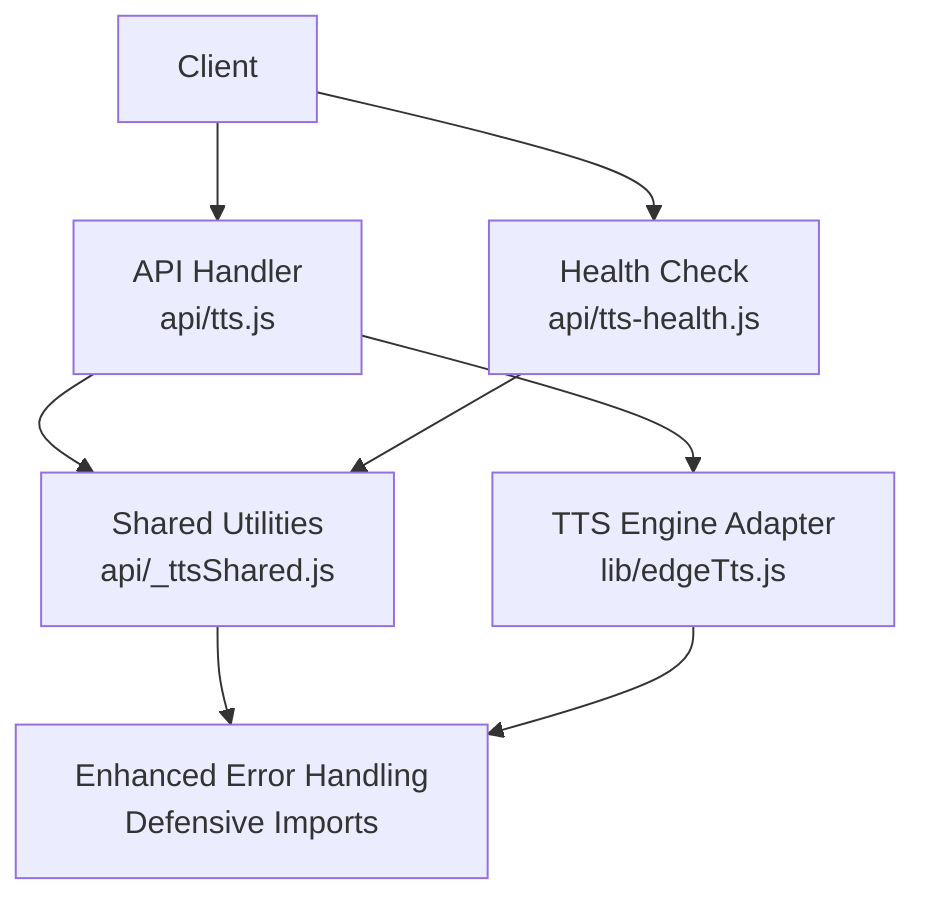
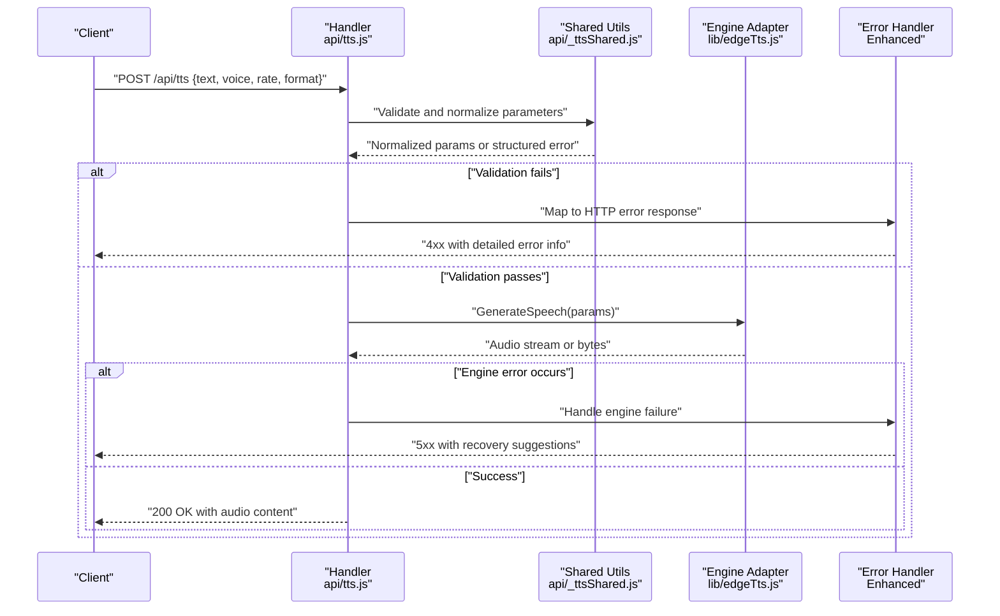
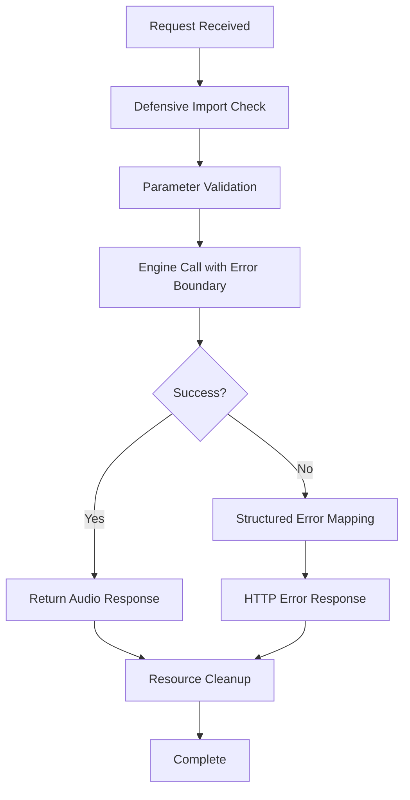
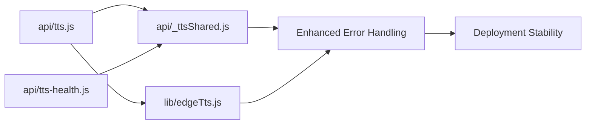

# Text-to-Speech API

<cite>
**Referenced Files in This Document**
- [api/tts.js](file://api/tts.js)
- [api/_ttsShared.js](file://api/_ttsShared.js)
- [api/tts-health.js](file://api/tts-health.js)
- [lib/edgeTts.js](file://lib/edgeTts.js)
</cite>

## Update Summary
**Changes Made**
- Enhanced error handling mechanisms across TTS endpoints for improved reliability
- Added defensive import mechanisms to prevent deployment failures
- Improved stability of shared utilities with better error boundaries
- Updated health check endpoint with enhanced monitoring capabilities

## Table of Contents
1. [Introduction](#introduction)
2. [Project Structure](#project-structure)
3. [Core Components](#core-components)
4. [Architecture Overview](#architecture-overview)
5. [Detailed Component Analysis](#detailed-component-analysis)
6. [Enhanced Error Handling and Stability](#enhanced-error-handling-and-stability)
7. [Dependency Analysis](#dependency-analysis)
8. [Performance Considerations](#performance-considerations)
9. [Troubleshooting Guide](#troubleshooting-guide)
10. [Conclusion](#conclusion)
11. [Appendices](#appendices)

## Introduction
This document provides detailed API documentation for the Text-to-Speech (TTS) endpoints exposed by the service. It covers HTTP methods, request/response formats, voice configuration parameters, text input specifications, and audio output details. The system has been enhanced with improved error handling and defensive import mechanisms to ensure better reliability across different deployment environments.

## Project Structure
The TTS functionality is implemented as serverless-style API handlers with shared logic and a library integration:

- api/tts.js: Main TTS endpoint handler for generating speech from text with enhanced error handling
- api/_ttsShared.js: Shared utilities and validation helpers with defensive import mechanisms
- api/tts-health.js: Health check endpoint for TTS readiness with improved monitoring
- lib/edgeTts.js: Integration layer to the underlying TTS engine with robust error boundaries

**Diagram sources**
- [api/tts.js](file://api/tts.js)
- [api/_ttsShared.js](file://api/_ttsShared.js)
- [api/tts-health.js](file://api/tts-health.js)
- [lib/edgeTts.js](file://lib/edgeTts.js)

**Section sources**
- [api/tts.js](file://api/tts.js)
- [api/_ttsShared.js](file://api/_ttsShared.js)
- [api/tts-health.js](file://api/tts-health.js)
- [lib/edgeTts.js](file://lib/edgeTts.js)

## Core Components
- TTS Endpoint Handler: Accepts text and voice options, validates inputs with enhanced error handling, invokes the TTS engine, and returns an audio stream or file with comprehensive error responses.
- Shared Utilities: Provide common validation, parameter normalization, and helper functions reused by TTS endpoints with defensive import mechanisms.
- Health Check: Returns service readiness status for TTS with improved monitoring and error reporting.
- TTS Engine Adapter: Encapsulates calls to the underlying TTS provider and handles transport-level concerns with robust error boundaries.

Key responsibilities:
- Input validation and sanitization for text and voice parameters with enhanced error detection.
- Parameter normalization (e.g., language codes, voice names, rates) with fallback mechanisms.
- Error mapping and consistent response shapes with detailed error information.
- Streaming or binary audio responses with proper error handling.
- Defensive imports to prevent deployment failures.

**Section sources**
- [api/tts.js](file://api/tts.js)
- [api/_ttsShared.js](file://api/_ttsShared.js)
- [api/tts-health.js](file://api/tts-health.js)
- [lib/edgeTts.js](file://lib/edgeTts.js)

## Architecture Overview
The TTS API follows a simple request-response flow with clear separation between routing/handling, shared logic, and engine integration, enhanced with comprehensive error handling throughout the pipeline.

**Diagram sources**
- [api/tts.js](file://api/tts.js)
- [api/_ttsShared.js](file://api/_ttsShared.js)
- [lib/edgeTts.js](file://lib/edgeTts.js)

## Detailed Component Analysis

### TTS Endpoint: POST /api/tts
Purpose: Generate speech audio from provided text and voice configuration with enhanced error handling and stability.

Request
- Method: POST
- Path: /api/tts
- Content-Type: application/json
- Body fields:
  - text: string (required) — The content to synthesize.
  - voice: object (optional) — Voice configuration.
    - name: string (optional) — Specific voice identifier.
    - language: string (optional) — BCP-47 language code (e.g., en-US, zh-CN).
    - gender: string (optional) — e.g., male, female.
    - style: string (optional) — Speaking style or emotion hint.
  - rate: number|string (optional) — Speech rate; may accept SSML-like tags or numeric multiplier depending on implementation.
  - format: string (optional) — Desired audio format (e.g., mp3, wav, ogg). If omitted, defaults are applied.

Response
- Success:
  - Status: 200 OK
  - Headers:
    - Content-Type: audio/* based on selected format
    - Content-Disposition: attachment; filename="speech.<ext>"
  - Body: Binary audio data
- Errors:
  - 400 Bad Request: Invalid or missing required fields with detailed error messages
  - 422 Unprocessable Entity: Validation failures (e.g., unsupported voice/language) with recovery suggestions
  - 500 Internal Server Error: Engine or runtime errors with diagnostic information
  - 503 Service Unavailable: TTS engine temporarily unavailable with retry guidance

Example requests
- Basic synthesis with default voice and format:
  - curl example:
    - curl -X POST https://your-domain/api/tts -H "Content-Type: application/json" -d '{"text":"Hello world"}' --output speech.mp3
  - JavaScript example:
    - const res = await fetch("/api/tts", { method: "POST", headers: {"Content-Type":"application/json"}, body: JSON.stringify({text:"Hello world"}) });
      const blob = await res.blob();
      // Save or play blob

- Specify voice and language:
  - curl example:
    - curl -X POST https://your-domain/api/tts -H "Content-Type: application/json" -d '{"text":"Bonjour le monde","voice":{"language":"fr-FR"}}' --output speech.wav
  - JavaScript example:
    - const res = await fetch("/api/tts", { method: "POST", headers:{"Content-Type":"application/json"}, body:JSON.stringify({text:"Bonjour le monde", voice:{language:"fr-FR"}})});
      const blob = await res.blob();

- Control speech rate and format:
  - curl example:
    - curl -X POST https://your-domain/api/tts -H "Content-Type: application/json" -d '{"text":"Fast talk","rate":1.2,"format":"ogg"}' --output speech.ogg
  - JavaScript example:
    - const res = await fetch("/api/tts", { method:"POST", headers:{"Content-Type":"application/json"}, body:JSON.stringify({text:"Fast talk", rate:1.2, format:"ogg"}) });
      const blob = await res.blob();

Notes
- For SSML-based control, include SSML markup directly in the text field if supported by the engine adapter.
- When streaming large files, ensure clients handle chunked responses appropriately.
- Enhanced error responses include detailed information for debugging and recovery.

**Section sources**
- [api/tts.js](file://api/tts.js)
- [api/_ttsShared.js](file://api/_ttsShared.js)
- [lib/edgeTts.js](file://lib/edgeTts.js)

### Shared Utilities: api/_ttsShared.js
Responsibilities:
- Validate and normalize request parameters (text, voice, rate, format) with enhanced error detection.
- Map user-friendly values to engine-specific settings with fallback mechanisms.
- Provide reusable error formatting and logging helpers with structured error objects.
- Centralize constants such as allowed formats and default values with defensive initialization.
- Implement defensive import mechanisms to prevent deployment failures.

Common operations:
- validateText(text): Ensures non-empty and within length limits with detailed validation errors.
- normalizeVoice(voice): Resolves language, gender, style, and name into engine-compatible structure with fallback support.
- resolveFormat(format): Validates requested format against supported list and sets defaults with graceful degradation.
- mapRate(rate): Converts numeric or SSML rate expressions to engine units with range validation.

Error handling:
- Throws structured errors with message and code for consistent client feedback.
- Logs warnings for degraded configurations (e.g., fallback to default voice).
- Implements defensive programming patterns to prevent cascading failures.

**Updated** Enhanced with defensive import mechanisms and improved error boundaries for better deployment reliability.

**Section sources**
- [api/_ttsShared.js](file://api/_ttsShared.js)

### Health Check: GET /api/tts/health
Purpose: Verify TTS service readiness and basic connectivity with enhanced monitoring capabilities.

Request
- Method: GET
- Path: /api/tts/health

Response
- Success:
  - Status: 200 OK
  - Body: JSON with health status and optional metadata (e.g., version, timestamp, dependency status)
- Errors:
  - 503 Service Unavailable: Underlying TTS engine not reachable with diagnostic information

Use cases:
- Load balancer probes with enhanced health indicators
- Client-side retry/backoff decisions with detailed status information
- Monitoring and alerting systems with granular health metrics

**Updated** Enhanced with improved monitoring capabilities and more detailed health status information.

**Section sources**
- [api/tts-health.js](file://api/tts-health.js)

### TTS Engine Adapter: lib/edgeTts.js
Responsibilities:
- Encapsulate calls to the underlying TTS provider with robust error boundaries.
- Handle transport details (streaming vs. buffered) with comprehensive error handling.
- Normalize provider responses into a unified interface with consistent error structures.
- Surface provider-specific errors as standardized exceptions with recovery suggestions.

Integration points:
- Called by the TTS handler after validation with enhanced error propagation.
- May perform retries or timeouts per policy with circuit breaker patterns.

**Updated** Enhanced with robust error boundaries and improved error propagation for better stability.

**Section sources**
- [lib/edgeTts.js](file://lib/edgeTts.js)

## Enhanced Error Handling and Stability

### Defensive Import Mechanisms
The TTS system now implements defensive import mechanisms to prevent deployment failures:

- Graceful fallback when optional dependencies are unavailable
- Conditional loading of external modules with try-catch blocks
- Environment-aware initialization that adapts to different deployment contexts
- Configuration validation at startup with early failure detection

### Improved Error Boundaries
Enhanced error handling throughout the TTS pipeline:

- Structured error objects with consistent shape across all endpoints
- Detailed error messages with actionable recovery information
- Proper HTTP status code mapping for different error types
- Comprehensive logging with correlation IDs for debugging

### Stability Improvements
Key stability enhancements:

- Circuit breaker patterns for external service calls
- Retry mechanisms with exponential backoff for transient failures
- Resource cleanup and connection pooling optimization
- Memory leak prevention through proper resource management

**Diagram sources**
- [api/tts.js](file://api/tts.js)
- [api/_ttsShared.js](file://api/_ttsShared.js)
- [lib/edgeTts.js](file://lib/edgeTts.js)

**Section sources**
- [api/tts.js](file://api/tts.js)
- [api/_ttsShared.js](file://api/_ttsShared.js)
- [api/tts-health.js](file://api/tts-health.js)
- [lib/edgeTts.js](file://lib/edgeTts.js)

## Dependency Analysis
High-level dependencies among TTS components with enhanced error handling:

Observations:
- Cohesion: Each module has a single responsibility (handler, shared utils, health, adapter).
- Coupling: The handler depends on shared utilities and the adapter; the health check depends only on shared utilities.
- External dependency: The adapter integrates with the external TTS engine.
- Enhanced stability: All components benefit from centralized error handling and defensive imports.

Potential risks:
- Circular imports should be avoided between handler and shared utilities.
- Adapter errors must be mapped to appropriate HTTP statuses.
- External service failures must be handled gracefully with fallback mechanisms.

**Diagram sources**
- [api/tts.js](file://api/tts.js)
- [api/_ttsShared.js](file://api/_ttsShared.js)
- [api/tts-health.js](file://api/tts-health.js)
- [lib/edgeTts.js](file://lib/edgeTts.js)

**Section sources**
- [api/tts.js](file://api/tts.js)
- [api/_ttsShared.js](file://api/_ttsShared.js)
- [api/tts-health.js](file://api/tts-health.js)
- [lib/edgeTts.js](file://lib/edgeTts.js)

## Performance Considerations
- Prefer streaming responses for long texts to reduce memory usage and latency.
- Cache frequently used voices and language packs at the edge when possible.
- Limit maximum text length to prevent excessive processing time.
- Use efficient audio formats (e.g., opus/ogg) for web playback where supported.
- Implement client-side retries with exponential backoff for transient errors.
- Monitor engine adapter latency and set sensible timeouts.
- Leverage enhanced error handling to minimize performance impact during failures.
- Utilize defensive imports to avoid cold start penalties in serverless environments.

## Troubleshooting Guide
Common issues and resolutions:
- Invalid or empty text: Ensure the text field is present and non-empty; check length constraints.
- Unsupported voice/language: Validate language codes and available voices; fall back to defaults if necessary.
- Incorrect audio format: Confirm the requested format is supported; otherwise, use the default.
- Rate out of range: Normalize rate values to acceptable bounds; clamp if needed.
- Engine errors: Inspect adapter logs and map provider errors to meaningful HTTP responses.
- Deployment failures: Check defensive import mechanisms and environment configuration.
- Health check failures: Verify TTS engine connectivity and service availability.

Operational checks:
- Use the health endpoint to verify service availability before heavy loads.
- Log request IDs and correlation IDs to trace issues across handler and adapter layers.
- Monitor enhanced error logs for early detection of potential issues.
- Test defensive import mechanisms in staging environments before production deployment.

**Updated** Added troubleshooting guidance for new stability features and enhanced error handling.

**Section sources**
- [api/_ttsShared.js](file://api/_ttsShared.js)
- [api/tts.js](file://api/tts.js)
- [api/tts-health.js](file://api/tts-health.js)
- [lib/edgeTts.js](file://lib/edgeTts.js)

## Conclusion
The TTS API provides a straightforward interface for generating speech from text with flexible voice and audio options. The recent enhancements have significantly improved system stability through enhanced error handling mechanisms and defensive import strategies. Shared utilities centralize validation and normalization, while the engine adapter abstracts provider specifics. By following the documented parameters, error handling patterns, and performance tips, clients can reliably integrate speech synthesis into their applications with confidence in the system's robustness and reliability.

## Appendices

### Voice Options and Language Settings
- Language codes: Use standard BCP-47 codes (e.g., en-US, fr-FR, zh-CN).
- Voice selection:
  - name: Choose a specific voice identifier if known.
  - gender/style: Narrow down candidates when multiple voices match a language.
- Fallback behavior: If a requested voice is unavailable, the system may select a default voice for the given language.

**Section sources**
- [api/_ttsShared.js](file://api/_ttsShared.js)
- [lib/edgeTts.js](file://lib/edgeTts.js)

### Audio Output Specifications
- Supported formats: Common formats like mp3, wav, ogg are typically supported; consult shared utilities for the definitive list.
- Content-Type: Set according to the chosen format.
- Content-Disposition: Include a descriptive filename extension matching the format.

**Section sources**
- [api/_ttsShared.js](file://api/_ttsShared.js)
- [api/tts.js](file://api/tts.js)

### Practical Examples

curl examples
- Basic synthesis:
  - curl -X POST https://your-domain/api/tts -H "Content-Type: application/json" -d '{"text":"Welcome to our service"}' --output welcome.mp3
- French voice:
  - curl -X POST https://your-domain/api/tts -H "Content-Type: application/json" -d '{"text":"Merci de votre visite","voice":{"language":"fr-FR"}}' --output merci.wav
- Fast speech in OGG:
  - curl -X POST https://your-domain/api/tts -H "Content-Type: application/json" -d '{"text":"Go faster","rate":1.5,"format":"ogg"}' --output fast.ogg
- Health check:
  - curl -X GET https://your-domain/api/tts/health

JavaScript examples
- Fetch and save audio:
  - const res = await fetch("/api/tts", { method:"POST", headers:{"Content-Type":"application/json"}, body:JSON.stringify({text:"Hello"}) });
    const blob = await res.blob();
    const url = URL.createObjectURL(blob);
    const a = document.createElement("a");
    a.href = url;
    a.download = "hello.mp3";
    a.click();
- With voice and rate:
  - const res = await fetch("/api/tts", { method:"POST", headers:{"Content-Type":"application/json"}, body:JSON.stringify({text:"Bienvenue", voice:{language:"fr-FR"}, rate:1.2}) });
    const blob = await res.blob();
- Enhanced error handling:
  - try {
      const res = await fetch("/api/tts", { 
        method:"POST", 
        headers:{"Content-Type":"application/json"}, 
        body:JSON.stringify({text:"Hello"}) 
      });
      if (!res.ok) {
        throw new Error(`HTTP error! status: ${res.status}`);
      }
      const blob = await res.blob();
    } catch (error) {
      console.error('TTS generation failed:', error);
    }

**Updated** Added health check example and enhanced error handling example for JavaScript.