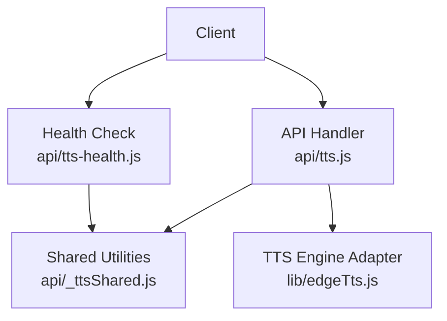
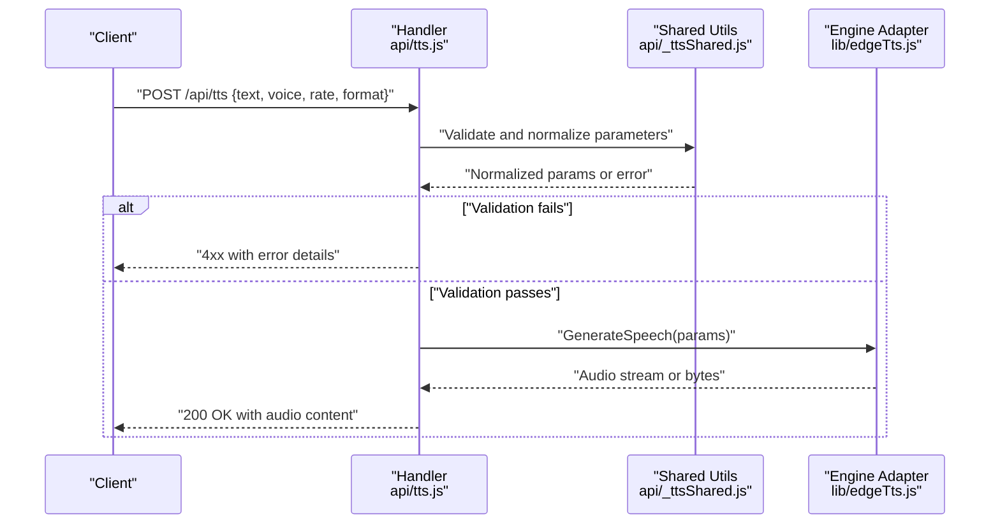
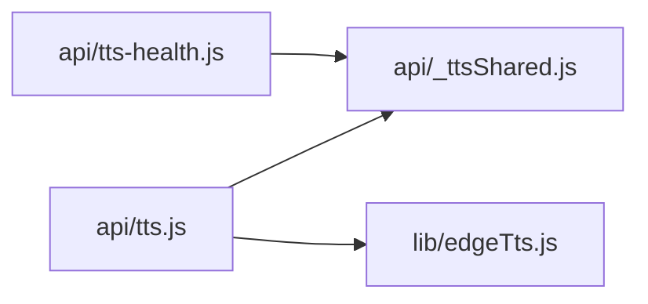

# Text-to-Speech API

<cite>
**Referenced Files in This Document**
- [api/tts.js](file://api/tts.js)
- [api/_ttsShared.js](file://api/_ttsShared.js)
- [api/tts-health.js](file://api/tts-health.js)
- [lib/edgeTts.js](file://lib/edgeTts.js)
</cite>

## Table of Contents
1. [Introduction](#introduction)
2. [Project Structure](#project-structure)
3. [Core Components](#core-components)
4. [Architecture Overview](#architecture-overview)
5. [Detailed Component Analysis](#detailed-component-analysis)
6. [Dependency Analysis](#dependency-analysis)
7. [Performance Considerations](#performance-considerations)
8. [Troubleshooting Guide](#troubleshooting-guide)
9. [Conclusion](#conclusion)
10. [Appendices](#appendices)

## Introduction
This document provides detailed API documentation for the Text-to-Speech (TTS) endpoints exposed by the service. It covers HTTP methods, request/response formats, voice configuration parameters, text input specifications, and audio output details. It also documents shared utilities used across TTS endpoints, error handling strategies, performance optimization tips, and practical examples using curl and JavaScript.

## Project Structure
The TTS functionality is implemented as serverless-style API handlers with shared logic and a library integration:

- api/tts.js: Main TTS endpoint handler for generating speech from text.
- api/_ttsShared.js: Shared utilities and validation helpers used by TTS endpoints.
- api/tts-health.js: Health check endpoint for TTS readiness.
- lib/edgeTts.js: Integration layer to the underlying TTS engine.

**Diagram sources**
- [api/tts.js](file://api/tts.js)
- [api/_ttsShared.js](file://api/_ttsShared.js)
- [api/tts-health.js](file://api/tts-health.js)
- [lib/edgeTts.js](file://lib/edgeTts.js)

**Section sources**
- [api/tts.js](file://api/tts.js)
- [api/_ttsShared.js](file://api/_ttsShared.js)
- [api/tts-health.js](file://api/tts-health.js)
- [lib/edgeTts.js](file://lib/edgeTts.js)

## Core Components
- TTS Endpoint Handler: Accepts text and voice options, validates inputs, invokes the TTS engine, and returns an audio stream or file.
- Shared Utilities: Provide common validation, parameter normalization, and helper functions reused by TTS endpoints.
- Health Check: Returns service readiness status for TTS.
- TTS Engine Adapter: Encapsulates calls to the underlying TTS provider and handles transport-level concerns.

Key responsibilities:
- Input validation and sanitization for text and voice parameters.
- Parameter normalization (e.g., language codes, voice names, rates).
- Error mapping and consistent response shapes.
- Streaming or binary audio responses.

**Section sources**
- [api/tts.js](file://api/tts.js)
- [api/_ttsShared.js](file://api/_ttsShared.js)
- [api/tts-health.js](file://api/tts-health.js)
- [lib/edgeTts.js](file://lib/edgeTts.js)

## Architecture Overview
The TTS API follows a simple request-response flow with clear separation between routing/handling, shared logic, and engine integration.

**Diagram sources**
- [api/tts.js](file://api/tts.js)
- [api/_ttsShared.js](file://api/_ttsShared.js)
- [lib/edgeTts.js](file://lib/edgeTts.js)

## Detailed Component Analysis

### TTS Endpoint: POST /api/tts
Purpose: Generate speech audio from provided text and voice configuration.

Request
- Method: POST
- Path: /api/tts
- Content-Type: application/json
- Body fields:
  - text: string (required) — The content to synthesize.
  - voice: object (optional) — Voice configuration.
    - name: string (optional) — Specific voice identifier.
    - language: string (optional) — BCP-47 language code (e.g., en-US, zh-CN).
    - gender: string (optional) — e.g., male, female.
    - style: string (optional) — Speaking style or emotion hint.
  - rate: number|string (optional) — Speech rate; may accept SSML-like tags or numeric multiplier depending on implementation.
  - format: string (optional) — Desired audio format (e.g., mp3, wav, ogg). If omitted, defaults are applied.

Response
- Success:
  - Status: 200 OK
  - Headers:
    - Content-Type: audio/* based on selected format
    - Content-Disposition: attachment; filename="speech.<ext>"
  - Body: Binary audio data
- Errors:
  - 400 Bad Request: Invalid or missing required fields
  - 422 Unprocessable Entity: Validation failures (e.g., unsupported voice/language)
  - 500 Internal Server Error: Engine or runtime errors

Example requests
- Basic synthesis with default voice and format:
  - curl example:
    - curl -X POST https://your-domain/api/tts -H "Content-Type: application/json" -d '{"text":"Hello world"}' --output speech.mp3
  - JavaScript example:
    - const res = await fetch("/api/tts", { method: "POST", headers: {"Content-Type":"application/json"}, body: JSON.stringify({text:"Hello world"}) });
      const blob = await res.blob();
      // Save or play blob

- Specify voice and language:
  - curl example:
    - curl -X POST https://your-domain/api/tts -H "Content-Type: application/json" -d '{"text":"Bonjour le monde","voice":{"language":"fr-FR"}}' --output speech.wav
  - JavaScript example:
    - const res = await fetch("/api/tts", { method: "POST", headers:{"Content-Type":"application/json"}, body:JSON.stringify({text:"Bonjour le monde", voice:{language:"fr-FR"}})});
      const blob = await res.blob();

- Control speech rate and format:
  - curl example:
    - curl -X POST https://your-domain/api/tts -H "Content-Type: application/json" -d '{"text":"Fast talk","rate":1.2,"format":"ogg"}' --output speech.ogg
  - JavaScript example:
    - const res = await fetch("/api/tts", { method:"POST", headers:{"Content-Type":"application/json"}, body:JSON.stringify({text:"Fast talk", rate:1.2, format:"ogg"}) });
      const blob = await res.blob();

Notes
- For SSML-based control, include SSML markup directly in the text field if supported by the engine adapter.
- When streaming large files, ensure clients handle chunked responses appropriately.

**Section sources**
- [api/tts.js](file://api/tts.js)
- [api/_ttsShared.js](file://api/_ttsShared.js)
- [lib/edgeTts.js](file://lib/edgeTts.js)

### Shared Utilities: api/_ttsShared.js
Responsibilities:
- Validate and normalize request parameters (text, voice, rate, format).
- Map user-friendly values to engine-specific settings.
- Provide reusable error formatting and logging helpers.
- Centralize constants such as allowed formats and default values.

Common operations:
- validateText(text): Ensures non-empty and within length limits.
- normalizeVoice(voice): Resolves language, gender, style, and name into engine-compatible structure.
- resolveFormat(format): Validates requested format against supported list and sets defaults.
- mapRate(rate): Converts numeric or SSML rate expressions to engine units.

Error handling:
- Throws structured errors with message and code for consistent client feedback.
- Logs warnings for degraded configurations (e.g., fallback to default voice).

**Section sources**
- [api/_ttsShared.js](file://api/_ttsShared.js)

### Health Check: GET /api/tts/health
Purpose: Verify TTS service readiness and basic connectivity.

Request
- Method: GET
- Path: /api/tts/health

Response
- Success:
  - Status: 200 OK
  - Body: JSON with health status and optional metadata (e.g., version, timestamp)
- Errors:
  - 503 Service Unavailable: Underlying TTS engine not reachable

Use cases:
- Load balancer probes
- Client-side retry/backoff decisions

**Section sources**
- [api/tts-health.js](file://api/tts-health.js)

### TTS Engine Adapter: lib/edgeTts.js
Responsibilities:
- Encapsulate calls to the underlying TTS provider.
- Handle transport details (streaming vs. buffered).
- Normalize provider responses into a unified interface.
- Surface provider-specific errors as standardized exceptions.

Integration points:
- Called by the TTS handler after validation.
- May perform retries or timeouts per policy.

**Section sources**
- [lib/edgeTts.js](file://lib/edgeTts.js)

## Dependency Analysis
High-level dependencies among TTS components:

Observations:
- Cohesion: Each module has a single responsibility (handler, shared utils, health, adapter).
- Coupling: The handler depends on shared utilities and the adapter; the health check depends only on shared utilities.
- External dependency: The adapter integrates with the external TTS engine.

Potential risks:
- Circular imports should be avoided between handler and shared utilities.
- Adapter errors must be mapped to appropriate HTTP statuses.

**Diagram sources**
- [api/tts.js](file://api/tts.js)
- [api/_ttsShared.js](file://api/_ttsShared.js)
- [api/tts-health.js](file://api/tts-health.js)
- [lib/edgeTts.js](file://lib/edgeTts.js)

**Section sources**
- [api/tts.js](file://api/tts.js)
- [api/_ttsShared.js](file://api/_ttsShared.js)
- [api/tts-health.js](file://api/tts-health.js)
- [lib/edgeTts.js](file://lib/edgeTts.js)

## Performance Considerations
- Prefer streaming responses for long texts to reduce memory usage and latency.
- Cache frequently used voices and language packs at the edge when possible.
- Limit maximum text length to prevent excessive processing time.
- Use efficient audio formats (e.g., opus/ogg) for web playback where supported.
- Implement client-side retries with exponential backoff for transient errors.
- Monitor engine adapter latency and set sensible timeouts.

[No sources needed since this section provides general guidance]

## Troubleshooting Guide
Common issues and resolutions:
- Invalid or empty text: Ensure the text field is present and non-empty; check length constraints.
- Unsupported voice/language: Validate language codes and available voices; fall back to defaults if necessary.
- Incorrect audio format: Confirm the requested format is supported; otherwise, use the default.
- Rate out of range: Normalize rate values to acceptable bounds; clamp if needed.
- Engine errors: Inspect adapter logs and map provider errors to meaningful HTTP responses.

Operational checks:
- Use the health endpoint to verify service availability before heavy loads.
- Log request IDs and correlation IDs to trace issues across handler and adapter layers.

**Section sources**
- [api/_ttsShared.js](file://api/_ttsShared.js)
- [api/tts.js](file://api/tts.js)
- [lib/edgeTts.js](file://lib/edgeTts.js)

## Conclusion
The TTS API provides a straightforward interface for generating speech from text with flexible voice and audio options. Shared utilities centralize validation and normalization, while the engine adapter abstracts provider specifics. By following the documented parameters, error handling patterns, and performance tips, clients can reliably integrate speech synthesis into their applications.

[No sources needed since this section summarizes without analyzing specific files]

## Appendices

### Voice Options and Language Settings
- Language codes: Use standard BCP-47 codes (e.g., en-US, fr-FR, zh-CN).
- Voice selection:
  - name: Choose a specific voice identifier if known.
  - gender/style: Narrow down candidates when multiple voices match a language.
- Fallback behavior: If a requested voice is unavailable, the system may select a default voice for the given language.

**Section sources**
- [api/_ttsShared.js](file://api/_ttsShared.js)
- [lib/edgeTts.js](file://lib/edgeTts.js)

### Audio Output Specifications
- Supported formats: Common formats like mp3, wav, ogg are typically supported; consult shared utilities for the definitive list.
- Content-Type: Set according to the chosen format.
- Content-Disposition: Include a descriptive filename extension matching the format.

**Section sources**
- [api/_ttsShared.js](file://api/_ttsShared.js)
- [api/tts.js](file://api/tts.js)

### Practical Examples

curl examples
- Basic synthesis:
  - curl -X POST https://your-domain/api/tts -H "Content-Type: application/json" -d '{"text":"Welcome to our service"}' --output welcome.mp3
- French voice:
  - curl -X POST https://your-domain/api/tts -H "Content-Type: application/json" -d '{"text":"Merci de votre visite","voice":{"language":"fr-FR"}}' --output merci.wav
- Fast speech in OGG:
  - curl -X POST https://your-domain/api/tts -H "Content-Type: application/json" -d '{"text":"Go faster","rate":1.5,"format":"ogg"}' --output fast.ogg

JavaScript examples
- Fetch and save audio:
  - const res = await fetch("/api/tts", { method:"POST", headers:{"Content-Type":"application/json"}, body:JSON.stringify({text:"Hello"}) });
    const blob = await res.blob();
    const url = URL.createObjectURL(blob);
    const a = document.createElement("a");
    a.href = url;
    a.download = "hello.mp3";
    a.click();
- With voice and rate:
  - const res = await fetch("/api/tts", { method:"POST", headers:{"Content-Type":"application/json"}, body:JSON.stringify({text:"Bienvenue", voice:{language:"fr-FR"}, rate:1.2}) });
    const blob = await res.blob();

[No sources needed since these examples illustrate usage patterns rather than analyzing specific files]