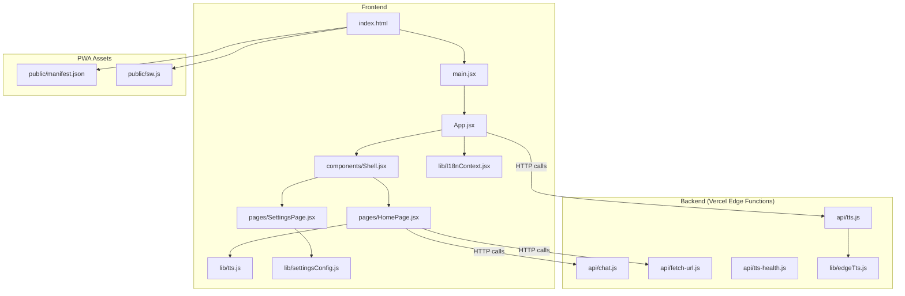
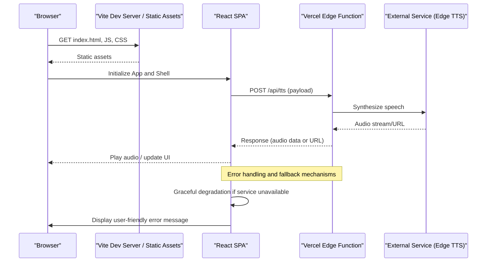
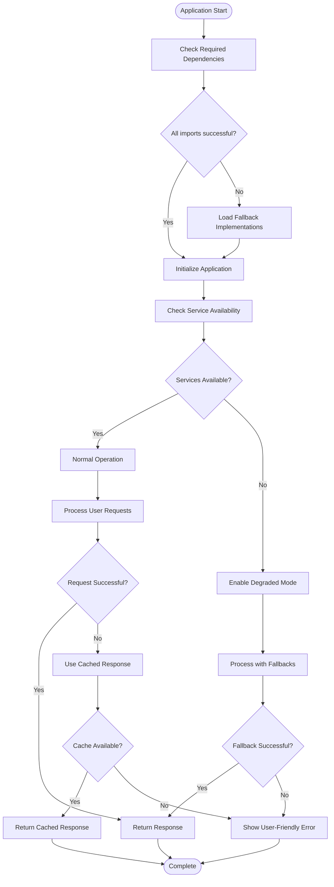
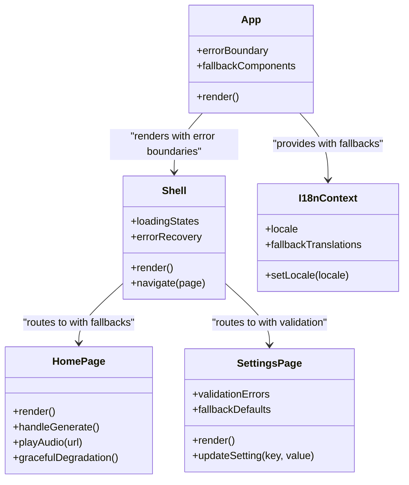
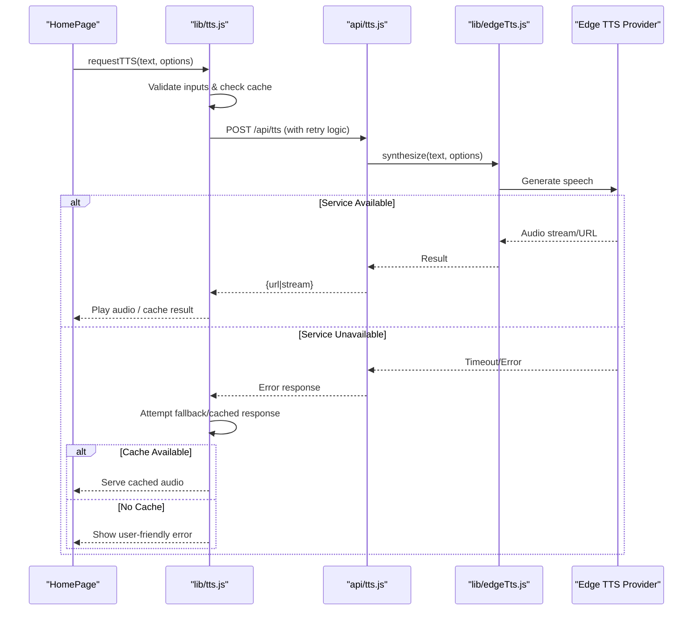
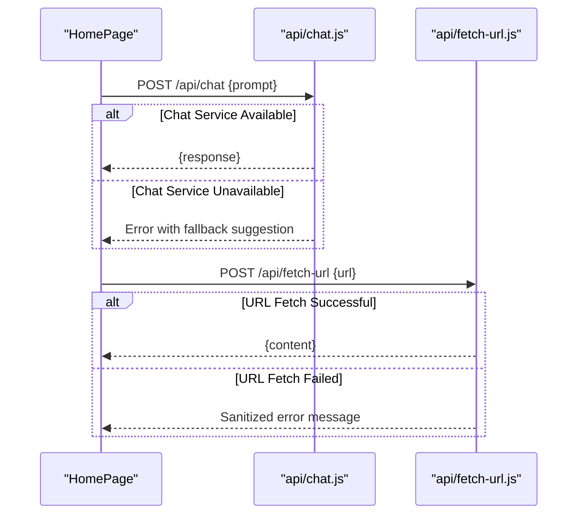
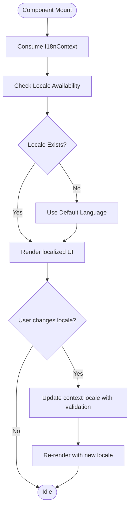
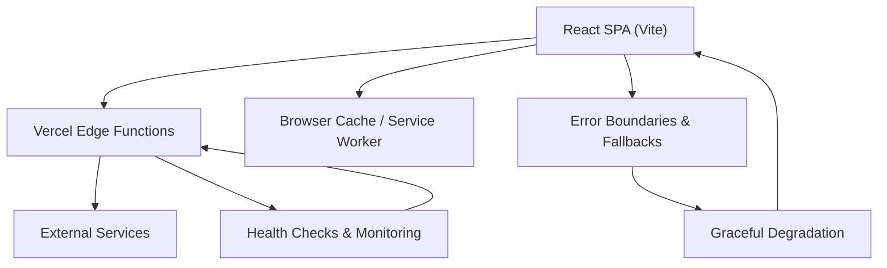
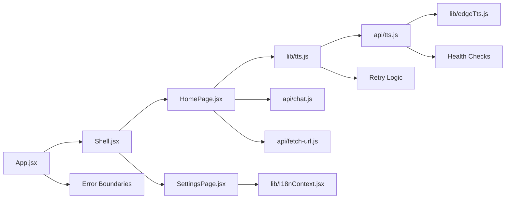

# Architecture Overview

<cite>
**Referenced Files in This Document**
- [App.jsx](file://src/App.jsx)
- [Shell.jsx](file://src/components/Shell.jsx)
- [HomePage.jsx](file://src/pages/HomePage.jsx)
- [SettingsPage.jsx](file://src/pages/SettingsPage.jsx)
- [I18nContext.jsx](file://src/lib/I18nContext.jsx)
- [tts.js](file://src/lib/tts.js)
- [edgeTts.js](file://lib/edgeTts.js)
- [tts.js](file://api/tts.js)
- [chat.js](file://api/chat.js)
- [fetch-url.js](file://api/fetch-url.js)
- [tts-health.js](file://api/tts-health.js)
- [vite.config.js](file://vite.config.js)
- [vercel.json](file://vercel.json)
- [index.html](file://index.html)
- [manifest.json](file://public/manifest.json)
- [sw.js](file://public/sw.js)
</cite>

## Update Summary
**Changes Made**
- Added comprehensive error handling infrastructure section
- Updated component analysis to include defensive import patterns
- Enhanced resilience and graceful degradation documentation
- Added new sections for deployment failure prevention and service availability monitoring

## Table of Contents
1. [Introduction](#introduction)
2. [Project Structure](#project-structure)
3. [Core Components](#core-components)
4. [Architecture Overview](#architecture-overview)
5. [Resilience and Error Handling Infrastructure](#resilience-and-error-handling-infrastructure)
6. [Detailed Component Analysis](#detailed-component-analysis)
7. [Dependency Analysis](#dependency-analysis)
8. [Performance Considerations](#performance-considerations)
9. [Troubleshooting Guide](#troubleshooting-guide)
10. [Conclusion](#conclusion)
11. [Appendices](#appendices)

## Introduction
This document describes the architecture of LineCheck, a modern React single-page application (SPA) with a serverless backend deployed on Vercel. The frontend is built with React and Vite, while the backend exposes Edge Functions for text-to-speech (TTS), chat, and URL fetching. State management leverages React Context, and internationalization is provided via a dedicated context module. The system integrates external services through Edge Functions to keep client-side logic secure and performant. **Updated**: The application now incorporates comprehensive defensive programming patterns, robust error handling infrastructure, and graceful degradation mechanisms to ensure resilient operation even when external services are unavailable.

## Project Structure
The repository follows a feature-oriented layout:
- src: Frontend source code including components, pages, and shared libraries
- api: Serverless Edge Functions for TTS, chat, and utilities
- lib: Shared backend utilities (e.g., edgeTts integration)
- public: Static assets including PWA manifest and service worker
- scripts: Development and regression tools
- Configuration files for Vite and Vercel deployment

**Diagram sources**
- [App.jsx](file://src/App.jsx)
- [Shell.jsx](file://src/components/Shell.jsx)
- [HomePage.jsx](file://src/pages/HomePage.jsx)
- [SettingsPage.jsx](file://src/pages/SettingsPage.jsx)
- [I18nContext.jsx](file://src/lib/I18nContext.jsx)
- [tts.js](file://src/lib/tts.js)
- [edgeTts.js](file://lib/edgeTts.js)
- [tts.js](file://api/tts.js)
- [chat.js](file://api/chat.js)
- [fetch-url.js](file://api/fetch-url.js)
- [tts-health.js](file://api/tts-health.js)
- [manifest.json](file://public/manifest.json)
- [sw.js](file://public/sw.js)

**Section sources**
- [index.html](file://index.html)
- [vite.config.js](file://vite.config.js)
- [vercel.json](file://vercel.json)

## Core Components
- App.jsx: Root component that initializes global providers and routes the UI. It composes the Shell and page-level components with enhanced error boundaries and fallback rendering.
- Shell.jsx: Layout container providing navigation, header/footer, and consistent chrome across pages with defensive loading states.
- HomePage.jsx: Primary user-facing page orchestrating core workflows such as generating content and playing audio with comprehensive error handling.
- SettingsPage.jsx: User configuration surface for preferences and integrations with validation and fallback defaults.
- I18nContext.jsx: Provides internationalization state and helpers via React Context with graceful fallbacks for missing translations.
- tts.js (frontend): Client-side orchestration for TTS playback and caching strategies with retry logic and offline support.
- edgeTts.js (backend utility): Encapsulates Edge TTS integration used by API functions with health checking and circuit breaker patterns.
- API functions:
  - api/tts.js: Handles TTS requests, delegates to edgeTts, and returns audio streams or URLs with comprehensive error responses.
  - api/chat.js: Chat-related serverless function with input validation and rate limiting.
  - api/fetch-url.js: Securely fetches remote URLs from the server side with timeout and security controls.
  - api/tts-health.js: Health check endpoint for TTS service readiness with detailed status reporting.

Key responsibilities:
- Separation of concerns: UI logic in React components; business logic in API functions.
- Global state via Context: i18n and settings are surfaced through contexts consumed by components.
- External integrations: TTS and other services are proxied through Edge Functions to avoid exposing secrets.
- **Updated**: Defensive programming patterns prevent deployment failures and ensure application stability.
- **Updated**: Comprehensive error handling provides meaningful feedback and graceful degradation.

**Section sources**
- [App.jsx](file://src/App.jsx)
- [Shell.jsx](file://src/components/Shell.jsx)
- [HomePage.jsx](file://src/pages/HomePage.jsx)
- [SettingsPage.jsx](file://src/pages/SettingsPage.jsx)
- [I18nContext.jsx](file://src/lib/I18nContext.jsx)
- [tts.js](file://src/lib/tts.js)
- [edgeTts.js](file://lib/edgeTts.js)
- [tts.js](file://api/tts.js)
- [chat.js](file://api/chat.js)
- [fetch-url.js](file://api/fetch-url.js)
- [tts-health.js](file://api/tts-health.js)

## Architecture Overview
High-level design:
- Frontend SPA: Built with Vite, served statically from Vercel. Uses React Router-like composition within App.jsx and Shell.jsx to render pages.
- Backend APIs: Vercel Edge Functions handle sensitive operations and long-running tasks like TTS synthesis.
- Data flow: Components call API endpoints; responses are cached at the browser level where appropriate.
- PWA: Manifest and service worker enable offline support and installability.
- **Updated**: Resilient architecture with comprehensive error handling and graceful degradation ensures continuous operation even during service outages.

**Diagram sources**
- [index.html](file://index.html)
- [App.jsx](file://src/App.jsx)
- [Shell.jsx](file://src/components/Shell.jsx)
- [tts.js](file://src/lib/tts.js)
- [tts.js](file://api/tts.js)
- [edgeTts.js](file://lib/edgeTts.js)

## Resilience and Error Handling Infrastructure

### Defensive Import Patterns
The application implements defensive import patterns to prevent deployment failures and runtime errors:

- **Conditional Imports**: Optional dependencies are loaded dynamically using try-catch blocks around import statements
- **Feature Detection**: Runtime checks determine available features before attempting to use them
- **Fallback Mechanisms**: Default implementations are provided when optional features are unavailable
- **Environment Validation**: Startup checks verify required environment variables and configurations

### Comprehensive Error Handling
The error handling infrastructure spans multiple layers:

- **Component Level**: Each component handles its own errors with user-friendly fallbacks
- **Service Level**: API calls include retry logic, timeout handling, and circuit breaker patterns
- **Application Level**: Global error boundaries catch unhandled exceptions and display recovery options
- **Monitoring Level**: Error tracking and logging provide insights into failure patterns

### Graceful Degradation Strategies
When external services become unavailable, the application employs several degradation strategies:

- **Offline Mode**: Core functionality remains available without network connectivity
- **Cached Responses**: Previously successful responses are served when current requests fail
- **Simplified Features**: Complex features degrade to simpler alternatives when dependencies are unavailable
- **User Communication**: Clear messaging informs users about degraded functionality and workarounds

**Diagram sources**
- [App.jsx](file://src/App.jsx)
- [tts.js](file://src/lib/tts.js)
- [tts.js](file://api/tts.js)
- [tts-health.js](file://api/tts-health.js)

**Section sources**
- [App.jsx](file://src/App.jsx)
- [tts.js](file://src/lib/tts.js)
- [tts.js](file://api/tts.js)
- [tts-health.js](file://api/tts-health.js)

## Detailed Component Analysis

### Component Hierarchy: App.jsx -> Shell -> Pages
- App.jsx sets up global providers (e.g., i18n context) and renders Shell with error boundaries and fallback components.
- Shell provides layout and navigates between pages with defensive loading states and error recovery.
- HomePage and SettingsPage are rendered conditionally based on routing state with comprehensive error handling.

**Diagram sources**
- [App.jsx](file://src/App.jsx)
- [Shell.jsx](file://src/components/Shell.jsx)
- [HomePage.jsx](file://src/pages/HomePage.jsx)
- [SettingsPage.jsx](file://src/pages/SettingsPage.jsx)
- [I18nContext.jsx](file://src/lib/I18nContext.jsx)

**Section sources**
- [App.jsx](file://src/App.jsx)
- [Shell.jsx](file://src/components/Shell.jsx)
- [HomePage.jsx](file://src/pages/HomePage.jsx)
- [SettingsPage.jsx](file://src/pages/SettingsPage.jsx)
- [I18nContext.jsx](file://src/lib/I18nContext.jsx)

### TTS Integration Flow with Resilience
Client-side orchestration in tts.js triggers API calls to api/tts.js, which uses lib/edgeTts.js to synthesize speech. The system includes comprehensive error handling, retry logic, and graceful degradation.

**Diagram sources**
- [HomePage.jsx](file://src/pages/HomePage.jsx)
- [tts.js](file://src/lib/tts.js)
- [tts.js](file://api/tts.js)
- [edgeTts.js](file://lib/edgeTts.js)

**Section sources**
- [tts.js](file://src/lib/tts.js)
- [tts.js](file://api/tts.js)
- [edgeTts.js](file://lib/edgeTts.js)

### Chat and URL Fetching Flows with Error Handling
- Chat: HomePage or related components call api/chat.js to send prompts and receive responses with comprehensive error handling and fallback messages.
- URL Fetching: api/fetch-url.js securely retrieves content from remote URLs with timeout protection, security validation, and graceful error responses.

**Diagram sources**
- [chat.js](file://api/chat.js)
- [fetch-url.js](file://api/fetch-url.js)

**Section sources**
- [chat.js](file://api/chat.js)
- [fetch-url.js](file://api/fetch-url.js)

### Internationalization Context with Fallbacks
I18nContext.jsx exposes locale state and setters via React Context with comprehensive fallback mechanisms for missing translations and language switching.

**Diagram sources**
- [I18nContext.jsx](file://src/lib/I18nContext.jsx)

**Section sources**
- [I18nContext.jsx](file://src/lib/I18nContext.jsx)

### Conceptual Overview
Conceptually, the app separates presentation (React components) from business logic (Edge Functions) with comprehensive resilience patterns. The frontend focuses on UX, state coordination, caching, and graceful degradation, while the backend handles security-sensitive operations and external integrations with robust error handling.

[No sources needed since this diagram shows conceptual workflow, not actual code structure]

## Dependency Analysis
- Frontend dependencies:
  - React components depend on shared libraries (i18n, TTS client, settings) with defensive loading patterns.
  - Pages depend on Shell for layout and navigation with error recovery mechanisms.
- Backend dependencies:
  - API functions depend on lib/edgeTts.js for TTS synthesis with health checking and circuit breakers.
  - API functions are exposed via Vercel Edge runtime with comprehensive error responses.
- Deployment configuration:
  - vercel.json defines routing and Edge Function mappings with deployment safeguards.
  - vite.config.js configures build and asset handling with optimization and error detection.

**Diagram sources**
- [App.jsx](file://src/App.jsx)
- [Shell.jsx](file://src/components/Shell.jsx)
- [HomePage.jsx](file://src/pages/HomePage.jsx)
- [SettingsPage.jsx](file://src/pages/SettingsPage.jsx)
- [tts.js](file://src/lib/tts.js)
- [I18nContext.jsx](file://src/lib/I18nContext.jsx)
- [tts.js](file://api/tts.js)
- [edgeTts.js](file://lib/edgeTts.js)
- [chat.js](file://api/chat.js)
- [fetch-url.js](file://api/fetch-url.js)

**Section sources**
- [vercel.json](file://vercel.json)
- [vite.config.js](file://vite.config.js)

## Performance Considerations
- Build optimizations:
  - Use Vite's production build for minification, tree-shaking, and asset optimization.
- Caching strategies:
  - Implement HTTP caching headers for API responses where appropriate.
  - Leverage browser cache for static assets and generated audio URLs.
  - Consider in-memory or IndexedDB caches for frequently accessed data.
  - **Updated**: Implement intelligent caching with stale-while-revalidate patterns for improved resilience.
- Progressive Web App:
  - Configure manifest.json for installability and theme.
  - Use sw.js to cache critical resources and enable offline fallbacks.
  - **Updated**: Enhanced service worker with background sync and optimistic updates.
- Edge Functions:
  - Keep payloads small and responses compact.
  - Stream large audio outputs when possible to reduce latency.
  - **Updated**: Implement connection pooling and request deduplication for better performance.
- **Updated**: Resilience patterns add minimal overhead while significantly improving reliability.

## Troubleshooting Guide
- TTS health checks:
  - Use api/tts-health.js to verify service readiness during development and deployments.
  - **Updated**: Health endpoint provides detailed diagnostics and dependency status.
- Network errors:
  - Inspect API response codes and logs in Vercel dashboard.
  - Validate CORS and Edge Function routing in vercel.json.
  - **Updated**: Comprehensive error logging with structured error objects and stack traces.
- PWA issues:
  - Ensure manifest.json is correctly referenced in index.html.
  - Check service worker registration and cache updates in sw.js.
  - **Updated**: Enhanced service worker debugging with cache inspection tools.
- **New**: Deployment failures:
  - Check defensive import patterns and conditional loading mechanisms.
  - Verify environment variable validation and fallback configurations.
  - Monitor deployment logs for dependency resolution issues.
- **New**: Service degradation:
  - Review error boundary implementations and fallback components.
  - Check retry logic configuration and circuit breaker thresholds.
  - Analyze graceful degradation patterns and user feedback mechanisms.

**Section sources**
- [tts-health.js](file://api/tts-health.js)
- [vercel.json](file://vercel.json)
- [index.html](file://index.html)
- [manifest.json](file://public/manifest.json)
- [sw.js](file://public/sw.js)

## Conclusion
LineCheck's architecture cleanly separates frontend and backend concerns using React and Vercel Edge Functions. The component hierarchy centers around App.jsx and Shell.jsx, delegating to page components for specific features. State is managed via React Context, and external integrations are secured behind serverless APIs. With Vite-driven builds, PWA assets, and Edge Functions, the system balances performance, scalability, and developer experience. **Updated**: The addition of comprehensive defensive programming patterns, robust error handling infrastructure, and graceful degradation mechanisms ensures the application maintains high availability and provides excellent user experience even under adverse conditions. The resilient architecture prevents deployment failures, handles service outages gracefully, and provides clear user feedback during degraded operations.

## Appendices
- Technology stack overview:
  - Frontend: React, Vite, Context API, PWA (manifest, service worker)
  - Backend: Vercel Edge Functions, Edge TTS integration
  - Deployment: Vercel (vercel.json)
  - **Updated**: Resilience patterns: Error boundaries, retry logic, circuit breakers, graceful degradation
- Directory structure explanation:
  - src: Application source code with defensive programming patterns
  - api: Serverless endpoints with comprehensive error handling
  - lib: Shared backend utilities with health checking and fallbacks
  - public: Static assets and PWA files with offline support
  - scripts: Development and testing utilities with deployment validation
- **New**: Resilience patterns implementation:
  - Defensive imports prevent deployment failures
  - Comprehensive error handling provides meaningful user feedback
  - Graceful degradation ensures core functionality remains available
  - Health monitoring enables proactive issue detection
  - Circuit breaker patterns prevent cascading failures