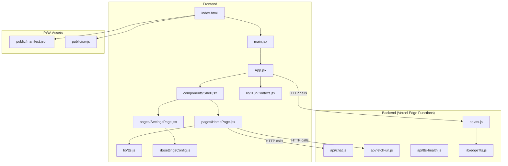
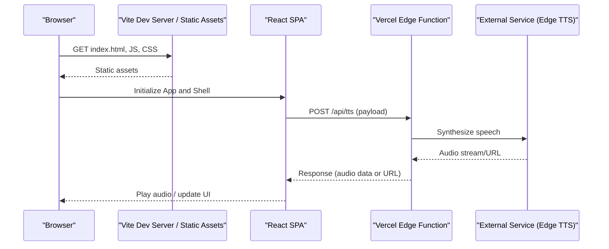
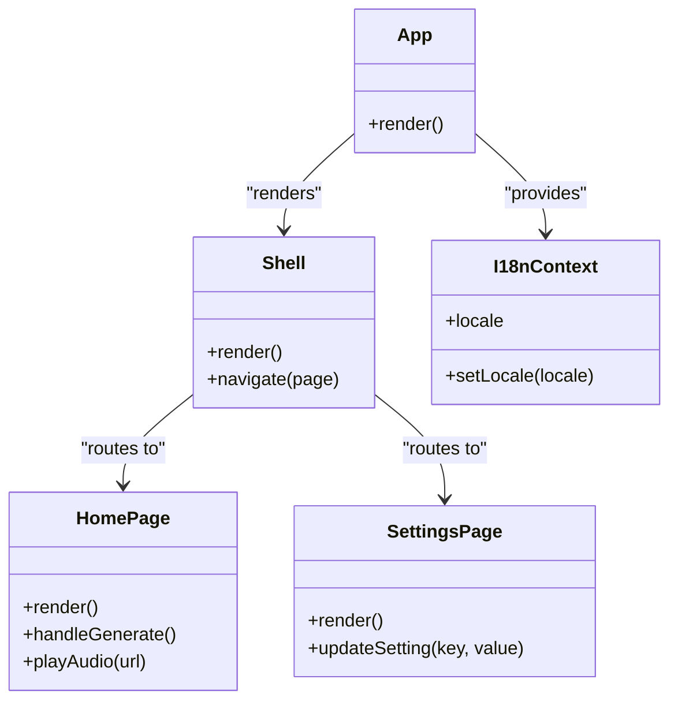
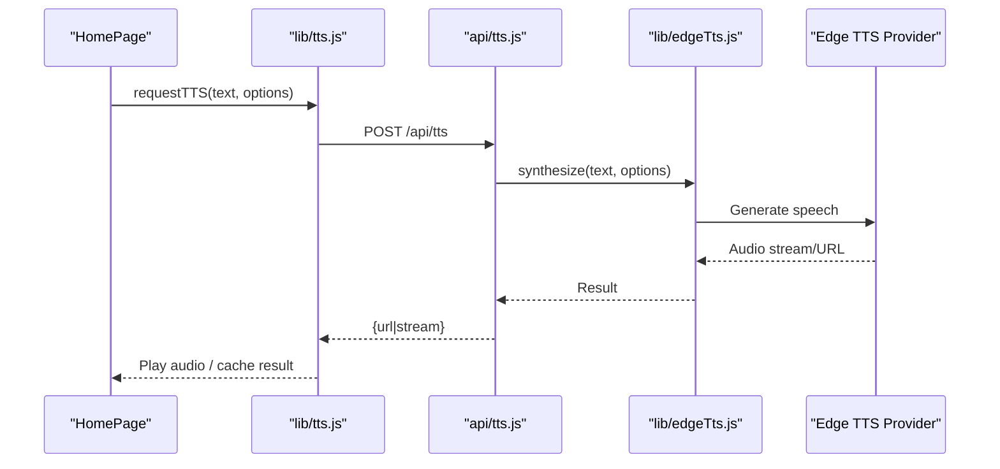
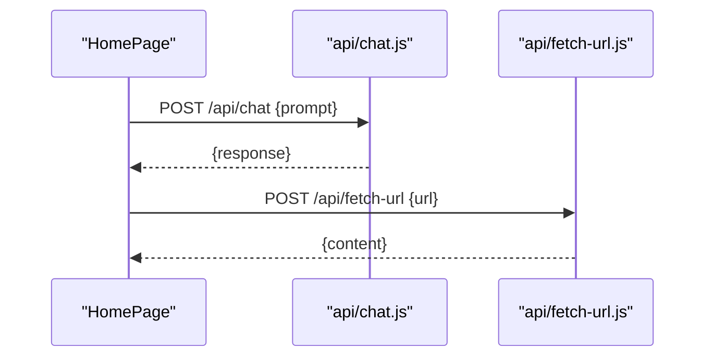
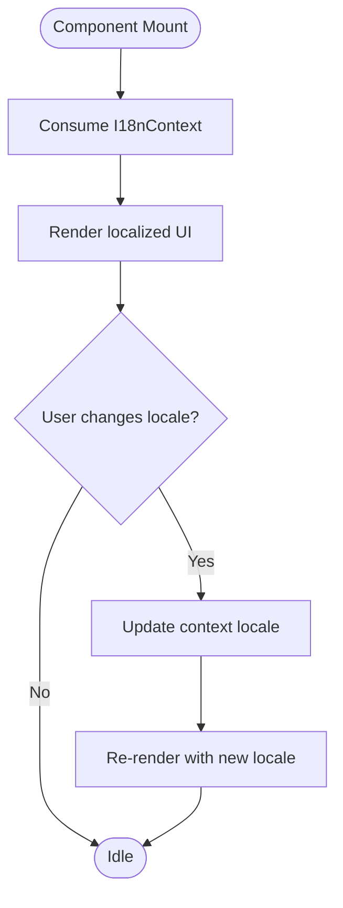
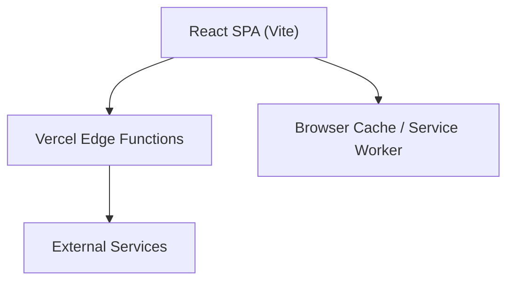
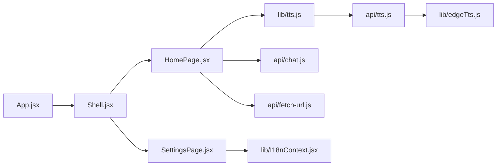

# Architecture Overview

<cite>
**Referenced Files in This Document**
- [App.jsx](file://src/App.jsx)
- [Shell.jsx](file://src/components/Shell.jsx)
- [HomePage.jsx](file://src/pages/HomePage.jsx)
- [SettingsPage.jsx](file://src/pages/SettingsPage.jsx)
- [I18nContext.jsx](file://src/lib/I18nContext.jsx)
- [tts.js](file://src/lib/tts.js)
- [edgeTts.js](file://lib/edgeTts.js)
- [tts.js](file://api/tts.js)
- [chat.js](file://api/chat.js)
- [fetch-url.js](file://api/fetch-url.js)
- [tts-health.js](file://api/tts-health.js)
- [vite.config.js](file://vite.config.js)
- [vercel.json](file://vercel.json)
- [index.html](file://index.html)
- [manifest.json](file://public/manifest.json)
- [sw.js](file://public/sw.js)
</cite>

## Table of Contents
1. [Introduction](#introduction)
2. [Project Structure](#project-structure)
3. [Core Components](#core-components)
4. [Architecture Overview](#architecture-overview)
5. [Detailed Component Analysis](#detailed-component-analysis)
6. [Dependency Analysis](#dependency-analysis)
7. [Performance Considerations](#performance-considerations)
8. [Troubleshooting Guide](#troubleshooting-guide)
9. [Conclusion](#conclusion)
10. [Appendices](#appendices)

## Introduction
This document describes the architecture of LineCheck, a modern React single-page application (SPA) with a serverless backend deployed on Vercel. The frontend is built with React and Vite, while the backend exposes Edge Functions for text-to-speech (TTS), chat, and URL fetching. State management leverages React Context, and internationalization is provided via a dedicated context module. The system integrates external services through Edge Functions to keep client-side logic secure and performant.

## Project Structure
The repository follows a feature-oriented layout:
- src: Frontend source code including components, pages, and shared libraries
- api: Serverless Edge Functions for TTS, chat, and utilities
- lib: Shared backend utilities (e.g., edgeTts integration)
- public: Static assets including PWA manifest and service worker
- scripts: Development and regression tools
- Configuration files for Vite and Vercel deployment

**Diagram sources**
- [App.jsx](file://src/App.jsx)
- [Shell.jsx](file://src/components/Shell.jsx)
- [HomePage.jsx](file://src/pages/HomePage.jsx)
- [SettingsPage.jsx](file://src/pages/SettingsPage.jsx)
- [I18nContext.jsx](file://src/lib/I18nContext.jsx)
- [tts.js](file://src/lib/tts.js)
- [edgeTts.js](file://lib/edgeTts.js)
- [tts.js](file://api/tts.js)
- [chat.js](file://api/chat.js)
- [fetch-url.js](file://api/fetch-url.js)
- [tts-health.js](file://api/tts-health.js)
- [manifest.json](file://public/manifest.json)
- [sw.js](file://public/sw.js)

**Section sources**
- [index.html](file://index.html)
- [vite.config.js](file://vite.config.js)
- [vercel.json](file://vercel.json)

## Core Components
- App.jsx: Root component that initializes global providers and routes the UI. It composes the Shell and page-level components.
- Shell.jsx: Layout container providing navigation, header/footer, and consistent chrome across pages.
- HomePage.jsx: Primary user-facing page orchestrating core workflows such as generating content and playing audio.
- SettingsPage.jsx: User configuration surface for preferences and integrations.
- I18nContext.jsx: Provides internationalization state and helpers via React Context.
- tts.js (frontend): Client-side orchestration for TTS playback and caching strategies.
- edgeTts.js (backend utility): Encapsulates Edge TTS integration used by API functions.
- API functions:
  - api/tts.js: Handles TTS requests, delegates to edgeTts, and returns audio streams or URLs.
  - api/chat.js: Chat-related serverless function.
  - api/fetch-url.js: Securely fetches remote URLs from the server side.
  - api/tts-health.js: Health check endpoint for TTS service readiness.

Key responsibilities:
- Separation of concerns: UI logic in React components; business logic in API functions.
- Global state via Context: i18n and settings are surfaced through contexts consumed by components.
- External integrations: TTS and other services are proxied through Edge Functions to avoid exposing secrets.

**Section sources**
- [App.jsx](file://src/App.jsx)
- [Shell.jsx](file://src/components/Shell.jsx)
- [HomePage.jsx](file://src/pages/HomePage.jsx)
- [SettingsPage.jsx](file://src/pages/SettingsPage.jsx)
- [I18nContext.jsx](file://src/lib/I18nContext.jsx)
- [tts.js](file://src/lib/tts.js)
- [edgeTts.js](file://lib/edgeTts.js)
- [tts.js](file://api/tts.js)
- [chat.js](file://api/chat.js)
- [fetch-url.js](file://api/fetch-url.js)
- [tts-health.js](file://api/tts-health.js)

## Architecture Overview
High-level design:
- Frontend SPA: Built with Vite, served statically from Vercel. Uses React Router-like composition within App.jsx and Shell.jsx to render pages.
- Backend APIs: Vercel Edge Functions handle sensitive operations and long-running tasks like TTS synthesis.
- Data flow: Components call API endpoints; responses are cached at the browser level where appropriate.
- PWA: Manifest and service worker enable offline support and installability.

**Diagram sources**
- [index.html](file://index.html)
- [App.jsx](file://src/App.jsx)
- [Shell.jsx](file://src/components/Shell.jsx)
- [tts.js](file://src/lib/tts.js)
- [tts.js](file://api/tts.js)
- [edgeTts.js](file://lib/edgeTts.js)

## Detailed Component Analysis

### Component Hierarchy: App.jsx -> Shell -> Pages
- App.jsx sets up global providers (e.g., i18n context) and renders Shell.
- Shell provides layout and navigates between pages.
- HomePage and SettingsPage are rendered conditionally based on routing state.

**Diagram sources**
- [App.jsx](file://src/App.jsx)
- [Shell.jsx](file://src/components/Shell.jsx)
- [HomePage.jsx](file://src/pages/HomePage.jsx)
- [SettingsPage.jsx](file://src/pages/SettingsPage.jsx)
- [I18nContext.jsx](file://src/lib/I18nContext.jsx)

**Section sources**
- [App.jsx](file://src/App.jsx)
- [Shell.jsx](file://src/components/Shell.jsx)
- [HomePage.jsx](file://src/pages/HomePage.jsx)
- [SettingsPage.jsx](file://src/pages/SettingsPage.jsx)
- [I18nContext.jsx](file://src/lib/I18nContext.jsx)

### TTS Integration Flow
Client-side orchestration in tts.js triggers API calls to api/tts.js, which uses lib/edgeTts.js to synthesize speech. Responses may be streamed or returned as URLs for playback.

**Diagram sources**
- [HomePage.jsx](file://src/pages/HomePage.jsx)
- [tts.js](file://src/lib/tts.js)
- [tts.js](file://api/tts.js)
- [edgeTts.js](file://lib/edgeTts.js)

**Section sources**
- [tts.js](file://src/lib/tts.js)
- [tts.js](file://api/tts.js)
- [edgeTts.js](file://lib/edgeTts.js)

### Chat and URL Fetching Flows
- Chat: HomePage or related components call api/chat.js to send prompts and receive responses.
- URL Fetching: api/fetch-url.js securely retrieves content from remote URLs, returning sanitized results to the client.

**Diagram sources**
- [chat.js](file://api/chat.js)
- [fetch-url.js](file://api/fetch-url.js)

**Section sources**
- [chat.js](file://api/chat.js)
- [fetch-url.js](file://api/fetch-url.js)

### Internationalization Context
I18nContext.jsx exposes locale state and setters via React Context. Components consume this context to render localized strings and switch languages dynamically.

**Diagram sources**
- [I18nContext.jsx](file://src/lib/I18nContext.jsx)

**Section sources**
- [I18nContext.jsx](file://src/lib/I18nContext.jsx)

### Conceptual Overview
Conceptually, the app separates presentation (React components) from business logic (Edge Functions). The frontend focuses on UX, state coordination, and caching, while the backend handles security-sensitive operations and external integrations.

[No sources needed since this diagram shows conceptual workflow, not actual code structure]

## Dependency Analysis
- Frontend dependencies:
  - React components depend on shared libraries (i18n, TTS client, settings).
  - Pages depend on Shell for layout and navigation.
- Backend dependencies:
  - API functions depend on lib/edgeTts.js for TTS synthesis.
  - API functions are exposed via Vercel Edge runtime.
- Deployment configuration:
  - vercel.json defines routing and Edge Function mappings.
  - vite.config.js configures build and asset handling.

**Diagram sources**
- [App.jsx](file://src/App.jsx)
- [Shell.jsx](file://src/components/Shell.jsx)
- [HomePage.jsx](file://src/pages/HomePage.jsx)
- [SettingsPage.jsx](file://src/pages/SettingsPage.jsx)
- [tts.js](file://src/lib/tts.js)
- [I18nContext.jsx](file://src/lib/I18nContext.jsx)
- [tts.js](file://api/tts.js)
- [edgeTts.js](file://lib/edgeTts.js)
- [chat.js](file://api/chat.js)
- [fetch-url.js](file://api/fetch-url.js)

**Section sources**
- [vercel.json](file://vercel.json)
- [vite.config.js](file://vite.config.js)

## Performance Considerations
- Build optimizations:
  - Use Vite’s production build for minification, tree-shaking, and asset optimization.
- Caching strategies:
  - Implement HTTP caching headers for API responses where appropriate.
  - Leverage browser cache for static assets and generated audio URLs.
  - Consider in-memory or IndexedDB caches for frequently accessed data.
- Progressive Web App:
  - Configure manifest.json for installability and theme.
  - Use sw.js to cache critical resources and enable offline fallbacks.
- Edge Functions:
  - Keep payloads small and responses compact.
  - Stream large audio outputs when possible to reduce latency.

[No sources needed since this section provides general guidance]

## Troubleshooting Guide
- TTS health checks:
  - Use api/tts-health.js to verify service readiness during development and deployments.
- Network errors:
  - Inspect API response codes and logs in Vercel dashboard.
  - Validate CORS and Edge Function routing in vercel.json.
- PWA issues:
  - Ensure manifest.json is correctly referenced in index.html.
  - Check service worker registration and cache updates in sw.js.

**Section sources**
- [tts-health.js](file://api/tts-health.js)
- [vercel.json](file://vercel.json)
- [index.html](file://index.html)
- [manifest.json](file://public/manifest.json)
- [sw.js](file://public/sw.js)

## Conclusion
LineCheck’s architecture cleanly separates frontend and backend concerns using React and Vercel Edge Functions. The component hierarchy centers around App.jsx and Shell.jsx, delegating to page components for specific features. State is managed via React Context, and external integrations are secured behind serverless APIs. With Vite-driven builds, PWA assets, and Edge Functions, the system balances performance, scalability, and developer experience.

## Appendices
- Technology stack overview:
  - Frontend: React, Vite, Context API, PWA (manifest, service worker)
  - Backend: Vercel Edge Functions, Edge TTS integration
  - Deployment: Vercel (vercel.json)
- Directory structure explanation:
  - src: Application source code
  - api: Serverless endpoints
  - lib: Shared backend utilities
  - public: Static assets and PWA files
  - scripts: Development and testing utilities

[No sources needed since this section summarizes without analyzing specific files]