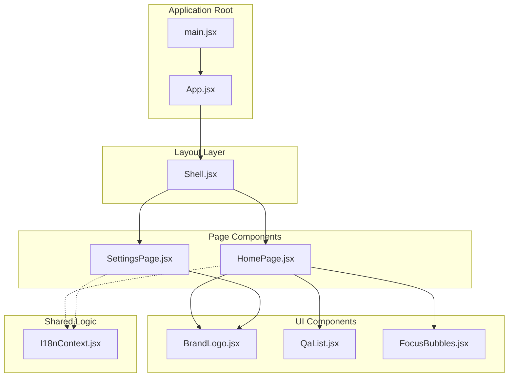
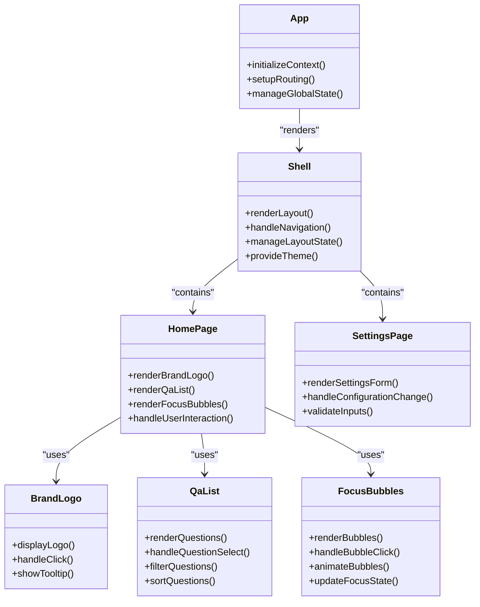
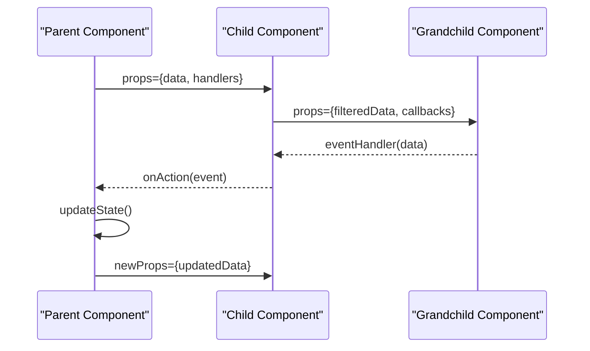
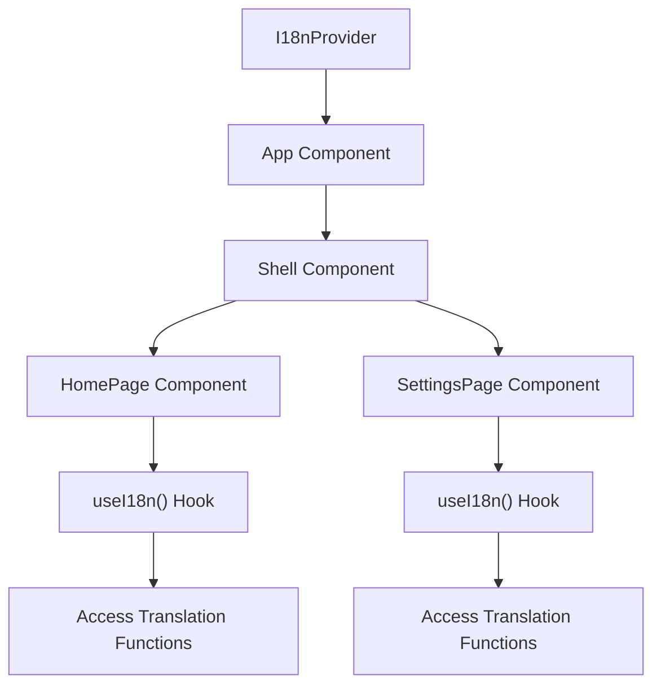
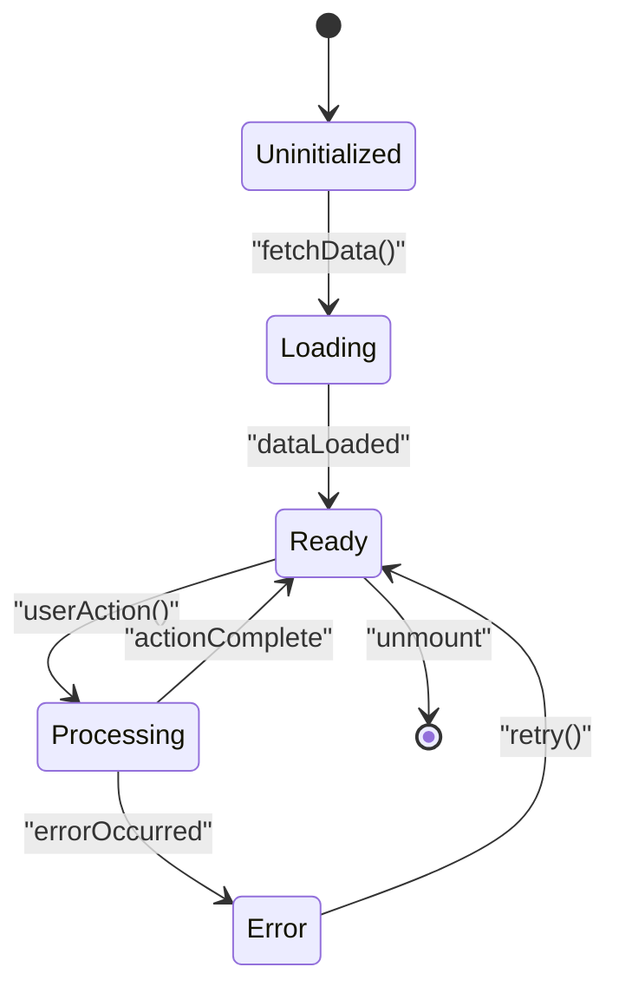

# Component Architecture

<cite>
**Referenced Files in This Document**
- [App.jsx](file://src/App.jsx)
- [main.jsx](file://src/main.jsx)
- [Shell.jsx](file://src/components/Shell.jsx)
- [HomePage.jsx](file://src/pages/HomePage.jsx)
- [SettingsPage.jsx](file://src/pages/SettingsPage.jsx)
- [BrandLogo.jsx](file://src/components/BrandLogo.jsx)
- [QaList.jsx](file://src/components/QaList.jsx)
- [FocusBubbles.jsx](file://src/components/FocusBubbles.jsx)
- [I18nContext.jsx](file://src/lib/I18nContext.jsx)
</cite>

## Table of Contents
1. [Introduction](#introduction)
2. [Project Structure](#project-structure)
3. [Core Components](#core-components)
4. [Architecture Overview](#architecture-overview)
5. [Detailed Component Analysis](#detailed-component-analysis)
6. [Component Communication Patterns](#component-communication-patterns)
7. [State Management Approach](#state-management-approach)
8. [Performance Considerations](#performance-considerations)
9. [Troubleshooting Guide](#troubleshooting-guide)
10. [Conclusion](#conclusion)

## Introduction

This document provides a comprehensive analysis of LineCheck's React-based UI component architecture. The application follows modern React patterns with a clear separation of concerns, utilizing context for global state management and maintaining a well-organized component hierarchy. The architecture emphasizes reusability, maintainability, and performance optimization through strategic component composition and efficient state management.

## Project Structure

The LineCheck application follows a feature-based organization pattern with clear separation between components, pages, and shared logic:

**Diagram sources**
- [main.jsx](file://src/main.jsx)
- [App.jsx](file://src/App.jsx)
- [Shell.jsx](file://src/components/Shell.jsx)
- [HomePage.jsx](file://src/pages/HomePage.jsx)
- [SettingsPage.jsx](file://src/pages/SettingsPage.jsx)

**Section sources**
- [main.jsx](file://src/main.jsx)
- [App.jsx](file://src/App.jsx)

## Core Components

### Application Entry Point (App.jsx)

The App component serves as the root component that initializes the application context and manages top-level routing logic. It acts as the primary container for the entire application, providing the foundation for component communication and global state management.

### Layout Wrapper (Shell.jsx)

The Shell component functions as the main layout wrapper, responsible for:
- Providing consistent page structure and navigation
- Managing application-wide layout state
- Coordinating between different page components
- Handling responsive design considerations

### Page Components

#### HomePage.jsx
The primary landing page component that orchestrates the main user interface elements including brand presentation, question lists, and interactive focus elements.

#### SettingsPage.jsx  
A dedicated configuration page that allows users to customize application behavior and preferences while maintaining consistent branding and layout patterns.

**Section sources**
- [App.jsx](file://src/App.jsx)
- [Shell.jsx](file://src/components/Shell.jsx)
- [HomePage.jsx](file://src/pages/HomePage.jsx)
- [SettingsPage.jsx](file://src/pages/SettingsPage.jsx)

## Architecture Overview

The component architecture follows a hierarchical pattern with clear separation of responsibilities:

**Diagram sources**
- [App.jsx](file://src/App.jsx)
- [Shell.jsx](file://src/components/Shell.jsx)
- [HomePage.jsx](file://src/pages/HomePage.jsx)
- [SettingsPage.jsx](file://src/pages/SettingsPage.jsx)
- [BrandLogo.jsx](file://src/components/BrandLogo.jsx)
- [QaList.jsx](file://src/components/QaList.jsx)
- [FocusBubbles.jsx](file://src/components/FocusBubbles.jsx)

## Detailed Component Analysis

### Component Hierarchy and Composition

The application implements a layered component architecture where each level has specific responsibilities:

#### Root Level (App.jsx)
- Initializes application context and providers
- Sets up global error boundaries
- Manages application lifecycle events
- Configures internationalization support

#### Layout Level (Shell.jsx)
- Provides consistent page structure
- Handles responsive navigation
- Manages theme and styling context
- Coordinates between child components

#### Page Level (HomePage.jsx, SettingsPage.jsx)
- Implements page-specific business logic
- Manages local component state
- Handles user interactions
- Composes reusable UI components

#### UI Component Level (BrandLogo.jsx, QaList.jsx, FocusBubbles.jsx)
- Focuses on presentation and interaction
- Maintains minimal internal state
- Exposes clear props interfaces
- Implements accessibility features

**Section sources**
- [App.jsx](file://src/App.jsx)
- [Shell.jsx](file://src/components/Shell.jsx)
- [HomePage.jsx](file://src/pages/HomePage.jsx)
- [SettingsPage.jsx](file://src/pages/SettingsPage.jsx)

### Component Responsibilities and Relationships

#### BrandLogo Component
The BrandLogo component is responsible for displaying the application's visual identity and handling brand-related interactions. It maintains a simple prop interface focused on size, positioning, and click handlers.

#### QaList Component  
The QaList component manages question display and interaction logic. It handles data filtering, sorting, and selection states while providing a clean interface for parent components to control behavior.

#### FocusBubbles Component
The FocusBubbles component creates interactive bubble elements that respond to user input. It manages animation states, focus indicators, and visual feedback for enhanced user experience.

**Section sources**
- [BrandLogo.jsx](file://src/components/BrandLogo.jsx)
- [QaList.jsx](file://src/components/QaList.jsx)
- [FocusBubbles.jsx](file://src/components/FocusBubbles.jsx)

## Component Communication Patterns

### Parent-Child Communication

The application primarily uses prop drilling for parent-child communication, which works effectively given the shallow component hierarchy:

**Diagram sources**
- [HomePage.jsx](file://src/pages/HomePage.jsx)
- [BrandLogo.jsx](file://src/components/BrandLogo.jsx)
- [QaList.jsx](file://src/components/QaList.jsx)

### Context API Usage

For global state management, the application leverages the Context API through the I18nContext:

**Diagram sources**
- [I18nContext.jsx](file://src/lib/I18nContext.jsx)
- [App.jsx](file://src/App.jsx)
- [HomePage.jsx](file://src/pages/HomePage.jsx)
- [SettingsPage.jsx](file://src/pages/SettingsPage.jsx)

### Event Handling Strategies

The application implements a consistent event handling pattern:
- **Event Bubbling**: Child components emit events upward through callback props
- **State Lifting**: Parent components manage shared state and pass down derived props
- **Event Delegation**: High-performance event handling for dynamic content

**Section sources**
- [HomePage.jsx](file://src/pages/HomePage.jsx)
- [I18nContext.jsx](file://src/lib/I18nContext.jsx)

## State Management Approach

### Local State Management
Components use React's useState hook for managing local component state, focusing on UI-specific concerns like form inputs, toggle states, and temporary data.

### Global State Management
The application uses Context API for global state that needs to be accessed across multiple components, particularly for internationalization and theme management.

### State Flow Pattern

**Section sources**
- [HomePage.jsx](file://src/pages/HomePage.jsx)
- [SettingsPage.jsx](file://src/pages/SettingsPage.jsx)
- [I18nContext.jsx](file://src/lib/I18nContext.jsx)

## Performance Considerations

### Component Optimization Strategies
- **Memoization**: Strategic use of React.memo for expensive components
- **Lazy Loading**: Code splitting for route-based loading
- **Efficient Re-renders**: Proper prop passing and state organization

### Rendering Optimization
- **Virtual Scrolling**: For large lists in QaList component
- **Image Optimization**: Lazy loading for BrandLogo assets
- **Animation Performance**: Hardware-accelerated CSS transforms

## Troubleshooting Guide

### Common Component Issues
- **Prop Drilling Problems**: Use Context API for deeply nested state sharing
- **Memory Leaks**: Ensure proper cleanup in useEffect hooks
- **Performance Bottlenecks**: Implement component memoization and code splitting

### Debugging Strategies
- **React DevTools**: Inspect component tree and state
- **Console Logging**: Strategic logging for component lifecycle
- **Error Boundaries**: Graceful error handling at component level

## Conclusion

LineCheck's component architecture demonstrates best practices in React development with clear separation of concerns, efficient state management, and maintainable component structure. The combination of prop drilling for local communication and Context API for global state provides an optimal balance between simplicity and scalability. The modular design enables easy testing, maintenance, and future enhancements while ensuring consistent user experience across all pages and components.