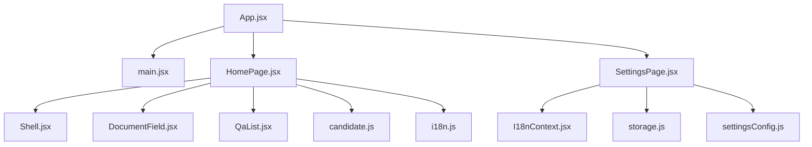
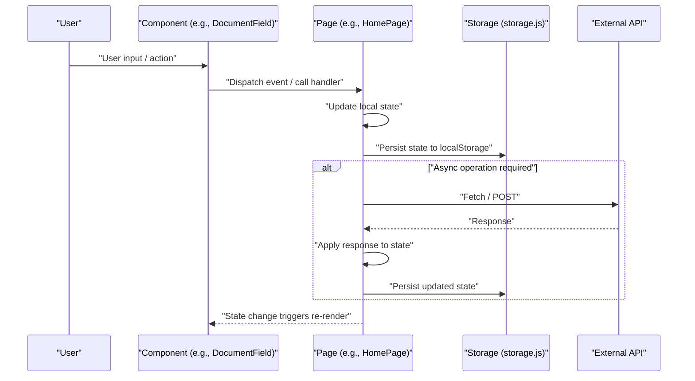
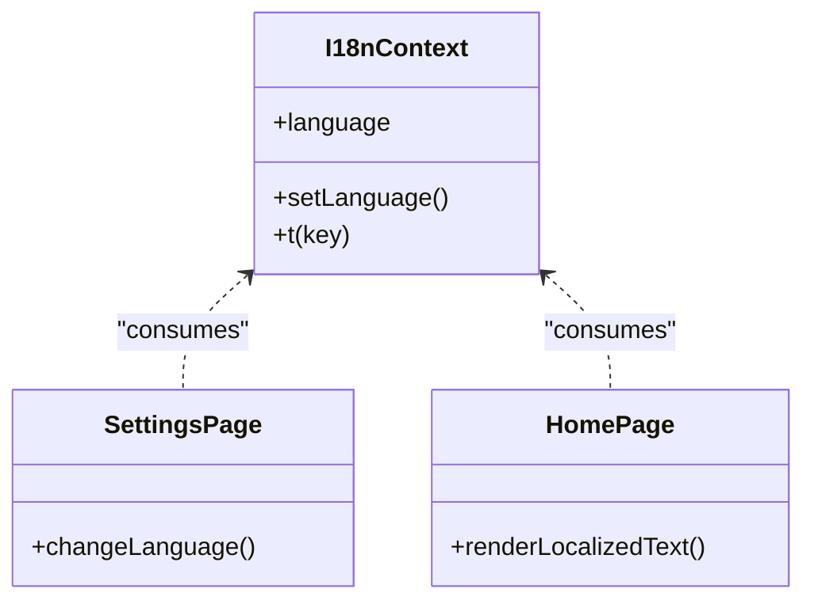
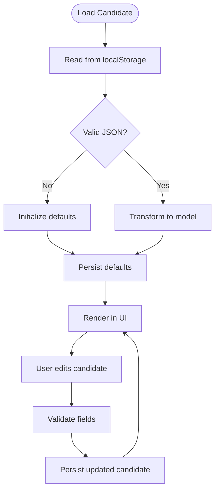
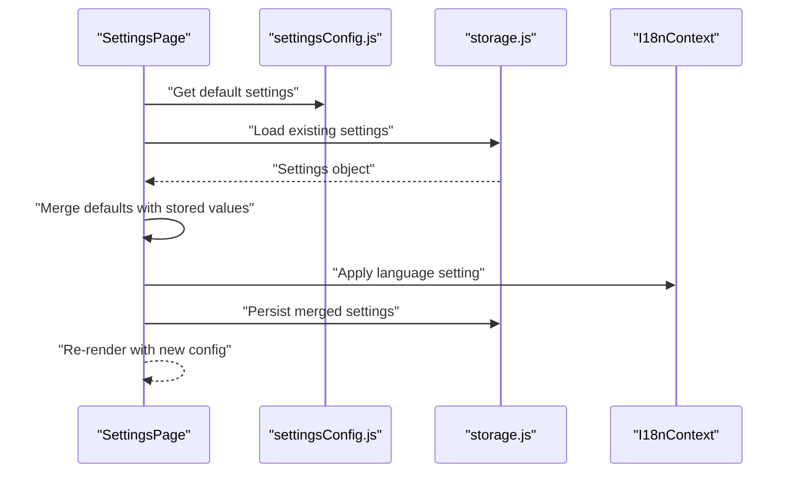
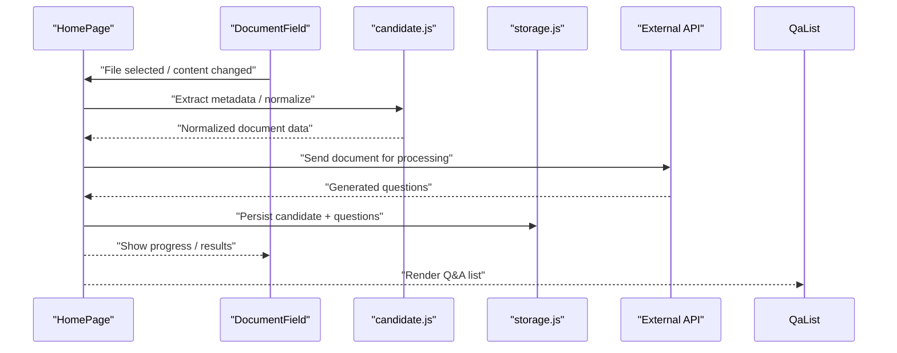
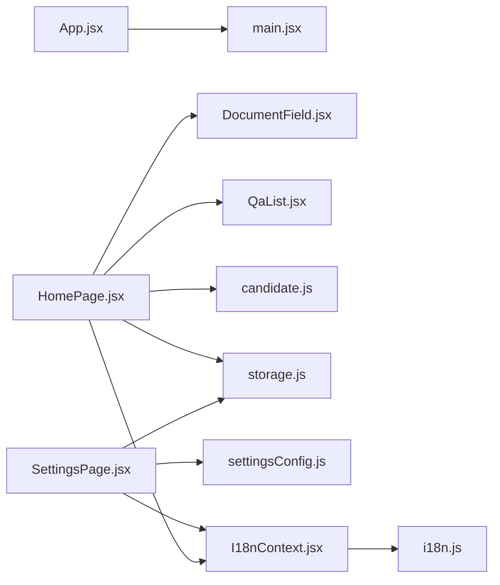

# Data Flow Patterns

<cite>
**Referenced Files in This Document**
- [App.jsx](file://src/App.jsx)
- [main.jsx](file://src/main.jsx)
- [I18nContext.jsx](file://src/lib/I18nContext.jsx)
- [i18n.js](file://src/lib/i18n.js)
- [storage.js](file://src/lib/storage.js)
- [candidate.js](file://src/lib/candidate.js)
- [settingsConfig.js](file://src/lib/settingsConfig.js)
- [HomePage.jsx](file://src/pages/HomePage.jsx)
- [SettingsPage.jsx](file://src/pages/SettingsPage.jsx)
- [DocumentField.jsx](file://src/components/DocumentField.jsx)
- [QaList.jsx](file://src/components/QaList.jsx)
- [Shell.jsx](file://src/components/Shell.jsx)
</cite>

## Table of Contents
1. [Introduction](#introduction)
2. [Project Structure](#project-structure)
3. [Core Components](#core-components)
4. [Architecture Overview](#architecture-overview)
5. [Detailed Component Analysis](#detailed-component-analysis)
6. [Dependency Analysis](#dependency-analysis)
7. [Performance Considerations](#performance-considerations)
8. [Troubleshooting Guide](#troubleshooting-guide)
9. [Conclusion](#conclusion)

## Introduction
This document explains LineCheck’s data flow patterns with a focus on unidirectional data flow, global state via React Context (including I18nContext), and local storage persistence for candidate information and settings. It covers how user interactions drive component state updates, how state is persisted to the browser’s local storage, and how async operations integrate with external APIs while maintaining consistency through optimistic updates and conflict resolution strategies.

## Project Structure
The application follows a feature-oriented structure:
- App shell and routing entry points
- Pages that orchestrate domain logic
- Reusable components for UI and interaction
- Library modules for context, i18n, storage, and domain utilities

**Diagram sources**
- [App.jsx](file://src/App.jsx)
- [main.jsx](file://src/main.jsx)
- [HomePage.jsx](file://src/pages/HomePage.jsx)
- [SettingsPage.jsx](file://src/pages/SettingsPage.jsx)
- [Shell.jsx](file://src/components/Shell.jsx)
- [DocumentField.jsx](file://src/components/DocumentField.jsx)
- [QaList.jsx](file://src/components/QaList.jsx)
- [I18nContext.jsx](file://src/lib/I18nContext.jsx)
- [storage.js](file://src/lib/storage.js)
- [settingsConfig.js](file://src/lib/settingsConfig.js)
- [candidate.js](file://src/lib/candidate.js)
- [i18n.js](file://src/lib/i18n.js)

**Section sources**
- [App.jsx](file://src/App.jsx)
- [main.jsx](file://src/main.jsx)
- [HomePage.jsx](file://src/pages/HomePage.jsx)
- [SettingsPage.jsx](file://src/pages/SettingsPage.jsx)
- [Shell.jsx](file://src/components/Shell.jsx)
- [DocumentField.jsx](file://src/components/DocumentField.jsx)
- [QaList.jsx](file://src/components/QaList.jsx)
- [I18nContext.jsx](file://src/lib/I18nContext.jsx)
- [storage.js](file://src/lib/storage.js)
- [settingsConfig.js](file://src/lib/settingsConfig.js)
- [candidate.js](file://src/lib/candidate.js)
- [i18n.js](file://src/lib/i18n.js)

## Core Components
- Global state providers:
  - I18nContext provides internationalization state and setters across the app.
  - Application-level state is typically held in page or component scope and persisted via storage utilities.
- Storage layer:
  - storage.js centralizes read/write operations to localStorage with keys and serialization helpers.
- Domain utilities:
  - candidate.js encapsulates candidate-related data models and transformations.
  - settingsConfig.js defines default settings and schema used by SettingsPage.
- UI orchestration:
  - HomePage orchestrates document processing, question generation, and candidate management flows.
  - SettingsPage manages configuration changes and persists them.
  - Shell, DocumentField, QaList render and handle user interactions that trigger state updates.

Key responsibilities:
- Unidirectional data flow: User actions update local state; state changes are persisted; UI re-renders based on state.
- Persistence: All critical state (candidate info, settings) is synchronized with localStorage.
- Internationalization: I18nContext exposes current language and translation functions to all components.

**Section sources**
- [I18nContext.jsx](file://src/lib/I18nContext.jsx)
- [storage.js](file://src/lib/storage.js)
- [candidate.js](file://src/lib/candidate.js)
- [settingsConfig.js](file://src/lib/settingsConfig.js)
- [HomePage.jsx](file://src/pages/HomePage.jsx)
- [SettingsPage.jsx](file://src/pages/SettingsPage.jsx)
- [Shell.jsx](file://src/components/Shell.jsx)
- [DocumentField.jsx](file://src/components/DocumentField.jsx)
- [QaList.jsx](file://src/components/QaList.jsx)

## Architecture Overview
LineCheck implements a unidirectional data flow:
- Interactions occur in components (e.g., DocumentField, QaList).
- Handlers update local state (React state or Context).
- State changes trigger side effects (persistence via storage.js, API calls if needed).
- UI re-renders with new state.

[No diagram sources since this is a conceptual overview]

## Detailed Component Analysis

### I18nContext and Internationalization Flow
I18nContext provides a global language state and setter. Components consume it to render localized text without prop drilling.

**Diagram sources**
- [I18nContext.jsx](file://src/lib/I18nContext.jsx)
- [SettingsPage.jsx](file://src/pages/SettingsPage.jsx)
- [HomePage.jsx](file://src/pages/HomePage.jsx)

Data flow highlights:
- SettingsPage reads/writes language preference from/to storage.
- I18nContext propagates language to consumers.
- Components use t(key) to render localized strings.

**Section sources**
- [I18nContext.jsx](file://src/lib/I18nContext.jsx)
- [i18n.js](file://src/lib/i18n.js)
- [SettingsPage.jsx](file://src/pages/SettingsPage.jsx)
- [HomePage.jsx](file://src/pages/HomePage.jsx)

### Candidate Information Pipeline
Candidate data is modeled and transformed via candidate.js and persisted using storage.js.

**Diagram sources**
- [candidate.js](file://src/lib/candidate.js)
- [storage.js](file://src/lib/storage.js)
- [HomePage.jsx](file://src/pages/HomePage.jsx)

Validation and transformation:
- candidate.js defines expected fields and transforms raw inputs into normalized structures.
- storage.js serializes/deserializes candidate objects and handles key naming.

Error handling:
- On parse errors, defaults are initialized and persisted to ensure consistent state.

**Section sources**
- [candidate.js](file://src/lib/candidate.js)
- [storage.js](file://src/lib/storage.js)
- [HomePage.jsx](file://src/pages/HomePage.jsx)

### Settings Configuration and Persistence
SettingsPage uses settingsConfig.js to define defaults and validate user changes, then persists via storage.js.

**Diagram sources**
- [SettingsPage.jsx](file://src/pages/SettingsPage.jsx)
- [settingsConfig.js](file://src/lib/settingsConfig.js)
- [storage.js](file://src/lib/storage.js)
- [I18nContext.jsx](file://src/lib/I18nContext.jsx)

Consistency strategy:
- Defaults are always applied first, then overridden by stored values.
- Language changes propagate immediately via I18nContext.

**Section sources**
- [SettingsPage.jsx](file://src/pages/SettingsPage.jsx)
- [settingsConfig.js](file://src/lib/settingsConfig.js)
- [storage.js](file://src/lib/storage.js)
- [I18nContext.jsx](file://src/lib/I18nContext.jsx)

### Document Processing and Question Generation
HomePage coordinates document upload/processing and question list rendering.

**Diagram sources**
- [HomePage.jsx](file://src/pages/HomePage.jsx)
- [DocumentField.jsx](file://src/components/DocumentField.jsx)
- [candidate.js](file://src/lib/candidate.js)
- [storage.js](file://src/lib/storage.js)
- [QaList.jsx](file://src/components/QaList.jsx)

Optimistic updates:
- UI can show immediate feedback (e.g., loading states) before API responses arrive.
- On success, state is finalized and persisted; on failure, rollback to previous state.

**Section sources**
- [HomePage.jsx](file://src/pages/HomePage.jsx)
- [DocumentField.jsx](file://src/components/DocumentField.jsx)
- [QaList.jsx](file://src/components/QaList.jsx)
- [candidate.js](file://src/lib/candidate.js)
- [storage.js](file://src/lib/storage.js)

## Dependency Analysis
High-level dependencies among core modules:

**Diagram sources**
- [App.jsx](file://src/App.jsx)
- [main.jsx](file://src/main.jsx)
- [HomePage.jsx](file://src/pages/HomePage.jsx)
- [SettingsPage.jsx](file://src/pages/SettingsPage.jsx)
- [DocumentField.jsx](file://src/components/DocumentField.jsx)
- [QaList.jsx](file://src/components/QaList.jsx)
- [candidate.js](file://src/lib/candidate.js)
- [settingsConfig.js](file://src/lib/settingsConfig.js)
- [storage.js](file://src/lib/storage.js)
- [I18nContext.jsx](file://src/lib/I18nContext.jsx)
- [i18n.js](file://src/lib/i18n.js)

Coupling and cohesion:
- storage.js is a shared utility with low coupling and high cohesion.
- candidate.js and settingsConfig.js encapsulate domain-specific schemas and transformations.
- I18nContext decouples language concerns from individual components.

Potential circular dependencies:
- Avoid importing pages into library modules; keep library modules free of UI imports.

**Section sources**
- [App.jsx](file://src/App.jsx)
- [main.jsx](file://src/main.jsx)
- [HomePage.jsx](file://src/pages/HomePage.jsx)
- [SettingsPage.jsx](file://src/pages/SettingsPage.jsx)
- [DocumentField.jsx](file://src/components/DocumentField.jsx)
- [QaList.jsx](file://src/components/QaList.jsx)
- [candidate.js](file://src/lib/candidate.js)
- [settingsConfig.js](file://src/lib/settingsConfig.js)
- [storage.js](file://src/lib/storage.js)
- [I18nContext.jsx](file://src/lib/I18nContext.jsx)
- [i18n.js](file://src/lib/i18n.js)

## Performance Considerations
- Minimize re-renders by keeping state granular and colocated near where it is used.
- Use memoization for expensive computations derived from state (e.g., question lists).
- Debounce heavy operations like file parsing or API calls triggered by frequent user input.
- Batch persistence writes when multiple state changes occur in quick succession.
- Cache API responses locally when appropriate to reduce network overhead.

[No sources needed since this section provides general guidance]

## Troubleshooting Guide
Common issues and strategies:
- LocalStorage parse errors:
  - Ensure serialized data matches expected schema; initialize defaults on parse failures.
- Stale state after refresh:
  - Verify that initial load merges defaults with stored values consistently.
- Async race conditions:
  - Use request IDs or timestamps to ignore outdated responses.
- Optimistic update rollbacks:
  - Keep snapshots of previous state to revert on error.
- I18n mismatches:
  - Confirm that language changes persist and propagate via I18nContext.

**Section sources**
- [storage.js](file://src/lib/storage.js)
- [SettingsPage.jsx](file://src/pages/SettingsPage.jsx)
- [HomePage.jsx](file://src/pages/HomePage.jsx)
- [I18nContext.jsx](file://src/lib/I18nContext.jsx)

## Conclusion
LineCheck’s data flow adheres to a clear unidirectional pattern: user interactions update local state, which is persisted to localStorage and reflected in the UI. I18nContext centralizes internationalization, while candidate.js and settingsConfig.js encapsulate domain models and defaults. The architecture supports optimistic updates, robust validation, and consistent synchronization between client state and external APIs. By following these patterns, the application maintains predictable behavior, resilience to errors, and a smooth user experience.