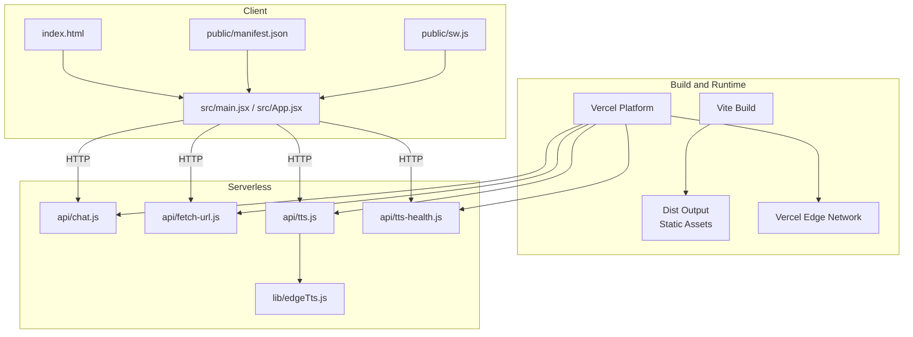
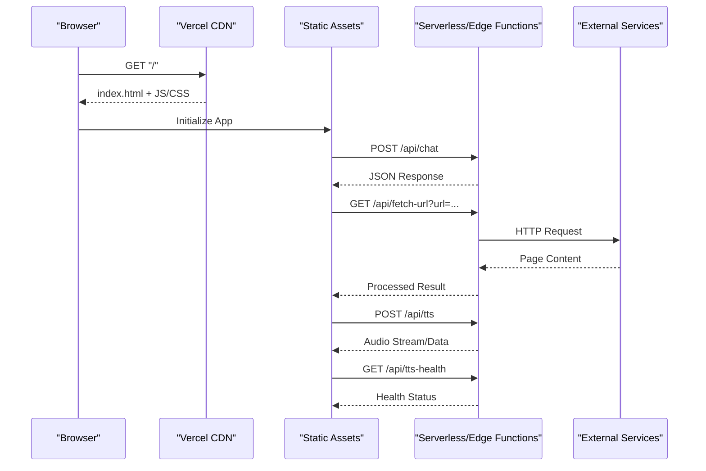
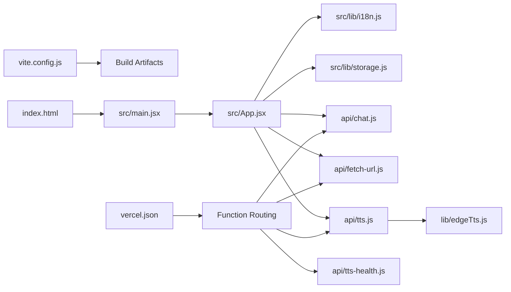

# Deployment Architecture

<cite>
**Referenced Files in This Document**
- [vercel.json](file://vercel.json)
- [vite.config.js](file://vite.config.js)
- [package.json](file://package.json)
- [index.html](file://index.html)
- [public/manifest.json](file://public/manifest.json)
- [public/sw.js](file://public/sw.js)
- [api/chat.js](file://api/chat.js)
- [api/fetch-url.js](file://api/fetch-url.js)
- [api/tts.js](file://api/tts.js)
- [api/tts-health.js](file://api/tts-health.js)
- [lib/edgeTts.js](file://lib/edgeTts.js)
- [src/main.jsx](file://src/main.jsx)
- [src/App.jsx](file://src/App.jsx)
- [src/lib/i18n.js](file://src/lib/i18n.js)
- [src/lib/storage.js](file://src/lib/storage.js)
- [scripts/dev-api-server.mjs](file://scripts/dev-api-server.mjs)
</cite>

## Table of Contents
1. [Introduction](#introduction)
2. [Project Structure](#project-structure)
3. [Core Components](#core-components)
4. [Architecture Overview](#architecture-overview)
5. [Detailed Component Analysis](#detailed-component-analysis)
6. [Dependency Analysis](#dependency-analysis)
7. [Performance Considerations](#performance-considerations)
8. [Troubleshooting Guide](#troubleshooting-guide)
9. [Conclusion](#conclusion)
10. [Appendices](#appendices)

## Introduction
This document describes the deployment architecture for LineCheck on Vercel, focusing on serverless functions and Edge Functions, Vite-based build and static asset optimization, progressive web app (PWA) configuration, service worker behavior, development server setup, environment configuration, CI/CD automation, performance monitoring, error tracking, CDN usage, asset optimization, and browser compatibility strategies. It is intended for engineers and operators who need to understand how the application is built, deployed, and operated at scale.

## Project Structure
The repository follows a modern Vite + React structure with:
- A Vite build configuration for production optimizations and PWA support.
- A Vercel configuration that routes API endpoints to serverless or Edge Functions.
- Public assets including a PWA manifest and service worker.
- Serverless function handlers under api/.
- Shared logic for TTS under lib/.
- Source code under src/ for the client application.

**Diagram sources**
- [vercel.json](file://vercel.json)
- [vite.config.js](file://vite.config.js)
- [index.html](file://index.html)
- [public/manifest.json](file://public/manifest.json)
- [public/sw.js](file://public/sw.js)
- [api/chat.js](file://api/chat.js)
- [api/fetch-url.js](file://api/fetch-url.js)
- [api/tts.js](file://api/tts.js)
- [api/tts-health.js](file://api/tts-health.js)
- [lib/edgeTts.js](file://lib/edgeTts.js)
- [src/main.jsx](file://src/main.jsx)
- [src/App.jsx](file://src/App.jsx)

**Section sources**
- [vercel.json](file://vercel.json)
- [vite.config.js](file://vite.config.js)
- [package.json](file://package.json)
- [index.html](file://index.html)
- [public/manifest.json](file://public/manifest.json)
- [public/sw.js](file://public/sw.js)
- [api/chat.js](file://api/chat.js)
- [api/fetch-url.js](file://api/fetch-url.js)
- [api/tts.js](file://api/tts.js)
- [api/tts-health.js](file://api/tts-health.js)
- [lib/edgeTts.js](file://lib/edgeTts.js)
- [src/main.jsx](file://src/main.jsx)
- [src/App.jsx](file://src/App.jsx)

## Core Components
- Build system: Vite config defines the build pipeline, output directory, and PWA integration points.
- Client entrypoints: The main React entrypoint initializes the app and registers the service worker.
- PWA assets: Manifest and service worker provide installability and offline capabilities.
- Serverless functions: API handlers implement chat, URL fetching, TTS, and health checks.
- Edge runtime: TTS logic can run on the Edge runtime for low-latency responses.
- Dev tooling: Scripts assist local development of API services.

Key responsibilities:
- Vite produces optimized static assets and injects PWA metadata.
- Vercel routes requests to appropriate serverless or Edge Functions based on vercel.json.
- Service worker caches assets and supports background sync patterns.
- Environment variables are provided via Vercel’s environment management.

**Section sources**
- [vite.config.js](file://vite.config.js)
- [src/main.jsx](file://src/main.jsx)
- [public/manifest.json](file://public/manifest.json)
- [public/sw.js](file://public/sw.js)
- [api/chat.js](file://api/chat.js)
- [api/fetch-url.js](file://api/fetch-url.js)
- [api/tts.js](file://api/tts.js)
- [api/tts-health.js](file://api/tts-health.js)
- [lib/edgeTts.js](file://lib/edgeTts.js)
- [scripts/dev-api-server.mjs](file://scripts/dev-api-server.mjs)

## Architecture Overview
The application is a single-page app built by Vite and served from Vercel’s global CDN. API calls are handled by serverless functions; certain endpoints may be executed on the Edge runtime for reduced latency. The service worker enables caching and offline experiences.

**Diagram sources**
- [vercel.json](file://vercel.json)
- [api/chat.js](file://api/chat.js)
- [api/fetch-url.js](file://api/fetch-url.js)
- [api/tts.js](file://api/tts.js)
- [api/tts-health.js](file://api/tts-health.js)
- [src/main.jsx](file://src/main.jsx)
- [src/App.jsx](file://src/App.jsx)

## Detailed Component Analysis

### Build System and Static Asset Optimization (Vite)
- Build configuration controls output directory, minification, code splitting, and asset hashing.
- PWA integration ensures manifest and service worker are included in the build artifacts.
- Production builds enable compression and cache-friendly filenames.

Operational notes:
- Ensure the dist directory matches Vercel’s expected output path.
- Verify that PWA files are emitted into public or dist as configured.
- Confirm that environment variables used at build time are injected correctly.

**Section sources**
- [vite.config.js](file://vite.config.js)
- [package.json](file://package.json)

### Progressive Web App Configuration
- The manifest provides app metadata for installation and display settings.
- The service worker handles caching, offline fallbacks, and optional background tasks.
- The client registers the service worker during initialization.

Implementation pointers:
- Register the service worker from the main entrypoint.
- Configure cache strategies per resource type (e.g., precache assets, network-first for API).
- Use background sync where applicable for resilient operations.

**Section sources**
- [public/manifest.json](file://public/manifest.json)
- [public/sw.js](file://public/sw.js)
- [src/main.jsx](file://src/main.jsx)

### Service Worker Implementation
Responsibilities:
- Precaching critical assets for fast first load.
- Runtime caching strategies for dynamic content.
- Offline fallback pages and graceful degradation.
- Optional background sync for deferred actions.

Caching strategy guidance:
- Static assets: Cache-first with long TTL.
- API responses: Network-first with stale-while-revalidate.
- Fonts and images: Stale-while-revalidate with versioned URLs.

**Section sources**
- [public/sw.js](file://public/sw.js)

### Edge Functions and Serverless APIs
Endpoints:
- Chat endpoint for conversational flows.
- URL fetcher for retrieving and processing external content.
- TTS endpoint for text-to-speech synthesis.
- Health check endpoint for readiness probes.

Runtime selection:
- Some endpoints may execute on the Edge runtime for lower latency.
- Others use standard serverless runtime depending on dependencies.

Cold start optimization:
- Keep handler modules small and avoid heavy initialization.
- Prefer lazy imports for large libraries.
- Reuse connections and clients across invocations when possible.

Error handling:
- Return structured error responses with consistent status codes.
- Log errors with correlation IDs for observability.

**Section sources**
- [vercel.json](file://vercel.json)
- [api/chat.js](file://api/chat.js)
- [api/fetch-url.js](file://api/fetch-url.js)
- [api/tts.js](file://api/tts.js)
- [api/tts-health.js](file://api/tts-health.js)
- [lib/edgeTts.js](file://lib/edgeTts.js)

### Client Application Entrypoints
- Main entrypoint bootstraps the React app and registers the service worker.
- App component orchestrates routing and feature modules.
- Internationalization and storage utilities are initialized early.

Best practices:
- Defer non-critical initialization until after first paint.
- Guard service worker registration behind capability checks.
- Centralize environment variable access through a typed config layer.

**Section sources**
- [src/main.jsx](file://src/main.jsx)
- [src/App.jsx](file://src/App.jsx)
- [src/lib/i18n.js](file://src/lib/i18n.js)
- [src/lib/storage.js](file://src/lib/storage.js)

### Development Server Setup
Local development includes:
- Vite dev server for hot module replacement.
- Optional local API server scripts for simulating backend behavior.
- Environment variables loaded from .env files.

Recommendations:
- Mirror production environment variables locally.
- Use proxy rules if needed to forward API calls during development.
- Validate CORS and cookie policies in local dev.

**Section sources**
- [scripts/dev-api-server.mjs](file://scripts/dev-api-server.mjs)
- [package.json](file://package.json)

### Environment Configuration
- Define environment variables in Vercel project settings or via CI secrets.
- Distinguish between build-time and runtime variables.
- Avoid committing secrets; use Vercel’s secure environment store.

Validation:
- Fail fast on missing required variables during build or startup.
- Provide sensible defaults for non-sensitive options.

**Section sources**
- [vercel.json](file://vercel.json)
- [package.json](file://package.json)

### Deployment Pipeline Automation
Typical steps:
- Install dependencies and build with Vite.
- Deploy static assets and serverless functions to Vercel.
- Run post-deploy validations (health checks).

CI best practices:
- Cache node_modules to speed up builds.
- Parallelize tests and linting.
- Promote builds across environments using Vercel’s preview deployments.

**Section sources**
- [vercel.json](file://vercel.json)
- [package.json](file://package.json)

### Performance Monitoring and Error Tracking
- Integrate frontend error tracking (e.g., Sentry) via environment variables.
- Enable performance metrics collection (e.g., RUM) for core web vitals.
- Instrument serverless functions with structured logging and tracing.

SLOs and alerts:
- Monitor p50/p95 latency, error rates, and cold starts.
- Alert on increased 5xx responses and degraded TTS quality.

**Section sources**
- [api/tts-health.js](file://api/tts-health.js)
- [src/main.jsx](file://src/main.jsx)

### CDN Usage, Asset Optimization, and Browser Compatibility
- Vercel serves static assets from its global edge network.
- Leverage immutable caching with hashed filenames.
- Optimize images and fonts; prefer modern formats where supported.
- Feature detection and polyfills ensure broad browser support.

Compatibility matrix:
- Target latest stable versions of major browsers.
- Gracefully degrade features not supported by older browsers.

**Section sources**
- [vite.config.js](file://vite.config.js)
- [public/manifest.json](file://public/manifest.json)

## Dependency Analysis
High-level dependency relationships among key components:

**Diagram sources**
- [vite.config.js](file://vite.config.js)
- [index.html](file://index.html)
- [src/main.jsx](file://src/main.jsx)
- [src/App.jsx](file://src/App.jsx)
- [src/lib/i18n.js](file://src/lib/i18n.js)
- [src/lib/storage.js](file://src/lib/storage.js)
- [api/chat.js](file://api/chat.js)
- [api/fetch-url.js](file://api/fetch-url.js)
- [api/tts.js](file://api/tts.js)
- [api/tts-health.js](file://api/tts-health.js)
- [lib/edgeTts.js](file://lib/edgeTts.js)
- [vercel.json](file://vercel.json)

**Section sources**
- [vite.config.js](file://vite.config.js)
- [index.html](file://index.html)
- [src/main.jsx](file://src/main.jsx)
- [src/App.jsx](file://src/App.jsx)
- [src/lib/i18n.js](file://src/lib/i18n.js)
- [src/lib/storage.js](file://src/lib/storage.js)
- [api/chat.js](file://api/chat.js)
- [api/fetch-url.js](file://api/fetch-url.js)
- [api/tts.js](file://api/tts.js)
- [api/tts-health.js](file://api/tts-health.js)
- [lib/edgeTts.js](file://lib/edgeTts.js)
- [vercel.json](file://vercel.json)

## Performance Considerations
- Minimize bundle size via code splitting and tree-shaking.
- Use HTTP/2 and Brotli/Gzip compression enabled by default on Vercel.
- Implement efficient caching in the service worker to reduce network requests.
- Prefer Edge Functions for latency-sensitive endpoints.
- Profile TTS endpoints for memory and CPU usage; consider streaming responses.
- Monitor cold starts and adjust concurrency settings if necessary.

[No sources needed since this section provides general guidance]

## Troubleshooting Guide
Common issues and resolutions:
- Missing environment variables: Ensure all required variables are set in Vercel and available at build/runtime.
- Service worker not updating: Clear cache or force update; verify correct cache-busting headers.
- API 5xx errors: Check serverless logs and structured error payloads; validate upstream service availability.
- CORS failures: Confirm allowed origins and methods in both client and serverless functions.
- Cold start spikes: Reduce initialization overhead and leverage Edge runtime where feasible.

Operational tips:
- Use health check endpoints to probe readiness.
- Add correlation IDs to requests for cross-service tracing.
- Maintain rollback plans and preview deployments for safe releases.

**Section sources**
- [api/tts-health.js](file://api/tts-health.js)
- [api/chat.js](file://api/chat.js)
- [api/fetch-url.js](file://api/fetch-url.js)
- [api/tts.js](file://api/tts.js)

## Conclusion
LineCheck’s deployment on Vercel combines a Vite-built SPA with serverless and Edge Functions to deliver a fast, scalable, and resilient experience. Proper PWA configuration, caching strategies, and environment management ensure excellent user experience and operational stability. By following the recommendations in this document, teams can optimize performance, simplify troubleshooting, and confidently scale to production workloads.

[No sources needed since this section summarizes without analyzing specific files]

## Appendices

### API Endpoints Summary
- Chat: Conversational processing endpoint.
- Fetch URL: Retrieves and processes external URLs.
- TTS: Text-to-speech synthesis endpoint.
- TTS Health: Readiness and health probe.

**Section sources**
- [api/chat.js](file://api/chat.js)
- [api/fetch-url.js](file://api/fetch-url.js)
- [api/tts.js](file://api/tts.js)
- [api/tts-health.js](file://api/tts-health.js)

### Build and Publish Commands
- Install dependencies and build with Vite.
- Deploy to Vercel using CLI or CI integrations.

**Section sources**
- [package.json](file://package.json)
- [vercel.json](file://vercel.json)