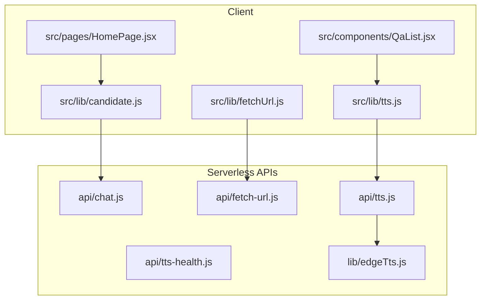
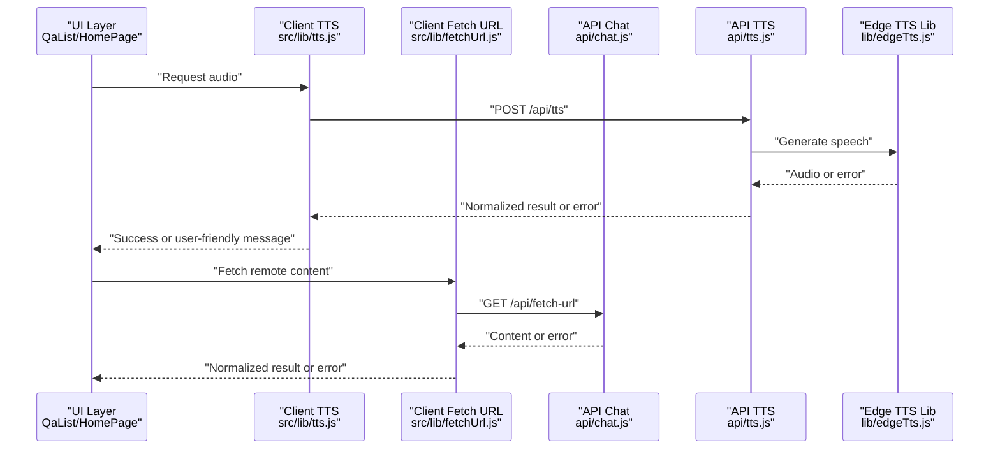
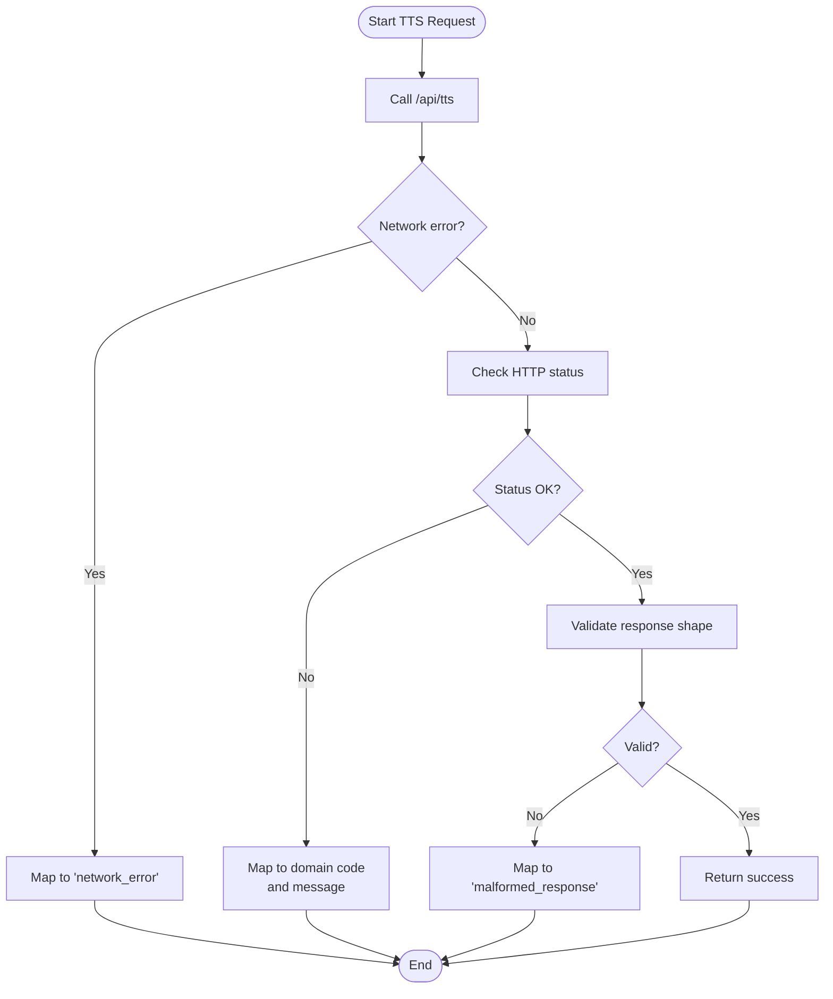
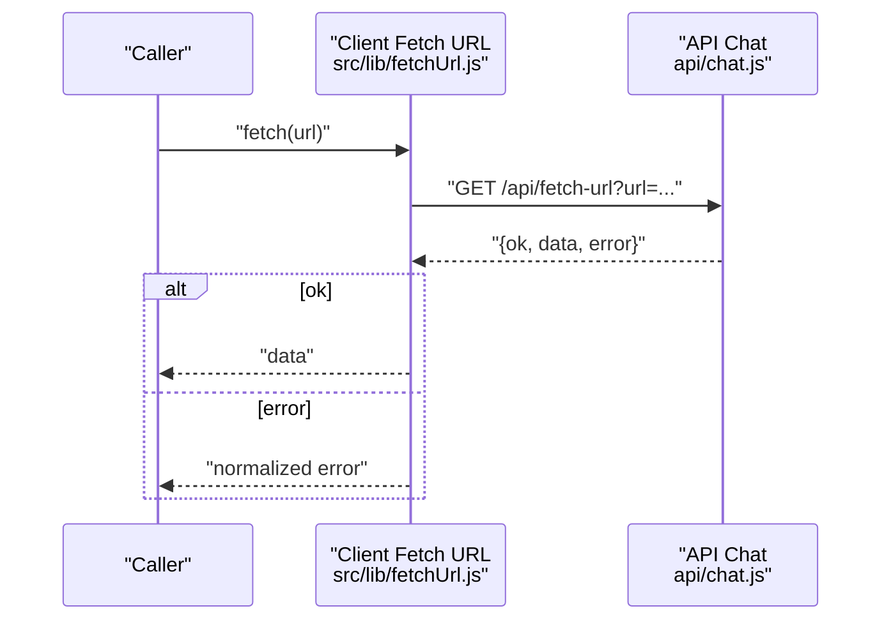
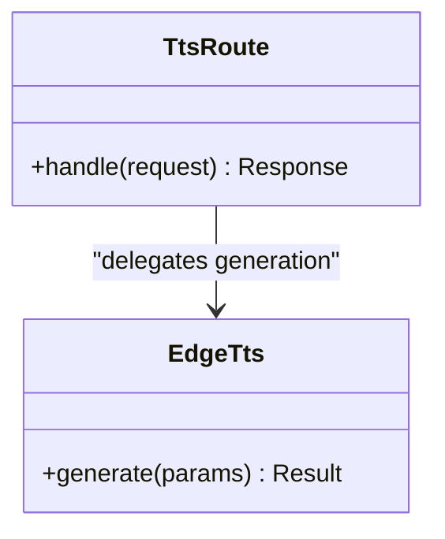
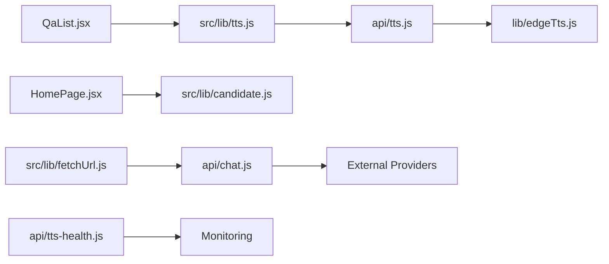

# Error Handling Strategy

<cite>
**Referenced Files in This Document**
- [api/chat.js](file://api/chat.js)
- [api/fetch-url.js](file://api/fetch-url.js)
- [api/tts.js](file://api/tts.js)
- [api/tts-health.js](file://api/tts-health.js)
- [lib/edgeTts.js](file://lib/edgeTts.js)
- [src/lib/tts.js](file://src/lib/tts.js)
- [src/lib/fetchUrl.js](file://src/lib/fetchUrl.js)
- [src/lib/candidate.js](file://src/lib/candidate.js)
- [src/components/QaList.jsx](file://src/components/QaList.jsx)
- [src/pages/HomePage.jsx](file://src/pages/HomePage.jsx)
- [scripts/dev-api-server.mjs](file://scripts/dev-api-server.mjs)
</cite>

## Table of Contents
1. [Introduction](#introduction)
2. [Project Structure](#project-structure)
3. [Core Components](#core-components)
4. [Architecture Overview](#architecture-overview)
5. [Detailed Component Analysis](#detailed-component-analysis)
6. [Dependency Analysis](#dependency-analysis)
7. [Performance Considerations](#performance-considerations)
8. [Troubleshooting Guide](#troubleshooting-guide)
9. [Conclusion](#conclusion)

## Introduction
This document explains the error handling strategy across the application’s client and server layers. It focuses on how errors are detected, propagated, normalized, and surfaced to users or logs. The goal is to provide a clear mental model for developers integrating new features or diagnosing issues.

## Project Structure
The project separates concerns between:
- Client-side libraries that orchestrate network calls and UI state
- Serverless API routes that perform external service interactions
- Shared utilities for TTS and URL fetching

**Diagram sources**
- [src/lib/tts.js](file://src/lib/tts.js)
- [src/lib/fetchUrl.js](file://src/lib/fetchUrl.js)
- [src/lib/candidate.js](file://src/lib/candidate.js)
- [src/components/QaList.jsx](file://src/components/QaList.jsx)
- [src/pages/HomePage.jsx](file://src/pages/HomePage.jsx)
- [api/chat.js](file://api/chat.js)
- [api/fetch-url.js](file://api/fetch-url.js)
- [api/tts.js](file://api/tts.js)
- [api/tts-health.js](file://api/tts-health.js)
- [lib/edgeTts.js](file://lib/edgeTts.js)

**Section sources**
- [src/lib/tts.js](file://src/lib/tts.js)
- [src/lib/fetchUrl.js](file://src/lib/fetchUrl.js)
- [src/lib/candidate.js](file://src/lib/candidate.js)
- [src/components/QaList.jsx](file://src/components/QaList.jsx)
- [src/pages/HomePage.jsx](file://src/pages/HomePage.jsx)
- [api/chat.js](file://api/chat.js)
- [api/fetch-url.js](file://api/fetch-url.js)
- [api/tts.js](file://api/tts.js)
- [api/tts-health.js](file://api/tts-health.js)
- [lib/edgeTts.js](file://lib/edgeTts.js)

## Core Components
- Client TTS orchestration: coordinates request lifecycle, retries, and user-facing feedback.
- Client URL fetcher: wraps network calls with consistent error normalization.
- Candidate helper: centralizes business logic around candidate data and failure modes.
- Serverless chat route: handles LLM requests and maps provider errors to a uniform response shape.
- Serverless TTS route: delegates to edge TTS library and returns standardized results or errors.
- Edge TTS library: encapsulates platform-specific behavior and error propagation.
- Health check route: exposes readiness/liveness signals for TTS subsystems.

Key responsibilities:
- Normalize heterogeneous errors into a common shape (code, message, optional details).
- Surface actionable messages to the UI while preserving diagnostic context in logs.
- Provide health endpoints to detect upstream failures early.

**Section sources**
- [src/lib/tts.js](file://src/lib/tts.js)
- [src/lib/fetchUrl.js](file://src/lib/fetchUrl.js)
- [src/lib/candidate.js](file://src/lib/candidate.js)
- [api/chat.js](file://api/chat.js)
- [api/tts.js](file://api/tts.js)
- [lib/edgeTts.js](file://lib/edgeTts.js)
- [api/tts-health.js](file://api/tts-health.js)

## Architecture Overview
End-to-end flow for typical operations with error handling at each boundary.

**Diagram sources**
- [src/lib/tts.js](file://src/lib/tts.js)
- [src/lib/fetchUrl.js](file://src/lib/fetchUrl.js)
- [api/chat.js](file://api/chat.js)
- [api/tts.js](file://api/tts.js)
- [lib/edgeTts.js](file://lib/edgeTts.js)
- [src/components/QaList.jsx](file://src/components/QaList.jsx)
- [src/pages/HomePage.jsx](file://src/pages/HomePage.jsx)

## Detailed Component Analysis

### Client TTS Orchestration
Responsibilities:
- Build request payload and call serverless TTS endpoint.
- Handle network errors, timeouts, and non-OK responses.
- Convert provider errors into a stable shape for UI consumption.
- Optionally retry transient failures with backoff.

Error handling patterns:
- Network-level failures (DNS, connectivity) are caught and mapped to a generic “network error” code.
- HTTP status codes outside success range are translated into domain codes (e.g., rate limit, invalid input).
- Response validation ensures required fields exist; missing fields produce a “malformed response” error.
- User-visible messages avoid leaking internal stack traces or secrets.

**Diagram sources**
- [src/lib/tts.js](file://src/lib/tts.js)
- [api/tts.js](file://api/tts.js)
- [lib/edgeTts.js](file://lib/edgeTts.js)

**Section sources**
- [src/lib/tts.js](file://src/lib/tts.js)
- [api/tts.js](file://api/tts.js)
- [lib/edgeTts.js](file://lib/edgeTts.js)

### Client URL Fetcher
Responsibilities:
- Wrap fetch calls to serverless URL fetch endpoint.
- Normalize timeout, CORS, and parsing errors.
- Provide a consistent return contract for callers.

Error handling patterns:
- Timeout detection converts to a specific code to allow UI to prompt retry.
- Non-JSON responses are flagged as parse errors.
- Upstream provider errors are forwarded with their original codes but sanitized messages.

**Diagram sources**
- [src/lib/fetchUrl.js](file://src/lib/fetchUrl.js)
- [api/chat.js](file://api/chat.js)

**Section sources**
- [src/lib/fetchUrl.js](file://src/lib/fetchUrl.js)
- [api/chat.js](file://api/chat.js)

### Candidate Helper
Responsibilities:
- Centralize candidate-related business rules.
- Surface meaningful errors when inputs are invalid or processing fails.

Error handling patterns:
- Input validation errors map to explicit codes like “invalid_candidate”.
- Processing failures include minimal context without exposing sensitive data.

**Section sources**
- [src/lib/candidate.js](file://src/lib/candidate.js)

### UI Integration Points
- QaList component consumes TTS and URL helpers, displaying user-friendly messages and enabling retry flows.
- HomePage orchestrates higher-level workflows and aggregates errors from multiple sources.

Error handling patterns:
- UI shows concise messages and preserves detailed diagnostics in development logs.
- Retry buttons are enabled only for transient errors.

**Section sources**
- [src/components/QaList.jsx](file://src/components/QaList.jsx)
- [src/pages/HomePage.jsx](file://src/pages/HomePage.jsx)

### Serverless Chat Route
Responsibilities:
- Forward requests to LLM providers.
- Translate provider-specific errors into a unified shape.

Error handling patterns:
- Provider timeouts become “timeout” codes.
- Rate limits become “rate_limited” with guidance to retry later.
- Authentication failures become “auth_error” with safe messages.

**Section sources**
- [api/chat.js](file://api/chat.js)

### Serverless TTS Route and Edge Library
Responsibilities:
- TTS route invokes the edge TTS library and returns standardized responses.
- Edge library encapsulates platform-specific behavior and error propagation.

Error handling patterns:
- Platform errors (e.g., quota exceeded) are mapped to “tts_quota_exceeded”.
- Invalid payloads are mapped to “invalid_input”.
- Unexpected exceptions are wrapped with a generic code and logged internally.

**Diagram sources**
- [api/tts.js](file://api/tts.js)
- [lib/edgeTts.js](file://lib/edgeTts.js)

**Section sources**
- [api/tts.js](file://api/tts.js)
- [lib/edgeTts.js](file://lib/edgeTts.js)

### TTS Health Endpoint
Responsibilities:
- Expose a lightweight probe to verify TTS subsystem availability.
- Return a simple status for load balancers or monitoring.

Error handling patterns:
- If downstream checks fail, return a degraded status rather than crashing.
- Include minimal diagnostic info for operators.

**Section sources**
- [api/tts-health.js](file://api/tts-health.js)

### Development API Server
Responsibilities:
- Local development server that proxies or simulates API behavior.
- Provides richer logging for local debugging.

Error handling patterns:
- Errors are printed with stack traces in development mode.
- Responses mirror production shapes for parity.

**Section sources**
- [scripts/dev-api-server.mjs](file://scripts/dev-api-server.mjs)

## Dependency Analysis
The following diagram highlights key dependencies and where error handling is applied.

**Diagram sources**
- [src/components/QaList.jsx](file://src/components/QaList.jsx)
- [src/pages/HomePage.jsx](file://src/pages/HomePage.jsx)
- [src/lib/tts.js](file://src/lib/tts.js)
- [src/lib/fetchUrl.js](file://src/lib/fetchUrl.js)
- [src/lib/candidate.js](file://src/lib/candidate.js)
- [api/tts.js](file://api/tts.js)
- [api/chat.js](file://api/chat.js)
- [api/tts-health.js](file://api/tts-health.js)
- [lib/edgeTts.js](file://lib/edgeTts.js)

**Section sources**
- [src/components/QaList.jsx](file://src/components/QaList.jsx)
- [src/pages/HomePage.jsx](file://src/pages/HomePage.jsx)
- [src/lib/tts.js](file://src/lib/tts.js)
- [src/lib/fetchUrl.js](file://src/lib/fetchUrl.js)
- [src/lib/candidate.js](file://src/lib/candidate.js)
- [api/tts.js](file://api/tts.js)
- [api/chat.js](file://api/chat.js)
- [api/tts-health.js](file://api/tts-health.js)
- [lib/edgeTts.js](file://lib/edgeTts.js)

## Performance Considerations
- Prefer idempotent retries with exponential backoff for transient errors (timeouts, rate limits).
- Avoid long-running synchronous work in UI threads; offload heavy tasks to serverless functions.
- Use health endpoints to short-circuit failing paths early and reduce wasted work.
- Cache successful responses where appropriate to minimize repeated failures under load.

[No sources needed since this section provides general guidance]

## Troubleshooting Guide
Common symptoms and actions:
- Network errors: Verify connectivity and DNS; check for proxy/CORS issues; enable verbose logs in development.
- Timeouts: Increase timeout thresholds cautiously; consider pagination or smaller payloads; use health checks.
- Rate limits: Implement backoff and queueing; inform users to retry later.
- Malformed responses: Inspect server logs for partial outputs; add stricter response validation.
- TTS failures: Use the health endpoint to confirm subsystem status; validate input parameters; check quotas.

Operational tips:
- Log normalized error codes alongside contextual metadata (request IDs, timestamps).
- Keep user-facing messages free of sensitive details; store full diagnostics in secure logs.
- Add feature flags to toggle retry policies during incidents.

**Section sources**
- [api/tts-health.js](file://api/tts-health.js)
- [scripts/dev-api-server.mjs](file://scripts/dev-api-server.mjs)

## Conclusion
The error handling strategy centers on normalizing diverse failures into a consistent shape, surfacing actionable messages to users, and preserving diagnostic information for operators. By centralizing error mapping in client libraries and serverless routes, the system remains resilient and easier to evolve. Health endpoints and structured logging further improve observability and operational control.