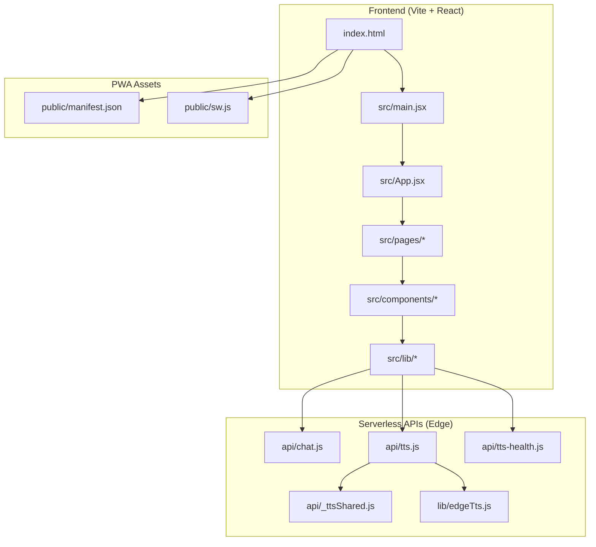
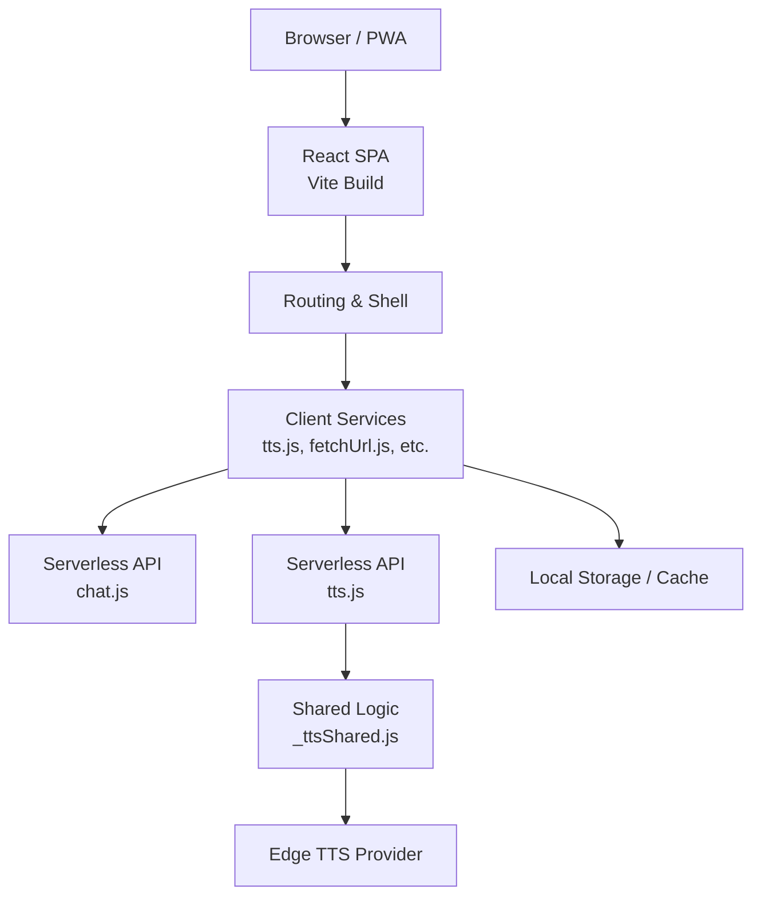
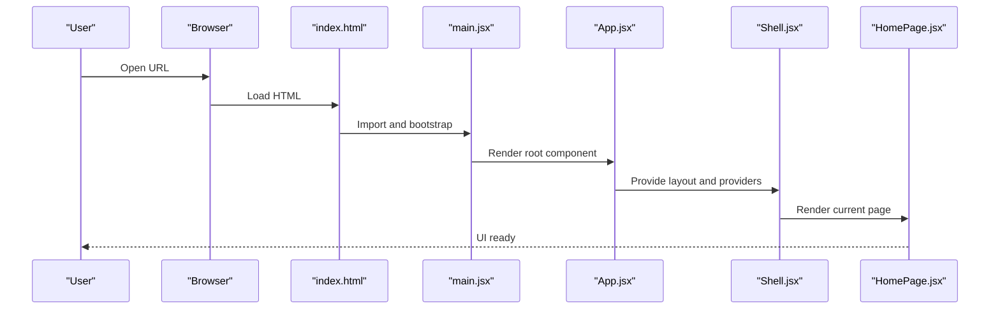
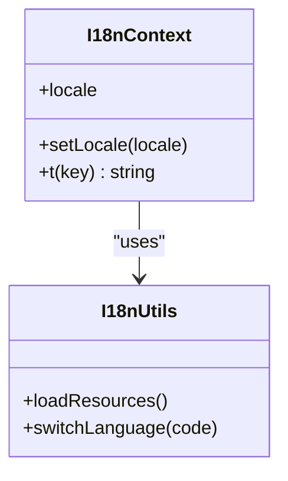
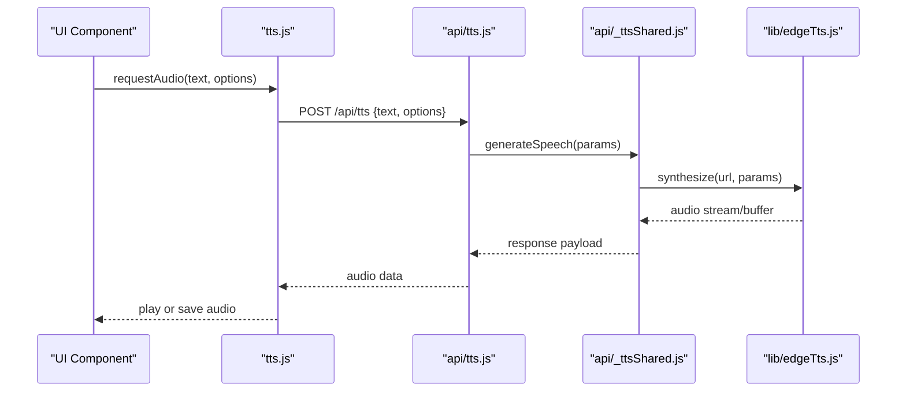
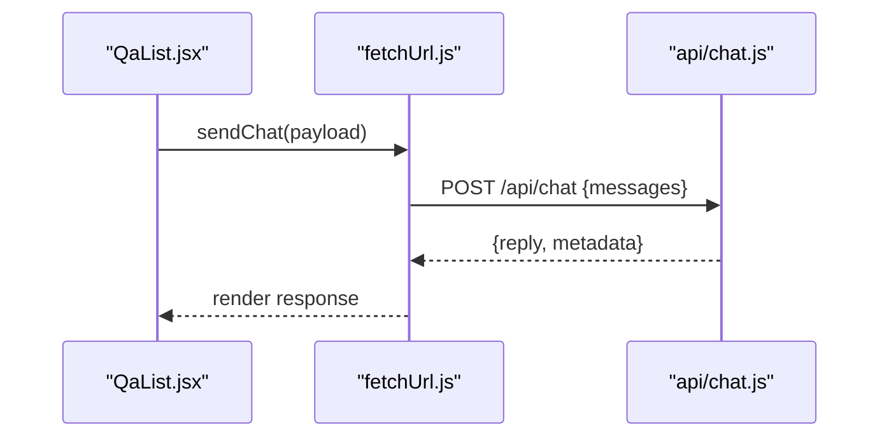
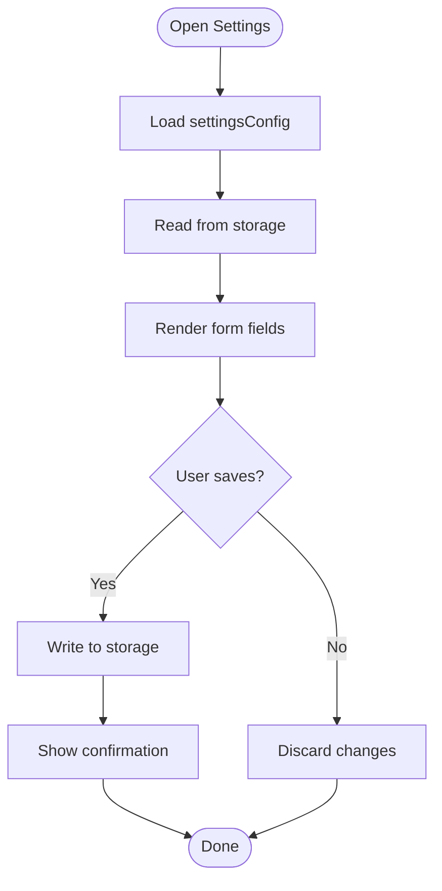
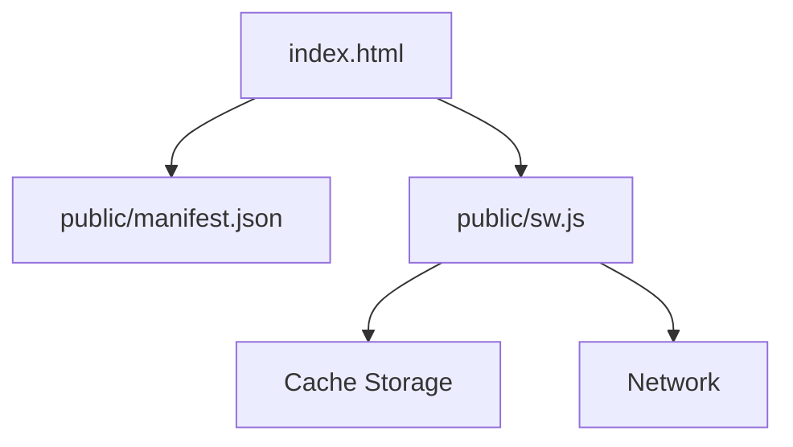
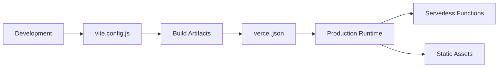

# System Design

<cite>
**Referenced Files in This Document**
- [package.json](file://package.json)
- [vite.config.js](file://vite.config.js)
- [vercel.json](file://vercel.json)
- [index.html](file://index.html)
- [src/main.jsx](file://src/main.jsx)
- [src/App.jsx](file://src/App.jsx)
- [src/pages/HomePage.jsx](file://src/pages/HomePage.jsx)
- [src/pages/SettingsPage.jsx](file://src/pages/SettingsPage.jsx)
- [src/components/Shell.jsx](file://src/components/Shell.jsx)
- [src/components/BrandLogo.jsx](file://src/components/BrandLogo.jsx)
- [src/components/DocumentField.jsx](file://src/components/DocumentField.jsx)
- [src/components/FocusBubbles.jsx](file://src/components/FocusBubbles.jsx)
- [src/components/GenerateLoading.jsx](file://src/components/GenerateLoading.jsx)
- [src/components/InstallPrompt.jsx](file://src/components/InstallPrompt.jsx)
- [src/components/QaList.jsx](file://src/components/QaList.jsx)
- [src/lib/I18nContext.jsx](file://src/lib/I18nContext.jsx)
- [src/lib/i18n.js](file://src/lib/i18n.js)
- [src/lib/tts.js](file://src/lib/tts.js)
- [src/lib/fetchUrl.js](file://src/lib/fetchUrl.js)
- [src/lib/exportPdf.js](file://src/lib/exportPdf.js)
- [src/lib/candidate.js](file://src/lib/candidate.js)
- [src/lib/interviewModes.js](file://src/lib/interviewModes.js)
- [src/lib/jobMeta.js](file://src/lib/jobMeta.js)
- [src/lib/mandatoryQuestions.js](file://src/lib/mandatoryQuestions.js)
- [src/lib/prompt.js](file://src/lib/prompt.js)
- [src/lib/settingsConfig.js](file://src/lib/settingsConfig.js)
- [src/lib/storage.js](file://src/lib/storage.js)
- [api/chat.js](file://api/chat.js)
- [api/tts.js](file://api/tts.js)
- [api/tts-health.js](file://api/tts-health.js)
- [api/_ttsShared.js](file://api/_ttsShared.js)
- [lib/edgeTts.js](file://lib/edgeTts.js)
- [public/sw.js](file://public/sw.js)
- [public/manifest.json](file://public/manifest.json)
</cite>

## Table of Contents
1. [Introduction](#introduction)
2. [Project Structure](#project-structure)
3. [Core Components](#core-components)
4. [Architecture Overview](#architecture-overview)
5. [Detailed Component Analysis](#detailed-component-analysis)
6. [Dependency Analysis](#dependency-analysis)
7. [Performance Considerations](#performance-considerations)
8. [Security Boundaries](#security-boundaries)
9. [Scalability and Deployment](#scalability-and-deployment)
10. [Troubleshooting Guide](#troubleshooting-guide)
11. [Conclusion](#conclusion)

## Introduction
This document describes the system design for LineCheck, a modern React single-page application (SPA) with serverless APIs. It explains high-level boundaries, technology stack decisions, architectural patterns, build and deployment strategy, PWA capabilities, external integrations, data flows, scalability considerations, performance optimizations, and security boundaries between client and server components.

## Project Structure
The repository is organized into clear layers:
- Frontend SPA: React application built with Vite, including pages, reusable components, and shared libraries.
- Serverless APIs: Edge-compatible functions for chat and text-to-speech (TTS), plus health checks.
- Build and deployment configuration: Vite config, Vercel runtime settings, and PWA assets.
- Utilities and scripts: Shared logic for TTS, URL fetching, PDF export, and local development helpers.

**Diagram sources**
- [index.html:1-200](file://index.html#L1-L200)
- [src/main.jsx:1-200](file://src/main.jsx#L1-L200)
- [src/App.jsx:1-200](file://src/App.jsx#L1-L200)
- [src/pages/HomePage.jsx:1-200](file://src/pages/HomePage.jsx#L1-L200)
- [src/pages/SettingsPage.jsx:1-200](file://src/pages/SettingsPage.jsx#L1-L200)
- [src/components/Shell.jsx:1-200](file://src/components/Shell.jsx#L1-L200)
- [src/components/BrandLogo.jsx:1-200](file://src/components/BrandLogo.jsx#L1-L200)
- [src/components/DocumentField.jsx:1-200](file://src/components/DocumentField.jsx#L1-L200)
- [src/components/FocusBubbles.jsx:1-200](file://src/components/FocusBubbles.jsx#L1-L200)
- [src/components/GenerateLoading.jsx:1-200](file://src/components/GenerateLoading.jsx#L1-L200)
- [src/components/InstallPrompt.jsx:1-200](file://src/components/InstallPrompt.jsx#L1-L200)
- [src/components/QaList.jsx:1-200](file://src/components/QaList.jsx#L1-L200)
- [src/lib/I18nContext.jsx:1-200](file://src/lib/I18nContext.jsx#L1-L200)
- [src/lib/i18n.js:1-200](file://src/lib/i18n.js#L1-L200)
- [src/lib/tts.js:1-200](file://src/lib/tts.js#L1-L200)
- [src/lib/fetchUrl.js:1-200](file://src/lib/fetchUrl.js#L1-L200)
- [src/lib/exportPdf.js:1-200](file://src/lib/exportPdf.js#L1-L200)
- [src/lib/candidate.js:1-200](file://src/lib/candidate.js#L1-L200)
- [src/lib/interviewModes.js:1-200](file://src/lib/interviewModes.js#L1-L200)
- [src/lib/jobMeta.js:1-200](file://src/lib/jobMeta.js#L1-L200)
- [src/lib/mandatoryQuestions.js:1-200](file://src/lib/mandatoryQuestions.js#L1-L200)
- [src/lib/prompt.js:1-200](file://src/lib/prompt.js#L1-L200)
- [src/lib/settingsConfig.js:1-200](file://src/lib/settingsConfig.js#L1-L200)
- [src/lib/storage.js:1-200](file://src/lib/storage.js#L1-L200)
- [api/chat.js:1-200](file://api/chat.js#L1-L200)
- [api/tts.js:1-200](file://api/tts.js#L1-L200)
- [api/tts-health.js:1-200](file://api/tts-health.js#L1-L200)
- [api/_ttsShared.js:1-200](file://api/_ttsShared.js#L1-L200)
- [lib/edgeTts.js:1-200](file://lib/edgeTts.js#L1-L200)
- [public/manifest.json:1-200](file://public/manifest.json#L1-L200)
- [public/sw.js:1-200](file://public/sw.js#L1-L200)

**Section sources**
- [package.json:1-200](file://package.json#L1-L200)
- [vite.config.js:1-200](file://vite.config.js#L1-L200)
- [vercel.json:1-200](file://vercel.json#L1-L200)
- [index.html:1-200](file://index.html#L1-L200)

## Core Components
- Application shell and routing: The root entry initializes the app and renders the shell that hosts pages and global UI. Pages include Home and Settings views.
- Reusable UI components: Brand logo, document field input, focus bubbles animation, loading indicators, install prompt, and Q&A list rendering.
- Internationalization: Context provider and utilities for language switching and resource loading.
- Client-side services: TTS orchestration, URL fetching, PDF export, candidate/question management, interview modes, job metadata, prompts, settings, and persistent storage.

Key responsibilities:
- Shell coordinates layout and navigation.
- HomePage orchestrates core user workflows (e.g., generating content).
- SettingsPage manages user preferences persisted via storage.
- lib modules encapsulate domain logic and API calls to serverless endpoints.

**Section sources**
- [src/main.jsx:1-200](file://src/main.jsx#L1-L200)
- [src/App.jsx:1-200](file://src/App.jsx#L1-L200)
- [src/pages/HomePage.jsx:1-200](file://src/pages/HomePage.jsx#L1-L200)
- [src/pages/SettingsPage.jsx:1-200](file://src/pages/SettingsPage.jsx#L1-L200)
- [src/components/Shell.jsx:1-200](file://src/components/Shell.jsx#L1-L200)
- [src/components/BrandLogo.jsx:1-200](file://src/components/BrandLogo.jsx#L1-L200)
- [src/components/DocumentField.jsx:1-200](file://src/components/DocumentField.jsx#L1-L200)
- [src/components/FocusBubbles.jsx:1-200](file://src/components/FocusBubbles.jsx#L1-L200)
- [src/components/GenerateLoading.jsx:1-200](file://src/components/GenerateLoading.jsx#L1-L200)
- [src/components/InstallPrompt.jsx:1-200](file://src/components/InstallPrompt.jsx#L1-L200)
- [src/components/QaList.jsx:1-200](file://src/components/QaList.jsx#L1-L200)
- [src/lib/I18nContext.jsx:1-200](file://src/lib/I18nContext.jsx#L1-L200)
- [src/lib/i18n.js:1-200](file://src/lib/i18n.js#L1-L200)
- [src/lib/tts.js:1-200](file://src/lib/tts.js#L1-L200)
- [src/lib/fetchUrl.js:1-200](file://src/lib/fetchUrl.js#L1-L200)
- [src/lib/exportPdf.js:1-200](file://src/lib/exportPdf.js#L1-L200)
- [src/lib/candidate.js:1-200](file://src/lib/candidate.js#L1-L200)
- [src/lib/interviewModes.js:1-200](file://src/lib/interviewModes.js#L1-L200)
- [src/lib/jobMeta.js:1-200](file://src/lib/jobMeta.js#L1-L200)
- [src/lib/mandatoryQuestions.js:1-200](file://src/lib/mandatoryQuestions.js#L1-L200)
- [src/lib/prompt.js:1-200](file://src/lib/prompt.js#L1-L200)
- [src/lib/settingsConfig.js:1-200](file://src/lib/settingsConfig.js#L1-L200)
- [src/lib/storage.js:1-200](file://src/lib/storage.js#L1-L200)

## Architecture Overview
LineCheck follows a layered architecture:
- Presentation layer: React SPA with component-based UI and state management via context and hooks.
- Service layer: Client-side libraries encapsulating business logic and HTTP calls.
- API layer: Serverless functions exposing REST-like endpoints for AI chat and TTS.
- External integrations: Edge TTS service and optional AI chat provider.

**Diagram sources**
- [src/main.jsx:1-200](file://src/main.jsx#L1-L200)
- [src/App.jsx:1-200](file://src/App.jsx#L1-L200)
- [src/lib/tts.js:1-200](file://src/lib/tts.js#L1-L200)
- [src/lib/fetchUrl.js:1-200](file://src/lib/fetchUrl.js#L1-L200)
- [api/chat.js:1-200](file://api/chat.js#L1-L200)
- [api/tts.js:1-200](file://api/tts.js#L1-L200)
- [api/_ttsShared.js:1-200](file://api/_ttsShared.js#L1-L200)
- [lib/edgeTts.js:1-200](file://lib/edgeTts.js#L1-L200)
- [src/lib/storage.js:1-200](file://src/lib/storage.js#L1-L200)

## Detailed Component Analysis

### React Application Entry and Shell
- Entry point bootstraps the React tree and mounts it into the DOM.
- App component sets up providers (e.g., i18n) and routes.
- Shell provides global layout, header/footer, and navigational scaffolding.

**Diagram sources**
- [index.html:1-200](file://index.html#L1-L200)
- [src/main.jsx:1-200](file://src/main.jsx#L1-L200)
- [src/App.jsx:1-200](file://src/App.jsx#L1-L200)
- [src/components/Shell.jsx:1-200](file://src/components/Shell.jsx#L1-L200)
- [src/pages/HomePage.jsx:1-200](file://src/pages/HomePage.jsx#L1-L200)

**Section sources**
- [src/main.jsx:1-200](file://src/main.jsx#L1-L200)
- [src/App.jsx:1-200](file://src/App.jsx#L1-L200)
- [src/components/Shell.jsx:1-200](file://src/components/Shell.jsx#L1-L200)
- [src/pages/HomePage.jsx:1-200](file://src/pages/HomePage.jsx#L1-L200)

### Internationalization (i18n)
- Context provider supplies locale and translation utilities across the tree.
- Utilities load resources and switch languages at runtime.

**Diagram sources**
- [src/lib/I18nContext.jsx:1-200](file://src/lib/I18nContext.jsx#L1-L200)
- [src/lib/i18n.js:1-200](file://src/lib/i18n.js#L1-L200)

**Section sources**
- [src/lib/I18nContext.jsx:1-200](file://src/lib/I18nContext.jsx#L1-L200)
- [src/lib/i18n.js:1-200](file://src/lib/i18n.js#L1-L200)

### Text-to-Speech (TTS) Flow
- Client service composes requests to the serverless TTS endpoint.
- Serverless function delegates to shared TTS logic and Edge TTS provider.
- Health check endpoint validates TTS availability.

**Diagram sources**
- [src/lib/tts.js:1-200](file://src/lib/tts.js#L1-L200)
- [api/tts.js:1-200](file://api/tts.js#L1-L200)
- [api/_ttsShared.js:1-200](file://api/_ttsShared.js#L1-L200)
- [lib/edgeTts.js:1-200](file://lib/edgeTts.js#L1-L200)

**Section sources**
- [src/lib/tts.js:1-200](file://src/lib/tts.js#L1-L200)
- [api/tts.js:1-200](file://api/tts.js#L1-L200)
- [api/tts-health.js:1-200](file://api/tts-health.js#L1-L200)
- [api/_ttsShared.js:1-200](file://api/_ttsShared.js#L1-L200)
- [lib/edgeTts.js:1-200](file://lib/edgeTts.js#L1-L200)

### AI Chat Flow
- Client service sends conversation payloads to the chat serverless endpoint.
- Serverless function processes messages and returns responses.

**Diagram sources**
- [src/components/QaList.jsx:1-200](file://src/components/QaList.jsx#L1-L200)
- [src/lib/fetchUrl.js:1-200](file://src/lib/fetchUrl.js#L1-L200)
- [api/chat.js:1-200](file://api/chat.js#L1-L200)

**Section sources**
- [src/components/QaList.jsx:1-200](file://src/components/QaList.jsx#L1-L200)
- [src/lib/fetchUrl.js:1-200](file://src/lib/fetchUrl.js#L1-L200)
- [api/chat.js:1-200](file://api/chat.js#L1-L200)

### Settings and Storage
- Settings page reads/writes user preferences using a storage abstraction.
- Settings configuration defines available options and defaults.

**Diagram sources**
- [src/pages/SettingsPage.jsx:1-200](file://src/pages/SettingsPage.jsx#L1-L200)
- [src/lib/settingsConfig.js:1-200](file://src/lib/settingsConfig.js#L1-L200)
- [src/lib/storage.js:1-200](file://src/lib/storage.js#L1-L200)

**Section sources**
- [src/pages/SettingsPage.jsx:1-200](file://src/pages/SettingsPage.jsx#L1-L200)
- [src/lib/settingsConfig.js:1-200](file://src/lib/settingsConfig.js#L1-L200)
- [src/lib/storage.js:1-200](file://src/lib/storage.js#L1-L200)

### PWA Capabilities
- Manifest defines app metadata, icons, and display mode.
- Service worker enables caching strategies and offline support.

**Diagram sources**
- [public/manifest.json:1-200](file://public/manifest.json#L1-L200)
- [public/sw.js:1-200](file://public/sw.js#L1-L200)
- [index.html:1-200](file://index.html#L1-L200)

**Section sources**
- [public/manifest.json:1-200](file://public/manifest.json#L1-L200)
- [public/sw.js:1-200](file://public/sw.js#L1-L200)
- [index.html:1-200](file://index.html#L1-L200)

## Dependency Analysis
- Build tooling: Vite configures bundling, dev server, and output targets.
- Runtime dependencies: React ecosystem and utility libraries are declared in package manifest.
- Deployment: Vercel configuration maps routes and environment variables for serverless functions.

**Diagram sources**
- [vite.config.js:1-200](file://vite.config.js#L1-L200)
- [vercel.json:1-200](file://vercel.json#L1-L200)
- [package.json:1-200](file://package.json#L1-L200)

**Section sources**
- [package.json:1-200](file://package.json#L1-L200)
- [vite.config.js:1-200](file://vite.config.js#L1-L200)
- [vercel.json:1-200](file://vercel.json#L1-L200)

## Performance Considerations
- Code splitting and lazy loading: Route-level and component-level splits reduce initial bundle size.
- Asset optimization: Image and font optimization via Vite plugins; static asset caching through service worker.
- Streaming and backpressure: For TTS, prefer streaming responses where possible to reduce latency and memory usage.
- Caching strategies: Use cache-first for static assets and network-first for dynamic API responses with stale-while-revalidate fallbacks.
- Memoization and re-render control: Apply memoization in heavy components and avoid unnecessary re-renders by stabilizing props and state updates.
- Debouncing and throttling: Throttle frequent interactions (e.g., typing, scroll) and debounce API triggers to reduce load.
- Prefetching and preloading: Preload critical fonts and route chunks; prefetch next likely resources on idle.
- Error boundaries: Wrap major sections to prevent full app crashes and provide graceful degradation.

[No sources needed since this section provides general guidance]

## Security Boundaries
- Client-server separation: Sensitive operations and third-party credentials reside in serverless functions; the browser only receives necessary results.
- Input validation and sanitization: Validate and sanitize all inputs at API boundaries before processing.
- Rate limiting and quotas: Enforce per-user or per-endpoint limits in serverless functions to mitigate abuse.
- CORS and origin checks: Restrict allowed origins and methods for API endpoints.
- Secrets management: Store secrets in environment variables managed by the deployment platform; never embed them in client bundles.
- Content security policy: Configure CSP headers to mitigate XSS risks.
- Data minimization: Return only required fields from APIs to reduce exposure.

[No sources needed since this section provides general guidance]

## Scalability and Deployment
- Serverless scaling: Edge functions scale automatically with demand; keep cold starts minimal by avoiding heavy initialization.
- Stateless design: Maintain statelessness in functions; persist state in external stores if needed.
- CDN and edge caching: Serve static assets via CDN; cache immutable assets aggressively.
- Environment configuration: Use platform-managed environment variables for different stages (dev, staging, prod).
- Observability: Add structured logging and metrics at API boundaries for monitoring and alerting.

**Section sources**
- [vercel.json:1-200](file://vercel.json#L1-L200)

## Troubleshooting Guide
- TTS failures: Check health endpoint to verify TTS provider status; inspect logs for upstream errors and timeouts.
- Chat API issues: Validate message schema and token limits; review error responses and retry policies.
- PWA not installing: Ensure manifest correctness, HTTPS requirement, and service worker registration.
- Local development: Use provided scripts to run API servers locally for integration testing.

**Section sources**
- [api/tts-health.js:1-200](file://api/tts-health.js#L1-L200)
- [api/tts.js:1-200](file://api/tts.js#L1-L200)
- [api/chat.js:1-200](file://api/chat.js#L1-L200)
- [public/sw.js:1-200](file://public/sw.js#L1-L200)
- [public/manifest.json:1-200](file://public/manifest.json#L1-L200)

## Conclusion
LineCheck’s architecture cleanly separates the React SPA frontend from serverless APIs, enabling scalable, maintainable, and secure delivery. Vite powers an efficient build pipeline, while Vercel hosts both static assets and serverless functions. PWA features enhance reliability and user experience. By adhering to the outlined performance, security, and scalability practices, the system can evolve to meet growing demands while preserving responsiveness and robustness.