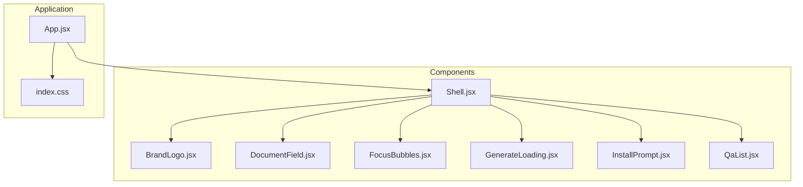
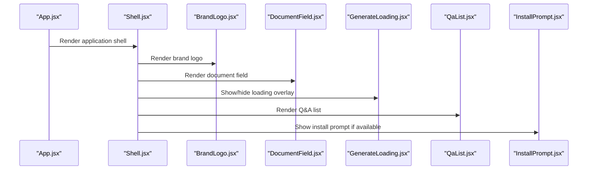
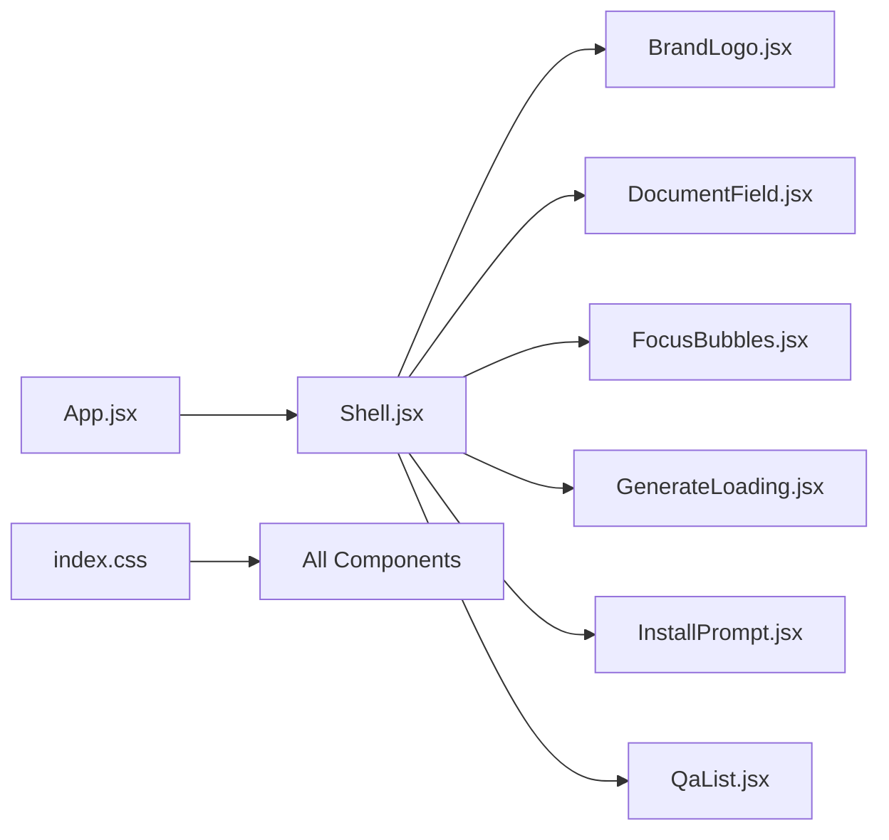

# Component Library

<cite>
**Referenced Files in This Document**
- [BrandLogo.jsx](file://src/components/BrandLogo.jsx)
- [DocumentField.jsx](file://src/components/DocumentField.jsx)
- [FocusBubbles.jsx](file://src/components/FocusBubbles.jsx)
- [GenerateLoading.jsx](file://src/components/GenerateLoading.jsx)
- [InstallPrompt.jsx](file://src/components/InstallPrompt.jsx)
- [QaList.jsx](file://src/components/QaList.jsx)
- [Shell.jsx](file://src/components/Shell.jsx)
- [App.jsx](file://src/App.jsx)
- [index.css](file://src/index.css)
</cite>

## Table of Contents
1. [Introduction](#introduction)
2. [Project Structure](#project-structure)
3. [Core Components](#core-components)
4. [Architecture Overview](#architecture-overview)
5. [Detailed Component Analysis](#detailed-component-analysis)
6. [Dependency Analysis](#dependency-analysis)
7. [Performance Considerations](#performance-considerations)
8. [Troubleshooting Guide](#troubleshooting-guide)
9. [Conclusion](#conclusion)
10. [Appendices](#appendices)

## Introduction
This document provides comprehensive documentation for LineCheck’s React component library. It covers the UI components that power the application’s user interface, including their props, events, styling options, accessibility features, responsive behavior, and integration patterns. The goal is to help developers understand how to use, customize, and compose these components effectively within the LineCheck application.

## Project Structure
The component library resides under src/components and includes:
- BrandLogo
- DocumentField
- FocusBubbles
- GenerateLoading
- InstallPrompt
- QaList
- Shell

These components are consumed by the application entry points such as App.jsx and styled via index.css.

**Diagram sources**
- [App.jsx](file://src/App.jsx)
- [BrandLogo.jsx](file://src/components/BrandLogo.jsx)
- [DocumentField.jsx](file://src/components/DocumentField.jsx)
- [FocusBubbles.jsx](file://src/components/FocusBubbles.jsx)
- [GenerateLoading.jsx](file://src/components/GenerateLoading.jsx)
- [InstallPrompt.jsx](file://src/components/InstallPrompt.jsx)
- [QaList.jsx](file://src/components/QaList.jsx)
- [Shell.jsx](file://src/components/Shell.jsx)
- [index.css](file://src/index.css)

**Section sources**
- [App.jsx](file://src/App.jsx)
- [index.css](file://src/index.css)

## Core Components
This section summarizes each component’s purpose and typical usage context within LineCheck. For detailed prop/event/styling/accessibility specifics, see the Detailed Component Analysis below.

- BrandLogo: Renders the LineCheck brand mark with optional sizing and alt text.
- DocumentField: Provides a controlled input field for document-related data entry with validation and accessibility attributes.
- FocusBubbles: Visual indicator or focus state helper used across forms and interactive elements.
- GenerateLoading: Displays loading feedback during asynchronous generation tasks.
- InstallPrompt: Guides users to install the app when supported by the browser.
- QaList: Renders a list of questions and answers with navigation and selection states.
- Shell: Application shell wrapper providing layout, header, and content area composition.

[No sources needed since this section provides general guidance]

## Architecture Overview
At runtime, App.jsx composes Shell, which in turn renders the core UI components. Global styles from index.css apply consistent theming and responsive behavior across components.

**Diagram sources**
- [App.jsx](file://src/App.jsx)
- [Shell.jsx](file://src/components/Shell.jsx)
- [BrandLogo.jsx](file://src/components/BrandLogo.jsx)
- [DocumentField.jsx](file://src/components/DocumentField.jsx)
- [GenerateLoading.jsx](file://src/components/GenerateLoading.jsx)
- [QaList.jsx](file://src/components/QaList.jsx)
- [InstallPrompt.jsx](file://src/components/InstallPrompt.jsx)

## Detailed Component Analysis

### BrandLogo
Purpose:
- Displays the LineCheck brand logo with accessible labeling and flexible sizing.

Props:
- size: Number or string controlling width/height.
- alt: Accessible label for screen readers.
- className: Optional CSS class for additional styling.
- style: Inline styles override.

Events:
- onClick: Optional click handler for interactive branding.

Styling:
- Uses CSS variables for color and spacing; responsive scaling via media queries.

Accessibility:
- Includes role="img" and aria-label derived from alt when provided.

Responsive Design:
- Scales proportionally on small screens; respects prefers-reduced-motion for animations.

Usage Example:
- See [BrandLogo.jsx](file://src/components/BrandLogo.jsx) for implementation details and examples.

**Section sources**
- [BrandLogo.jsx](file://src/components/BrandLogo.jsx)

### DocumentField
Purpose:
- Controlled input component for document metadata or search fields with validation and keyboard support.

Props:
- value: Current input value (controlled).
- onChange: Handler for value changes.
- placeholder: Placeholder text.
- label: Accessible label text.
- error: Error message string.
- disabled: Boolean to disable interaction.
- required: Boolean to enforce required validation.
- type: Input type (text, email, etc.).
- id: Unique identifier for form association.
- className: Additional CSS classes.
- style: Inline styles override.

Events:
- onChange(value): Emits updated value.
- onBlur(): Emits blur event for validation.
- onKeyDown(e): Supports Enter key submission.

Styling:
- Consistent border, focus ring, and error states using global styles.

Accessibility:
- Associates label via htmlFor/id, supports aria-invalid and aria-describedby for errors.

Responsive Design:
- Full-width on mobile; adapts padding and font sizes.

Usage Example:
- See [DocumentField.jsx](file://src/components/DocumentField.jsx) for implementation details and examples.

**Section sources**
- [DocumentField.jsx](file://src/components/DocumentField.jsx)

### FocusBubbles
Purpose:
- Visual focus indicator or decorative element highlighting active areas.

Props:
- count: Number of bubbles to render.
- activeIndex: Index of currently active bubble.
- color: Accent color variable override.
- className: Additional CSS classes.
- style: Inline styles override.

Events:
- onActiveChange(index): Emits new active index.

Styling:
- Animated transitions; uses CSS variables for colors and timing.

Accessibility:
- Uses aria-live regions to announce focus changes when appropriate.

Responsive Design:
- Adjusts bubble size and spacing based on viewport width.

Usage Example:
- See [FocusBubbles.jsx](file://src/components/FocusBubbles.jsx) for implementation details and examples.

**Section sources**
- [FocusBubbles.jsx](file://src/components/FocusBubbles.jsx)

### GenerateLoading
Purpose:
- Overlay or inline loader shown during asynchronous generation processes.

Props:
- visible: Boolean to show/hide loader.
- message: Descriptive loading message.
- variant: Style variant (e.g., spinner, progress bar).
- className: Additional CSS classes.
- style: Inline styles override.

Events:
- none typically; controlled by parent visibility.

Styling:
- Backdrop opacity and z-index managed via global styles.

Accessibility:
- Announces loading state with aria-busy and role="status".

Responsive Design:
- Centered overlay scales appropriately on all devices.

Usage Example:
- See [GenerateLoading.jsx](file://src/components/GenerateLoading.jsx) for implementation details and examples.

**Section sources**
- [GenerateLoading.jsx](file://src/components/GenerateLoading.jsx)

### InstallPrompt
Purpose:
- Prompts users to install the app when supported by the browser environment.

Props:
- visible: Boolean to control visibility.
- onClose: Handler to dismiss prompt.
- installAction: Callback to trigger installation flow.
- className: Additional CSS classes.
- style: Inline styles override.

Events:
- onClose(): Dismisses prompt.
- onInstall(): Initiates installation.

Styling:
- Modal-like card with action buttons; responsive layout.

Accessibility:
- Focus trap while open; aria-modal and role="dialog".

Responsive Design:
- Full-screen on mobile; centered modal on desktop.

Usage Example:
- See [InstallPrompt.jsx](file://src/components/InstallPrompt.jsx) for implementation details and examples.

**Section sources**
- [InstallPrompt.jsx](file://src/components/InstallPrompt.jsx)

### QaList
Purpose:
- Renders a navigable list of questions and answers with selection and keyboard support.

Props:
- items: Array of question-answer objects.
- selectedIndex: Index of selected item.
- onSelect(index): Handler for selection change.
- renderItem(item, index): Custom renderer function.
- className: Additional CSS classes.
- style: Inline styles override.

Events:
- onSelect(index): Emits selected index.
- onNavigate(direction): Optional keyboard navigation callback.

Styling:
- List rows with hover/focus states; active item highlighted.

Accessibility:
- Role="listbox", items have role="option", aria-selected and aria-labelledby.

Responsive Design:
- Stacked layout on small screens; increased touch targets.

Usage Example:
- See [QaList.jsx](file://src/components/QaList.jsx) for implementation details and examples.

**Section sources**
- [QaList.jsx](file://src/components/QaList.jsx)

### Shell
Purpose:
- Application shell providing layout structure, header, and content area composition.

Props:
- title: Page title for header.
- actions: Array of action nodes (buttons, links).
- children: Content to render inside shell.
- className: Additional CSS classes.
- style: Inline styles override.

Events:
- onBack(): Optional back navigation handler.
- onAction(actionId): Action button handler.

Styling:
- Header and main content sections; responsive grid/flex layout.

Accessibility:
- Semantic landmarks (header, main); skip-to-content link.

Responsive Design:
- Collapsible header on mobile; full-width content area.

Usage Example:
- See [Shell.jsx](file://src/components/Shell.jsx) for implementation details and examples.

**Section sources**
- [Shell.jsx](file://src/components/Shell.jsx)

## Dependency Analysis
The components rely on shared global styles and are composed by the application shell. There are no direct inter-component imports among the listed components; they communicate via props and events.

**Diagram sources**
- [App.jsx](file://src/App.jsx)
- [Shell.jsx](file://src/components/Shell.jsx)
- [BrandLogo.jsx](file://src/components/BrandLogo.jsx)
- [DocumentField.jsx](file://src/components/DocumentField.jsx)
- [FocusBubbles.jsx](file://src/components/FocusBubbles.jsx)
- [GenerateLoading.jsx](file://src/components/GenerateLoading.jsx)
- [InstallPrompt.jsx](file://src/components/InstallPrompt.jsx)
- [QaList.jsx](file://src/components/QaList.jsx)
- [index.css](file://src/index.css)

**Section sources**
- [App.jsx](file://src/App.jsx)
- [index.css](file://src/index.css)

## Performance Considerations
- Prefer memoization for expensive lists in QaList when items are large.
- Debounce input handlers in DocumentField for real-time validation.
- Use lazy rendering for GenerateLoading overlays to avoid unnecessary re-renders.
- Leverage CSS variables for theme updates without full repaints.

[No sources needed since this section provides general guidance]

## Troubleshooting Guide
Common issues and resolutions:
- Missing labels: Ensure DocumentField has a valid label and associated id.
- Focus management: Verify InstallPrompt traps focus when visible.
- Accessibility announcements: Confirm GenerateLoading sets aria-busy correctly.
- Responsive misalignment: Check CSS variable overrides and container widths.

[No sources needed since this section provides general guidance]

## Conclusion
LineCheck’s component library offers a cohesive set of UI primitives designed for accessibility, responsiveness, and composability. By following the documented props, events, and styling guidelines, developers can integrate these components seamlessly into the application and maintain a consistent user experience across devices.

[No sources needed since this section summarizes without analyzing specific files]

## Appendices

### Theming and Customization
- CSS Variables: Override colors, spacing, and typography at :root for global theming.
- Component Overrides: Use className and style props for targeted customizations.
- Variant Props: Some components accept variant props to switch visual modes.

[No sources needed since this section provides general guidance]

### Integration Patterns
- Controlled Inputs: Bind DocumentField value and onChange to local state.
- Composition: Wrap content with Shell to provide consistent layout and header.
- Event Handling: Wire up InstallPrompt actions and QaList selection callbacks.

[No sources needed since this section provides general guidance]