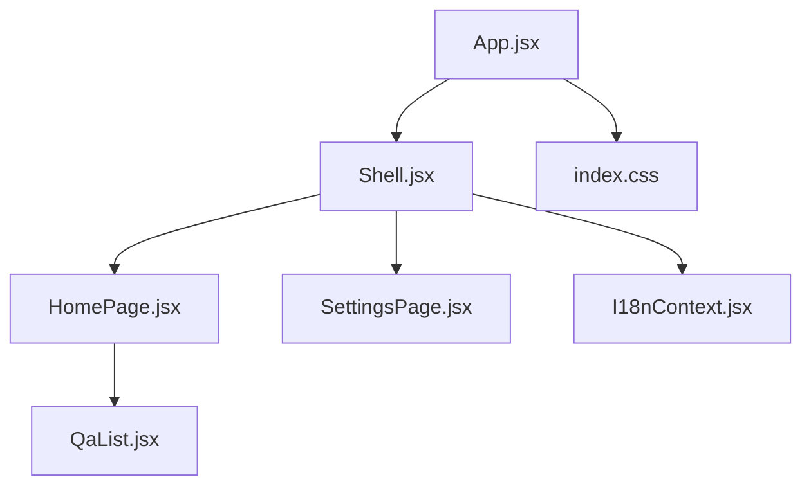
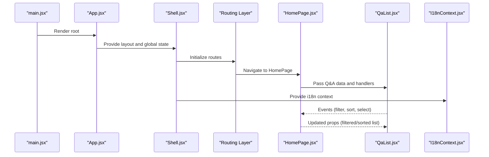
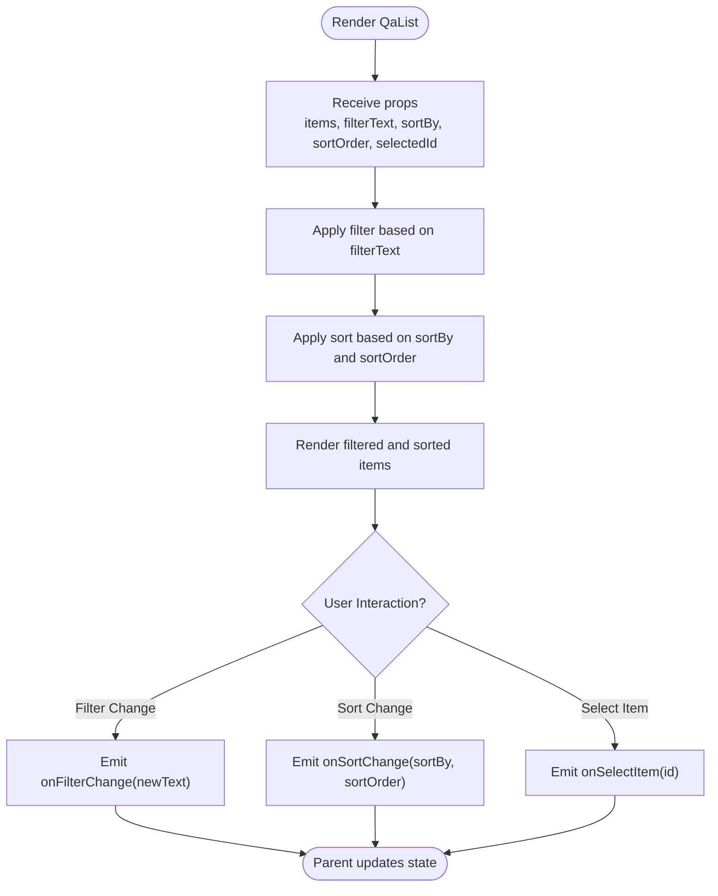
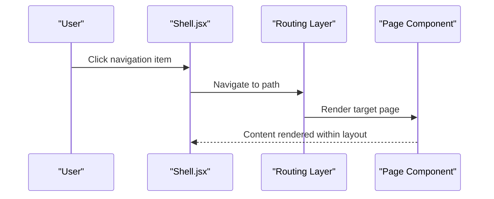
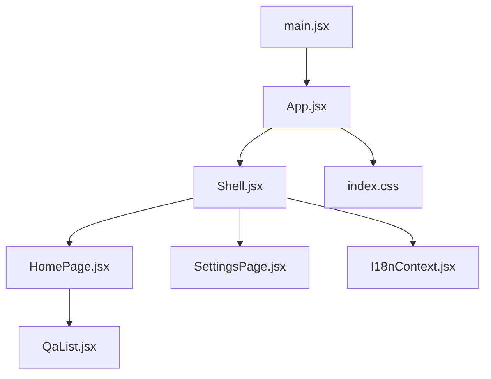

# Layout Components

<cite>
**Referenced Files in This Document**
- [QaList.jsx](file://src/components/QaList.jsx)
- [Shell.jsx](file://src/components/Shell.jsx)
- [App.jsx](file://src/App.jsx)
- [main.jsx](file://src/main.jsx)
- [HomePage.jsx](file://src/pages/HomePage.jsx)
- [SettingsPage.jsx](file://src/pages/SettingsPage.jsx)
- [I18nContext.jsx](file://src/lib/I18nContext.jsx)
- [index.css](file://src/index.css)
</cite>

## Table of Contents
1. [Introduction](#introduction)
2. [Project Structure](#project-structure)
3. [Core Components](#core-components)
4. [Architecture Overview](#architecture-overview)
5. [Detailed Component Analysis](#detailed-component-analysis)
6. [Dependency Analysis](#dependency-analysis)
7. [Performance Considerations](#performance-considerations)
8. [Troubleshooting Guide](#troubleshooting-guide)
9. [Conclusion](#conclusion)

## Introduction
This document provides detailed documentation for LineCheck’s layout and data presentation components, focusing on:
- QaList: a component that displays question-answer pairs with interactive features, sorting, and filtering capabilities.
- Shell: the main application layout wrapper providing navigation, routing, and global state management.

The goal is to help developers understand how these components work together, how they integrate with the application’s state management system, and how to implement responsive design, accessibility, and performance optimizations.

## Project Structure
LineCheck is a React application organized by feature and layer:
- src/components: Reusable UI components (including QaList and Shell).
- src/pages: Page-level components (HomePage, SettingsPage).
- src/lib: Shared utilities and contexts (e.g., I18nContext).
- src: Application entry points and styles (App.jsx, main.jsx, index.css).

**Diagram sources**
- [App.jsx](file://src/App.jsx)
- [Shell.jsx](file://src/components/Shell.jsx)
- [HomePage.jsx](file://src/pages/HomePage.jsx)
- [SettingsPage.jsx](file://src/pages/SettingsPage.jsx)
- [QaList.jsx](file://src/components/QaList.jsx)
- [I18nContext.jsx](file://src/lib/I18nContext.jsx)
- [index.css](file://src/index.css)

**Section sources**
- [App.jsx](file://src/App.jsx)
- [main.jsx](file://src/main.jsx)
- [index.css](file://src/index.css)

## Core Components
- QaList: Presents a list of question-answer items with interactive controls such as expand/collapse, search/filter, and sort options. It should support keyboard navigation and screen reader announcements for accessibility.
- Shell: Wraps the application shell, including top navigation, page content area, and global state providers (such as internationalization context). It manages routing between pages and exposes shared state to child components.

These components are designed to be composable and reusable across pages.

[No sources needed since this section provides general guidance]

## Architecture Overview
At runtime, App initializes the application and renders Shell. Shell sets up global providers and routes to HomePage or SettingsPage. HomePage uses QaList to display and interact with Q&A data. Internationalization is provided via I18nContext.

**Diagram sources**
- [main.jsx](file://src/main.jsx)
- [App.jsx](file://src/App.jsx)
- [Shell.jsx](file://src/components/Shell.jsx)
- [HomePage.jsx](file://src/pages/HomePage.jsx)
- [QaList.jsx](file://src/components/QaList.jsx)
- [I18nContext.jsx](file://src/lib/I18nContext.jsx)

## Detailed Component Analysis

### QaList Component
Responsibilities:
- Display a list of question-answer pairs.
- Support filtering by text search.
- Support sorting by criteria (for example, alphabetical or relevance).
- Provide interactive behaviors such as expanding/collapsing answers and selecting items.
- Maintain accessibility through semantic markup, keyboard navigation, and ARIA attributes.

Key Props
- items: Array of question-answer objects to render. Each item should include at least an identifier, question text, and answer text.
- filterText: Current search string used to filter items.
- sortBy: Sorting key or strategy applied to items.
- sortOrder: Direction of sorting (ascending/descending).
- selectedId: Identifier of the currently selected item.
- onFilterChange: Callback invoked when the user changes the filter text.
- onSortChange: Callback invoked when the user changes sorting options.
- onSelectItem: Callback invoked when an item is selected.
- renderItem: Optional custom renderer for each item row.
- emptyMessage: Message displayed when no items match the current filter.
- ariaLabel: Accessible label for the list container.

Event Handling Patterns
- Filtering: The parent passes filterText; QaList emits onFilterChange with updated text. Parent updates state and re-renders with new filterText.
- Sorting: The parent passes sortBy and sortOrder; QaList emits onSortChange with new values. Parent updates state accordingly.
- Selection: When a user selects an item, QaList emits onSelectItem with the item id. Parent updates selectedId and may trigger side effects.

Data Binding Examples
- Controlled filter: Parent holds filterText in state and passes it down; QaList calls onFilterChange to update parent state.
- Controlled sort: Parent holds sortBy and sortOrder; QaList calls onSortChange to update parent state.
- Controlled selection: Parent holds selectedId; QaList calls onSelectItem to update parent state.

Accessibility Considerations
- Use semantic list elements and headings where appropriate.
- Ensure all interactive controls have labels and roles.
- Provide keyboard shortcuts for common actions (e.g., Enter to select, arrow keys to navigate).
- Announce filtered results count and active sort order via live regions if necessary.

Responsive Design Considerations
- Stack content vertically on small screens.
- Adjust font sizes and spacing for readability.
- Ensure touch targets meet minimum size guidelines.

Performance Optimization Techniques
- Memoize computed lists using stable dependencies to avoid unnecessary re-renders.
- Virtualize long lists if the dataset is large.
- Debounce filter input to reduce re-renders during typing.
- Avoid inline functions in props; pass memoized callbacks from the parent.

Integration With State Management
- QaList is typically controlled by the parent (for example, HomePage), which owns filterText, sortBy, sortOrder, and selectedId.
- Global state (such as i18n) can be accessed via I18nContext for localized messages like emptyMessage.

**Section sources**
- [QaList.jsx](file://src/components/QaList.jsx)
- [HomePage.jsx](file://src/pages/HomePage.jsx)
- [I18nContext.jsx](file://src/lib/I18nContext.jsx)

#### QaList Data Flow

**Diagram sources**
- [QaList.jsx](file://src/components/QaList.jsx)
- [HomePage.jsx](file://src/pages/HomePage.jsx)

### Shell Component
Responsibilities:
- Provide the application layout wrapper (header, navigation, content area).
- Manage routing between pages (for example, HomePage and SettingsPage).
- Provide global state via contexts (for example, I18nContext).
- Expose shared UI patterns and consistent styling.

Key Props
- children: Page content rendered within the layout.
- title: Application title shown in header or browser tab.
- navItems: Navigation configuration defining links and labels.
- theme: Theme settings affecting colors and typography.
- locale: Locale code for internationalization.

Navigation and Routing
- Shell integrates a router to switch between pages.
- Nav items map to route paths and labels.
- Active route highlighting improves usability.

Global State Management
- Shell wraps the app with I18nContext to provide translations globally.
- Additional contexts can be added here for settings or user preferences.

Accessibility Considerations
- Ensure header landmarks and navigation menus are accessible.
- Provide skip links to main content.
- Use proper heading hierarchy and ARIA attributes for navigation.

Responsive Design Considerations
- Collapse navigation into a hamburger menu on small screens.
- Adjust padding and margins for different viewport sizes.
- Ensure content remains readable and navigable on mobile devices.

Performance Optimization Techniques
- Lazy-load page components to reduce initial bundle size.
- Memoize navigation state and avoid unnecessary re-renders.
- Preload critical resources and defer non-critical ones.

Integration With State Management
- Shell provides I18nContext to descendants.
- Pages consume contexts to access global state without prop drilling.

**Section sources**
- [Shell.jsx](file://src/components/Shell.jsx)
- [HomePage.jsx](file://src/pages/HomePage.jsx)
- [SettingsPage.jsx](file://src/pages/SettingsPage.jsx)
- [I18nContext.jsx](file://src/lib/I18nContext.jsx)

#### Shell Navigation Sequence

**Diagram sources**
- [Shell.jsx](file://src/components/Shell.jsx)
- [HomePage.jsx](file://src/pages/HomePage.jsx)
- [SettingsPage.jsx](file://src/pages/SettingsPage.jsx)

## Dependency Analysis
High-level relationships among core files:
- main.jsx bootstraps the React app and mounts App.
- App renders Shell and applies global styles.
- Shell provides routing and contexts, rendering HomePage or SettingsPage.
- HomePage uses QaList to present Q&A data.
- I18nContext supplies translation strings to components.

**Diagram sources**
- [main.jsx](file://src/main.jsx)
- [App.jsx](file://src/App.jsx)
- [Shell.jsx](file://src/components/Shell.jsx)
- [HomePage.jsx](file://src/pages/HomePage.jsx)
- [SettingsPage.jsx](file://src/pages/SettingsPage.jsx)
- [QaList.jsx](file://src/components/QaList.jsx)
- [I18nContext.jsx](file://src/lib/I18nContext.jsx)
- [index.css](file://src/index.css)

**Section sources**
- [main.jsx](file://src/main.jsx)
- [App.jsx](file://src/App.jsx)
- [Shell.jsx](file://src/components/Shell.jsx)
- [HomePage.jsx](file://src/pages/HomePage.jsx)
- [SettingsPage.jsx](file://src/pages/SettingsPage.jsx)
- [QaList.jsx](file://src/components/QaList.jsx)
- [I18nContext.jsx](file://src/lib/I18nContext.jsx)
- [index.css](file://src/index.css)

## Performance Considerations
- Use memoization for expensive computations (for example, filtered and sorted lists).
- Debounce user inputs like filter text to minimize re-renders.
- Implement virtual scrolling for very large datasets.
- Split routes and lazy-load heavy components.
- Optimize images and assets; leverage caching strategies.
- Monitor memory usage and avoid retaining large references in closures.

[No sources needed since this section provides general guidance]

## Troubleshooting Guide
Common issues and resolutions:
- Filter not updating: Ensure parent state is correctly updated via onFilterChange and passed back as filterText.
- Sort not applying: Verify sortBy and sortOrder are propagated and stable; check memoization dependencies.
- Selection not persisting: Confirm selectedId is managed by the parent and passed down consistently.
- Accessibility warnings: Validate ARIA attributes and keyboard navigation; use browser dev tools to audit.
- Performance regressions: Profile re-renders and identify unnecessary updates; apply memoization and debouncing.

**Section sources**
- [QaList.jsx](file://src/components/QaList.jsx)
- [Shell.jsx](file://src/components/Shell.jsx)

## Conclusion
QaList and Shell form the backbone of LineCheck’s data presentation and layout. By following the prop contracts, event patterns, and integration guidelines outlined here, you can build robust, accessible, and performant interfaces. Leverage controlled state patterns, memoization, and responsive techniques to deliver a smooth user experience across devices.

[No sources needed since this section summarizes without analyzing specific files]