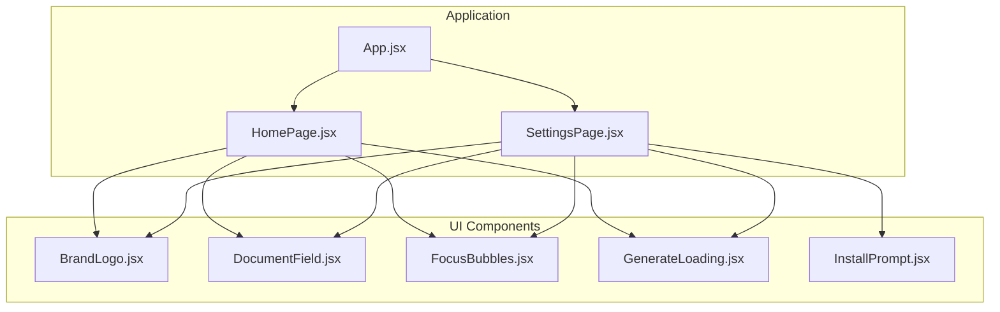
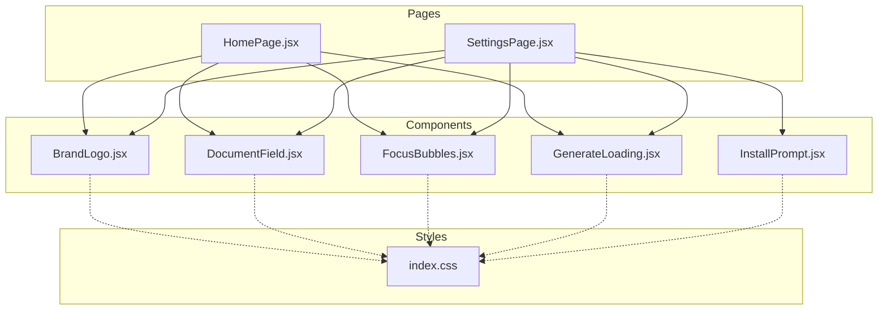
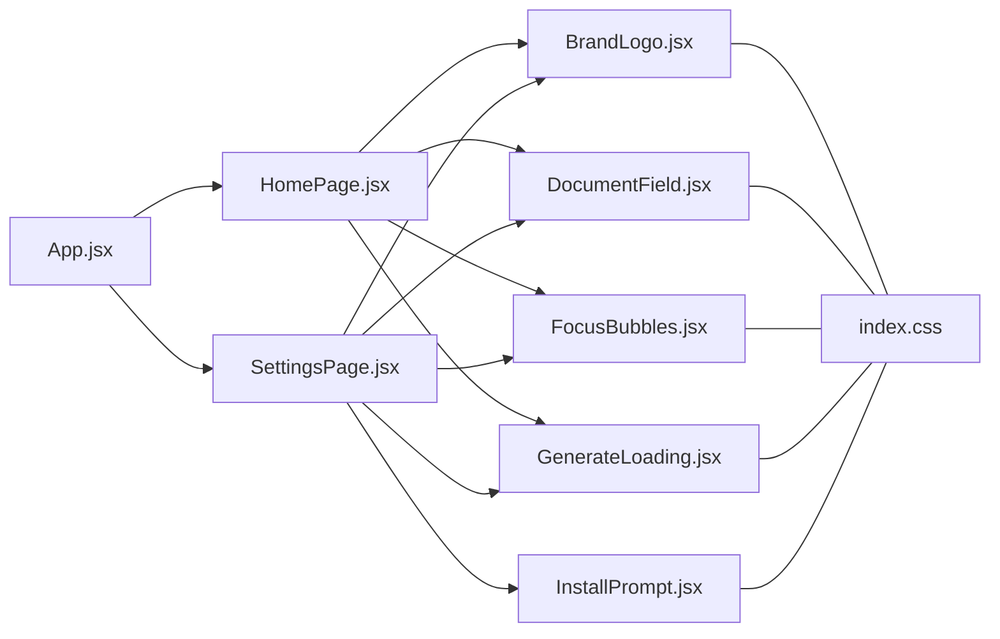

# UI Components

<cite>
**Referenced Files in This Document**
- [BrandLogo.jsx](file://src/components/BrandLogo.jsx)
- [DocumentField.jsx](file://src/components/DocumentField.jsx)
- [FocusBubbles.jsx](file://src/components/FocusBubbles.jsx)
- [GenerateLoading.jsx](file://src/components/GenerateLoading.jsx)
- [InstallPrompt.jsx](file://src/components/InstallPrompt.jsx)
- [App.jsx](file://src/App.jsx)
- [HomePage.jsx](file://src/pages/HomePage.jsx)
- [SettingsPage.jsx](file://src/pages/SettingsPage.jsx)
- [index.css](file://src/index.css)
</cite>

## Table of Contents
1. [Introduction](#introduction)
2. [Project Structure](#project-structure)
3. [Core Components](#core-components)
4. [Architecture Overview](#architecture-overview)
5. [Detailed Component Analysis](#detailed-component-analysis)
6. [Dependency Analysis](#dependency-analysis)
7. [Performance Considerations](#performance-considerations)
8. [Troubleshooting Guide](#troubleshooting-guide)
9. [Conclusion](#conclusion)

## Introduction
This document provides comprehensive documentation for LineCheck’s core UI components: BrandLogo, DocumentField, FocusBubbles, GenerateLoading, and InstallPrompt. It covers prop specifications, event handling, styling customization, accessibility features, responsive design patterns, and practical usage examples with code snippet paths to guide proper implementation and integration.

## Project Structure
The UI components are implemented as React functional components under src/components. They are consumed by pages and the application shell. Global styles are defined in src/index.css.

**Diagram sources**
- [App.jsx](file://src/App.jsx)
- [HomePage.jsx](file://src/pages/HomePage.jsx)
- [SettingsPage.jsx](file://src/pages/SettingsPage.jsx)
- [BrandLogo.jsx](file://src/components/BrandLogo.jsx)
- [DocumentField.jsx](file://src/components/DocumentField.jsx)
- [FocusBubbles.jsx](file://src/components/FocusBubbles.jsx)
- [GenerateLoading.jsx](file://src/components/GenerateLoading.jsx)
- [InstallPrompt.jsx](file://src/components/InstallPrompt.jsx)

**Section sources**
- [App.jsx](file://src/App.jsx)
- [HomePage.jsx](file://src/pages/HomePage.jsx)
- [SettingsPage.jsx](file://src/pages/SettingsPage.jsx)
- [BrandLogo.jsx](file://src/components/BrandLogo.jsx)
- [DocumentField.jsx](file://src/components/DocumentField.jsx)
- [FocusBubbles.jsx](file://src/components/FocusBubbles.jsx)
- [GenerateLoading.jsx](file://src/components/GenerateLoading.jsx)
- [InstallPrompt.jsx](file://src/components/InstallPrompt.jsx)

## Core Components
This section summarizes each component’s purpose and typical responsibilities within the app.

- BrandLogo: Renders brand identity visuals (logo or text) and supports size variants and alt text for accessibility.
- DocumentField: A controlled form input wrapper that manages value, placeholder, label, validation state, and error messaging.
- FocusBubbles: Visual focus indicator that highlights interactive elements on focus, improving keyboard navigation visibility.
- GenerateLoading: Loading indicator used during asynchronous generation operations; supports custom labels and sizes.
- InstallPrompt: PWA installation prompt that guides users to install the app when supported by the browser.

[No sources needed since this section provides a high-level overview]

## Architecture Overview
The components are presented by page-level views and styled via global CSS. The following diagram shows how pages compose these components and where global styles apply.

**Diagram sources**
- [HomePage.jsx](file://src/pages/HomePage.jsx)
- [SettingsPage.jsx](file://src/pages/SettingsPage.jsx)
- [BrandLogo.jsx](file://src/components/BrandLogo.jsx)
- [DocumentField.jsx](file://src/components/DocumentField.jsx)
- [FocusBubbles.jsx](file://src/components/FocusBubbles.jsx)
- [GenerateLoading.jsx](file://src/components/GenerateLoading.jsx)
- [InstallPrompt.jsx](file://src/components/InstallPrompt.jsx)
- [index.css](file://src/index.css)

## Detailed Component Analysis

### BrandLogo
Purpose: Display brand identity consistently across the app with accessible labeling and scalable sizing.

Props
- src: string — URL or path to the logo image file.
- alt: string — Accessible label for screen readers.
- width: number | string — Rendered width (e.g., numeric pixels or CSS units).
- height: number | string — Rendered height (e.g., numeric pixels or CSS units).
- className: string — Additional CSS class names for styling overrides.
- style: object — Inline styles for fine-grained control.

Events
- onClick: function — Optional click handler for interactive branding behaviors.

Styling Customization
- Use className and style props to override default appearance.
- Leverage CSS variables or utility classes from index.css if available.

Accessibility
- Always provide meaningful alt text.
- Ensure sufficient color contrast for any textual branding.
- Support keyboard activation if clickable.

Responsive Design Patterns
- Scale width/height based on viewport using media queries or dynamic values.
- Prefer relative units (rem, vw) for fluid scaling.

Usage Examples
- Basic logo display: [BrandLogo usage example](file://src/pages/HomePage.jsx)
- Clickable logo with custom size: [BrandLogo usage example](file://src/pages/SettingsPage.jsx)

**Section sources**
- [BrandLogo.jsx](file://src/components/BrandLogo.jsx)
- [HomePage.jsx](file://src/pages/HomePage.jsx)
- [SettingsPage.jsx](file://src/pages/SettingsPage.jsx)
- [index.css](file://src/index.css)

### DocumentField
Purpose: Provide a consistent, accessible, and validated form input experience with integrated label and error messaging.

Props
- id: string — Unique identifier for associating label and input.
- name: string — Form field name for submission.
- type: string — Input type (text, email, password, etc.).
- value: string — Controlled value.
- onChange: function — Event handler for value changes.
- onBlur: function — Optional blur handler for validation triggers.
- placeholder: string — Placeholder text.
- label: string — Accessible label text.
- required: boolean — Marks the field as required.
- disabled: boolean — Disables user interaction.
- error: string — Error message to display.
- helperText: string — Optional helper or hint text.
- className: string — Additional CSS class names.
- style: object — Inline styles.

Events
- onChange(event): function — Receives synthetic event; update controlled value.
- onBlur(event): function — Trigger validation or side effects.
- onFocus(event): function — Optional focus behavior.

Styling Customization
- Apply className/style to customize container, label, input, and error states.
- Use CSS variables for theme-aware colors and spacing.

Accessibility
- Associate label with input via htmlFor/id.
- Announce errors using aria-describedby or role attributes.
- Respect required/disabled semantics.

Validation and Error Handling
- Display error messages when error prop is provided.
- Integrate with external validation libraries if needed.

Responsive Design Patterns
- Full-width inputs on small screens; inline layout on larger screens.
- Adjust font sizes and spacing for readability.

Usage Examples
- Controlled text input with validation: [DocumentField usage example](file://src/pages/HomePage.jsx)
- Required email field with helper text: [DocumentField usage example](file://src/pages/SettingsPage.jsx)

**Section sources**
- [DocumentField.jsx](file://src/components/DocumentField.jsx)
- [HomePage.jsx](file://src/pages/HomePage.jsx)
- [SettingsPage.jsx](file://src/pages/SettingsPage.jsx)
- [index.css](file://src/index.css)

### FocusBubbles
Purpose: Enhance keyboard navigation by providing visible focus indicators around interactive elements.

Props
- targetRef: ref — Reference to the element(s) to highlight.
- active: boolean — Whether the focus bubble should be shown.
- color: string — Bubble border or background color.
- radius: number — Border radius for the bubble shape.
- duration: number — Animation duration in milliseconds.
- easing: string — CSS easing function for transitions.
- className: string — Additional CSS class names.
- style: object — Inline styles.

Events
- onShow: function — Callback when the bubble becomes visible.
- onHide: function — Callback when the bubble hides.

Styling Customization
- Customize color, radius, and animation timing via props or className/style.
- Ensure focus ring remains visible over other UI elements.

Accessibility
- Do not remove native focus outlines; augment them visually.
- Ensure animations do not cause motion sensitivity issues; respect prefers-reduced-motion.

Responsive Design Patterns
- Scale bubble size proportionally to the target element.
- Avoid overlapping content on narrow viewports.

Usage Examples
- Highlighting a focused button: [FocusBubbles usage example](file://src/pages/HomePage.jsx)
- Conditional focus indicator based on state: [FocusBubbles usage example](file://src/pages/SettingsPage.jsx)

**Section sources**
- [FocusBubbles.jsx](file://src/components/FocusBubbles.jsx)
- [HomePage.jsx](file://src/pages/HomePage.jsx)
- [SettingsPage.jsx](file://src/pages/SettingsPage.jsx)
- [index.css](file://src/index.css)

### GenerateLoading
Purpose: Indicate ongoing asynchronous generation tasks with customizable labels and sizes.

Props
- visible: boolean — Controls visibility of the loading indicator.
- label: string — Descriptive text for the current operation.
- size: string | number — Size variant or explicit dimension.
- showSpinner: boolean — Toggle spinner visibility.
- className: string — Additional CSS class names.
- style: object — Inline styles.

Events
- onDismiss: function — Optional callback to dismiss or reset loading state.

Styling Customization
- Override spinner color, size, and label typography via className/style.
- Align with global theme tokens.

Accessibility
- Use aria-live regions to announce status changes.
- Provide descriptive labels for screen readers.

Responsive Design Patterns
- Center overlay on all screen sizes.
- Ensure text remains readable at various sizes.

Usage Examples
- Show loader during data generation: [GenerateLoading usage example](file://src/pages/HomePage.jsx)
- Dismissible loading banner: [GenerateLoading usage example](file://src/pages/SettingsPage.jsx)

**Section sources**
- [GenerateLoading.jsx](file://src/components/GenerateLoading.jsx)
- [HomePage.jsx](file://src/pages/HomePage.jsx)
- [SettingsPage.jsx](file://src/pages/SettingsPage.jsx)
- [index.css](file://src/index.css)

### InstallPrompt
Purpose: Prompt users to install the PWA when supported, guiding them through the installation flow.

Props
- visible: boolean — Controls whether the prompt is displayed.
- onInstall: function — Handler invoked when the user chooses to install.
- onDismiss: function — Handler invoked when the user dismisses the prompt.
- label: string — Instructional text for the prompt.
- className: string — Additional CSS class names.
- style: object — Inline styles.

Events
- onInstall(): function — Called after user initiates installation.
- onDismiss(): function — Called when the user closes the prompt.

Styling Customization
- Style banner/card appearance via className/style.
- Ensure CTA buttons are prominent and accessible.

Accessibility
- Provide clear instructions and keyboard-accessible actions.
- Announce prompt availability to assistive technologies.

Responsive Design Patterns
- Compact banner on mobile; centered card on desktop.
- Ensure touch targets meet minimum size guidelines.

Usage Examples
- Persistent install banner: [InstallPrompt usage example](file://src/pages/SettingsPage.jsx)
- Contextual install prompt after first action: [InstallPrompt usage example](file://src/pages/HomePage.jsx)

**Section sources**
- [InstallPrompt.jsx](file://src/components/InstallPrompt.jsx)
- [HomePage.jsx](file://src/pages/HomePage.jsx)
- [SettingsPage.jsx](file://src/pages/SettingsPage.jsx)
- [index.css](file://src/index.css)

## Dependency Analysis
The components rely on React primitives and global styles. Pages orchestrate their usage and manage state.

**Diagram sources**
- [App.jsx](file://src/App.jsx)
- [HomePage.jsx](file://src/pages/HomePage.jsx)
- [SettingsPage.jsx](file://src/pages/SettingsPage.jsx)
- [BrandLogo.jsx](file://src/components/BrandLogo.jsx)
- [DocumentField.jsx](file://src/components/DocumentField.jsx)
- [FocusBubbles.jsx](file://src/components/FocusBubbles.jsx)
- [GenerateLoading.jsx](file://src/components/GenerateLoading.jsx)
- [InstallPrompt.jsx](file://src/components/InstallPrompt.jsx)
- [index.css](file://src/index.css)

**Section sources**
- [App.jsx](file://src/App.jsx)
- [HomePage.jsx](file://src/pages/HomePage.jsx)
- [SettingsPage.jsx](file://src/pages/SettingsPage.jsx)
- [BrandLogo.jsx](file://src/components/BrandLogo.jsx)
- [DocumentField.jsx](file://src/components/DocumentField.jsx)
- [FocusBubbles.jsx](file://src/components/FocusBubbles.jsx)
- [GenerateLoading.jsx](file://src/components/GenerateLoading.jsx)
- [InstallPrompt.jsx](file://src/components/InstallPrompt.jsx)
- [index.css](file://src/index.css)

## Performance Considerations
- Keep BrandLogo images optimized and appropriately sized for different viewports.
- Debounce onChange handlers in DocumentField for large inputs to avoid excessive re-renders.
- Minimize FocusBubbles animation complexity; prefer transform-based animations.
- Avoid unnecessary re-renders of GenerateLoading by memoizing props and using stable references.
- Defer InstallPrompt logic until the app is ready and the PWA manifest is available.

[No sources needed since this section provides general guidance]

## Troubleshooting Guide
- BrandLogo not displaying: Verify src path and alt text; ensure network access and correct MIME type.
- DocumentField validation not triggering: Confirm onChange updates the controlled value and onBlur calls validation logic.
- FocusBubbles not visible: Check targetRef assignment and active state; ensure CSS z-index does not hide the bubble.
- GenerateLoading stuck: Ensure visible prop toggles correctly and onDismiss resets state.
- InstallPrompt not appearing: Confirm PWA support and manifest configuration; handle onDismiss to prevent repeated prompts.

**Section sources**
- [BrandLogo.jsx](file://src/components/BrandLogo.jsx)
- [DocumentField.jsx](file://src/components/DocumentField.jsx)
- [FocusBubbles.jsx](file://src/components/FocusBubbles.jsx)
- [GenerateLoading.jsx](file://src/components/GenerateLoading.jsx)
- [InstallPrompt.jsx](file://src/components/InstallPrompt.jsx)

## Conclusion
These five components form the backbone of LineCheck’s user interface, providing consistent branding, robust form handling, enhanced accessibility, clear loading feedback, and guided PWA installation. By following the prop specifications, event patterns, styling approaches, and responsive strategies outlined here, developers can integrate and extend these components effectively while maintaining a high-quality user experience.