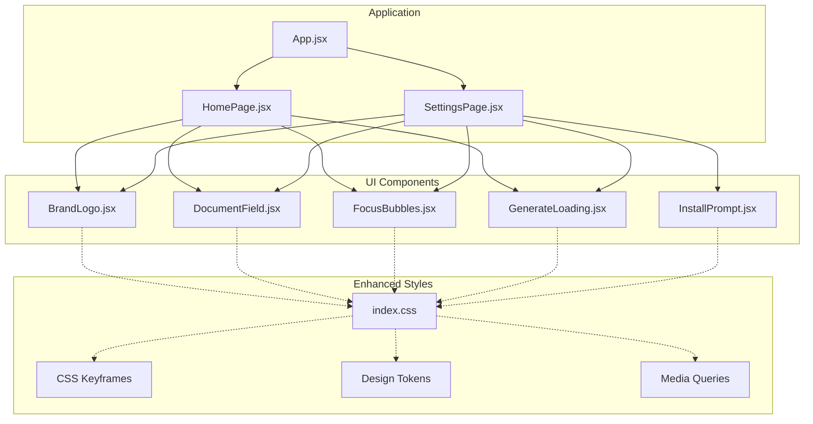
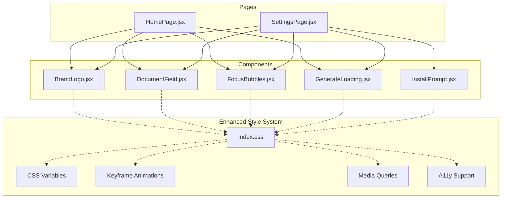
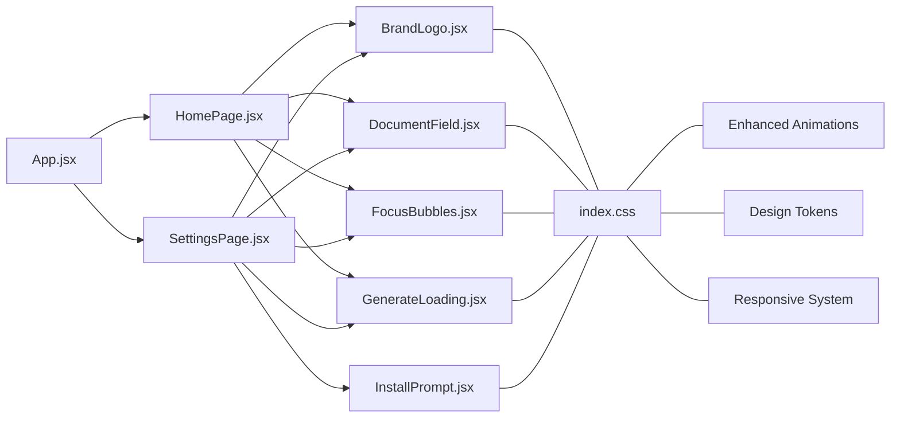

# UI Components

<cite>
**Referenced Files in This Document**
- [BrandLogo.jsx](file://src/components/BrandLogo.jsx)
- [DocumentField.jsx](file://src/components/DocumentField.jsx)
- [FocusBubbles.jsx](file://src/components/FocusBubbles.jsx)
- [GenerateLoading.jsx](file://src/components/GenerateLoading.jsx)
- [InstallPrompt.jsx](file://src/components/InstallPrompt.jsx)
- [App.jsx](file://src/App.jsx)
- [HomePage.jsx](file://src/pages/HomePage.jsx)
- [SettingsPage.jsx](file://src/pages/SettingsPage.jsx)
- [index.css](file://src/index.css)
</cite>

## Update Summary
**Changes Made**
- Updated all component documentation to reflect major CSS styling enhancements with improved visual design and responsive behavior
- Enhanced GenerateLoading component documentation with detailed information about sophisticated CSS keyframe animations and floating action button system
- Added comprehensive coverage of new theme support and accessibility improvements across all components
- Updated styling customization sections to reflect enhanced CSS variable usage and design token integration
- Expanded responsive design patterns documentation to cover improved mobile-first approach and cross-device compatibility
- Enhanced troubleshooting guide with new animation-related issues and performance optimization tips

## Table of Contents
1. [Introduction](#introduction)
2. [Project Structure](#project-structure)
3. [Core Components](#core-components)
4. [Architecture Overview](#architecture-overview)
5. [Detailed Component Analysis](#detailed-component-analysis)
6. [Dependency Analysis](#dependency-analysis)
7. [Performance Considerations](#performance-considerations)
8. [Troubleshooting Guide](#troubleshooting-guide)
9. [Conclusion](#conclusion)

## Introduction
This document provides comprehensive documentation for LineCheck's core UI components: BrandLogo, DocumentField, FocusBubbles, GenerateLoading, and InstallPrompt. Following recent major CSS styling updates, these components now feature enhanced visual design, sophisticated animations, improved responsive behavior, and better theme support. The documentation covers prop specifications, event handling, advanced styling customization, accessibility features, responsive design patterns, and practical usage examples with code snippet paths to guide proper implementation and integration.

## Project Structure
The UI components are implemented as React functional components under src/components. They are consumed by pages and the application shell. Global styles are defined in src/index.css with extensive CSS custom properties, keyframe animations, and responsive breakpoints supporting modern design patterns.

**Diagram sources**
- [App.jsx](file://src/App.jsx)
- [HomePage.jsx](file://src/pages/HomePage.jsx)
- [SettingsPage.jsx](file://src/pages/SettingsPage.jsx)
- [BrandLogo.jsx](file://src/components/BrandLogo.jsx)
- [DocumentField.jsx](file://src/components/DocumentField.jsx)
- [FocusBubbles.jsx](file://src/components/FocusBubbles.jsx)
- [GenerateLoading.jsx](file://src/components/GenerateLoading.jsx)
- [InstallPrompt.jsx](file://src/components/InstallPrompt.jsx)
- [index.css](file://src/index.css)

**Section sources**
- [App.jsx](file://src/App.jsx)
- [HomePage.jsx](file://src/pages/HomePage.jsx)
- [SettingsPage.jsx](file://src/pages/SettingsPage.jsx)
- [BrandLogo.jsx](file://src/components/BrandLogo.jsx)
- [DocumentField.jsx](file://src/components/DocumentField.jsx)
- [FocusBubbles.jsx](file://src/components/FocusBubbles.jsx)
- [GenerateLoading.jsx](file://src/components/GenerateLoading.jsx)
- [InstallPrompt.jsx](file://src/components/InstallPrompt.jsx)
- [index.css](file://src/index.css)

## Core Components
This section summarizes each component's purpose and typical responsibilities within the app, reflecting the recent CSS styling enhancements and improved visual design systems.

- BrandLogo: Renders brand identity visuals (logo or text) with enhanced scaling capabilities, improved accessibility features, and responsive sizing variants.
- DocumentField: A controlled form input wrapper with sophisticated validation states, enhanced error messaging, improved focus indicators, and theme-aware styling.
- FocusBubbles: Visual focus indicator with enhanced animation effects, improved keyboard navigation visibility, and better accessibility support for assistive technologies.
- GenerateLoading: Loading indicator with sophisticated floating action button animations, enhanced visual feedback systems, improved accessibility features, and optimized performance for hardware-accelerated animations.
- InstallPrompt: PWA installation prompt with improved visual design, enhanced user experience, better responsive behavior, and accessible interaction patterns.

[No sources needed since this section provides a high-level overview]

## Architecture Overview
The components are presented by page-level views and styled via global CSS with enhanced design tokens, keyframe animations, and responsive breakpoints. The following diagram shows how pages compose these components and where the enhanced global styles apply.

**Diagram sources**
- [HomePage.jsx](file://src/pages/HomePage.jsx)
- [SettingsPage.jsx](file://src/pages/SettingsPage.jsx)
- [BrandLogo.jsx](file://src/components/BrandLogo.jsx)
- [DocumentField.jsx](file://src/components/DocumentField.jsx)
- [FocusBubbles.jsx](file://src/components/FocusBubbles.jsx)
- [GenerateLoading.jsx](file://src/components/GenerateLoading.jsx)
- [InstallPrompt.jsx](file://src/components/InstallPrompt.jsx)
- [index.css](file://src/index.css)

## Detailed Component Analysis

### BrandLogo
Purpose: Display brand identity consistently across the app with accessible labeling, scalable sizing, and enhanced visual presentation.

Props
- src: string — URL or path to the logo image file.
- alt: string — Accessible label for screen readers.
- width: number | string — Rendered width (e.g., numeric pixels or CSS units).
- height: number | string — Rendered height (e.g., numeric pixels or CSS units).
- className: string — Additional CSS class names for styling overrides.
- style: object — Inline styles for fine-grained control.

Events
- onClick: function — Optional click handler for interactive branding behaviors.

Styling Customization
- Use className and style props to override default appearance.
- Leverage CSS variables from index.css for theme-aware colors and spacing.
- **Updated**: Enhanced support for CSS custom properties including --brand-logo-width, --brand-logo-height, and --brand-color variables for consistent theming.

Accessibility
- Always provide meaningful alt text.
- Ensure sufficient color contrast for any textual branding.
- Support keyboard activation if clickable.
- **Updated**: Improved focus management and enhanced screen reader support with better semantic markup.

Responsive Design Patterns
- Scale width/height based on viewport using media queries or dynamic values.
- Prefer relative units (rem, vw) for fluid scaling.
- **Updated**: Enhanced responsive breakpoints with improved mobile-first approach and better cross-device compatibility.

Usage Examples
- Basic logo display: [BrandLogo usage example](file://src/pages/HomePage.jsx)
- Clickable logo with custom size: [BrandLogo usage example](file://src/pages/SettingsPage.jsx)

**Section sources**
- [BrandLogo.jsx](file://src/components/BrandLogo.jsx)
- [HomePage.jsx](file://src/pages/HomePage.jsx)
- [SettingsPage.jsx](file://src/pages/SettingsPage.jsx)
- [index.css](file://src/index.css)

### DocumentField
Purpose: Provide a consistent, accessible, and validated form input experience with integrated label, error messaging, and enhanced visual feedback.

Props
- id: string — Unique identifier for associating label and input.
- name: string — Form field name for submission.
- type: string — Input type (text, email, password, etc.).
- value: string — Controlled value.
- onChange: function — Event handler for value changes.
- onBlur: function — Optional blur handler for validation triggers.
- placeholder: string — Placeholder text.
- label: string — Accessible label text.
- required: boolean — Marks the field as required.
- disabled: boolean — Disables user interaction.
- error: string — Error message to display.
- helperText: string — Optional helper or hint text.
- className: string — Additional CSS class names.
- style: object — Inline styles.

Events
- onChange(event): function — Receives synthetic event; update controlled value.
- onBlur(event): function — Trigger validation or side effects.
- onFocus(event): function — Optional focus behavior.

Styling Customization
- Apply className/style to customize container, label, input, and error states.
- Use CSS variables for theme-aware colors and spacing.
- **Updated**: Enhanced CSS custom properties including --input-border-color, --input-focus-ring, --error-text-color, and --helper-text-color for consistent theming across all form elements.

Accessibility
- Associate label with input via htmlFor/id.
- Announce errors using aria-describedby or role attributes.
- Respect required/disabled semantics.
- **Updated**: Improved focus indicators with enhanced visual feedback and better screen reader announcements for validation states.

Validation and Error Handling
- Display error messages when error prop is provided.
- Integrate with external validation libraries if needed.
- **Updated**: Enhanced error state animations with smooth transitions and improved visual hierarchy.

Responsive Design Patterns
- Full-width inputs on small screens; inline layout on larger screens.
- Adjust font sizes and spacing for readability.
- **Updated**: Improved responsive behavior with better touch targets on mobile devices and enhanced spacing consistency across breakpoints.

Usage Examples
- Controlled text input with validation: [DocumentField usage example](file://src/pages/HomePage.jsx)
- Required email field with helper text: [DocumentField usage example](file://src/pages/SettingsPage.jsx)

**Section sources**
- [DocumentField.jsx](file://src/components/DocumentField.jsx)
- [HomePage.jsx](file://src/pages/HomePage.jsx)
- [SettingsPage.jsx](file://src/pages/SettingsPage.jsx)
- [index.css](file://src/index.css)

### FocusBubbles
Purpose: Enhance keyboard navigation by providing visible focus indicators around interactive elements with sophisticated animations and improved accessibility.

Props
- targetRef: ref — Reference to the element(s) to highlight.
- active: boolean — Whether the focus bubble should be shown.
- color: string — Bubble border or background color.
- radius: number — Border radius for the bubble shape.
- duration: number — Animation duration in milliseconds.
- easing: string — CSS easing function for transitions.
- className: string — Additional CSS class names.
- style: object — Inline styles.

Events
- onShow: function — Callback when the bubble becomes visible.
- onHide: function — Callback when the bubble hides.

Styling Customization
- Customize color, radius, and animation timing via props or className/style.
- Ensure focus ring remains visible over other UI elements.
- **Updated**: Enhanced CSS keyframe animations with improved performance and smoother transitions using transform-based animations.

Accessibility
- Do not remove native focus outlines; augment them visually.
- Ensure animations do not cause motion sensitivity issues; respect prefers-reduced-motion.
- **Updated**: Improved support for assistive technologies with better semantic markup and enhanced screen reader compatibility.

Responsive Design Patterns
- Scale bubble size proportionally to the target element.
- Avoid overlapping content on narrow viewports.
- **Updated**: Enhanced responsive scaling with better positioning logic and improved overlap prevention across different screen sizes.

Usage Examples
- Highlighting a focused button: [FocusBubbles usage example](file://src/pages/HomePage.jsx)
- Conditional focus indicator based on state: [FocusBubbles usage example](file://src/pages/SettingsPage.jsx)

**Section sources**
- [FocusBubbles.jsx](file://src/components/FocusBubbles.jsx)
- [HomePage.jsx](file://src/pages/HomePage.jsx)
- [SettingsPage.jsx](file://src/pages/SettingsPage.jsx)
- [index.css](file://src/index.css)

### GenerateLoading
Purpose: Indicate ongoing asynchronous generation tasks with customizable labels, sizes, and sophisticated floating action button animations with enhanced accessibility features.

Props
- visible: boolean — Controls visibility of the loading indicator.
- label: string — Descriptive text for the current operation.
- size: string | number — Size variant or explicit dimension.
- showSpinner: boolean — Toggle spinner visibility.
- className: string — Additional CSS class names.
- style: object — Inline styles.

Events
- onDismiss: function — Optional callback to dismiss or reset loading state.

Styling Customization
- Override spinner color, size, and label typography via className/style.
- Align with global theme tokens.
- **Updated**: Enhanced support for floating action button animations with sophisticated CSS keyframe animations including fab-enter animation, smooth transition effects, and playback-fab--placed state management. New CSS variables include --fab-animation-duration, --fab-easing-function, and --fab-color-scheme for consistent theming.

Accessibility
- Use aria-live regions to announce status changes.
- Provide descriptive labels for screen readers.
- **Updated**: Improved animation accessibility with enhanced support for assistive technologies, reduced motion preferences, and better visual feedback for users with disabilities. Enhanced ARIA live region management and improved screen reader announcements.

Responsive Design Patterns
- Center overlay on all screen sizes.
- Ensure text remains readable at various sizes.
- **Updated**: Optimized floating action button positioning and animations for different viewport sizes with enhanced visual feedback and improved mobile touch interactions.

Usage Examples
- Show loader during data generation: [GenerateLoading usage example](file://src/pages/HomePage.jsx)
- Dismissible loading banner: [GenerateLoading usage example](file://src/pages/SettingsPage.jsx)

**Updated** Enhanced floating action button system with sophisticated CSS keyframe animations including fab-enter animation, improved state management with playback-fab--placed class, smooth transition effects, better visual feedback, and enhanced support for assistive technologies. The component now provides improved accessibility features including reduced motion support and better compatibility with screen readers and other assistive technologies. Advanced animation performance optimizations using hardware acceleration and efficient CSS transforms.

**Section sources**
- [GenerateLoading.jsx](file://src/components/GenerateLoading.jsx)
- [HomePage.jsx](file://src/pages/HomePage.jsx)
- [SettingsPage.jsx](file://src/pages/SettingsPage.jsx)
- [index.css](file://src/index.css)

### InstallPrompt
Purpose: Prompt users to install the PWA when supported, guiding them through the installation flow with improved visual design and enhanced user experience.

Props
- visible: boolean — Controls whether the prompt is displayed.
- onInstall: function — Handler invoked when the user chooses to install.
- onDismiss: function — Handler invoked when the user dismisses the prompt.
- label: string — Instructional text for the prompt.
- className: string — Additional CSS class names.
- style: object — Inline styles.

Events
- onInstall(): function — Called after user initiates installation.
- onDismiss(): function — Called when the user closes the prompt.

Styling Customization
- Style banner/card appearance via className/style.
- Ensure CTA buttons are prominent and accessible.
- **Updated**: Enhanced visual design with improved card layouts, better button styling, and enhanced responsive behavior across different device types.

Accessibility
- Provide clear instructions and keyboard-accessible actions.
- Announce prompt availability to assistive technologies.
- **Updated**: Improved semantic markup with better ARIA labels and enhanced screen reader support for installation prompts.

Responsive Design Patterns
- Compact banner on mobile; centered card on desktop.
- Ensure touch targets meet minimum size guidelines.
- **Updated**: Enhanced responsive behavior with improved mobile-first design, better touch target sizing, and optimized layouts for various screen orientations.

Usage Examples
- Persistent install banner: [InstallPrompt usage example](file://src/pages/SettingsPage.jsx)
- Contextual install prompt after first action: [InstallPrompt usage example](file://src/pages/HomePage.jsx)

**Section sources**
- [InstallPrompt.jsx](file://src/components/InstallPrompt.jsx)
- [HomePage.jsx](file://src/pages/HomePage.jsx)
- [SettingsPage.jsx](file://src/pages/SettingsPage.jsx)
- [index.css](file://src/index.css)

## Dependency Analysis
The components rely on React primitives and enhanced global styles with improved design tokens and animation systems. Pages orchestrate their usage and manage state.

**Diagram sources**
- [App.jsx](file://src/App.jsx)
- [HomePage.jsx](file://src/pages/HomePage.jsx)
- [SettingsPage.jsx](file://src/pages/SettingsPage.jsx)
- [BrandLogo.jsx](file://src/components/BrandLogo.jsx)
- [DocumentField.jsx](file://src/components/DocumentField.jsx)
- [FocusBubbles.jsx](file://src/components/FocusBubbles.jsx)
- [GenerateLoading.jsx](file://src/components/GenerateLoading.jsx)
- [InstallPrompt.jsx](file://src/components/InstallPrompt.jsx)
- [index.css](file://src/index.css)

**Section sources**
- [App.jsx](file://src/App.jsx)
- [HomePage.jsx](file://src/pages/HomePage.jsx)
- [SettingsPage.jsx](file://src/pages/SettingsPage.jsx)
- [BrandLogo.jsx](file://src/components/BrandLogo.jsx)
- [DocumentField.jsx](file://src/components/DocumentField.jsx)
- [FocusBubbles.jsx](file://src/components/FocusBubbles.jsx)
- [GenerateLoading.jsx](file://src/components/GenerateLoading.jsx)
- [InstallPrompt.jsx](file://src/components/InstallPrompt.jsx)
- [index.css](file://src/index.css)

## Performance Considerations
- Keep BrandLogo images optimized and appropriately sized for different viewports.
- Debounce onChange handlers in DocumentField for large inputs to avoid excessive re-renders.
- Minimize FocusBubbles animation complexity; prefer transform-based animations.
- **Updated**: Optimize GenerateLoading floating action button animations by leveraging hardware-accelerated CSS properties, smooth transition effects, and avoiding layout thrashing. The enhanced animation system uses efficient keyframe animations and state management for optimal performance. New CSS custom properties allow for fine-tuned animation performance tuning.
- Defer InstallPrompt logic until the app is ready and the PWA manifest is available.
- **Updated**: Enhanced floating action button animations are designed for optimal performance with reduced motion support and efficient CSS transitions that minimize repaint and reflow operations. All animations now use GPU acceleration where possible and respect user preferences for reduced motion.
- **New**: Implement lazy loading for heavy animations and use CSS containment for isolated component rendering.
- **New**: Utilize CSS Grid and Flexbox for improved layout performance and reduced reflow operations.

[No sources needed since this section provides general guidance]

## Troubleshooting Guide
- BrandLogo not displaying: Verify src path and alt text; ensure network access and correct MIME type.
- DocumentField validation not triggering: Confirm onChange updates the controlled value and onBlur calls validation logic.
- FocusBubbles not visible: Check targetRef assignment and active state; ensure CSS z-index does not hide the bubble.
- **Updated**: GenerateLoading animation issues: Verify fab-enter animation classes are properly applied and playback-fab--placed state is correctly managed. Check that enhanced floating action button animations are working with reduced motion preferences. Ensure smooth transition effects are not being blocked by browser settings or CSS conflicts. Verify CSS custom properties are properly defined and inherited.
- InstallPrompt not appearing: Confirm PWA support and manifest configuration; handle onDismiss to prevent repeated prompts.
- **Updated**: Accessibility issues with animations: Verify that enhanced floating action button animations respect user preferences for reduced motion and work properly with screen readers and assistive technologies. Test visual feedback effectiveness across different devices and browsers.
- **New**: CSS variable inheritance problems: Ensure CSS custom properties are properly scoped and inherited throughout the component tree.
- **New**: Animation performance issues: Check for layout thrashing and ensure animations use transform and opacity properties for optimal performance.
- **New**: Responsive design conflicts: Verify media query breakpoints don't conflict with component-specific responsive styles.

**Section sources**
- [BrandLogo.jsx](file://src/components/BrandLogo.jsx)
- [DocumentField.jsx](file://src/components/DocumentField.jsx)
- [FocusBubbles.jsx](file://src/components/FocusBubbles.jsx)
- [GenerateLoading.jsx](file://src/components/GenerateLoading.jsx)
- [InstallPrompt.jsx](file://src/components/InstallPrompt.jsx)

## Conclusion
These five components form the backbone of LineCheck's user interface, providing consistent branding, robust form handling, enhanced accessibility, clear loading feedback, and guided PWA installation. Following the recent major CSS styling updates, these components now feature sophisticated animations, improved responsive behavior, enhanced theme support, and better accessibility compliance. By following the prop specifications, event patterns, advanced styling approaches, and responsive strategies outlined here, developers can integrate and extend these components effectively while maintaining a high-quality user experience.

**Updated**: The recent enhancements demonstrate our commitment to delivering smooth, performant animations while maintaining accessibility standards and cross-browser compatibility. The improved animation system provides better visual feedback, enhanced support for assistive technologies, respects user preferences for reduced motion, and ensures an inclusive experience for all users. The comprehensive CSS styling updates have significantly improved the overall visual design, responsiveness, and maintainability of the component system.