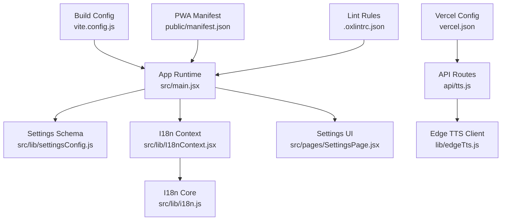
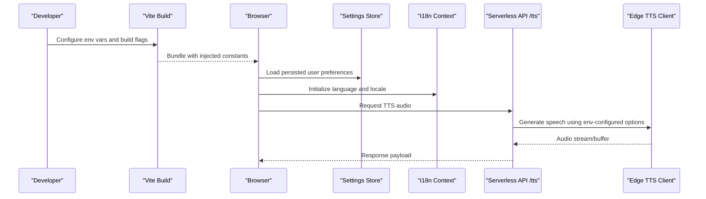
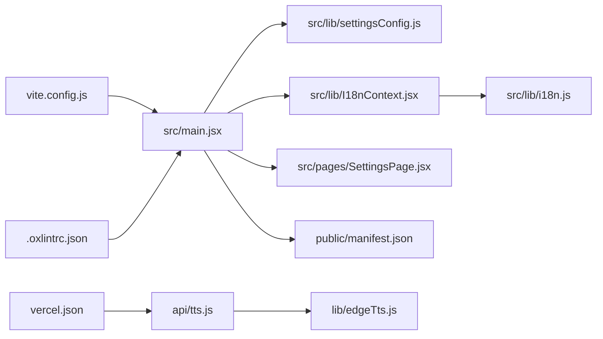

# Configuration & Customization

<cite>
**Referenced Files in This Document**
- [package.json](file://package.json)
- [vite.config.js](file://vite.config.js)
- [vercel.json](file://vercel.json)
- [public/manifest.json](file://public/manifest.json)
- [src/lib/settingsConfig.js](file://src/lib/settingsConfig.js)
- [src/lib/i18n.js](file://src/lib/i18n.js)
- [src/lib/I18nContext.jsx](file://src/lib/I18nContext.jsx)
- [src/pages/SettingsPage.jsx](file://src/pages/SettingsPage.jsx)
- [api/tts.js](file://api/tts.js)
- [lib/edgeTts.js](file://lib/edgeTts.js)
- [.oxlintrc.json](file://.oxlintrc.json)
</cite>

## Table of Contents
1. [Introduction](#introduction)
2. [Project Structure](#project-structure)
3. [Core Components](#core-components)
4. [Architecture Overview](#architecture-overview)
5. [Detailed Component Analysis](#detailed-component-analysis)
6. [Dependency Analysis](#dependency-analysis)
7. [Performance Considerations](#performance-considerations)
8. [Troubleshooting Guide](#troubleshooting-guide)
9. [Conclusion](#conclusion)
10. [Appendices](#appendices)

## Introduction
This document explains LineCheck’s configuration and customization capabilities, including application settings (theme, language, TTS), environment variables, build-time and runtime configuration, Progressive Web App manifest, deployment settings for Vercel, and linting rules. It also provides examples of common customizations, extension points for developers, migration guidance, and security best practices for managing configuration.

## Project Structure
Configuration-related files are spread across build tooling, runtime app code, serverless API endpoints, and PWA assets:
- Build-time configuration: Vite config and package scripts
- Runtime application settings: Settings schema, persistence, and UI
- Internationalization: Language selection and context
- TTS configuration: Serverless API and edge client integration
- PWA manifest: Installability and branding metadata
- Deployment: Vercel project configuration
- Linting: Oxlint rules

**Diagram sources**
- [vite.config.js](file://vite.config.js)
- [src/lib/settingsConfig.js](file://src/lib/settingsConfig.js)
- [src/lib/I18nContext.jsx](file://src/lib/I18nContext.jsx)
- [src/lib/i18n.js](file://src/lib/i18n.js)
- [src/pages/SettingsPage.jsx](file://src/pages/SettingsPage.jsx)
- [public/manifest.json](file://public/manifest.json)
- [vercel.json](file://vercel.json)
- [api/tts.js](file://api/tts.js)
- [lib/edgeTts.js](file://lib/edgeTts.js)
- [.oxlintrc.json](file://.oxlintrc.json)

**Section sources**
- [package.json](file://package.json)
- [vite.config.js](file://vite.config.js)
- [vercel.json](file://vercel.json)
- [public/manifest.json](file://public/manifest.json)
- [src/lib/settingsConfig.js](file://src/lib/settingsConfig.js)
- [src/lib/i18n.js](file://src/lib/i18n.js)
- [src/lib/I18nContext.jsx](file://src/lib/I18nContext.jsx)
- [src/pages/SettingsPage.jsx](file://src/pages/SettingsPage.jsx)
- [api/tts.js](file://api/tts.js)
- [lib/edgeTts.js](file://lib/edgeTts.js)
- [.oxlintrc.json](file://.oxlintrc.json)

## Core Components
- Application settings schema and persistence: Centralized settings model with defaults and storage helpers
- Internationalization: Language detection, fallbacks, and runtime switching
- TTS configuration: Serverless endpoint and edge client options
- PWA manifest: Branding, theme color, and install behavior
- Build-time configuration: Vite environment variable injection and asset handling
- Deployment configuration: Vercel routing and environment variable scoping
- Linting: Code quality rules applied during development and CI

Key responsibilities:
- Provide a single source of truth for user preferences
- Expose safe, typed configuration to the UI
- Allow environment-driven overrides at build or deploy time
- Keep sensitive values out of client bundles

**Section sources**
- [src/lib/settingsConfig.js](file://src/lib/settingsConfig.js)
- [src/lib/i18n.js](file://src/lib/i18n.js)
- [src/lib/I18nContext.jsx](file://src/lib/I18nContext.jsx)
- [api/tts.js](file://api/tts.js)
- [lib/edgeTts.js](file://lib/edgeTts.js)
- [public/manifest.json](file://public/manifest.json)
- [vite.config.js](file://vite.config.js)
- [vercel.json](file://vercel.json)
- [.oxlintrc.json](file://.oxlintrc.json)

## Architecture Overview
The configuration architecture separates concerns between build-time, runtime, and deployment layers:
- Build-time: Vite injects environment variables into the client bundle where appropriate
- Runtime: The app reads user preferences from local storage and applies them via contexts
- Serverless API: TTS endpoint consumes environment variables for provider credentials and options
- PWA: The manifest defines installable app metadata and theme colors
- Deployment: Vercel routes and environment variables control server-side behavior

**Diagram sources**
- [vite.config.js](file://vite.config.js)
- [src/lib/settingsConfig.js](file://src/lib/settingsConfig.js)
- [src/lib/I18nContext.jsx](file://src/lib/I18nContext.jsx)
- [src/lib/i18n.js](file://src/lib/i18n.js)
- [api/tts.js](file://api/tts.js)
- [lib/edgeTts.js](file://lib/edgeTts.js)

## Detailed Component Analysis

### Application Settings and User Preferences
- Settings schema and defaults: Centralized definition of all configurable keys, types, and default values
- Persistence: Local storage-backed store with safe getters/setters and migration hooks
- UI: Settings page exposes toggles and inputs bound to the schema
- Extension points: Adding new settings involves updating the schema, persisting logic, and wiring the UI

Common customizations:
- Add new preference keys with defaults and validation
- Persist complex objects safely
- Provide per-user defaults that can be overridden by environment variables at build time

Migration guidance:
- When changing defaults, provide a migration step to update existing stored values
- Use versioned settings to avoid breaking changes

Security considerations:
- Never store secrets in local storage; keep sensitive values on the server
- Validate and sanitize user inputs before persisting

**Section sources**
- [src/lib/settingsConfig.js](file://src/lib/settingsConfig.js)
- [src/pages/SettingsPage.jsx](file://src/pages/SettingsPage.jsx)

### Theme Customization
- Theme tokens and modes are managed through CSS and React state driven by settings
- Users can switch themes via the settings UI; changes persist to local storage
- Build-time overrides allow enforcing brand colors or disabling certain themes

Best practices:
- Define a minimal set of semantic tokens to simplify future updates
- Ensure sufficient contrast and accessibility compliance
- Avoid hardcoding colors in components; reference tokens only

**Section sources**
- [src/lib/settingsConfig.js](file://src/lib/settingsConfig.js)
- [src/pages/SettingsPage.jsx](file://src/pages/SettingsPage.jsx)

### Language Preferences and Internationalization
- Language detection uses browser locale with explicit fallbacks
- Runtime switching is supported via context; translations are loaded on demand
- New languages require adding translation resources and registering them in the i18n core

Customization examples:
- Add a new locale and register it in the i18n setup
- Override default locale based on environment variables at build time

Accessibility:
- Ensure all dynamic content updates respect the active locale
- Provide clear feedback when language changes

**Section sources**
- [src/lib/i18n.js](file://src/lib/i18n.js)
- [src/lib/I18nContext.jsx](file://src/lib/I18nContext.jsx)

### TTS Configuration
- Serverless endpoint handles TTS requests and delegates to an edge client
- Environment variables configure provider credentials, voice selection, and output format
- Edge client encapsulates network calls and error mapping

Operational notes:
- Rate limiting and retries should be handled at the API layer
- Cache responses when appropriate to reduce costs and latency

Security:
- Keep provider credentials in environment variables only
- Validate request payloads and enforce allowed voices/formats

**Section sources**
- [api/tts.js](file://api/tts.js)
- [lib/edgeTts.js](file://lib/edgeTts.js)

### Progressive Web App Manifest
- The manifest defines app name, icons, theme color, and display mode
- Customize branding and install prompts by editing the manifest and related assets
- Ensure icons meet platform requirements for crisp rendering

Deployment tips:
- Serve the manifest from the correct path
- Update cache headers to balance freshness and performance

**Section sources**
- [public/manifest.json](file://public/manifest.json)

### Build-Time Configuration (Vite)
- Environment variables prefixed appropriately are injected into the client bundle
- Use build flags to enable/disable features or set default locales
- Asset paths and base URL can be configured for different environments

Security:
- Only expose non-sensitive variables to the client
- Validate required variables at build time and fail early if missing

**Section sources**
- [vite.config.js](file://vite.config.js)

### Deployment Settings (Vercel)
- Routing rules define how requests map to serverless functions
- Environment variables are scoped per environment (development, preview, production)
- Headers and redirects can be configured for SEO and caching

Best practices:
- Pin versions and dependencies in vercel.json for reproducibility
- Use environment-specific variables for secrets and endpoints

**Section sources**
- [vercel.json](file://vercel.json)

### Linting Rules (Oxlint)
- Centralized lint configuration enforces consistent code style and catches common issues
- Extend or disable rules selectively for specific files or directories
- Integrate lint checks into CI to maintain quality gates

**Section sources**
- [.oxlintrc.json](file://.oxlintrc.json)

## Dependency Analysis
Configuration touches multiple layers. The following diagram shows key relationships among configuration modules:

**Diagram sources**
- [vite.config.js](file://vite.config.js)
- [src/lib/settingsConfig.js](file://src/lib/settingsConfig.js)
- [src/lib/I18nContext.jsx](file://src/lib/I18nContext.jsx)
- [src/lib/i18n.js](file://src/lib/i18n.js)
- [src/pages/SettingsPage.jsx](file://src/pages/SettingsPage.jsx)
- [public/manifest.json](file://public/manifest.json)
- [vercel.json](file://vercel.json)
- [api/tts.js](file://api/tts.js)
- [lib/edgeTts.js](file://lib/edgeTts.js)
- [.oxlintrc.json](file://.oxlintrc.json)

**Section sources**
- [vite.config.js](file://vite.config.js)
- [vercel.json](file://vercel.json)
- [src/lib/settingsConfig.js](file://src/lib/settingsConfig.js)
- [src/lib/i18n.js](file://src/lib/i18n.js)
- [src/lib/I18nContext.jsx](file://src/lib/I18nContext.jsx)
- [src/pages/SettingsPage.jsx](file://src/pages/SettingsPage.jsx)
- [public/manifest.json](file://public/manifest.json)
- [api/tts.js](file://api/tts.js)
- [lib/edgeTts.js](file://lib/edgeTts.js)
- [.oxlintrc.json](file://.oxlintrc.json)

## Performance Considerations
- Minimize client-side configuration size by excluding heavy assets from the bundle
- Lazy-load translations and TTS resources to reduce initial load time
- Cache TTS responses when feasible to reduce API calls and costs
- Use efficient storage operations and batch updates for settings

[No sources needed since this section provides general guidance]

## Troubleshooting Guide
Common issues and resolutions:
- Missing environment variables at build time: Ensure required variables are present and validated
- Incorrect PWA installation: Verify manifest path and icon sizes
- TTS failures: Check serverless logs and validate provider credentials and region settings
- Language not switching: Confirm locale registration and resource availability
- Lint errors in CI: Align local and CI rule sets and fix reported issues

**Section sources**
- [vite.config.js](file://vite.config.js)
- [public/manifest.json](file://public/manifest.json)
- [api/tts.js](file://api/tts.js)
- [lib/edgeTts.js](file://lib/edgeTts.js)
- [src/lib/i18n.js](file://src/lib/i18n.js)
- [.oxlintrc.json](file://.oxlintrc.json)

## Conclusion
LineCheck’s configuration system cleanly separates build-time, runtime, and deployment concerns while providing extensible hooks for customization. By adhering to the recommended patterns—centralized schemas, environment-scoped secrets, and robust internationalization—you can safely evolve the application’s behavior and appearance without compromising security or performance.

[No sources needed since this section summarizes without analyzing specific files]

## Appendices

### Environment Variables Reference
- Build-time variables: Injected into the client bundle via Vite; use only for non-sensitive configuration
- Runtime variables: Consumed by serverless functions for TTS and other backend features
- Best practice: Prefix and document variables clearly; validate presence at startup/build

**Section sources**
- [vite.config.js](file://vite.config.js)
- [api/tts.js](file://api/tts.js)

### Migration Guide for Configuration Changes
- Changing defaults: Provide a migration step to update existing stored settings
- Renaming keys: Maintain backward compatibility by aliasing old keys during migration
- Adding new features: Gate behind feature flags and ensure graceful degradation

**Section sources**
- [src/lib/settingsConfig.js](file://src/lib/settingsConfig.js)

### Security Best Practices
- Keep secrets out of client bundles; use serverless functions for sensitive operations
- Validate and sanitize all user inputs before persisting
- Enforce least privilege for environment variables and restrict access in CI/CD

**Section sources**
- [api/tts.js](file://api/tts.js)
- [lib/edgeTts.js](file://lib/edgeTts.js)
- [vite.config.js](file://vite.config.js)