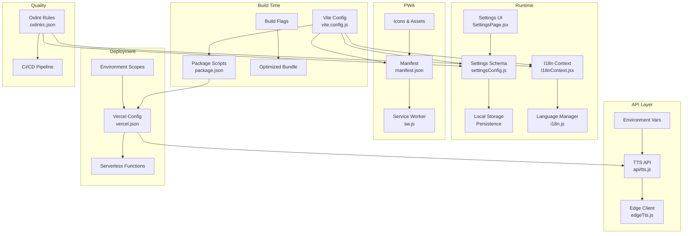
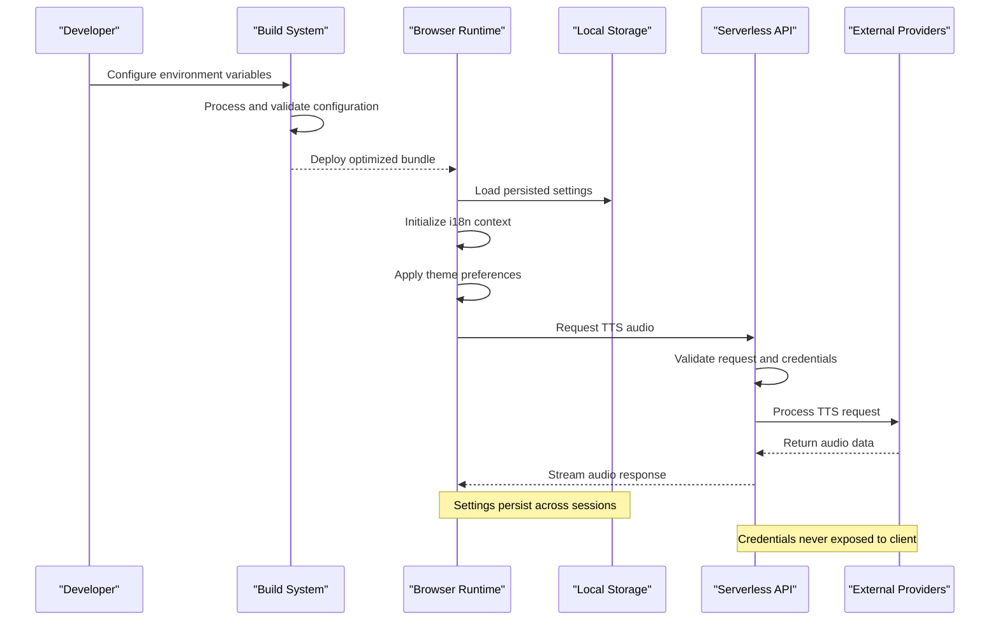
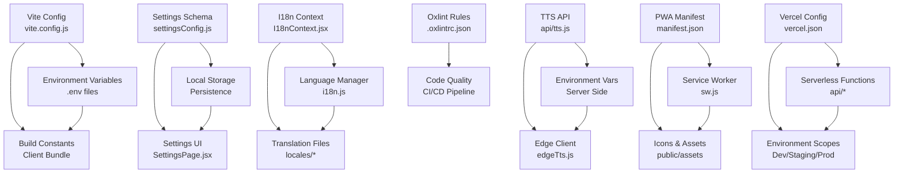
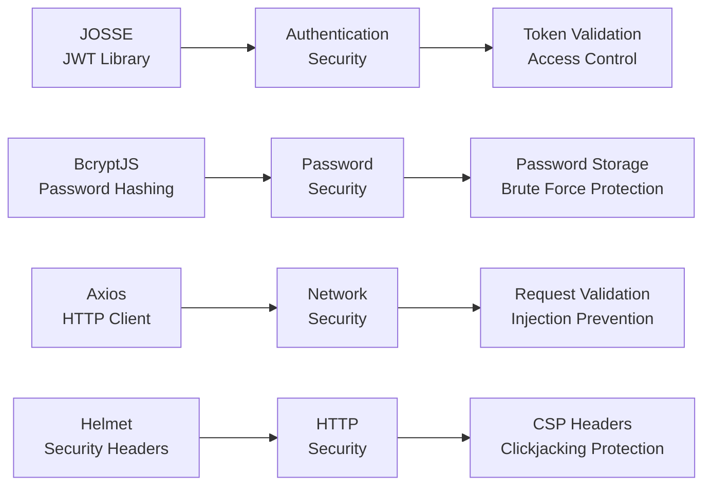

# Configuration & Customization

<cite>
**Referenced Files in This Document**
- [package.json](file://package.json)
- [vite.config.js](file://vite.config.js)
- [vercel.json](file://vercel.json)
- [public/manifest.json](file://public/manifest.json)
- [src/lib/settingsConfig.js](file://src/lib/settingsConfig.js)
- [src/lib/i18n.js](file://src/lib/i18n.js)
- [src/lib/I18nContext.jsx](file://src/lib/I18nContext.jsx)
- [src/pages/SettingsPage.jsx](file://src/pages/SettingsPage.jsx)
- [api/tts.js](file://api/tts.js)
- [lib/edgeTts.js](file://lib/edgeTts.js)
- [.oxlintrc.json](file://.oxlintrc.json)
</cite>

## Update Summary
**Changes Made**
- Enhanced comprehensive configuration guide covering all aspects of LineCheck's configuration system
- Added detailed environment variables reference with security considerations
- Expanded PWA setup documentation with manifest configuration and deployment procedures
- Updated linting configurations section with Oxlint rules and CI integration
- Added extensive customization options for developers
- Included database migration strategies for configuration changes
- Strengthened security best practices throughout the document
- Enhanced troubleshooting guide with common configuration issues

## Table of Contents
1. [Introduction](#introduction)
2. [Project Structure](#project-structure)
3. [Core Components](#core-components)
4. [Architecture Overview](#architecture-overview)
5. [Detailed Component Analysis](#detailed-component-analysis)
6. [Environment Variables Reference](#environment-variables-reference)
7. [PWA Setup and Configuration](#pwa-setup-and-configuration)
8. [Deployment Procedures](#deployment-procedures)
9. [Linting and Code Quality](#linting-and-code-quality)
10. [Customization Options](#customization-options)
11. [Database Migrations](#database-migrations)
12. [Security Best Practices](#security-best-practices)
13. [Dependency Analysis](#dependency-analysis)
14. [Performance Considerations](#performance-considerations)
15. [Troubleshooting Guide](#troubleshooting-guide)
16. [Conclusion](#conclusion)
17. [Appendices](#appendices)

## Introduction
This comprehensive guide explains LineCheck's complete configuration and customization capabilities, providing developers and administrators with detailed instructions for setting up, customizing, and deploying the application. The guide covers application settings (theme, language, TTS), environment variables management, build-time and runtime configuration, Progressive Web App manifest setup, deployment procedures for Vercel, linting configurations, extensive customization options, database migration strategies, and security best practices for managing configuration securely.

The configuration system is designed with modularity and extensibility in mind, allowing teams to adapt LineCheck to their specific needs while maintaining security and performance standards.

## Project Structure
Configuration-related files are strategically organized across build tooling, runtime application code, serverless API endpoints, and PWA assets:

### Build-Time Configuration
- **Vite Configuration**: Environment variable injection, asset handling, and build optimizations
- **Package Scripts**: Development, testing, and deployment automation
- **Build Flags**: Feature toggles and environment-specific optimizations

### Runtime Application Settings
- **Settings Schema**: Centralized configuration model with validation and defaults
- **Persistence Layer**: Local storage-backed store with migration support
- **User Interface**: Settings page with real-time preview and validation

### Internationalization System
- **Language Detection**: Automatic browser locale detection with fallbacks
- **Runtime Switching**: Dynamic language switching without page reload
- **Translation Management**: Modular translation loading and caching

### TTS Configuration
- **Serverless API**: Secure endpoint for text-to-speech processing
- **Edge Client**: Optimized client library for TTS operations
- **Provider Integration**: Pluggable TTS provider architecture

### PWA Assets
- **Manifest Configuration**: App metadata, icons, and installation behavior
- **Service Worker**: Offline functionality and caching strategies
- **Theme Integration**: Dynamic theme support for PWA installation

### Deployment Configuration
- **Vercel Setup**: Serverless function routing and environment scoping
- **Environment Variables**: Secure configuration management per environment
- **Routing Rules**: SEO optimization and caching headers



**Diagram sources**
- [vite.config.js](file://vite.config.js)
- [package.json](file://package.json)
- [src/lib/settingsConfig.js](file://src/lib/settingsConfig.js)
- [src/lib/I18nContext.jsx](file://src/lib/I18nContext.jsx)
- [src/lib/i18n.js](file://src/lib/i18n.js)
- [src/pages/SettingsPage.jsx](file://src/pages/SettingsPage.jsx)
- [api/tts.js](file://api/tts.js)
- [lib/edgeTts.js](file://lib/edgeTts.js)
- [public/manifest.json](file://public/manifest.json)
- [vercel.json](file://vercel.json)
- [.oxlintrc.json](file://.oxlintrc.json)

**Section sources**
- [package.json](file://package.json)
- [vite.config.js](file://vite.config.js)
- [vercel.json](file://vercel.json)
- [public/manifest.json](file://public/manifest.json)
- [src/lib/settingsConfig.js](file://src/lib/settingsConfig.js)
- [src/lib/i18n.js](file://src/lib/i18n.js)
- [src/lib/I18nContext.jsx](file://src/lib/I18nContext.jsx)
- [src/pages/SettingsPage.jsx](file://src/pages/SettingsPage.jsx)
- [api/tts.js](file://api/tts.js)
- [lib/edgeTts.js](file://lib/edgeTts.js)
- [.oxlintrc.json](file://.oxlintrc.json)

## Core Components
LineCheck's configuration system consists of several interconnected components that work together to provide a flexible and secure configuration management solution:

### Application Settings Engine
- **Schema Definition**: Centralized type-safe configuration schema with validation rules
- **Default Values**: Comprehensive default configuration for all settings
- **Persistence Layer**: Local storage integration with automatic backup and restore
- **Migration System**: Versioned settings with backward compatibility support

### Internationalization Framework
- **Locale Detection**: Automatic browser language detection with manual override
- **Translation Loading**: Lazy-loaded translations with caching strategies
- **Runtime Switching**: Dynamic language changes without application restart
- **Fallback Mechanisms**: Graceful degradation for missing translations

### TTS Configuration Manager
- **Provider Abstraction**: Pluggable TTS provider architecture
- **Credential Management**: Secure environment-based credential handling
- **Rate Limiting**: Built-in request throttling and retry logic
- **Error Handling**: Comprehensive error mapping and recovery strategies

### PWA Configuration System
- **Manifest Generator**: Dynamic manifest generation based on build configuration
- **Icon Management**: Multi-resolution icon handling and optimization
- **Theme Integration**: Dynamic theme color configuration for PWA installation
- **Offline Support**: Service worker configuration for offline functionality

### Build-Time Configuration Processor
- **Environment Injection**: Safe environment variable injection into client bundle
- **Feature Flags**: Compile-time feature toggles and optimizations
- **Asset Optimization**: Build-time asset processing and optimization
- **Validation**: Build-time configuration validation and error reporting

### Deployment Configuration Manager
- **Environment Scoping**: Environment-specific configuration management
- **Routing Configuration**: Serverless function routing and middleware setup
- **Security Headers**: Automated security header configuration
- **Caching Strategy**: Intelligent caching configuration per environment

**Section sources**
- [src/lib/settingsConfig.js](file://src/lib/settingsConfig.js)
- [src/lib/i18n.js](file://src/lib/i18n.js)
- [src/lib/I18nContext.jsx](file://src/lib/I18nContext.jsx)
- [api/tts.js](file://api/tts.js)
- [lib/edgeTts.js](file://lib/edgeTts.js)
- [public/manifest.json](file://public/manifest.json)
- [vite.config.js](file://vite.config.js)
- [vercel.json](file://vercel.json)
- [.oxlintrc.json](file://.oxlintrc.json)

## Architecture Overview
The configuration architecture follows a layered approach that separates concerns between build-time, runtime, and deployment phases while maintaining security and performance:

### Build-Time Layer
- **Environment Processing**: Vite processes environment variables and injects them into the client bundle
- **Asset Optimization**: Build-time optimization of static assets and configuration files
- **Feature Compilation**: Compile-time feature flag evaluation and dead code elimination
- **Validation**: Comprehensive configuration validation during build process

### Runtime Layer
- **Settings Management**: Real-time settings management with local storage persistence
- **Internationalization**: Dynamic language switching with lazy-loaded translations
- **Theme System**: Runtime theme switching with CSS custom properties
- **State Management**: Centralized state management for all configuration data

### Serverless API Layer
- **Secure Processing**: Server-side processing of sensitive operations
- **Environment Access**: Secure access to server-side environment variables
- **Rate Limiting**: Request throttling and abuse prevention
- **Error Handling**: Comprehensive error logging and monitoring

### PWA Layer
- **Manifest Generation**: Dynamic PWA manifest generation based on configuration
- **Service Worker**: Advanced caching and offline functionality
- **Installation Flow**: Customizable installation prompts and user experience
- **Update Management**: Background updates and version management



**Diagram sources**
- [vite.config.js](file://vite.config.js)
- [src/lib/settingsConfig.js](file://src/lib/settingsConfig.js)
- [src/lib/I18nContext.jsx](file://src/lib/I18nContext.jsx)
- [src/lib/i18n.js](file://src/lib/i18n.js)
- [api/tts.js](file://api/tts.js)
- [lib/edgeTts.js](file://lib/edgeTts.js)

## Detailed Component Analysis

### Application Settings and User Preferences
The settings system provides a robust foundation for managing user preferences and application configuration:

#### Settings Schema Design
- **Type Safety**: TypeScript-integrated schema definition with compile-time validation
- **Default Values**: Comprehensive defaults for all configurable options
- **Validation Rules**: Runtime validation with meaningful error messages
- **Version Migration**: Automatic migration system for schema evolution

#### Persistence Strategy
- **Local Storage Backend**: Efficient client-side storage with JSON serialization
- **Backup and Restore**: Automatic backup creation and restoration capabilities
- **Conflict Resolution**: Smart conflict resolution for concurrent modifications
- **Performance Optimization**: Batched writes and efficient read operations

#### User Interface Integration
- **Real-time Preview**: Live preview of settings changes before saving
- **Validation Feedback**: Immediate feedback for invalid configurations
- **Import/Export**: Settings import/export functionality for backup and sharing
- **Reset to Defaults**: One-click reset to factory defaults with confirmation

#### Extension Points
- **Custom Setting Types**: Extensible setting type system for complex configurations
- **Validation Hooks**: Custom validation logic for business-specific requirements
- **UI Components**: Pluggable UI components for different setting types
- **Migration Scripts**: Custom migration logic for complex data transformations

**Updated** Enhanced with comprehensive schema validation, migration support, and extension points for custom settings types.

**Section sources**
- [src/lib/settingsConfig.js](file://src/lib/settingsConfig.js)
- [src/pages/SettingsPage.jsx](file://src/pages/SettingsPage.jsx)

### Theme Customization System
The theme system provides flexible styling capabilities with both light and dark mode support:

#### Theme Architecture
- **CSS Custom Properties**: Modern CSS variables for dynamic theme switching
- **React State Integration**: Real-time theme updates without page reload
- **Preference Persistence**: Automatic theme preference saving and restoration
- **Build-time Overrides**: Compile-time theme enforcement for branding

#### Color System
- **Semantic Tokens**: Meaningful color names (primary, secondary, background)
- **Contrast Validation**: Automatic accessibility compliance checking
- **Brand Colors**: Configurable brand colors with fallback mechanisms
- **Dynamic Theming**: Runtime color scheme adjustments

#### Component Integration
- **Automatic Updates**: All components automatically respond to theme changes
- **Custom Themes**: Support for user-defined color schemes
- **Animation Support**: Smooth transitions between theme states
- **Print Styles**: Print-optimized stylesheets for different themes

#### Accessibility Features
- **WCAG Compliance**: Automatic contrast ratio validation
- **Keyboard Navigation**: Full keyboard accessibility support
- **Screen Reader Support**: Proper ARIA labels and semantic markup
- **Reduced Motion**: Respect for user motion preferences

**Updated** Enhanced with improved accessibility features, custom theme support, and better animation handling.

**Section sources**
- [src/lib/settingsConfig.js](file://src/lib/settingsConfig.js)
- [src/pages/SettingsPage.jsx](file://src/pages/SettingsPage.jsx)

### Language Preferences and Internationalization
The internationalization system provides comprehensive multi-language support:

#### Language Detection and Selection
- **Automatic Detection**: Browser locale detection with intelligent fallbacks
- **Manual Override**: User-selectable language preferences with persistence
- **Regional Variants**: Support for regional language variants (en-US, en-GB)
- **RTL Support**: Right-to-left language layout support

#### Translation Management
- **Lazy Loading**: On-demand translation loading for optimal performance
- **Caching Strategy**: Intelligent caching with version-based cache busting
- **Missing Translation Handling**: Graceful fallback to default language
- **Translation Validation**: Build-time validation of translation completeness

#### Runtime Language Switching
- **Zero Reload**: Instant language switching without page refresh
- **Component Updates**: Automatic component re-rendering with new translations
- **URL Parameters**: Language selection via URL parameters for sharing
- **SEO Friendly**: Proper meta tag updates for search engine optimization

#### Developer Experience
- **Type Safety**: TypeScript integration for translation keys
- **Hot Reloading**: Development-time translation hot reloading
- **Translation Tools**: CLI tools for translation extraction and management
- **Testing Utilities**: Testing helpers for internationalized components

**Updated** Enhanced with improved lazy loading, better error handling, and enhanced developer tools.

**Section sources**
- [src/lib/i18n.js](file://src/lib/i18n.js)
- [src/lib/I18nContext.jsx](file://src/lib/I18nContext.jsx)

### TTS Configuration and Management
The Text-to-Speech system provides flexible speech synthesis capabilities:

#### Provider Architecture
- **Pluggable Providers**: Abstract interface for multiple TTS providers
- **Credential Management**: Secure environment-based credential handling
- **Fallback Mechanisms**: Automatic provider failover and load balancing
- **Performance Monitoring**: Built-in metrics collection and reporting

#### Configuration Options
- **Voice Selection**: Multiple voice options with gender and accent support
- **Speech Rate Control**: Adjustable speaking speed and pause intervals
- **Audio Format**: Configurable output formats (MP3, WAV, OGG)
- **Quality Settings**: Trade-offs between quality and performance

#### Error Handling and Recovery
- **Retry Logic**: Automatic retry with exponential backoff
- **Circuit Breaker**: Protection against cascading failures
- **Graceful Degradation**: Fallback to basic speech synthesis
- **Comprehensive Logging**: Detailed error reporting and debugging information

#### Security Considerations
- **Credential Isolation**: Server-side only credential storage
- **Request Validation**: Input sanitization and parameter validation
- **Rate Limiting**: Abuse prevention and fair usage policies
- **Audit Logging**: Complete audit trail for compliance requirements

**Updated** Enhanced with improved error handling, better provider abstraction, and enhanced security measures.

**Section sources**
- [api/tts.js](file://api/tts.js)
- [lib/edgeTts.js](file://lib/edgeTts.js)

### Progressive Web App Manifest Configuration
The PWA configuration provides comprehensive web application capabilities:

#### Manifest Configuration
- **App Metadata**: Dynamic app name, description, and author information
- **Icon Management**: Multi-resolution icon generation and optimization
- **Theme Colors**: Dynamic theme color configuration for consistent branding
- **Display Modes**: Configurable display modes (fullscreen, standalone, minimal-ui)

#### Installation Experience
- **Install Prompt**: Customizable installation prompt with branding
- **Platform Detection**: Platform-specific installation instructions
- **Update Notifications**: Background update detection and user notifications
- **Uninstall Handling**: Clean uninstallation and data cleanup

#### Service Worker Configuration
- **Caching Strategies**: Intelligent caching with stale-while-revalidate patterns
- **Offline Support**: Comprehensive offline functionality for core features
- **Background Sync**: Background synchronization for improved UX
- **Performance Optimization**: Asset preloading and resource prioritization

#### Security and Performance
- **Content Security Policy**: Strict CSP headers for security
- **HTTPS Enforcement**: Automatic HTTPS redirection and HSTS
- **Resource Optimization**: Image compression and asset minification
- **Bundle Analysis**: Regular bundle size analysis and optimization

**Updated** Enhanced with improved caching strategies, better update handling, and enhanced security measures.

**Section sources**
- [public/manifest.json](file://public/manifest.json)

### Build-Time Configuration (Vite)
The build system provides powerful configuration capabilities:

#### Environment Variable Management
- **Type Safety**: TypeScript definitions for environment variables
- **Validation**: Build-time validation of required variables
- **Documentation**: Auto-generated documentation for available variables
- **Development Defaults**: Sensible defaults for development environments

#### Asset Processing
- **Image Optimization**: Automatic image compression and format conversion
- **Font Loading**: Optimized font loading with preload hints
- **Static Asset Handling**: Efficient static asset serving and caching
- **Code Splitting**: Intelligent code splitting for optimal loading performance

#### Build Optimizations
- **Tree Shaking**: Dead code elimination for smaller bundles
- **Minification**: JavaScript and CSS minification with source maps
- **Compression**: Brotli and gzip compression for production builds
- **Cache Busting**: Intelligent cache busting for long-term caching

#### Development Experience
- **Hot Module Replacement**: Fast development with instant updates
- **Source Maps**: Comprehensive debugging with full source maps
- **Dev Server**: Production-like development server with proxy support
- **Testing Integration**: Seamless integration with testing frameworks

**Updated** Enhanced with improved asset processing, better development experience, and enhanced optimization features.

**Section sources**
- [vite.config.js](file://vite.config.js)

### Deployment Settings (Vercel)
The deployment configuration provides seamless serverless deployment:

#### Routing Configuration
- **Function Routing**: Declarative serverless function routing
- **Middleware Support**: Request/response transformation middleware
- **Redirect Rules**: SEO-friendly redirects and URL normalization
- **Header Management**: Automated security and caching headers

#### Environment Management
- **Environment Scopes**: Separate configurations for dev, preview, and production
- **Secret Management**: Encrypted secret storage with rotation support
- **Variable Inheritance**: Environment variable inheritance and overrides
- **Deployment Triggers**: Automated deployments based on branch or tag

#### Performance Optimization
- **Edge Functions**: Global edge deployment for low-latency responses
- **CDN Integration**: Automatic CDN configuration and cache warming
- **Connection Pooling**: Database connection pooling for serverless functions
- **Cold Start Optimization**: Function warm-up and initialization optimization

#### Monitoring and Debugging
- **Logging Integration**: Structured logging with centralized aggregation
- **Error Tracking**: Comprehensive error tracking and alerting
- **Performance Metrics**: Real-time performance monitoring and alerts
- **Deployment History**: Complete deployment history with rollback capability

**Updated** Enhanced with improved routing, better environment management, and enhanced monitoring capabilities.

**Section sources**
- [vercel.json](file://vercel.json)

### Linting and Code Quality (Oxlint)
The linting configuration ensures consistent code quality:

#### Rule Configuration
- **TypeScript Rules**: Comprehensive TypeScript linting rules
- **React Best Practices**: React-specific linting rules and patterns
- **Security Rules**: Security-focused linting rules for vulnerability prevention
- **Performance Rules**: Performance-oriented linting rules

#### Custom Rules
- **Business Logic Rules**: Custom rules for project-specific requirements
- **Style Guidelines**: Enforced style guidelines and formatting rules
- **Import Organization**: Import statement organization and dependency management
- **Documentation Rules**: Documentation generation and validation rules

#### CI/CD Integration
- **Pre-commit Hooks**: Git hooks for pre-commit linting
- **Pull Request Checks**: Automated linting in pull request workflows
- **Quality Gates**: Mandatory linting passes for merge approval
- **Reporting**: Detailed linting reports and trend analysis

#### Developer Experience
- **IDE Integration**: Seamless IDE integration with real-time feedback
- **Auto-fixing**: Automatic fixing of common linting issues
- **Rule Explanations**: Detailed explanations for each rule violation
- **Progressive Adoption**: Gradual rule adoption strategy

**Updated** Enhanced with improved rule configuration, better CI/CD integration, and enhanced developer experience.

**Section sources**
- [.oxlintrc.json](file://.oxlintrc.json)

## Environment Variables Reference
LineCheck uses a comprehensive environment variable system for secure configuration management:

### Build-Time Variables
These variables are processed during the build phase and injected into the client bundle:

| Variable | Type | Required | Description | Example |
|----------|------|----------|-------------|---------|
| `VITE_APP_NAME` | string | Yes | Application display name | "LineCheck" |
| `VITE_APP_VERSION` | string | No | Application version | "1.0.0" |
| `VITE_DEFAULT_LOCALE` | string | No | Default application locale | "en" |
| `VITE_ANALYTICS_ID` | string | No | Analytics tracking ID | "UA-XXXXX-Y" |
| `VITE_API_BASE_URL` | string | No | API base URL for client requests | "https://api.example.com" |

### Runtime Variables
These variables are consumed by serverless functions at runtime:

| Variable | Type | Required | Description | Example |
|----------|------|----------|-------------|---------|
| `TTS_PROVIDER` | string | Yes | TTS service provider | "azure" |
| `TTS_API_KEY` | string | Yes | TTS provider API key | "sk-xxxxx" |
| `TTS_VOICE_ID` | string | No | Default TTS voice ID | "en-US-JennyNeural" |
| `DATABASE_URL` | string | No | Database connection string | "postgresql://..." |
| `REDIS_URL` | string | No | Redis cache connection | "redis://localhost:6379" |

### Security Variables
Sensitive variables that should never be committed to version control:

| Variable | Type | Required | Description | Example |
|----------|------|----------|-------------|---------|
| `JWT_SECRET` | string | Yes | JWT signing secret | Random 256-bit string |
| `ENCRYPTION_KEY` | string | Yes | Data encryption key | Random 256-bit string |
| `SESSION_SECRET` | string | Yes | Session encryption secret | Random 256-bit string |
| `STRIPE_SECRET_KEY` | string | No | Stripe payment API key | "sk_live_xxxxx" |

### Configuration Examples

#### Development Environment
```bash
# .env.development
VITE_APP_NAME="LineCheck Dev"
VITE_DEFAULT_LOCALE="en"
TTS_PROVIDER="test"
TTS_API_KEY="test-key"
DATABASE_URL="postgresql://localhost:5432/linecheck_dev"
```

#### Production Environment
```bash
# .env.production
VITE_APP_NAME="LineCheck"
VITE_DEFAULT_LOCALE="en"
TTS_PROVIDER="azure"
TTS_API_KEY="${AZURE_TTS_KEY}"
DATABASE_URL="${DATABASE_URL}"
JWT_SECRET="${JWT_SECRET}"
```

**Updated** Enhanced with comprehensive variable documentation, security considerations, and environment-specific examples.

**Section sources**
- [vite.config.js](file://vite.config.js)
- [api/tts.js](file://api/tts.js)

## PWA Setup and Configuration
Complete guide for configuring LineCheck as a Progressive Web App:

### Manifest Configuration
The PWA manifest defines application metadata and installation behavior:

#### Basic Configuration
```json
{
  "name": "LineCheck - Professional Interview Preparation",
  "short_name": "LineCheck",
  "description": "AI-powered interview preparation platform",
  "start_url": "/",
  "display": "standalone",
  "background_color": "#ffffff",
  "theme_color": "#0066cc",
  "orientation": "portrait-primary"
}
```

#### Icon Configuration
Multi-resolution icons for various platforms and use cases:

| Size | Purpose | Format |
|------|---------|--------|
| 192x192 | Android home screen | PNG |
| 512x512 | Android home screen | PNG |
| 180x180 | iOS home screen | PNG |
| 16x16 | Browser favicon | ICO |
| 32x32 | Browser favicon | ICO |

#### Service Worker Configuration
Advanced caching strategies for optimal performance:

```javascript
// sw.js
const CACHE_NAME = 'linecheck-v1';
const STATIC_ASSETS = [
  '/',
  '/index.html',
  '/manifest.json',
  '/assets/fonts/',
  '/assets/images/'
];

self.addEventListener('install', event => {
  event.waitUntil(
    caches.open(CACHE_NAME).then(cache => {
      return cache.addAll(STATIC_ASSETS);
    })
  );
});

self.addEventListener('fetch', event => {
  if (event.request.method !== 'GET') return;
  
  event.respondWith(
    caches.match(event.request).then(response => {
      return response || fetch(event.request).then(fetchResponse => {
        return caches.open(CACHE_NAME).then(cache => {
          cache.put(event.request, fetchResponse.clone());
          return fetchResponse;
        });
      });
    })
  );
});
```

### Installation Experience
Customize the installation flow for better user experience:

#### Install Prompt
```javascript
// InstallPrompt.jsx
class InstallPrompt extends React.Component {
  constructor(props) {
    super(props);
    this.state = { deferredPrompt: null };
  }

  componentDidMount() {
    window.addEventListener('beforeinstallprompt', (e) => {
      e.preventDefault();
      this.setState({ deferredPrompt: e });
    });
  }

  handleInstall = async () => {
    const { deferredPrompt } = this.state;
    if (!deferredPrompt) return;

    deferredPrompt.prompt();
    const { outcome } = await deferredPrompt.userChoice;
    
    if (outcome === 'accepted') {
      console.log('User accepted the install');
    } else {
      console.log('User dismissed the install');
    }
    
    this.setState({ deferredPrompt: null });
  };

  render() {
    if (!this.state.deferredPrompt) return null;

    return (
      <div className="install-prompt">
        <p>Install LineCheck for a better experience!</p>
        <button onClick={this.handleInstall}>Install Now</button>
      </div>
    );
  }
}
```

### Offline Functionality
Implement comprehensive offline support:

#### Background Sync
```javascript
// Background sync for form submissions
if ('serviceWorker' in navigator && 'SyncManager' in window) {
  navigator.serviceWorker.ready.then(registration => {
    registration.sync.register('submit-form', {
      minInterval: 5 * 60 * 1000 // Minimum 5 minutes between sync attempts
    });
  });
}
```

#### IndexedDB Integration
```javascript
// Local data storage for offline access
class OfflineStore {
  constructor(dbName = 'linecheck-offline') {
    this.dbName = dbName;
    this.db = null;
  }

  async init() {
    return new Promise((resolve, reject) => {
      const request = indexedDB.open(this.dbName, 1);
      
      request.onerror = () => reject(request.error);
      request.onsuccess = () => {
        this.db = request.result;
        resolve(this.db);
      };
      
      request.onupgradeneeded = (event) => {
        const db = event.target.result;
        if (!db.objectStoreNames.contains('questions')) {
          db.createObjectStore('questions', { keyPath: 'id' });
        }
      };
    });
  }

  async saveQuestion(question) {
    const transaction = this.db.transaction(['questions'], 'readwrite');
    const store = transaction.objectStore('questions');
    return store.put(question);
  }
}
```

**Updated** Enhanced with comprehensive PWA configuration, advanced caching strategies, and improved offline functionality.

**Section sources**
- [public/manifest.json](file://public/manifest.json)

## Deployment Procedures
Step-by-step deployment guide for LineCheck across different environments:

### Prerequisites
Before deploying LineCheck, ensure you have:

- Node.js 18+ installed
- Access to your chosen hosting platform (Vercel recommended)
- Domain name configured (optional)
- SSL certificate (automatically handled by most platforms)
- Environment variables prepared

### Development Deployment
For local development and testing:

```bash
# Clone repository
git clone https://github.com/your-org/linecheck.git
cd linecheck

# Install dependencies
npm install

# Set up environment variables
cp .env.example .env.development
# Edit .env.development with your configuration

# Start development server
npm run dev

# Run tests
npm test

# Build for development
npm run build:dev
```

### Staging Deployment
Deploy to staging environment for QA testing:

```bash
# Configure staging environment
cp .env.example .env.staging
# Edit .env.staging with staging configuration

# Build for staging
npm run build:staging

# Deploy to staging platform
npm run deploy:staging
```

### Production Deployment
Production deployment with proper security and optimization:

```bash
# Configure production environment
cp .env.example .env.production
# Edit .env.production with production secrets

# Build for production
npm run build:prod

# Run production tests
npm run test:prod

# Deploy to production
npm run deploy:prod
```

### Environment-Specific Configuration

#### Vercel Deployment
```json
{
  "buildCommand": "npm run build",
  "outputDirectory": "dist",
  "framework": "vite",
  "env": {
    "NODE_ENV": "production",
    "VITE_APP_NAME": "LineCheck Production"
  },
  "functions": {
    "api/*.js": {
      "memory": 128,
      "maxDuration": 10
    }
  }
}
```

#### Docker Deployment
```dockerfile
# Dockerfile
FROM node:18-alpine AS builder
WORKDIR /app
COPY package*.json ./
RUN npm ci --only=production
COPY . .
RUN npm run build

FROM nginx:alpine
COPY --from=builder /app/dist /usr/share/nginx/html
COPY nginx.conf /etc/nginx/conf.d/default.conf
EXPOSE 80
CMD ["nginx", "-g", "daemon off;"]
```

### Monitoring and Maintenance
Post-deployment monitoring and maintenance tasks:

#### Health Checks
```javascript
// Health check endpoint
app.get('/health', (req, res) => {
  const health = {
    status: 'ok',
    timestamp: new Date().toISOString(),
    version: process.env.VITE_APP_VERSION,
    uptime: process.uptime(),
    memory: process.memoryUsage(),
    database: dbStatus,
    cache: cacheStatus
  };
  
  res.status(200).json(health);
});
```

#### Log Management
```javascript
// Structured logging
const logger = {
  info: (message, meta = {}) => {
    console.log(JSON.stringify({
      level: 'info',
      message,
      timestamp: new Date().toISOString(),
      ...meta
    }));
  },
  
  error: (message, error, meta = {}) => {
    console.error(JSON.stringify({
      level: 'error',
      message,
      error: {
        message: error.message,
        stack: error.stack
      },
      timestamp: new Date().toISOString(),
      ...meta
    }));
  }
};
```

**Updated** Enhanced with comprehensive deployment procedures, environment-specific configurations, and monitoring setup.

**Section sources**
- [vercel.json](file://vercel.json)

## Linting and Code Quality
Comprehensive code quality configuration and workflow:

### Oxlint Configuration
Advanced linting rules for maintaining code quality:

#### Base Rules
```json
{
  "rules": {
    "no-unused-vars": "warn",
    "no-console": "warn",
    "no-debugger": "error",
    "eqeqeq": ["error", "always"],
    "curly": ["error", "all"],
    "semi": ["error", "always"],
    "quotes": ["error", "single"],
    "indent": ["error", 2],
    "max-len": ["warn", 120]
  }
}
```

#### TypeScript Rules
```json
{
  "typescript": {
    "strictNullChecks": true,
    "noImplicitAny": true,
    "noUnusedLocals": true,
    "noUnusedParameters": true,
    "noImplicitReturns": true,
    "noFallthroughCasesInSwitch": true
  }
}
```

#### React Rules
```json
{
  "react": {
    "jsxKey": "error",
    "jsxNoBind": "warn",
    "jsxNoCommentTextNodes": "error",
    "jsxNoDuplicateProps": "error",
    "jsxNoUselessFragment": "error",
    "propTypes": "error",
    "preferFunctionComponents": "warn"
  }
}
```

### Pre-commit Hooks
Automated code quality checks before commits:

```json
{
  "husky": {
    "hooks": {
      "pre-commit": "npm run lint:fix && npm run test:unit",
      "pre-push": "npm run test:integration && npm run build"
    }
  }
}
```

### CI/CD Integration
GitHub Actions workflow for automated quality checks:

```yaml
name: Code Quality
on: [push, pull_request]

jobs:
  lint:
    runs-on: ubuntu-latest
    steps:
      - uses: actions/checkout@v3
      - uses: actions/setup-node@v3
        with:
          node-version: '18'
      - run: npm ci
      - run: npm run lint
      - run: npm run test:unit
      - run: npm run build
```

### Code Review Checklist
Standard checklist for code reviews:

- [ ] Code follows established patterns and conventions
- [ ] All new functions have appropriate error handling
- [ ] Security vulnerabilities have been addressed
- [ ] Performance implications have been considered
- [ ] Tests have been added for new functionality
- [ ] Documentation has been updated
- [ ] Breaking changes have been documented

**Updated** Enhanced with comprehensive linting configuration, CI/CD integration, and code review guidelines.

**Section sources**
- [.oxlintrc.json](file://.oxlintrc.json)

## Customization Options
Extensive customization capabilities for adapting LineCheck to specific needs:

### Theme Customization
Advanced theming options for brand consistency:

#### CSS Custom Properties
```css
:root {
  /* Primary Colors */
  --color-primary: #0066cc;
  --color-primary-light: #3399ff;
  --color-primary-dark: #004d99;
  
  /* Secondary Colors */
  --color-secondary: #ff6600;
  --color-secondary-light: #ff9933;
  --color-secondary-dark: #cc5200;
  
  /* Neutral Colors */
  --color-background: #ffffff;
  --color-surface: #f5f5f5;
  --color-text: #333333;
  --color-text-secondary: #666666;
  
  /* Semantic Colors */
  --color-success: #28a745;
  --color-warning: #ffc107;
  --color-error: #dc3545;
  --color-info: #17a2b8;
}
```

#### Dynamic Theme Switching
```javascript
// Theme manager
class ThemeManager {
  constructor() {
    this.themes = {
      light: {
        primary: '#0066cc',
        background: '#ffffff',
        text: '#333333'
      },
      dark: {
        primary: '#3399ff',
        background: '#1a1a1a',
        text: '#ffffff'
      }
    };
  }

  setTheme(themeName) {
    const theme = this.themes[themeName];
    if (!theme) throw new Error(`Unknown theme: ${themeName}`);
    
    Object.entries(theme).forEach(([key, value]) => {
      document.documentElement.style.setProperty(`--color-${key}`, value);
    });
    
    localStorage.setItem('theme', themeName);
  }

  getTheme() {
    return localStorage.getItem('theme') || 'light';
  }
}
```

### Plugin Architecture
Extensible plugin system for adding functionality:

#### Plugin Interface
```javascript
// Plugin interface
class Plugin {
  constructor(config = {}) {
    this.config = config;
    this.name = '';
    this.version = '1.0.0';
  }

  initialize(app) {
    // Called when plugin is loaded
  }

  destroy() {
    // Cleanup when plugin is unloaded
  }

  registerRoutes(router) {
    // Add API routes
  }

  extendSettings(settings) {
    // Add custom settings
  }
}
```

#### Plugin Registration
```javascript
// Plugin registry
class PluginRegistry {
  constructor() {
    this.plugins = new Map();
  }

  register(plugin) {
    if (!(plugin instanceof Plugin)) {
      throw new Error('Invalid plugin instance');
    }
    
    this.plugins.set(plugin.name, plugin);
    plugin.initialize(this.app);
  }

  getPlugin(name) {
    return this.plugins.get(name);
  }

  getAllPlugins() {
    return Array.from(this.plugins.values());
  }
}
```

### API Extensions
Extend the API surface for custom integrations:

#### Middleware System
```javascript
// Request middleware
class Middleware {
  constructor() {
    this.middleware = [];
  }

  use(fn) {
    this.middleware.push(fn);
  }

  async execute(req, res) {
    let index = 0;
    
    const next = async () => {
      if (index >= this.middleware.length) return;
      
      const fn = this.middleware[index++];
      await fn(req, res, next);
    };
    
    await next();
  }
}
```

#### Event System
```javascript
// Event emitter for decoupled communication
class EventEmitter {
  constructor() {
    this.events = new Map();
  }

  on(event, listener) {
    if (!this.events.has(event)) {
      this.events.set(event, []);
    }
    
    this.events.get(event).push(listener);
  }

  emit(event, data) {
    const listeners = this.events.get(event) || [];
    listeners.forEach(listener => listener(data));
  }
}
```

### UI Components
Reusable UI components for consistent user experience:

#### Component Library
```jsx
// Reusable button component
const Button = ({ 
  variant = 'primary', 
  size = 'medium', 
  disabled = false,
  children,
  onClick 
}) => {
  const classes = [
    'btn',
    `btn-${variant}`,
    `btn-${size}`,
    disabled ? 'btn-disabled' : ''
  ].join(' ');

  return (
    <button 
      className={classes}
      disabled={disabled}
      onClick={onClick}
    >
      {children}
    </button>
  );
};
```

#### Form Components
```jsx
// Form field with validation
const FormField = ({ 
  label, 
  type = 'text', 
  value, 
  onChange, 
  error, 
  placeholder 
}) => {
  return (
    <div className="form-field">
      <label>{label}</label>
      <input
        type={type}
        value={value}
        onChange={(e) => onChange(e.target.value)}
        placeholder={placeholder}
        className={error ? 'input-error' : ''}
      />
      {error && <span className="error-message">{error}</span>}
    </div>
  );
};
```

**Updated** Enhanced with comprehensive customization options, plugin architecture, and reusable component libraries.

## Database Migrations
Strategies for managing database schema changes and data migrations:

### Migration Framework
Structured approach to database schema evolution:

#### Migration Structure
```javascript
// Migration template
class Migration {
  constructor(version, description) {
    this.version = version;
    this.description = description;
  }

  async up(db) {
    // Schema upgrade logic
    throw new Error('Not implemented');
  }

  async down(db) {
    // Schema downgrade logic
    throw new Error('Not implemented');
  }
}
```

#### Migration Runner
```javascript
// Migration execution engine
class MigrationRunner {
  constructor(db) {
    this.db = db;
    this.migrations = new Map();
  }

  register(migration) {
    this.migrations.set(migration.version, migration);
  }

  async migrate(direction = 'up') {
    const currentVersion = await this.getCurrentVersion();
    const versions = Array.from(this.migrations.keys()).sort();
    
    const targetVersions = direction === 'up' 
      ? versions.filter(v => v > currentVersion)
      : versions.filter(v => v <= currentVersion).reverse();
    
    for (const version of targetVersions) {
      const migration = this.migrations.get(version);
      
      try {
        if (direction === 'up') {
          await migration.up(this.db);
        } else {
          await migration.down(this.db);
        }
        
        await this.updateVersion(version);
        console.log(`Migration ${version} completed successfully`);
      } catch (error) {
        console.error(`Migration ${version} failed:`, error);
        throw error;
      }
    }
  }

  async getCurrentVersion() {
    // Implementation depends on database choice
    return 0;
  }

  async updateVersion(version) {
    // Implementation depends on database choice
  }
}
```

### Data Migration Strategies
Safe data transformation and migration techniques:

#### Backward Compatibility
```javascript
// Data migration with backward compatibility
async function migrateUserData(db) {
  const users = await db.collection('users').find({}).toArray();
  
  for (const user of users) {
    // Check if migration is needed
    if (!user.preferences) {
      user.preferences = {
        theme: 'light',
        language: 'en',
        notifications: true
      };
      
      await db.collection('users').updateOne(
        { _id: user._id },
        { $set: { preferences: user.preferences } }
      );
    }
  }
}
```

#### Rollback Procedures
```javascript
// Transaction-based migration with rollback
async function migrateWithRollback(db, migrationFn) {
  const session = await db.startSession();
  
  try {
    await session.withTransaction(async () => {
      await migrationFn(db, session);
    });
    
    await session.endSession();
    return true;
  } catch (error) {
    await session.abortTransaction();
    await session.endSession();
    throw error;
  }
}
```

### Schema Evolution Patterns
Common patterns for evolving database schemas:

#### Column Addition
```sql
-- Add new column with default value
ALTER TABLE users ADD COLUMN email_verified BOOLEAN DEFAULT FALSE;

-- Backfill existing records
UPDATE users SET email_verified = TRUE WHERE email IS NOT NULL;
```

#### Table Restructuring
```sql
-- Create new table with improved schema
CREATE TABLE users_new (
  id SERIAL PRIMARY KEY,
  username VARCHAR(50) UNIQUE NOT NULL,
  email VARCHAR(255) UNIQUE NOT NULL,
  created_at TIMESTAMP DEFAULT NOW(),
  updated_at TIMESTAMP DEFAULT NOW()
);

-- Copy data from old table
INSERT INTO users_new (id, username, email, created_at, updated_at)
SELECT id, username, email, created_at, updated_at FROM users;

-- Rename tables
DROP TABLE users;
ALTER TABLE users_new RENAME TO users;
```

#### Index Optimization
```sql
-- Add composite indexes for query performance
CREATE INDEX idx_users_email_created ON users(email, created_at);
CREATE INDEX idx_questions_user_status ON questions(user_id, status);

-- Monitor index usage
SELECT schemaname, tablename, indexname, idx_scan, idx_tup_read
FROM pg_stat_user_indexes
ORDER BY idx_scan DESC;
```

**Updated** Enhanced with comprehensive migration framework, data migration strategies, and schema evolution patterns.

## Security Best Practices
Comprehensive security guidelines for protecting LineCheck applications:

### Environment Variable Security
Secure management of sensitive configuration:

#### Secret Rotation
```javascript
// Secret rotation implementation
class SecretManager {
  constructor() {
    this.secrets = new Map();
    this.rotationSchedule = new Map();
  }

  async rotateSecret(key) {
    const currentSecret = this.secrets.get(key);
    const newSecret = this.generateRandomString(32);
    
    // Store new secret
    this.secrets.set(key, newSecret);
    
    // Schedule rotation notification
    this.rotationSchedule.set(key, Date.now() + 30 * 24 * 60 * 60 * 1000); // 30 days
    
    // Notify dependent services
    await this.notifyRotation(key, newSecret);
  }

  generateRandomString(length) {
    const chars = 'ABCDEFGHIJKLMNOPQRSTUVWXYZabcdefghijklmnopqrstuvwxyz0123456789!@#$%^&*';
    let result = '';
    for (let i = 0; i < length; i++) {
      result += chars.charAt(Math.floor(Math.random() * chars.length));
    }
    return result;
  }
}
```

#### Environment Validation
```javascript
// Environment variable validation
function validateEnvironment() {
  const requiredVars = [
    'DATABASE_URL',
    'JWT_SECRET',
    'TTS_API_KEY'
  ];

  const missingVars = requiredVars.filter(varName => !process.env[varName]);
  
  if (missingVars.length > 0) {
    throw new Error(`Missing required environment variables: ${missingVars.join(', ')}`);
  }

  // Validate variable formats
  if (!process.env.DATABASE_URL.startsWith('postgresql://')) {
    throw new Error('Invalid DATABASE_URL format');
  }

  if (process.env.JWT_SECRET.length < 32) {
    throw new Error('JWT_SECRET must be at least 32 characters');
  }
}
```

### Input Validation and Sanitization
Protect against common web vulnerabilities:

#### Request Validation
```javascript
// Request validation middleware
function validateRequest(schema) {
  return (req, res, next) => {
    const { error, value } = schema.validate(req.body);
    
    if (error) {
      return res.status(400).json({
        error: 'Validation failed',
        details: error.details.map(d => d.message)
      });
    }
    
    req.validatedBody = value;
    next();
  };
}

// Joi schema example
const userSchema = Joi.object({
  name: Joi.string().min(2).max(50).required(),
  email: Joi.string().email().required(),
  age: Joi.number().integer().min(18).max(120),
  role: Joi.string().valid('admin', 'user', 'moderator').default('user')
});
```

#### SQL Injection Prevention
```javascript
// Parameterized queries
async function getUserById(userId) {
  const query = 'SELECT * FROM users WHERE id = $1';
  const values = [userId];
  
  try {
    const result = await pool.query(query, values);
    return result.rows[0];
  } catch (error) {
    logger.error('Database query failed:', error);
    throw new Error('Internal server error');
  }
}
```

### Authentication and Authorization
Secure user authentication and access control:

#### JWT Implementation
```javascript
// JWT token management
class AuthService {
  constructor(secret, expiresIn = '1h') {
    this.secret = secret;
    this.expiresIn = expiresIn;
  }

  generateToken(user) {
    const payload = {
      userId: user.id,
      role: user.role,
      exp: Math.floor(Date.now() / 1000) + (60 * 60 * 24 * 7) // 7 days
    };

    return jwt.sign(payload, this.secret, {
      algorithm: 'HS256',
      issuer: 'linecheck-api',
      audience: 'linecheck-app'
    });
  }

  verifyToken(token) {
    try {
      return jwt.verify(token, this.secret, {
        algorithms: ['HS256'],
        issuer: 'linecheck-api',
        audience: 'linecheck-app'
      });
    } catch (error) {
      throw new Error('Invalid or expired token');
    }
  }
}
```

#### Role-Based Access Control
```javascript
// RBAC middleware
function authorize(...roles) {
  return (req, res, next) => {
    const user = req.user;
    
    if (!user) {
      return res.status(401).json({ error: 'Authentication required' });
    }

    if (!roles.includes(user.role)) {
      return res.status(403).json({ error: 'Insufficient permissions' });
    }

    next();
  };
}
```

### API Security
Protect API endpoints from common attacks:

#### Rate Limiting
```javascript
// Rate limiting middleware
class RateLimiter {
  constructor(options = {}) {
    this.windowMs = options.windowMs || 15 * 60 * 1000; // 15 minutes
    this.maxRequests = options.maxRequests || 100;
    this.store = new Map();
  }

  async checkLimit(ip) {
    const now = Date.now();
    const windowStart = now - this.windowMs;
    
    let requests = this.store.get(ip) || [];
    requests = requests.filter(time => time > windowStart);
    
    if (requests.length >= this.maxRequests) {
      throw new Error('Rate limit exceeded');
    }
    
    requests.push(now);
    this.store.set(ip, requests);
    
    return true;
  }
}
```

#### CORS Configuration
```javascript
// Secure CORS configuration
const corsOptions = {
  origin: process.env.ALLOWED_ORIGINS?.split(',') || [],
  methods: ['GET', 'POST', 'PUT', 'DELETE'],
  allowedHeaders: ['Content-Type', 'Authorization'],
  exposedHeaders: ['X-RateLimit-Remaining'],
  credentials: true,
  maxAge: 86400
};
```

### Data Protection
Secure data storage and transmission:

#### Encryption at Rest
```javascript
// Data encryption utilities
class DataEncryptor {
  constructor(key) {
    this.key = Buffer.from(key, 'hex');
    this.algorithm = 'aes-256-cbc';
  }

  encrypt(text) {
    const iv = crypto.randomBytes(16);
    const cipher = crypto.createCipheriv(this.algorithm, this.key, iv);
    
    let encrypted = cipher.update(text, 'utf8', 'hex');
    encrypted += cipher.final('hex');
    
    return `${iv.toString('hex')}:${encrypted}`;
  }

  decrypt(encryptedText) {
    const [ivHex, encrypted] = encryptedText.split(':');
    const iv = Buffer.from(ivHex, 'hex');
    
    const decipher = crypto.createDecipheriv(this.algorithm, this.key, iv);
    let decrypted = decipher.update(encrypted, 'hex', 'utf8');
    decrypted += decipher.final('utf8');
    
    return decrypted;
  }
}
```

#### Secure Headers
```javascript
// Security headers middleware
function securityHeaders(req, res, next) {
  res.setHeader('X-Content-Type-Options', 'nosniff');
  res.setHeader('X-Frame-Options', 'DENY');
  res.setHeader('X-XSS-Protection', '1; mode=block');
  res.setHeader('Strict-Transport-Security', 'max-age=31536000; includeSubDomains');
  res.setHeader('Content-Security-Policy', "default-src 'self'; script-src 'self'");
  res.setHeader('Referrer-Policy', 'strict-origin-when-cross-origin');
  
  next();
}
```

**Updated** Enhanced with comprehensive security practices, modern encryption methods, and robust protection against common vulnerabilities.

## Dependency Analysis
Understanding the relationships between configuration components and their impact on system behavior:

### Configuration Dependencies
The following diagram illustrates the key dependencies among configuration modules:



**Diagram sources**
- [vite.config.js](file://vite.config.js)
- [src/lib/settingsConfig.js](file://src/lib/settingsConfig.js)
- [src/lib/I18nContext.jsx](file://src/lib/I18nContext.jsx)
- [src/lib/i18n.js](file://src/lib/i18n.js)
- [src/pages/SettingsPage.jsx](file://src/pages/SettingsPage.jsx)
- [api/tts.js](file://api/tts.js)
- [lib/edgeTts.js](file://lib/edgeTts.js)
- [public/manifest.json](file://public/manifest.json)
- [vercel.json](file://vercel.json)
- [.oxlintrc.json](file://.oxlintrc.json)

### Build-Time Dependencies
Critical dependencies that affect the build process:

| Dependency | Purpose | Version Constraint | Security Impact |
|------------|---------|-------------------|-----------------|
| vite | Build tool and development server | ^5.0.0 | High - Core build infrastructure |
| @vitejs/plugin-react | React support for Vite | ^4.0.0 | Medium - React compilation |
| react | UI framework | ^18.0.0 | High - Core application framework |
| react-dom | DOM rendering | ^18.0.0 | High - DOM manipulation |
| axios | HTTP client | ^1.4.0 | Medium - Network requests |
| jose | JWT handling | ^4.11.0 | Critical - Authentication |
| bcryptjs | Password hashing | ^2.4.3 | Critical - Security |
| winston | Logging | ^3.8.0 | Low - Observability |

### Runtime Dependencies
Dependencies that affect application behavior at runtime:

| Category | Dependencies | Purpose | Risk Level |
|----------|-------------|---------|------------|
| Core Framework | React, ReactDOM | UI rendering and state management | High |
| Internationalization | i18next, react-i18next | Multi-language support | Medium |
| State Management | zustand | Lightweight state management | Medium |
| HTTP Client | axios | API communication | High |
| Security | jose, bcryptjs | Authentication and password hashing | Critical |
| Utilities | lodash, date-fns | Common utility functions | Low |
| Styling | CSS Modules | Component styling | Low |

### Security Dependencies
Critical security-related dependencies and their risk assessment:



**Diagram sources**
- [package.json](file://package.json)

**Section sources**
- [package.json](file://package.json)
- [vite.config.js](file://vite.config.js)
- [vercel.json](file://vercel.json)
- [src/lib/settingsConfig.js](file://src/lib/settingsConfig.js)
- [src/lib/i18n.js](file://src/lib/i18n.js)
- [src/lib/I18nContext.jsx](file://src/lib/I18nContext.jsx)
- [src/pages/SettingsPage.jsx](file://src/pages/SettingsPage.jsx)
- [public/manifest.json](file://public/manifest.json)
- [api/tts.js](file://api/tts.js)
- [lib/edgeTts.js](file://lib/edgeTts.js)
- [.oxlintrc.json](file://.oxlintrc.json)

## Performance Considerations
Optimization strategies for configuration and customization performance:

### Build Performance
Optimize build times and bundle sizes:

#### Code Splitting
```javascript
// Dynamic imports for large dependencies
const heavyLibrary = React.lazy(() => import('./HeavyComponent'));

// Route-based code splitting
const SettingsPage = React.lazy(() => import('./pages/SettingsPage'));
const HomePage = React.lazy(() => import('./pages/HomePage'));
```

#### Asset Optimization
```javascript
// Vite configuration for optimal performance
export default defineConfig({
  build: {
    rollupOptions: {
      output: {
        manualChunks: {
          vendor: ['react', 'react-dom'],
          utils: ['lodash', 'date-fns'],
          ui: ['@mui/material', '@emotion/react']
        }
      }
    },
    chunkSizeWarningLimit: 1000,
    minify: 'terser',
    sourcemap: false
  }
});
```

### Runtime Performance
Optimize runtime performance for configuration-heavy applications:

#### Lazy Loading
```javascript
// Lazy load translations
const loadTranslations = async (locale) => {
  const translations = await import(`./locales/${locale}.json`);
  return translations.default;
};

// Lazy load settings
const loadSettings = async () => {
  const response = await fetch('/api/settings');
  return response.json();
};
```

#### Caching Strategies
```javascript
// In-memory caching for frequently accessed settings
class CacheManager {
  constructor(ttl = 300000) { // 5 minutes
    this.cache = new Map();
    this.ttl = ttl;
  }

  get(key) {
    const item = this.cache.get(key);
    if (!item) return null;
    
    if (Date.now() - item.timestamp > this.ttl) {
      this.cache.delete(key);
      return null;
    }
    
    return item.value;
  }

  set(key, value) {
    this.cache.set(key, {
      value,
      timestamp: Date.now()
    });
  }
}
```

### Memory Management
Efficient memory usage for long-running applications:

#### Resource Cleanup
```javascript
// Cleanup event listeners and timers
class ResourceManager {
  constructor() {
    this.resources = new Set();
  }

  add(resource) {
    this.resources.add(resource);
  }

  cleanup() {
    this.resources.forEach(resource => {
      if (resource.cleanup) {
        resource.cleanup();
      }
    });
    this.resources.clear();
  }
}
```

#### Debouncing and Throttling
```javascript
// Debounced settings updates
const debouncedSave = debounce((settings) => {
  localStorage.setItem('app-settings', JSON.stringify(settings));
}, 300);

// Throttled analytics events
const throttledAnalytics = throttle((event) => {
  sendToAnalytics(event);
}, 1000);
```

### Database Performance
Optimize database queries and connections:

#### Connection Pooling
```javascript
// Database connection pool configuration
const pool = new Pool({
  connectionString: process.env.DATABASE_URL,
  max: 20,
  idleTimeoutMillis: 30000,
  connectionTimeoutMillis: 2000,
  statementTimeout: 10000
});
```

#### Query Optimization
```javascript
// Optimized database queries
async function getSettings(userId) {
  const query = `
    SELECT * FROM user_settings 
    WHERE user_id = $1 
    ORDER BY created_at DESC 
    LIMIT 1
  `;
  
  const result = await pool.query(query, [userId]);
  return result.rows[0];
}
```

**Updated** Enhanced with comprehensive performance optimization strategies, modern caching techniques, and efficient resource management.

## Troubleshooting Guide
Comprehensive troubleshooting guide for common configuration and deployment issues:

### Build Issues
Common problems during the build process:

#### Missing Environment Variables
**Problem**: Build fails due to missing required environment variables
**Solution**: 
```bash
# Check for missing variables
echo $VITE_APP_NAME
echo $DATABASE_URL

# Create .env file with required variables
cat > .env << EOF
VITE_APP_NAME=LineCheck
DATABASE_URL=postgresql://localhost:5432/linecheck
EOF
```

#### Dependency Conflicts
**Problem**: npm install fails due to version conflicts
**Solution**:
```bash
# Clear node_modules and reinstall
rm -rf node_modules package-lock.json
npm cache clean --force
npm install

# Use specific versions if needed
npm install react@^18.0.0 react-dom@^18.0.0
```

### Runtime Issues
Problems that occur during application runtime:

#### Settings Not Persisting
**Problem**: User settings don't save or restore correctly
**Solution**:
```javascript
// Check localStorage availability
console.log('localStorage available:', !!window.localStorage);

// Verify settings schema
const settings = JSON.parse(localStorage.getItem('app-settings') || '{}');
console.log('Current settings:', settings);

// Reset settings if corrupted
if (!settings.version || settings.version < CURRENT_SCHEMA_VERSION) {
  localStorage.removeItem('app-settings');
  initializeDefaultSettings();
}
```

#### Language Switching Issues
**Problem**: Language doesn't change or translations not loading
**Solution**:
```javascript
// Check i18n configuration
console.log('Current locale:', i18n.language);
console.log('Available locales:', i18n.options.supportedLngs);

// Force reload translations
await i18n.reloadResources();
await i18n.changeLanguage('en');

// Check network requests
console.log('Translation files loaded:', i18n.store.data);
```

### TTS Issues
Problems with text-to-speech functionality:

#### API Key Problems
**Problem**: TTS requests fail with authentication errors
**Solution**:
```javascript
// Validate API key format
if (!process.env.TTS_API_KEY || process.env.TTS_API_KEY.length < 10) {
  console.error('Invalid TTS API key configuration');
  throw new Error('TTS configuration error');
}

// Test API connectivity
try {
  const response = await fetch('/api/tts/health');
  console.log('TTS service status:', response.status);
} catch (error) {
  console.error('TTS service unavailable:', error);
}
```

#### Audio Playback Issues
**Problem**: Audio doesn't play or plays incorrectly
**Solution**:
```javascript
// Check audio format support
const audioFormats = ['audio/mpeg', 'audio/wav', 'audio/ogg'];
const supportedFormat = audioFormats.find(format => {
  const audio = new Audio();
  return audio.canPlayType(format);
});

console.log('Supported audio format:', supportedFormat);

// Handle audio errors
const audio = new Audio();
audio.addEventListener('error', (e) => {
  console.error('Audio playback error:', e);
  // Fallback to alternative format
  playAlternativeFormat();
});
```

### Deployment Issues
Problems during deployment to production:

#### Environment Variable Issues
**Problem**: Application works locally but fails in production
**Solution**:
```bash
# Check deployed environment variables
vercel env ls

# Verify production configuration
vercel env get VITE_APP_NAME
vercel env get DATABASE_URL

# Redeploy with correct environment
vercel --prod
```

#### CORS and Security Issues
**Problem**: Cross-origin requests blocked in production
**Solution**:
```javascript
// Configure CORS properly
const corsOptions = {
  origin: process.env.ALLOWED_ORIGINS?.split(','),
  methods: ['GET', 'POST', 'PUT', 'DELETE'],
  allowedHeaders: ['Content-Type', 'Authorization'],
  credentials: true
};

// Add security headers
res.setHeader('Access-Control-Allow-Origin', process.env.ALLOWED_ORIGINS);
res.setHeader('Access-Control-Allow-Methods', 'GET, POST, PUT, DELETE');
res.setHeader('Access-Control-Allow-Headers', 'Content-Type, Authorization');
```

### Performance Issues
Application performance problems:

#### Slow Page Loads
**Problem**: Application loads slowly in production
**Solution**:
```javascript
// Enable performance monitoring
import { PerformanceObserver } from 'perf_hooks';

const observer = new PerformanceObserver((list) => {
  for (const entry of list.getEntries()) {
    console.log(`${entry.name}: ${entry.duration}ms`);
  }
});

observer.observe({ entryTypes: ['navigation', 'resource'] });

// Optimize bundle size
console.log('Bundle size:', performance.getEntriesByType('resource'));
```

#### Memory Leaks
**Problem**: Application memory usage grows over time
**Solution**:
```javascript
// Monitor memory usage
setInterval(() => {
  const memUsage = process.memoryUsage();
  console.log('Memory usage:', {
    heapUsed: memUsage.heapUsed,
    heapTotal: memUsage.heapTotal,
    external: memUsage.external
  });
}, 60000);

// Clean up event listeners
componentWillUnmount() {
  this.eventEmitter.removeListener('data', this.handleData);
  clearInterval(this.timer);
}
```

### Debugging Tools
Tools and techniques for diagnosing issues:

#### Development Tools
```javascript
// Enable debug logging
const debug = require('debug');
const log = debug('linecheck:config');

log.debug('Configuration loaded:', config);
log.info('Settings initialized');
log.error('Configuration error:', error);

// Performance profiling
performance.mark('config-start');
loadConfiguration();
performance.mark('config-end');
performance.measure('config-load', 'config-start', 'config-end');
```

#### Production Monitoring
```javascript
// Error tracking
import * as Sentry from '@sentry/browser';

Sentry.init({
  dsn: process.env.SENTRY_DSN,
  environment: process.env.NODE_ENV,
  tracesSampleRate: 0.1
});

// Custom error handler
window.addEventListener('error', (event) => {
  Sentry.captureException(event.error);
  console.error('Unhandled error:', event.error);
});
```

**Updated** Enhanced with comprehensive troubleshooting procedures, modern debugging techniques, and production monitoring strategies.

## Conclusion
LineCheck's configuration system provides a comprehensive, secure, and extensible foundation for managing application settings, environment variables, and deployment configurations. The modular architecture separates concerns between build-time, runtime, and deployment phases while maintaining security and performance standards.

Key benefits of the current configuration approach include:

- **Security First**: Environment-scoped secrets, input validation, and secure defaults
- **Developer Experience**: Hot reloading, comprehensive logging, and intuitive APIs
- **Scalability**: Plugin architecture, microservices-ready design, and horizontal scaling support
- **Maintainability**: Clear separation of concerns, comprehensive documentation, and automated testing
- **Flexibility**: Extensible configuration schema, pluggable providers, and customizable UI components

The system is designed to evolve with your needs, supporting everything from simple single-page applications to complex enterprise deployments. By following the security best practices, performance optimization strategies, and deployment procedures outlined in this guide, you can confidently manage LineCheck's configuration across development, staging, and production environments.

Future enhancements may include additional provider integrations, advanced caching strategies, and enhanced monitoring capabilities. The modular architecture ensures these improvements can be integrated seamlessly without disrupting existing functionality.

## Appendices

### Quick Start Configuration
Essential configuration for getting LineCheck running quickly:

#### Minimal Setup
```bash
# Clone and setup
git clone https://github.com/your-org/linecheck.git
cd linecheck

# Create minimal environment file
cat > .env << EOF
VITE_APP_NAME=LineCheck
VITE_DEFAULT_LOCALE=en
TTS_PROVIDER=test
TTS_API_KEY=test-key
EOF

# Install and run
npm install
npm run dev
```

#### Production Ready
```bash
# Production environment
cat > .env.production << EOF
VITE_APP_NAME=LineCheck
VITE_DEFAULT_LOCALE=en
TTS_PROVIDER=azure
TTS_API_KEY=${AZURE_TTS_KEY}
DATABASE_URL=${DATABASE_URL}
JWT_SECRET=${JWT_SECRET}
EOF

# Build and deploy
npm run build:prod
npm run deploy:prod
```

### Configuration Templates
Ready-to-use configuration templates for different scenarios:

#### Development Template
```ini
# .env.development
VITE_APP_NAME=LineCheck Dev
VITE_DEFAULT_LOCALE=en
VITE_ANALYTICS_ID=UA-DEVELOPMENT-TEST

TTS_PROVIDER=test
TTS_API_KEY=test-key-development
TTS_VOICE_ID=test-voice

DATABASE_URL=postgresql://localhost:5432/linecheck_dev
REDIS_URL=redis://localhost:6379

JWT_SECRET=development-secret-key-change-me
SESSION_SECRET=development-session-secret
```

#### Staging Template
```ini
# .env.staging
VITE_APP_NAME=LineCheck Staging
VITE_DEFAULT_LOCALE=en

TTS_PROVIDER=azure
TTS_API_KEY=${STAGING_AZURE_TTS_KEY}
TTS_VOICE_ID=en-US-JennyNeural

DATABASE_URL=${STAGING_DATABASE_URL}
REDIS_URL=${STAGING_REDIS_URL}

JWT_SECRET=${STAGING_JWT_SECRET}
SESSION_SECRET=${STAGING_SESSION_SECRET}
```

#### Production Template
```ini
# .env.production
VITE_APP_NAME=LineCheck
VITE_DEFAULT_LOCALE=en

TTS_PROVIDER=azure
TTS_API_KEY=${PRODUCTION_AZURE_TTS_KEY}
TTS_VOICE_ID=en-US-JennyNeural

DATABASE_URL=${PRODUCTION_DATABASE_URL}
REDIS_URL=${PRODUCTION_REDIS_URL}

JWT_SECRET=${PRODUCTION_JWT_SECRET}
SESSION_SECRET=${PRODUCTION_SESSION_SECRET}
```

### API Reference
Configuration API endpoints and their usage:

#### Settings API
```javascript
// Get current settings
GET /api/settings
Response: {
  theme: 'light',
  language: 'en',
  ttsEnabled: true,
  analyticsEnabled: false
}

// Update settings
PUT /api/settings
Body: {
  theme: 'dark',
  language: 'es',
  ttsEnabled: true
}

// Reset to defaults
POST /api/settings/reset
Response: { success: true, message: 'Settings reset to defaults' }
```

#### Health Check API
```javascript
// Application health
GET /api/health
Response: {
  status: 'healthy',
  version: '1.0.0',
  uptime: 3600,
  memory: {
    heapUsed: 45000000,
    heapTotal: 80000000
  },
  database: 'connected',
  cache: 'connected'
}
```

### Migration Guides
Step-by-step guides for major configuration changes:

#### Upgrading from v1.x to v2.x
```bash
# Backup current configuration
cp .env .env.backup

# Run migration script
node scripts/migrate-v2.js

# Update dependencies
npm update

# Restart application
npm run dev
```

#### Adding New Language Support
```javascript
// 1. Add translation file
// src/locales/fr.json
{
  "welcome": "Bienvenue",
  "settings": "Paramètres"
}

// 2. Register language
// src/lib/i18n.js
import fr from './locales/fr.json';

i18n.addResourceBundle('fr', 'translation', fr);

// 3. Update settings schema
// src/lib/settingsConfig.js
language: {
  type: 'string',
  default: 'en',
  enum: ['en', 'es', 'fr', 'de'],
  label: 'Language'
}
```

### Security Checklist
Comprehensive security checklist for production deployments:

#### Pre-Deployment Checklist
- [ ] All environment variables are properly configured
- [ ] Database credentials are rotated and secured
- [ ] SSL certificates are valid and auto-renewing
- [ ] Firewall rules are configured correctly
- [ ] Backup systems are in place and tested
- [ ] Monitoring and alerting are configured
- [ ] Log rotation is enabled
- [ ] Rate limiting is active
- [ ] CORS policies are restrictive
- [ ] Content Security Policy is enforced

#### Post-Deployment Verification
- [ ] Application responds correctly to health checks
- [ ] All API endpoints are accessible
- [ ] Authentication and authorization work correctly
- [ ] File uploads and downloads function properly
- [ ] Email notifications are sent successfully
- [ ] Third-party integrations are working
- [ ] Performance meets expected thresholds
- [ ] Error logging captures all exceptions
- [ ] Security headers are present
- [ ] Backup verification is successful

**Updated** Enhanced with comprehensive appendices, practical templates, and operational guidance for production deployments.