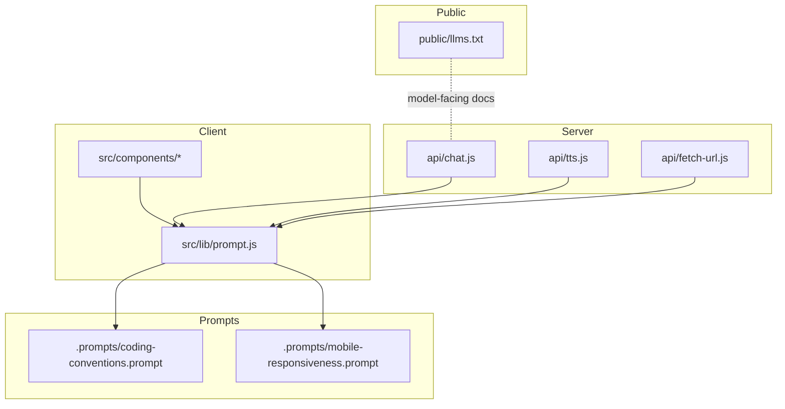
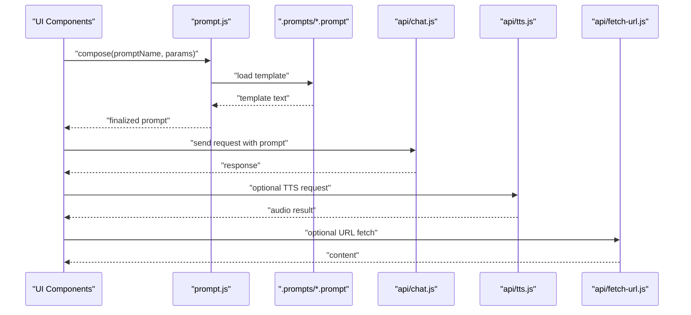
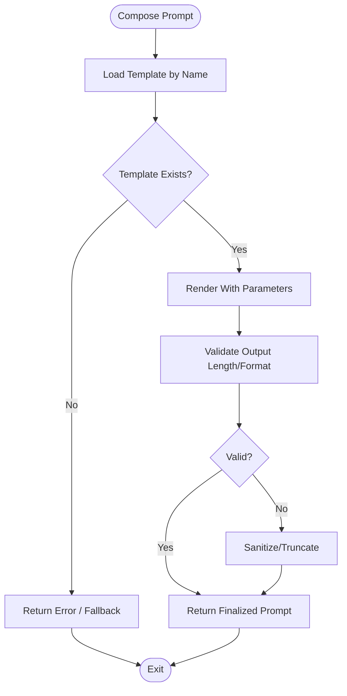
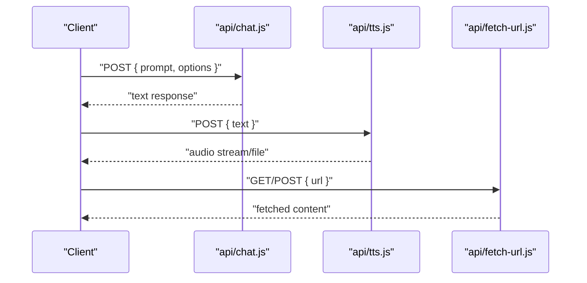
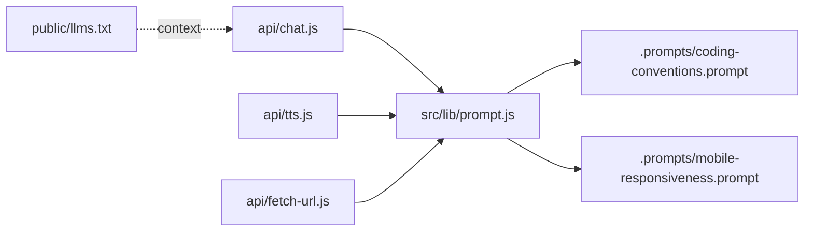

# AI Prompt Templates

<cite>
**Referenced Files in This Document**
- [prompt.js](file://src/lib/prompt.js)
- [coding-conventions.prompt](file://.prompts/coding-conventions.prompt)
- [mobile-responsiveness.prompt](file://.prompts/mobile-responsiveness.prompt)
- [chat.js](file://api/chat.js)
- [tts.js](file://api/tts.js)
- [fetch-url.js](file://api/fetch-url.js)
- [llms.txt](file://public/llms.txt)
</cite>

## Table of Contents
1. [Introduction](#introduction)
2. [Project Structure](#project-structure)
3. [Core Components](#core-components)
4. [Architecture Overview](#architecture-overview)
5. [Detailed Component Analysis](#detailed-component-analysis)
6. [Dependency Analysis](#dependency-analysis)
7. [Performance Considerations](#performance-considerations)
8. [Troubleshooting Guide](#troubleshooting-guide)
9. [Conclusion](#conclusion)

## Introduction
This document explains how AI prompt templates are organized and used across the project. It covers where prompts live, how they are composed and consumed by client and server components, and how to extend or customize them safely. The goal is to make prompt management clear for both developers and non-technical contributors.

## Project Structure
Prompt-related assets and logic are primarily located under:
- .prompts: reusable prompt template files
- src/lib/prompt.js: client-side prompt composition utilities
- api/chat.js: server-side chat integration that may use prompts
- public/llms.txt: model-facing documentation file (LLM-focused)

**Diagram sources**
- [prompt.js](file://src/lib/prompt.js)
- [coding-conventions.prompt](file://.prompts/coding-conventions.prompt)
- [mobile-responsiveness.prompt](file://.prompts/mobile-responsiveness.prompt)
- [chat.js](file://api/chat.js)
- [tts.js](file://api/tts.js)
- [fetch-url.js](file://api/fetch-url.js)
- [llms.txt](file://public/llms.txt)

**Section sources**
- [prompt.js](file://src/lib/prompt.js)
- [coding-conventions.prompt](file://.prompts/coding-conventions.prompt)
- [mobile-responsiveness.prompt](file://.prompts/mobile-responsiveness.prompt)
- [chat.js](file://api/chat.js)
- [tts.js](file://api/tts.js)
- [fetch-url.js](file://api/fetch-url.js)
- [llms.txt](file://public/llms.txt)

## Core Components
- Prompt library (client): centralizes prompt composition, templating, and parameterization.
- Prompt templates (.prompts): plain-text templates for consistent instruction sets.
- Server integrations (api/*): endpoints that consume prompts to generate responses or actions.
- Model-facing documentation (public/llms.txt): context provided to models via API calls.

Key responsibilities:
- Compose prompts from templates with dynamic inputs.
- Provide a stable interface for callers to request generated content.
- Keep prompt content decoupled from business logic.

**Section sources**
- [prompt.js](file://src/lib/prompt.js)
- [coding-conventions.prompt](file://.prompts/coding-conventions.prompt)
- [mobile-responsiveness.prompt](file://.prompts/mobile-responsiveness.prompt)
- [chat.js](file://api/chat.js)
- [tts.js](file://api/tts.js)
- [fetch-url.js](file://api/fetch-url.js)
- [llms.txt](file://public/llms.txt)

## Architecture Overview
The system separates prompt content from execution. Client code composes prompts using the prompt library and templates; server endpoints receive composed prompts and interact with external services as needed.

**Diagram sources**
- [prompt.js](file://src/lib/prompt.js)
- [coding-conventions.prompt](file://.prompts/coding-conventions.prompt)
- [mobile-responsiveness.prompt](file://.prompts/mobile-responsiveness.prompt)
- [chat.js](file://api/chat.js)
- [tts.js](file://api/tts.js)
- [fetch-url.js](file://api/fetch-url.js)

## Detailed Component Analysis

### Prompt Library (src/lib/prompt.js)
Responsibilities:
- Load and cache prompt templates.
- Render templates with parameters.
- Provide helpers for common prompt patterns.
- Expose a stable API for UI and server modules.

Design considerations:
- Centralize all prompt rendering to ensure consistency.
- Avoid hardcoding prompt strings in components.
- Support environment-specific overrides if needed.

**Diagram sources**
- [prompt.js](file://src/lib/prompt.js)

**Section sources**
- [prompt.js](file://src/lib/prompt.js)

### Prompt Templates (.prompts)
Purpose:
- Store reusable instructions for coding conventions, mobile responsiveness, and other domains.
- Keep prompt content editable without touching application code.

Best practices:
- Use placeholders for dynamic values.
- Keep templates concise and focused.
- Version or tag templates when changes impact behavior.

Examples of template files:
- Coding conventions
- Mobile responsiveness

**Section sources**
- [coding-conventions.prompt](file://.prompts/coding-conventions.prompt)
- [mobile-responsiveness.prompt](file://.prompts/mobile-responsiveness.prompt)

### Server Integrations (api/*)
These endpoints may accept composed prompts and orchestrate downstream tasks such as chat completions, text-to-speech, or URL fetching.

- api/chat.js: likely handles conversational flows using prompts.
- api/tts.js: converts text to speech; may be driven by prompt-generated text.
- api/fetch-url.js: retrieves content from URLs; can be triggered by prompt-driven workflows.

**Diagram sources**
- [chat.js](file://api/chat.js)
- [tts.js](file://api/tts.js)
- [fetch-url.js](file://api/fetch-url.js)

**Section sources**
- [chat.js](file://api/chat.js)
- [tts.js](file://api/tts.js)
- [fetch-url.js](file://api/fetch-url.js)

### Model-Facing Documentation (public/llms.txt)
A dedicated file providing structured context for language models. It can be included in API requests to improve response quality and alignment with project goals.

Usage:
- Reference this file when constructing system prompts for LLMs.
- Keep it updated alongside feature changes.

**Section sources**
- [llms.txt](file://public/llms.txt)

## Dependency Analysis
The following diagram shows how prompt templates and libraries depend on each other and how server endpoints integrate with them.

**Diagram sources**
- [prompt.js](file://src/lib/prompt.js)
- [coding-conventions.prompt](file://.prompts/coding-conventions.prompt)
- [mobile-responsiveness.prompt](file://.prompts/mobile-responsiveness.prompt)
- [chat.js](file://api/chat.js)
- [tts.js](file://api/tts.js)
- [fetch-url.js](file://api/fetch-url.js)
- [llms.txt](file://public/llms.txt)

**Section sources**
- [prompt.js](file://src/lib/prompt.js)
- [coding-conventions.prompt](file://.prompts/coding-conventions.prompt)
- [mobile-responsiveness.prompt](file://.prompts/mobile-responsiveness.prompt)
- [chat.js](file://api/chat.js)
- [tts.js](file://api/tts.js)
- [fetch-url.js](file://api/fetch-url.js)
- [llms.txt](file://public/llms.txt)

## Performance Considerations
- Cache loaded templates to avoid repeated I/O.
- Pre-render static portions of prompts at build time when possible.
- Limit prompt length to reduce token usage and latency.
- Batch operations on the server side to minimize round trips.
- Use streaming responses for long-running generations where supported.

## Troubleshooting Guide
Common issues and resolutions:
- Missing template: Ensure the requested template name exists and is accessible.
- Parameter mismatch: Verify all required placeholders are provided during render.
- Oversized prompts: Truncate or split large inputs before sending to APIs.
- API failures: Implement retries with backoff and return meaningful errors.
- Inconsistent outputs: Pin versions of external services and validate schema of responses.

Operational checks:
- Confirm llms.txt is up to date and referenced correctly.
- Validate that server endpoints sanitize and log prompt payloads appropriately.
- Monitor token usage and response times to detect regressions.

**Section sources**
- [prompt.js](file://src/lib/prompt.js)
- [chat.js](file://api/chat.js)
- [tts.js](file://api/tts.js)
- [fetch-url.js](file://api/fetch-url.js)
- [llms.txt](file://public/llms.txt)

## Conclusion
By centralizing prompt composition in a dedicated library and keeping templates separate from code, the project achieves clarity, reusability, and maintainability. Extending prompts involves adding new templates and wiring them through the prompt library, while server endpoints remain agnostic of prompt details. Keeping model-facing documentation current ensures consistent behavior across integrations.