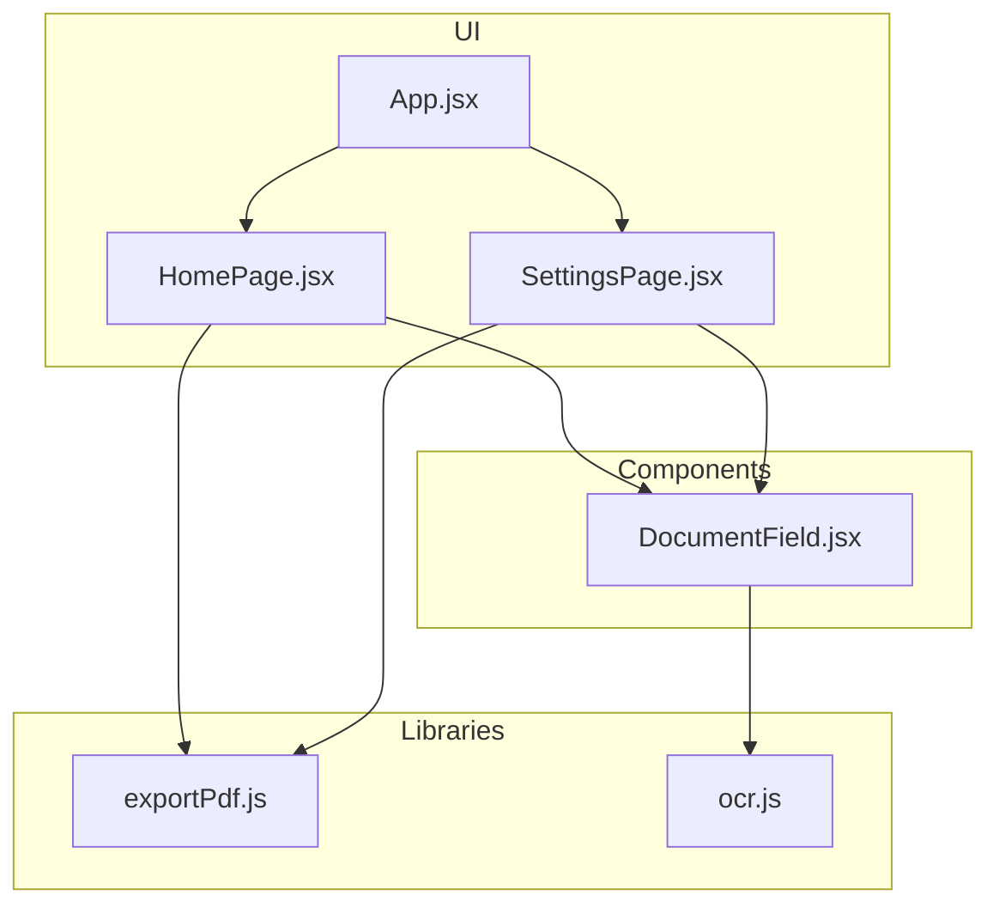
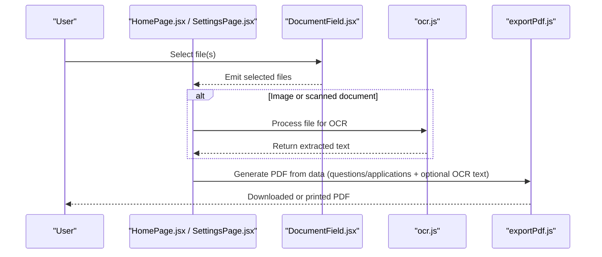
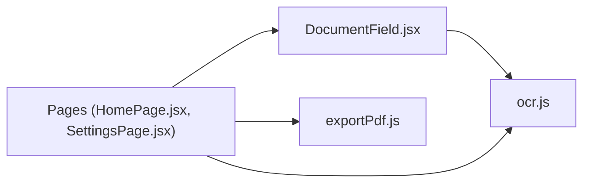

# Document Processing

<cite>
**Referenced Files in This Document**
- [DocumentField.jsx](file://src/components/DocumentField.jsx)
- [exportPdf.js](file://src/lib/exportPdf.js)
- [ocr.js](file://src/lib/ocr.js)
- [App.jsx](file://src/App.jsx)
- [HomePage.jsx](file://src/pages/HomePage.jsx)
- [SettingsPage.jsx](file://src/pages/SettingsPage.jsx)
</cite>

## Table of Contents
1. [Introduction](#introduction)
2. [Project Structure](#project-structure)
3. [Core Components](#core-components)
4. [Architecture Overview](#architecture-overview)
5. [Detailed Component Analysis](#detailed-component-analysis)
6. [Dependency Analysis](#dependency-analysis)
7. [Performance Considerations](#performance-considerations)
8. [Troubleshooting Guide](#troubleshooting-guide)
9. [Conclusion](#conclusion)
10. [Appendices](#appendices)

## Introduction
This document explains the Document Processing capabilities, focusing on:
- Exporting interview questions and job application data to PDF
- Processing uploaded documents through OCR
- Using the DocumentField component for file input
It also covers supported formats, export templates, OCR accuracy considerations, performance optimization for large documents, and examples for customizing layouts and handling various document types.

## Project Structure
The relevant code for document processing is organized under src/components and src/lib:
- DocumentField.jsx provides a user-facing file input with validation and preview hooks
- exportPdf.js implements PDF generation from structured data (e.g., interview questions and job applications)
- ocr.js integrates OCR to extract text from images or scanned documents
- App.jsx and page components integrate these features into the application flow

**Diagram sources**
- [App.jsx](file://src/App.jsx)
- [HomePage.jsx](file://src/pages/HomePage.jsx)
- [SettingsPage.jsx](file://src/pages/SettingsPage.jsx)
- [DocumentField.jsx](file://src/components/DocumentField.jsx)
- [exportPdf.js](file://src/lib/exportPdf.js)
- [ocr.js](file://src/lib/ocr.js)

**Section sources**
- [App.jsx](file://src/App.jsx)
- [HomePage.jsx](file://src/pages/HomePage.jsx)
- [SettingsPage.jsx](file://src/pages/SettingsPage.jsx)
- [DocumentField.jsx](file://src/components/DocumentField.jsx)
- [exportPdf.js](file://src/lib/exportPdf.js)
- [ocr.js](file://src/lib/ocr.js)

## Core Components
- DocumentField.jsx
  - Purpose: Accepts files from users, validates types/sizes, and exposes selected files to parent components
  - Typical usage: Upload resumes, cover letters, or scanned forms; trigger OCR or attach to exports
- exportPdf.js
  - Purpose: Generates PDFs from structured data such as interview question sets and job application summaries
  - Typical usage: Build a template layout, render content, and download or print the resulting PDF
- ocr.js
  - Purpose: Performs OCR on image-based inputs to extract machine-readable text
  - Typical usage: Process uploaded images/scanned documents, return extracted text for downstream use

How they work together:
- Users upload files via DocumentField.jsx
- For image-based uploads, ocr.js extracts text
- The extracted text can be included in exported PDFs using exportPdf.js

**Section sources**
- [DocumentField.jsx](file://src/components/DocumentField.jsx)
- [exportPdf.js](file://src/lib/exportPdf.js)
- [ocr.js](file://src/lib/ocr.js)

## Architecture Overview
The document processing pipeline connects UI interactions with library functions to produce PDFs and OCR results.

**Diagram sources**
- [HomePage.jsx](file://src/pages/HomePage.jsx)
- [SettingsPage.jsx](file://src/pages/SettingsPage.jsx)
- [DocumentField.jsx](file://src/components/DocumentField.jsx)
- [ocr.js](file://src/lib/ocr.js)
- [exportPdf.js](file://src/lib/exportPdf.js)

## Detailed Component Analysis

### DocumentField.jsx
Responsibilities:
- File selection and validation (type and size constraints)
- Preview and error messaging
- Event emission to parent components for further processing

Common integration points:
- Parent components receive selected files and decide whether to run OCR or include attachments in exports
- Supports multiple file selections when needed

Usage example pattern:
- Render DocumentField in a form
- On change, pass files to OCR if images are detected
- Store references for later inclusion in PDF exports

**Section sources**
- [DocumentField.jsx](file://src/components/DocumentField.jsx)

### exportPdf.js
Responsibilities:
- Convert structured data into a printable PDF
- Provide template configuration for headers, sections, and footers
- Support exporting interview questions and job application data

Template customization:
- Define sections for each data type (e.g., “Interview Questions”, “Application Summary”)
- Control page breaks, margins, and typography via template options
- Include embedded images or tables where appropriate

Export workflow:
- Gather data from state or API responses
- Map data to template fields
- Render and trigger download/print

**Section sources**
- [exportPdf.js](file://src/lib/exportPdf.js)

### ocr.js
Responsibilities:
- Extract text from image-based inputs (scanned documents, photos)
- Normalize output for consistent downstream processing

Accuracy considerations:
- Input quality affects recognition accuracy (resolution, lighting, skew)
- Preprocessing steps (e.g., rotation correction, contrast enhancement) can improve results
- Language support depends on underlying OCR engine capabilities

Integration patterns:
- Accept file objects or base64 strings
- Return normalized text blocks or paragraphs
- Handle errors gracefully and provide fallbacks

**Section sources**
- [ocr.js](file://src/lib/ocr.js)

### Integration in Pages
- HomePage.jsx and SettingsPage.jsx orchestrate user flows:
  - Present DocumentField for uploads
  - Trigger OCR when applicable
  - Offer “Export to PDF” actions that consume exportPdf.js

**Section sources**
- [HomePage.jsx](file://src/pages/HomePage.jsx)
- [SettingsPage.jsx](file://src/pages/SettingsPage.jsx)

## Dependency Analysis
High-level dependencies among document processing modules:

**Diagram sources**
- [HomePage.jsx](file://src/pages/HomePage.jsx)
- [SettingsPage.jsx](file://src/pages/SettingsPage.jsx)
- [DocumentField.jsx](file://src/components/DocumentField.jsx)
- [ocr.js](file://src/lib/ocr.js)
- [exportPdf.js](file://src/lib/exportPdf.js)

**Section sources**
- [HomePage.jsx](file://src/pages/HomePage.jsx)
- [SettingsPage.jsx](file://src/pages/SettingsPage.jsx)
- [DocumentField.jsx](file://src/components/DocumentField.jsx)
- [ocr.js](file://src/lib/ocr.js)
- [exportPdf.js](file://src/lib/exportPdf.js)

## Performance Considerations
- Large document processing
  - Avoid blocking the main thread by chunking or deferring heavy operations
  - Use progressive previews and lazy loading for large images
- OCR efficiency
  - Limit resolution to what is necessary for accurate recognition
  - Batch process multiple images when possible
- PDF generation
  - Keep templates minimal to reduce rendering time
  - Stream or paginate long documents to avoid memory spikes
- Memory management
  - Release references to large buffers after processing
  - Reuse instances of OCR engines or PDF generators when available

[No sources needed since this section provides general guidance]

## Troubleshooting Guide
Common issues and resolutions:
- File upload failures
  - Validate MIME types and sizes before processing
  - Provide clear error messages and retry options
- OCR inaccuracies
  - Encourage high-resolution scans and proper orientation
  - Apply preprocessing (deskew, thresholding) when feasible
- PDF export problems
  - Ensure all required fields are present in the template
  - Test with edge-case data (very long answers, special characters)

**Section sources**
- [DocumentField.jsx](file://src/components/DocumentField.jsx)
- [ocr.js](file://src/lib/ocr.js)
- [exportPdf.js](file://src/lib/exportPdf.js)

## Conclusion
The Document Processing feature set combines a robust file input component, an OCR pipeline for extracting text from images, and a flexible PDF exporter for producing professional documents. By following the integration patterns and performance recommendations outlined here, you can customize layouts, handle diverse document types, and deliver reliable exports for interviews and job applications.

[No sources needed since this section summarizes without analyzing specific files]

## Appendices

### Supported File Formats
- Images for OCR: JPEG, PNG, WebP, BMP
- Documents for attachment or conversion: PDF, DOCX (if supported by upstream libraries)
- Note: Actual supported formats depend on browser capabilities and underlying libraries used by ocr.js and exportPdf.js

[No sources needed since this section provides general guidance]

### Export Templates and Customization Examples
- Interview Questions Template
  - Sections: Role, Level, Topics, Question List, Notes
  - Options: Page header/footer, table of contents, collapsible sections
- Job Application Template
  - Sections: Candidate Info, Experience, Skills, Attachments, Summary
  - Options: Branding colors, logo placement, multi-page pagination

[No sources needed since this section provides general guidance]

### Handling Various Document Types
- Scanned PDFs
  - Run OCR per page or per image extraction
  - Merge recognized text into the export template
- Multi-page Forms
  - Paginate content to fit page boundaries
  - Preserve field labels and values for readability
- Mixed Content
  - Combine OCR-extracted text with structured data (e.g., JSON) for richer exports

[No sources needed since this section provides general guidance]