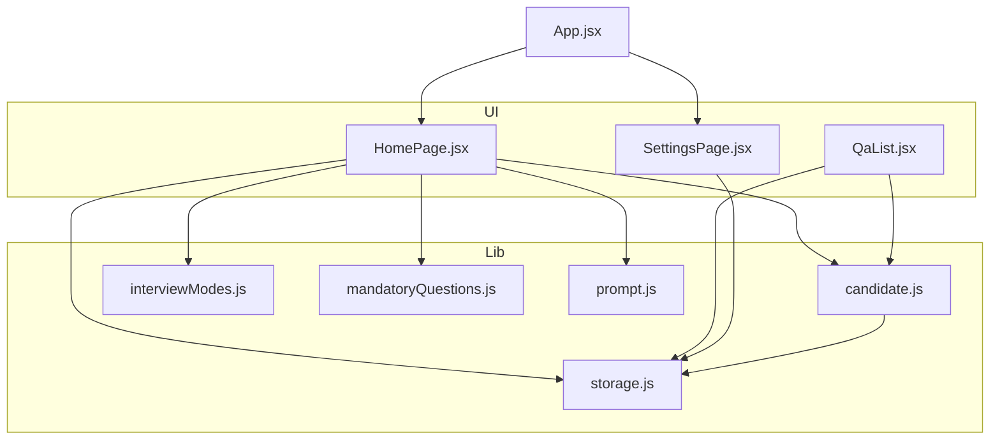
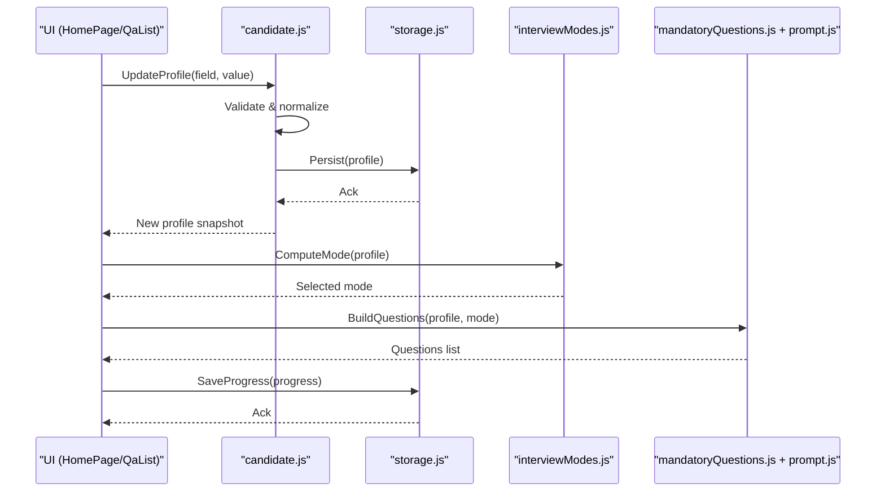
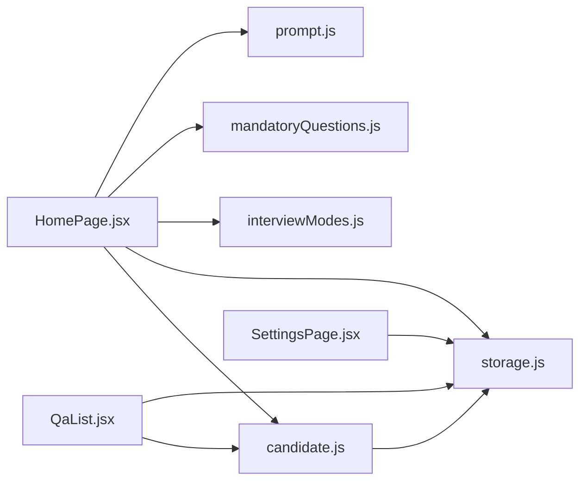

# Candidate Profile Integration

<cite>
**Referenced Files in This Document**
- [candidate.js](file://src/lib/candidate.js)
- [storage.js](file://src/lib/storage.js)
- [interviewModes.js](file://src/lib/interviewModes.js)
- [mandatoryQuestions.js](file://src/lib/mandatoryQuestions.js)
- [prompt.js](file://src/lib/prompt.js)
- [QaList.jsx](file://src/components/QaList.jsx)
- [HomePage.jsx](file://src/pages/HomePage.jsx)
- [SettingsPage.jsx](file://src/pages/SettingsPage.jsx)
- [App.jsx](file://src/App.jsx)
- [main.jsx](file://src/main.jsx)
</cite>

## Table of Contents
1. [Introduction](#introduction)
2. [Project Structure](#project-structure)
3. [Core Components](#core-components)
4. [Architecture Overview](#architecture-overview)
5. [Detailed Component Analysis](#detailed-component-analysis)
6. [Dependency Analysis](#dependency-analysis)
7. [Performance Considerations](#performance-considerations)
8. [Troubleshooting Guide](#troubleshooting-guide)
9. [Conclusion](#conclusion)
10. [Appendices](#appendices)

## Introduction
This document explains how candidate profiles are integrated across the application, focusing on data structures, storage, validation, synchronization with UI, and downstream effects on question generation, interview mode selection, and progress tracking. It also covers import/export patterns and migration strategies for evolving profile schemas.

## Project Structure
Candidate-related logic is primarily implemented under src/lib and consumed by UI components and pages:
- Data model and operations: src/lib/candidate.js
- Persistence layer: src/lib/storage.js
- Interview mode configuration: src/lib/interviewModes.js
- Mandatory questions and prompt composition: src/lib/mandatoryQuestions.js, src/lib/prompt.js
- UI consumption: src/components/QaList.jsx, src/pages/HomePage.jsx, src/pages/SettingsPage.jsx
- App bootstrap and routing: src/App.jsx, src/main.jsx

**Diagram sources**
- [candidate.js](file://src/lib/candidate.js)
- [storage.js](file://src/lib/storage.js)
- [interviewModes.js](file://src/lib/interviewModes.js)
- [mandatoryQuestions.js](file://src/lib/mandatoryQuestions.js)
- [prompt.js](file://src/lib/prompt.js)
- [HomePage.jsx](file://src/pages/HomePage.jsx)
- [QaList.jsx](file://src/components/QaList.jsx)
- [SettingsPage.jsx](file://src/pages/SettingsPage.jsx)
- [App.jsx](file://src/App.jsx)

**Section sources**
- [candidate.js](file://src/lib/candidate.js)
- [storage.js](file://src/lib/storage.js)
- [interviewModes.js](file://src/lib/interviewModes.js)
- [mandatoryQuestions.js](file://src/lib/mandatoryQuestions.js)
- [prompt.js](file://src/lib/prompt.js)
- [HomePage.jsx](file://src/pages/HomePage.jsx)
- [QaList.jsx](file://src/components/QaList.jsx)
- [SettingsPage.jsx](file://src/pages/SettingsPage.jsx)
- [App.jsx](file://src/App.jsx)

## Core Components
- Candidate model and helpers: defines fields, experience tracking, skill assessment, status transitions, and utility functions to compute derived state (e.g., readiness).
- Storage adapter: persists candidate data to local storage, handles versioning and migrations, and exposes typed getters/setters.
- Interview modes: maps candidate attributes to appropriate interview configurations.
- Question pipeline: composes mandatory and adaptive questions based on candidate profile and current state.
- UI integration: pages and components read/write candidate state and reflect changes immediately.

Key responsibilities:
- Data model definition and validation
- Local storage persistence and migration
- Deriving interview mode from profile
- Generating question sets influenced by skills and experience
- Tracking application status and progress

**Section sources**
- [candidate.js](file://src/lib/candidate.js)
- [storage.js](file://src/lib/storage.js)
- [interviewModes.js](file://src/lib/interviewModes.js)
- [mandatoryQuestions.js](file://src/lib/mandatoryQuestions.js)
- [prompt.js](file://src/lib/prompt.js)

## Architecture Overview
The system follows a unidirectional data flow:
- UI triggers actions that update the candidate store via candidate helpers.
- Helpers validate inputs and persist changes through the storage layer.
- Derived values (interview mode, question set, progress) are computed from the latest profile.
- UI re-renders with updated state.

**Diagram sources**
- [candidate.js](file://src/lib/candidate.js)
- [storage.js](file://src/lib/storage.js)
- [interviewModes.js](file://src/lib/interviewModes.js)
- [mandatoryQuestions.js](file://src/lib/mandatoryQuestions.js)
- [prompt.js](file://src/lib/prompt.js)
- [HomePage.jsx](file://src/pages/HomePage.jsx)
- [QaList.jsx](file://src/components/QaList.jsx)

## Detailed Component Analysis

### Candidate Model and Operations
Responsibilities:
- Define core profile fields such as personal details, experience entries, skills, and application status.
- Provide helper methods to compute derived metrics like readiness or completion percentage.
- Normalize and validate inputs before persistence.
- Support importing raw data into the canonical model and exporting to a portable format.

Data structure highlights:
- Profile fields: identity, contact, summary, goals, availability.
- Experience tracking: array of roles with company, title, duration, achievements, technologies.
- Skill assessment: categorized skills with proficiency levels and evidence references.
- Application status: lifecycle states (draft, ready, interviewing, completed), timestamps, and notes.

Validation rules:
- Required fields enforced at save time.
- Date ranges validated for consistency.
- Skill proficiencies constrained to allowed enumerations.
- Duplicate entries de-duplicated by normalized keys.

Derived computations:
- Readiness score based on completeness of required sections and minimum skill thresholds.
- Progress indicators per section (profile, experience, skills, goals).

Import/Export:
- Importer normalizes legacy formats and maps fields to the current schema.
- Exporter serializes the canonical model for sharing or backup.

Migration patterns:
- Versioned schema stored alongside persisted data.
- On load, storage applies incremental migrations until the latest version is reached.
- Rollback-safe: migrations are idempotent and preserve unknown fields.

**Section sources**
- [candidate.js](file://src/lib/candidate.js)

### Storage Layer
Responsibilities:
- Provide typed get/set operations for candidate data.
- Handle JSON serialization/deserialization.
- Manage versioning and apply migrations on load.
- Expose atomic transactions for multi-field updates.

Persistence strategy:
- Single source-of-truth key for candidate profile.
- Separate keys for settings and progress if needed.
- Error handling for corrupted payloads with safe fallbacks.

Synchronization:
- Emits change events or returns promises so UI can react consistently.
- Debounced writes for frequent updates; batched commits for performance.

**Section sources**
- [storage.js](file://src/lib/storage.js)

### Interview Mode Selection
Responsibilities:
- Map candidate attributes (experience level, target role, skill gaps) to an interview mode.
- Provide deterministic selection with clear precedence rules.
- Allow overrides via explicit user selection.

Selection logic:
- If candidate explicitly selects a mode, use it.
- Else, infer from experience and skills using configured thresholds.
- Fallback to a default mode when insufficient data exists.

**Section sources**
- [interviewModes.js](file://src/lib/interviewModes.js)

### Question Generation Pipeline
Responsibilities:
- Compose mandatory questions defined centrally.
- Adapt questions based on candidate profile (skills, experience, goals).
- Integrate prompts to tailor difficulty and focus areas.

Flow:
- Start with mandatory set.
- Filter/add items based on profile signals.
- Order by relevance and difficulty progression.
- Cache generated sets keyed by profile hash to avoid recomputation.

**Section sources**
- [mandatoryQuestions.js](file://src/lib/mandatoryQuestions.js)
- [prompt.js](file://src/lib/prompt.js)

### UI Integration and State Sync
Responsibilities:
- HomePage orchestrates candidate editing, mode selection, and question preview.
- QaList renders and tracks answers, updating progress.
- SettingsPage manages global preferences affecting candidate behavior.

Sync pattern:
- UI reads from candidate store and subscribes to changes.
- User edits trigger validation and persistence.
- Derived views (mode, questions, progress) update automatically.

**Section sources**
- [HomePage.jsx](file://src/pages/HomePage.jsx)
- [QaList.jsx](file://src/components/QaList.jsx)
- [SettingsPage.jsx](file://src/pages/SettingsPage.jsx)
- [App.jsx](file://src/App.jsx)
- [main.jsx](file://src/main.jsx)

## Dependency Analysis
High-level dependencies among modules:

**Diagram sources**
- [candidate.js](file://src/lib/candidate.js)
- [storage.js](file://src/lib/storage.js)
- [interviewModes.js](file://src/lib/interviewModes.js)
- [mandatoryQuestions.js](file://src/lib/mandatoryQuestions.js)
- [prompt.js](file://src/lib/prompt.js)
- [HomePage.jsx](file://src/pages/HomePage.jsx)
- [QaList.jsx](file://src/components/QaList.jsx)
- [SettingsPage.jsx](file://src/pages/SettingsPage.jsx)

**Section sources**
- [candidate.js](file://src/lib/candidate.js)
- [storage.js](file://src/lib/storage.js)
- [interviewModes.js](file://src/lib/interviewModes.js)
- [mandatoryQuestions.js](file://src/lib/mandatoryQuestions.js)
- [prompt.js](file://src/lib/prompt.js)
- [HomePage.jsx](file://src/pages/HomePage.jsx)
- [QaList.jsx](file://src/components/QaList.jsx)
- [SettingsPage.jsx](file://src/pages/SettingsPage.jsx)

## Performance Considerations
- Memoize derived computations (readiness, mode, question sets) keyed by profile snapshots.
- Batch multiple field updates into a single persistence call.
- Avoid heavy recomputation during rapid typing; debounce input handlers.
- Use stable identifiers for experience/skill entries to minimize diffing overhead in UI.

[No sources needed since this section provides general guidance]

## Troubleshooting Guide
Common issues and resolutions:
- Corrupted local storage payload: storage should detect invalid JSON and reset to a safe default while preserving known-good segments.
- Migration failures: ensure migrations are idempotent; log version transitions and allow manual reset if necessary.
- Validation errors: surface field-specific messages and prevent persistence until resolved.
- Stale UI state: verify that UI subscribes to storage changes and re-renders after successful saves.

**Section sources**
- [storage.js](file://src/lib/storage.js)
- [candidate.js](file://src/lib/candidate.js)

## Conclusion
Candidate Profile Integration centers on a robust, versioned data model persisted locally, with clear validation and migration paths. The model drives interview mode selection and question generation, ensuring personalized experiences. UI components stay synchronized through a unidirectional flow, improving predictability and maintainability.

[No sources needed since this section summarizes without analyzing specific files]

## Appendices

### Example Candidate Data Models
- Canonical profile object containing identity, experience array, skills map, and application status.
- Import payload mapping legacy fields to canonical schema.
- Export payload suitable for sharing or archival.

[No sources needed since this section describes conceptual models]

### Data Migration Patterns
- Schema version stored with persisted data.
- Incremental migration functions applied on load until latest version.
- Safe defaults for missing fields and preservation of unknown properties.

[No sources needed since this section describes conceptual patterns]