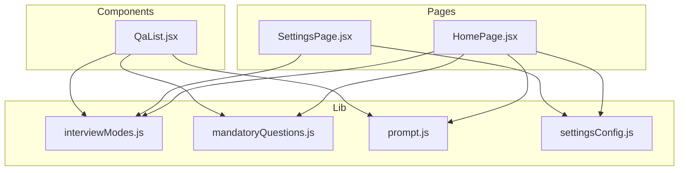
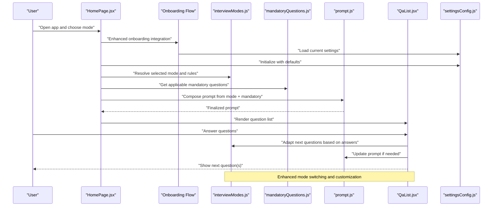
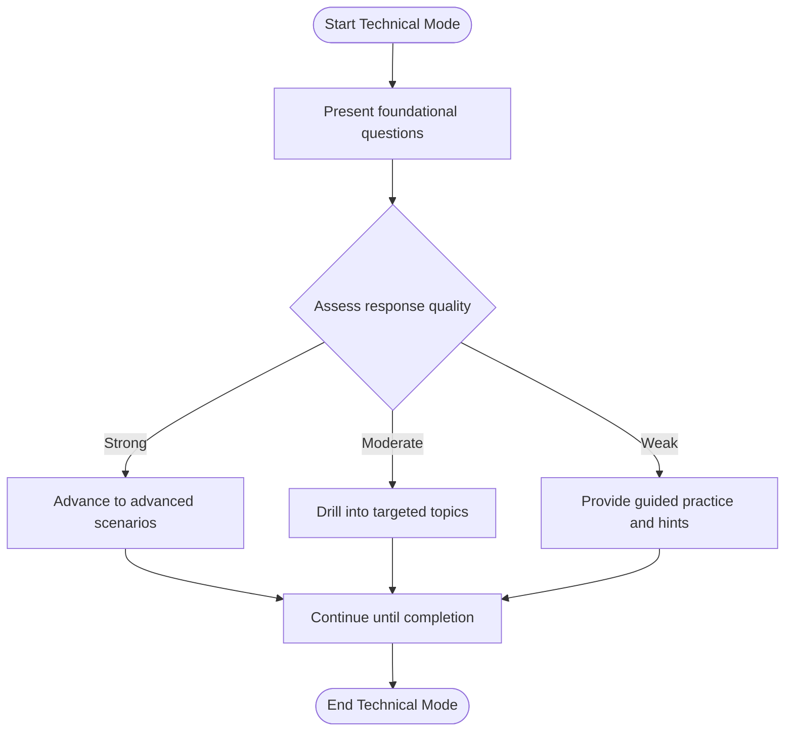
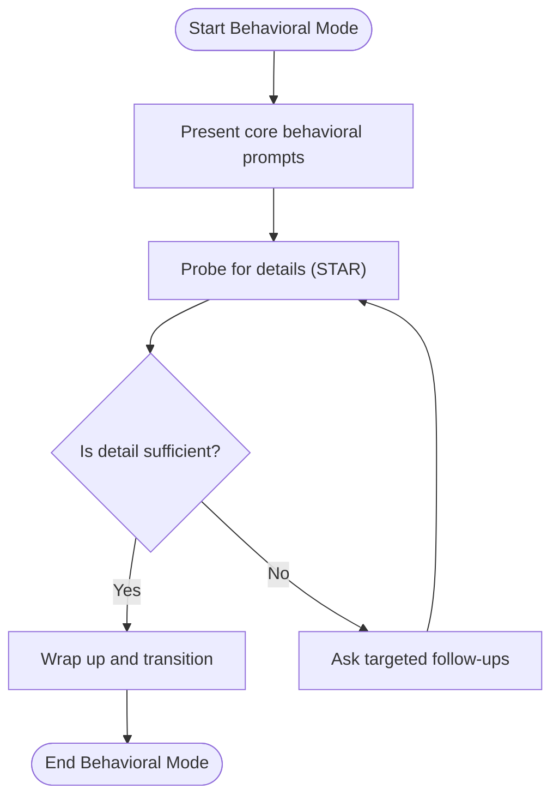
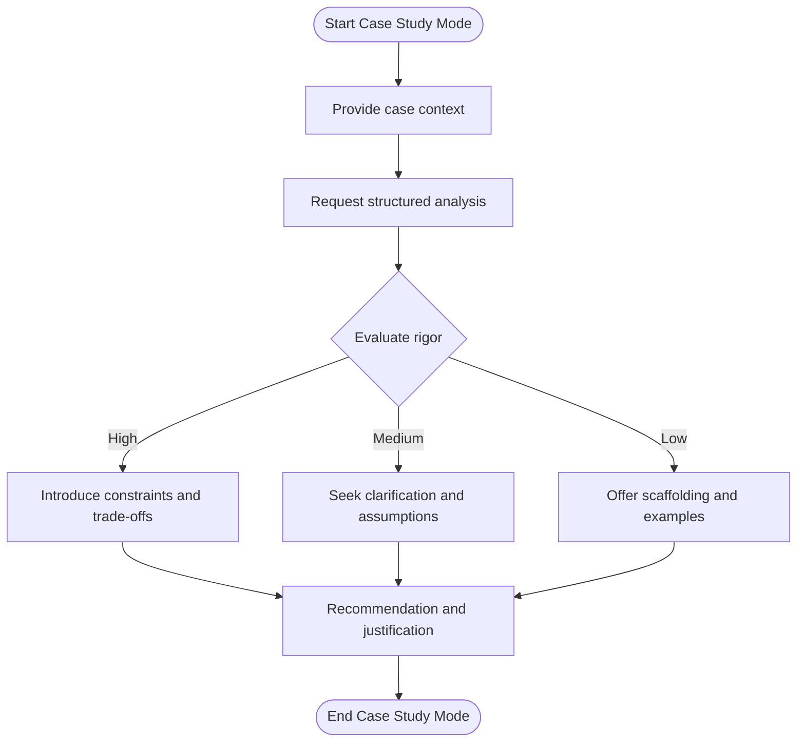
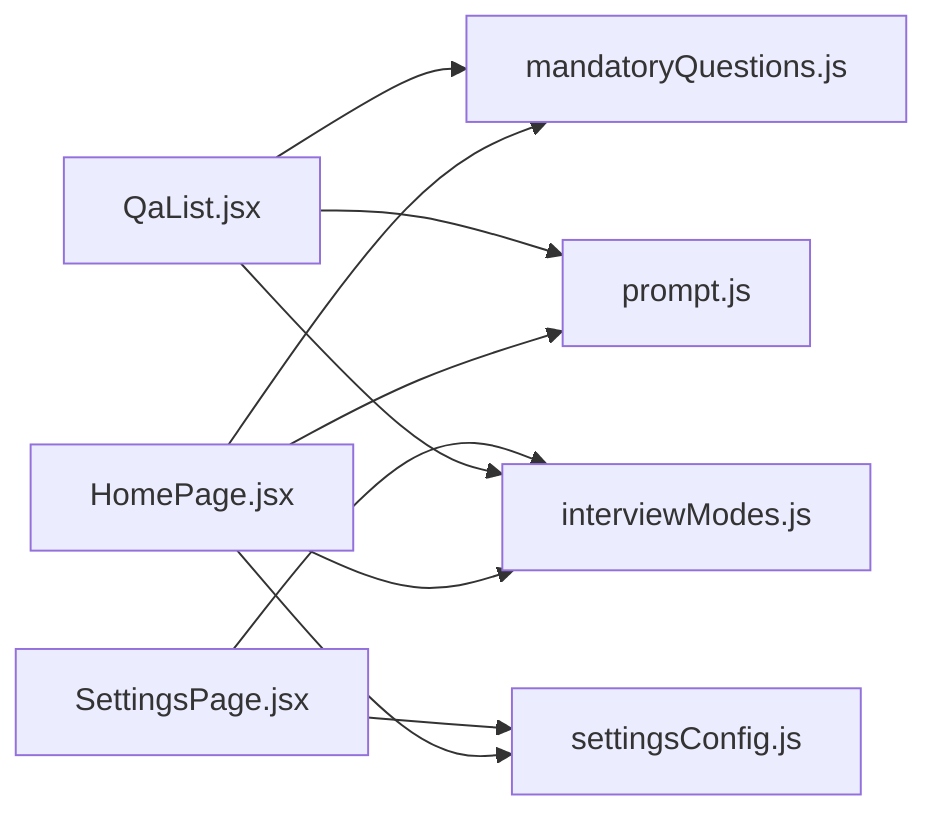

# Interview Modes Configuration

<cite>
**Referenced Files in This Document**
- [interviewModes.js](file://src/lib/interviewModes.js)
- [mandatoryQuestions.js](file://src/lib/mandatoryQuestions.js)
- [prompt.js](file://src/lib/prompt.js)
- [settingsConfig.js](file://src/lib/settingsConfig.js)
- [QaList.jsx](file://src/components/QaList.jsx)
- [HomePage.jsx](file://src/pages/HomePage.jsx)
- [SettingsPage.jsx](file://src/pages/SettingsPage.jsx)
</cite>

## Update Summary
**Changes Made**
- Enhanced interview modes system with new interview configurations and improved mode switching logic
- Added enhanced customization options for question sequences and adaptive behavior
- Improved integration with the onboarding flow for better user experience
- Updated configuration examples and mode-specific algorithms to reflect new capabilities

## Table of Contents
1. [Introduction](#introduction)
2. [Project Structure](#project-structure)
3. [Core Components](#core-components)
4. [Architecture Overview](#architecture-overview)
5. [Detailed Component Analysis](#detailed-component-analysis)
6. [Dependency Analysis](#dependency-analysis)
7. [Performance Considerations](#performance-considerations)
8. [Troubleshooting Guide](#troubleshooting-guide)
9. [Conclusion](#conclusion)
10. [Appendices](#appendices)

## Introduction
This document explains how interview modes are configured and used within the application. It covers available modes (technical, behavioral, case study), their characteristics, when to use each mode, integration of mandatory questions, customization of question sequences, adaptive questioning based on user responses, configuration examples, mode-specific algorithms, and guidance for extending the system with new interview modes. The system has been enhanced with improved mode switching logic, better customization options, and seamless integration with the onboarding flow.

## Project Structure
The interview mode feature is implemented primarily under src/lib and integrated into UI components and pages:
- Mode definitions and selection logic: src/lib/interviewModes.js
- Mandatory questions registry and resolution: src/lib/mandatoryQuestions.js
- Prompt composition and rendering helpers: src/lib/prompt.js
- Settings persistence and defaults: src/lib/settingsConfig.js
- Question list rendering and interaction: src/components/QaList.jsx
- Home flow orchestration: src/pages/HomePage.jsx
- Settings UI for configuring modes and options: src/pages/SettingsPage.jsx

**Diagram sources**
- [interviewModes.js](file://src/lib/interviewModes.js)
- [mandatoryQuestions.js](file://src/lib/mandatoryQuestions.js)
- [prompt.js](file://src/lib/prompt.js)
- [settingsConfig.js](file://src/lib/settingsConfig.js)
- [QaList.jsx](file://src/components/QaList.jsx)
- [HomePage.jsx](file://src/pages/HomePage.jsx)
- [SettingsPage.jsx](file://src/pages/SettingsPage.jsx)

**Section sources**
- [interviewModes.js](file://src/lib/interviewModes.js)
- [mandatoryQuestions.js](file://src/lib/mandatoryQuestions.js)
- [prompt.js](file://src/lib/prompt.js)
- [settingsConfig.js](file://src/lib/settingsConfig.js)
- [QaList.jsx](file://src/components/QaList.jsx)
- [HomePage.jsx](file://src/pages/HomePage.jsx)
- [SettingsPage.jsx](file://src/pages/SettingsPage.jsx)

## Core Components
- Interview modes registry: Defines available modes, their metadata, default behaviors, and algorithmic rules for sequencing and adaptation.
- Mandatory questions engine: Provides a registry of required questions and resolves which ones apply per mode or scenario.
- Prompt composer: Builds final prompts by combining mode-specific instructions, mandatory questions, and context.
- Settings configuration: Persists user preferences for selected mode(s), sequence customization, and adaptive behavior toggles.
- UI integration: Renders question lists, collects answers, and drives adaptive flows based on responses.

Key responsibilities:
- Mode selection and validation with enhanced switching logic
- Mandatory question inclusion and deduplication
- Sequence customization and ordering with improved flexibility
- Adaptive branching based on prior answers with better personalization
- Persisting and restoring settings with enhanced synchronization

**Section sources**
- [interviewModes.js](file://src/lib/interviewModes.js)
- [mandatoryQuestions.js](file://src/lib/mandatoryQuestions.js)
- [prompt.js](file://src/lib/prompt.js)
- [settingsConfig.js](file://src/lib/settingsConfig.js)
- [QaList.jsx](file://src/components/QaList.jsx)
- [HomePage.jsx](file://src/pages/HomePage.jsx)
- [SettingsPage.jsx](file://src/pages/SettingsPage.jsx)

## Architecture Overview
The interview flow begins at the home page where users select an interview mode. The system composes a prompt using mode rules and mandatory questions, then renders a question list. As users answer, adaptive logic may adjust subsequent questions. Settings allow customization of sequences and behavior. The enhanced system provides smoother transitions between modes and better integration with the onboarding process.

**Diagram sources**
- [HomePage.jsx](file://src/pages/HomePage.jsx)
- [interviewModes.js](file://src/lib/interviewModes.js)
- [mandatoryQuestions.js](file://src/lib/mandatoryQuestions.js)
- [prompt.js](file://src/lib/prompt.js)
- [QaList.jsx](file://src/components/QaList.jsx)
- [settingsConfig.js](file://src/lib/settingsConfig.js)

## Detailed Component Analysis

### Interview Modes Registry
Purpose:
- Define available modes (e.g., technical, behavioral, case study).
- Specify characteristics such as focus areas, difficulty progression, and expected duration.
- Provide default question sets or generation rules per mode.
- Include flags for enabling mandatory questions and adaptive branching.

Characteristics and usage:
- Technical: Emphasizes domain knowledge, problem-solving, and coding-related scenarios. Use when evaluating hard skills and depth of expertise.
- Behavioral: Focuses on past experiences, teamwork, communication, and leadership. Use when assessing soft skills and cultural fit.
- Case Study: Presents realistic business problems requiring structured analysis and recommendations. Use for strategic thinking and decision-making evaluation.

Configuration points:
- Mode identifiers and labels with enhanced metadata
- Default sequence templates with improved flexibility
- Adaptive rules (e.g., branch on proficiency level) with better personalization
- Mandatory question inclusion policy with refined control

Extensibility:
- Add a new mode by registering it in the registry with its metadata and rules.
- Implement any custom adaptive logic hooks referenced by the mode.
- Ensure mandatory question mapping supports the new mode.
- Leverage enhanced customization options for advanced scenarios.

**Updated** Enhanced with improved mode switching logic and better configuration options for seamless transitions between different interview types.

**Section sources**
- [interviewModes.js](file://src/lib/interviewModes.js)

### Mandatory Questions Integration
Purpose:
- Maintain a registry of required questions that must appear in specific modes or scenarios.
- Resolve which mandatory questions apply based on mode, role, or other criteria.
- Prevent duplication and ensure coverage across interviews.

Integration patterns:
- Per-mode inclusion: Certain modes require specific compliance or screening questions.
- Cross-cutting requirements: Some questions apply regardless of mode (e.g., safety or legal disclosures).
- Conditional inclusion: Mandatory questions can be gated by user profile attributes or previous answers.

Customization:
- Override defaults via settings to include/exclude certain mandatory items.
- Reorder mandatory questions relative to mode-generated content.
- Enhanced filtering and prioritization based on user context.

**Updated** Improved integration with better conditional logic and enhanced filtering capabilities for more precise question management.

**Section sources**
- [mandatoryQuestions.js](file://src/lib/mandatoryQuestions.js)

### Prompt Composition
Purpose:
- Combine mode instructions, mandatory questions, and contextual information into a single prompt for the interview session.
- Apply formatting and structure suitable for the downstream AI or processing pipeline.

Algorithm highlights:
- Merge mode-specific instructions with mandatory question blocks.
- Insert placeholders for dynamic content (e.g., candidate background).
- Validate completeness before rendering.
- Enhanced context awareness for better personalization.

**Updated** Improved prompt composition with better context handling and enhanced personalization capabilities.

**Section sources**
- [prompt.js](file://src/lib/prompt.js)

### Settings and Persistence
Purpose:
- Store user preferences for selected mode(s), sequence customization, and adaptive behavior toggles.
- Provide defaults and validate inputs.

Key options:
- Selected mode identifier with enhanced validation
- Custom sequence overrides with improved flexibility
- Adaptive branching enabled/disabled with granular control
- Mandatory question policies with refined configuration
- Enhanced synchronization with onboarding flow

Persistence:
- Save/load settings locally or via storage utilities.
- Sync settings with UI controls with improved reliability.
- Better error handling and fallback mechanisms.

**Updated** Enhanced settings management with better synchronization, improved validation, and seamless integration with the onboarding process.

**Section sources**
- [settingsConfig.js](file://src/lib/settingsConfig.js)

### UI Integration and Adaptive Flow
Purpose:
- Render the composed question list and collect user responses.
- Drive adaptive transitions based on answers and mode rules.

Behavior:
- Display mandatory questions first if configured.
- Adjust subsequent questions based on prior answers (e.g., drill-down for weak areas).
- Allow manual reordering or skipping according to permissions.
- Enhanced smooth transitions between different modes.

**Updated** Improved UI integration with smoother mode transitions and enhanced user experience during the onboarding flow.

**Section sources**
- [QaList.jsx](file://src/components/QaList.jsx)
- [HomePage.jsx](file://src/pages/HomePage.jsx)

### Mode-Specific Algorithms

#### Technical Mode Algorithm
Focus:
- Assess technical depth through progressive difficulty.
- Branch into specialized topics based on initial assessments.

Flow:
- Start with foundational concepts.
- Evaluate correctness and reasoning.
- If correct, advance to advanced scenarios; otherwise, provide remedial follow-ups.

**Diagram sources**
- [interviewModes.js](file://src/lib/interviewModes.js)
- [QaList.jsx](file://src/components/QaList.jsx)

#### Behavioral Mode Algorithm
Focus:
- Explore past experiences using structured frameworks (e.g., STAR).
- Adapt follow-ups based on clarity and relevance of stories.

Flow:
- Present core behavioral prompts.
- Probe for specifics (situation, task, action, result).
- Adjust depth based on richness of responses.

**Diagram sources**
- [interviewModes.js](file://src/lib/interviewModes.js)
- [QaList.jsx](file://src/components/QaList.jsx)

#### Case Study Mode Algorithm
Focus:
- Present realistic business problems requiring analysis and recommendations.
- Adapt complexity based on candidate's analytical rigor.

Flow:
- Introduce case context and objectives.
- Request structured analysis and decisions.
- Iterate with deeper layers depending on candidate performance.

**Diagram sources**
- [interviewModes.js](file://src/lib/interviewModes.js)
- [QaList.jsx](file://src/components/QaList.jsx)

### Extending the System with New Interview Modes
Steps:
1. Register the new mode in the modes registry with metadata and default rules.
2. Map mandatory questions applicable to the new mode.
3. Implement any adaptive branching logic referenced by the mode.
4. Update prompt composition to include mode-specific instructions.
5. Wire UI controls to allow selecting and customizing the new mode.
6. Test end-to-end flows including mandatory question inclusion and adaptation.
7. Leverage enhanced customization options for advanced scenarios.

Validation checklist:
- Mode appears in settings and home page selection.
- Mandatory questions are included as expected.
- Adaptive transitions behave correctly.
- Prompt renders without errors.
- Enhanced mode switching works seamlessly.

**Updated** Enhanced extension process with better support for advanced customization and improved testing guidelines.

**Section sources**
- [interviewModes.js](file://src/lib/interviewModes.js)
- [mandatoryQuestions.js](file://src/lib/mandatoryQuestions.js)
- [prompt.js](file://src/lib/prompt.js)
- [settingsConfig.js](file://src/lib/settingsConfig.js)
- [QaList.jsx](file://src/components/QaList.jsx)
- [HomePage.jsx](file://src/pages/HomePage.jsx)
- [SettingsPage.jsx](file://src/pages/SettingsPage.jsx)

## Dependency Analysis
The following diagram shows key dependencies among modules involved in interview mode configuration and execution.

**Diagram sources**
- [HomePage.jsx](file://src/pages/HomePage.jsx)
- [interviewModes.js](file://src/lib/interviewModes.js)
- [mandatoryQuestions.js](file://src/lib/mandatoryQuestions.js)
- [prompt.js](file://src/lib/prompt.js)
- [settingsConfig.js](file://src/lib/settingsConfig.js)
- [QaList.jsx](file://src/components/QaList.jsx)
- [SettingsPage.jsx](file://src/pages/SettingsPage.jsx)

**Section sources**
- [HomePage.jsx](file://src/pages/HomePage.jsx)
- [interviewModes.js](file://src/lib/interviewModes.js)
- [mandatoryQuestions.js](file://src/lib/mandatoryQuestions.js)
- [prompt.js](file://src/lib/prompt.js)
- [settingsConfig.js](file://src/lib/settingsConfig.js)
- [QaList.jsx](file://src/components/QaList.jsx)
- [SettingsPage.jsx](file://src/pages/SettingsPage.jsx)

## Performance Considerations
- Minimize recomposition of prompts by caching mode configurations and mandatory question sets.
- Defer heavy computations (e.g., complex adaptive branching) until necessary.
- Batch updates to the UI when multiple questions change due to adaptation.
- Avoid redundant reads/writes to persistent settings; coalesce changes.
- Optimize mode switching operations for smoother user experience.
- Enhance onboarding flow performance with lazy loading where appropriate.

**Updated** Added considerations for enhanced mode switching performance and improved onboarding flow optimization.

## Troubleshooting Guide
Common issues and resolutions:
- Missing mandatory questions: Verify mode mapping and inclusion policy in the mandatory questions registry.
- Incorrect adaptive transitions: Check mode rules and condition checks in the adaptive logic.
- Settings not persisting: Confirm storage operations and default value handling.
- Prompt rendering errors: Validate prompt composition steps and placeholder substitution.
- Mode switching issues: Check enhanced switching logic and state management.
- Onboarding integration problems: Verify onboarding flow integration and data synchronization.

Diagnostic tips:
- Inspect resolved mode configuration and mandatory question set before prompt composition.
- Log adaptive decisions and conditions evaluated during question transitions.
- Compare persisted settings against expected defaults after load.
- Monitor mode switching events and state transitions.
- Validate onboarding flow data consistency.

**Updated** Added troubleshooting guidance for enhanced mode switching and onboarding integration issues.

**Section sources**
- [interviewModes.js](file://src/lib/interviewModes.js)
- [mandatoryQuestions.js](file://src/lib/mandatoryQuestions.js)
- [prompt.js](file://src/lib/prompt.js)
- [settingsConfig.js](file://src/lib/settingsConfig.js)
- [QaList.jsx](file://src/components/QaList.jsx)
- [HomePage.jsx](file://src/pages/HomePage.jsx)
- [SettingsPage.jsx](file://src/pages/SettingsPage.jsx)

## Conclusion
Interview modes configuration centers around a clear separation of concerns: mode definitions, mandatory question management, prompt composition, settings persistence, and UI-driven adaptive flows. The enhanced system provides improved mode switching logic, better customization options, and seamless integration with the onboarding flow. By adhering to the provided patterns, you can extend the system with new modes, customize sequences, and implement robust adaptive questioning while maintaining consistency and reliability.

## Appendices

### Configuration Examples
- Selecting a mode: Choose from available modes in the settings UI; the selection persists and influences prompt composition.
- Enabling mandatory questions: Toggle inclusion per mode or globally; verify mapping in the mandatory questions registry.
- Customizing sequences: Override default order via settings; ensure compatibility with adaptive rules.
- Enhanced customization: Utilize advanced configuration options for personalized interview experiences.
- Onboarding integration: Configure seamless transitions between onboarding and interview modes.

**Updated** Added examples for enhanced customization options and onboarding integration configuration.

**Section sources**
- [settingsConfig.js](file://src/lib/settingsConfig.js)
- [interviewModes.js](file://src/lib/interviewModes.js)
- [mandatoryQuestions.js](file://src/lib/mandatoryQuestions.js)