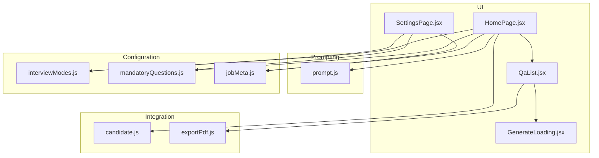
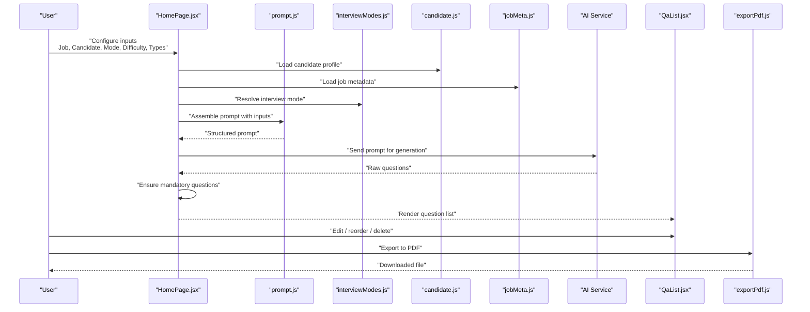
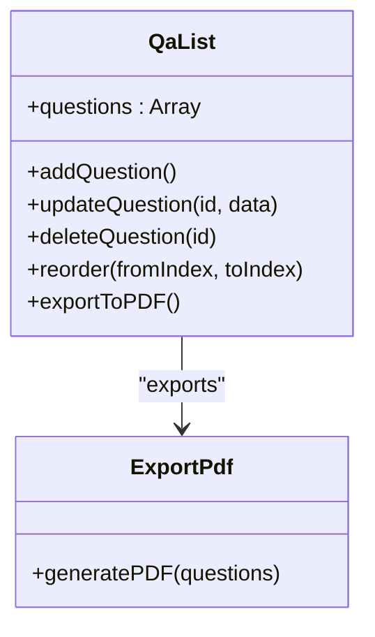
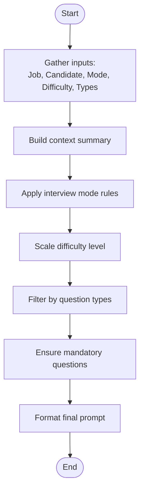
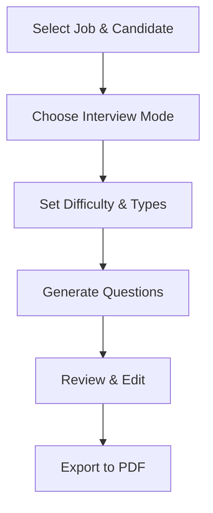
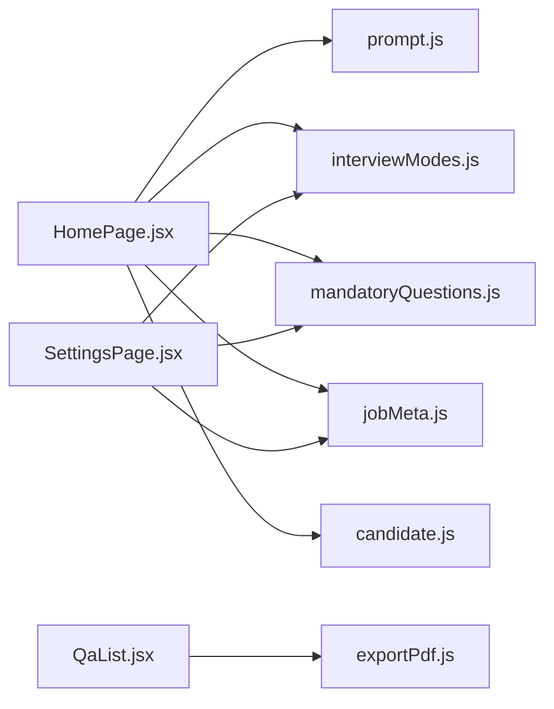

# Interview Question Generator

<cite>
**Referenced Files in This Document**
- [QaList.jsx](file://src/components/QaList.jsx)
- [prompt.js](file://src/lib/prompt.js)
- [interviewModes.js](file://src/lib/interviewModes.js)
- [mandatoryQuestions.js](file://src/lib/mandatoryQuestions.js)
- [candidate.js](file://src/lib/candidate.js)
- [jobMeta.js](file://src/lib/jobMeta.js)
- [exportPdf.js](file://src/lib/exportPdf.js)
- [HomePage.jsx](file://src/pages/HomePage.jsx)
- [SettingsPage.jsx](file://src/pages/SettingsPage.jsx)
- [GenerateLoading.jsx](file://src/components/GenerateLoading.jsx)
</cite>

## Table of Contents
1. [Introduction](#introduction)
2. [Project Structure](#project-structure)
3. [Core Components](#core-components)
4. [Architecture Overview](#architecture-overview)
5. [Detailed Component Analysis](#detailed-component-analysis)
6. [Dependency Analysis](#dependency-analysis)
7. [Performance Considerations](#performance-considerations)
8. [Troubleshooting Guide](#troubleshooting-guide)
9. [Conclusion](#conclusion)
10. [Appendices](#appendices)

## Introduction
This document explains the Interview Question Generator feature that creates AI-powered interview questions tailored to job descriptions, candidate profiles, and selected interview modes. It covers how the system builds prompts, applies customization options (difficulty levels and question types), integrates with candidate management, configures mandatory questions, and manages generated questions via the QaList component. Practical examples, prompt engineering techniques, and export workflows are included for end users and integrators.

## Project Structure
The feature spans UI components, prompt construction utilities, configuration modules, and integration helpers:
- UI layer: page entry points and question list editor
- Prompting layer: dynamic prompt assembly from inputs and settings
- Configuration: interview modes, mandatory questions, job metadata, and storage
- Integration: candidate data access and PDF export

**Diagram sources**
- [HomePage.jsx](file://src/pages/HomePage.jsx)
- [QaList.jsx](file://src/components/QaList.jsx)
- [prompt.js](file://src/lib/prompt.js)
- [interviewModes.js](file://src/lib/interviewModes.js)
- [mandatoryQuestions.js](file://src/lib/mandatoryQuestions.js)
- [jobMeta.js](file://src/lib/jobMeta.js)
- [candidate.js](file://src/lib/candidate.js)
- [exportPdf.js](file://src/lib/exportPdf.js)
- [GenerateLoading.jsx](file://src/components/GenerateLoading.jsx)

**Section sources**
- [HomePage.jsx](file://src/pages/HomePage.jsx)
- [QaList.jsx](file://src/components/QaList.jsx)
- [prompt.js](file://src/lib/prompt.js)
- [interviewModes.js](file://src/lib/interviewModes.js)
- [mandatoryQuestions.js](file://src/lib/mandatoryQuestions.js)
- [jobMeta.js](file://src/lib/jobMeta.js)
- [candidate.js](file://src/lib/candidate.js)
- [exportPdf.js](file://src/lib/exportPdf.js)
- [GenerateLoading.jsx](file://src/components/GenerateLoading.jsx)

## Core Components
- HomePage: Orchestrates user inputs (job description, candidate profile, interview mode, difficulty, question types), triggers generation, and renders the question list.
- QaList: Displays generated questions, supports editing, reordering, deletion, and exporting to PDF.
- prompt.js: Builds structured prompts by combining job context, candidate details, interview mode, difficulty, and question type constraints.
- interviewModes.js: Defines available interview modes and their characteristics.
- mandatoryQuestions.js: Provides a mechanism to enforce specific questions across generations.
- jobMeta.js: Supplies job-related metadata used to enrich prompts.
- candidate.js: Reads candidate information for personalization.
- exportPdf.js: Converts the current question set into a downloadable PDF.
- GenerateLoading: Visual feedback during asynchronous generation.

**Section sources**
- [HomePage.jsx](file://src/pages/HomePage.jsx)
- [QaList.jsx](file://src/components/QaList.jsx)
- [prompt.js](file://src/lib/prompt.js)
- [interviewModes.js](file://src/lib/interviewModes.js)
- [mandatoryQuestions.js](file://src/lib/mandatoryQuestions.js)
- [jobMeta.js](file://src/lib/jobMeta.js)
- [candidate.js](file://src/lib/candidate.js)
- [exportPdf.js](file://src/lib/exportPdf.js)
- [GenerateLoading.jsx](file://src/components/GenerateLoading.jsx)

## Architecture Overview
The generator follows a clear pipeline:
- Inputs: Job description, candidate profile, interview mode, difficulty, question types, and mandatory flags.
- Prompt Assembly: The prompting module composes a structured prompt using all inputs and configuration.
- Generation: An external AI service is invoked with the assembled prompt.
- Post-processing: Mandatory questions are ensured; results are normalized into a consistent model.
- Management: The QaList component presents, edits, and exports the final question set.

**Diagram sources**
- [HomePage.jsx](file://src/pages/HomePage.jsx)
- [prompt.js](file://src/lib/prompt.js)
- [interviewModes.js](file://src/lib/interviewModes.js)
- [candidate.js](file://src/lib/candidate.js)
- [jobMeta.js](file://src/lib/jobMeta.js)
- [QaList.jsx](file://src/components/QaList.jsx)
- [exportPdf.js](file://src/lib/exportPdf.js)

## Detailed Component Analysis

### HomePage Orchestration
Responsibilities:
- Collects and validates user inputs (job description, candidate profile selection, interview mode, difficulty level, question types).
- Invokes prompt assembly and generation flow.
- Manages loading state and error handling.
- Passes generated questions to QaList.

Key behaviors:
- Input validation ensures required fields before generation.
- Integrates with candidate and job metadata modules to enrich context.
- Applies interview mode constraints and difficulty scaling.
- Ensures mandatory questions are present after generation.

**Section sources**
- [HomePage.jsx](file://src/pages/HomePage.jsx)
- [GenerateLoading.jsx](file://src/components/GenerateLoading.jsx)

### QaList Component
Responsibilities:
- Renders the generated question set with editable text fields.
- Supports adding new questions, deleting existing ones, and reordering.
- Exports the current question set to PDF.
- Persists changes locally if configured.

Data model:
- Each question includes an identifier, text content, optional tags or categories, and metadata such as difficulty or type.

Operations:
- Edit: Inline updates to question text and attributes.
- Reorder: Drag-and-drop or move controls to adjust sequence.
- Delete: Remove individual questions or clear all.
- Export: Convert to PDF via exportPdf.

**Diagram sources**
- [QaList.jsx](file://src/components/QaList.jsx)
- [exportPdf.js](file://src/lib/exportPdf.js)

**Section sources**
- [QaList.jsx](file://src/components/QaList.jsx)
- [exportPdf.js](file://src/lib/exportPdf.js)

### Prompt Engineering (prompt.js)
Responsibilities:
- Composes a structured prompt by integrating:
  - Job description and metadata
  - Candidate profile details
  - Interview mode parameters
  - Difficulty level and question type filters
  - Mandatory questions requirement
- Formats instructions to guide the AI toward producing high-quality, relevant questions.

Prompt construction logic:
- Context injection: Merges job and candidate data into a concise background summary.
- Mode alignment: Adjusts tone and focus based on interview mode (e.g., technical, behavioral, case-based).
- Difficulty scaling: Modifies complexity and depth according to selected difficulty.
- Type constraints: Enforces distribution across question types (e.g., multiple choice, open-ended, scenario-based).
- Mandatory inclusion: Appends required questions or templates to ensure coverage.

**Diagram sources**
- [prompt.js](file://src/lib/prompt.js)
- [interviewModes.js](file://src/lib/interviewModes.js)
- [mandatoryQuestions.js](file://src/lib/mandatoryQuestions.js)
- [jobMeta.js](file://src/lib/jobMeta.js)
- [candidate.js](file://src/lib/candidate.js)

**Section sources**
- [prompt.js](file://src/lib/prompt.js)
- [interviewModes.js](file://src/lib/interviewModes.js)
- [mandatoryQuestions.js](file://src/lib/mandatoryQuestions.js)
- [jobMeta.js](file://src/lib/jobMeta.js)
- [candidate.js](file://src/lib/candidate.js)

### Interview Modes (interviewModes.js)
Responsibilities:
- Defines available interview modes and their characteristics.
- Provides guidance for prompt construction and question style per mode.

Usage:
- HomePage selects a mode and passes it to the prompt assembler.
- Prompt uses mode-specific instructions to tailor question focus and format.

**Section sources**
- [interviewModes.js](file://src/lib/interviewModes.js)

### Mandatory Questions (mandatoryQuestions.js)
Responsibilities:
- Stores and manages mandatory questions that must appear in every generated set.
- Allows toggling mandatory requirements and customizing the list.

Integration:
- HomePage enforces presence of mandatory questions post-generation.
- SettingsPage may provide UI to edit mandatory lists.

**Section sources**
- [mandatoryQuestions.js](file://src/lib/mandatoryQuestions.js)
- [SettingsPage.jsx](file://src/pages/SettingsPage.jsx)

### Candidate Management Integration (candidate.js)
Responsibilities:
- Retrieves candidate profile data for personalization.
- Supplies skills, experience, and background details to the prompt builder.

Usage:
- HomePage loads candidate info when generating questions.
- Prompt incorporates candidate specifics to produce targeted questions.

**Section sources**
- [candidate.js](file://src/lib/candidate.js)

### Job Metadata (jobMeta.js)
Responsibilities:
- Provides job-related metadata such as role title, key responsibilities, and required competencies.
- Enhances prompt context for relevance and accuracy.

Usage:
- HomePage merges job metadata into the prompt context.

**Section sources**
- [jobMeta.js](file://src/lib/jobMeta.js)

### PDF Export (exportPdf.js)
Responsibilities:
- Converts the current question set into a formatted PDF document.
- Supports headers, sections, and basic styling suitable for interviews.

Usage:
- QaList triggers export when user requests a download.

**Section sources**
- [exportPdf.js](file://src/lib/exportPdf.js)

### Conceptual Overview
The feature enables recruiters and hiring managers to quickly generate customized interview questions aligned with job requirements and candidate backgrounds. Users can select interview modes, adjust difficulty, filter question types, and enforce mandatory questions. The resulting list is fully editable and exportable for offline use.

[No sources needed since this diagram shows conceptual workflow, not actual code structure]

## Dependency Analysis
The following diagram highlights core dependencies among components and libraries:

**Diagram sources**
- [HomePage.jsx](file://src/pages/HomePage.jsx)
- [prompt.js](file://src/lib/prompt.js)
- [interviewModes.js](file://src/lib/interviewModes.js)
- [mandatoryQuestions.js](file://src/lib/mandatoryQuestions.js)
- [jobMeta.js](file://src/lib/jobMeta.js)
- [candidate.js](file://src/lib/candidate.js)
- [QaList.jsx](file://src/components/QaList.jsx)
- [exportPdf.js](file://src/lib/exportPdf.js)
- [SettingsPage.jsx](file://src/pages/SettingsPage.jsx)

**Section sources**
- [HomePage.jsx](file://src/pages/HomePage.jsx)
- [QaList.jsx](file://src/components/QaList.jsx)
- [prompt.js](file://src/lib/prompt.js)
- [interviewModes.js](file://src/lib/interviewModes.js)
- [mandatoryQuestions.js](file://src/lib/mandatoryQuestions.js)
- [jobMeta.js](file://src/lib/jobMeta.js)
- [candidate.js](file://src/lib/candidate.js)
- [exportPdf.js](file://src/lib/exportPdf.js)
- [SettingsPage.jsx](file://src/pages/SettingsPage.jsx)

## Performance Considerations
- Prompt size: Keep job descriptions and candidate summaries concise to reduce token usage and latency.
- Batch operations: Avoid frequent small edits in QaList; batch changes where possible.
- Export frequency: Limit repeated PDF exports; cache the last exported version if needed.
- Network calls: Implement retry and timeout strategies for AI service calls to improve resilience.

[No sources needed since this section provides general guidance]

## Troubleshooting Guide
Common issues and resolutions:
- Missing inputs: Ensure job description and candidate profile are provided before generation.
- Empty results: Verify interview mode and question types are valid; check mandatory questions configuration.
- Export failures: Confirm browser permissions for downloads and sufficient memory for large question sets.
- Slow generation: Reduce input length or simplify prompt constraints.

Operational checks:
- Validate that candidate and job modules return expected data structures.
- Confirm prompt assembly includes all required sections.
- Inspect network logs for AI service responses and errors.

**Section sources**
- [HomePage.jsx](file://src/pages/HomePage.jsx)
- [QaList.jsx](file://src/components/QaList.jsx)
- [prompt.js](file://src/lib/prompt.js)
- [exportPdf.js](file://src/lib/exportPdf.js)

## Conclusion
The Interview Question Generator combines modular configuration, robust prompt engineering, and flexible question management to deliver tailored interview materials. By leveraging interview modes, difficulty scaling, question type filters, and mandatory questions, users can efficiently create high-quality assessments. The QaList component streamlines review and editing, while PDF export supports offline workflows.

[No sources needed since this section summarizes without analyzing specific files]

## Appendices

### Practical Examples
- Technical interview for a software engineer:
  - Inputs: Job description focused on backend systems, candidate with distributed computing experience.
  - Mode: Technical deep-dive.
  - Difficulty: Intermediate.
  - Types: Scenario-based, problem-solving.
  - Mandatory: System design fundamentals.
- Behavioral interview for a product manager:
  - Inputs: Role emphasizing stakeholder management and roadmap planning.
  - Mode: Behavioral.
  - Difficulty: Advanced.
  - Types: Open-ended, situational.
  - Mandatory: Conflict resolution and prioritization.

[No sources needed since this section provides general guidance]

### Prompt Engineering Techniques
- Use explicit constraints: Specify output format, number of questions, and distribution across types.
- Provide context anchors: Include key responsibilities and required competencies from job metadata.
- Personalize references: Mention candidate’s notable projects or skills to increase relevance.
- Enforce quality: Add instructions to avoid generic questions and encourage specificity.
- Iterate: Refine prompts based on generated results and user feedback.

[No sources needed since this section provides general guidance]

### Configuring Mandatory Questions
- Access mandatory question settings via the settings interface.
- Add, remove, or toggle mandatory items as needed.
- Ensure mandatory questions align with compliance or assessment standards.
- Validate that mandatory items integrate smoothly with selected interview modes and difficulty levels.

**Section sources**
- [mandatoryQuestions.js](file://src/lib/mandatoryQuestions.js)
- [SettingsPage.jsx](file://src/pages/SettingsPage.jsx)