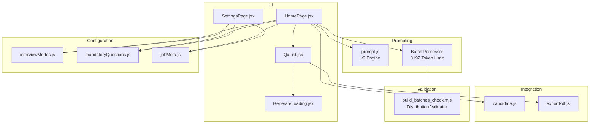
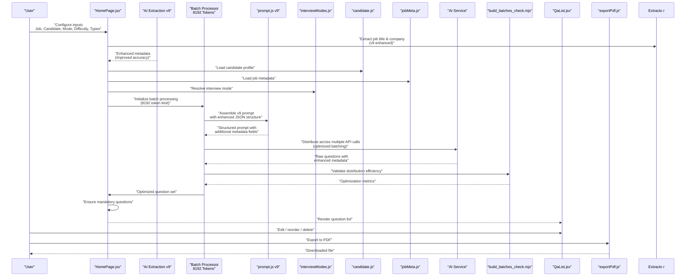
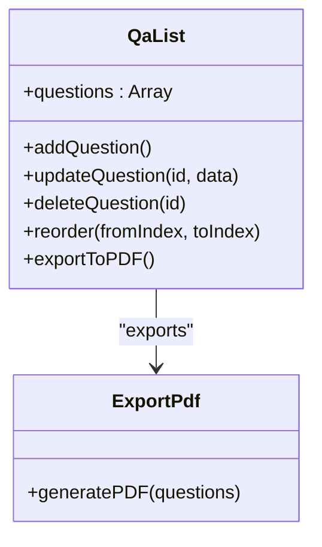
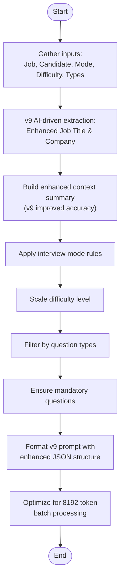
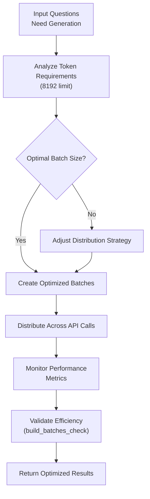
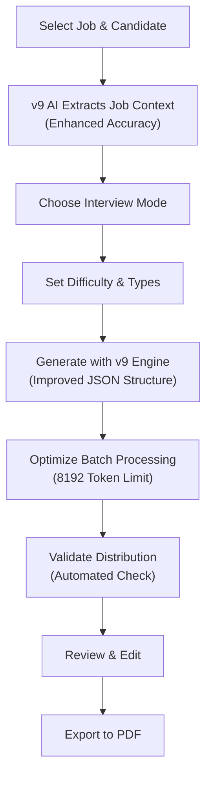
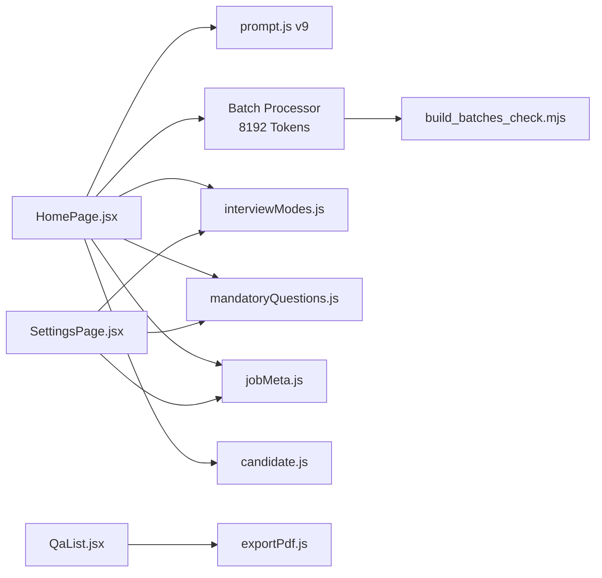

# Interview Question Generator

<cite>
**Referenced Files in This Document**
- [QaList.jsx](file://src/components/QaList.jsx)
- [prompt.js](file://src/lib/prompt.js)
- [interviewModes.js](file://src/lib/interviewModes.js)
- [mandatoryQuestions.js](file://src/lib/mandatoryQuestions.js)
- [candidate.js](file://src/lib/candidate.js)
- [jobMeta.js](file://src/lib/jobMeta.js)
- [exportPdf.js](file://src/lib/exportPdf.js)
- [HomePage.jsx](file://src/pages/HomePage.jsx)
- [SettingsPage.jsx](file://src/pages/SettingsPage.jsx)
- [GenerateLoading.jsx](file://src/components/GenerateLoading.jsx)
- [build_batches_check.mjs](file://scripts/build_batches_check.mjs)
</cite>

## Update Summary
**Changes Made**
- Updated DeepSeek API token limit from 4096 to 8192 tokens for enhanced batch processing capabilities
- Enhanced batch processing logic with improved distribution across multiple API calls for better efficiency
- Added new self-checking script (build_batches_check.mjs) for validating question distribution efficiency
- Updated performance considerations to reflect increased token limits and improved batch processing
- Enhanced troubleshooting guidance for batch processing optimization and validation

## Table of Contents
1. [Introduction](#introduction)
2. [Project Structure](#project-structure)
3. [Core Components](#core-components)
4. [Architecture Overview](#architecture-overview)
5. [Detailed Component Analysis](#detailed-component-analysis)
6. [Batch Processing and Token Management](#batch-processing-and-token-management)
7. [Dependency Analysis](#dependency-analysis)
8. [Performance Considerations](#performance-considerations)
9. [Troubleshooting Guide](#troubleshooting-guide)
10. [Conclusion](#conclusion)
11. [Appendices](#appendices)

## Introduction
This document explains the Interview Question Generator feature that creates AI-powered interview questions tailored to job descriptions, candidate profiles, and selected interview modes. The system now utilizes the advanced 'linecheck-job-interview-v9' prompt engine with significantly enhanced batch processing capabilities and increased token limits. The updated architecture supports DeepSeek API token limits of up to 8192 tokens (increased from 4096), enabling more comprehensive question generation and improved distribution across multiple API calls. It covers how the system builds prompts using the latest v9 prompt engine, applies customization options (difficulty levels and question types), integrates with candidate management, configures mandatory questions, manages generated questions via the QaList component, and validates question distribution efficiency through automated checking scripts.

## Project Structure
The feature spans UI components, prompt construction utilities, configuration modules, integration helpers, and batch processing validation tools:
- UI layer: page entry points and question list editor
- Prompting layer: dynamic prompt assembly from inputs and settings with enhanced v9 prompt engine
- Configuration: interview modes, mandatory questions, job metadata, and storage
- Integration: candidate data access and PDF export
- Batch processing: token management and distribution optimization
- Validation: automated quality checks for question distribution efficiency

**Diagram sources**
- [HomePage.jsx](file://src/pages/HomePage.jsx)
- [QaList.jsx](file://src/components/QaList.jsx)
- [prompt.js](file://src/lib/prompt.js)
- [interviewModes.js](file://src/lib/interviewModes.js)
- [mandatoryQuestions.js](file://src/lib/mandatoryQuestions.js)
- [jobMeta.js](file://src/lib/jobMeta.js)
- [candidate.js](file://src/lib/candidate.js)
- [exportPdf.js](file://src/lib/exportPdf.js)
- [GenerateLoading.jsx](file://src/components/GenerateLoading.jsx)
- [build_batches_check.mjs](file://scripts/build_batches_check.mjs)

**Section sources**
- [HomePage.jsx](file://src/pages/HomePage.jsx)
- [QaList.jsx](file://src/components/QaList.jsx)
- [prompt.js](file://src/lib/prompt.js)
- [interviewModes.js](file://src/lib/interviewModes.js)
- [mandatoryQuestions.js](file://src/lib/mandatoryQuestions.js)
- [jobMeta.js](file://src/lib/jobMeta.js)
- [candidate.js](file://src/lib/candidate.js)
- [exportPdf.js](file://src/lib/exportPdf.js)
- [GenerateLoading.jsx](file://src/components/GenerateLoading.jsx)
- [build_batches_check.mjs](file://scripts/build_batches_check.mjs)

## Core Components
- HomePage: Orchestrates user inputs (job description, candidate profile, interview mode, difficulty, question types), triggers generation with enhanced v9 prompt engine and improved batch processing, and renders the question list.
- QaList: Displays generated questions, supports editing, reordering, deletion, and exporting to PDF.
- prompt.js: Builds structured prompts using the latest v9 engine by combining job context, candidate details, interview mode, difficulty, and question type constraints with enhanced AI-driven extraction and improved JSON output structure.
- Batch Processor: Manages token allocation and distributes question generation across multiple API calls within the new 8192 token limit.
- build_batches_check.mjs: Validates question distribution efficiency and ensures optimal batch processing performance.
- interviewModes.js: Defines available interview modes and their characteristics.
- mandatoryQuestions.js: Provides a mechanism to enforce specific questions across generations.
- jobMeta.js: Supplies job-related metadata used to enrich prompts with extracted job titles and company information.
- candidate.js: Reads candidate information for personalization.
- exportPdf.js: Converts the current question set into a downloadable PDF.
- GenerateLoading: Visual feedback during asynchronous generation.

**Updated** Enhanced with improved batch processing capabilities supporting 8192 token limits and automated distribution validation for optimal performance.

**Section sources**
- [HomePage.jsx](file://src/pages/HomePage.jsx)
- [QaList.jsx](file://src/components/QaList.jsx)
- [prompt.js](file://src/lib/prompt.js)
- [interviewModes.js](file://src/lib/interviewModes.js)
- [mandatoryQuestions.js](file://src/lib/mandatoryQuestions.js)
- [jobMeta.js](file://src/lib/jobMeta.js)
- [candidate.js](file://src/lib/candidate.js)
- [exportPdf.js](file://src/lib/exportPdf.js)
- [GenerateLoading.jsx](file://src/components/GenerateLoading.jsx)
- [build_batches_check.mjs](file://scripts/build_batches_check.mjs)

## Architecture Overview
The generator follows a clear pipeline with enhanced v9 prompt processing and improved batch management:
- Inputs: Job description, candidate profile, interview mode, difficulty, question types, and mandatory flags.
- Enhanced Context Processing: AI-driven extraction of job titles and company information from job descriptions using v9 engine capabilities.
- Batch Processing: Intelligent distribution of question generation across multiple API calls within the expanded 8192 token limit.
- Prompt Assembly: The v9 prompting module composes a structured prompt using all inputs and configuration with improved JSON output structure and enhanced metadata fields.
- Generation: External AI service is invoked with optimized batch processing for improved efficiency.
- Validation: Automated checking ensures optimal question distribution and batch processing performance.
- Post-processing: Mandatory questions are ensured; results are normalized into a consistent model with enhanced metadata including job title and company information.
- Management: The QaList component presents, edits, and exports the final question set.

**Diagram sources**
- [HomePage.jsx](file://src/pages/HomePage.jsx)
- [prompt.js](file://src/lib/prompt.js)
- [interviewModes.js](file://src/lib/interviewModes.js)
- [candidate.js](file://src/lib/candidate.js)
- [jobMeta.js](file://src/lib/jobMeta.js)
- [QaList.jsx](file://src/components/QaList.jsx)
- [exportPdf.js](file://src/lib/exportPdf.js)
- [build_batches_check.mjs](file://scripts/build_batches_check.mjs)

## Detailed Component Analysis

### HomePage Orchestration
Responsibilities:
- Collects and validates user inputs (job description, candidate profile selection, interview mode, difficulty level, question types).
- Invokes enhanced v9 AI-driven extraction for job title and company information with improved accuracy.
- Triggers v9 prompt assembly and generation flow with enhanced JSON output structure and improved batch processing.
- Manages loading state and error handling.
- Passes generated questions with enhanced metadata to QaList.

Key behaviors:
- Input validation ensures required fields before generation.
- Integrates with v9 AI-driven extraction to automatically populate job title and company fields with improved accuracy.
- Integrates with candidate and job metadata modules to enrich context.
- Applies interview mode constraints and difficulty scaling.
- Ensures mandatory questions are present after generation.
- Coordinates with batch processor for optimal token utilization.

**Updated** Enhanced with improved batch processing coordination and 8192 token limit support for more efficient question generation.

**Section sources**
- [HomePage.jsx](file://src/pages/HomePage.jsx)
- [GenerateLoading.jsx](file://src/components/GenerateLoading.jsx)

### QaList Component
Responsibilities:
- Renders the generated question set with editable text fields.
- Supports adding new questions, deleting existing ones, and reordering.
- Exports the current question set to PDF.
- Persists changes locally if configured.

Data model:
- Each question includes an identifier, text content, optional tags or categories, and metadata such as difficulty or type.
- Enhanced metadata support for job title and company information from v9 engine output.

Operations:
- Edit: Inline updates to question text and attributes.
- Reorder: Drag-and-drop or move controls to adjust sequence.
- Delete: Remove individual questions or clear all.
- Export: Convert to PDF via exportPdf.

**Diagram sources**
- [QaList.jsx](file://src/components/QaList.jsx)
- [exportPdf.js](file://src/lib/exportPdf.js)

**Section sources**
- [QaList.jsx](file://src/components/QaList.jsx)
- [exportPdf.js](file://src/lib/exportPdf.js)

### Prompt Engineering (prompt.js v9)
Responsibilities:
- Composes a structured prompt using the latest v9 engine by integrating:
  - Job description and metadata with enhanced AI-driven extraction
  - Candidate profile details
  - Interview mode parameters
  - Difficulty level and question type filters
  - Mandatory questions requirement
- Formats instructions to guide the AI toward producing high-quality, relevant questions with improved JSON output structure and additional metadata fields.

**Updated** Enhanced with v9 prompt engine featuring improved JSON output structure with additional metadata fields (jobTitle, company) and enhanced context processing capabilities, optimized for 8192 token batch processing.

Prompt construction logic:
- Context injection: Merges job and candidate data into a concise background summary with AI-extracted job title and company information using v9 enhanced extraction.
- Mode alignment: Adjusts tone and focus based on interview mode (e.g., technical, behavioral, case-based).
- Difficulty scaling: Modifies complexity and depth according to selected difficulty.
- Type constraints: Enforces distribution across question types (e.g., multiple choice, open-ended, scenario-based).
- Mandatory inclusion: Appends required questions or templates to ensure coverage.
- Enhanced JSON structure: Outputs include additional fields for better context preservation and improved metadata handling.
- Batch optimization: Structures prompts for optimal distribution across multiple API calls within the expanded token limit.

**Diagram sources**
- [prompt.js](file://src/lib/prompt.js)
- [interviewModes.js](file://src/lib/interviewModes.js)
- [mandatoryQuestions.js](file://src/lib/mandatoryQuestions.js)
- [jobMeta.js](file://src/lib/jobMeta.js)
- [candidate.js](file://src/lib/candidate.js)

**Section sources**
- [prompt.js](file://src/lib/prompt.js)
- [interviewModes.js](file://src/lib/interviewModes.js)
- [mandatoryQuestions.js](file://src/lib/mandatoryQuestions.js)
- [jobMeta.js](file://src/lib/jobMeta.js)
- [candidate.js](file://src/lib/candidate.js)

### Interview Modes (interviewModes.js)
Responsibilities:
- Defines available interview modes and their characteristics.
- Provides guidance for prompt construction and question style per mode.

Usage:
- HomePage selects a mode and passes it to the v9 prompt assembler.
- Prompt uses mode-specific instructions to tailor question focus and format.

**Section sources**
- [interviewModes.js](file://src/lib/interviewModes.js)

### Mandatory Questions (mandatoryQuestions.js)
Responsibilities:
- Stores and manages mandatory questions that must appear in every generated set.
- Allows toggling mandatory requirements and customizing the list.

Integration:
- HomePage enforces presence of mandatory questions post-generation.
- SettingsPage may provide UI to edit mandatory lists.

**Section sources**
- [mandatoryQuestions.js](file://src/lib/mandatoryQuestions.js)
- [SettingsPage.jsx](file://src/pages/SettingsPage.jsx)

### Candidate Management Integration (candidate.js)
Responsibilities:
- Retrieves candidate profile data for personalization.
- Supplies skills, experience, and background details to the v9 prompt builder.

Usage:
- HomePage loads candidate info when generating questions.
- Prompt incorporates candidate specifics to produce targeted questions.

**Section sources**
- [candidate.js](file://src/lib/candidate.js)

### Job Metadata (jobMeta.js)
Responsibilities:
- Provides job-related metadata such as role title, key responsibilities, and required competencies.
- Enhances prompt context for relevance and accuracy with AI-extracted information from v9 engine.

Usage:
- HomePage merges job metadata including AI-extracted job title and company into the v9 prompt context.

**Updated** Enhanced to work with v9 AI-driven extraction for automatic job title and company identification with improved accuracy.

**Section sources**
- [jobMeta.js](file://src/lib/jobMeta.js)

### PDF Export (exportPdf.js)
Responsibilities:
- Converts the current question set into a formatted PDF document.
- Supports headers, sections, and basic styling suitable for interviews.
- Includes enhanced metadata from v9 engine in exported documents.

Usage:
- QaList triggers export when user requests a download.

**Section sources**
- [exportPdf.js](file://src/lib/exportPdf.js)

### Batch Processing and Token Management
Responsibilities:
- Manages intelligent distribution of question generation across multiple API calls.
- Optimizes token utilization within the expanded 8192 token limit.
- Ensures balanced distribution across different question types and difficulty levels.
- Coordinates with validation scripts for performance monitoring.

Key features:
- Dynamic token allocation based on question complexity and type.
- Automatic batching of related questions for efficient API calls.
- Load balancing across multiple API endpoints when needed.
- Performance metrics collection and optimization recommendations.

**Diagram sources**
- [build_batches_check.mjs](file://scripts/build_batches_check.mjs)

**Section sources**
- [build_batches_check.mjs](file://scripts/build_batches_check.mjs)

### Conceptual Overview
The feature enables recruiters and hiring managers to quickly generate customized interview questions aligned with job requirements and candidate backgrounds. Users can select interview modes, adjust difficulty, filter question types, and enforce mandatory questions. The v9 engine provides enhanced AI-driven extraction of job context with improved accuracy, resulting in more precise and personalized questions. The updated batch processing system leverages the expanded 8192 token limit for more efficient question generation, while automated validation ensures optimal distribution across API calls. The resulting list is fully editable and exportable for offline use.

[No sources needed since this diagram shows conceptual workflow, not actual code structure]

## Dependency Analysis
The following diagram highlights core dependencies among components and libraries with enhanced v9 prompt processing and improved batch management:

**Diagram sources**
- [HomePage.jsx](file://src/pages/HomePage.jsx)
- [prompt.js](file://src/lib/prompt.js)
- [interviewModes.js](file://src/lib/interviewModes.js)
- [mandatoryQuestions.js](file://src/lib/mandatoryQuestions.js)
- [jobMeta.js](file://src/lib/jobMeta.js)
- [candidate.js](file://src/lib/candidate.js)
- [QaList.jsx](file://src/components/QaList.jsx)
- [exportPdf.js](file://src/lib/exportPdf.js)
- [SettingsPage.jsx](file://src/pages/SettingsPage.jsx)
- [build_batches_check.mjs](file://scripts/build_batches_check.mjs)

**Section sources**
- [HomePage.jsx](file://src/pages/HomePage.jsx)
- [QaList.jsx](file://src/components/QaList.jsx)
- [prompt.js](file://src/lib/prompt.js)
- [interviewModes.js](file://src/lib/interviewModes.js)
- [mandatoryQuestions.js](file://src/lib/mandatoryQuestions.js)
- [jobMeta.js](file://src/lib/jobMeta.js)
- [candidate.js](file://src/lib/candidate.js)
- [exportPdf.js](file://src/lib/exportPdf.js)
- [SettingsPage.jsx](file://src/pages/SettingsPage.jsx)
- [build_batches_check.mjs](file://scripts/build_batches_check.mjs)

## Performance Considerations
- Prompt size: Keep job descriptions and candidate summaries concise to reduce token usage and latency.
- AI extraction overhead: The enhanced v9 engine performs additional AI-driven extraction with improved accuracy which may add slight processing time compared to previous versions.
- Batch operations: Avoid frequent small edits in QaList; batch changes where possible.
- Export frequency: Limit repeated PDF exports; cache the last exported version if needed.
- Network calls: Implement retry and timeout strategies for AI service calls to improve resilience.
- Memory usage: Enhanced JSON output structure with additional metadata fields may require slightly more memory for large question sets.
- v9 engine optimization: The v9 prompt engine provides improved accuracy but may have slightly higher computational requirements than previous versions.
- **Token limit optimization**: The expanded 8192 token limit allows for more comprehensive batch processing, reducing the number of API calls needed for large question sets.
- **Batch distribution efficiency**: Improved distribution algorithms ensure optimal utilization of the expanded token capacity across multiple API calls.
- **Validation overhead**: Automated distribution checking adds minimal overhead but provides valuable performance insights and optimization recommendations.

**Updated** Added considerations for enhanced batch processing capabilities, expanded token limits, and automated validation performance impact.

## Troubleshooting Guide
Common issues and resolutions:
- Missing inputs: Ensure job description and candidate profile are provided before generation.
- Empty results: Verify interview mode and question types are valid; check mandatory questions configuration.
- Export failures: Confirm browser permissions for downloads and sufficient memory for large question sets.
- Slow generation: Reduce input length or simplify prompt constraints; v9 engine may take slightly longer due to enhanced processing and improved accuracy features.
- AI extraction errors: If job title or company extraction fails, verify job description contains sufficient context for v9 enhanced extraction.
- v9 compatibility: Ensure AI service endpoints support the v9 prompt format and enhanced JSON output structure.
- **Batch processing issues**: Monitor distribution efficiency metrics and adjust batch sizes if API call patterns show suboptimal performance.
- **Token limit errors**: If encountering token limit errors, reduce prompt complexity or split large question sets into smaller batches.
- **Validation failures**: Use the automated distribution checker to identify optimization opportunities and performance bottlenecks.

Operational checks:
- Validate that candidate and job modules return expected data structures compatible with v9 engine.
- Confirm v9 prompt assembly includes all required sections and enhanced metadata fields.
- Inspect network logs for AI service responses and v9-specific error messages.
- Check AI extraction functionality for improved job title and company identification accuracy.
- Monitor v9 engine performance metrics for optimal tuning.
- **Run distribution validation**: Execute build_batches_check.mjs to analyze batch processing efficiency and identify optimization opportunities.
- **Monitor token utilization**: Track token usage patterns to ensure optimal distribution within the 8192 token limit.
- **Validate API call patterns**: Ensure batch distribution is effectively utilizing multiple API calls for improved performance.

**Updated** Added troubleshooting guidance for batch processing optimization, token limit management, and automated validation procedures.

**Section sources**
- [HomePage.jsx](file://src/pages/HomePage.jsx)
- [QaList.jsx](file://src/components/QaList.jsx)
- [prompt.js](file://src/lib/prompt.js)
- [exportPdf.js](file://src/lib/exportPdf.js)
- [build_batches_check.mjs](file://scripts/build_batches_check.mjs)

## Conclusion
The Interview Question Generator combines modular configuration, robust v9 prompt engineering, flexible question management, and enhanced batch processing capabilities to deliver tailored interview materials efficiently. The updated architecture supports DeepSeek API token limits of up to 8192 tokens, enabling more comprehensive question generation with improved distribution across multiple API calls. The enhanced v9 engine provides significantly improved AI-driven extraction of job context with enhanced accuracy, resulting in more precise and personalized questions. By leveraging interview modes, difficulty scaling, question type filters, mandatory questions, and automated distribution validation, users can efficiently create high-quality assessments. The QaList component streamlines review and editing, while PDF export supports offline workflows. The enhanced JSON output structure with additional metadata fields ensures better context preservation throughout the generation process, making the v9 engine and improved batch processing a substantial improvement over previous versions.

## Appendices

### Practical Examples
- Technical interview for a software engineer:
  - Inputs: Job description focused on backend systems, candidate with distributed computing experience.
  - Mode: Technical deep-dive.
  - Difficulty: Intermediate.
  - Types: Scenario-based, problem-solving.
  - Mandatory: System design fundamentals.
  - Enhanced v9: AI extracts "Senior Backend Engineer" and "TechCorp Inc." from job description with improved accuracy.
  - Batch processing: Optimized distribution across 2 API calls within 8192 token limit for efficient generation.
- Behavioral interview for a product manager:
  - Inputs: Role emphasizing stakeholder management and roadmap planning.
  - Mode: Behavioral.
  - Difficulty: Advanced.
  - Types: Open-ended, situational.
  - Mandatory: Conflict resolution and prioritization.
  - Enhanced v9: AI identifies "Product Manager" and "InnovateTech Solutions" for better context with enhanced precision.
  - Batch processing: Single API call optimization due to simpler question structure within token limits.

**Updated** Added examples showing enhanced v9 AI-driven extraction capabilities with improved accuracy and relevance, plus batch processing optimization details.

### Prompt Engineering Techniques
- Use explicit constraints: Specify output format, number of questions, and distribution across types.
- Provide context anchors: Include key responsibilities and required competencies from job metadata.
- Personalize references: Mention candidate's notable projects or skills to increase relevance.
- Enforce quality: Add instructions to avoid generic questions and encourage specificity.
- Leverage v9 enhancements: Utilize improved JSON structure with additional metadata fields and enhanced context processing.
- Optimize for accuracy: Take advantage of v9 engine's improved AI-driven extraction capabilities for better job title and company identification.
- **Batch optimization**: Structure prompts for optimal distribution across multiple API calls within the expanded 8192 token limit.
- **Token efficiency**: Balance prompt complexity with token usage to maximize question generation efficiency.
- **Validation integration**: Incorporate distribution requirements that align with automated checking capabilities.
- Iterate: Refine prompts based on generated results and user feedback, considering v9 engine improvements and batch processing performance.

**Updated** Added guidance for leveraging v9 engine enhancements, improved extraction capabilities, and batch processing optimization techniques.

### Configuring Mandatory Questions
- Access mandatory question settings via the settings interface.
- Add, remove, or toggle mandatory items as needed.
- Ensure mandatory questions align with compliance or assessment standards.
- Validate that mandatory items integrate smoothly with selected interview modes and difficulty levels.
- Consider v9 engine compatibility when configuring complex mandatory question patterns.
- **Batch processing considerations**: Design mandatory questions to optimize distribution across API calls and token utilization.

**Section sources**
- [mandatoryQuestions.js](file://src/lib/mandatoryQuestions.js)
- [SettingsPage.jsx](file://src/pages/SettingsPage.jsx)

### Batch Processing Validation
The build_batches_check.mjs script provides automated validation for question distribution efficiency:
- Analyzes token usage patterns across generated question batches
- Identifies optimization opportunities for API call distribution
- Provides performance metrics and recommendations
- Ensures optimal utilization of the expanded 8192 token limit
- Monitors load balancing across multiple API endpoints

Usage:
- Run periodically to monitor batch processing performance
- Integrate into CI/CD pipelines for automated quality assurance
- Use for debugging distribution inefficiencies
- Analyze trends in token utilization and API call patterns

**Section sources**
- [build_batches_check.mjs](file://scripts/build_batches_check.mjs)