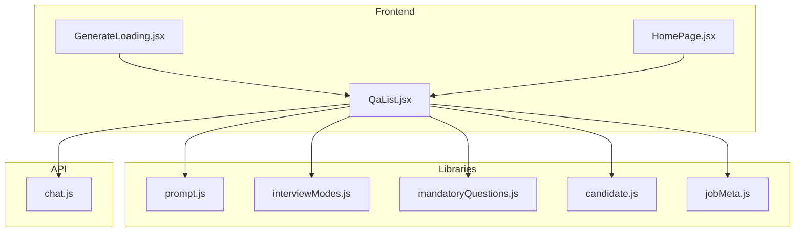
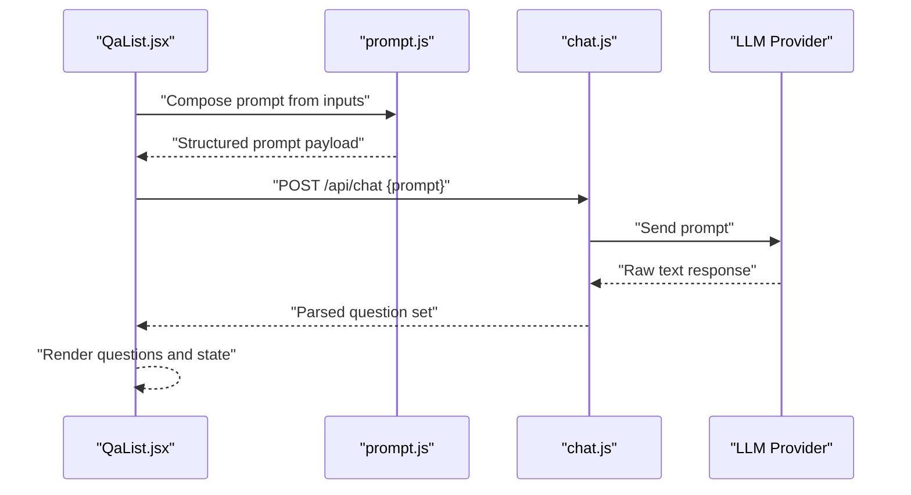
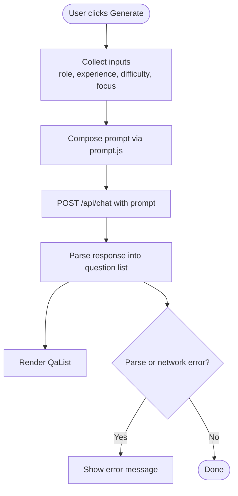
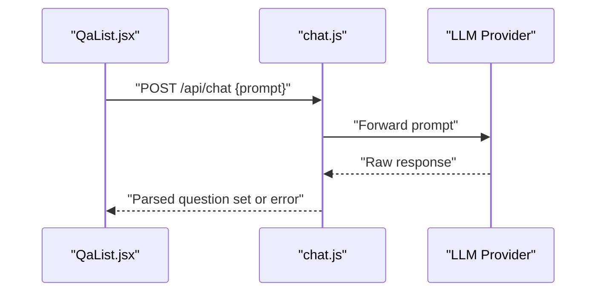
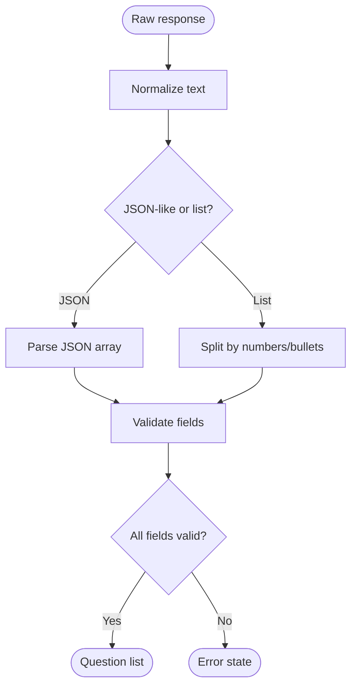
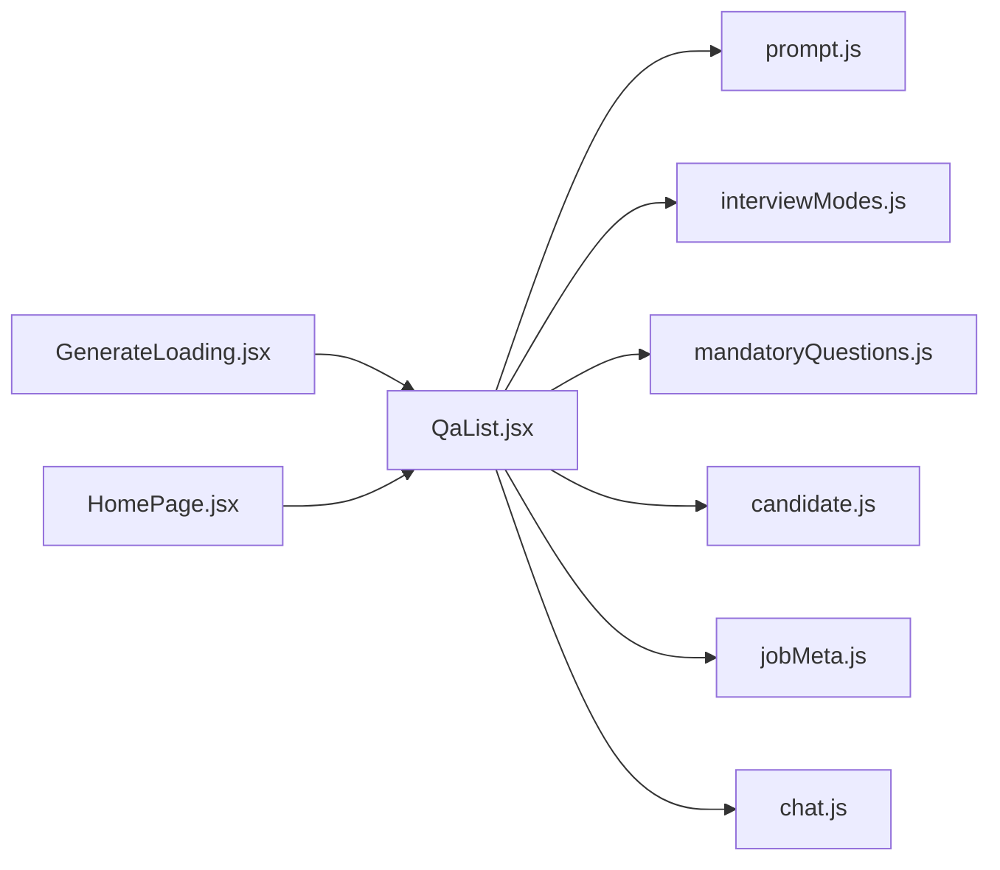

# Question Generation Engine

<cite>
**Referenced Files in This Document**
- [prompt.js](file://src/lib/prompt.js)
- [interviewModes.js](file://src/lib/interviewModes.js)
- [mandatoryQuestions.js](file://src/lib/mandatoryQuestions.js)
- [candidate.js](file://src/lib/candidate.js)
- [jobMeta.js](file://src/lib/jobMeta.js)
- [chat.js](file://api/chat.js)
- [QaList.jsx](file://src/components/QaList.jsx)
- [GenerateLoading.jsx](file://src/components/GenerateLoading.jsx)
- [HomePage.jsx](file://src/pages/HomePage.jsx)
</cite>

## Table of Contents
1. [Introduction](#introduction)
2. [Project Structure](#project-structure)
3. [Core Components](#core-components)
4. [Architecture Overview](#architecture-overview)
5. [Detailed Component Analysis](#detailed-component-analysis)
6. [Dependency Analysis](#dependency-analysis)
7. [Performance Considerations](#performance-considerations)
8. [Troubleshooting Guide](#troubleshooting-guide)
9. [Conclusion](#conclusion)

## Introduction
This document explains the Question Generation Engine that powers AI-driven interview question creation. It covers prompt engineering techniques, conversation flow management, and integration with the chat API. It also documents the types of questions generated (technical, behavioral, situational), customization parameters such as difficulty levels and focus areas, and how the system adapts to different job roles and experience levels. Finally, it includes examples of effective prompts, response parsing logic, and error handling strategies.

## Project Structure
The Question Generation Engine is implemented across a small set of focused modules:
- Prompt composition and templates live in a dedicated library module.
- Interview modes and role-specific configurations are centralized for reuse.
- Candidate and job metadata provide context for personalization.
- A server-side chat endpoint orchestrates calls to the LLM and returns structured results.
- UI components render the generated questions and manage user interactions.

**Diagram sources**
- [QaList.jsx](file://src/components/QaList.jsx)
- [GenerateLoading.jsx](file://src/components/GenerateLoading.jsx)
- [HomePage.jsx](file://src/pages/HomePage.jsx)
- [prompt.js](file://src/lib/prompt.js)
- [interviewModes.js](file://src/lib/interviewModes.js)
- [mandatoryQuestions.js](file://src/lib/mandatoryQuestions.js)
- [candidate.js](file://src/lib/candidate.js)
- [jobMeta.js](file://src/lib/jobMeta.js)
- [chat.js](file://api/chat.js)

**Section sources**
- [prompt.js](file://src/lib/prompt.js)
- [interviewModes.js](file://src/lib/interviewModes.js)
- [mandatoryQuestions.js](file://src/lib/mandatoryQuestions.js)
- [candidate.js](file://src/lib/candidate.js)
- [jobMeta.js](file://src/lib/jobMeta.js)
- [chat.js](file://api/chat.js)
- [QaList.jsx](file://src/components/QaList.jsx)
- [GenerateLoading.jsx](file://src/components/GenerateLoading.jsx)
- [HomePage.jsx](file://src/pages/HomePage.jsx)

## Core Components
- Prompt Builder: Composes structured prompts from templates and contextual inputs (role, experience, difficulty, focus areas). It ensures consistent formatting and constraints for reliable model responses.
- Interview Modes: Defines categories like technical, behavioral, and situational, along with mode-specific instructions and weighting.
- Mandatory Questions: Provides baseline questions that must be included regardless of other customizations.
- Candidate Context: Supplies candidate profile data (skills, years of experience, target role) used to tailor prompts.
- Job Metadata: Adds role-specific requirements and keywords to refine question generation.
- Chat API Integration: Server-side handler that receives composed prompts and returns parsed question sets.
- UI Orchestration: Frontend components that collect user inputs, trigger generation, display results, and handle loading/error states.

**Section sources**
- [prompt.js](file://src/lib/prompt.js)
- [interviewModes.js](file://src/lib/interviewModes.js)
- [mandatoryQuestions.js](file://src/lib/mandatoryQuestions.js)
- [candidate.js](file://src/lib/candidate.js)
- [jobMeta.js](file://src/lib/jobMeta.js)
- [chat.js](file://api/chat.js)
- [QaList.jsx](file://src/components/QaList.jsx)
- [GenerateLoading.jsx](file://src/components/GenerateLoading.jsx)

## Architecture Overview
The engine follows a clear pipeline:
1. The UI collects user preferences (role, experience, difficulty, focus areas).
2. The prompt builder composes a structured prompt using templates and contextual data.
3. The chat API endpoint sends the prompt to the LLM and returns a response.
4. The frontend parses the response into a list of questions and renders them.

**Diagram sources**
- [QaList.jsx](file://src/components/QaList.jsx)
- [prompt.js](file://src/lib/prompt.js)
- [chat.js](file://api/chat.js)

## Detailed Component Analysis

### Prompt Engineering and Templates
- Purpose: Convert user inputs and contextual metadata into a deterministic prompt structure that guides the LLM to produce high-quality, well-formatted questions.
- Techniques:
  - Role and experience anchoring: Include target role and years of experience to calibrate complexity.
  - Difficulty scaling: Explicitly instruct the model on expected depth and breadth based on difficulty level.
  - Focus area injection: Add domain-specific topics or skills to narrow scope.
  - Mode selection: Specify whether to generate technical, behavioral, or situational questions.
  - Output constraints: Enforce JSON-like structure or numbered lists for easier parsing.
  - Mandatory inclusion: Ensure certain baseline questions are always present.
- Example prompt patterns:
  - Technical: “Generate N technical questions for a {role} with {experience} years focusing on {focus_areas}. Use difficulty {difficulty}.”
  - Behavioral: “Create N behavioral questions tailored to {role}, emphasizing {focus_areas}, at difficulty {difficulty}.”
  - Situational: “Provide N situational scenarios for {role} with {experience} years, aligned to {focus_areas} and difficulty {difficulty}.”

**Section sources**
- [prompt.js](file://src/lib/prompt.js)
- [interviewModes.js](file://src/lib/interviewModes.js)
- [mandatoryQuestions.js](file://src/lib/mandatoryQuestions.js)

### Interview Modes and Customization Parameters
- Modes:
  - Technical: Focuses on domain knowledge, problem-solving, and implementation details.
  - Behavioral: Emphasizes past experiences, teamwork, leadership, and conflict resolution.
  - Situational: Presents hypothetical scenarios requiring judgment and decision-making.
- Customization parameters:
  - Difficulty levels: Beginner, Intermediate, Advanced; influences depth and specificity.
  - Focus areas: Specific technologies, competencies, or soft skills.
  - Role adaptation: Uses job metadata and candidate profile to align terminology and expectations.
  - Experience alignment: Adjusts complexity based on years of experience and career stage.

**Section sources**
- [interviewModes.js](file://src/lib/interviewModes.js)
- [jobMeta.js](file://src/lib/jobMeta.js)
- [candidate.js](file://src/lib/candidate.js)

### Conversation Flow Management
- Input collection: UI gathers role, experience, difficulty, and focus areas.
- Prompt assembly: Libraries compose a single, cohesive prompt per request.
- Request dispatch: UI posts the prompt to the chat API.
- Response handling: UI parses the returned structure and updates the question list.
- State transitions: Loading while generating, success when parsed, error if parsing fails or network errors occur.

**Diagram sources**
- [QaList.jsx](file://src/components/QaList.jsx)
- [prompt.js](file://src/lib/prompt.js)
- [chat.js](file://api/chat.js)

**Section sources**
- [QaList.jsx](file://src/components/QaList.jsx)
- [GenerateLoading.jsx](file://src/components/GenerateLoading.jsx)

### Chat API Integration
- Endpoint: POST /api/chat
- Request payload: Structured prompt string or object containing role, experience, difficulty, focus areas, and mode.
- Response format: Parsed question set (e.g., array of question objects or structured text).
- Error handling: Network timeouts, invalid payloads, and model errors are surfaced to the UI with user-friendly messages.

**Diagram sources**
- [QaList.jsx](file://src/components/QaList.jsx)
- [chat.js](file://api/chat.js)

**Section sources**
- [chat.js](file://api/chat.js)
- [QaList.jsx](file://src/components/QaList.jsx)

### Response Parsing Logic
- Expected input: Either a structured JSON-like block or a clearly delimited list of questions.
- Parsing steps:
  - Normalize whitespace and line breaks.
  - Extract numbered items or JSON arrays.
  - Validate presence of required fields (question text, optional category, optional tags).
  - Map categories to interview modes (technical, behavioral, situational).
- Fallback behavior: If parsing fails, return an error state and prompt the user to retry or adjust inputs.

**Diagram sources**
- [QaList.jsx](file://src/components/QaList.jsx)
- [prompt.js](file://src/lib/prompt.js)

**Section sources**
- [QaList.jsx](file://src/components/QaList.jsx)
- [prompt.js](file://src/lib/prompt.js)

### Error Handling Strategies
- Network errors: Timeouts, connectivity issues, and CORS problems are caught and displayed with actionable guidance.
- Validation errors: Missing or malformed payloads result in immediate feedback before sending to the API.
- Model errors: Non-200 responses or unexpected formats trigger fallback parsing and user notifications.
- Retry mechanism: Optional exponential backoff or manual retry button after transient failures.

**Section sources**
- [QaList.jsx](file://src/components/QaList.jsx)
- [chat.js](file://api/chat.js)

## Dependency Analysis
The following diagram shows key dependencies between modules involved in question generation:

**Diagram sources**
- [QaList.jsx](file://src/components/QaList.jsx)
- [prompt.js](file://src/lib/prompt.js)
- [interviewModes.js](file://src/lib/interviewModes.js)
- [mandatoryQuestions.js](file://src/lib/mandatoryQuestions.js)
- [candidate.js](file://src/lib/candidate.js)
- [jobMeta.js](file://src/lib/jobMeta.js)
- [chat.js](file://api/chat.js)
- [GenerateLoading.jsx](file://src/components/GenerateLoading.jsx)
- [HomePage.jsx](file://src/pages/HomePage.jsx)

**Section sources**
- [QaList.jsx](file://src/components/QaList.jsx)
- [prompt.js](file://src/lib/prompt.js)
- [interviewModes.js](file://src/lib/interviewModes.js)
- [mandatoryQuestions.js](file://src/lib/mandatoryQuestions.js)
- [candidate.js](file://src/lib/candidate.js)
- [jobMeta.js](file://src/lib/jobMeta.js)
- [chat.js](file://api/chat.js)
- [GenerateLoading.jsx](file://src/components/GenerateLoading.jsx)
- [HomePage.jsx](file://src/pages/HomePage.jsx)

## Performance Considerations
- Prompt size control: Keep prompts concise to reduce latency and token usage.
- Caching: Cache common role-mode-difficulty combinations to avoid redundant requests.
- Streaming: If supported, stream partial results to improve perceived performance.
- Batch generation: Allow users to request multiple sets with controlled concurrency.
- Error resilience: Implement retries with backoff and graceful degradation.

[No sources needed since this section provides general guidance]

## Troubleshooting Guide
Common issues and resolutions:
- Empty or malformed responses:
  - Verify output constraints in the prompt template.
  - Check parsing logic for expected delimiters or JSON structures.
- Incorrect difficulty or focus:
  - Review customization parameters passed to the prompt builder.
  - Ensure role and experience values are correctly mapped.
- Network failures:
  - Inspect API endpoint availability and credentials.
  - Confirm CORS settings and timeout thresholds.
- UI not updating:
  - Validate state transitions in the UI component.
  - Ensure loading and error states are properly handled.

**Section sources**
- [QaList.jsx](file://src/components/QaList.jsx)
- [prompt.js](file://src/lib/prompt.js)
- [chat.js](file://api/chat.js)

## Conclusion
The Question Generation Engine combines modular prompt engineering, role-aware customization, and robust API integration to deliver high-quality interview questions. By enforcing structured outputs, supporting multiple question types, and adapting to candidate profiles, it provides a flexible and scalable solution for interview preparation. Proper error handling and performance optimizations ensure reliability and responsiveness across diverse use cases.

[No sources needed since this section summarizes without analyzing specific files]