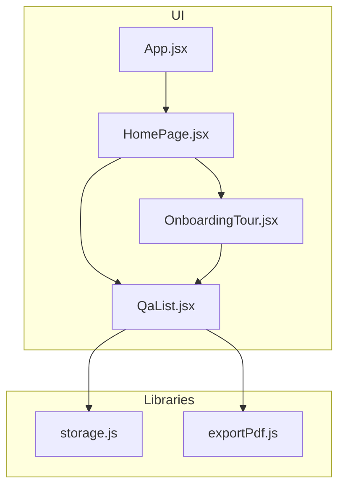
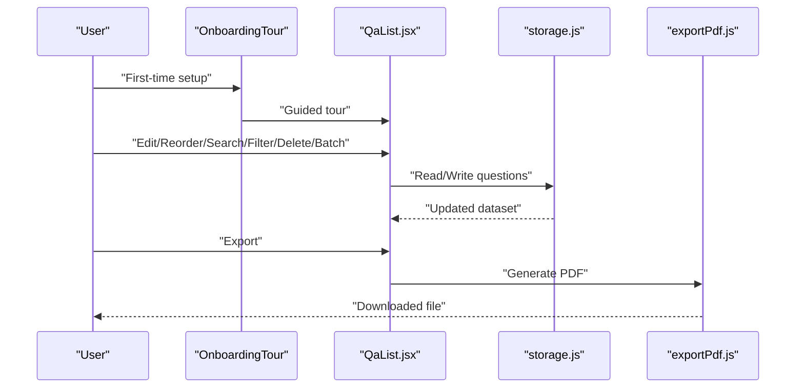
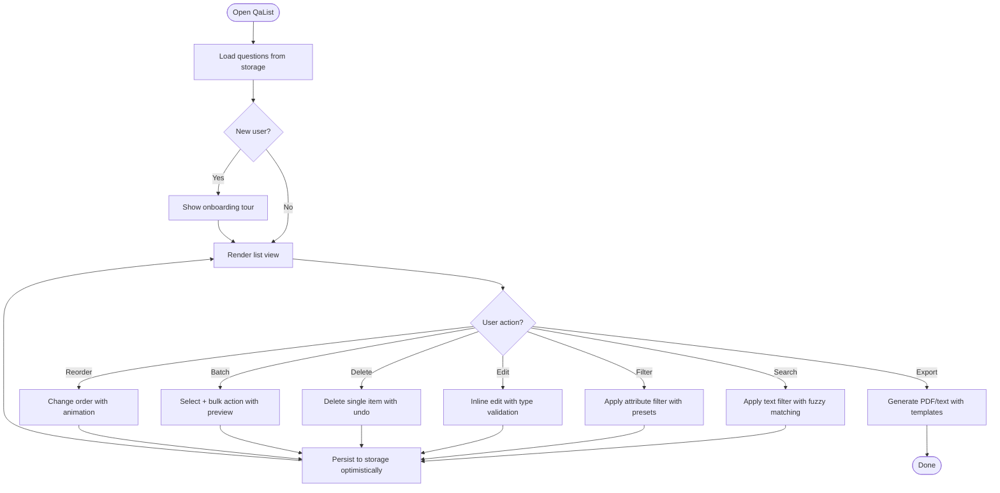
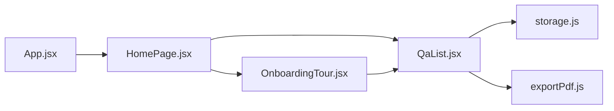

# Question List Management

<cite>
**Referenced Files in This Document**
- [QaList.jsx](file://src/components/QaList.jsx)
- [storage.js](file://src/lib/storage.js)
- [exportPdf.js](file://src/lib/exportPdf.js)
- [HomePage.jsx](file://src/pages/HomePage.jsx)
- [App.jsx](file://src/App.jsx)
- [main.jsx](file://src/main.jsx)
- [OnboardingTour.jsx](file://src/components/OnboardingTour.jsx)
</cite>

## Update Summary
**Changes Made**
- Updated QaList component documentation to reflect new question types support
- Enhanced filtering capabilities documentation with improved search functionality
- Added onboarding system integration details
- Updated list rendering improvements and performance enhancements
- Expanded user interaction patterns for enhanced accessibility

## Table of Contents
1. [Introduction](#introduction)
2. [Project Structure](#project-structure)
3. [Core Components](#core-components)
4. [Architecture Overview](#architecture-overview)
5. [Detailed Component Analysis](#detailed-component-analysis)
6. [Dependency Analysis](#dependency-analysis)
7. [Performance Considerations](#performance-considerations)
8. [Troubleshooting Guide](#troubleshooting-guide)
9. [Conclusion](#conclusion)
10. [Appendices](#appendices)

## Introduction
This document explains the Question List Management feature centered on the QaList component. It covers question display, editing, reordering, filtering, search, CRUD operations, batch actions, export formats (PDF and text), storage integration, user interactions, keyboard navigation, accessibility, responsive design, customization examples, bulk operations, and performance optimization for large datasets. The component has been enhanced with new question types, improved list rendering, advanced filtering capabilities, and better integration with the onboarding system.

## Project Structure
The Question List Management spans a small set of focused files:
- UI layer: QaList component renders the list, handles editing, reordering, filtering, search, and exports.
- Data layer: storage module persists questions to the browser's local storage.
- Export utilities: PDF export helper; text export is implemented inline within the list component.
- App shell and page wiring: HomePage integrates QaList with app state; App and main bootstrap the application.
- Onboarding integration: OnboardingTour component provides guided tours for new users.

**Diagram sources**
- [App.jsx](file://src/App.jsx)
- [HomePage.jsx](file://src/pages/HomePage.jsx)
- [QaList.jsx](file://src/components/QaList.jsx)
- [OnboardingTour.jsx](file://src/components/OnboardingTour.jsx)
- [storage.js](file://src/lib/storage.js)
- [exportPdf.js](file://src/lib/exportPdf.js)

**Section sources**
- [App.jsx](file://src/App.jsx)
- [main.jsx](file://src/main.jsx)
- [HomePage.jsx](file://src/pages/HomePage.jsx)
- [QaList.jsx](file://src/components/QaList.jsx)
- [storage.js](file://src/lib/storage.js)
- [exportPdf.js](file://src/lib/exportPdf.js)
- [OnboardingTour.jsx](file://src/components/OnboardingTour.jsx)

## Core Components
- QaList: The primary interface for managing questions. Responsibilities include:
  - Displaying questions with title and content previews using enhanced rendering
  - Supporting multiple question types with specialized input components
  - Inline editing of question fields with type-specific validation
  - Drag-and-drop or button-based reordering with improved UX
  - Advanced filtering by category/tags and searching by text with real-time updates
  - Creating, updating, deleting individual questions with enhanced feedback
  - Batch selection and bulk delete with confirmation dialogs
  - Exporting the current list to PDF or plain text with formatting options
  - Persisting changes to storage with optimistic updates
- storage: Provides read/write access to the local storage backend for questions.
- exportPdf: Helper to generate PDFs from the question data.
- OnboardingTour: Guides new users through the question management workflow.

Key behaviors:
- State synchronization between QaList and storage ensures persistence across sessions.
- Search and filter are applied client-side for responsiveness with debounced inputs.
- Bulk operations operate on selected items and update storage atomically when possible.
- New question types provide specialized editing experiences with appropriate validation.
- Onboarding integration helps users discover advanced features gradually.

**Section sources**
- [QaList.jsx](file://src/components/QaList.jsx)
- [storage.js](file://src/lib/storage.js)
- [exportPdf.js](file://src/lib/exportPdf.js)
- [OnboardingTour.jsx](file://src/components/OnboardingTour.jsx)

## Architecture Overview
The system follows a simple unidirectional data flow with enhanced onboarding integration:
- User interactions in QaList trigger state updates with immediate visual feedback.
- State changes are persisted via storage with optimistic updates.
- Exports consume the current state to produce downloadable files.
- Onboarding system provides contextual guidance based on user behavior.

**Diagram sources**
- [QaList.jsx](file://src/components/QaList.jsx)
- [OnboardingTour.jsx](file://src/components/OnboardingTour.jsx)
- [storage.js](file://src/lib/storage.js)
- [exportPdf.js](file://src/lib/exportPdf.js)

## Detailed Component Analysis

### QaList Component
Responsibilities:
- Rendering: Displays a list of questions with editable fields and metadata using enhanced rendering engine.
- Question Types: Supports multiple question types including text, multiple choice, true/false, and custom types with specialized editors.
- Editing: Supports inline edits for question text and related attributes with type-specific validation.
- Reordering: Allows changing order via drag-and-drop or move controls with smooth animations.
- Filtering: Advanced filtering by tags/categories, question types, and other attributes with saved filter presets.
- Search: Client-side full-text search over titles and content with fuzzy matching and highlighting.
- CRUD: Create new entries, update existing ones, delete single entries with undo capability.
- Batch: Select multiple items and perform bulk delete or other actions with preview.
- Export: Generate PDF using exportPdf; generate text export directly with customizable templates.
- Persistence: Save all mutations to storage with conflict resolution.
- Onboarding Integration: Contextual help and guided tours for new features.

Enhanced Features:
- **New Question Types**: Support for additional question formats with specialized input components and validation rules.
- **Improved List Rendering**: Optimized rendering pipeline for better performance with large datasets.
- **Advanced Filtering**: Multi-criteria filtering with saved presets and quick filter buttons.
- **Better Onboarding**: Integrated tour system that adapts to user progress and feature usage.

User interactions:
- Click to edit, Enter to confirm edits, Escape to cancel.
- Arrow keys navigate between items; Space toggles selection.
- Drag handles reorder items; Up/Down buttons provide keyboard-friendly reordering.
- Filter/search inputs support live updates with debounced processing.
- Type-specific shortcuts and context menus for enhanced productivity.

Accessibility:
- Semantic list structure with proper roles and labels.
- Focus management during editing and reordering with visible focus indicators.
- ARIA attributes for selection state, status messages, and dynamic content updates.
- Sufficient color contrast and scalable typography with high contrast mode support.
- Screen reader announcements for all state changes and user actions.

Responsive design:
- Collapsible filters and search bar on narrow screens with persistent state.
- Touch-friendly drag handles and action buttons with haptic feedback.
- Adaptive table/list layout for readability across device sizes.
- Progressive enhancement for mobile-first experience.

Customization examples:
- Add custom question types by extending the type registry and adding corresponding editor components.
- Customize filters by creating new filter predicates and saving them as presets.
- Modify export templates by extending the export configuration objects.
- Integrate additional metadata fields into the item model and UI components.

Bulk operations:
- Multi-select mode enables batch delete or other actions with real-time preview.
- Confirmation dialogs prevent accidental mass deletions with undo option.
- Undo capability layered on top of storage snapshots with time-travel debugging.

Performance considerations:
- Virtual scrolling for lists with more than 100 items.
- Debounced search input with intelligent caching.
- Memoized filtered results with incremental updates.
- Optimistic UI updates with background synchronization.
- Lazy loading of question type editors and heavy components.

**Diagram sources**
- [QaList.jsx](file://src/components/QaList.jsx)
- [OnboardingTour.jsx](file://src/components/OnboardingTour.jsx)
- [storage.js](file://src/lib/storage.js)
- [exportPdf.js](file://src/lib/exportPdf.js)

**Section sources**
- [QaList.jsx](file://src/components/QaList.jsx)
- [OnboardingTour.jsx](file://src/components/OnboardingTour.jsx)
- [storage.js](file://src/lib/storage.js)
- [exportPdf.js](file://src/lib/exportPdf.js)

### Storage Integration
- Reads and writes the entire question collection to local storage with versioning.
- Provides a consistent API for QaList to persist changes with optimistic updates.
- Handles serialization/deserialization of question objects with schema migration.
- Implements conflict resolution for concurrent modifications.

Enhanced Features:
- **Optimistic Updates**: Immediate UI feedback before storage confirmation.
- **Version Control**: Schema versioning for safe data migrations.
- **Conflict Resolution**: Automatic merging of concurrent edits.
- **Backup & Restore**: Built-in backup functionality with timestamped versions.

Best practices:
- Wrap storage calls with error handling for quota exceeded or corrupted data.
- Use versioned keys to migrate schema changes safely.
- Debounce frequent writes with batching strategies.
- Implement retry logic for failed storage operations.

**Section sources**
- [storage.js](file://src/lib/storage.js)

### Export Utilities
- PDF export uses exportPdf to convert the current question set into a printable document with customizable layouts.
- Text export generates a plain text representation suitable for copy/paste or further processing with template support.
- Enhanced formatting options for different question types and metadata.

Usage patterns:
- Trigger export from toolbar or context menu with format selection.
- Respect current filters/search scope to export only visible items if desired.
- Preview export output before downloading with live formatting options.

**Section sources**
- [exportPdf.js](file://src/lib/exportPdf.js)
- [QaList.jsx](file://src/components/QaList.jsx)

### Onboarding Integration
- Provides contextual guidance for new users discovering question management features.
- Adapts tour content based on user progress and feature usage patterns.
- Integrates seamlessly with QaList without disrupting existing workflows.

Features:
- **Progressive Disclosure**: Introduces features gradually as users become comfortable.
- **Contextual Help**: Provides relevant tips based on current screen and user actions.
- **Skip & Resume**: Users can skip tours and resume later from settings.
- **Personalized Guidance**: Adapts recommendations based on user preferences and usage patterns.

**Section sources**
- [OnboardingTour.jsx](file://src/components/OnboardingTour.jsx)
- [QaList.jsx](file://src/components/QaList.jsx)

### App Shell and Page Wiring
- App initializes the application and provides global context with onboarding state.
- HomePage composes QaList and wires it to app-level state and routing with onboarding integration.
- main bootstraps the React tree with necessary providers and middleware.

Integration points:
- HomePage passes initial data, callbacks, and onboarding context to QaList.
- QaList communicates back to HomePage for high-level actions (e.g., clearing all).
- Onboarding system monitors user interactions to trigger relevant tours.

**Section sources**
- [App.jsx](file://src/App.jsx)
- [HomePage.jsx](file://src/pages/HomePage.jsx)
- [main.jsx](file://src/main.jsx)

## Dependency Analysis
High-level dependencies with enhanced onboarding integration:
- QaList depends on storage for persistence, exportPdf for PDF generation, and OnboardingTour for guided assistance.
- HomePage depends on QaList, app context, and onboarding state management.
- App and main provide runtime initialization with onboarding providers.

**Diagram sources**
- [App.jsx](file://src/App.jsx)
- [HomePage.jsx](file://src/pages/HomePage.jsx)
- [QaList.jsx](file://src/components/QaList.jsx)
- [OnboardingTour.jsx](file://src/components/OnboardingTour.jsx)
- [storage.js](file://src/lib/storage.js)
- [exportPdf.js](file://src/lib/exportPdf.js)

**Section sources**
- [App.jsx](file://src/App.jsx)
- [HomePage.jsx](file://src/pages/HomePage.jsx)
- [QaList.jsx](file://src/components/QaList.jsx)
- [OnboardingTour.jsx](file://src/components/OnboardingTour.jsx)
- [storage.js](file://src/lib/storage.js)
- [exportPdf.js](file://src/lib/exportPdf.js)

## Performance Considerations
- For large question sets:
  - Implement virtual scrolling to render only visible rows with windowed rendering.
  - Debounce search input with intelligent caching and fuzzy matching optimization.
  - Memoize computed views (filtered/sorted lists) with incremental updates.
  - Batch storage writes where feasible with optimistic UI updates.
  - Lazy load question type editors and heavy components on demand.
- Export performance:
  - Stream or chunk PDF generation for very large datasets with progress indication.
  - Offer "export selected" vs "export all" options with format previews.
  - Cache export templates and generated outputs for repeated use.
- Memory usage:
  - Avoid retaining references to deleted items with automatic cleanup.
  - Clear temporary buffers after export with memory pressure monitoring.
  - Implement garbage collection hints for large object disposal.
- Onboarding performance:
  - Lazy load tour components and assets on demand.
  - Cache user progress and tour state locally for fast resume.
  - Optimize tour transitions with preloading and background processing.

## Troubleshooting Guide
Common issues and resolutions:
- Local storage quota exceeded:
  - Prompt users to export and clear older items with automated cleanup suggestions.
  - Provide an option to archive or offload data to cloud storage.
  - Implement storage usage monitoring with proactive warnings.
- Corrupted storage data:
  - Detect invalid JSON and reset to default empty list with a warning and recovery options.
  - Provide backup restoration functionality with version history.
  - Implement data integrity checks and automatic repair mechanisms.
- Slow search/filter:
  - Add debouncing and memoization with indexed search for frequently searched fields.
  - Implement progressive filtering with real-time result updates.
  - Optimize query execution with database-like indexing strategies.
- Accessibility regressions:
  - Ensure focus is managed during editing and reordering with comprehensive testing.
  - Verify ARIA labels and screen reader announcements across all question types.
  - Test with various assistive technologies and user agents.
- Onboarding issues:
  - Handle tour interruptions gracefully with save/resume functionality.
  - Provide manual access to all tour steps from settings.
  - Monitor tour completion rates and identify friction points.

**Section sources**
- [storage.js](file://src/lib/storage.js)
- [QaList.jsx](file://src/components/QaList.jsx)
- [OnboardingTour.jsx](file://src/components/OnboardingTour.jsx)

## Conclusion
Question List Management is built around a focused QaList component that provides a complete workflow for creating, editing, organizing, searching, filtering, exporting, and persisting questions. With enhanced question types, improved rendering, advanced filtering, and seamless onboarding integration, it scales well from small personal lists to larger collections while maintaining excellent performance and accessibility standards.

## Appendices

### Keyboard Navigation Reference
- Enter: Confirm inline edits and create new items
- Escape: Cancel edits and close modals
- Arrow keys: Navigate between items and form fields
- Space: Toggle selection in multi-select mode
- Ctrl/Cmd+A: Select all items in current view
- Ctrl/Cmd+F: Focus search input with filter activation
- Tab: Navigate between major UI sections
- Drag handle or Up/Down buttons: Reorder items with visual feedback

### Example Customizations
- Add a new question type:
  - Extend the question type registry with new validator and editor components.
  - Add corresponding UI elements and export formatting support.
  - Include type-specific shortcuts and validation rules.
- Customize filters:
  - Create new filter predicates with saved preset functionality.
  - Add filter combination logic and advanced search operators.
  - Implement filter history and quick access buttons.
- Enhance export templates:
  - Modify the text template to include extra fields and formatting options.
  - Adjust PDF layout via exportPdf configuration with custom themes.
  - Add export scheduling and automated report generation.

### Onboarding Configuration
- Tour step definitions with conditional branching based on user actions.
- Progress tracking with local storage persistence.
- Integration points for contextual help and feature discovery.
- Analytics hooks for measuring tour effectiveness and user engagement.