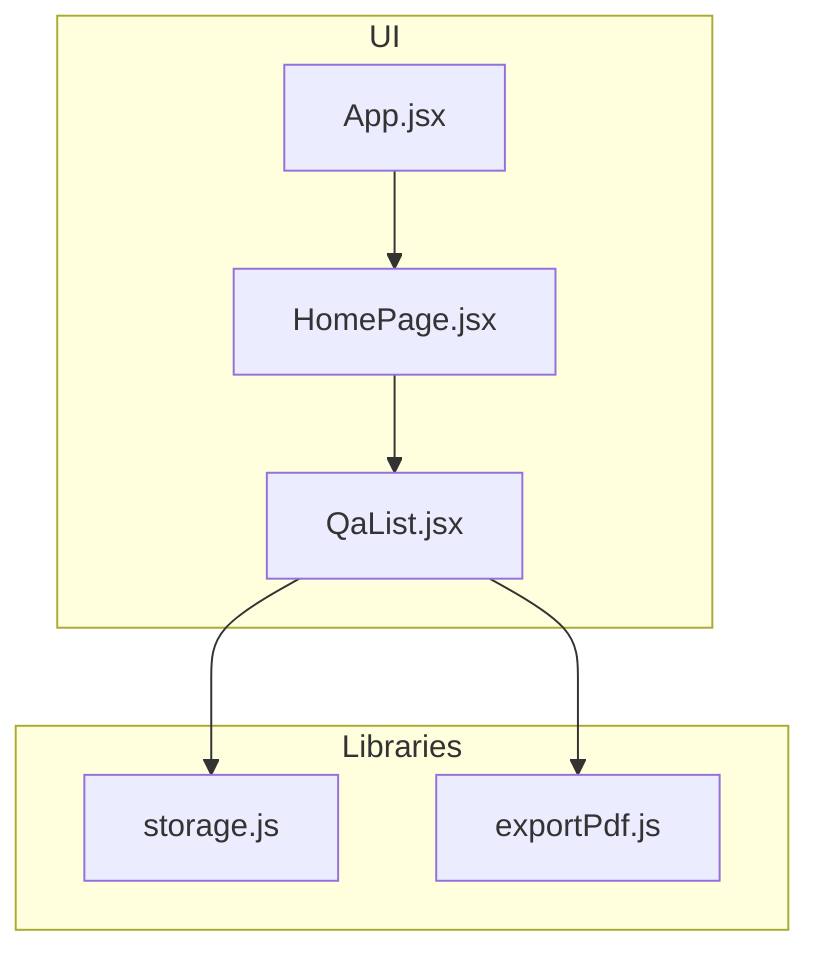
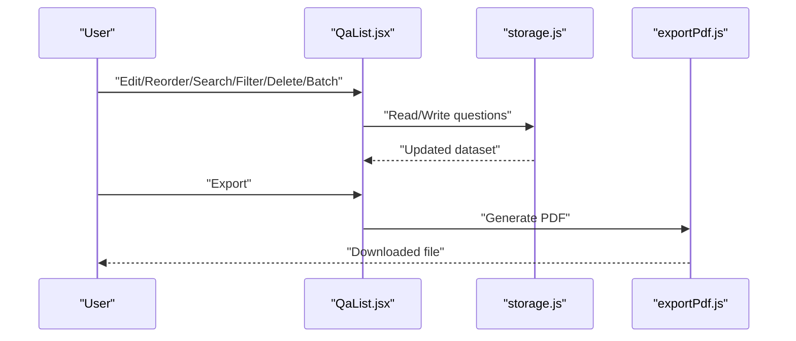
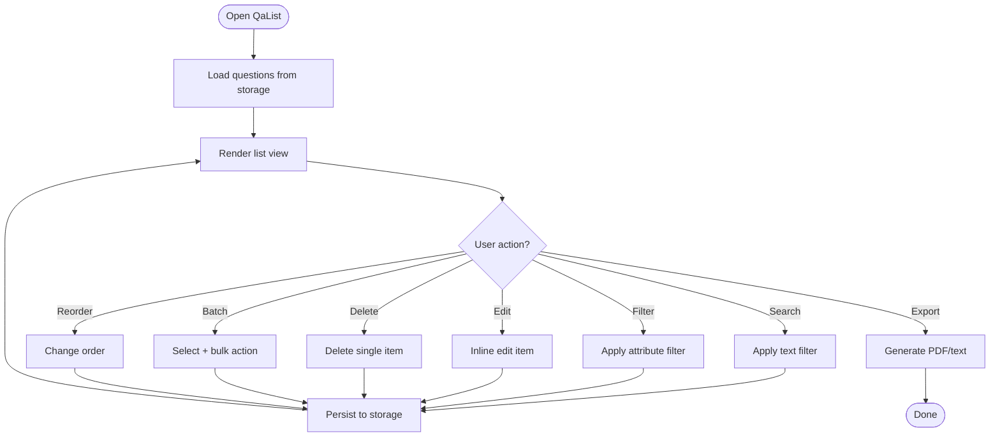
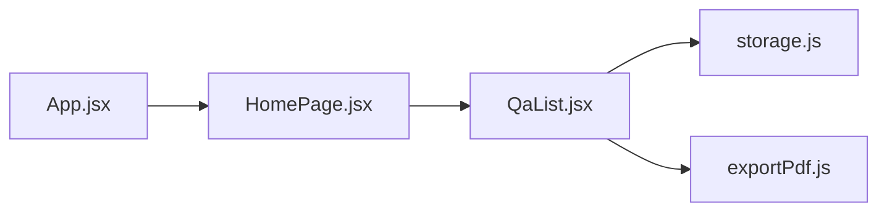

# Question List Management

<cite>
**Referenced Files in This Document**
- [QaList.jsx](file://src/components/QaList.jsx)
- [storage.js](file://src/lib/storage.js)
- [exportPdf.js](file://src/lib/exportPdf.js)
- [HomePage.jsx](file://src/pages/HomePage.jsx)
- [App.jsx](file://src/App.jsx)
- [main.jsx](file://src/main.jsx)
</cite>

## Table of Contents
1. [Introduction](#introduction)
2. [Project Structure](#project-structure)
3. [Core Components](#core-components)
4. [Architecture Overview](#architecture-overview)
5. [Detailed Component Analysis](#detailed-component-analysis)
6. [Dependency Analysis](#dependency-analysis)
7. [Performance Considerations](#performance-considerations)
8. [Troubleshooting Guide](#troubleshooting-guide)
9. [Conclusion](#conclusion)
10. [Appendices](#appendices)

## Introduction
This document explains the Question List Management feature centered on the QaList component. It covers question display, editing, reordering, filtering, search, CRUD operations, batch actions, export formats (PDF and text), storage integration, user interactions, keyboard navigation, accessibility, responsive design, customization examples, bulk operations, and performance optimization for large datasets.

## Project Structure
The Question List Management spans a small set of focused files:
- UI layer: QaList component renders the list, handles editing, reordering, filtering, search, and exports.
- Data layer: storage module persists questions to the browser’s local storage.
- Export utilities: PDF export helper; text export is implemented inline within the list component.
- App shell and page wiring: HomePage integrates QaList with app state; App and main bootstrap the application.

**Diagram sources**
- [App.jsx](file://src/App.jsx)
- [HomePage.jsx](file://src/pages/HomePage.jsx)
- [QaList.jsx](file://src/components/QaList.jsx)
- [storage.js](file://src/lib/storage.js)
- [exportPdf.js](file://src/lib/exportPdf.js)

**Section sources**
- [App.jsx](file://src/App.jsx)
- [main.jsx](file://src/main.jsx)
- [HomePage.jsx](file://src/pages/HomePage.jsx)
- [QaList.jsx](file://src/components/QaList.jsx)
- [storage.js](file://src/lib/storage.js)
- [exportPdf.js](file://src/lib/exportPdf.js)

## Core Components
- QaList: The primary interface for managing questions. Responsibilities include:
  - Displaying questions with title and content previews
  - Inline editing of question fields
  - Drag-and-drop or button-based reordering
  - Filtering by category/tags and searching by text
  - Creating, updating, deleting individual questions
  - Batch selection and bulk delete
  - Exporting the current list to PDF or plain text
  - Persisting changes to storage
- storage: Provides read/write access to the local storage backend for questions.
- exportPdf: Helper to generate PDFs from the question data.

Key behaviors:
- State synchronization between QaList and storage ensures persistence across sessions.
- Search and filter are applied client-side for responsiveness.
- Bulk operations operate on selected items and update storage atomically when possible.

**Section sources**
- [QaList.jsx](file://src/components/QaList.jsx)
- [storage.js](file://src/lib/storage.js)
- [exportPdf.js](file://src/lib/exportPdf.js)

## Architecture Overview
The system follows a simple unidirectional data flow:
- User interactions in QaList trigger state updates.
- State changes are persisted via storage.
- Exports consume the current state to produce downloadable files.

**Diagram sources**
- [QaList.jsx](file://src/components/QaList.jsx)
- [storage.js](file://src/lib/storage.js)
- [exportPdf.js](file://src/lib/exportPdf.js)

## Detailed Component Analysis

### QaList Component
Responsibilities:
- Rendering: Displays a list of questions with editable fields and metadata.
- Editing: Supports inline edits for question text and related attributes.
- Reordering: Allows changing order via drag-and-drop or move controls.
- Filtering: Filters by tags/categories or other attributes.
- Search: Client-side full-text search over titles and content.
- CRUD: Create new entries, update existing ones, delete single entries.
- Batch: Select multiple items and perform bulk delete or other actions.
- Export: Generate PDF using exportPdf; generate text export directly.
- Persistence: Save all mutations to storage.

User interactions:
- Click to edit, Enter to confirm edits, Escape to cancel.
- Arrow keys navigate between items; Space toggles selection.
- Drag handles reorder items; Up/Down buttons provide keyboard-friendly reordering.
- Filter/search inputs support live updates.

Accessibility:
- Semantic list structure with proper roles and labels.
- Focus management during editing and reordering.
- ARIA attributes for selection state and status messages.
- Sufficient color contrast and scalable typography.

Responsive design:
- Collapsible filters and search bar on narrow screens.
- Touch-friendly drag handles and action buttons.
- Adaptive table/list layout for readability.

Customization examples:
- Add custom filters by extending the filter predicate.
- Customize export templates by modifying the text/PDF generation logic.
- Integrate additional metadata fields into the item model and UI.

Bulk operations:
- Multi-select mode enables batch delete or other actions.
- Confirmation dialogs prevent accidental mass deletions.
- Undo capability can be layered on top of storage snapshots.

Performance considerations:
- Virtualize long lists if needed.
- Debounce search input.
- Memoize filtered results.
- Avoid unnecessary re-renders by stabilizing props and state.

**Diagram sources**
- [QaList.jsx](file://src/components/QaList.jsx)
- [storage.js](file://src/lib/storage.js)
- [exportPdf.js](file://src/lib/exportPdf.js)

**Section sources**
- [QaList.jsx](file://src/components/QaList.jsx)
- [storage.js](file://src/lib/storage.js)
- [exportPdf.js](file://src/lib/exportPdf.js)

### Storage Integration
- Reads and writes the entire question collection to local storage.
- Provides a consistent API for QaList to persist changes.
- Handles serialization/deserialization of question objects.

Best practices:
- Wrap storage calls with error handling for quota exceeded or corrupted data.
- Use versioned keys to migrate schema changes safely.
- Debounce frequent writes if necessary.

**Section sources**
- [storage.js](file://src/lib/storage.js)

### Export Utilities
- PDF export uses exportPdf to convert the current question set into a printable document.
- Text export generates a plain text representation suitable for copy/paste or further processing.

Usage patterns:
- Trigger export from toolbar or context menu.
- Respect current filters/search scope to export only visible items if desired.

**Section sources**
- [exportPdf.js](file://src/lib/exportPdf.js)
- [QaList.jsx](file://src/components/QaList.jsx)

### App Shell and Page Wiring
- App initializes the application and provides global context.
- HomePage composes QaList and wires it to app-level state and routing.
- main bootstraps the React tree.

Integration points:
- HomePage passes initial data and callbacks to QaList.
- QaList communicates back to HomePage for high-level actions (e.g., clearing all).

**Section sources**
- [App.jsx](file://src/App.jsx)
- [HomePage.jsx](file://src/pages/HomePage.jsx)
- [main.jsx](file://src/main.jsx)

## Dependency Analysis
High-level dependencies:
- QaList depends on storage for persistence and exportPdf for PDF generation.
- HomePage depends on QaList and app context.
- App and main provide runtime initialization.

**Diagram sources**
- [App.jsx](file://src/App.jsx)
- [HomePage.jsx](file://src/pages/HomePage.jsx)
- [QaList.jsx](file://src/components/QaList.jsx)
- [storage.js](file://src/lib/storage.js)
- [exportPdf.js](file://src/lib/exportPdf.js)

**Section sources**
- [App.jsx](file://src/App.jsx)
- [HomePage.jsx](file://src/pages/HomePage.jsx)
- [QaList.jsx](file://src/components/QaList.jsx)
- [storage.js](file://src/lib/storage.js)
- [exportPdf.js](file://src/lib/exportPdf.js)

## Performance Considerations
- For large question sets:
  - Implement virtual scrolling to render only visible rows.
  - Debounce search input to reduce re-renders.
  - Memoize computed views (filtered/sorted lists).
  - Batch storage writes where feasible.
- Export performance:
  - Stream or chunk PDF generation for very large datasets.
  - Offer “export selected” vs “export all” options.
- Memory usage:
  - Avoid retaining references to deleted items.
  - Clear temporary buffers after export.

[No sources needed since this section provides general guidance]

## Troubleshooting Guide
Common issues and resolutions:
- Local storage quota exceeded:
  - Prompt users to export and clear older items.
  - Provide an option to archive or offload data.
- Corrupted storage data:
  - Detect invalid JSON and reset to default empty list with a warning.
- Slow search/filter:
  - Add debouncing and memoization; consider indexing frequently searched fields.
- Accessibility regressions:
  - Ensure focus is managed during editing and reordering.
  - Verify ARIA labels and screen reader announcements.

**Section sources**
- [storage.js](file://src/lib/storage.js)
- [QaList.jsx](file://src/components/QaList.jsx)

## Conclusion
Question List Management is built around a focused QaList component that provides a complete workflow for creating, editing, organizing, searching, filtering, exporting, and persisting questions. With thoughtful UX patterns, accessibility, and performance strategies, it scales well from small personal lists to larger collections.

[No sources needed since this section summarizes without analyzing specific files]

## Appendices

### Keyboard Navigation Reference
- Enter: Confirm inline edits
- Escape: Cancel edits
- Arrow keys: Navigate between items
- Space: Toggle selection in multi-select mode
- Drag handle or Up/Down buttons: Reorder items

[No sources needed since this section provides general guidance]

### Example Customizations
- Add a “Priority” field:
  - Extend the item model and add a column in the list.
  - Include sorting and filtering by priority.
- Customize export:
  - Modify the text template to include extra fields.
  - Adjust PDF layout via exportPdf configuration.

[No sources needed since this section provides general guidance]