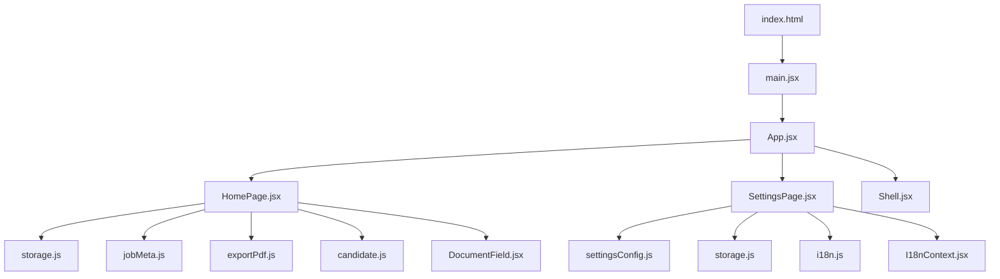
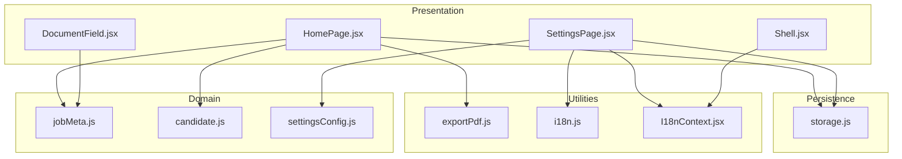
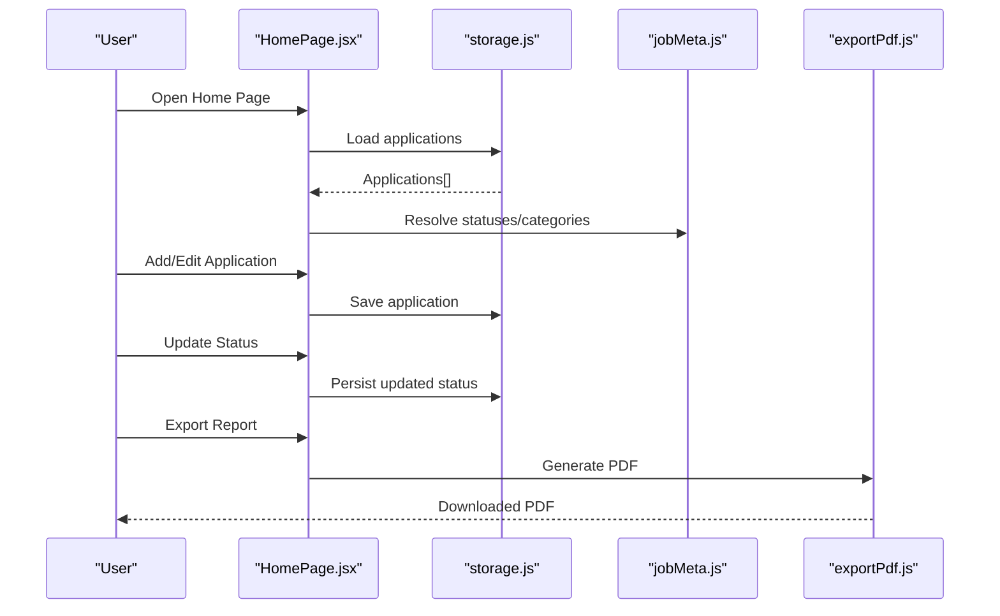
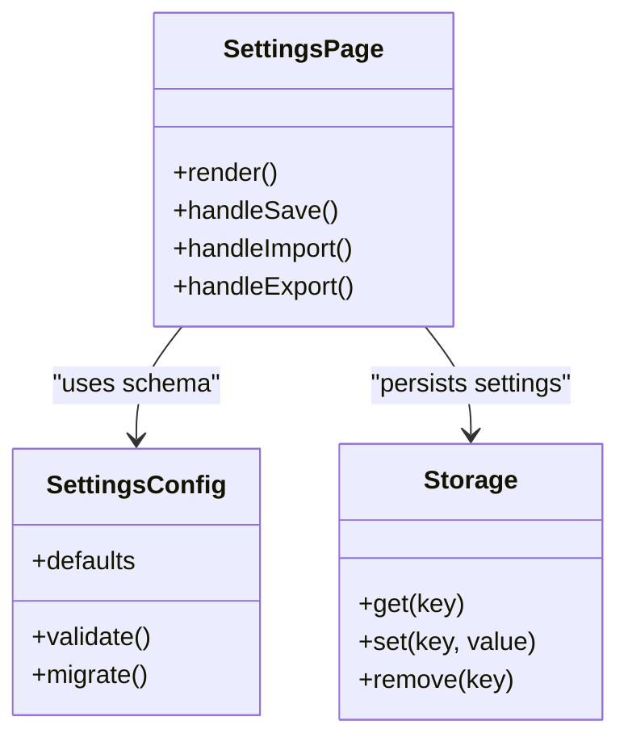
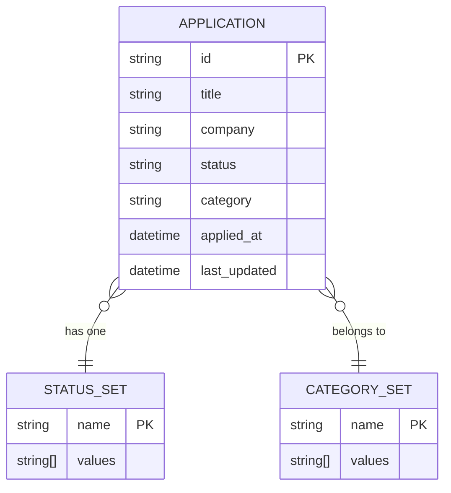
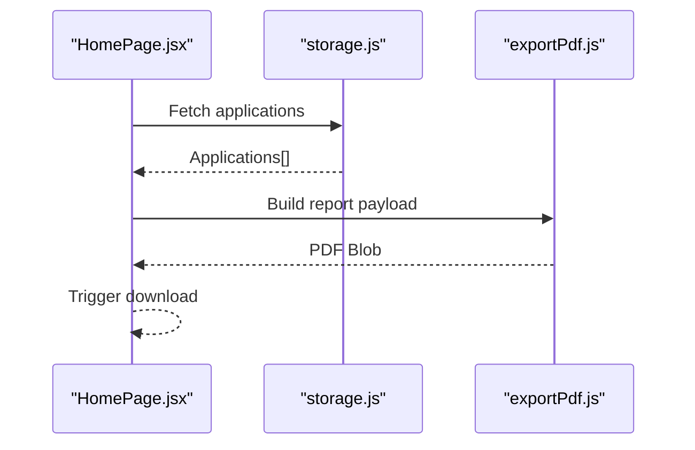
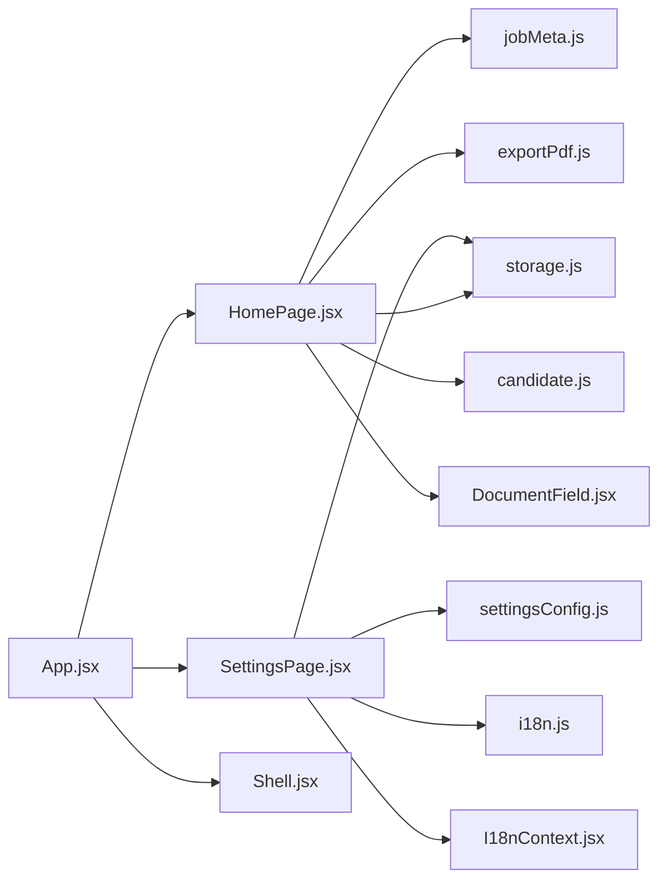

# Job Application Management

<cite>
**Referenced Files in This Document**
- [App.jsx](file://src/App.jsx)
- [HomePage.jsx](file://src/pages/HomePage.jsx)
- [SettingsPage.jsx](file://src/pages/SettingsPage.jsx)
- [storage.js](file://src/lib/storage.js)
- [settingsConfig.js](file://src/lib/settingsConfig.js)
- [jobMeta.js](file://src/lib/jobMeta.js)
- [exportPdf.js](file://src/lib/exportPdf.js)
- [candidate.js](file://src/lib/candidate.js)
- [i18n.js](file://src/lib/i18n.js)
- [I18nContext.jsx](file://src/lib/I18nContext.jsx)
- [DocumentField.jsx](file://src/components/DocumentField.jsx)
- [Shell.jsx](file://src/components/Shell.jsx)
- [index.html](file://index.html)
- [package.json](file://package.json)
</cite>

## Table of Contents
1. [Introduction](#introduction)
2. [Project Structure](#project-structure)
3. [Core Components](#core-components)
4. [Architecture Overview](#architecture-overview)
5. [Detailed Component Analysis](#detailed-component-analysis)
6. [Dependency Analysis](#dependency-analysis)
7. [Performance Considerations](#performance-considerations)
8. [Troubleshooting Guide](#troubleshooting-guide)
9. [Conclusion](#conclusion)
10. [Appendices](#appendices)

## Introduction
This document explains the Job Application Management system, focusing on how users can track job applications, manage application status, and organize their job search workflow. It covers the settings configuration interface, data persistence using local storage, and job metadata management. It also includes examples of application tracking workflows, status management patterns, and data import/export functionality, along with user preferences, application categories, and reporting features.

## Project Structure
The project is a React-based single-page application organized by feature areas:
- Pages: top-level views for home and settings
- Lib: shared utilities for storage, settings, job metadata, PDF export, internationalization, and candidate helpers
- Components: reusable UI elements such as document fields and shell layout
- Root: app entry point and HTML template

**Diagram sources**
- [index.html](file://index.html)
- [App.jsx](file://src/App.jsx)
- [HomePage.jsx](file://src/pages/HomePage.jsx)
- [SettingsPage.jsx](file://src/pages/SettingsPage.jsx)
- [storage.js](file://src/lib/storage.js)
- [jobMeta.js](file://src/lib/jobMeta.js)
- [exportPdf.js](file://src/lib/exportPdf.js)
- [settingsConfig.js](file://src/lib/settingsConfig.js)
- [candidate.js](file://src/lib/candidate.js)
- [i18n.js](file://src/lib/i18n.js)
- [I18nContext.jsx](file://src/lib/I18nContext.jsx)
- [DocumentField.jsx](file://src/components/DocumentField.jsx)
- [Shell.jsx](file://src/components/Shell.jsx)

**Section sources**
- [index.html](file://index.html)
- [package.json](file://package.json)

## Core Components
- App entrypoint: initializes routing and global providers (e.g., i18n context), mounts page components, and wires up the shell layout.
- HomePage: primary workspace for managing job applications; provides lists, filters, status updates, and actions like exporting reports.
- SettingsPage: configuration surface for user preferences, categories, and import/export controls.
- Storage layer: persistent key-value store backed by browser local storage with typed accessors and migration hooks.
- Settings configuration: schema-driven settings model with defaults, validation, and versioning.
- Job metadata: canonical definitions for job-related fields, statuses, and categories.
- Export utilities: generate PDF reports summarizing applications and progress.
- Candidate helpers: utility functions to normalize or enrich candidate/application records.
- Internationalization: language switching and message resolution.
- UI primitives: reusable form/document field component and shell layout wrapper.

Key responsibilities:
- Track applications across stages
- Persist state locally
- Configure user preferences and categories
- Generate reports and export/import data

**Section sources**
- [App.jsx](file://src/App.jsx)
- [HomePage.jsx](file://src/pages/HomePage.jsx)
- [SettingsPage.jsx](file://src/pages/SettingsPage.jsx)
- [storage.js](file://src/lib/storage.js)
- [settingsConfig.js](file://src/lib/settingsConfig.js)
- [jobMeta.js](file://src/lib/jobMeta.js)
- [exportPdf.js](file://src/lib/exportPdf.js)
- [candidate.js](file://src/lib/candidate.js)
- [i18n.js](file://src/lib/i18n.js)
- [I18nContext.jsx](file://src/lib/I18nContext.jsx)
- [DocumentField.jsx](file://src/components/DocumentField.jsx)
- [Shell.jsx](file://src/components/Shell.jsx)

## Architecture Overview
The system follows a layered architecture:
- Presentation layer: React pages and components render the UI and handle user interactions.
- Domain logic: job metadata, candidate helpers, and settings schema define the domain model and rules.
- Persistence layer: a local storage adapter abstracts browser storage operations.
- Utilities: export and i18n services support reporting and localization.

**Diagram sources**
- [HomePage.jsx](file://src/pages/HomePage.jsx)
- [SettingsPage.jsx](file://src/pages/SettingsPage.jsx)
- [DocumentField.jsx](file://src/components/DocumentField.jsx)
- [Shell.jsx](file://src/components/Shell.jsx)
- [jobMeta.js](file://src/lib/jobMeta.js)
- [candidate.js](file://src/lib/candidate.js)
- [settingsConfig.js](file://src/lib/settingsConfig.js)
- [storage.js](file://src/lib/storage.js)
- [exportPdf.js](file://src/lib/exportPdf.js)
- [i18n.js](file://src/lib/i18n.js)
- [I18nContext.jsx](file://src/lib/I18nContext.jsx)

## Detailed Component Analysis

### Application Tracking Workflow
Users add applications, update statuses, filter by category or stage, and export summaries. The typical flow:
- User opens the home page and views the application list.
- User adds a new application via a form that uses the document field component.
- User updates application status through quick actions.
- User filters by category/status and exports a report.

**Diagram sources**
- [HomePage.jsx](file://src/pages/HomePage.jsx)
- [storage.js](file://src/lib/storage.js)
- [jobMeta.js](file://src/lib/jobMeta.js)
- [exportPdf.js](file://src/lib/exportPdf.js)

**Section sources**
- [HomePage.jsx](file://src/pages/HomePage.jsx)
- [storage.js](file://src/lib/storage.js)
- [jobMeta.js](file://src/lib/jobMeta.js)
- [exportPdf.js](file://src/lib/exportPdf.js)

### Status Management Patterns
Status transitions are governed by the job metadata definitions. Users can move an application forward through predefined stages. Validation ensures only allowed transitions occur.

**Diagram sources**
- [jobMeta.js](file://src/lib/jobMeta.js)
- [storage.js](file://src/lib/storage.js)

**Section sources**
- [jobMeta.js](file://src/lib/jobMeta.js)
- [storage.js](file://src/lib/storage.js)

### Settings Configuration Interface
The settings page exposes user preferences, categories, and import/export controls. It validates inputs against the settings schema and persists changes.

**Diagram sources**
- [SettingsPage.jsx](file://src/pages/SettingsPage.jsx)
- [settingsConfig.js](file://src/lib/settingsConfig.js)
- [storage.js](file://src/lib/storage.js)

**Section sources**
- [SettingsPage.jsx](file://src/pages/SettingsPage.jsx)
- [settingsConfig.js](file://src/lib/settingsConfig.js)
- [storage.js](file://src/lib/storage.js)

### Data Persistence Mechanisms (Local Storage)
The storage module provides a typed API over browser local storage. It supports:
- Key-based get/set/remove operations
- JSON serialization/deserialization
- Optional migration hooks for schema evolution
- Error handling for quota exceeded or corrupted data

**Diagram sources**
- [storage.js](file://src/lib/storage.js)

**Section sources**
- [storage.js](file://src/lib/storage.js)

### Job Metadata Management
Job metadata defines canonical statuses, categories, and field schemas used across the app. It centralizes business rules for transitions and display labels.

**Diagram sources**
- [jobMeta.js](file://src/lib/jobMeta.js)

**Section sources**
- [jobMeta.js](file://src/lib/jobMeta.js)

### Reporting and Export Functionality
The export utility generates a PDF summary of applications, including counts by status and category, and highlights recent activity.

**Diagram sources**
- [HomePage.jsx](file://src/pages/HomePage.jsx)
- [storage.js](file://src/lib/storage.js)
- [exportPdf.js](file://src/lib/exportPdf.js)

**Section sources**
- [exportPdf.js](file://src/lib/exportPdf.js)
- [HomePage.jsx](file://src/pages/HomePage.jsx)

### User Preferences and Categories
Preferences include default status order, visible columns, and theme options. Categories allow grouping applications (e.g., Full-time, Contract). These are configured in the settings page and consumed by the home page for filtering and sorting.

**Section sources**
- [SettingsPage.jsx](file://src/pages/SettingsPage.jsx)
- [settingsConfig.js](file://src/lib/settingsConfig.js)
- [jobMeta.js](file://src/lib/jobMeta.js)

### Internationalization
Language selection and message resolution are provided by the i18n module and context provider. The shell and pages consume localized strings for consistent UX.

**Section sources**
- [i18n.js](file://src/lib/i18n.js)
- [I18nContext.jsx](file://src/lib/I18nContext.jsx)
- [Shell.jsx](file://src/components/Shell.jsx)

### Reusable UI Elements
The document field component standardizes input rendering and validation for application forms. The shell provides layout scaffolding and navigation.

**Section sources**
- [DocumentField.jsx](file://src/components/DocumentField.jsx)
- [Shell.jsx](file://src/components/Shell.jsx)

## Dependency Analysis
The following diagram shows key dependencies between modules.

**Diagram sources**
- [App.jsx](file://src/App.jsx)
- [HomePage.jsx](file://src/pages/HomePage.jsx)
- [SettingsPage.jsx](file://src/pages/SettingsPage.jsx)
- [storage.js](file://src/lib/storage.js)
- [jobMeta.js](file://src/lib/jobMeta.js)
- [exportPdf.js](file://src/lib/exportPdf.js)
- [candidate.js](file://src/lib/candidate.js)
- [settingsConfig.js](file://src/lib/settingsConfig.js)
- [i18n.js](file://src/lib/i18n.js)
- [I18nContext.jsx](file://src/lib/I18nContext.jsx)
- [DocumentField.jsx](file://src/components/DocumentField.jsx)
- [Shell.jsx](file://src/components/Shell.jsx)

**Section sources**
- [App.jsx](file://src/App.jsx)
- [HomePage.jsx](file://src/pages/HomePage.jsx)
- [SettingsPage.jsx](file://src/pages/SettingsPage.jsx)
- [storage.js](file://src/lib/storage.js)
- [jobMeta.js](file://src/lib/jobMeta.js)
- [exportPdf.js](file://src/lib/exportPdf.js)
- [candidate.js](file://src/lib/candidate.js)
- [settingsConfig.js](file://src/lib/settingsConfig.js)
- [i18n.js](file://src/lib/i18n.js)
- [I18nContext.jsx](file://src/lib/I18nContext.jsx)
- [DocumentField.jsx](file://src/components/DocumentField.jsx)
- [Shell.jsx](file://src/components/Shell.jsx)

## Performance Considerations
- Keep local storage payloads small; paginate or filter large application lists before rendering.
- Debounce frequent writes (e.g., auto-save drafts) to reduce storage churn.
- Cache computed aggregates (counts by status/category) to avoid recomputation on every render.
- Use stable keys and minimal re-renders in React components to improve responsiveness.

[No sources needed since this section provides general guidance]

## Troubleshooting Guide
Common issues and resolutions:
- Local storage quota exceeded: Clear unused entries or compress stored data; consider migrating older records to archives.
- Corrupted settings or applications: Validate persisted JSON on load and fall back to defaults when invalid.
- Missing translations: Ensure language packs are loaded and keys exist in the messages catalog.
- Export failures: Verify PDF generation dependencies and network availability if assets are fetched remotely.

**Section sources**
- [storage.js](file://src/lib/storage.js)
- [settingsConfig.js](file://src/lib/settingsConfig.js)
- [exportPdf.js](file://src/lib/exportPdf.js)
- [i18n.js](file://src/lib/i18n.js)

## Conclusion
The Job Application Management system provides a focused, local-first experience for tracking applications, managing statuses, organizing by categories, and generating reports. Its modular design separates presentation, domain logic, and persistence, making it maintainable and extensible. Users benefit from clear workflows, robust settings, and reliable local storage.

[No sources needed since this section summarizes without analyzing specific files]

## Appendices

### Example Workflows
- Track applications: Add new jobs, set initial status, filter by category, and export weekly summaries.
- Manage status: Move applications through stages with validation and persist changes instantly.
- Organize workflow: Define custom categories and reorder status sets in settings to match your process.
- Import/export: Export current data to a file for backup; import previously exported data to restore or merge.

[No sources needed since this section doesn't analyze specific files]