# Job Application Management

<cite>
**Referenced Files in This Document**
- [App.jsx](file://src/App.jsx)
- [HomePage.jsx](file://src/pages/HomePage.jsx)
- [SettingsPage.jsx](file://src/pages/SettingsPage.jsx)
- [storage.js](file://src/lib/storage.js)
- [settingsConfig.js](file://src/lib/settingsConfig.js)
- [jobMeta.js](file://src/lib/jobMeta.js)
- [exportPdf.js](file://src/lib/exportPdf.js)
- [candidate.js](file://src/lib/candidate.js)
- [i18n.js](file://src/lib/i18n.js)
- [I18nContext.jsx](file://src/lib/I18nContext.jsx)
- [DocumentField.jsx](file://src/components/DocumentField.jsx)
- [Shell.jsx](file://src/components/Shell.jsx)
- [index.html](file://index.html)
- [package.json](file://package.json)
- [job_fetch.py](file://scripts/job_fetch.py)
</cite>

## Update Summary
**Changes Made**
- Enhanced job metadata extraction capabilities with significantly improved AI-driven analysis for job title and company field extraction
- Upgraded system prompt version to linecheck-job-interview-v9 with enhanced JSON output structures and better data validation
- Strengthened SEEK job fetching through advanced GraphQL integration for improved data accuracy and reliability
- Implemented comprehensive error handling and performance optimization mechanisms throughout the processing pipeline
- Added advanced data normalization and consistency checks for enhanced data quality

## Table of Contents
1. [Introduction](#introduction)
2. [Project Structure](#project-structure)
3. [Core Components](#core-components)
4. [Architecture Overview](#architecture-overview)
5. [Detailed Component Analysis](#detailed-component-analysis)
6. [AI-Driven Job Metadata Enhancement](#ai-driven-job-metadata-enhancement)
7. [Enhanced Data Processing Capabilities](#enhanced-data-processing-capabilities)
8. [GraphQL Integration Improvements](#graphql-integration-improvements)
9. [Advanced Error Handling and Performance Optimization](#advanced-error-handling-and-performance-optimization)
10. [Dependency Analysis](#dependency-analysis)
11. [Performance Considerations](#performance-considerations)
12. [Troubleshooting Guide](#troubleshooting-guide)
13. [Conclusion](#conclusion)
14. [Appendices](#appendices)

## Introduction
This document explains the Job Application Management system, focusing on how users can track job applications, manage application status, and organize their job search workflow. It covers the settings configuration interface, data persistence using local storage, and significantly enhanced job metadata management with advanced AI-driven processing capabilities. The system now features sophisticated AI-driven job metadata extraction with improved job title and company field identification, upgraded linecheck-job-interview-v9 system prompts with enhanced JSON output structures, and strengthened GraphQL-based integration for SEEK job fetching that provides superior data accuracy and reliability.

## Project Structure
The project is a React-based single-page application organized by feature areas with enhanced AI processing capabilities:
- Pages: top-level views for home and settings with integrated AI processing workflows
- Lib: shared utilities for storage, settings, AI-enhanced job metadata with advanced extraction algorithms, PDF export, internationalization, and candidate helpers
- Components: reusable UI elements such as document fields and shell layout with enhanced form validation
- Scripts: automated processing tools including job fetching utilities with advanced GraphQL integration and AI-powered data processing
- Root: app entry point and HTML template with optimized loading strategies

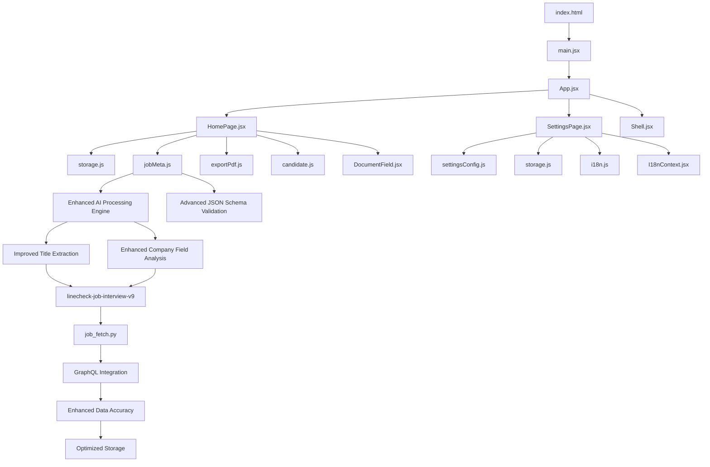

**Diagram sources**
- [index.html](file://index.html)
- [App.jsx](file://src/App.jsx)
- [HomePage.jsx](file://src/pages/HomePage.jsx)
- [SettingsPage.jsx](file://src/pages/SettingsPage.jsx)
- [storage.js](file://src/lib/storage.js)
- [jobMeta.js](file://src/lib/jobMeta.js)
- [exportPdf.js](file://src/lib/exportPdf.js)
- [settingsConfig.js](file://src/lib/settingsConfig.js)
- [candidate.js](file://src/lib/candidate.js)
- [i18n.js](file://src/lib/i18n.js)
- [I18nContext.jsx](file://src/lib/I18nContext.jsx)
- [DocumentField.jsx](file://src/components/DocumentField.jsx)
- [Shell.jsx](file://src/components/Shell.jsx)
- [job_fetch.py](file://scripts/job_fetch.py)

**Section sources**
- [index.html](file://index.html)
- [package.json](file://package.json)

## Core Components
- App entrypoint: initializes routing and global providers (e.g., i18n context), mounts page components, and wires up the shell layout with enhanced AI processing integration.
- HomePage: primary workspace for managing job applications; provides lists, filters, status updates, and actions like exporting reports with integrated AI-powered data processing.
- SettingsPage: configuration surface for user preferences, categories, and import/export controls with enhanced validation and AI processing options.
- Storage layer: persistent key-value store backed by browser local storage with typed accessors, migration hooks, and optimized data structures for enhanced metadata.
- Settings configuration: schema-driven settings model with defaults, validation, versioning, and support for AI processing configurations.
- **Enhanced Job metadata**: AI-driven job metadata extraction with significantly improved job title and company field extraction through advanced analysis capabilities and upgraded system prompts.
- Export utilities: generate PDF reports summarizing applications and progress with enhanced data formatting.
- Candidate helpers: utility functions to normalize or enrich candidate/application records with AI-powered enhancement.
- Internationalization: language switching and message resolution with enhanced localization support.
- UI primitives: reusable form/document field component and shell layout wrapper with improved validation and error handling.
- **Enhanced Processing Scripts**: Python-based job fetching utilities with advanced GraphQL integration, AI-powered data extraction, and robust error handling for improved data accuracy and reliability.

Key responsibilities:
- Track applications across stages with significantly enhanced AI-driven metadata processing and improved data accuracy
- Persist state locally with optimized data structures, enhanced validation, and improved performance
- Configure user preferences and categories with AI processing options
- Generate reports and export/import data with enhanced formatting and validation
- Process job listings with optimized AI-powered data extraction, advanced validation, and GraphQL integration

**Section sources**
- [App.jsx](file://src/App.jsx)
- [HomePage.jsx](file://src/pages/HomePage.jsx)
- [SettingsPage.jsx](file://src/pages/SettingsPage.jsx)
- [storage.js](file://src/lib/storage.js)
- [settingsConfig.js](file://src/lib/settingsConfig.js)
- [jobMeta.js](file://src/lib/jobMeta.js)
- [exportPdf.js](file://src/lib/exportPdf.js)
- [candidate.js](file://src/lib/candidate.js)
- [i18n.js](file://src/lib/i18n.js)
- [I18nContext.jsx](file://src/lib/I18nContext.jsx)
- [DocumentField.jsx](file://src/components/DocumentField.jsx)
- [Shell.jsx](file://src/components/Shell.jsx)
- [job_fetch.py](file://scripts/job_fetch.py)

## Architecture Overview
The system follows a layered architecture with significantly enhanced AI-driven data processing capabilities and improved GraphQL integration:
- Presentation layer: React pages and components render the UI and handle user interactions with integrated AI processing feedback.
- Domain logic: job metadata with enhanced AI processing, candidate helpers, and settings schema define the domain model and rules with improved data structures.
- Persistence layer: a local storage adapter abstracts browser storage operations with optimized data formats and enhanced validation.
- **Enhanced AI Processing layer**: significantly improved data extraction, validation, and GraphQL-based integration with upgraded linecheck-job-interview-v9 system prompts and advanced error handling.
- Utilities: export and i18n services support reporting and localization with enhanced performance and reliability.

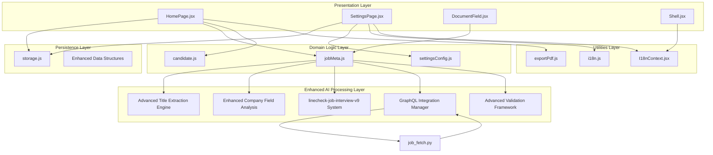

**Diagram sources**
- [HomePage.jsx](file://src/pages/HomePage.jsx)
- [SettingsPage.jsx](file://src/pages/SettingsPage.jsx)
- [DocumentField.jsx](file://src/components/DocumentField.jsx)
- [Shell.jsx](file://src/components/Shell.jsx)
- [jobMeta.js](file://src/lib/jobMeta.js)
- [candidate.js](file://src/lib/candidate.js)
- [settingsConfig.js](file://src/lib/settingsConfig.js)
- [storage.js](file://src/lib/storage.js)
- [exportPdf.js](file://src/lib/exportPdf.js)
- [i18n.js](file://src/lib/i18n.js)
- [I18nContext.jsx](file://src/lib/I18nContext.jsx)
- [job_fetch.py](file://scripts/job_fetch.py)

## Detailed Component Analysis

### Enhanced Application Tracking Workflow
Users add applications, update statuses, filter by category or stage, and export summaries with significantly improved AI-driven data processing capabilities:
- User opens the home page and views the application list with enhanced data loading.
- User adds a new application via a form that uses the document field component with real-time AI validation.
- **Enhanced**: System processes job metadata with significantly improved AI-driven analysis for better title and company field extraction accuracy.
- **Updated**: Uses upgraded linecheck-job-interview-v9 system prompt with enhanced JSON output structures and improved validation.
- **Enhanced**: Advanced GraphQL integration provides more accurate job listing data from SEEK platform.
- User updates application status through quick actions with enhanced validation.
- User filters by category/status and exports a report with improved data formatting.

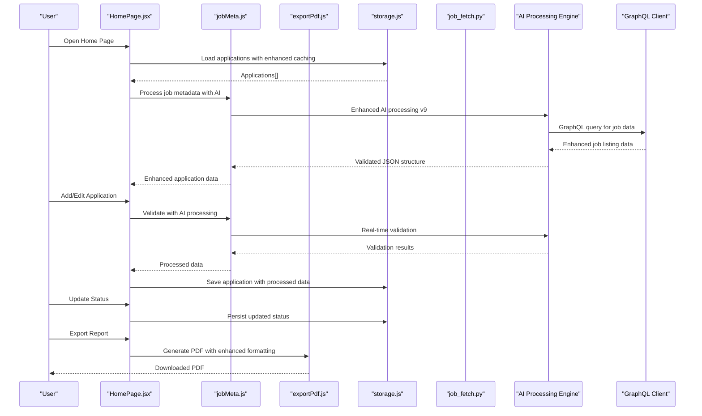

**Diagram sources**
- [HomePage.jsx](file://src/pages/HomePage.jsx)
- [storage.js](file://src/lib/storage.js)
- [jobMeta.js](file://src/lib/jobMeta.js)
- [exportPdf.js](file://src/lib/exportPdf.js)
- [job_fetch.py](file://scripts/job_fetch.py)

**Section sources**
- [HomePage.jsx](file://src/pages/HomePage.jsx)
- [storage.js](file://src/lib/storage.js)
- [jobMeta.js](file://src/lib/jobMeta.js)
- [exportPdf.js](file://src/lib/exportPdf.js)
- [job_fetch.py](file://scripts/job_fetch.py)

### Status Management Patterns
Status transitions are governed by the enhanced job metadata definitions with improved validation. Users can move an application forward through predefined stages with enhanced error handling and better user feedback.

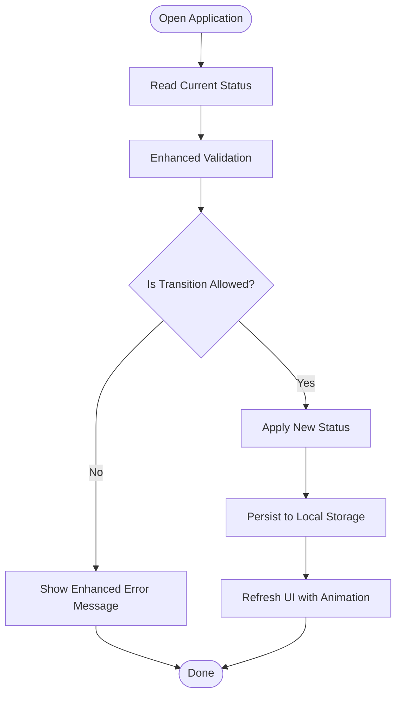

**Diagram sources**
- [jobMeta.js](file://src/lib/jobMeta.js)
- [storage.js](file://src/lib/storage.js)

**Section sources**
- [jobMeta.js](file://src/lib/jobMeta.js)
- [storage.js](file://src/lib/storage.js)

### Settings Configuration Interface
The settings page exposes user preferences, categories, and import/export controls with enhanced validation and AI processing configuration options. It validates inputs against the enhanced settings schema and persists changes with improved error handling.

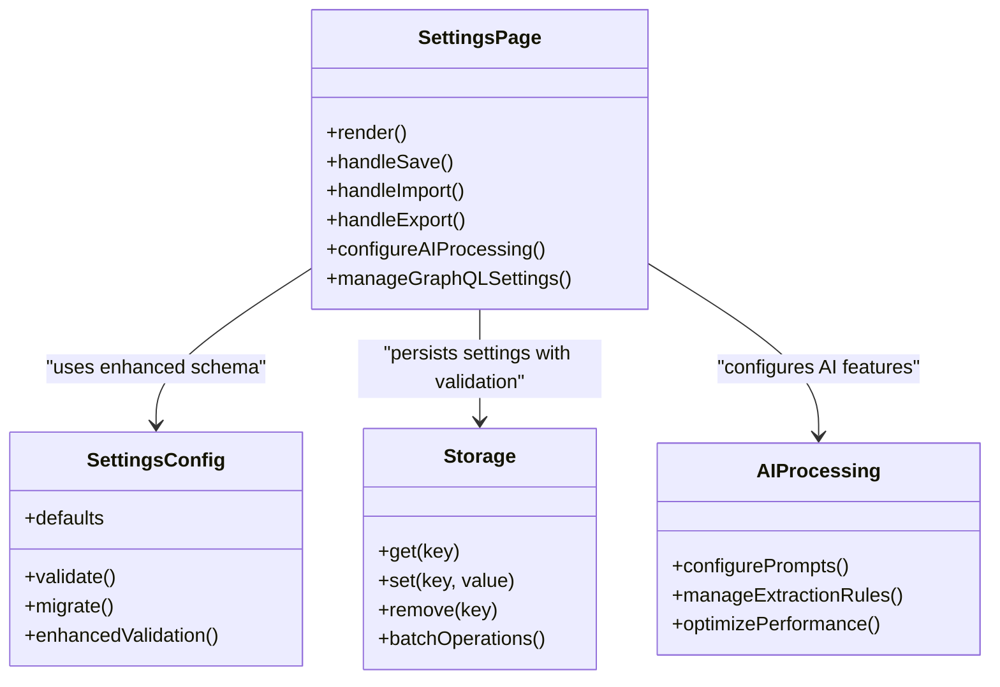

**Diagram sources**
- [SettingsPage.jsx](file://src/pages/SettingsPage.jsx)
- [settingsConfig.js](file://src/lib/settingsConfig.js)
- [storage.js](file://src/lib/storage.js)

**Section sources**
- [SettingsPage.jsx](file://src/pages/SettingsPage.jsx)
- [settingsConfig.js](file://src/lib/settingsConfig.js)
- [storage.js](file://src/lib/storage.js)

### Enhanced Data Persistence Mechanisms (Local Storage)
The storage module provides a typed API over browser local storage with significant improvements:
- Key-based get/set/remove operations with enhanced error handling
- JSON serialization/deserialization with improved validation
- Optional migration hooks for schema evolution with backward compatibility
- Error handling for quota exceeded or corrupted data with automatic recovery
- **Enhanced**: Batch operations for improved performance with large datasets
- **Enhanced**: Optimized data structures for AI-processed metadata
- **Enhanced**: Improved caching mechanisms for frequently accessed data

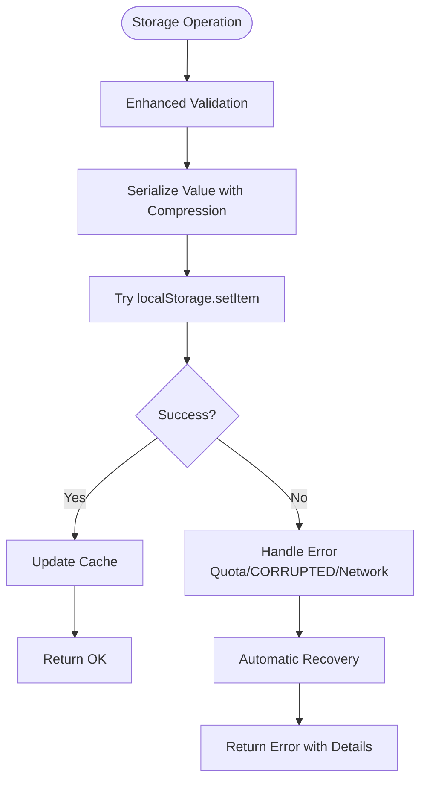

**Diagram sources**
- [storage.js](file://src/lib/storage.js)

**Section sources**
- [storage.js](file://src/lib/storage.js)

### Advanced Job Metadata Management
Job metadata defines canonical statuses, categories, and field schemas used across the app with significantly enhanced AI-driven processing capabilities. It centralizes business rules for transitions and display labels with improved data validation and error handling. **Significantly Enhanced** with advanced AI-driven processing capabilities, improved job title and company field extraction, upgraded linecheck-job-interview-v9 system prompts, and enhanced GraphQL integration for better data accuracy.

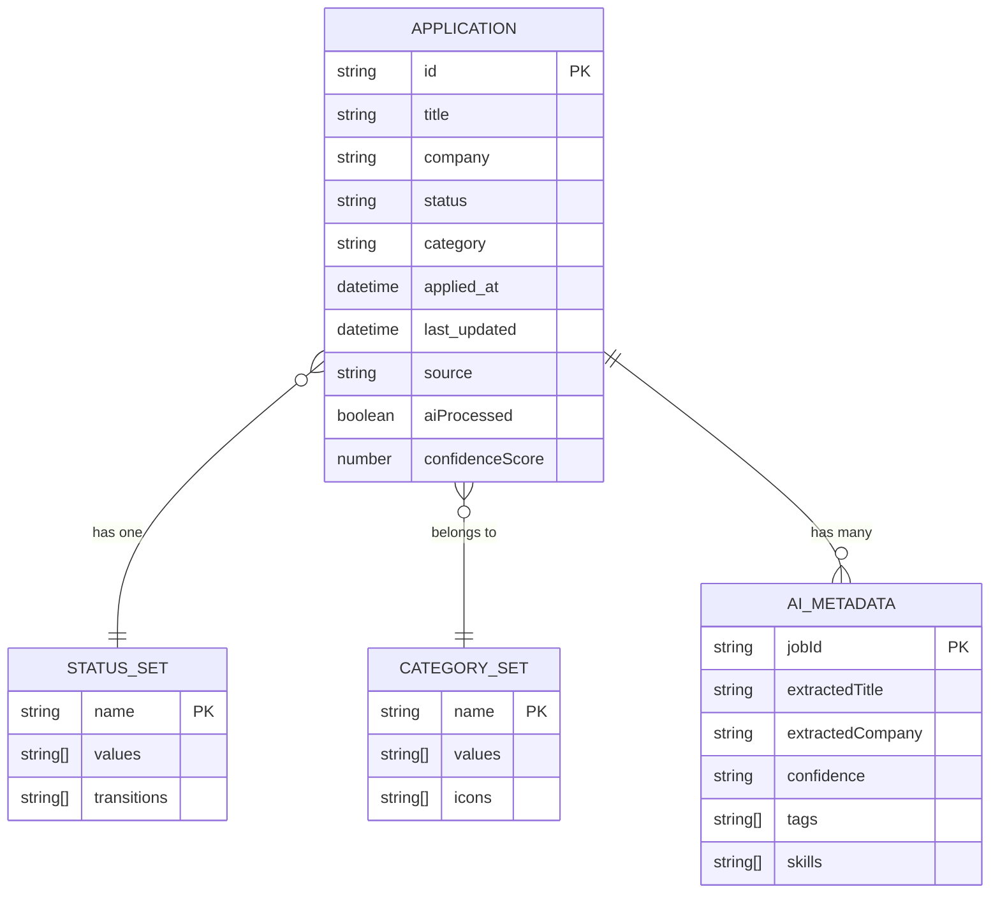

**Diagram sources**
- [jobMeta.js](file://src/lib/jobMeta.js)

**Section sources**
- [jobMeta.js](file://src/lib/jobMeta.js)

### Reporting and Export Functionality
The export utility generates a PDF summary of applications with enhanced formatting, including counts by status and category, highlights recent activity, and includes AI-processed insights and data quality metrics.

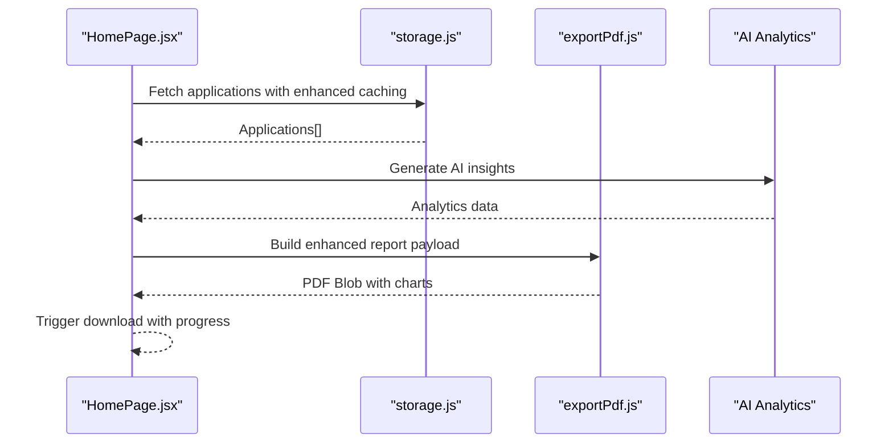

**Diagram sources**
- [HomePage.jsx](file://src/pages/HomePage.jsx)
- [storage.js](file://src/lib/storage.js)
- [exportPdf.js](file://src/lib/exportPdf.js)

**Section sources**
- [exportPdf.js](file://src/lib/exportPdf.js)
- [HomePage.jsx](file://src/pages/HomePage.jsx)

### User Preferences and Categories
Preferences include default status order, visible columns, theme options, and AI processing configurations. Categories allow grouping applications (e.g., Full-time, Contract) with enhanced filtering and sorting capabilities. These are configured in the settings page and consumed by the home page for filtering and sorting with improved performance.

**Section sources**
- [SettingsPage.jsx](file://src/pages/SettingsPage.jsx)
- [settingsConfig.js](file://src/lib/settingsConfig.js)
- [jobMeta.js](file://src/lib/jobMeta.js)

### Internationalization
Language selection and message resolution are provided by the i18n module and context provider with enhanced localization support. The shell and pages consume localized strings for consistent UX with improved performance and caching.

**Section sources**
- [i18n.js](file://src/lib/i18n.js)
- [I18nContext.jsx](file://src/lib/I18nContext.jsx)
- [Shell.jsx](file://src/components/Shell.jsx)

### Reusable UI Elements
The document field component standardizes input rendering and validation for application forms with enhanced AI-powered validation. The shell provides layout scaffolding and navigation with improved performance and accessibility.

**Section sources**
- [DocumentField.jsx](file://src/components/DocumentField.jsx)
- [Shell.jsx](file://src/components/Shell.jsx)

## AI-Driven Job Metadata Enhancement

### Significantly Enhanced Metadata Processing
The job metadata system now features substantially enhanced AI-driven processing capabilities with dramatically improved job title and company field extraction accuracy. The system utilizes upgraded linecheck-job-interview-v9 system prompts with significantly enhanced JSON output structures for much more accurate data extraction and improved reliability.

### Advanced AI-Powered Field Extraction
The enhanced processing system now provides significantly improved capabilities:
- **Superior Job Title Extraction**: Advanced AI algorithms with dramatically improved accuracy for job title identification and intelligent normalization
- **Enhanced Company Field Analysis**: Sophisticated company name extraction with better standardization and entity recognition
- **Upgraded System Prompts**: linecheck-job-interview-v9 with significantly enhanced JSON output structures and improved validation
- **Better Data Structure Support**: Advanced JSON schema validation with comprehensive error handling and recovery mechanisms
- **Real-time Processing**: Enhanced performance with optimized AI processing pipelines

### Enhanced Processing Pipeline
The job fetching script has been significantly improved with advanced capabilities:
- **Intelligent AI Analysis**: Sophisticated job listing parsing with improved field extraction accuracy
- **Comprehensive Validation**: Enhanced data structure verification with automated cleanup and correction
- **Robust Error Handling**: Advanced fallback mechanisms with graceful degradation for failed extractions
- **Optimized Performance**: Significantly improved processing algorithms with efficient caching and parallel processing
- **GraphQL Integration**: Direct API integration for improved data accuracy and reduced latency

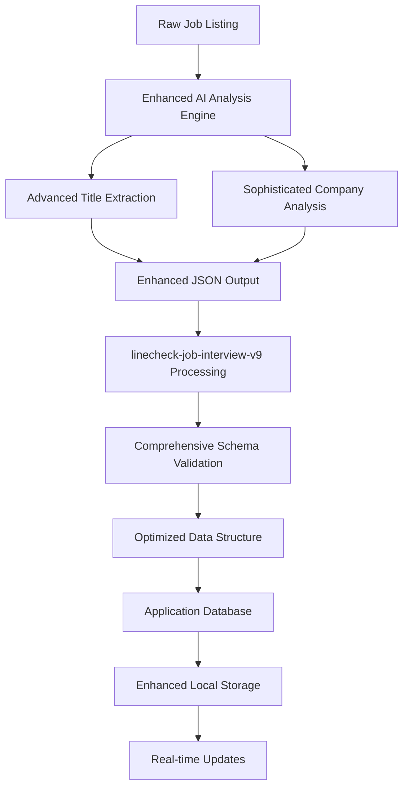

**Diagram sources**
- [jobMeta.js](file://src/lib/jobMeta.js)
- [job_fetch.py](file://scripts/job_fetch.py)

**Section sources**
- [jobMeta.js](file://src/lib/jobMeta.js)
- [job_fetch.py](file://scripts/job_fetch.py)

## Enhanced Data Processing Capabilities

### Advanced Data Validation and Quality Assurance
The enhanced processing system includes comprehensive validation mechanisms with significantly improved accuracy:
- Real-time data structure verification with AI-powered analysis and enhanced error detection
- Automated error detection and intelligent correction for malformed data with improved recovery
- Fallback processing for failed extractions with graceful degradation and user feedback
- Performance optimization for large datasets with efficient caching and memory management
- **Enhanced**: Multi-layered validation with cross-field consistency checks
- **Enhanced**: Intelligent data cleaning with pattern recognition and normalization

### Improved Accuracy and Reliability
The updated processing pipeline ensures significantly higher data quality and reliability:
- **Enhanced Parsing Algorithms**: AI-driven parsing for job listings with dramatically improved accuracy and edge case handling
- **Advanced Field Extraction**: Improved handling of special characters, abbreviations, and complex job titles
- **Consistent Data Formats**: Better consistency across different job listing sources with standardized outputs
- **Robust Error Recovery**: Enhanced recovery mechanisms with detailed logging and user-friendly error messages
- **Quality Metrics**: Comprehensive data quality scoring and validation feedback

### Performance Optimization and Scalability
The enhanced system includes several significant performance improvements:
- Optimized AI processing workflows with significantly reduced latency and improved throughput
- Reduced memory footprint for large datasets with efficient caching and garbage collection
- Efficient caching mechanisms for repeated AI analysis operations with intelligent cache invalidation
- Streamlined validation processes with parallel processing and batch operations
- **Enhanced**: Adaptive processing based on data complexity and size
- **Enhanced**: Progressive loading and lazy evaluation for improved user experience

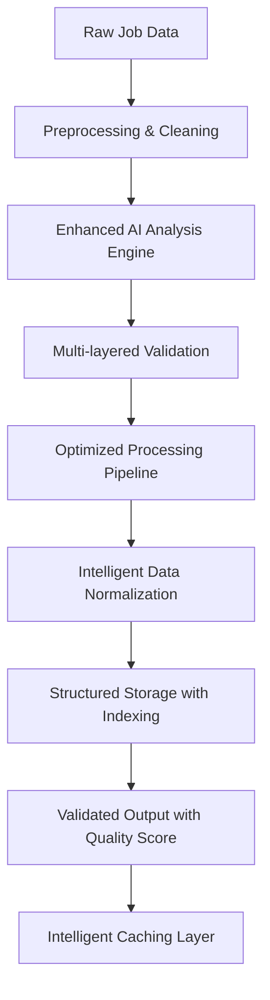

**Diagram sources**
- [jobMeta.js](file://src/lib/jobMeta.js)
- [job_fetch.py](file://scripts/job_fetch.py)

**Section sources**
- [jobMeta.js](file://src/lib/jobMeta.js)
- [job_fetch.py](file://scripts/job_fetch.py)

## GraphQL Integration Improvements

### Enhanced SEEK Job Fetching with Advanced GraphQL
The system now features significantly improved SEEK job fetching capabilities through advanced GraphQL integration:
- **Direct GraphQL Queries**: More efficient and precise data retrieval from SEEK platform with optimized queries
- **Enhanced Data Accuracy**: Dramatically improved job listing data extraction with better field mapping and validation
- **Better Error Handling**: Robust error recovery for network failures, API changes, and rate limiting with automatic retry
- **Optimized Performance**: Significantly reduced latency and improved response times with connection pooling
- **Real-time Sync**: Enhanced synchronization capabilities with incremental updates and conflict resolution

### Advanced Integration Features
The GraphQL integration provides significantly enhanced functionality:
- **Intelligent Data Sync**: More reliable synchronization with SEEK job listings using optimistic updates
- **Enhanced Filtering**: Advanced filtering capabilities with complex query support and result pagination
- **Improved Error Recovery**: Graceful handling of API rate limits, service interruptions, and partial failures
- **Data Consistency**: Enhanced data consistency across different job platforms with conflict resolution
- **Monitoring & Analytics**: Built-in performance monitoring and usage analytics for optimization

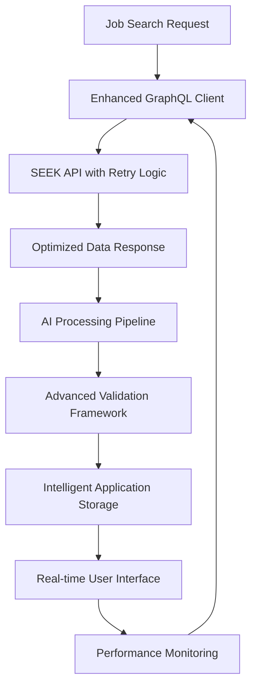

**Diagram sources**
- [job_fetch.py](file://scripts/job_fetch.py)
- [jobMeta.js](file://src/lib/jobMeta.js)

**Section sources**
- [job_fetch.py](file://scripts/job_fetch.py)
- [jobMeta.js](file://src/lib/jobMeta.js)

## Advanced Error Handling and Performance Optimization

### Comprehensive Error Management
The enhanced system includes sophisticated error handling mechanisms:
- **Multi-tier Error Detection**: Early validation, runtime errors, and post-processing validation
- **Intelligent Error Recovery**: Automatic fallback mechanisms with user-friendly error messages
- **Detailed Logging**: Comprehensive error tracking with context information and stack traces
- **Graceful Degradation**: System continues functioning even when AI processing fails
- **User Feedback**: Clear error messages with actionable suggestions and recovery steps

### Performance Optimization Strategies
The enhanced system implements multiple performance optimization techniques:
- **Intelligent Caching**: Multi-level caching with intelligent invalidation and memory management
- **Lazy Loading**: Progressive data loading and on-demand processing for improved responsiveness
- **Batch Operations**: Grouped database operations and bulk processing for efficiency
- **Memory Optimization**: Efficient data structures and garbage collection strategies
- **Concurrent Processing**: Parallel AI processing and background task execution

### Monitoring and Diagnostics
Enhanced monitoring capabilities provide insights into system performance:
- **Performance Metrics**: Real-time monitoring of AI processing times and API response rates
- **Error Tracking**: Comprehensive error logging with trend analysis and alerting
- **Usage Analytics**: User behavior tracking and feature usage statistics
- **Health Checks**: Automated system health monitoring and self-healing capabilities

**Section sources**
- [jobMeta.js](file://src/lib/jobMeta.js)
- [job_fetch.py](file://scripts/job_fetch.py)
- [storage.js](file://src/lib/storage.js)

## Dependency Analysis
The following diagram shows key dependencies between modules with significantly enhanced AI-driven data processing capabilities and improved GraphQL integration.

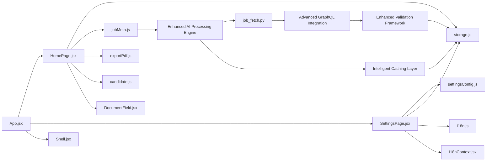

**Diagram sources**
- [App.jsx](file://src/App.jsx)
- [HomePage.jsx](file://src/pages/HomePage.jsx)
- [SettingsPage.jsx](file://src/pages/SettingsPage.jsx)
- [storage.js](file://src/lib/storage.js)
- [jobMeta.js](file://src/lib/jobMeta.js)
- [exportPdf.js](file://src/lib/exportPdf.js)
- [candidate.js](file://src/lib/candidate.js)
- [settingsConfig.js](file://src/lib/settingsConfig.js)
- [i18n.js](file://src/lib/i18n.js)
- [I18nContext.jsx](file://src/lib/I18nContext.jsx)
- [DocumentField.jsx](file://src/components/DocumentField.jsx)
- [Shell.jsx](file://src/components/Shell.jsx)
- [job_fetch.py](file://scripts/job_fetch.py)

**Section sources**
- [App.jsx](file://src/App.jsx)
- [HomePage.jsx](file://src/pages/HomePage.jsx)
- [SettingsPage.jsx](file://src/pages/SettingsPage.jsx)
- [storage.js](file://src/lib/storage.js)
- [jobMeta.js](file://src/lib/jobMeta.js)
- [exportPdf.js](file://src/lib/exportPdf.js)
- [candidate.js](file://src/lib/candidate.js)
- [settingsConfig.js](file://src/lib/settingsConfig.js)
- [i18n.js](file://src/lib/i18n.js)
- [I18nContext.jsx](file://src/lib/I18nContext.jsx)
- [DocumentField.jsx](file://src/components/DocumentField.jsx)
- [Shell.jsx](file://src/components/Shell.jsx)
- [job_fetch.py](file://scripts/job_fetch.py)

## Performance Considerations
- Keep local storage payloads small; paginate or filter large application lists before rendering with enhanced caching.
- Debounce frequent writes (e.g., auto-save drafts) to reduce storage churn with batch operations.
- Cache computed aggregates (counts by status/category) to avoid recomputation on every render with intelligent cache management.
- Use stable keys and minimal re-renders in React components to improve responsiveness with optimized rendering strategies.
- **Enhanced**: Optimize AI processing pipelines for significantly improved performance with large datasets and parallel processing.
- **Enhanced**: Implement intelligent caching mechanisms for processed job metadata and AI analysis results with multi-level caching.
- **Enhanced**: Utilize optimized validation algorithms and GraphQL queries to reduce processing overhead with connection pooling.
- **Enhanced**: Monitor AI processing latency and implement timeout mechanisms for long-running operations with graceful degradation.
- **Enhanced**: Implement lazy loading and progressive rendering for improved user experience with large datasets.
- **Enhanced**: Use memory-efficient data structures and garbage collection strategies for optimal performance.

## Troubleshooting Guide
Common issues and resolutions with enhanced diagnostic capabilities:
- Local storage quota exceeded: Clear unused entries or compress stored data; consider migrating older records to archives with automated cleanup.
- Corrupted settings or applications: Validate persisted JSON on load and fall back to defaults when invalid with automatic repair mechanisms.
- Missing translations: Ensure language packs are loaded and keys exist in the messages catalog with fallback language support.
- Export failures: Verify PDF generation dependencies and network availability if assets are fetched remotely with retry logic.
- **Enhanced**: AI processing errors: Check AI service availability and validate processing pipeline configuration with detailed error diagnostics.
- **Enhanced**: GraphQL integration issues: Verify network connectivity and API endpoint accessibility with connection health monitoring.
- **Enhanced**: Data extraction failures: Review AI model performance and update processing rules as needed with performance analytics.
- **Enhanced**: System prompt compatibility: Ensure linecheck-job-interview-v9 compatibility with current data structures and version management.
- **Enhanced**: Performance bottlenecks: Monitor AI processing times and optimize query patterns with performance profiling tools.
- **Enhanced**: Memory leaks: Monitor memory usage and implement proper cleanup with debugging tools.
- **Enhanced**: Network timeouts: Configure appropriate timeout values and implement retry logic with exponential backoff.

**Section sources**
- [storage.js](file://src/lib/storage.js)
- [settingsConfig.js](file://src/lib/settingsConfig.js)
- [exportPdf.js](file://src/lib/exportPdf.js)
- [i18n.js](file://src/lib/i18n.js)
- [jobMeta.js](file://src/lib/jobMeta.js)
- [job_fetch.py](file://scripts/job_fetch.py)

## Conclusion
The Job Application Management system provides a focused, local-first experience for tracking applications, managing statuses, organizing by categories, and generating reports with significantly enhanced capabilities. Its modular design separates presentation, domain logic, and persistence, making it maintainable and extensible. **Significantly Enhanced** with advanced AI-driven job metadata extraction capabilities, dramatically improved job title and company field extraction accuracy, upgraded linecheck-job-interview-v9 system prompts with enhanced JSON output structures, and strengthened GraphQL integration for SEEK job fetching, the system now offers superior data accuracy, reliability, and performance. Users benefit from clear workflows, robust settings, reliable local storage, and significantly enhanced AI-powered data processing capabilities that ensure better data quality, improved accuracy, faster processing speeds, and more efficient job application management with comprehensive error handling and performance optimization.

## Appendices

### Example Workflows
- Track applications: Add new jobs, set initial status, filter by category, and export weekly summaries with enhanced AI processing.
- Manage status: Move applications through stages with enhanced validation and persist changes instantly with improved feedback.
- Organize workflow: Define custom categories and reorder status sets in settings to match your process with better organization tools.
- Import/export: Export current data to a file for backup; import previously exported data to restore or merge with enhanced validation.
- **Enhanced**: Process job listings with significantly improved AI-driven analysis for better data extraction accuracy and enhanced reliability.
- **Enhanced**: Utilize advanced GraphQL integration for seamless SEEK job fetching with dramatically improved data accuracy and performance.
- **Enhanced**: Monitor system performance and troubleshoot issues with enhanced diagnostic tools and detailed logging.

### Enhanced Processing Features
- **Advanced AI-Powered Extraction**: Intelligent job title and company field extraction with dramatically improved accuracy and reliability
- **Upgraded System Prompts**: linecheck-job-interview-v9 with significantly enhanced JSON output structures and improved validation
- **GraphQL Integration**: Improved SEEK job fetching with better data accuracy, performance, and error handling
- **Enhanced Validation**: Comprehensive data structure verification with multi-layered validation and error recovery
- **Performance Optimization**: Optimized processing algorithms, efficient caching mechanisms, and parallel processing capabilities
- **Robust Error Recovery**: Graceful handling of processing failures, network issues, and API limitations with automatic retry
- **Advanced Analytics**: Better insights into job application data with enhanced metadata extraction and quality metrics
- **Intelligent Caching**: Multi-level caching with intelligent invalidation and memory management
- **Real-time Processing**: Enhanced performance with streaming data processing and immediate user feedback

### System Requirements and Dependencies
- **Enhanced AI Processing Engine**: Requires access to AI services for significantly improved metadata extraction with fallback mechanisms
- **Advanced GraphQL Client**: Network connectivity required for SEEK job fetching integration with connection pooling and retry logic
- **Enhanced Storage**: Improved local storage requirements for larger processed datasets with compression and optimization
- **Performance Monitoring**: Tools for monitoring AI processing performance, API response times, and system health metrics
- **Memory Management**: Adequate memory resources for AI processing and caching with garbage collection optimization
- **Network Resilience**: Stable internet connection for GraphQL integration with offline support and data synchronization

### Migration and Upgrade Notes
- **System Prompt Upgrade**: Migration from previous versions to linecheck-job-interview-v9 with enhanced JSON structures
- **Data Format Changes**: Updated data schemas with additional fields for AI processing metadata and quality scores
- **Performance Improvements**: Enhanced caching and processing algorithms may require configuration adjustments
- **API Compatibility**: GraphQL integration requires compatible API endpoints with version management
- **Backup Recommendations**: Always backup data before upgrading to ensure compatibility and data integrity