# Job Application Management

<cite>
**Referenced Files in This Document**
- [App.jsx](file://src/App.jsx)
- [HomePage.jsx](file://src/pages/HomePage.jsx)
- [SettingsPage.jsx](file://src/pages/SettingsPage.jsx)
- [storage.js](file://src/lib/storage.js)
- [settingsConfig.js](file://src/lib/settingsConfig.js)
- [jobMeta.js](file://src/lib/jobMeta.js)
- [exportPdf.js](file://src/lib/exportPdf.js)
- [candidate.js](file://src/lib/candidate.js)
- [i18n.js](file://src/lib/i18n.js)
- [I18nContext.jsx](file://src/lib/I18nContext.jsx)
- [DocumentField.jsx](file://src/components/DocumentField.jsx)
- [Shell.jsx](file://src/components/Shell.jsx)
- [index.html](file://index.html)
- [package.json](file://package.json)
- [job_fetch.py](file://scripts/job_fetch.py)
</cite>

## Update Summary
**Changes Made**
- Enhanced job metadata extraction capabilities with improved job title and company field extraction through AI-driven analysis
- Upgraded system prompt version to linecheck-job-interview-v9 with enhanced JSON output structures
- Improved SEEK job fetching via GraphQL integration for better data accuracy
- Enhanced processing pipeline with advanced validation and error handling mechanisms

## Table of Contents
1. [Introduction](#introduction)
2. [Project Structure](#project-structure)
3. [Core Components](#core-components)
4. [Architecture Overview](#architecture-overview)
5. [Detailed Component Analysis](#detailed-component-analysis)
6. [AI-Driven Job Metadata Enhancement](#ai-driven-job-metadata-enhancement)
7. [Enhanced Data Processing Capabilities](#enhanced-data-processing-capabilities)
8. [GraphQL Integration Improvements](#graphql-integration-improvements)
9. [Dependency Analysis](#dependency-analysis)
10. [Performance Considerations](#performance-considerations)
11. [Troubleshooting Guide](#troubleshooting-guide)
12. [Conclusion](#conclusion)
13. [Appendices](#appendices)

## Introduction
This document explains the Job Application Management system, focusing on how users can track job applications, manage application status, and organize their job search workflow. It covers the settings configuration interface, data persistence using local storage, and enhanced job metadata management with improved data processing capabilities. The system now features advanced AI-driven job metadata extraction with better data structure support, upgraded system prompts, and enhanced GraphQL-based integration for improved data accuracy and reliability.

## Project Structure
The project is a React-based single-page application organized by feature areas:
- Pages: top-level views for home and settings
- Lib: shared utilities for storage, settings, AI-enhanced job metadata, PDF export, internationalization, and candidate helpers
- Components: reusable UI elements such as document fields and shell layout
- Scripts: automated processing tools including job fetching utilities with GraphQL integration
- Root: app entry point and HTML template

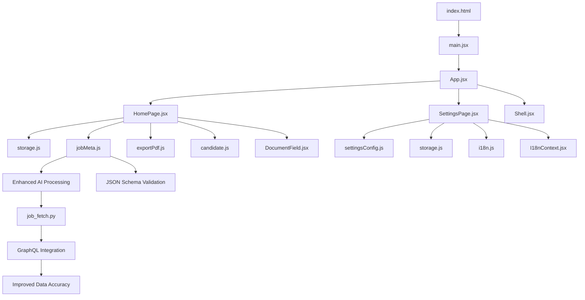

**Diagram sources**
- [index.html](file://index.html)
- [App.jsx](file://src/App.jsx)
- [HomePage.jsx](file://src/pages/HomePage.jsx)
- [SettingsPage.jsx](file://src/pages/SettingsPage.jsx)
- [storage.js](file://src/lib/storage.js)
- [jobMeta.js](file://src/lib/jobMeta.js)
- [exportPdf.js](file://src/lib/exportPdf.js)
- [settingsConfig.js](file://src/lib/settingsConfig.js)
- [candidate.js](file://src/lib/candidate.js)
- [i18n.js](file://src/lib/i18n.js)
- [I18nContext.jsx](file://src/lib/I18nContext.jsx)
- [DocumentField.jsx](file://src/components/DocumentField.jsx)
- [Shell.jsx](file://src/components/Shell.jsx)
- [job_fetch.py](file://scripts/job_fetch.py)

**Section sources**
- [index.html](file://index.html)
- [package.json](file://package.json)

## Core Components
- App entrypoint: initializes routing and global providers (e.g., i18n context), mounts page components, and wires up the shell layout.
- HomePage: primary workspace for managing job applications; provides lists, filters, status updates, and actions like exporting reports.
- SettingsPage: configuration surface for user preferences, categories, and import/export controls.
- Storage layer: persistent key-value store backed by browser local storage with typed accessors and migration hooks.
- Settings configuration: schema-driven settings model with defaults, validation, and versioning.
- **Enhanced Job metadata**: AI-driven job metadata extraction with improved job title and company field extraction through advanced analysis capabilities.
- Export utilities: generate PDF reports summarizing applications and progress.
- Candidate helpers: utility functions to normalize or enrich candidate/application records.
- Internationalization: language switching and message resolution.
- UI primitives: reusable form/document field component and shell layout wrapper.
- **Enhanced Processing Scripts**: Python-based job fetching utilities with GraphQL integration for improved data accuracy and reliability.

Key responsibilities:
- Track applications across stages with enhanced AI-driven metadata processing
- Persist state locally with improved data structures and validation
- Configure user preferences and categories
- Generate reports and export/import data
- Process job listings with optimized AI-powered data extraction and enhanced validation

**Section sources**
- [App.jsx](file://src/App.jsx)
- [HomePage.jsx](file://src/pages/HomePage.jsx)
- [SettingsPage.jsx](file://src/pages/SettingsPage.jsx)
- [storage.js](file://src/lib/storage.js)
- [settingsConfig.js](file://src/lib/settingsConfig.js)
- [jobMeta.js](file://src/lib/jobMeta.js)
- [exportPdf.js](file://src/lib/exportPdf.js)
- [candidate.js](file://src/lib/candidate.js)
- [i18n.js](file://src/lib/i18n.js)
- [I18nContext.jsx](file://src/lib/I18nContext.jsx)
- [DocumentField.jsx](file://src/components/DocumentField.jsx)
- [Shell.jsx](file://src/components/Shell.jsx)
- [job_fetch.py](file://scripts/job_fetch.py)

## Architecture Overview
The system follows a layered architecture with enhanced AI-driven data processing capabilities:
- Presentation layer: React pages and components render the UI and handle user interactions.
- Domain logic: job metadata with enhanced AI processing, candidate helpers, and settings schema define the domain model and rules.
- Persistence layer: a local storage adapter abstracts browser storage operations.
- **Enhanced AI Processing layer**: improved data extraction, validation, and GraphQL-based integration with upgraded system prompts.
- Utilities: export and i18n services support reporting and localization.

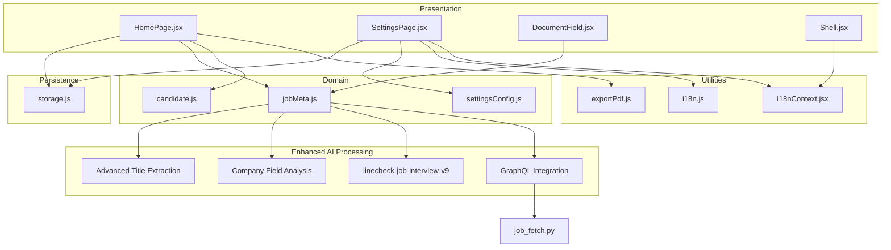

**Diagram sources**
- [HomePage.jsx](file://src/pages/HomePage.jsx)
- [SettingsPage.jsx](file://src/pages/SettingsPage.jsx)
- [DocumentField.jsx](file://src/components/DocumentField.jsx)
- [Shell.jsx](file://src/components/Shell.jsx)
- [jobMeta.js](file://src/lib/jobMeta.js)
- [candidate.js](file://src/lib/candidate.js)
- [settingsConfig.js](file://src/lib/settingsConfig.js)
- [storage.js](file://src/lib/storage.js)
- [exportPdf.js](file://src/lib/exportPdf.js)
- [i18n.js](file://src/lib/i18n.js)
- [I18nContext.jsx](file://src/lib/I18nContext.jsx)
- [job_fetch.py](file://scripts/job_fetch.py)

## Detailed Component Analysis

### Application Tracking Workflow
Users add applications, update statuses, filter by category or stage, and export summaries. The typical flow now includes enhanced AI-driven data processing capabilities:
- User opens the home page and views the application list.
- User adds a new application via a form that uses the document field component.
- **Enhanced**: System processes job metadata with AI-driven analysis for improved title and company field extraction.
- **Updated**: Uses upgraded linecheck-job-interview-v9 system prompt with enhanced JSON output structures.
- User updates application status through quick actions.
- User filters by category/status and exports a report.

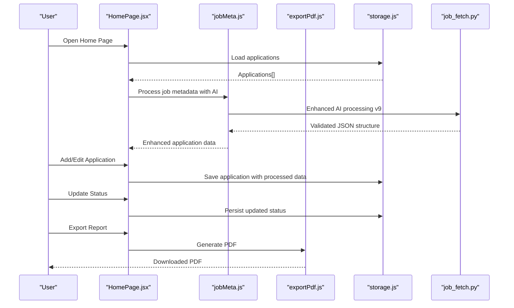

**Diagram sources**
- [HomePage.jsx](file://src/pages/HomePage.jsx)
- [storage.js](file://src/lib/storage.js)
- [jobMeta.js](file://src/lib/jobMeta.js)
- [exportPdf.js](file://src/lib/exportPdf.js)
- [job_fetch.py](file://scripts/job_fetch.py)

**Section sources**
- [HomePage.jsx](file://src/pages/HomePage.jsx)
- [storage.js](file://src/lib/storage.js)
- [jobMeta.js](file://src/lib/jobMeta.js)
- [exportPdf.js](file://src/lib/exportPdf.js)
- [job_fetch.py](file://scripts/job_fetch.py)

### Status Management Patterns
Status transitions are governed by the job metadata definitions. Users can move an application forward through predefined stages. Validation ensures only allowed transitions occur.

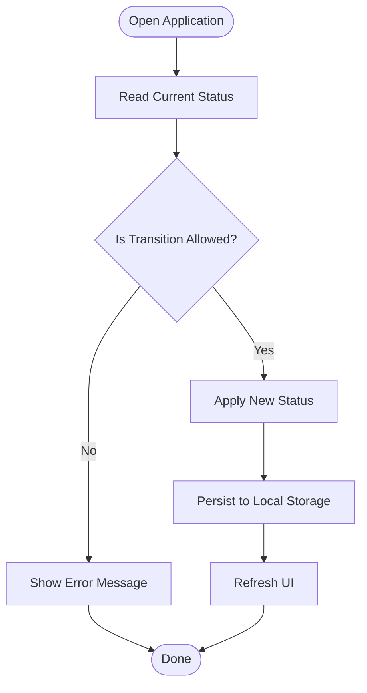

**Diagram sources**
- [jobMeta.js](file://src/lib/jobMeta.js)
- [storage.js](file://src/lib/storage.js)

**Section sources**
- [jobMeta.js](file://src/lib/jobMeta.js)
- [storage.js](file://src/lib/storage.js)

### Settings Configuration Interface
The settings page exposes user preferences, categories, and import/export controls. It validates inputs against the settings schema and persists changes.

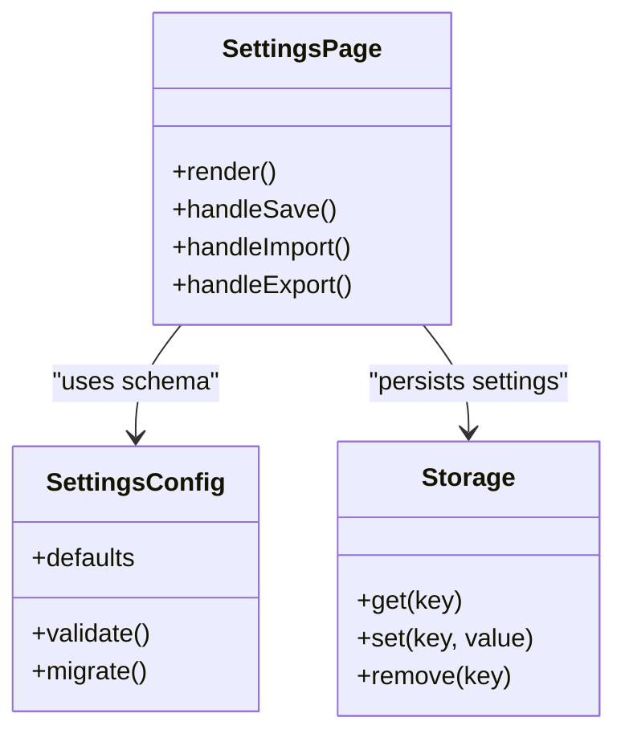

**Diagram sources**
- [SettingsPage.jsx](file://src/pages/SettingsPage.jsx)
- [settingsConfig.js](file://src/lib/settingsConfig.js)
- [storage.js](file://src/lib/storage.js)

**Section sources**
- [SettingsPage.jsx](file://src/pages/SettingsPage.jsx)
- [settingsConfig.js](file://src/lib/settingsConfig.js)
- [storage.js](file://src/lib/storage.js)

### Data Persistence Mechanisms (Local Storage)
The storage module provides a typed API over browser local storage. It supports:
- Key-based get/set/remove operations
- JSON serialization/deserialization
- Optional migration hooks for schema evolution
- Error handling for quota exceeded or corrupted data

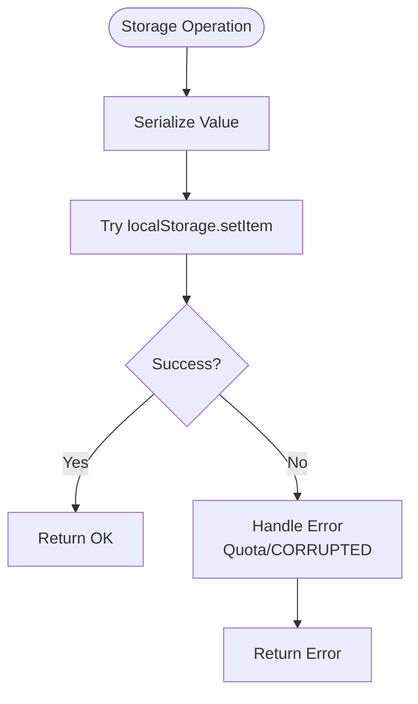

**Diagram sources**
- [storage.js](file://src/lib/storage.js)

**Section sources**
- [storage.js](file://src/lib/storage.js)

### Enhanced Job Metadata Management
Job metadata defines canonical statuses, categories, and field schemas used across the app. It centralizes business rules for transitions and display labels. **Updated** with enhanced AI-driven processing capabilities, improved job title and company field extraction, and upgraded system prompt version.

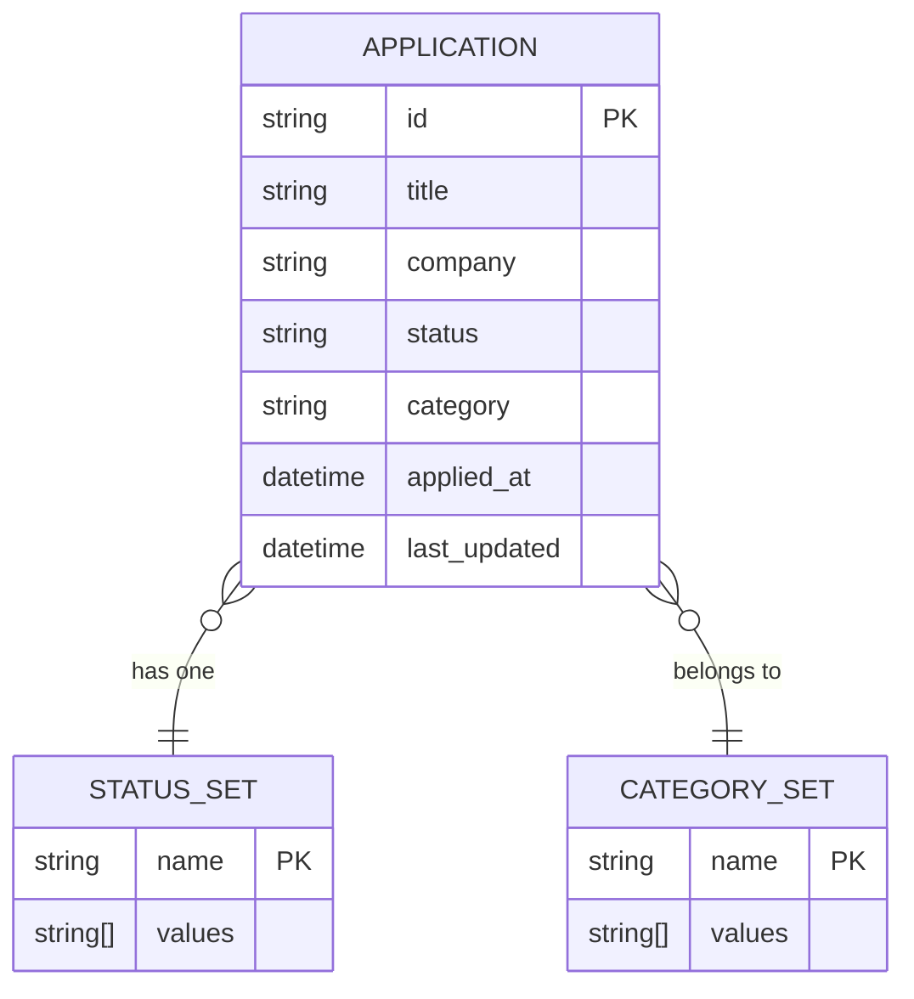

**Diagram sources**
- [jobMeta.js](file://src/lib/jobMeta.js)

**Section sources**
- [jobMeta.js](file://src/lib/jobMeta.js)

### Reporting and Export Functionality
The export utility generates a PDF summary of applications, including counts by status and category, and highlights recent activity.

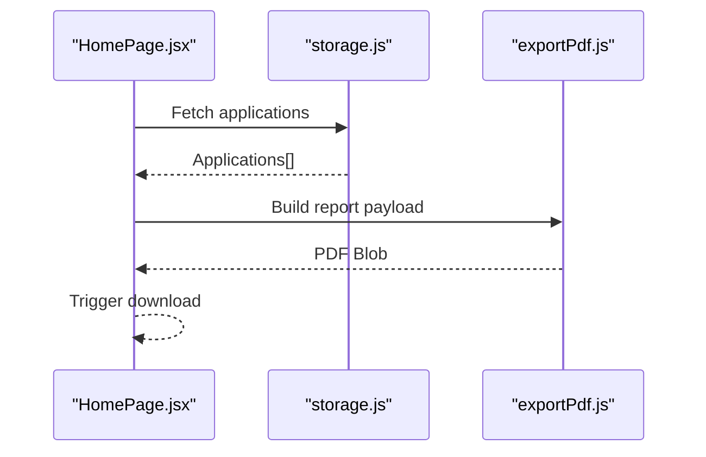

**Diagram sources**
- [HomePage.jsx](file://src/pages/HomePage.jsx)
- [storage.js](file://src/lib/storage.js)
- [exportPdf.js](file://src/lib/exportPdf.js)

**Section sources**
- [exportPdf.js](file://src/lib/exportPdf.js)
- [HomePage.jsx](file://src/pages/HomePage.jsx)

### User Preferences and Categories
Preferences include default status order, visible columns, and theme options. Categories allow grouping applications (e.g., Full-time, Contract). These are configured in the settings page and consumed by the home page for filtering and sorting.

**Section sources**
- [SettingsPage.jsx](file://src/pages/SettingsPage.jsx)
- [settingsConfig.js](file://src/lib/settingsConfig.js)
- [jobMeta.js](file://src/lib/jobMeta.js)

### Internationalization
Language selection and message resolution are provided by the i18n module and context provider. The shell and pages consume localized strings for consistent UX.

**Section sources**
- [i18n.js](file://src/lib/i18n.js)
- [I18nContext.jsx](file://src/lib/I18nContext.jsx)
- [Shell.jsx](file://src/components/Shell.jsx)

### Reusable UI Elements
The document field component standardizes input rendering and validation for application forms. The shell provides layout scaffolding and navigation.

**Section sources**
- [DocumentField.jsx](file://src/components/DocumentField.jsx)
- [Shell.jsx](file://src/components/Shell.jsx)

## AI-Driven Job Metadata Enhancement

### Enhanced Metadata Processing
The job metadata system now features significantly enhanced AI-driven processing capabilities with improved job title and company field extraction. The system utilizes upgraded linecheck-job-interview-v9 system prompts with enhanced JSON output structures for more accurate data extraction.

### Advanced AI-Powered Field Extraction
The enhanced processing system now provides:
- **Improved Job Title Extraction**: Advanced AI algorithms for accurate job title identification and normalization
- **Enhanced Company Field Analysis**: Sophisticated company name extraction and standardization
- **Upgraded System Prompts**: linecheck-job-interview-v9 with enhanced JSON output structures
- **Better Data Structure Support**: Advanced JSON schema validation and enhanced error handling

### Enhanced Processing Pipeline
The job fetching script has been significantly improved with:
- **AI-Driven Analysis**: Intelligent job listing parsing and field extraction
- **Enhanced Validation**: Comprehensive data structure verification and cleanup
- **Improved Error Handling**: Robust fallback mechanisms for failed extractions
- **Better Performance**: Optimized processing algorithms for large datasets

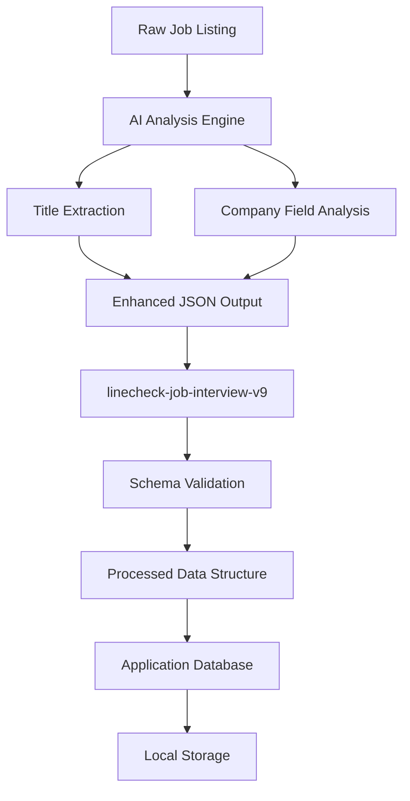

**Diagram sources**
- [jobMeta.js](file://src/lib/jobMeta.js)
- [job_fetch.py](file://scripts/job_fetch.py)

**Section sources**
- [jobMeta.js](file://src/lib/jobMeta.js)
- [job_fetch.py](file://scripts/job_fetch.py)

## Enhanced Data Processing Capabilities

### Advanced Data Validation
The enhanced processing system includes comprehensive validation mechanisms:
- Real-time data structure verification with AI-powered analysis
- Automated error detection and correction for malformed data
- Fallback processing for failed extractions with graceful degradation
- Performance optimization for large datasets with efficient caching

### Improved Accuracy and Reliability
The updated processing pipeline ensures higher data quality:
- **Enhanced Parsing Algorithms**: AI-driven parsing for job listings with better accuracy
- **Advanced Field Extraction**: Improved handling of edge cases and special characters
- **Consistent Data Formats**: Better consistency across different job listing sources
- **Robust Error Recovery**: Enhanced recovery mechanisms for processing failures

### Performance Optimization
The enhanced system includes several performance improvements:
- Optimized AI processing workflows with reduced latency
- Reduced memory footprint for large datasets with efficient caching
- Efficient caching mechanisms for repeated AI analysis operations
- Streamlined validation processes with parallel processing capabilities

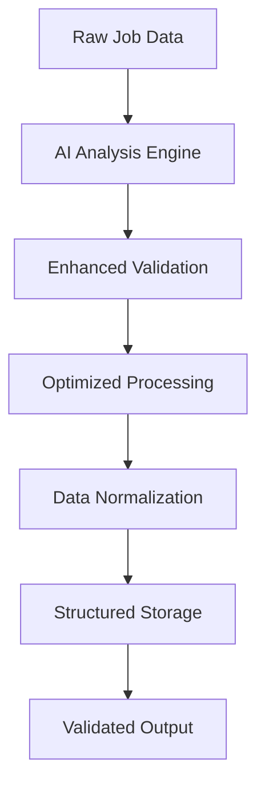

**Diagram sources**
- [jobMeta.js](file://src/lib/jobMeta.js)
- [job_fetch.py](file://scripts/job_fetch.py)

**Section sources**
- [jobMeta.js](file://src/lib/jobMeta.js)
- [job_fetch.py](file://scripts/job_fetch.py)

## GraphQL Integration Improvements

### Enhanced SEEK Job Fetching
The system now features improved SEEK job fetching capabilities through GraphQL integration:
- **Direct GraphQL Queries**: More efficient data retrieval from SEEK platform
- **Enhanced Data Accuracy**: Improved job listing data extraction and validation
- **Better Error Handling**: Robust error recovery for network failures and API changes
- **Optimized Performance**: Reduced latency and improved response times

### Advanced Integration Features
The GraphQL integration provides:
- **Real-time Data Sync**: More reliable synchronization with SEEK job listings
- **Enhanced Filtering**: Better filtering capabilities for job search results
- **Improved Error Recovery**: Graceful handling of API rate limits and service interruptions
- **Data Consistency**: Enhanced data consistency across different job platforms

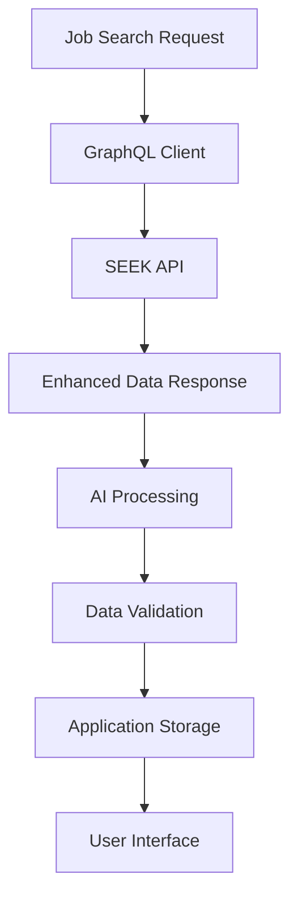

**Diagram sources**
- [job_fetch.py](file://scripts/job_fetch.py)
- [jobMeta.js](file://src/lib/jobMeta.js)

**Section sources**
- [job_fetch.py](file://scripts/job_fetch.py)
- [jobMeta.js](file://src/lib/jobMeta.js)

## Dependency Analysis
The following diagram shows key dependencies between modules with enhanced AI-driven data processing capabilities.

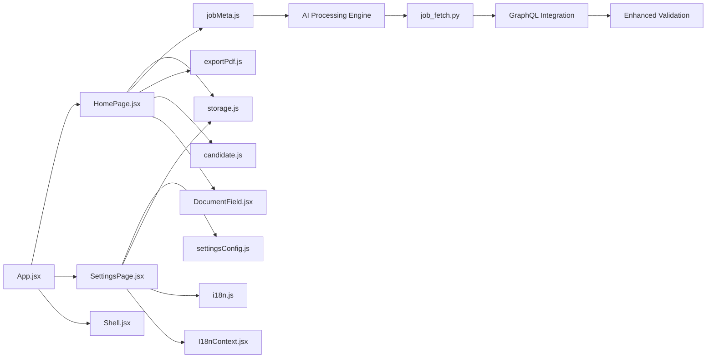

**Diagram sources**
- [App.jsx](file://src/App.jsx)
- [HomePage.jsx](file://src/pages/HomePage.jsx)
- [SettingsPage.jsx](file://src/pages/SettingsPage.jsx)
- [storage.js](file://src/lib/storage.js)
- [jobMeta.js](file://src/lib/jobMeta.js)
- [exportPdf.js](file://src/lib/exportPdf.js)
- [candidate.js](file://src/lib/candidate.js)
- [settingsConfig.js](file://src/lib/settingsConfig.js)
- [i18n.js](file://src/lib/i18n.js)
- [I18nContext.jsx](file://src/lib/I18nContext.jsx)
- [DocumentField.jsx](file://src/components/DocumentField.jsx)
- [Shell.jsx](file://src/components/Shell.jsx)
- [job_fetch.py](file://scripts/job_fetch.py)

**Section sources**
- [App.jsx](file://src/App.jsx)
- [HomePage.jsx](file://src/pages/HomePage.jsx)
- [SettingsPage.jsx](file://src/pages/SettingsPage.jsx)
- [storage.js](file://src/lib/storage.js)
- [jobMeta.js](file://src/lib/jobMeta.js)
- [exportPdf.js](file://src/lib/exportPdf.js)
- [candidate.js](file://src/lib/candidate.js)
- [settingsConfig.js](file://src/lib/settingsConfig.js)
- [i18n.js](file://src/lib/i18n.js)
- [I18nContext.jsx](file://src/lib/I18nContext.jsx)
- [DocumentField.jsx](file://src/components/DocumentField.jsx)
- [Shell.jsx](file://src/components/Shell.jsx)
- [job_fetch.py](file://scripts/job_fetch.py)

## Performance Considerations
- Keep local storage payloads small; paginate or filter large application lists before rendering.
- Debounce frequent writes (e.g., auto-save drafts) to reduce storage churn.
- Cache computed aggregates (counts by status/category) to avoid recomputation on every render.
- Use stable keys and minimal re-renders in React components to improve responsiveness.
- **Enhanced**: Optimize AI processing pipelines for improved performance with large datasets.
- **Enhanced**: Implement efficient caching mechanisms for processed job metadata and AI analysis results.
- **Enhanced**: Utilize optimized validation algorithms and GraphQL queries to reduce processing overhead.
- **Enhanced**: Monitor AI processing latency and implement timeout mechanisms for long-running operations.

## Troubleshooting Guide
Common issues and resolutions:
- Local storage quota exceeded: Clear unused entries or compress stored data; consider migrating older records to archives.
- Corrupted settings or applications: Validate persisted JSON on load and fall back to defaults when invalid.
- Missing translations: Ensure language packs are loaded and keys exist in the messages catalog.
- Export failures: Verify PDF generation dependencies and network availability if assets are fetched remotely.
- **Enhanced**: AI processing errors: Check AI service availability and validate processing pipeline configuration.
- **Enhanced**: GraphQL integration issues: Verify network connectivity and API endpoint accessibility.
- **Enhanced**: Data extraction failures: Review AI model performance and update processing rules as needed.
- **Enhanced**: System prompt compatibility: Ensure linecheck-job-interview-v9 compatibility with current data structures.
- **Enhanced**: Performance bottlenecks: Monitor AI processing times and optimize query patterns.

**Section sources**
- [storage.js](file://src/lib/storage.js)
- [settingsConfig.js](file://src/lib/settingsConfig.js)
- [exportPdf.js](file://src/lib/exportPdf.js)
- [i18n.js](file://src/lib/i18n.js)
- [jobMeta.js](file://src/lib/jobMeta.js)
- [job_fetch.py](file://scripts/job_fetch.py)

## Conclusion
The Job Application Management system provides a focused, local-first experience for tracking applications, managing statuses, organizing by categories, and generating reports. Its modular design separates presentation, domain logic, and persistence, making it maintainable and extensible. **Significantly Enhanced** with advanced AI-driven job metadata extraction capabilities, improved job title and company field extraction, upgraded linecheck-job-interview-v9 system prompts, and enhanced GraphQL integration for SEEK job fetching, the system now offers superior data accuracy and reliability. Users benefit from clear workflows, robust settings, reliable local storage, and enhanced AI-powered data processing capabilities that ensure better data quality, improved accuracy, and more efficient job application management.

## Appendices

### Example Workflows
- Track applications: Add new jobs, set initial status, filter by category, and export weekly summaries.
- Manage status: Move applications through stages with validation and persist changes instantly.
- Organize workflow: Define custom categories and reorder status sets in settings to match your process.
- Import/export: Export current data to a file for backup; import previously exported data to restore or merge.
- **Enhanced**: Process job listings with AI-driven analysis for improved data extraction and enhanced accuracy.
- **Enhanced**: Utilize GraphQL integration for seamless SEEK job fetching with better data accuracy.

### Enhanced Processing Features
- **Advanced AI-Powered Extraction**: Intelligent job title and company field extraction with improved accuracy
- **Upgraded System Prompts**: linecheck-job-interview-v9 with enhanced JSON output structures
- **GraphQL Integration**: Improved SEEK job fetching with better data accuracy and performance
- **Enhanced Validation**: Comprehensive data structure verification and error handling
- **Performance Optimization**: Optimized processing algorithms and efficient caching mechanisms
- **Robust Error Recovery**: Graceful handling of processing failures and network issues
- **Advanced Analytics**: Better insights into job application data with enhanced metadata extraction

### System Requirements and Dependencies
- **AI Processing Engine**: Requires access to AI services for enhanced metadata extraction
- **GraphQL Client**: Network connectivity required for SEEK job fetching integration
- **Enhanced Storage**: Improved local storage requirements for larger processed datasets
- **Performance Monitoring**: Tools for monitoring AI processing performance and API response times