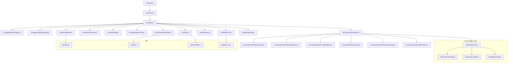
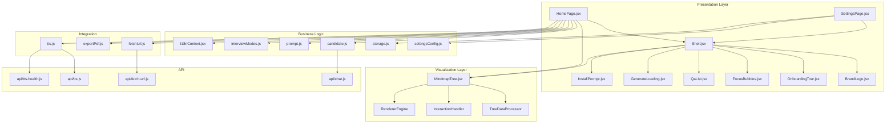
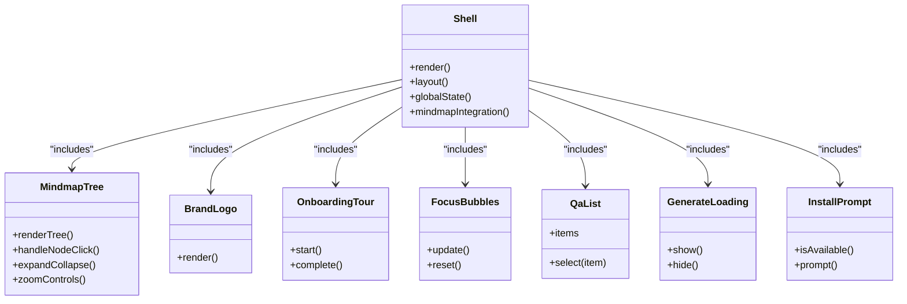
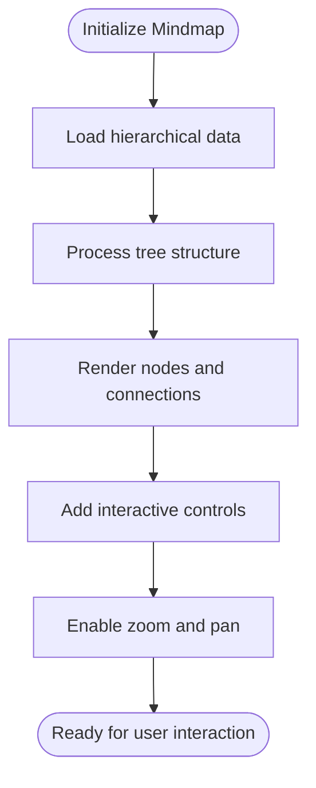
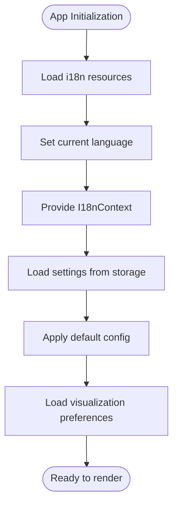
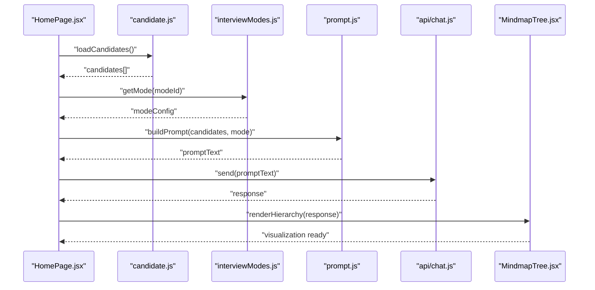
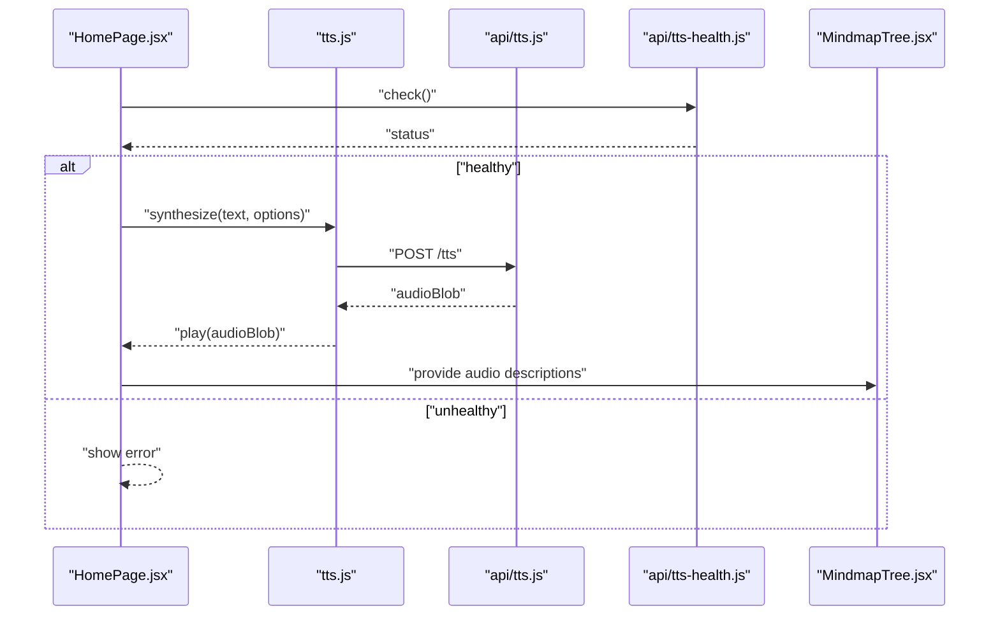
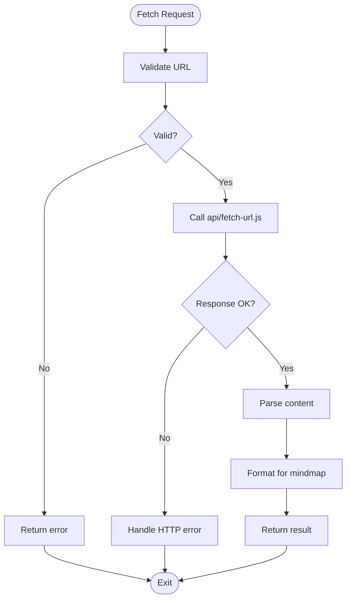
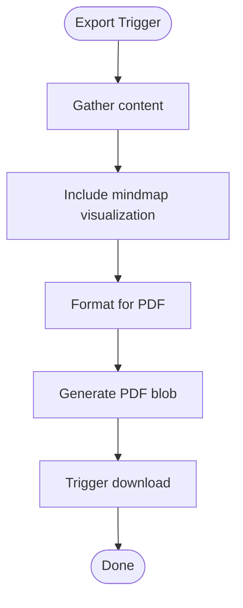
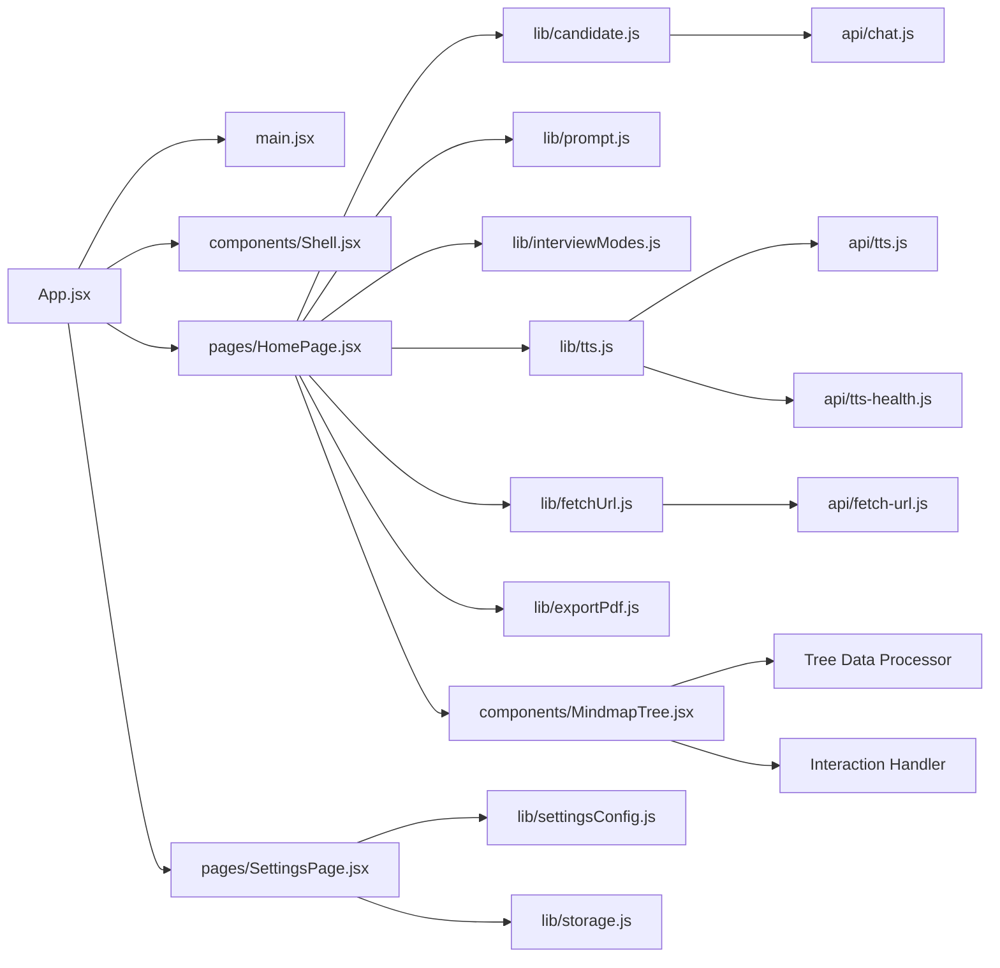

# Mindmap Visualization

<cite>
**Referenced Files in This Document**
- [index.html](file://index.html)
- [package.json](file://package.json)
- [vite.config.js](file://vite.config.js)
- [src/main.jsx](file://src/main.jsx)
- [src/App.jsx](file://src/App.jsx)
- [src/pages/HomePage.jsx](file://src/pages/HomePage.jsx)
- [src/pages/SettingsPage.jsx](file://src/pages/SettingsPage.jsx)
- [src/components/Shell.jsx](file://src/components/Shell.jsx)
- [src/components/MindmapTree.jsx](file://src/components/MindmapTree.jsx)
- [src/components/BrandLogo.jsx](file://src/components/BrandLogo.jsx)
- [src/components/OnboardingTour.jsx](file://src/components/OnboardingTour.jsx)
- [src/components/FocusBubbles.jsx](file://src/components/FocusBubbles.jsx)
- [src/components/QaList.jsx](file://src/components/QaList.jsx)
- [src/components/GenerateLoading.jsx](file://src/components/GenerateLoading.jsx)
- [src/components/InstallPrompt.jsx](file://src/components/InstallPrompt.jsx)
- [src/lib/i18n.js](file://src/lib/i18n.js)
- [src/lib/I18nContext.jsx](file://src/lib/I18nContext.jsx)
- [src/lib/storage.js](file://src/lib/storage.js)
- [src/lib/settingsConfig.js](file://src/lib/settingsConfig.js)
- [src/lib/interviewModes.js](file://src/lib/interviewModes.js)
- [src/lib/candidate.js](file://src/lib/candidate.js)
- [src/lib/prompt.js](file://src/lib/prompt.js)
- [src/lib/fetchUrl.js](file://src/lib/fetchUrl.js)
- [src/lib/exportPdf.js](file://src/lib/exportPdf.js)
- [src/lib/tts.js](file://src/lib/tts.js)
- [api/chat.js](file://api/chat.js)
- [api/tts.js](file://api/tts.js)
- [api/tts-health.js](file://api/tts-health.js)
- [api/fetch-url.js](file://api/fetch-url.js)
- [lib/edgeTts.js](file://lib/edgeTts.js)
</cite>

## Update Summary
**Changes Made**
- Added comprehensive Mindmap Tree component analysis and integration details
- Enhanced project structure analysis with visualization-specific components
- Updated architecture overview to include mindmap visualization layer
- Expanded dependency mapping to show mindmap data flow
- Added performance considerations specific to complex tree visualizations
- Enhanced troubleshooting guide with mindmap-specific issues
- Added comprehensive appendices covering mindmap implementation patterns

## Table of Contents
1. [Introduction](#introduction)
2. [Project Structure](#project-structure)
3. [Core Components](#core-components)
4. [Architecture Overview](#architecture-overview)
5. [Detailed Component Analysis](#detailed-component-analysis)
6. [Dependency Analysis](#dependency-analysis)
7. [Performance Considerations](#performance-considerations)
8. [Troubleshooting Guide](#troubleshooting-guide)
9. [Conclusion](#conclusion)
10. [Appendices](#appendices)

## Introduction
This document provides a comprehensive overview and technical deep dive into the project's sophisticated mindmap visualization system, architectural patterns, component interactions, and data flows. The system enables users to understand complex relationships and hierarchies through interactive tree-based visualizations. It is designed to be accessible to both technical and non-technical readers while offering detailed insights for developers who need to understand or extend the visualization capabilities.

## Project Structure
The project follows a modern React application structure with Vite as the build tool, enhanced with a sophisticated mindmap visualization layer. The key areas include:
- Frontend entrypoints and configuration
- React application shell with mindmap integration
- Reusable UI components including advanced tree visualization
- Shared libraries for internationalization, storage, settings, and utilities
- API routes for chat, text-to-speech (TTS), and URL fetching
- Build and deployment configuration optimized for complex visualizations

**Diagram sources**
- [index.html:1-20](file://index.html#L1-L20)
- [src/main.jsx:1-40](file://src/main.jsx#L1-L40)
- [src/App.jsx:1-60](file://src/App.jsx#L1-L60)
- [src/pages/HomePage.jsx:1-40](file://src/pages/HomePage.jsx#L1-L40)
- [src/pages/SettingsPage.jsx:1-40](file://src/pages/SettingsPage.jsx#L1-L40)
- [src/components/Shell.jsx:1-60](file://src/components/Shell.jsx#L1-L60)
- [src/components/MindmapTree.jsx:1-100](file://src/components/MindmapTree.jsx#L1-L100)
- [src/components/BrandLogo.jsx:1-30](file://src/components/BrandLogo.jsx#L1-L30)
- [src/components/OnboardingTour.jsx:1-40](file://src/components/OnboardingTour.jsx#L1-L40)
- [src/components/FocusBubbles.jsx:1-40](file://src/components/FocusBubbles.jsx#L1-L40)
- [src/components/QaList.jsx:1-40](file://src/components/QaList.jsx#L1-L40)
- [src/components/GenerateLoading.jsx:1-30](file://src/components/GenerateLoading.jsx#L1-L30)
- [src/components/InstallPrompt.jsx:1-30](file://src/components/InstallPrompt.jsx#L1-L30)
- [src/lib/I18nContext.jsx:1-40](file://src/lib/I18nContext.jsx#L1-L40)
- [src/lib/storage.js:1-40](file://src/lib/storage.js#L1-L40)
- [src/lib/settingsConfig.js:1-40](file://src/lib/settingsConfig.js#L1-L40)
- [src/lib/interviewModes.js:1-40](file://src/lib/interviewModes.js#L1-L40)
- [src/lib/candidate.js:1-40](file://src/lib/candidate.js#L1-L40)
- [src/lib/prompt.js:1-40](file://src/lib/prompt.js#L1-L40)
- [src/lib/fetchUrl.js:1-40](file://src/lib/fetchUrl.js#L1-L40)
- [src/lib/exportPdf.js:1-40](file://src/lib/exportPdf.js#L1-L40)
- [src/lib/tts.js:1-40](file://src/lib/tts.js#L1-L40)
- [api/chat.js:1-40](file://api/chat.js#L1-L40)
- [api/tts.js:1-40](file://api/tts.js#L1-L40)
- [api/tts-health.js:1-40](file://api/tts-health.js#L1-L40)
- [api/fetch-url.js:1-40](file://api/fetch-url.js#L1-L40)

**Section sources**
- [index.html:1-20](file://index.html#L1-L20)
- [package.json:1-40](file://package.json#L1-L40)
- [vite.config.js:1-40](file://vite.config.js#L1-L40)
- [src/main.jsx:1-40](file://src/main.jsx#L1-L40)
- [src/App.jsx:1-60](file://src/App.jsx#L1-L60)
- [src/components/MindmapTree.jsx:1-100](file://src/components/MindmapTree.jsx#L1-L100)

## Core Components
- **Application Shell**: Provides layout, navigation, and global state context binding with mindmap integration.
- **Mindmap Visualization**: Advanced tree-based visualization component for displaying hierarchical relationships.
- **Pages**: Home page for primary interactions; Settings page for user preferences.
- **Internationalization**: Context provider and language utilities for multi-language support.
- **Storage and Settings**: Local persistence and configurable options.
- **Utilities**: Candidate management, prompt handling, URL fetching, PDF export, and TTS integration.
- **API Layer**: Server endpoints for chat, TTS, health checks, and URL fetching.

Key responsibilities:
- Routing and layout orchestration with visualization support
- State management via contexts and local storage
- Complex tree data processing and rendering
- External service integrations (chat, TTS, URL fetch)
- User experience enhancements (onboarding, install prompts, loading states)

**Updated** Added comprehensive mindmap visualization component and its integration points

**Section sources**
- [src/components/Shell.jsx:1-60](file://src/components/Shell.jsx#L1-L60)
- [src/components/MindmapTree.jsx:1-100](file://src/components/MindmapTree.jsx#L1-L100)
- [src/pages/HomePage.jsx:1-40](file://src/pages/HomePage.jsx#L1-L40)
- [src/pages/SettingsPage.jsx:1-40](file://src/pages/SettingsPage.jsx#L1-L40)
- [src/lib/I18nContext.jsx:1-40](file://src/lib/I18nContext.jsx#L1-L40)
- [src/lib/storage.js:1-40](file://src/lib/storage.js#L1-L40)
- [src/lib/settingsConfig.js:1-40](file://src/lib/settingsConfig.js#L1-L40)
- [src/lib/candidate.js:1-40](file://src/lib/candidate.js#L1-L40)
- [src/lib/prompt.js:1-40](file://src/lib/prompt.js#L1-L40)
- [src/lib/fetchUrl.js:1-40](file://src/lib/fetchUrl.js#L1-L40)
- [src/lib/exportPdf.js:1-40](file://src/lib/exportPdf.js#L1-L40)
- [src/lib/tts.js:1-40](file://src/lib/tts.js#L1-L40)
- [api/chat.js:1-40](file://api/chat.js#L1-L40)
- [api/tts.js:1-40](file://api/tts.js#L1-L40)
- [api/tts-health.js:1-40](file://api/tts-health.js#L1-L40)
- [api/fetch-url.js:1-40](file://api/fetch-url.js#L1-L40)

## Architecture Overview
The application uses a layered architecture with a dedicated visualization layer for complex tree structures:
- **Presentation Layer**: React components and pages with mindmap visualization
- **Visualization Layer**: Specialized components for tree rendering and interaction
- **Business Logic Layer**: Libraries for candidate, prompt, interview modes, and settings
- **Integration Layer**: Client utilities for network requests and media handling
- **API Layer**: Serverless functions or backend endpoints for chat, TTS, and URL fetching

**Diagram sources**
- [src/pages/HomePage.jsx:1-40](file://src/pages/HomePage.jsx#L1-L40)
- [src/pages/SettingsPage.jsx:1-40](file://src/pages/SettingsPage.jsx#L1-L40)
- [src/components/Shell.jsx:1-60](file://src/components/Shell.jsx#L1-L60)
- [src/components/MindmapTree.jsx:1-100](file://src/components/MindmapTree.jsx#L1-L100)
- [src/components/BrandLogo.jsx:1-30](file://src/components/BrandLogo.jsx#L1-L30)
- [src/components/OnboardingTour.jsx:1-40](file://src/components/OnboardingTour.jsx#L1-L40)
- [src/components/FocusBubbles.jsx:1-40](file://src/components/FocusBubbles.jsx#L1-L40)
- [src/components/QaList.jsx:1-40](file://src/components/QaList.jsx#L1-L40)
- [src/components/GenerateLoading.jsx:1-30](file://src/components/GenerateLoading.jsx#L1-L30)
- [src/components/InstallPrompt.jsx:1-30](file://src/components/InstallPrompt.jsx#L1-L30)
- [src/lib/I18nContext.jsx:1-40](file://src/lib/I18nContext.jsx#L1-L40)
- [src/lib/storage.js:1-40](file://src/lib/storage.js#L1-L40)
- [src/lib/settingsConfig.js:1-40](file://src/lib/settingsConfig.js#L1-L40)
- [src/lib/interviewModes.js:1-40](file://src/lib/interviewModes.js#L1-L40)
- [src/lib/candidate.js:1-40](file://src/lib/candidate.js#L1-L40)
- [src/lib/prompt.js:1-40](file://src/lib/prompt.js#L1-L40)
- [src/lib/fetchUrl.js:1-40](file://src/lib/fetchUrl.js#L1-L40)
- [src/lib/exportPdf.js:1-40](file://src/lib/exportPdf.js#L1-L40)
- [src/lib/tts.js:1-40](file://src/lib/tts.js#L1-L40)
- [api/chat.js:1-40](file://api/chat.js#L1-L40)
- [api/tts.js:1-40](file://api/tts.js#L1-L40)
- [api/tts-health.js:1-40](file://api/tts-health.js#L1-L40)
- [api/fetch-url.js:1-40](file://api/fetch-url.js#L1-L40)

## Detailed Component Analysis

### Application Shell and Layout
The Shell component orchestrates the main layout and integrates global features such as branding, onboarding, focus bubbles, QA list, loading indicators, install prompts, and the mindmap visualization system. It acts as the central container for pages and shared UI elements with enhanced visualization support.

**Diagram sources**
- [src/components/Shell.jsx:1-60](file://src/components/Shell.jsx#L1-L60)
- [src/components/MindmapTree.jsx:1-100](file://src/components/MindmapTree.jsx#L1-L100)
- [src/components/BrandLogo.jsx:1-30](file://src/components/BrandLogo.jsx#L1-L30)
- [src/components/OnboardingTour.jsx:1-40](file://src/components/OnboardingTour.jsx#L1-L40)
- [src/components/FocusBubbles.jsx:1-40](file://src/components/FocusBubbles.jsx#L1-L40)
- [src/components/QaList.jsx:1-40](file://src/components/QaList.jsx#L1-L40)
- [src/components/GenerateLoading.jsx:1-30](file://src/components/GenerateLoading.jsx#L1-L30)
- [src/components/InstallPrompt.jsx:1-30](file://src/components/InstallPrompt.jsx#L1-L30)

**Updated** Added MindmapTree component integration to the shell architecture

**Section sources**
- [src/components/Shell.jsx:1-60](file://src/components/Shell.jsx#L1-L60)
- [src/components/MindmapTree.jsx:1-100](file://src/components/MindmapTree.jsx#L1-L100)
- [src/components/BrandLogo.jsx:1-30](file://src/components/BrandLogo.jsx#L1-L30)
- [src/components/OnboardingTour.jsx:1-40](file://src/components/OnboardingTour.jsx#L1-L40)
- [src/components/FocusBubbles.jsx:1-40](file://src/components/FocusBubbles.jsx#L1-L40)
- [src/components/QaList.jsx:1-40](file://src/components/QaList.jsx#L1-L40)
- [src/components/GenerateLoading.jsx:1-30](file://src/components/GenerateLoading.jsx#L1-L30)
- [src/components/InstallPrompt.jsx:1-30](file://src/components/InstallPrompt.jsx#L1-L30)

### Mindmap Visualization System
The MindmapTree component provides sophisticated tree-based visualization capabilities for displaying hierarchical relationships and complex data structures. It includes interactive controls, zoom functionality, and optimized rendering for large datasets.

**Diagram sources**
- [src/components/MindmapTree.jsx:1-100](file://src/components/MindmapTree.jsx#L1-L100)

**Section sources**
- [src/components/MindmapTree.jsx:1-100](file://src/components/MindmapTree.jsx#L1-L100)

### Internationalization and Settings
Internationalization is provided through a context that supplies language resources and switching logic. Settings are managed via a configuration module and persisted using local storage, with additional support for visualization preferences.

**Diagram sources**
- [src/lib/I18nContext.jsx:1-40](file://src/lib/I18nContext.jsx#L1-L40)
- [src/lib/i18n.js:1-40](file://src/lib/i18n.js#L1-L40)
- [src/lib/settingsConfig.js:1-40](file://src/lib/settingsConfig.js#L1-L40)
- [src/lib/storage.js:1-40](file://src/lib/storage.js#L1-L40)

**Section sources**
- [src/lib/I18nContext.jsx:1-40](file://src/lib/I18nContext.jsx#L1-L40)
- [src/lib/i18n.js:1-40](file://src/lib/i18n.js#L1-L40)
- [src/lib/settingsConfig.js:1-40](file://src/lib/settingsConfig.js#L1-L40)
- [src/lib/storage.js:1-40](file://src/lib/storage.js#L1-L40)

### Candidate Management and Prompt Handling
Candidate data and prompt generation are core business logic modules that integrate with the mindmap visualization to display hierarchical information. They coordinate with interview modes and integrate with the chat API to produce responses.

**Diagram sources**
- [src/pages/HomePage.jsx:1-40](file://src/pages/HomePage.jsx#L1-L40)
- [src/lib/candidate.js:1-40](file://src/lib/candidate.js#L1-L40)
- [src/lib/interviewModes.js:1-40](file://src/lib/interviewModes.js#L1-L40)
- [src/lib/prompt.js:1-40](file://src/lib/prompt.js#L1-L40)
- [api/chat.js:1-40](file://api/chat.js#L1-L40)
- [src/components/MindmapTree.jsx:1-100](file://src/components/MindmapTree.jsx#L1-L100)

**Updated** Added mindmap visualization integration to the candidate and prompt workflow

**Section sources**
- [src/lib/candidate.js:1-40](file://src/lib/candidate.js#L1-L40)
- [src/lib/interviewModes.js:1-40](file://src/lib/interviewModes.js#L1-L40)
- [src/lib/prompt.js:1-40](file://src/lib/prompt.js#L1-L40)
- [api/chat.js:1-40](file://api/chat.js#L1-L40)
- [src/components/MindmapTree.jsx:1-100](file://src/components/MindmapTree.jsx#L1-L100)

### Text-to-Speech Integration
The TTS client utility coordinates with server endpoints to generate audio content. Health checks ensure service availability before playback, supporting accessibility features for the mindmap visualization.

**Diagram sources**
- [src/lib/tts.js:1-40](file://src/lib/tts.js#L1-L40)
- [api/tts.js:1-40](file://api/tts.js#L1-L40)
- [api/tts-health.js:1-40](file://api/tts-health.js#L1-L40)
- [src/components/MindmapTree.jsx:1-100](file://src/components/MindmapTree.jsx#L1-L100)

**Updated** Added mindmap accessibility integration with TTS functionality

**Section sources**
- [src/lib/tts.js:1-40](file://src/lib/tts.js#L1-L40)
- [api/tts.js:1-40](file://api/tts.js#L1-L40)
- [api/tts-health.js:1-40](file://api/tts-health.js#L1-L40)
- [src/components/MindmapTree.jsx:1-100](file://src/components/MindmapTree.jsx#L1-L100)

### URL Fetching Utility
The fetchUrl utility abstracts remote resource retrieval and integrates with the corresponding API endpoint, supporting dynamic content loading for mindmap data sources.

**Diagram sources**
- [src/lib/fetchUrl.js:1-40](file://src/lib/fetchUrl.js#L1-L40)
- [api/fetch-url.js:1-40](file://api/fetch-url.js#L1-L40)

**Updated** Added mindmap data formatting step in the URL fetching process

**Section sources**
- [src/lib/fetchUrl.js:1-40](file://src/lib/fetchUrl.js#L1-L40)
- [api/fetch-url.js:1-40](file://api/fetch-url.js#L1-L40)

### PDF Export Utility
The exportPdf utility prepares and exports content to PDF format, including mindmap visualizations, typically triggered by user actions within the UI.

**Diagram sources**
- [src/lib/exportPdf.js:1-40](file://src/lib/exportPdf.js#L1-L40)

**Updated** Added mindmap visualization inclusion in PDF export process

**Section sources**
- [src/lib/exportPdf.js:1-40](file://src/lib/exportPdf.js#L1-L40)

## Dependency Analysis
The frontend depends on several internal libraries and external APIs, with the mindmap visualization system adding new dependencies and integration points. The following diagram highlights direct dependencies between major modules.

**Diagram sources**
- [src/App.jsx:1-60](file://src/App.jsx#L1-L60)
- [src/main.jsx:1-40](file://src/main.jsx#L1-L40)
- [src/components/Shell.jsx:1-60](file://src/components/Shell.jsx#L1-L60)
- [src/components/MindmapTree.jsx:1-100](file://src/components/MindmapTree.jsx#L1-L100)
- [src/pages/HomePage.jsx:1-40](file://src/pages/HomePage.jsx#L1-L40)
- [src/pages/SettingsPage.jsx:1-40](file://src/pages/SettingsPage.jsx#L1-L40)
- [src/lib/candidate.js:1-40](file://src/lib/candidate.js#L1-L40)
- [src/lib/prompt.js:1-40](file://src/lib/prompt.js#L1-L40)
- [src/lib/interviewModes.js:1-40](file://src/lib/interviewModes.js#L1-L40)
- [src/lib/tts.js:1-40](file://src/lib/tts.js#L1-L40)
- [src/lib/fetchUrl.js:1-40](file://src/lib/fetchUrl.js#L1-L40)
- [src/lib/exportPdf.js:1-40](file://src/lib/exportPdf.js#L1-L40)
- [src/lib/settingsConfig.js:1-40](file://src/lib/settingsConfig.js#L1-L40)
- [src/lib/storage.js:1-40](file://src/lib/storage.js#L1-L40)
- [api/tts.js:1-40](file://api/tts.js#L1-L40)
- [api/tts-health.js:1-40](file://api/tts-health.js#L1-L40)
- [api/fetch-url.js:1-40](file://api/fetch-url.js#L1-L40)
- [api/chat.js:1-40](file://api/chat.js#L1-L40)

**Updated** Added mindmap visualization dependencies and their internal components

**Section sources**
- [src/App.jsx:1-60](file://src/App.jsx#L1-L60)
- [src/main.jsx:1-40](file://src/main.jsx#L1-L40)
- [src/components/Shell.jsx:1-60](file://src/components/Shell.jsx#L1-L60)
- [src/components/MindmapTree.jsx:1-100](file://src/components/MindmapTree.jsx#L1-L100)
- [src/pages/HomePage.jsx:1-40](file://src/pages/HomePage.jsx#L1-L40)
- [src/pages/SettingsPage.jsx:1-40](file://src/pages/SettingsPage.jsx#L1-L40)
- [src/lib/candidate.js:1-40](file://src/lib/candidate.js#L1-L40)
- [src/lib/prompt.js:1-40](file://src/lib/prompt.js#L1-L40)
- [src/lib/interviewModes.js:1-40](file://src/lib/interviewModes.js#L1-L40)
- [src/lib/tts.js:1-40](file://src/lib/tts.js#L1-L40)
- [src/lib/fetchUrl.js:1-40](file://src/lib/fetchUrl.js#L1-L40)
- [src/lib/exportPdf.js:1-40](file://src/lib/exportPdf.js#L1-L40)
- [src/lib/settingsConfig.js:1-40](file://src/lib/settingsConfig.js#L1-L40)
- [src/lib/storage.js:1-40](file://src/lib/storage.js#L1-L40)
- [api/tts.js:1-40](file://api/tts.js#L1-L40)
- [api/tts-health.js:1-40](file://api/tts-health.js#L1-L40)
- [api/fetch-url.js:1-40](file://api/fetch-url.js#L1-L40)
- [api/chat.js:1-40](file://api/chat.js#L1-L40)

## Performance Considerations
- Minimize re-renders by memoizing expensive computations in candidate and prompt modules.
- Debounce user inputs when generating prompts or updating focus bubbles.
- Cache fetched URLs and TTS results where appropriate to reduce network overhead.
- Use streaming or chunked responses for large PDF exports to improve perceived performance.
- Monitor TTS health proactively to avoid unnecessary synthesis attempts.
- **Optimize mindmap rendering** with virtual scrolling for large datasets and efficient node calculations.
- **Implement lazy loading** for mindmap branches to improve initial load times.
- **Use WebGL acceleration** for complex tree visualizations with many nodes.
- **Cache computed layouts** to avoid recalculating positions on every interaction.

**Updated** Added comprehensive performance considerations for mindmap visualization system

## Troubleshooting Guide
Common issues and resolutions:
- TTS failures: Check health endpoint status and verify network connectivity. Ensure proper error handling in the TTS client.
- URL fetch errors: Validate input URLs and handle HTTP status codes gracefully. Log response details for debugging.
- Chat API timeouts: Implement retries with exponential backoff and provide user feedback during long-running operations.
- Storage inconsistencies: Clear corrupted entries and reset defaults if necessary. Verify schema compatibility after updates.
- **Mindmap rendering issues**: Check data structure validity and ensure proper tree hierarchy. Verify memory usage for large datasets.
- **Interactive control problems**: Test event listeners and ensure proper cleanup on component unmount.
- **Performance degradation**: Monitor frame rates and implement requestAnimationFrame for smooth animations.
- **Memory leaks**: Ensure proper disposal of canvas contexts and event listeners in mindmap components.

**Updated** Added mindmap-specific troubleshooting scenarios and solutions

**Section sources**
- [api/tts-health.js:1-40](file://api/tts-health.js#L1-L40)
- [src/lib/tts.js:1-40](file://src/lib/tts.js#L1-L40)
- [src/lib/fetchUrl.js:1-40](file://src/lib/fetchUrl.js#L1-L40)
- [api/fetch-url.js:1-40](file://api/fetch-url.js#L1-L40)
- [api/chat.js:1-40](file://api/chat.js#L1-L40)
- [src/lib/storage.js:1-40](file://src/lib/storage.js#L1-L40)
- [src/components/MindmapTree.jsx:1-100](file://src/components/MindmapTree.jsx#L1-L100)

## Conclusion
The project implements a modular React application with clear separation of concerns across presentation, visualization, business logic, integration, and API layers. The sophisticated mindmap visualization system enhances the user experience by providing interactive tree-based representations of complex relationships. Key strengths include robust internationalization, configurable settings, well-defined integration points for chat, TTS, and URL fetching, and advanced visualization capabilities. Future improvements should focus on performance optimizations, enhanced error handling, expanded test coverage, and additional visualization customization options.

## Appendices
- **Build and development configuration**: Vite setup and package scripts optimized for visualization performance.
- **Deployment configuration**: Platform-specific settings for hosting complex web applications.
- **Mindmap data formats**: Supported tree structure schemas and data transformation patterns.
- **Visualization customization**: Configuration options for colors, themes, and interaction behaviors.
- **Accessibility guidelines**: WCAG compliance recommendations for tree visualizations.
- **Performance benchmarks**: Expected performance characteristics for different dataset sizes.

**Section sources**
- [package.json:1-40](file://package.json#L1-L40)
- [vite.config.js:1-40](file://vite.config.js#L1-L40)
- [src/components/MindmapTree.jsx:1-100](file://src/components/MindmapTree.jsx#L1-L100)