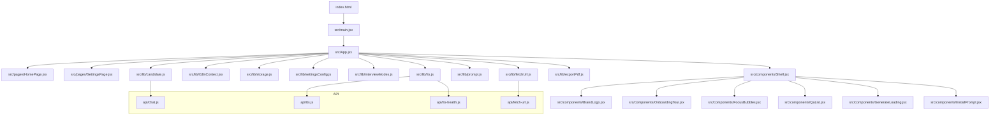
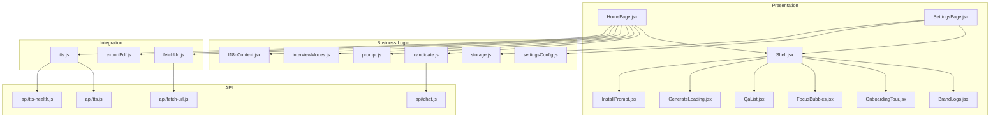
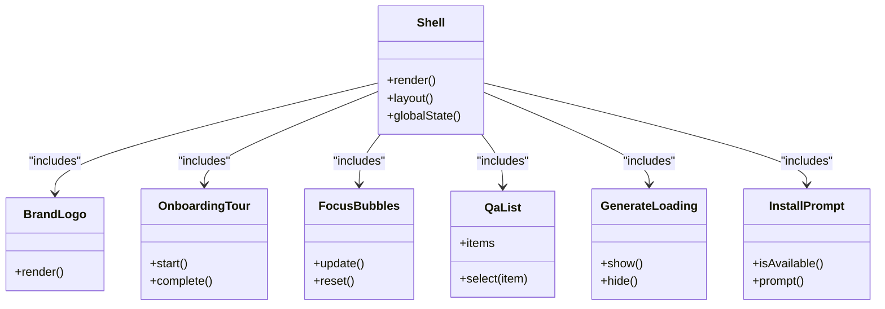
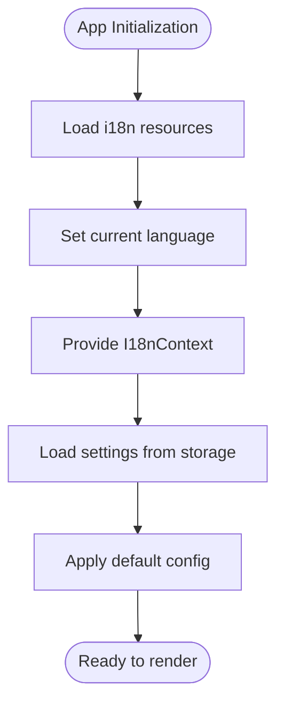
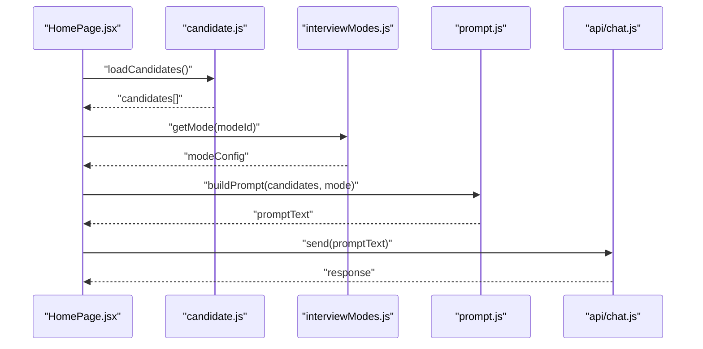
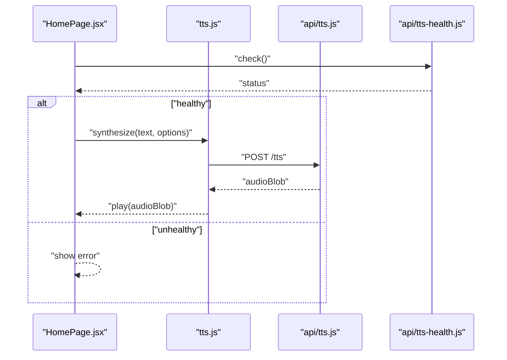
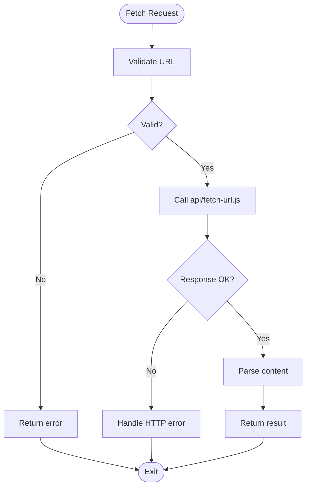
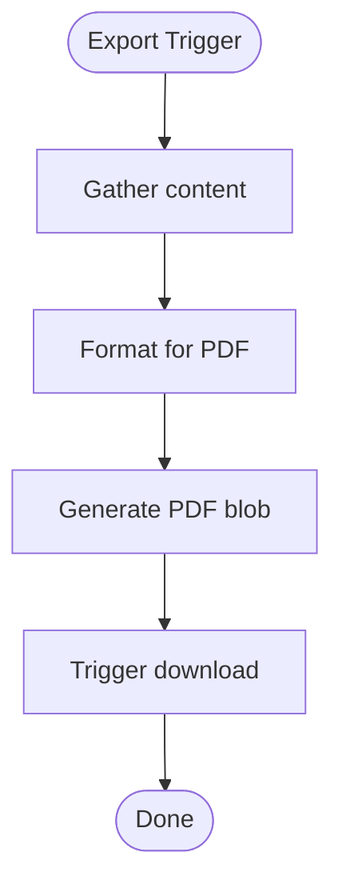
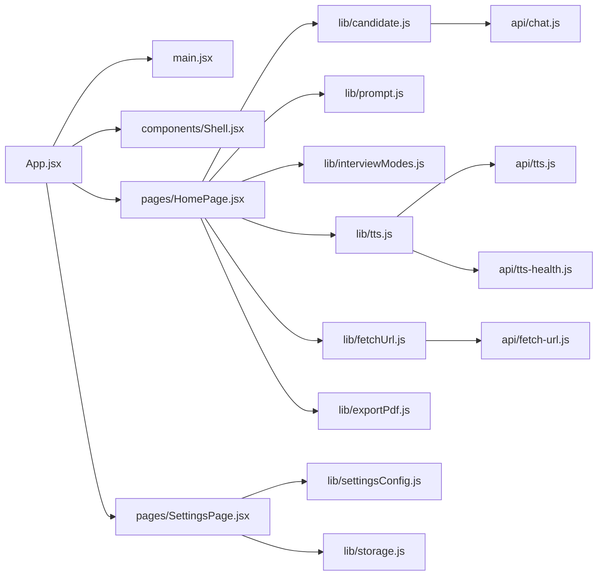

# Mindmap Visualization

<cite>
**Referenced Files in This Document**
- [index.html](file://index.html)
- [package.json](file://package.json)
- [vite.config.js](file://vite.config.js)
- [src/main.jsx](file://src/main.jsx)
- [src/App.jsx](file://src/App.jsx)
- [src/pages/HomePage.jsx](file://src/pages/HomePage.jsx)
- [src/pages/SettingsPage.jsx](file://src/pages/SettingsPage.jsx)
- [src/components/Shell.jsx](file://src/components/Shell.jsx)
- [src/components/BrandLogo.jsx](file://src/components/BrandLogo.jsx)
- [src/components/OnboardingTour.jsx](file://src/components/OnboardingTour.jsx)
- [src/components/FocusBubbles.jsx](file://src/components/FocusBubbles.jsx)
- [src/components/QaList.jsx](file://src/components/QaList.jsx)
- [src/components/GenerateLoading.jsx](file://src/components/GenerateLoading.jsx)
- [src/components/InstallPrompt.jsx](file://src/components/InstallPrompt.jsx)
- [src/lib/i18n.js](file://src/lib/i18n.js)
- [src/lib/I18nContext.jsx](file://src/lib/I18nContext.jsx)
- [src/lib/storage.js](file://src/lib/storage.js)
- [src/lib/settingsConfig.js](file://src/lib/settingsConfig.js)
- [src/lib/interviewModes.js](file://src/lib/interviewModes.js)
- [src/lib/candidate.js](file://src/lib/candidate.js)
- [src/lib/prompt.js](file://src/lib/prompt.js)
- [src/lib/fetchUrl.js](file://src/lib/fetchUrl.js)
- [src/lib/exportPdf.js](file://src/lib/exportPdf.js)
- [src/lib/tts.js](file://src/lib/tts.js)
- [api/chat.js](file://api/chat.js)
- [api/tts.js](file://api/tts.js)
- [api/tts-health.js](file://api/tts-health.js)
- [api/fetch-url.js](file://api/fetch-url.js)
- [lib/edgeTts.js](file://lib/edgeTts.js)
</cite>

## Table of Contents
1. [Introduction](#introduction)
2. [Project Structure](#project-structure)
3. [Core Components](#core-components)
4. [Architecture Overview](#architecture-overview)
5. [Detailed Component Analysis](#detailed-component-analysis)
6. [Dependency Analysis](#dependency-analysis)
7. [Performance Considerations](#performance-considerations)
8. [Troubleshooting Guide](#troubleshooting-guide)
9. [Conclusion](#conclusion)
10. [Appendices](#appendices)

## Introduction
This document provides a comprehensive overview and technical deep dive into the project’s architecture, components, data flows, and integration points. It is designed to be accessible to both technical and non-technical readers while offering detailed insights for developers who need to understand or extend the system.

## Project Structure
The project follows a modern React application structure with Vite as the build tool and an API layer for server-side functionality. The key areas include:
- Frontend entrypoints and configuration
- React application shell and pages
- Reusable UI components
- Shared libraries for internationalization, storage, settings, and utilities
- API routes for chat, text-to-speech (TTS), and URL fetching
- Build and deployment configuration

**Diagram sources**
- [index.html:1-20](file://index.html#L1-L20)
- [src/main.jsx:1-40](file://src/main.jsx#L1-L40)
- [src/App.jsx:1-60](file://src/App.jsx#L1-L60)
- [src/pages/HomePage.jsx:1-40](file://src/pages/HomePage.jsx#L1-L40)
- [src/pages/SettingsPage.jsx:1-40](file://src/pages/SettingsPage.jsx#L1-L40)
- [src/components/Shell.jsx:1-60](file://src/components/Shell.jsx#L1-L60)
- [src/components/BrandLogo.jsx:1-30](file://src/components/BrandLogo.jsx#L1-L30)
- [src/components/OnboardingTour.jsx:1-40](file://src/components/OnboardingTour.jsx#L1-L40)
- [src/components/FocusBubbles.jsx:1-40](file://src/components/FocusBubbles.jsx#L1-L40)
- [src/components/QaList.jsx:1-40](file://src/components/QaList.jsx#L1-L40)
- [src/components/GenerateLoading.jsx:1-30](file://src/components/GenerateLoading.jsx#L1-L30)
- [src/components/InstallPrompt.jsx:1-30](file://src/components/InstallPrompt.jsx#L1-L30)
- [src/lib/I18nContext.jsx:1-40](file://src/lib/I18nContext.jsx#L1-L40)
- [src/lib/storage.js:1-40](file://src/lib/storage.js#L1-L40)
- [src/lib/settingsConfig.js:1-40](file://src/lib/settingsConfig.js#L1-L40)
- [src/lib/interviewModes.js:1-40](file://src/lib/interviewModes.js#L1-L40)
- [src/lib/candidate.js:1-40](file://src/lib/candidate.js#L1-L40)
- [src/lib/prompt.js:1-40](file://src/lib/prompt.js#L1-L40)
- [src/lib/fetchUrl.js:1-40](file://src/lib/fetchUrl.js#L1-L40)
- [src/lib/exportPdf.js:1-40](file://src/lib/exportPdf.js#L1-L40)
- [src/lib/tts.js:1-40](file://src/lib/tts.js#L1-L40)
- [api/chat.js:1-40](file://api/chat.js#L1-L40)
- [api/tts.js:1-40](file://api/tts.js#L1-L40)
- [api/tts-health.js:1-40](file://api/tts-health.js#L1-L40)
- [api/fetch-url.js:1-40](file://api/fetch-url.js#L1-L40)

**Section sources**
- [index.html:1-20](file://index.html#L1-L20)
- [package.json:1-40](file://package.json#L1-L40)
- [vite.config.js:1-40](file://vite.config.js#L1-L40)
- [src/main.jsx:1-40](file://src/main.jsx#L1-L40)
- [src/App.jsx:1-60](file://src/App.jsx#L1-L60)

## Core Components
- Application Shell: Provides layout, navigation, and global state context binding.
- Pages: Home page for primary interactions; Settings page for user preferences.
- Internationalization: Context provider and language utilities for multi-language support.
- Storage and Settings: Local persistence and configurable options.
- Utilities: Candidate management, prompt handling, URL fetching, PDF export, and TTS integration.
- API Layer: Server endpoints for chat, TTS, health checks, and URL fetching.

Key responsibilities:
- Routing and layout orchestration
- State management via contexts and local storage
- External service integrations (chat, TTS, URL fetch)
- User experience enhancements (onboarding, install prompts, loading states)

**Section sources**
- [src/components/Shell.jsx:1-60](file://src/components/Shell.jsx#L1-L60)
- [src/pages/HomePage.jsx:1-40](file://src/pages/HomePage.jsx#L1-L40)
- [src/pages/SettingsPage.jsx:1-40](file://src/pages/SettingsPage.jsx#L1-L40)
- [src/lib/I18nContext.jsx:1-40](file://src/lib/I18nContext.jsx#L1-L40)
- [src/lib/storage.js:1-40](file://src/lib/storage.js#L1-L40)
- [src/lib/settingsConfig.js:1-40](file://src/lib/settingsConfig.js#L1-L40)
- [src/lib/candidate.js:1-40](file://src/lib/candidate.js#L1-L40)
- [src/lib/prompt.js:1-40](file://src/lib/prompt.js#L1-L40)
- [src/lib/fetchUrl.js:1-40](file://src/lib/fetchUrl.js#L1-L40)
- [src/lib/exportPdf.js:1-40](file://src/lib/exportPdf.js#L1-L40)
- [src/lib/tts.js:1-40](file://src/lib/tts.js#L1-L40)
- [api/chat.js:1-40](file://api/chat.js#L1-L40)
- [api/tts.js:1-40](file://api/tts.js#L1-L40)
- [api/tts-health.js:1-40](file://api/tts-health.js#L1-L40)
- [api/fetch-url.js:1-40](file://api/fetch-url.js#L1-L40)

## Architecture Overview
The application uses a layered architecture:
- Presentation Layer: React components and pages
- Business Logic Layer: Libraries for candidate, prompt, interview modes, and settings
- Integration Layer: Client utilities for network requests and media handling
- API Layer: Serverless functions or backend endpoints for chat, TTS, and URL fetching

**Diagram sources**
- [src/pages/HomePage.jsx:1-40](file://src/pages/HomePage.jsx#L1-L40)
- [src/pages/SettingsPage.jsx:1-40](file://src/pages/SettingsPage.jsx#L1-L40)
- [src/components/Shell.jsx:1-60](file://src/components/Shell.jsx#L1-L60)
- [src/components/BrandLogo.jsx:1-30](file://src/components/BrandLogo.jsx#L1-L30)
- [src/components/OnboardingTour.jsx:1-40](file://src/components/OnboardingTour.jsx#L1-L40)
- [src/components/FocusBubbles.jsx:1-40](file://src/components/FocusBubbles.jsx#L1-L40)
- [src/components/QaList.jsx:1-40](file://src/components/QaList.jsx#L1-L40)
- [src/components/GenerateLoading.jsx:1-30](file://src/components/GenerateLoading.jsx#L1-L30)
- [src/components/InstallPrompt.jsx:1-30](file://src/components/InstallPrompt.jsx#L1-L30)
- [src/lib/I18nContext.jsx:1-40](file://src/lib/I18nContext.jsx#L1-L40)
- [src/lib/storage.js:1-40](file://src/lib/storage.js#L1-L40)
- [src/lib/settingsConfig.js:1-40](file://src/lib/settingsConfig.js#L1-L40)
- [src/lib/interviewModes.js:1-40](file://src/lib/interviewModes.js#L1-L40)
- [src/lib/candidate.js:1-40](file://src/lib/candidate.js#L1-L40)
- [src/lib/prompt.js:1-40](file://src/lib/prompt.js#L1-L40)
- [src/lib/fetchUrl.js:1-40](file://src/lib/fetchUrl.js#L1-L40)
- [src/lib/exportPdf.js:1-40](file://src/lib/exportPdf.js#L1-L40)
- [src/lib/tts.js:1-40](file://src/lib/tts.js#L1-L40)
- [api/chat.js:1-40](file://api/chat.js#L1-L40)
- [api/tts.js:1-40](file://api/tts.js#L1-L40)
- [api/tts-health.js:1-40](file://api/tts-health.js#L1-L40)
- [api/fetch-url.js:1-40](file://api/fetch-url.js#L1-L40)

## Detailed Component Analysis

### Application Shell and Layout
The Shell component orchestrates the main layout and integrates global features such as branding, onboarding, focus bubbles, QA list, loading indicators, and install prompts. It acts as the central container for pages and shared UI elements.

**Diagram sources**
- [src/components/Shell.jsx:1-60](file://src/components/Shell.jsx#L1-L60)
- [src/components/BrandLogo.jsx:1-30](file://src/components/BrandLogo.jsx#L1-L30)
- [src/components/OnboardingTour.jsx:1-40](file://src/components/OnboardingTour.jsx#L1-L40)
- [src/components/FocusBubbles.jsx:1-40](file://src/components/FocusBubbles.jsx#L1-L40)
- [src/components/QaList.jsx:1-40](file://src/components/QaList.jsx#L1-L40)
- [src/components/GenerateLoading.jsx:1-30](file://src/components/GenerateLoading.jsx#L1-L30)
- [src/components/InstallPrompt.jsx:1-30](file://src/components/InstallPrompt.jsx#L1-L30)

**Section sources**
- [src/components/Shell.jsx:1-60](file://src/components/Shell.jsx#L1-L60)
- [src/components/BrandLogo.jsx:1-30](file://src/components/BrandLogo.jsx#L1-L30)
- [src/components/OnboardingTour.jsx:1-40](file://src/components/OnboardingTour.jsx#L1-L40)
- [src/components/FocusBubbles.jsx:1-40](file://src/components/FocusBubbles.jsx#L1-L40)
- [src/components/QaList.jsx:1-40](file://src/components/QaList.jsx#L1-L40)
- [src/components/GenerateLoading.jsx:1-30](file://src/components/GenerateLoading.jsx#L1-L30)
- [src/components/InstallPrompt.jsx:1-30](file://src/components/InstallPrompt.jsx#L1-L30)

### Internationalization and Settings
Internationalization is provided through a context that supplies language resources and switching logic. Settings are managed via a configuration module and persisted using local storage.

**Diagram sources**
- [src/lib/I18nContext.jsx:1-40](file://src/lib/I18nContext.jsx#L1-L40)
- [src/lib/i18n.js:1-40](file://src/lib/i18n.js#L1-L40)
- [src/lib/settingsConfig.js:1-40](file://src/lib/settingsConfig.js#L1-L40)
- [src/lib/storage.js:1-40](file://src/lib/storage.js#L1-L40)

**Section sources**
- [src/lib/I18nContext.jsx:1-40](file://src/lib/I18nContext.jsx#L1-L40)
- [src/lib/i18n.js:1-40](file://src/lib/i18n.js#L1-L40)
- [src/lib/settingsConfig.js:1-40](file://src/lib/settingsConfig.js#L1-L40)
- [src/lib/storage.js:1-40](file://src/lib/storage.js#L1-L40)

### Candidate Management and Prompt Handling
Candidate data and prompt generation are core business logic modules. They coordinate with interview modes and integrate with the chat API to produce responses.

**Diagram sources**
- [src/pages/HomePage.jsx:1-40](file://src/pages/HomePage.jsx#L1-L40)
- [src/lib/candidate.js:1-40](file://src/lib/candidate.js#L1-L40)
- [src/lib/interviewModes.js:1-40](file://src/lib/interviewModes.js#L1-L40)
- [src/lib/prompt.js:1-40](file://src/lib/prompt.js#L1-L40)
- [api/chat.js:1-40](file://api/chat.js#L1-L40)

**Section sources**
- [src/lib/candidate.js:1-40](file://src/lib/candidate.js#L1-L40)
- [src/lib/interviewModes.js:1-40](file://src/lib/interviewModes.js#L1-L40)
- [src/lib/prompt.js:1-40](file://src/lib/prompt.js#L1-L40)
- [api/chat.js:1-40](file://api/chat.js#L1-L40)

### Text-to-Speech Integration
The TTS client utility coordinates with server endpoints to generate audio content. Health checks ensure service availability before playback.

**Diagram sources**
- [src/lib/tts.js:1-40](file://src/lib/tts.js#L1-L40)
- [api/tts.js:1-40](file://api/tts.js#L1-L40)
- [api/tts-health.js:1-40](file://api/tts-health.js#L1-L40)

**Section sources**
- [src/lib/tts.js:1-40](file://src/lib/tts.js#L1-L40)
- [api/tts.js:1-40](file://api/tts.js#L1-L40)
- [api/tts-health.js:1-40](file://api/tts-health.js#L1-L40)

### URL Fetching Utility
The fetchUrl utility abstracts remote resource retrieval and integrates with the corresponding API endpoint.

**Diagram sources**
- [src/lib/fetchUrl.js:1-40](file://src/lib/fetchUrl.js#L1-L40)
- [api/fetch-url.js:1-40](file://api/fetch-url.js#L1-L40)

**Section sources**
- [src/lib/fetchUrl.js:1-40](file://src/lib/fetchUrl.js#L1-L40)
- [api/fetch-url.js:1-40](file://api/fetch-url.js#L1-L40)

### PDF Export Utility
The exportPdf utility prepares and exports content to PDF format, typically triggered by user actions within the UI.

**Diagram sources**
- [src/lib/exportPdf.js:1-40](file://src/lib/exportPdf.js#L1-L40)

**Section sources**
- [src/lib/exportPdf.js:1-40](file://src/lib/exportPdf.js#L1-L40)

## Dependency Analysis
The frontend depends on several internal libraries and external APIs. The following diagram highlights direct dependencies between major modules.

**Diagram sources**
- [src/App.jsx:1-60](file://src/App.jsx#L1-L60)
- [src/main.jsx:1-40](file://src/main.jsx#L1-L40)
- [src/components/Shell.jsx:1-60](file://src/components/Shell.jsx#L1-L60)
- [src/pages/HomePage.jsx:1-40](file://src/pages/HomePage.jsx#L1-L40)
- [src/pages/SettingsPage.jsx:1-40](file://src/pages/SettingsPage.jsx#L1-L40)
- [src/lib/candidate.js:1-40](file://src/lib/candidate.js#L1-L40)
- [src/lib/prompt.js:1-40](file://src/lib/prompt.js#L1-L40)
- [src/lib/interviewModes.js:1-40](file://src/lib/interviewModes.js#L1-L40)
- [src/lib/tts.js:1-40](file://src/lib/tts.js#L1-L40)
- [src/lib/fetchUrl.js:1-40](file://src/lib/fetchUrl.js#L1-L40)
- [src/lib/exportPdf.js:1-40](file://src/lib/exportPdf.js#L1-L40)
- [src/lib/settingsConfig.js:1-40](file://src/lib/settingsConfig.js#L1-L40)
- [src/lib/storage.js:1-40](file://src/lib/storage.js#L1-L40)
- [api/tts.js:1-40](file://api/tts.js#L1-L40)
- [api/tts-health.js:1-40](file://api/tts-health.js#L1-L40)
- [api/fetch-url.js:1-40](file://api/fetch-url.js#L1-L40)
- [api/chat.js:1-40](file://api/chat.js#L1-L40)

**Section sources**
- [src/App.jsx:1-60](file://src/App.jsx#L1-L60)
- [src/main.jsx:1-40](file://src/main.jsx#L1-L40)
- [src/components/Shell.jsx:1-60](file://src/components/Shell.jsx#L1-L60)
- [src/pages/HomePage.jsx:1-40](file://src/pages/HomePage.jsx#L1-L40)
- [src/pages/SettingsPage.jsx:1-40](file://src/pages/SettingsPage.jsx#L1-L40)
- [src/lib/candidate.js:1-40](file://src/lib/candidate.js#L1-L40)
- [src/lib/prompt.js:1-40](file://src/lib/prompt.js#L1-L40)
- [src/lib/interviewModes.js:1-40](file://src/lib/interviewModes.js#L1-L40)
- [src/lib/tts.js:1-40](file://src/lib/tts.js#L1-L40)
- [src/lib/fetchUrl.js:1-40](file://src/lib/fetchUrl.js#L1-L40)
- [src/lib/exportPdf.js:1-40](file://src/lib/exportPdf.js#L1-L40)
- [src/lib/settingsConfig.js:1-40](file://src/lib/settingsConfig.js#L1-L40)
- [src/lib/storage.js:1-40](file://src/lib/storage.js#L1-L40)
- [api/tts.js:1-40](file://api/tts.js#L1-L40)
- [api/tts-health.js:1-40](file://api/tts-health.js#L1-L40)
- [api/fetch-url.js:1-40](file://api/fetch-url.js#L1-L40)
- [api/chat.js:1-40](file://api/chat.js#L1-L40)

## Performance Considerations
- Minimize re-renders by memoizing expensive computations in candidate and prompt modules.
- Debounce user inputs when generating prompts or updating focus bubbles.
- Cache fetched URLs and TTS results where appropriate to reduce network overhead.
- Use streaming or chunked responses for large PDF exports to improve perceived performance.
- Monitor TTS health proactively to avoid unnecessary synthesis attempts.

[No sources needed since this section provides general guidance]

## Troubleshooting Guide
Common issues and resolutions:
- TTS failures: Check health endpoint status and verify network connectivity. Ensure proper error handling in the TTS client.
- URL fetch errors: Validate input URLs and handle HTTP status codes gracefully. Log response details for debugging.
- Chat API timeouts: Implement retries with exponential backoff and provide user feedback during long-running operations.
- Storage inconsistencies: Clear corrupted entries and reset defaults if necessary. Verify schema compatibility after updates.

**Section sources**
- [api/tts-health.js:1-40](file://api/tts-health.js#L1-L40)
- [src/lib/tts.js:1-40](file://src/lib/tts.js#L1-L40)
- [src/lib/fetchUrl.js:1-40](file://src/lib/fetchUrl.js#L1-L40)
- [api/fetch-url.js:1-40](file://api/fetch-url.js#L1-L40)
- [api/chat.js:1-40](file://api/chat.js#L1-L40)
- [src/lib/storage.js:1-40](file://src/lib/storage.js#L1-L40)

## Conclusion
The project implements a modular React application with clear separation of concerns across presentation, business logic, integration, and API layers. Key strengths include robust internationalization, configurable settings, and well-defined integration points for chat, TTS, and URL fetching. Future improvements should focus on performance optimizations, enhanced error handling, and expanded test coverage.

[No sources needed since this section summarizes without analyzing specific files]

## Appendices
- Build and development configuration: Vite setup and package scripts.
- Deployment configuration: Platform-specific settings for hosting.

**Section sources**
- [package.json:1-40](file://package.json#L1-L40)
- [vite.config.js:1-40](file://vite.config.js#L1-L40)