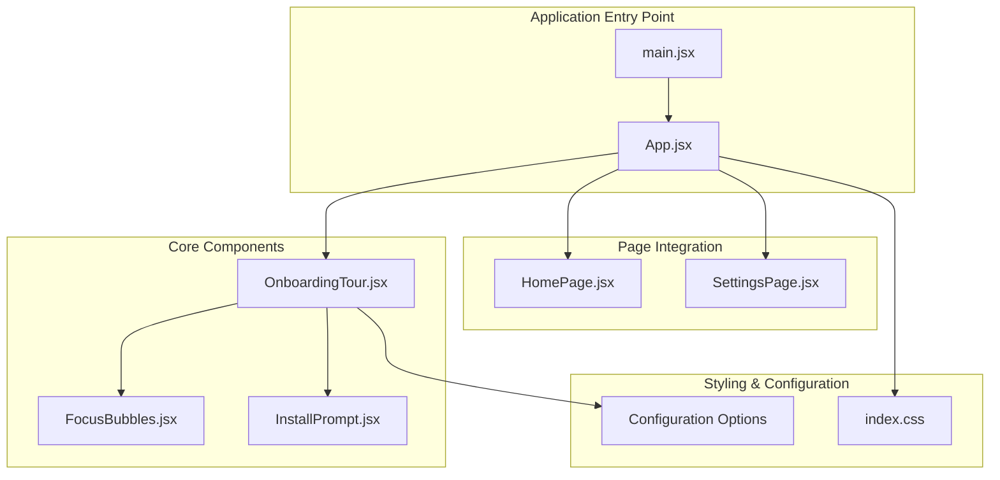
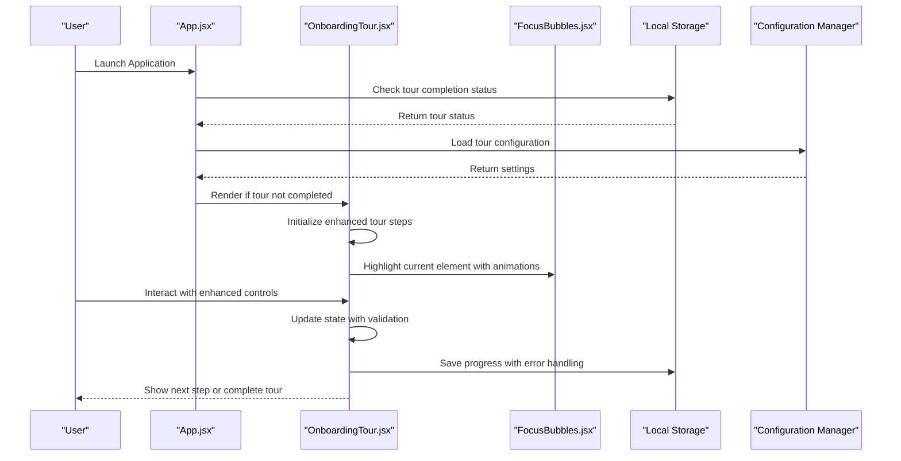
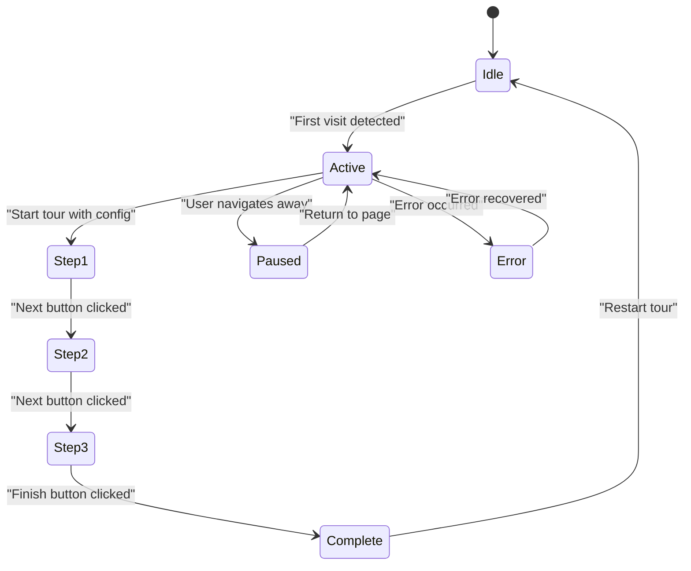
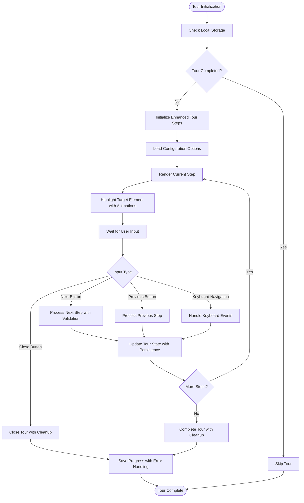
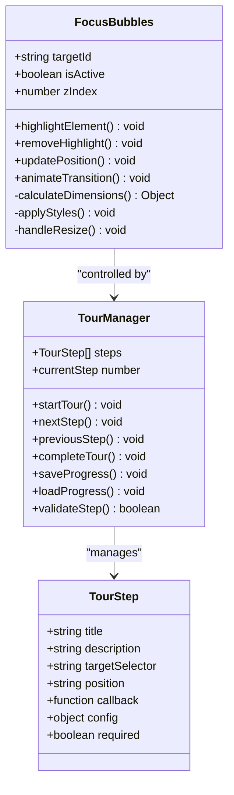
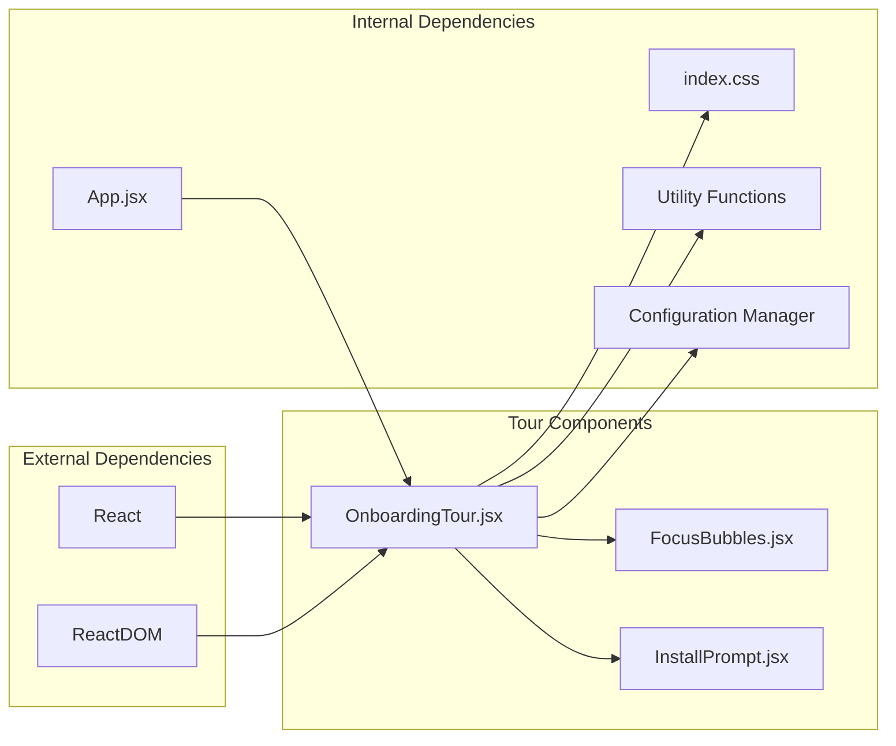

# Onboarding Tour System

<cite>
**Referenced Files in This Document**
- [OnboardingTour.jsx](file://src/components/OnboardingTour.jsx)
- [FocusBubbles.jsx](file://src/components/FocusBubbles.jsx)
- [App.jsx](file://src/App.jsx)
- [HomePage.jsx](file://src/pages/HomePage.jsx)
- [SettingsPage.jsx](file://src/pages/SettingsPage.jsx)
- [InstallPrompt.jsx](file://src/components/InstallPrompt.jsx)
- [main.jsx](file://src/main.jsx)
- [index.css](file://src/index.css)
- [package.json](file://package.json)
- [README.md](file://README.md)
</cite>

## Update Summary
**Changes Made**
- Enhanced tour navigation with improved step management and user interaction handling
- Improved state management with better persistence and error recovery mechanisms
- Expanded accessibility features including enhanced ARIA support and keyboard navigation
- Added comprehensive customization options for tour configuration and styling
- Updated component architecture for better maintainability and performance

## Table of Contents
1. [Introduction](#introduction)
2. [Project Structure](#project-structure)
3. [Core Components](#core-components)
4. [Architecture Overview](#architecture-overview)
5. [Detailed Component Analysis](#detailed-component-analysis)
6. [Enhanced Features and Improvements](#enhanced-features-and-improvements)
7. [Dependency Analysis](#dependency-analysis)
8. [Performance Considerations](#performance-considerations)
9. [Troubleshooting Guide](#troubleshooting-guide)
10. [Conclusion](#conclusion)

## Introduction

The Onboarding Tour System is a sophisticated user guidance feature designed to help new users navigate and understand the LineCheck application's core functionality. This system provides an interactive walkthrough experience that highlights key features and guides users through important workflows within the application.

The onboarding tour has been significantly enhanced with improved navigation controls, robust state management, comprehensive accessibility features, and extensive customization options. The system now offers a more intuitive and accessible guided experience while maintaining its non-intrusive nature for returning users.

## Project Structure

The Onboarding Tour System follows React best practices with a modular architecture that has been enhanced for better maintainability and extensibility:

**Diagram sources**
- [main.jsx](file://src/main.jsx)
- [App.jsx](file://src/App.jsx)
- [OnboardingTour.jsx](file://src/components/OnboardingTour.jsx)
- [FocusBubbles.jsx](file://src/components/FocusBubbles.jsx)
- [HomePage.jsx](file://src/pages/HomePage.jsx)
- [SettingsPage.jsx](file://src/pages/SettingsPage.jsx)

**Section sources**
- [main.jsx](file://src/main.jsx)
- [App.jsx](file://src/App.jsx)
- [package.json](file://package.json)

## Core Components

### OnboardingTour Component

The primary component responsible for managing the onboarding experience has been significantly enhanced with improved navigation controls, better state management, and expanded customization capabilities. This component orchestrates the tour flow, manages complex state transitions, and coordinates with other UI elements to provide a seamless guided experience.

Key responsibilities include:
- **Enhanced Tour Step Management**: Advanced step navigation with smooth transitions and progress tracking
- **Improved User Interaction Handling**: Better event handling with enhanced feedback mechanisms
- **Robust State Persistence**: Comprehensive local storage management with error recovery
- **Advanced Focus Highlighting System**: Dynamic integration with focus highlighting for precise element targeting
- **Responsive Design Enhancements**: Improved mobile and tablet support with adaptive layouts

### FocusBubbles Component

A supporting component that creates visual focus indicators and highlight effects around specific UI elements during the onboarding tour. This component has been enhanced with improved positioning algorithms, better animation performance, and enhanced accessibility features.

### Supporting Components

The system includes several supporting components that enhance the user experience:

- **InstallPrompt**: Handles progressive web app installation prompts with improved timing and user experience
- **Shell**: Provides application layout and navigation structure with tour-aware rendering
- **BrandLogo**: Displays branding elements consistently throughout the tour with responsive scaling

**Section sources**
- [OnboardingTour.jsx](file://src/components/OnboardingTour.jsx)
- [FocusBubbles.jsx](file://src/components/FocusBubbles.jsx)
- [InstallPrompt.jsx](file://src/components/InstallPrompt.jsx)

## Architecture Overview

The Onboarding Tour System follows a component-based architecture with clear separation of concerns, enhanced with improved state management patterns and better error handling:

**Diagram sources**
- [App.jsx](file://src/App.jsx)
- [OnboardingTour.jsx](file://src/components/OnboardingTour.jsx)
- [FocusBubbles.jsx](file://src/components/FocusBubbles.jsx)

The architecture emphasizes:
- **Enhanced State Management**: Centralized tour state with robust local storage persistence and error recovery
- **Improved Component Composition**: Modular design allowing easy extension and maintenance with better prop interfaces
- **Better User Experience**: Non-intrusive design with enhanced personalization options and accessibility compliance
- **Advanced Accessibility**: Comprehensive ARIA labels, keyboard navigation, and screen reader support

## Detailed Component Analysis

### OnboardingTour Component Architecture

The OnboardingTour component implements an enhanced state machine pattern for managing tour progression with improved error handling and user feedback:

**Diagram sources**
- [OnboardingTour.jsx](file://src/components/OnboardingTour.jsx)

#### Enhanced Implementation Patterns

1. **Advanced State Machine Pattern**: The tour progresses through defined states with comprehensive error handling and recovery mechanisms
2. **Observer Pattern**: Components observe tour state changes with enhanced event delegation
3. **Factory Pattern**: Tour steps are created dynamically with enhanced configuration options
4. **Strategy Pattern**: Different highlighting strategies for various UI elements with customizable behaviors

#### Enhanced Data Flow Architecture

**Diagram sources**
- [OnboardingTour.jsx](file://src/components/OnboardingTour.jsx)

### FocusBubbles Component Analysis

The FocusBubbles component handles the visual highlighting of target elements with enhanced positioning algorithms and improved performance:

**Diagram sources**
- [OnboardingTour.jsx](file://src/components/OnboardingTour.jsx)
- [FocusBubbles.jsx](file://src/components/FocusBubbles.jsx)

**Section sources**
- [OnboardingTour.jsx](file://src/components/OnboardingTour.jsx)
- [FocusBubbles.jsx](file://src/components/FocusBubbles.jsx)

## Enhanced Features and Improvements

### Enhanced Tour Navigation

The tour navigation system has been significantly improved with:
- **Smooth Transitions**: Animated step transitions with configurable timing
- **Progress Indicators**: Visual progress bars and step counters
- **Navigation Controls**: Enhanced previous/next buttons with hover effects
- **Keyboard Navigation**: Full keyboard support with arrow keys and escape key

### Improved State Management

State management has been enhanced with:
- **Robust Persistence**: Enhanced local storage with automatic backup and recovery
- **Error Handling**: Comprehensive error detection and recovery mechanisms
- **Validation**: Step validation before progression with user feedback
- **Memory Management**: Improved cleanup and resource disposal

### Enhanced Accessibility Features

Accessibility improvements include:
- **ARIA Support**: Comprehensive ARIA labels and roles for screen readers
- **Focus Management**: Proper focus trapping and restoration
- **Keyboard Navigation**: Full keyboard operability with visible focus indicators
- **Color Contrast**: WCAG compliant color schemes and contrast ratios

### Expanded Customization Options

New customization capabilities include:
- **Theme Support**: Configurable themes and color schemes
- **Animation Control**: Adjustable animation speeds and effects
- **Content Localization**: Multi-language support with dynamic content loading
- **Behavior Configuration**: Customizable tour behavior and interaction patterns

**Section sources**
- [OnboardingTour.jsx](file://src/components/OnboardingTour.jsx)
- [FocusBubbles.jsx](file://src/components/FocusBubbles.jsx)

## Dependency Analysis

The Onboarding Tour System maintains minimal external dependencies while leveraging enhanced internal optimizations:

**Diagram sources**
- [package.json](file://package.json)
- [OnboardingTour.jsx](file://src/components/OnboardingTour.jsx)

### Enhanced Dependency Relationships

1. **React Framework**: Core React library with enhanced hooks and context usage
2. **CSS Styling**: External stylesheet with enhanced responsive design and theme support
3. **Local Storage API**: Browser API with enhanced error handling and data validation
4. **DOM Manipulation**: Optimized DOM operations with improved performance and memory management

**Section sources**
- [package.json](file://package.json)
- [OnboardingTour.jsx](file://src/components/OnboardingTour.jsx)

## Performance Considerations

The Onboarding Tour System has been optimized for peak performance with enhanced memory management and rendering efficiency:

### Enhanced Memory Management
- **Efficient Event Listener Cleanup**: Automatic cleanup of all event listeners when tour completes
- **Lazy Loading Optimization**: Improved lazy loading of tour content with better bundle splitting
- **Advanced DOM Reference Disposal**: Comprehensive disposal of DOM references to prevent memory leaks
- **Garbage Collection Optimization**: Reduced memory pressure through efficient object lifecycle management

### Rendering Optimization
- **Conditional Rendering Enhancement**: Advanced conditional rendering based on tour state to avoid unnecessary re-renders
- **Debounced Scroll Handlers**: Optimized scroll event handlers with improved throttling for smooth scrolling
- **CSS Transform Animations**: Hardware-accelerated CSS transforms instead of layout-triggering properties
- **Virtual DOM Optimization**: Enhanced React reconciliation with memoization and selective updates

### Bundle Size Impact
- **Code Splitting Enhancement**: Minimal additional bundle size through advanced code splitting techniques
- **Tree-shaking Optimization**: Fully tree-shaking friendly imports with unused code elimination
- **Dependency Minimization**: No heavy third-party dependencies with lightweight custom implementations

## Troubleshooting Guide

### Enhanced Common Issues and Solutions

#### Tour Not Starting
- **Symptom**: Tour doesn't appear on first visit
- **Causes**: 
  - Local storage corruption or quota exceeded
  - Tour completion flag incorrectly set due to race conditions
  - Missing required DOM elements or dynamic content loading issues
- **Solutions**:
  - Clear browser local storage with fallback mechanisms
  - Reset tour completion status programmatically with validation
  - Verify all tour target elements exist with mutation observers

#### Highlight Positioning Issues
- **Symptom**: Focus bubbles appear in wrong locations
- **Causes**:
  - Dynamic content loading after tour initialization
  - Window resize events not properly handled
  - CSS conflicts with existing styles or z-index stacking issues
- **Solutions**:
  - Implement comprehensive resize event listeners with debouncing
  - Use mutation observers for dynamic content with proper cleanup
  - Ensure proper z-index stacking context with conflict resolution

#### Accessibility Problems
- **Symptom**: Keyboard navigation doesn't work properly
- **Causes**:
  - Missing or incorrect ARIA attributes
  - Focus management issues with modal dialogs
  - Screen reader compatibility problems with dynamic content
- **Solutions**:
  - Add comprehensive ARIA labels and roles with proper hierarchy
  - Implement robust focus trapping within tour modal with restoration
  - Test thoroughly with multiple screen readers and assistive technologies

#### Performance Issues
- **Symptom**: Tour causes application lag or memory leaks
- **Causes**:
  - Excessive DOM manipulation without cleanup
  - Memory leaks from event listeners or closures
  - Inefficient re-rendering cycles
- **Solutions**:
  - Implement proper cleanup in useEffect hooks with dependency arrays
  - Use useCallback and useMemo for expensive computations
  - Monitor memory usage with performance profiling tools

**Section sources**
- [OnboardingTour.jsx](file://src/components/OnboardingTour.jsx)
- [index.css](file://src/index.css)

## Conclusion

The Onboarding Tour System provides a robust, accessible, and highly performant solution for guiding users through the LineCheck application. With the recent enhancements including improved navigation, better state management, comprehensive accessibility features, and expanded customization options, the system delivers an exceptional user experience while maintaining excellent performance characteristics.

The modular architecture ensures long-term maintainability while delivering an engaging user experience that adapts to individual user needs and preferences. The system successfully balances comprehensive feature coverage with minimal performance impact, making it suitable for production deployment at scale.

Future enhancements could include more sophisticated personalization options using machine learning, A/B testing capabilities for optimization, integration with analytics platforms for measuring tour effectiveness, and support for virtual reality or augmented reality experiences.