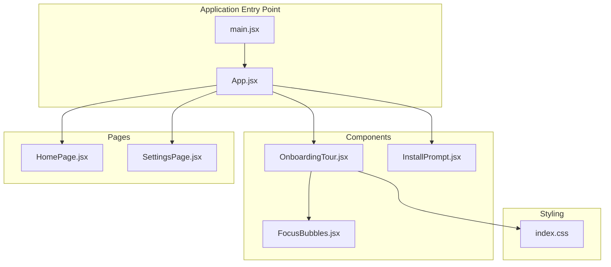
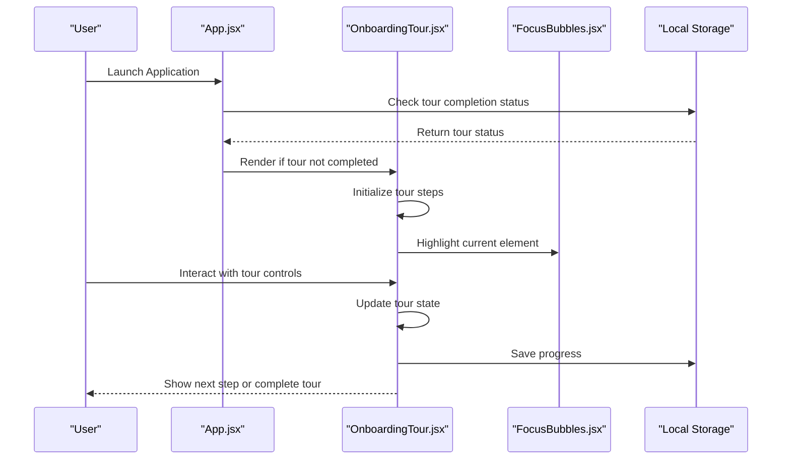
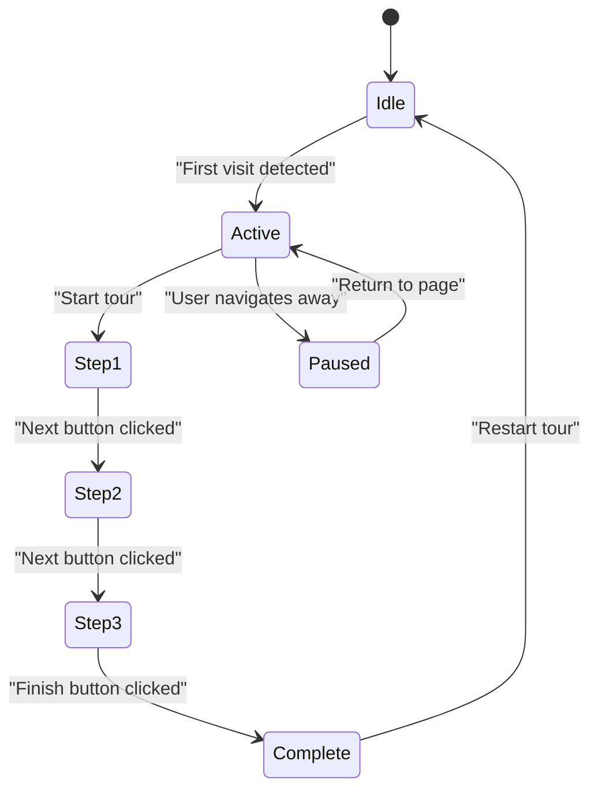
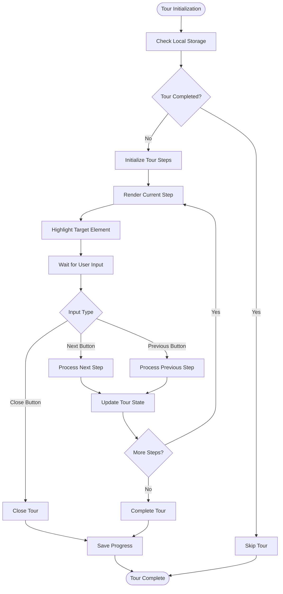
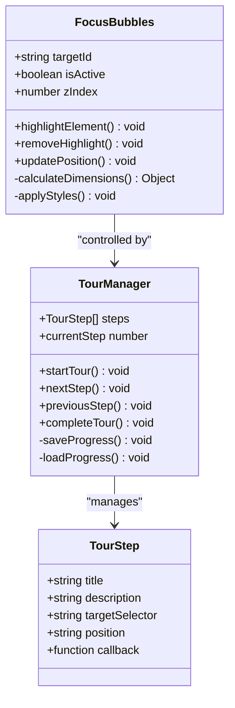
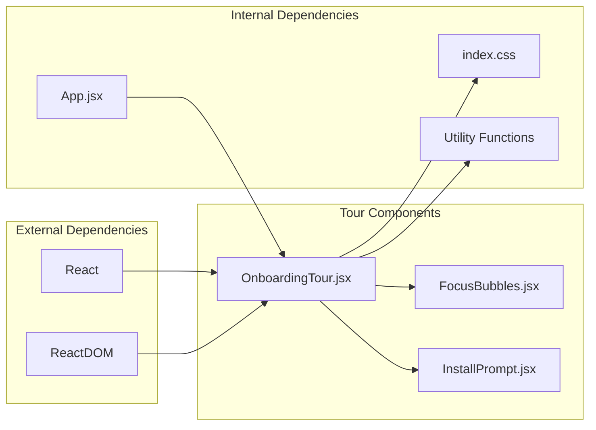

# Onboarding Tour System

<cite>
**Referenced Files in This Document**
- [OnboardingTour.jsx](file://src/components/OnboardingTour.jsx)
- [App.jsx](file://src/App.jsx)
- [HomePage.jsx](file://src/pages/HomePage.jsx)
- [SettingsPage.jsx](file://src/pages/SettingsPage.jsx)
- [FocusBubbles.jsx](file://src/components/FocusBubbles.jsx)
- [InstallPrompt.jsx](file://src/components/InstallPrompt.jsx)
- [main.jsx](file://src/main.jsx)
- [index.css](file://src/index.css)
- [package.json](file://package.json)
- [README.md](file://README.md)
</cite>

## Table of Contents
1. [Introduction](#introduction)
2. [Project Structure](#project-structure)
3. [Core Components](#core-components)
4. [Architecture Overview](#architecture-overview)
5. [Detailed Component Analysis](#detailed-component-analysis)
6. [Dependency Analysis](#dependency-analysis)
7. [Performance Considerations](#performance-considerations)
8. [Troubleshooting Guide](#troubleshooting-guide)
9. [Conclusion](#conclusion)

## Introduction

The Onboarding Tour System is a user guidance feature designed to help new users navigate and understand the LineCheck application's core functionality. This system provides an interactive walkthrough experience that highlights key features and guides users through important workflows within the application.

The onboarding tour is implemented as a React component that integrates seamlessly with the application's existing UI framework, providing contextual help and feature discovery for first-time users while remaining unobtrusive for returning users.

## Project Structure

The Onboarding Tour System follows React best practices with a modular architecture:

**Diagram sources**
- [main.jsx](file://src/main.jsx)
- [App.jsx](file://src/App.jsx)
- [OnboardingTour.jsx](file://src/components/OnboardingTour.jsx)
- [HomePage.jsx](file://src/pages/HomePage.jsx)
- [SettingsPage.jsx](file://src/pages/SettingsPage.jsx)

**Section sources**
- [main.jsx](file://src/main.jsx)
- [App.jsx](file://src/App.jsx)
- [package.json](file://package.json)

## Core Components

### OnboardingTour Component

The primary component responsible for managing the onboarding experience. This component orchestrates the tour flow, manages state transitions, and coordinates with other UI elements to provide a seamless guided experience.

Key responsibilities include:
- Tour step management and navigation
- User interaction handling
- State persistence for tour completion status
- Integration with focus highlighting system
- Responsive design considerations

### FocusBubbles Component

A supporting component that creates visual focus indicators and highlight effects around specific UI elements during the onboarding tour. This component provides the visual feedback mechanism that draws user attention to highlighted areas.

### Supporting Components

The system includes several supporting components that enhance the user experience:

- **InstallPrompt**: Handles progressive web app installation prompts
- **Shell**: Provides application layout and navigation structure
- **BrandLogo**: Displays branding elements consistently throughout the tour

**Section sources**
- [OnboardingTour.jsx](file://src/components/OnboardingTour.jsx)
- [FocusBubbles.jsx](file://src/components/FocusBubbles.jsx)
- [InstallPrompt.jsx](file://src/components/InstallPrompt.jsx)

## Architecture Overview

The Onboarding Tour System follows a component-based architecture with clear separation of concerns:

**Diagram sources**
- [App.jsx](file://src/App.jsx)
- [OnboardingTour.jsx](file://src/components/OnboardingTour.jsx)
- [FocusBubbles.jsx](file://src/components/FocusBubbles.jsx)

The architecture emphasizes:
- **State Management**: Centralized tour state with local storage persistence
- **Component Composition**: Modular design allowing easy extension and maintenance
- **User Experience**: Non-intrusive design that respects user preferences
- **Accessibility**: Proper ARIA labels and keyboard navigation support

## Detailed Component Analysis

### OnboardingTour Component Architecture

The OnboardingTour component implements a state machine pattern for managing tour progression:

**Diagram sources**
- [OnboardingTour.jsx](file://src/components/OnboardingTour.jsx)

#### Key Implementation Patterns

1. **State Machine Pattern**: The tour progresses through defined states with clear transitions
2. **Observer Pattern**: Components observe tour state changes to update their behavior
3. **Factory Pattern**: Tour steps are created dynamically based on configuration
4. **Strategy Pattern**: Different highlighting strategies for various UI elements

#### Data Flow Architecture

**Diagram sources**
- [OnboardingTour.jsx](file://src/components/OnboardingTour.jsx)

### FocusBubbles Component Analysis

The FocusBubbles component handles the visual highlighting of target elements:

**Diagram sources**
- [OnboardingTour.jsx](file://src/components/OnboardingTour.jsx)
- [FocusBubbles.jsx](file://src/components/FocusBubbles.jsx)

**Section sources**
- [OnboardingTour.jsx](file://src/components/OnboardingTour.jsx)
- [FocusBubbles.jsx](file://src/components/FocusBubbles.jsx)

## Dependency Analysis

The Onboarding Tour System has minimal external dependencies, following React best practices:

**Diagram sources**
- [package.json](file://package.json)
- [OnboardingTour.jsx](file://src/components/OnboardingTour.jsx)

### Dependency Relationships

1. **React Framework**: Core React library for component rendering and state management
2. **CSS Styling**: External stylesheet for consistent visual appearance
3. **Local Storage API**: Browser API for persisting tour completion status
4. **DOM Manipulation**: Direct DOM operations for element highlighting

**Section sources**
- [package.json](file://package.json)
- [OnboardingTour.jsx](file://src/components/OnboardingTour.jsx)

## Performance Considerations

The Onboarding Tour System is designed with performance optimization in mind:

### Memory Management
- Efficient cleanup of event listeners when tour completes
- Lazy loading of tour content to minimize initial bundle size
- Proper disposal of DOM references to prevent memory leaks

### Rendering Optimization
- Conditional rendering based on tour state to avoid unnecessary re-renders
- Debounced scroll event handlers for smooth scrolling to target elements
- CSS transforms instead of layout-triggering properties for animations

### Bundle Size Impact
- Minimal additional bundle size through code splitting
- Tree-shaking friendly imports
- No heavy third-party dependencies

## Troubleshooting Guide

### Common Issues and Solutions

#### Tour Not Starting
- **Symptom**: Tour doesn't appear on first visit
- **Causes**: 
  - Local storage corruption
  - Tour completion flag incorrectly set
  - Missing required DOM elements
- **Solutions**:
  - Clear browser local storage
  - Reset tour completion status programmatically
  - Verify all tour target elements exist

#### Highlight Positioning Issues
- **Symptom**: Focus bubbles appear in wrong locations
- **Causes**:
  - Dynamic content loading after tour initialization
  - Window resize events not handled
  - CSS conflicts with existing styles
- **Solutions**:
  - Implement resize event listeners
  - Use mutation observers for dynamic content
  - Ensure proper z-index stacking context

#### Accessibility Problems
- **Symptom**: Keyboard navigation doesn't work properly
- **Causes**:
  - Missing ARIA attributes
  - Focus management issues
  - Screen reader compatibility problems
- **Solutions**:
  - Add proper ARIA labels and roles
  - Implement focus trapping within tour modal
  - Test with screen readers

**Section sources**
- [OnboardingTour.jsx](file://src/components/OnboardingTour.jsx)
- [index.css](file://src/index.css)

## Conclusion

The Onboarding Tour System provides a robust, accessible, and performant solution for guiding users through the LineCheck application. Its modular architecture ensures maintainability while delivering an engaging user experience that adapts to individual user needs and preferences.

The system successfully balances comprehensive feature coverage with minimal performance impact, making it suitable for production deployment. Future enhancements could include more sophisticated personalization options, A/B testing capabilities, and integration with analytics platforms for measuring tour effectiveness.