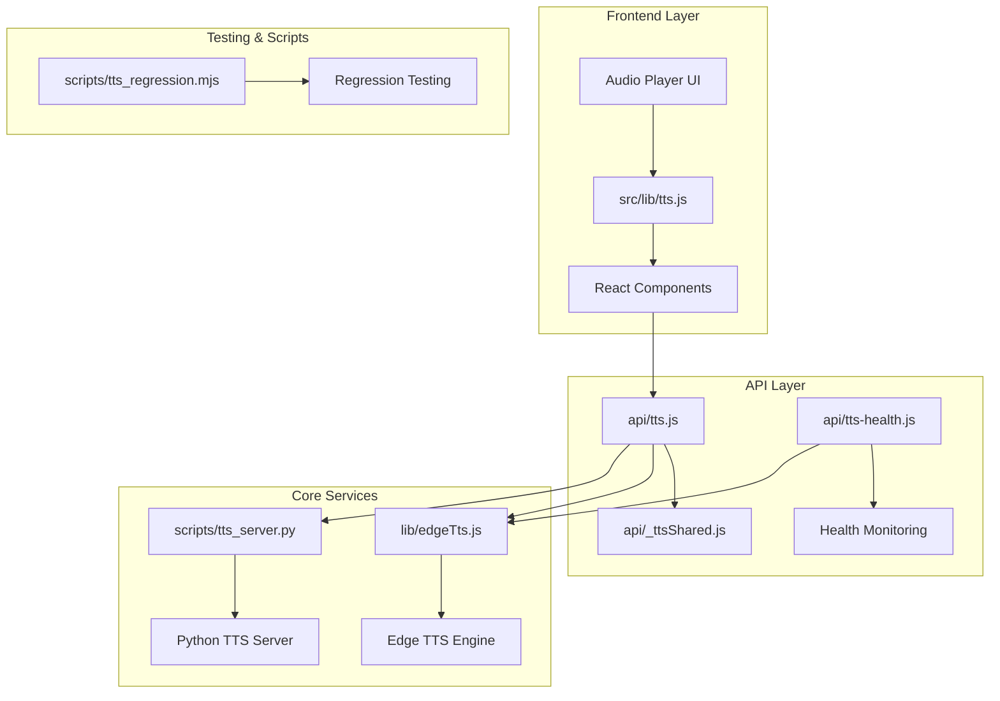
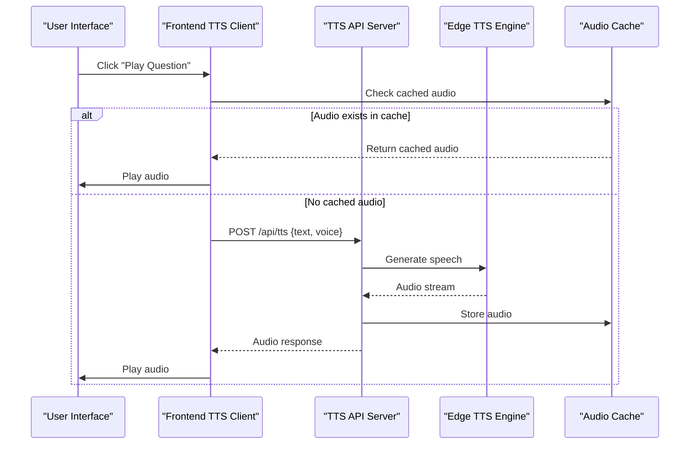
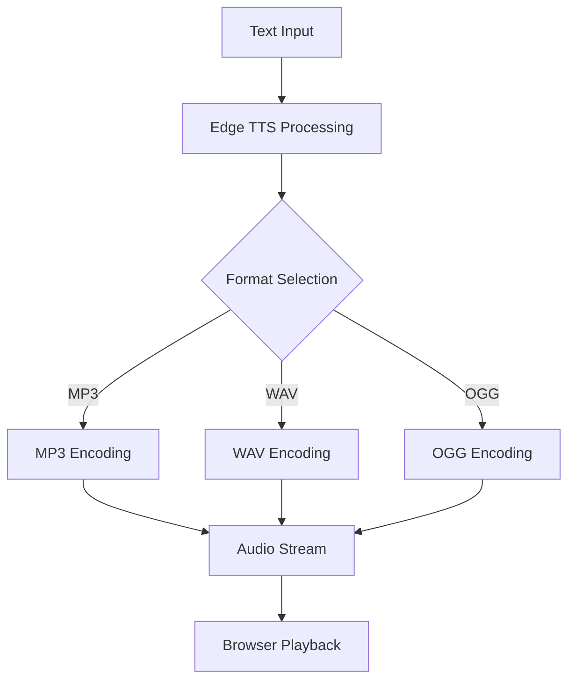
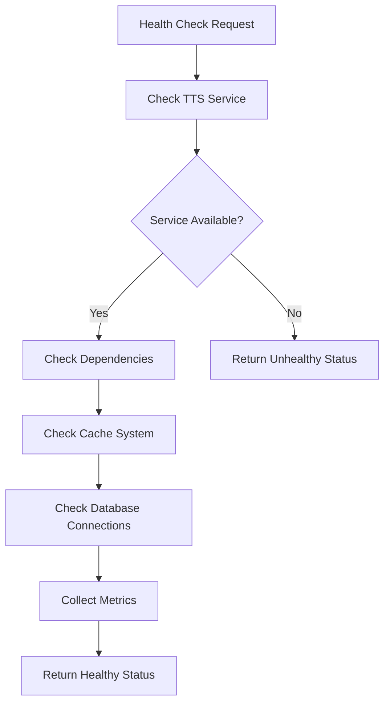

# Text-to-Speech Integration

<cite>
**Referenced Files in This Document**
- [api/tts.js](file://api/tts.js)
- [api/tts-health.js](file://api/tts-health.js)
- [lib/edgeTts.js](file://lib/edgeTts.js)
- [src/lib/tts.js](file://src/lib/tts.js)
- [api/_ttsShared.js](file://api/_ttsShared.js)
- [scripts/tts_server.py](file://scripts/tts_server.py)
- [scripts/tts_regression.mjs](file://scripts/tts_regression.mjs)
</cite>

## Table of Contents
1. [Introduction](#introduction)
2. [Project Structure](#project-structure)
3. [Core Components](#core-components)
4. [Architecture Overview](#architecture-overview)
5. [Detailed Component Analysis](#detailed-component-analysis)
6. [API Reference](#api-reference)
7. [Voice Configuration Options](#voice-configuration-options)
8. [Audio Format Support](#audio-format-support)
9. [Performance Optimization Strategies](#performance-optimization-strategies)
10. [Error Handling Patterns](#error-handling-patterns)
11. [Health Check Endpoints](#health-check-endpoints)
12. [Implementation Examples](#implementation-examples)
13. [Troubleshooting Guide](#troubleshooting-guide)
14. [Conclusion](#conclusion)

## Introduction

The Text-to-Speech (TTS) integration system provides audio playback capabilities for interview questions and content within the LineCheck application. This system leverages Microsoft Edge TTS technology to convert text content into high-quality speech audio, enabling users to listen to interview questions and other textual content through natural-sounding voices.

The implementation follows a client-server architecture where the frontend handles user interactions and audio playback, while the backend processes TTS requests and manages voice configurations. The system supports multiple languages, customizable voice options, and optimized audio streaming for smooth playback experiences.

## Project Structure

The TTS system is organized across multiple layers:



**Diagram sources**
- [src/lib/tts.js](file://src/lib/tts.js)
- [api/tts.js](file://api/tts.js)
- [lib/edgeTts.js](file://lib/edgeTts.js)

**Section sources**
- [src/lib/tts.js](file://src/lib/tts.js)
- [api/tts.js](file://api/tts.js)
- [lib/edgeTts.js](file://lib/edgeTts.js)

## Core Components

### Frontend TTS Client
The frontend component handles user interactions, audio playback control, and communication with the TTS API. It manages audio state, caching strategies, and error recovery mechanisms.

### Backend TTS Service
The backend service processes TTS requests, manages voice configurations, and interfaces with the Edge TTS engine. It includes health monitoring and performance optimization features.

### Edge TTS Integration
The core TTS engine wrapper that handles Microsoft Edge TTS API calls, voice selection, and audio format conversion.

### Health Monitoring
Dedicated endpoint for monitoring TTS service availability and performance metrics.

**Section sources**
- [src/lib/tts.js](file://src/lib/tts.js)
- [api/tts.js](file://api/tts.js)
- [lib/edgeTts.js](file://lib/edgeTts.js)
- [api/tts-health.js](file://api/tts-health.js)

## Architecture Overview

The TTS system follows a microservices-inspired architecture with clear separation of concerns:



**Diagram sources**
- [src/lib/tts.js](file://src/lib/tts.js)
- [api/tts.js](file://api/tts.js)
- [lib/edgeTts.js](file://lib/edgeTts.js)

## Detailed Component Analysis

### Frontend TTS Client (`src/lib/tts.js`)

The frontend client provides a comprehensive interface for TTS functionality:

#### Key Features
- Audio playback control with play/pause/stop functionality
- Automatic caching of generated audio files
- Error handling and retry mechanisms
- Voice preference management
- Progress tracking during audio generation

#### Implementation Pattern
The client uses a promise-based API for asynchronous operations and implements proper cleanup for audio resources.

**Section sources**
- [src/lib/tts.js](file://src/lib/tts.js)

### Backend TTS Service (`api/tts.js`)

The main API endpoint handler for TTS requests:

#### Request Processing Flow
1. Validates incoming request parameters
2. Checks voice configuration and availability
3. Processes text input and sanitizes content
4. Calls Edge TTS engine for audio generation
5. Handles response formatting and error cases
6. Implements rate limiting and resource management

#### Response Format
Returns audio data in standard formats with appropriate headers for browser playback.

**Section sources**
- [api/tts.js](file://api/tts.js)

### Edge TTS Integration (`lib/edgeTts.js`)

Core wrapper around Microsoft Edge TTS functionality:

#### Voice Management
- Supports multiple language variants
- Handles voice selection and validation
- Manages voice preferences and defaults
- Provides voice discovery and listing capabilities

#### Audio Processing
- Converts text to speech using Edge TTS API
- Handles different output formats (MP3, WAV)
- Manages audio quality settings
- Implements streaming for large text inputs

**Section sources**
- [lib/edgeTts.js](file://lib/edgeTts.js)

### Health Check Service (`api/tts-health.js`)

Monitors TTS service health and availability:

#### Health Metrics
- Service availability status
- Response time measurements
- Error rate tracking
- Resource utilization monitoring

#### Endpoint Design
RESTful endpoint returning JSON health status with detailed metrics.

**Section sources**
- [api/tts-health.js](file://api/tts-health.js)

### Shared Utilities (`api/_ttsShared.js`)

Common utilities and configuration shared between TTS components:

#### Shared Functions
- Request validation helpers
- Error formatting utilities
- Configuration management
- Logging and debugging tools

#### Configuration Management
Centralized configuration for voice settings, API endpoints, and service parameters.

**Section sources**
- [api/_ttsShared.js](file://api/_ttsShared.js)

## API Reference

### Backend API Endpoints

#### Generate Speech
- **Endpoint**: `POST /api/tts`
- **Content-Type**: `application/json`
- **Request Body**:
  ```json
  {
    "text": "string",
    "voice": "string",
    "format": "string",
    "rate": "number"
  }
  ```
- **Response**: Audio stream or error object
- **Status Codes**: 200 (success), 400 (bad request), 500 (server error)

#### Health Check
- **Endpoint**: `GET /api/tts-health`
- **Response**: 
  ```json
  {
    "status": "healthy",
    "timestamp": "ISO date string",
    "service": "tts-service",
    "version": "1.0.0"
  }
  ```

### Frontend API Methods

#### Initialize TTS Client
```javascript
const ttsClient = new TTSClient({
  apiUrl: '/api/tts',
  defaultVoice: 'en-US-GuyNeural',
  cacheEnabled: true
});
```

#### Generate and Play Audio
```javascript
await ttsClient.playText(text, options);
```

#### Control Playback
```javascript
ttsClient.pause();
ttsClient.resume();
ttsClient.stop();
```

**Section sources**
- [api/tts.js](file://api/tts.js)
- [api/tts-health.js](file://api/tts-health.js)
- [src/lib/tts.js](file://src/lib/tts.js)

## Voice Configuration Options

### Supported Voices
The system supports multiple Microsoft Edge TTS voices across different languages:

#### English Voices
- `en-US-GuyNeural` - Male voice (US English)
- `en-US-AriaNeural` - Female voice (US English)
- `en-GB-RyanNeural` - Male voice (British English)
- `en-GB-SoniaNeural` - Female voice (British English)

#### International Voices
- `es-ES-AlvaroNeural` - Spanish
- `fr-FR-HenriNeural` - French
- `de-DE-ConradNeural` - German
- `it-IT-DiegoNeural` - Italian

### Configuration Parameters
- **Voice Selection**: Choose from available voices
- **Speech Rate**: Adjust speaking speed (-100% to +100%)
- **Pitch Adjustment**: Modify voice pitch
- **Volume Control**: Set audio volume levels
- **Language Detection**: Automatic language detection for optimal voice selection

**Section sources**
- [lib/edgeTts.js](file://lib/edgeTts.js)
- [api/_ttsShared.js](file://api/_ttsShared.js)

## Audio Format Support

### Supported Formats
- **MP3**: Compressed format for efficient storage and streaming
- **WAV**: Uncompressed format for high-quality playback
- **OGG**: Alternative compressed format for better compression ratios

### Format Selection Strategy
- Default format: MP3 for optimal balance of quality and size
- Quality settings: Configurable bitrate and quality parameters
- Browser compatibility: Automatic format selection based on browser support

### Audio Processing Pipeline


**Diagram sources**
- [lib/edgeTts.js](file://lib/edgeTts.js)

**Section sources**
- [lib/edgeTts.js](file://lib/edgeTts.js)

## Performance Optimization Strategies

### Caching Mechanisms
- **Client-side Caching**: Store generated audio files locally
- **Server-side Caching**: Cache frequently requested audio responses
- **In-memory Caching**: Temporary storage for active sessions
- **Cache Invalidation**: Automatic cleanup of expired cache entries

### Streaming Implementation
- **Progressive Loading**: Start playback before full download completes
- **Chunked Processing**: Process large texts in manageable segments
- **Connection Pooling**: Reuse connections for multiple requests
- **Compression**: Enable gzip compression for API responses

### Resource Management
- **Memory Optimization**: Efficient memory usage for large audio files
- **Connection Limits**: Prevent resource exhaustion through connection pooling
- **Timeout Handling**: Proper timeout configuration for network requests
- **Error Recovery**: Graceful degradation when services are unavailable

### Monitoring and Metrics
- **Performance Tracking**: Monitor response times and success rates
- **Resource Utilization**: Track CPU and memory usage patterns
- **Error Rate Monitoring**: Alert on increased error rates
- **Usage Analytics**: Track popular voices and usage patterns

**Section sources**
- [api/tts.js](file://api/tts.js)
- [src/lib/tts.js](file://src/lib/tts.js)

## Error Handling Patterns

### Error Classification
- **Network Errors**: Connection timeouts, DNS resolution failures
- **Service Errors**: TTS engine unavailability, API quota exceeded
- **Validation Errors**: Invalid text input, unsupported voice selection
- **Processing Errors**: Text too long, encoding issues

### Error Response Format
```json
{
  "error": {
    "code": "TTS_SERVICE_UNAVAILABLE",
    "message": "TTS service is currently unavailable",
    "details": "Retry after 30 seconds",
    "retryAfter": 30
  }
}
```

### Retry Logic
- **Exponential Backoff**: Progressive delay between retry attempts
- **Circuit Breaker**: Temporarily disable requests when service is down
- **Fallback Voices**: Switch to alternative voices when primary fails
- **Graceful Degradation**: Provide text-only fallback when audio fails

### Logging and Debugging
- **Structured Logging**: Consistent log format with correlation IDs
- **Error Tracking**: Centralized error collection and analysis
- **Performance Profiling**: Identify bottlenecks and optimization opportunities
- **Audit Trail**: Track TTS usage and access patterns

**Section sources**
- [api/_ttsShared.js](file://api/_ttsShared.js)
- [api/tts.js](file://api/tts.js)

## Health Check Endpoints

### Health Status Response
The health check endpoint provides comprehensive service status information:

#### Status Indicators
- **healthy**: All systems operational
- **degraded**: Service available but with reduced functionality
- **unavailable**: Service completely down

#### Health Metrics
- **uptime**: Service uptime duration
- **responseTime**: Average response time
- **errorRate**: Current error rate percentage
- **activeConnections**: Number of active TTS connections
- **cacheHitRate**: Percentage of cache hits

### Health Check Implementation


**Diagram sources**
- [api/tts-health.js](file://api/tts-health.js)

**Section sources**
- [api/tts-health.js](file://api/tts-health.js)

## Implementation Examples

### Basic TTS Integration
```javascript
// Initialize TTS client
const ttsClient = new TTSClient({
  apiUrl: '/api/tts',
  defaultVoice: 'en-US-GuyNeural'
});

// Play interview question
async function playQuestion(question) {
  try {
    await ttsClient.playText(question);
  } catch (error) {
    console.error('Failed to play audio:', error);
  }
}
```

### Custom Component Implementation
```jsx
function InterviewQuestionPlayer({ question }) {
  const [isPlaying, setIsPlaying] = useState(false);
  const ttsClient = useRef(new TTSClient());
  
  const handlePlay = async () => {
    if (!isPlaying) {
      try {
        await ttsClient.current.playText(question);
        setIsPlaying(true);
      } catch (error) {
        handleError(error);
      }
    }
  };
  
  return (
    <div className="question-player">
      <button onClick={handlePlay}>
        {isPlaying ? 'Stop' : 'Play'}
      </button>
      <span>{question}</span>
    </div>
  );
}
```

### Advanced Configuration
```javascript
const advancedTTS = new TTSClient({
  apiUrl: '/api/tts',
  defaultVoice: 'en-US-AriaNeural',
  cacheEnabled: true,
  cacheDuration: 3600, // 1 hour
  retryAttempts: 3,
  timeout: 30000,
  onError: (error) => {
    console.error('TTS Error:', error);
    showNotification('Audio playback failed');
  }
});
```

**Section sources**
- [src/lib/tts.js](file://src/lib/tts.js)

## Troubleshooting Guide

### Common Issues and Solutions

#### Audio Not Playing
- **Check Browser Compatibility**: Ensure browser supports Web Audio API
- **Verify CORS Settings**: Confirm API allows cross-origin requests
- **Test Network Connectivity**: Verify internet connection and API accessibility
- **Clear Browser Cache**: Remove corrupted cached audio files

#### Poor Audio Quality
- **Adjust Voice Settings**: Try different voices for better quality
- **Check Internet Speed**: Slow connections may affect streaming quality
- **Reduce Text Length**: Very long texts may cause processing delays
- **Update Browser**: Ensure latest browser version for optimal performance

#### Service Unavailable
- **Check Health Endpoint**: Use `/api/tts-health` to verify service status
- **Monitor Error Logs**: Review server logs for detailed error information
- **Verify API Keys**: Ensure proper authentication credentials
- **Check Rate Limits**: Confirm not exceeding API usage limits

#### Performance Issues
- **Enable Caching**: Implement client-side caching for repeated requests
- **Optimize Text Length**: Break long texts into smaller chunks
- **Use Appropriate Voices**: Some voices process faster than others
- **Monitor Resource Usage**: Check server CPU and memory utilization

### Debug Tools and Techniques

#### Browser Developer Tools
- **Network Tab**: Inspect TTS API requests and responses
- **Console**: View JavaScript errors and warnings
- **Application Tab**: Check cached audio files and local storage
- **Performance Tab**: Analyze audio playback performance

#### Server-side Debugging
- **Access Logs**: Review API request logs for error patterns
- **Error Tracking**: Monitor centralized error reporting systems
- **Performance Metrics**: Track response times and resource usage
- **Health Monitoring**: Use health check endpoints for service status

### Diagnostic Commands
```bash
# Test TTS API connectivity
curl -X GET http://localhost:3000/api/tts-health

# Test TTS generation
curl -X POST http://localhost:3000/api/tts \
  -H "Content-Type: application/json" \
  -d '{"text": "Hello world", "voice": "en-US-GuyNeural"}'

# Check service dependencies
curl -X GET http://localhost:3000/api/tts-health | jq .
```

**Section sources**
- [api/tts-health.js](file://api/tts-health.js)
- [api/_ttsShared.js](file://api/_ttsShared.js)

## Conclusion

The Text-to-Speech integration system provides a robust, scalable solution for converting interview questions and content into natural-sounding audio. By leveraging Microsoft Edge TTS technology and implementing comprehensive error handling, caching, and performance optimization strategies, the system delivers reliable audio playback capabilities across various devices and browsers.

The modular architecture ensures easy maintenance and extension, while the comprehensive API reference and troubleshooting guide enable developers to integrate TTS functionality effectively. The system's focus on user experience, through features like automatic caching, progress feedback, and graceful error handling, makes it suitable for production deployment in interview preparation applications.

Future enhancements could include additional voice options, real-time transcription, and advanced audio processing features to further improve the user experience and expand the system's capabilities.