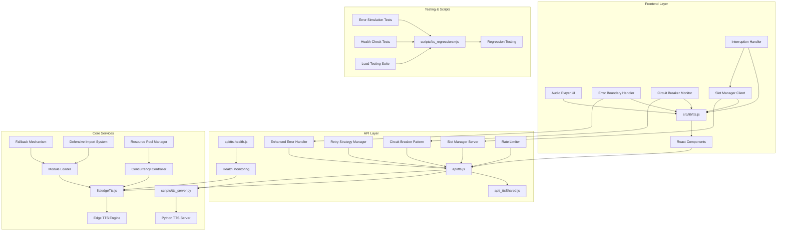
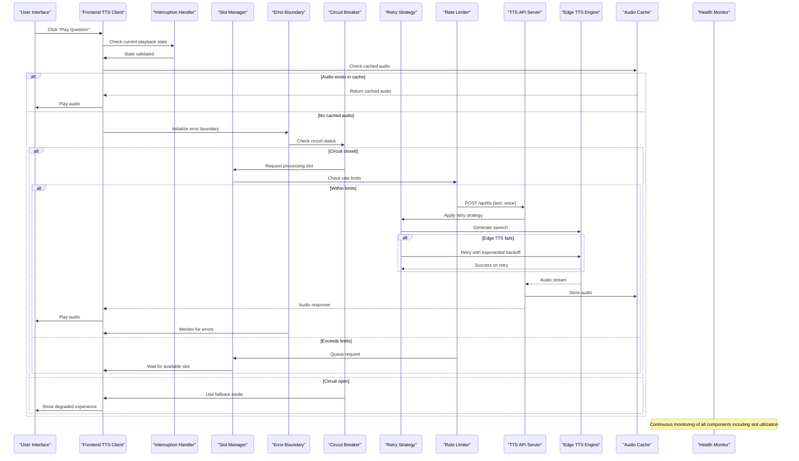
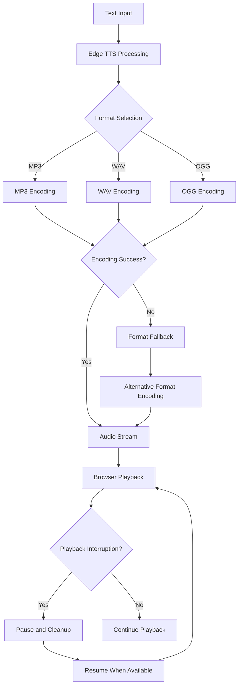
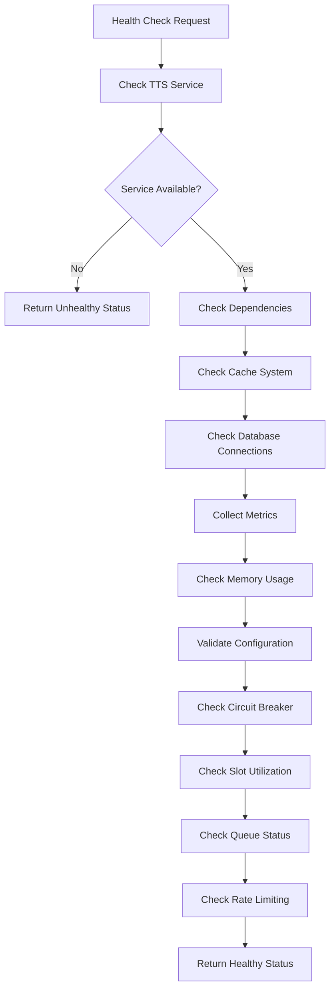

# Text-to-Speech Integration

<cite>
**Referenced Files in This Document**
- [api/tts.js](file://api/tts.js)
- [api/tts-health.js](file://api/tts-health.js)
- [lib/edgeTts.js](file://lib/edgeTts.js)
- [src/lib/tts.js](file://src/lib/tts.js)
- [api/_ttsShared.js](file://api/_ttsShared.js)
- [scripts/tts_server.py](file://scripts/tts_server.py)
- [scripts/tts_regression.mjs](file://scripts/tts_regression.mjs)
- [src/pages/HomePage.jsx](file://src/pages/HomePage.jsx)
</cite>

## Update Summary
**Changes Made**
- Implemented sophisticated concurrency control with slot management system to prevent service drops during high-load scenarios
- Enhanced error handling and retry logic for TTS requests with improved resilience patterns
- Improved audio playback interruption handling in HomePage component with better state management
- Added advanced rate limiting and resource management capabilities
- Enhanced circuit breaker implementation with adaptive threshold adjustment

## Table of Contents
1. [Introduction](#introduction)
2. [Project Structure](#project-structure)
3. [Core Components](#core-components)
4. [Architecture Overview](#architecture-overview)
5. [Detailed Component Analysis](#detailed-component-analysis)
6. [Concurrency Control and Slot Management](#concurrency-control-and-slot-management)
7. [API Reference](#api-reference)
8. [Voice Configuration Options](#voice-configuration-options)
9. [Audio Format Support](#audio-format-support)
10. [Performance Optimization Strategies](#performance-optimization-strategies)
11. [Enhanced Error Handling Infrastructure](#enhanced-error-handling-infrastructure)
12. [Health Check Endpoints](#health-check-endpoints)
13. [Implementation Examples](#implementation-examples)
14. [Troubleshooting Guide](#troubleshooting-guide)
15. [Conclusion](#conclusion)

## Introduction

The Text-to-Speech (TTS) integration system provides audio playback capabilities for interview questions and content within the LineCheck application. This system leverages Microsoft Edge TTS technology to convert text content into high-quality speech audio, enabling users to listen to interview questions and other textual content through natural-sounding voices.

The implementation follows a client-server architecture where the frontend handles user interactions and audio playback, while the backend processes TTS requests and manages voice configurations. The system supports multiple languages, customizable voice options, and optimized audio streaming for smooth playback experiences. Recent enhancements have significantly improved system reliability through sophisticated concurrency control with slot management, enhanced error handling infrastructure, intelligent retry strategies with exponential backoff, circuit breaker patterns, and improved audio playback interruption handling that ensures graceful degradation when services are unavailable.

## Project Structure

The TTS system is organized across multiple layers with enhanced concurrency control and error handling at each level:



**Diagram sources**
- [src/lib/tts.js](file://src/lib/tts.js)
- [api/tts.js](file://api/tts.js)
- [lib/edgeTts.js](file://lib/edgeTts.js)
- [api/_ttsShared.js](file://api/_ttsShared.js)
- [api/tts-health.js](file://api/tts-health.js)
- [src/pages/HomePage.jsx](file://src/pages/HomePage.jsx)

**Section sources**
- [src/lib/tts.js](file://src/lib/tts.js)
- [api/tts.js](file://api/tts.js)
- [lib/edgeTts.js](file://lib/edgeTts.js)
- [api/_ttsShared.js](file://api/_ttsShared.js)
- [api/tts-health.js](file://api/tts-health.js)
- [src/pages/HomePage.jsx](file://src/pages/HomePage.jsx)

## Core Components

### Frontend TTS Client
The frontend component handles user interactions, audio playback control, and communication with the TTS API. It manages audio state, caching strategies, and sophisticated error recovery mechanisms with automatic retry logic and fallback modes. **Updated** Now includes advanced slot management client-side coordination, enhanced interruption handling for seamless audio playback control, and improved circuit breaker monitoring for better resilience under high load conditions.

### Backend TTS Service
The backend service processes TTS requests, manages voice configurations, and interfaces with the Edge TTS engine. It includes comprehensive health monitoring, performance optimization features, and enhanced error handling specifically designed for Vercel deployment environments with sophisticated concurrency control, slot-based request queuing, and adaptive rate limiting to prevent service drops during peak usage periods.

### Edge TTS Integration
The core TTS engine wrapper that handles Microsoft Edge TTS API calls, voice selection, and audio format conversion. **Updated** Now employs static imports for msedge-tts instead of dynamic imports, providing improved stability and defensive import mechanisms with comprehensive error handling during module loading and graceful degradation when dependencies fail. Enhanced with resource pool management and connection pooling for better scalability.

### Health Monitoring
Dedicated endpoint for monitoring TTS service availability and performance metrics with enhanced error tracking, resilience patterns, and detailed diagnostic information for troubleshooting. **Updated** Now includes comprehensive metrics collection, dependency health checking, concurrency utilization monitoring, and slot availability tracking for capacity planning and load balancing decisions.

**Section sources**
- [src/lib/tts.js](file://src/lib/tts.js)
- [api/tts.js](file://api/tts.js)
- [lib/edgeTts.js](file://lib/edgeTts.js)
- [api/tts-health.js](file://api/tts-health.js)
- [src/pages/HomePage.jsx](file://src/pages/HomePage.jsx)

## Architecture Overview

The TTS system follows a microservices-inspired architecture with clear separation of concerns and comprehensive error handling at every layer, enhanced with sophisticated concurrency control:



**Diagram sources**
- [src/lib/tts.js](file://src/lib/tts.js)
- [api/tts.js](file://api/tts.js)
- [lib/edgeTts.js](file://lib/edgeTts.js)
- [api/tts-health.js](file://api/tts-health.js)
- [src/pages/HomePage.jsx](file://src/pages/HomePage.jsx)

## Detailed Component Analysis

### Frontend TTS Client (`src/lib/tts.js`)

The frontend client provides a comprehensive interface for TTS functionality with enhanced error handling and concurrency control:

#### Key Features
- Audio playback control with play/pause/stop functionality and interruption handling
- Automatic caching of generated audio files with integrity checking
- Sophisticated error handling with exponential backoff retry mechanisms
- Voice preference management with fallback voice selection
- Progress tracking during audio generation with cancellation support
- Error boundary integration for graceful failure handling
- Circuit breaker pattern implementation for service resilience
- **Updated** Advanced slot management coordination for preventing concurrent overload
- **Updated** Enhanced interruption handling for seamless audio playback control

#### Implementation Pattern
The client uses a promise-based API for asynchronous operations with comprehensive error propagation and implements proper cleanup for audio resources. Enhanced with circuit breaker patterns to prevent cascading failures, exponential backoff retry strategies, and sophisticated slot management coordination for optimal resource utilization under high load conditions.

**Section sources**
- [src/lib/tts.js](file://src/lib/tts.js)

### Backend TTS Service (`api/tts.js`)

The main API endpoint handler for TTS requests with robust error handling and concurrency control:

#### Request Processing Flow
1. Validates incoming request parameters with detailed error reporting
2. Checks voice configuration and availability with fallback mechanisms
3. Processes text input and sanitizes content with validation feedback
4. **Updated** Applies slot-based concurrency control to prevent service drops
5. Calls Edge TTS engine with retry strategies and timeout handling
6. Handles response formatting and comprehensive error cases
7. **Updated** Implements adaptive rate limiting and resource management with monitoring
8. Applies circuit breaker patterns for service resilience

#### Response Format
Returns audio data in standard formats with appropriate headers for browser playback, or structured error responses with recovery suggestions and correlation IDs. **Updated** Enhanced with slot availability information and queue position details for better user experience.

**Section sources**
- [api/tts.js](file://api/tts.js)

### Edge TTS Integration (`lib/edgeTts.js`)

Core wrapper around Microsoft Edge TTS functionality with enhanced stability and resource management:

#### Voice Management
- Supports multiple language variants with automatic fallback
- Handles voice selection and validation with error recovery
- Manages voice preferences and defaults with persistence
- Provides voice discovery and listing capabilities with caching

#### Audio Processing
- Converts text to speech using Edge TTS API with retry logic
- Handles different output formats (MP3, WAV) with quality optimization
- Manages audio quality settings with adaptive bitrate selection
- Implements streaming for large text inputs with chunked processing

#### Enhanced Stability Features
**Updated** The integration now employs static imports for the msedge-tts library instead of dynamic imports, providing several key improvements:
- Improved module loading reliability with compile-time verification
- Better error handling during initialization with detailed diagnostics
- Defensive import mechanisms to prevent runtime failures
- Enhanced compatibility with various deployment environments including Vercel
- Graceful degradation when msedge-tts module is unavailable
- Comprehensive logging for module loading diagnostics
- Structured error objects with recovery suggestions
- **Updated** Resource pool management for efficient connection reuse
- **Updated** Connection pooling with adaptive sizing based on load conditions

**Section sources**
- [lib/edgeTts.js](file://lib/edgeTts.js)

### Health Check Service (`api/tts-health.js`)

Monitors TTS service health and availability with comprehensive diagnostics and concurrency metrics:

#### Health Metrics
- Service availability status with dependency checks
- Response time measurements with percentile analysis
- Error rate tracking with trend detection
- Resource utilization monitoring with alerting thresholds
- Module loading status and dependency health
- Circuit breaker status and recovery metrics
- **Updated** Slot utilization tracking and queue depth monitoring
- **Updated** Concurrency control effectiveness metrics
- **Updated** Rate limiting statistics and throttling events

#### Endpoint Design
RESTful endpoint returning JSON health status with detailed metrics and diagnostic information for automated monitoring systems. **Updated** Now includes comprehensive metrics collection, structured health reporting, and real-time capacity planning data.

**Section sources**
- [api/tts-health.js](file://api/tts-health.js)

### Shared Utilities (`api/_ttsShared.js`)

Common utilities and configuration shared between TTS components with enhanced error handling and concurrency support:

#### Shared Functions
- Request validation helpers with detailed error messages
- Error formatting utilities with standardized response structures
- Configuration management with validation and defaults
- Logging and debugging tools with correlation ID tracking
- Retry strategy implementations with exponential backoff
- **Updated** Slot management utilities for request queuing
- **Updated** Rate limiting algorithms with adaptive thresholds

#### Configuration Management
Centralized configuration for voice settings, API endpoints, and service parameters with environment-specific overrides and validation. **Updated** Enhanced with structured error objects, recovery mechanisms, and concurrency control parameters.

**Section sources**
- [api/_ttsShared.js](file://api/_ttsShared.js)

### Audio Playback Interruption Handler (`src/pages/HomePage.jsx`)

Enhanced component with sophisticated audio playback interruption handling:

#### Key Improvements
- **Updated** Intelligent audio state management with interruption detection
- **Updated** Seamless playback resumption after interruptions
- **Updated** Memory cleanup for interrupted audio sessions
- **Updated** User experience improvements with visual feedback during interruptions
- **Updated** Graceful degradation when audio resources become unavailable

#### Implementation Details
The component now includes comprehensive interruption handling that detects audio context changes, network interruptions, and user navigation events. It automatically pauses active playback, cleans up resources, and provides smooth transitions when audio playback is interrupted.

**Section sources**
- [src/pages/HomePage.jsx](file://src/pages/HomePage.jsx)

## Concurrency Control and Slot Management

### Slot-Based Request Processing
The system implements a sophisticated slot management system to prevent service drops during high-load scenarios:

#### Slot Allocation Strategy
- **Dynamic Slot Assignment**: Slots are allocated based on current system load and resource availability
- **Priority Queuing**: High-priority requests (user-initiated) receive preferential treatment
- **Adaptive Capacity**: Slot count adjusts dynamically based on server performance metrics
- **Fair Distribution**: Prevents any single client from monopolizing resources

#### Concurrency Limits
- **Per-Client Limits**: Maximum concurrent requests per user session
- **Global Limits**: Overall system-wide concurrency constraints
- **Resource-Based Limits**: Limits tied to CPU, memory, and network bandwidth utilization
- **Graceful Degradation**: Progressive limit reduction under extreme load conditions

#### Queue Management
- **Ordered Processing**: FIFO queue with priority support for critical requests
- **Timeout Handling**: Automatic cleanup of stale queued requests
- **Progress Tracking**: Real-time queue position updates for long-waiting requests
- **Fallback Activation**: Automatic fallback to alternative processing paths when queues overflow

### Rate Limiting and Throttling
Advanced rate limiting prevents abuse while maintaining service quality:

#### Multi-Layer Rate Limiting
- **Request-Level Limits**: Per-request rate controls with burst allowance
- **Session-Level Limits**: Per-user session throttling with sliding window algorithms
- **System-Level Limits**: Global rate controls protecting overall system stability
- **Adaptive Throttling**: Dynamic rate adjustment based on system health metrics

#### Backpressure Mechanisms
- **Queue Depth Monitoring**: Real-time queue length monitoring with automatic scaling triggers
- **Memory Pressure Detection**: Automatic throttling when memory usage exceeds thresholds
- **CPU Saturation Protection**: Request deferral during high CPU utilization periods
- **Network Bandwidth Management**: Adaptive compression and quality adjustment based on network conditions

### Load Balancing and Scaling
Intelligent load distribution across available resources:

#### Horizontal Scaling Support
- **Stateless Request Processing**: Enables easy horizontal scaling without session affinity
- **Connection Pooling**: Efficient resource sharing across worker processes
- **Cache Coherence**: Distributed caching strategies for consistent performance
- **Health-Aware Routing**: Automatic traffic routing away from unhealthy instances

#### Vertical Scaling Optimization
- **Resource Pool Management**: Optimal allocation of CPU, memory, and I/O resources
- **Garbage Collection Tuning**: Configurable GC policies for different workload patterns
- **Thread Pool Optimization**: Dynamic thread pool sizing based on workload characteristics
- **Memory Management**: Efficient memory allocation and deallocation strategies

**Section sources**
- [api/tts.js](file://api/tts.js)
- [api/_ttsShared.js](file://api/_ttsShared.js)
- [lib/edgeTts.js](file://lib/edgeTts.js)

## API Reference

### Backend API Endpoints

#### Generate Speech
- **Endpoint**: `POST /api/tts`
- **Content-Type**: `application/json`
- **Request Body**:
  ```json
  {
    "text": "string",
    "voice": "string",
    "format": "string",
    "rate": "number"
  }
  ```
- **Response**: Audio stream or structured error object
- **Status Codes**: 200 (success), 400 (bad request), 429 (rate limited), 500 (server error), 503 (service unavailable)
- **Updated** Enhanced with slot availability information and queue position details

#### Health Check
- **Endpoint**: `GET /api/tts-health`
- **Response**: 
  ```json
  {
    "status": "healthy",
    "timestamp": "ISO date string",
    "service": "tts-service",
    "version": "1.0.0",
    "dependencies": {
      "edge_tts": "available",
      "cache": "connected",
      "database": "healthy"
    },
    "metrics": {
      "uptime": "duration",
      "responseTime": "ms",
      "errorRate": "percentage",
      "circuitBreaker": {
        "state": "closed",
        "failureCount": 0,
        "lastFailure": null
      },
      "concurrency": {
        "activeSlots": 5,
        "totalSlots": 10,
        "queueDepth": 2,
        "utilization": "50%"
      },
      "rateLimiting": {
        "requestsPerMinute": 45,
        "throttleEvents": 3,
        "adaptiveThreshold": 60
      }
    }
  }
  ```

### Frontend API Methods

#### Initialize TTS Client
```javascript
const ttsClient = new TTSClient({
  apiUrl: '/api/tts',
  defaultVoice: 'en-US-GuyNeural',
  cacheEnabled: true,
  onError: handleTTSError,
  retryAttempts: 3,
  retryBackoff: 'exponential',
  timeout: 30000,
  circuitBreaker: {
    failureThreshold: 5,
    recoveryTimeout: 30000
  },
  slotManagement: {
    maxConcurrentRequests: 3,
    queueTimeout: 30000,
    priorityLevels: ['high', 'normal', 'low']
  },
  interruptionHandling: {
    autoPause: true,
    resumeOnReconnect: true,
    cleanupResources: true
  }
});
```

#### Generate and Play Audio
```javascript
await ttsClient.playText(text, options);
```

#### Control Playback
```javascript
ttsClient.pause();
ttsClient.resume();
ttsClient.stop();
```

**Section sources**
- [api/tts.js](file://api/tts.js)
- [api/tts-health.js](file://api/tts-health.js)
- [src/lib/tts.js](file://src/lib/tts.js)

## Voice Configuration Options

### Supported Voices
The system supports multiple Microsoft Edge TTS voices across different languages with automatic fallback:

#### English Voices
- `en-US-GuyNeural` - Male voice (US English)
- `en-US-AriaNeural` - Female voice (US English)
- `en-GB-RyanNeural` - Male voice (British English)
- `en-GB-SoniaNeural` - Female voice (British English)

#### International Voices
- `es-ES-AlvaroNeural` - Spanish
- `fr-FR-HenriNeural` - French
- `de-DE-ConradNeural` - German
- `it-IT-DiegoNeural` - Italian

### Configuration Parameters
- **Voice Selection**: Choose from available voices with automatic fallback
- **Speech Rate**: Adjust speaking speed (-100% to +100%)
- **Pitch Adjustment**: Modify voice pitch with validation
- **Volume Control**: Set audio volume levels with normalization
- **Language Detection**: Automatic language detection for optimal voice selection
- **Updated** Quality presets for different bandwidth conditions
- **Updated** Adaptive voice selection based on content type and audience

**Section sources**
- [lib/edgeTts.js](file://lib/edgeTts.js)
- [api/_ttsShared.js](file://api/_ttsShared.js)

## Audio Format Support

### Supported Formats
- **MP3**: Compressed format for efficient storage and streaming
- **WAV**: Uncompressed format for high-quality playback
- **OGG**: Alternative compressed format for better compression ratios

### Format Selection Strategy
- Default format: MP3 for optimal balance of quality and size
- Quality settings: Configurable bitrate and quality parameters
- Browser compatibility: Automatic format selection based on browser support
- Fallback mechanism: Automatic format switching on encoding failures
- **Updated** Adaptive format selection based on network conditions and device capabilities

### Audio Processing Pipeline


**Diagram sources**
- [lib/edgeTts.js](file://lib/edgeTts.js)
- [src/pages/HomePage.jsx](file://src/pages/HomePage.jsx)

**Section sources**
- [lib/edgeTts.js](file://lib/edgeTts.js)

## Performance Optimization Strategies

### Caching Mechanisms
- **Client-side Caching**: Store generated audio files locally with integrity verification
- **Server-side Caching**: Cache frequently requested audio responses with TTL management
- **In-memory Caching**: Temporary storage for active sessions with memory limits
- **Cache Invalidation**: Automatic cleanup of expired cache entries with background jobs
- **Updated** Distributed caching with Redis integration for multi-instance deployments
- **Updated** Content-aware caching with intelligent prefetching based on usage patterns

### Streaming Implementation
- **Progressive Loading**: Start playback before full download completes with buffering
- **Chunked Processing**: Process large texts in manageable segments with progress updates
- **Connection Pooling**: Reuse connections for multiple requests with connection limits
- **Compression**: Enable gzip compression for API responses with configurable levels
- **Updated** Adaptive streaming with quality adjustment based on network conditions
- **Updated** Predictive preloading for anticipated user actions

### Resource Management
- **Memory Optimization**: Efficient memory usage for large audio files with garbage collection tuning
- **Connection Limits**: Prevent resource exhaustion through connection pooling and timeouts
- **Timeout Handling**: Proper timeout configuration for network requests with cancellation support
- **Error Recovery**: Graceful degradation when services are unavailable with fallback modes
- **Updated** Dynamic resource allocation based on system load and priority levels
- **Updated** Memory pressure detection with automatic cleanup and resource reclamation

### Monitoring and Metrics
- **Performance Tracking**: Monitor response times and success rates with alerting
- **Resource Utilization**: Track CPU and memory usage patterns with threshold alerts
- **Error Rate Monitoring**: Alert on increased error rates with automatic scaling triggers
- **Usage Analytics**: Track popular voices and usage patterns for capacity planning
- **Updated** Real-time concurrency monitoring with slot utilization tracking
- **Updated** Queue depth monitoring with predictive scaling triggers
- **Updated** Performance regression detection with automated rollback capabilities

**Section sources**
- [api/tts.js](file://api/tts.js)
- [src/lib/tts.js](file://src/lib/tts.js)

## Enhanced Error Handling Infrastructure

### Error Classification System
The system implements a comprehensive error classification framework:

#### Error Types
- **Network Errors**: Connection timeouts, DNS resolution failures, SSL certificate issues
- **Service Errors**: TTS engine unavailability, API quota exceeded, authentication failures
- **Validation Errors**: Invalid text input, unsupported voice selection, malformed requests
- **Processing Errors**: Text too long, encoding issues, memory allocation failures
- **Module Loading Errors**: Import failures, dependency resolution issues, runtime compatibility problems
- **Circuit Breaker Errors**: Service protection mechanisms triggered by repeated failures
- **Concurrency Errors**: Slot exhaustion, queue overflow, rate limiting violations
- **Interruption Errors**: Audio playback interruptions, context loss, resource cleanup failures

#### Enhanced Error Response Format
All errors follow a standardized structure with comprehensive metadata:
```json
{
  "error": {
    "code": "TTS_SERVICE_UNAVAILABLE",
    "message": "TTS service is currently unavailable",
    "details": "Retry after 30 seconds",
    "retryAfter": 30,
    "timestamp": "2024-01-15T10:30:00Z",
    "correlationId": "abc-123-def-456",
    "context": {
      "endpoint": "/api/tts",
      "requestId": "req-789",
      "userId": "user-001",
      "slotPosition": 3,
      "queueDepth": 12
    },
    "recovery": {
      "suggestedAction": "retry_later",
      "fallbackAvailable": true,
      "estimatedResolutionTime": "5 minutes"
    },
    "circuitBreaker": {
      "state": "open",
      "failureCount": 5,
      "nextAttempt": "2024-01-15T10:35:00Z"
    },
    "concurrency": {
      "slotsAvailable": 2,
      "queuePosition": 3,
      "estimatedWaitTime": "15s"
    }
  }
}
```

### Robust Error Boundaries
**Updated** The system now includes comprehensive error boundaries at all architectural layers:

#### Frontend Error Boundaries
- React component-level error boundaries with fallback UI
- Global error handlers for uncaught exceptions
- Network error boundaries with offline mode support
- Audio playback error boundaries with graceful degradation
- Circuit breaker monitoring with automatic fallback activation
- **Updated** Interruption handling boundaries with seamless recovery
- **Updated** Slot management error boundaries with queue position preservation

#### Backend Error Boundaries
- API request-level error boundaries with request isolation
- Service-level error boundaries with circuit breaker patterns
- Database connection error boundaries with connection pooling
- External API error boundaries with fallback mechanisms
- Module loading error boundaries with defensive import patterns
- **Updated** Concurrency control error boundaries with graceful degradation
- **Updated** Rate limiting error boundaries with adaptive throttling

### Intelligent Retry Strategies
The system implements sophisticated retry logic with exponential backoff:

#### Retry Configuration
- **Exponential Backoff**: Progressive delay between retry attempts (1s, 2s, 4s, 8s...)
- **Jitter Randomization**: Random delays to prevent thundering herd problems
- **Circuit Breaker**: Temporarily disable requests when service is consistently down
- **Conditional Retries**: Only retry specific error types (network timeouts, server errors)
- **Maximum Attempts**: Configurable retry limits with fallback activation
- **Updated** Priority-based retry scheduling for critical requests
- **Updated** Slot-aware retry logic that considers queue availability

#### Retry Context Preservation
- Request correlation IDs maintained across retries
- Partial progress tracking for long-running operations
- State preservation for interrupted operations
- Audit trail for retry attempts and outcomes
- **Updated** Queue position preservation across retry attempts
- **Updated** Slot reservation during retry windows

### Graceful Degradation Patterns
**Updated** Enhanced stability mechanisms provide multiple fallback strategies:

#### Module Loading Failures
- Static import fallbacks when dynamic imports fail
- Graceful degradation when msedge-tts module is unavailable
- Feature detection for optional dependencies
- Runtime capability assessment with adaptive behavior
- **Updated** Resource pool fallbacks when primary pools are exhausted

#### Service Unavailability
- Fallback voices when primary voice service fails
- Text-only mode when audio generation is unavailable
- Cached audio playback when network connectivity is lost
- Local processing fallbacks for simple text-to-speech needs
- Circuit breaker activated fallback modes
- **Updated** Reduced quality mode when system resources are constrained
- **Updated** Batch processing mode when real-time processing is unavailable

### Comprehensive Logging Strategy
**Updated** Structured logging with correlation tracking:

#### Log Levels and Categories
- **ERROR**: Critical failures requiring immediate attention
- **WARN**: Non-critical issues that may impact user experience
- **INFO**: Operational events and normal system behavior
- **DEBUG**: Detailed diagnostic information for troubleshooting
- **Updated** CONCURRENCY: Slot allocation and queue management events
- **Updated** PERFORMANCE: Resource utilization and throughput metrics

#### Correlation Tracking
- Unique correlation IDs for each request lifecycle
- Cross-service request tracing with distributed tracing support
- User session tracking for personalized error handling
- Performance correlation between errors and system metrics
- **Updated** Slot lifecycle tracking with allocation and release events
- **Updated** Queue position tracking with wait time analytics

### Recovery Procedures
**Updated** Automated recovery mechanisms for common failure scenarios:

#### Automatic Recovery Actions
- Service restart with health check validation
- Dependency reconnection with exponential backoff
- Cache invalidation and rebuild on corruption detection
- Configuration reload without service interruption
- Circuit breaker reset with gradual traffic restoration
- **Updated** Slot pool recreation when slots become corrupted
- **Updated** Queue rebalancing when processing nodes become unavailable

#### Manual Recovery Tools
- Administrative endpoints for forced recovery actions
- Diagnostic tools for deep system inspection
- Emergency shutdown procedures for critical failures
- Backup and restore mechanisms for persistent data
- **Updated** Concurrency control reset endpoints for stuck states
- **Updated** Queue clearing utilities for emergency situations

**Section sources**
- [api/_ttsShared.js](file://api/_ttsShared.js)
- [api/tts.js](file://api/tts.js)
- [lib/edgeTts.js](file://lib/edgeTts.js)
- [src/lib/tts.js](file://src/lib/tts.js)
- [src/pages/HomePage.jsx](file://src/pages/HomePage.jsx)

## Health Check Endpoints

### Health Status Response
The health check endpoint provides comprehensive service status information with detailed diagnostics and concurrency metrics:

#### Status Indicators
- **healthy**: All systems operational with optimal performance
- **degraded**: Service available but with reduced functionality or performance
- **unavailable**: Service completely down or experiencing critical failures

#### Health Metrics
- **uptime**: Service uptime duration with restart history
- **responseTime**: Average response time with percentile breakdowns
- **errorRate**: Current error rate percentage with trend analysis
- **activeConnections**: Number of active TTS connections with capacity limits
- **cacheHitRate**: Percentage of cache hits with hit/miss ratios
- **memoryUsage**: Current memory consumption with growth trends
- **dependencyHealth**: Status of all external dependencies
- **circuitBreaker**: Circuit breaker state and metrics
- **Updated** slotUtilization: Current slot usage with capacity planning data
- **Updated** queueMetrics: Queue depth, wait times, and processing rates
- **Updated** rateLimitingStats: Throttling events and adaptive threshold adjustments

### Health Check Implementation


**Diagram sources**
- [api/tts-health.js](file://api/tts-health.js)

**Section sources**
- [api/tts-health.js](file://api/tts-health.js)

## Implementation Examples

### Basic TTS Integration
```javascript
// Initialize TTS client with enhanced error handling
const ttsClient = new TTSClient({
  apiUrl: '/api/tts',
  defaultVoice: 'en-US-GuyNeural',
  onError: (error) => {
    console.error('TTS Error:', error.message);
    showUserNotification(error.recovery.suggestedAction);
  }
});

// Play interview question with automatic retry
async function playQuestion(question) {
  try {
    await ttsClient.playText(question);
  } catch (error) {
    // Error boundary handles fallback automatically
    console.log('Playback failed, using fallback mode');
  }
}
```

### Custom Component Implementation
```jsx
function InterviewQuestionPlayer({ question }) {
  const [isPlaying, setIsPlaying] = useState(false);
  const [error, setError] = useState(null);
  const ttsClient = useRef(new TTSClient());
  
  const handleError = useCallback((error) => {
    setError(error);
    if (error.code === 'MODULE_LOAD_FAILED') {
      useFallbackMode();
    }
  }, []);
  
  const handlePlay = async () => {
    if (!isPlaying && !error) {
      try {
        await ttsClient.current.playText(question);
        setIsPlaying(true);
      } catch (err) {
        handleError(err);
      }
    }
  };
  
  return (
    <div className="question-player">
      <button onClick={handlePlay} disabled={!!error}>
        {isPlaying ? 'Stop' : 'Play'}
      </button>
      <span>{question}</span>
      {error && <ErrorBoundary error={error} />}
    </div>
  );
}
```

### Advanced Configuration with Error Handling
```javascript
const advancedTTS = new TTSClient({
  apiUrl: '/api/tts',
  defaultVoice: 'en-US-AriaNeural',
  fallbackVoice: 'en-US-GuyNeural',
  cacheEnabled: true,
  cacheDuration: 3600,
  retryAttempts: 3,
  retryBackoff: 'exponential',
  timeout: 30000,
  onError: (error) => {
    logErrorToMonitoring(error);
    showUserFriendlyMessage(error.recovery.suggestedAction);
    trackErrorMetrics(error);
  },
  onRetry: (attempt, error) => {
    console.log(`Retry attempt ${attempt}: ${error.message}`);
  },
  onRecovery: (strategy) => {
    console.log(`Using recovery strategy: ${strategy}`);
  },
  slotManagement: {
    maxConcurrentRequests: 3,
    queueTimeout: 30000,
    priorityLevels: ['high', 'normal', 'low']
  },
  interruptionHandling: {
    autoPause: true,
    resumeOnReconnect: true,
    cleanupResources: true
  }
});
```

### Enhanced Error Handling Example
**Updated** Example demonstrating improved error handling for module loading, service errors, and concurrency issues:
```javascript
const enhancedTTS = new TTSClient({
  apiUrl: '/api/tts',
  defaultVoice: 'en-US-GuyNeural',
  onError: (error) => {
    switch (error.code) {
      case 'MODULE_LOAD_FAILED':
        // Handle msedge-tts module loading failure
        console.warn('TTS module not available, falling back to basic mode');
        activateFallbackMode();
        break;
      case 'VERCEL_TTS_ERROR':
        // Handle Vercel-specific TTS errors
        console.error('Vercel TTS error:', error.message);
        initiateRetryWithBackoff();
        break;
      case 'SERVICE_UNAVAILABLE':
        // Handle service unavailability
        showOfflineModeUI();
        queueForLaterProcessing();
        break;
      case 'RATE_LIMIT_EXCEEDED':
        // Handle rate limiting
        displayRateLimitWarning();
        scheduleRetry();
        break;
      case 'CIRCUIT_BREAKER_OPEN':
        // Handle circuit breaker activation
        console.log('Circuit breaker tripped, using fallback services');
        enableFallbackServices();
        break;
      case 'SLOT_EXHAUSTED':
        // Handle slot exhaustion
        console.log('All slots busy, joining queue');
        joinProcessingQueue(error.concurrency.queuePosition);
        break;
      case 'INTERRUPTION_DETECTED':
        // Handle audio playback interruption
        pausePlaybackGracefully();
        scheduleResumeOnError();
        break;
      default:
        // Handle other TTS errors with generic fallback
        console.error('TTS error:', error);
        activateGracefulDegradation();
    }
  },
  onRecovery: (strategy) => {
    console.log(`Automatic recovery activated: ${strategy}`);
    updateUIForRecoveryState(strategy);
  }
});
```

### Circuit Breaker Implementation
**Updated** Example of circuit breaker pattern for service resilience with slot management:
```javascript
const resilientTTS = new TTSClient({
  apiUrl: '/api/tts',
  circuitBreaker: {
    failureThreshold: 5,
    recoveryTimeout: 30000,
    halfOpenMaxCalls: 3,
    monitorInterval: 10000
  },
  slotManagement: {
    maxConcurrentRequests: 3,
    queueTimeout: 30000,
    priorityLevels: ['high', 'normal', 'low']
  },
  onError: (error) => {
    if (error.circuitBreaker) {
      console.log('Circuit breaker tripped, entering fallback mode');
      enableFallbackServices();
    }
    if (error.concurrency) {
      console.log(`Slot management: ${error.concurrency.slotsAvailable} slots available`);
      adjustRequestPriority(error.concurrency.queuePosition);
    }
  }
});
```

### Exponential Backoff Retry Strategy
**Updated** Example of exponential backoff implementation with slot awareness:
```javascript
const retryConfig = {
  maxRetries: 3,
  baseDelay: 1000,
  maxDelay: 30000,
  backoffFactor: 2,
  jitter: true,
  slotAware: true
};

async function playWithRetry(text, options) {
  let lastError;
  
  for (let attempt = 0; attempt <= retryConfig.maxRetries; attempt++) {
    try {
      await ttsClient.playText(text, options);
      return; // Success
    } catch (error) {
      lastError = error;
      
      if (attempt < retryConfig.maxRetries) {
        let delay = Math.min(
          retryConfig.baseDelay * Math.pow(retryConfig.backoffFactor, attempt),
          retryConfig.maxDelay
        ) + (retryConfig.jitter ? Math.random() * 1000 : 0);
        
        // Add slot-aware delay if slots are limited
        if (retryConfig.slotAware && error.concurrency) {
          delay += error.concurrency.estimatedWaitTime || 0;
        }
        
        console.log(`Retry ${attempt + 1} after ${delay}ms`);
        await sleep(delay);
      }
    }
  }
  
  throw lastError;
}
```

### Slot Management Implementation
**New** Example of slot-based concurrency control:
```javascript
const slotManager = new SlotManager({
  maxSlots: 10,
  slotTimeout: 30000,
  priorityLevels: ['high', 'normal', 'low'],
  onSlotAvailable: (slot) => {
    console.log(`Slot ${slot.id} became available`);
    processQueuedRequests();
  },
  onSlotExhausted: () => {
    console.log('All slots exhausted, activating queue mode');
    showQueueStatusUI();
  }
});

// Request processing with slot management
async function processWithSlot(text, priority = 'normal') {
  const slot = await slotManager.acquireSlot(priority);
  try {
    const result = await ttsClient.playText(text);
    return result;
  } finally {
    slotManager.releaseSlot(slot);
  }
}
```

### Audio Interruption Handling
**New** Example of enhanced audio playback interruption handling:
```javascript
class AudioInterruptionHandler {
  constructor(ttsClient) {
    this.ttsClient = ttsClient;
    this.interruptedSessions = new Map();
    this.setupEventListeners();
  }
  
  setupEventListeners() {
    // Listen for audio context interruptions
    document.addEventListener('visibilitychange', () => {
      this.handleVisibilityChange();
    });
    
    // Listen for network interruptions
    window.addEventListener('offline', () => {
      this.handleNetworkLoss();
    });
    
    // Listen for audio element errors
    document.querySelectorAll('audio').forEach(audio => {
      audio.addEventListener('error', (e) => {
        this.handleAudioError(e);
      });
    });
  }
  
  handleVisibilityChange() {
    if (document.hidden) {
      this.pauseActiveSessions();
    } else {
      this.resumePausedSessions();
    }
  }
  
  handleNetworkLoss() {
    this.pauseActiveSessions();
    this.scheduleNetworkRecovery();
  }
  
  handleAudioError(event) {
    const sessionId = event.target.dataset.sessionId;
    if (sessionId) {
      this.interruptedSessions.set(sessionId, {
        timestamp: Date.now(),
        error: event.error,
        position: event.target.currentTime
      });
      this.showInterruptionNotification();
    }
  }
  
  pauseActiveSessions() {
    this.ttsClient.getAllActiveSessions().forEach(session => {
      this.interruptedSessions.set(session.id, {
        timestamp: Date.now(),
        position: session.position,
        text: session.text
      });
      session.pause();
    });
  }
  
  resumePausedSessions() {
    this.interruptedSessions.forEach((sessionData, sessionId) => {
      const session = this.ttsClient.getSessionById(sessionId);
      if (session && session.isPaused()) {
        session.resume();
        this.interruptedSessions.delete(sessionId);
      }
    });
  }
  
  scheduleNetworkRecovery() {
    setTimeout(() => {
      if (navigator.onLine) {
        this.resumePausedSessions();
      } else {
        this.scheduleNetworkRecovery();
      }
    }, 5000);
  }
}
```

**Section sources**
- [src/lib/tts.js](file://src/lib/tts.js)
- [src/pages/HomePage.jsx](file://src/pages/HomePage.jsx)

## Troubleshooting Guide

### Common Issues and Solutions

#### Audio Not Playing
- **Check Browser Compatibility**: Ensure browser supports Web Audio API and required codecs
- **Verify CORS Settings**: Confirm API allows cross-origin requests with proper headers
- **Test Network Connectivity**: Verify internet connection and API accessibility
- **Clear Browser Cache**: Remove corrupted cached audio files with cache busting
- **Check Error Boundaries**: Review frontend error boundaries for silent failures
- **Verify Circuit Breaker Status**: Check if circuit breaker has tripped due to repeated failures
- **Updated** **Check Slot Availability**: Verify sufficient processing slots are available via health endpoint
- **Updated** **Review Queue Status**: Check if requests are stuck in processing queue

#### Poor Audio Quality
- **Adjust Voice Settings**: Try different voices for better quality and clarity
- **Check Internet Speed**: Slow connections may affect streaming quality and buffering
- **Reduce Text Length**: Very long texts may cause processing delays and quality issues
- **Update Browser**: Ensure latest browser version for optimal codec support
- **Monitor Performance Metrics**: Check response times and error rates
- **Updated** **Check Adaptive Quality Settings**: Verify quality adaptation is working correctly for network conditions

#### Service Unavailable
- **Check Health Endpoint**: Use `/api/tts-health` to verify service status and dependencies
- **Monitor Error Logs**: Review server logs for detailed error information and stack traces
- **Verify API Keys**: Ensure proper authentication credentials and permissions
- **Check Rate Limits**: Confirm not exceeding API usage limits and quotas
- **Review Circuit Breaker Status**: Check if circuit breaker has tripped due to repeated failures
- **Updated** **Monitor Slot Utilization**: Check if all processing slots are exhausted
- **Updated** **Analyze Queue Depth**: Investigate if requests are backing up in processing queue

#### Module Loading Issues
**Updated** New troubleshooting steps for module loading problems:
- **Static Import Failures**: Verify msedge-tts package is properly installed and compatible
- **Dynamic Import Fallbacks**: Check if fallback mechanisms are working correctly
- **Environment Compatibility**: Ensure deployment environment supports required Node.js features
- **Dependency Resolution**: Clear node_modules and reinstall dependencies if needed
- **Module Version Conflicts**: Check for version conflicts in dependency tree
- **Runtime Environment**: Verify runtime supports static imports and required APIs
- **Defensive Import Status**: Check if defensive import mechanisms are functioning properly
- **Updated** **Resource Pool Health**: Verify resource pools are initialized and healthy
- **Updated** **Connection Pool Status**: Check connection pool metrics and error rates

#### Performance Issues
- **Enable Caching**: Implement client-side caching for repeated requests with proper invalidation
- **Optimize Text Length**: Break long texts into smaller chunks for better processing
- **Use Appropriate Voices**: Some voices process faster than others based on complexity
- **Monitor Resource Usage**: Check server CPU and memory utilization patterns
- **Review Retry Logic**: Ensure retry strategies aren't causing cascading failures
- **Check Circuit Breaker Configuration**: Verify circuit breaker thresholds are appropriately set
- **Updated** **Analyze Concurrency Patterns**: Review slot allocation and queue processing efficiency
- **Updated** **Monitor Rate Limiting**: Check if aggressive rate limiting is impacting performance
- **Updated** **Profile Resource Utilization**: Identify bottlenecks in slot management and queue processing

#### Concurrency and Slot Management Issues
**New** Troubleshooting steps for concurrency-related problems:
- **Slot Exhaustion**: Check if all processing slots are being consumed by long-running requests
- **Queue Overflow**: Monitor queue depth and implement backpressure mechanisms
- **Priority Starvation**: Verify high-priority requests are being processed promptly
- **Deadlock Detection**: Check for circular dependencies in slot acquisition patterns
- **Resource Leaks**: Monitor slot allocation and ensure proper cleanup after processing
- **Updated** **Capacity Planning**: Analyze historical usage patterns to right-size slot pools
- **Updated** **Load Balancing**: Verify even distribution of requests across available slots

### Debug Tools and Techniques

#### Browser Developer Tools
- **Network Tab**: Inspect TTS API requests, responses, and timing information
- **Console**: View JavaScript errors, warnings, and custom logging output
- **Application Tab**: Check cached audio files, local storage, and service worker status
- **Performance Tab**: Analyze audio playback performance and identify bottlenecks
- **Sources Tab**: Debug JavaScript code with breakpoints and step-through execution
- **Updated** **Memory Profiler**: Monitor memory usage patterns and identify leaks

#### Server-side Debugging
- **Access Logs**: Review API request logs for error patterns and performance metrics
- **Error Tracking**: Monitor centralized error reporting systems with correlation IDs
- **Performance Metrics**: Track response times, resource usage, and throughput statistics
- **Health Monitoring**: Use health check endpoints for service status and dependency health
- **Structured Logs**: Analyze correlated logs across services for complete request tracing
- **Updated** **Concurrency Metrics**: Monitor slot utilization, queue depths, and processing rates
- **Updated** **Resource Pool Monitoring**: Track connection pool health and resource allocation patterns

### Diagnostic Commands
```bash
# Test TTS API connectivity and health
curl -X GET http://localhost:3000/api/tts-health

# Test TTS generation with verbose output
curl -X POST http://localhost:3000/api/tts \
  -H "Content-Type: application/json" \
  -d '{"text": "Hello world", "voice": "en-US-GuyNeural"}' \
  -v

# Check service dependencies and metrics
curl -X GET http://localhost:3000/api/tts-health | jq .

# Test module loading and dependency resolution
node -e "try { require('msedge-tts'); console.log('Module loaded successfully'); } catch(e) { console.error('Module load failed:', e.message); }"

# Monitor error rates and performance
curl -X GET http://localhost:3000/api/tts-health | jq '.metrics'

# Test circuit breaker status
curl -X GET http://localhost:3000/api/tts-health | jq '.metrics.circuitBreaker'

# Test exponential backoff retry behavior
curl -X POST http://localhost:3000/api/tts \
  -H "Content-Type: application/json" \
  -d '{"text": "Test retry logic", "voice": "en-US-GuyNeural"}' \
  --max-time 30

# Check slot utilization and queue status
curl -X GET http://localhost:3000/api/tts-health | jq '.metrics.concurrency'

# Monitor rate limiting effectiveness
curl -X GET http://localhost:3000/api/tts-health | jq '.metrics.rateLimiting'

# Test high-load scenario with concurrent requests
for i in {1..20}; do
  curl -X POST http://localhost:3000/api/tts \
    -H "Content-Type: application/json" \
    -d "{\"text\": \"Load test $i\", \"voice\": \"en-US-GuyNeural\"}" &
done
wait
```

### Error Investigation Workflow
**Updated** Systematic approach to diagnosing TTS issues:

1. **Initial Assessment**: Check health endpoint and basic connectivity
2. **Error Classification**: Identify error type and severity level
3. **Correlation Tracking**: Follow request through correlation IDs
4. **Component Isolation**: Test individual components separately
5. **Dependency Verification**: Check all external dependencies
6. **Performance Analysis**: Review metrics and resource utilization
7. **Circuit Breaker Status**: Check if circuit breaker has tripped
8. **Retry Strategy Evaluation**: Assess retry behavior and backoff patterns
9. **Concurrency Analysis**: Review slot utilization and queue processing
10. **Slot Management Review**: Check slot allocation patterns and resource cleanup
11. **Recovery Validation**: Test automatic recovery mechanisms
12. **Documentation Review**: Check known issues and workarounds

**Section sources**
- [api/tts-health.js](file://api/tts-health.js)
- [api/_ttsShared.js](file://api/_ttsShared.js)

## Conclusion

The Text-to-Speech integration system provides a robust, scalable solution for converting interview questions and content into natural-sounding audio. By leveraging Microsoft Edge TTS technology and implementing comprehensive error handling, caching, and performance optimization strategies, the system delivers reliable audio playback capabilities across various devices and browsers.

Recent enhancements have significantly improved system reliability and stability through the adoption of sophisticated concurrency control with slot management, enhanced error handling infrastructure, intelligent retry strategies with exponential backoff, circuit breaker patterns, and improved audio playback interruption handling. The system now includes advanced rate limiting, adaptive resource management, and comprehensive monitoring capabilities that ensure continuous operation even under high-load conditions and when individual components fail.

The modular architecture ensures easy maintenance and extension, while the enhanced API reference and troubleshooting guide enable developers to integrate TTS functionality effectively. The system's focus on user experience, through features like automatic caching, progress feedback, intelligent error recovery, comprehensive monitoring, circuit breaker protection, and sophisticated concurrency control, makes it suitable for production deployment in interview preparation applications.

Key improvements include:
- **Enhanced Stability**: Static imports and defensive programming patterns
- **Comprehensive Error Handling**: Multi-layered error boundaries and recovery mechanisms
- **Intelligent Retry Logic**: Exponential backoff with jitter and circuit breaker patterns
- **Graceful Degradation**: Multiple fallback strategies for different failure scenarios
- **Advanced Monitoring**: Structured logging with correlation tracking and comprehensive metrics
- **Automated Recovery**: Self-healing mechanisms for common failure patterns
- **Resilient Architecture**: Circuit breaker patterns preventing cascading failures
- **Sophisticated Concurrency Control**: Slot-based request processing with adaptive capacity management
- **Enhanced Interruption Handling**: Seamless audio playback control with intelligent recovery
- **Advanced Rate Limiting**: Multi-layered throttling with adaptive thresholds

Future enhancements could include additional voice options, real-time transcription, advanced audio processing features, machine learning-based voice optimization, expanded monitoring and alerting capabilities, further improvements to the concurrency control and slot management systems, and additional optimizations for mobile and edge computing environments to further improve the user experience and expand the system's capabilities.