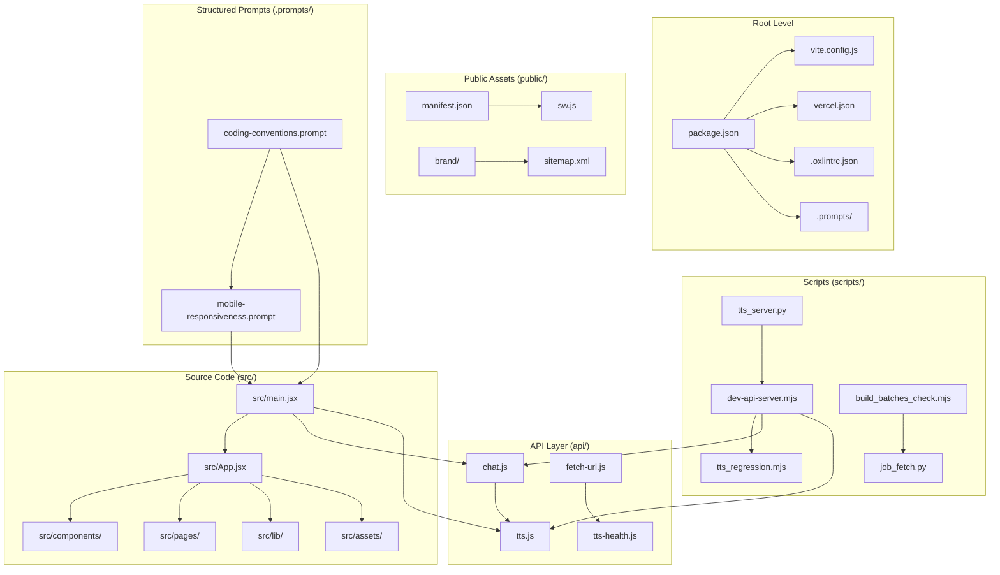
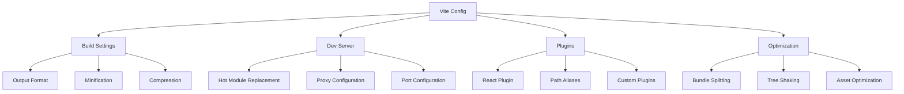
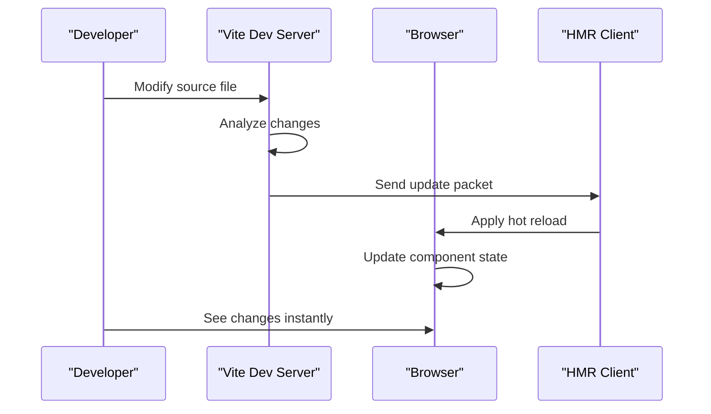
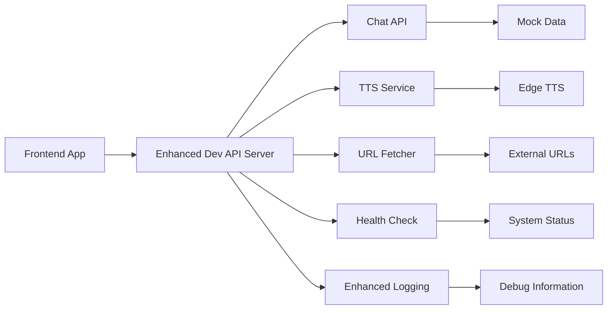
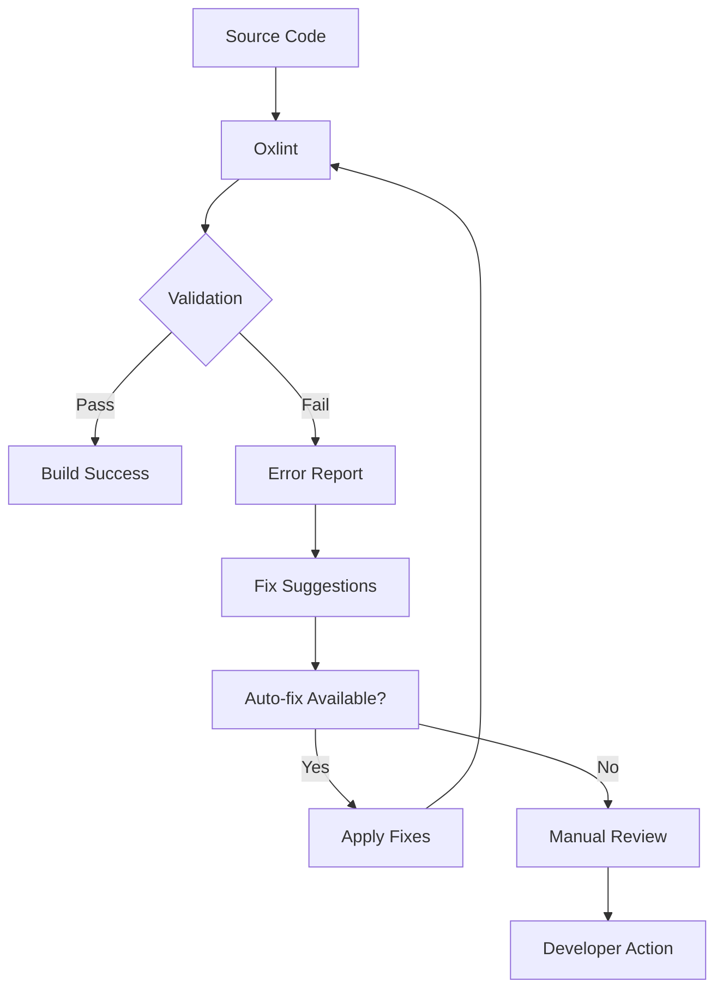
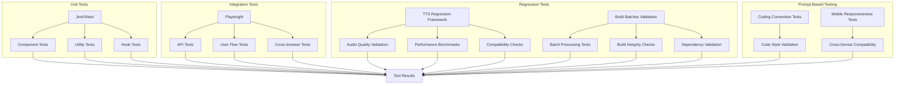
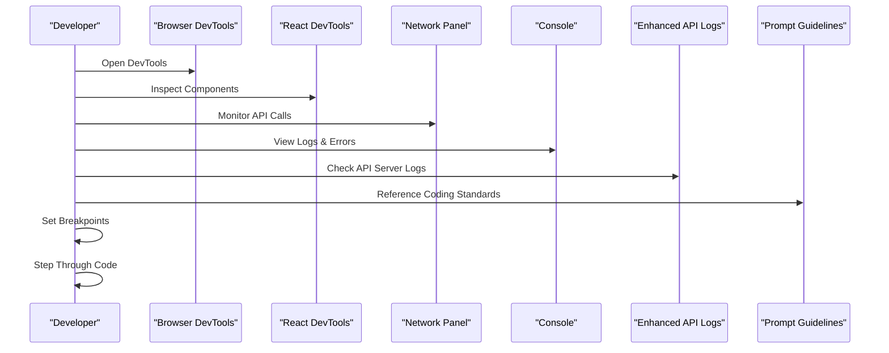
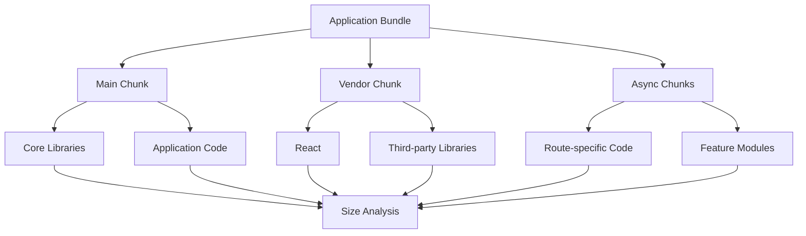
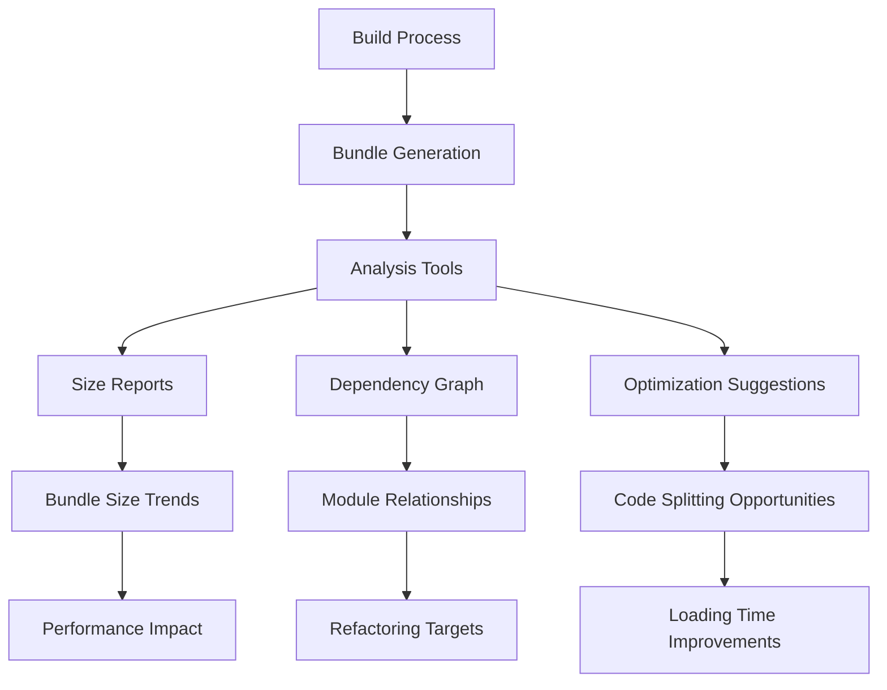
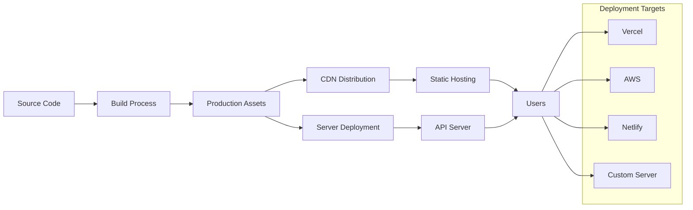

# Development Guide

<cite>
**Referenced Files in This Document**
- [package.json](file://package.json)
- [vite.config.js](file://vite.config.js)
- [README.md](file://README.md)
- [src/main.jsx](file://src/main.jsx)
- [src/App.jsx](file://src/App.jsx)
- [scripts/dev-api-server.mjs](file://scripts/dev-api-server.mjs)
- [scripts/tts_regression.mjs](file://scripts/tts_regression.mjs)
- [scripts/build_batches_check.mjs](file://scripts/build_batches_check.mjs)
- [scripts/job_fetch.py](file://scripts/job_fetch.py)
- [scripts/tts_server.py](file://scripts/tts_server.py)
- [.oxlintrc.json](file://.oxlintrc.json)
- [vercel.json](file://vercel.json)
- [.prompts/coding-conventions.prompt](file://.prompts/coding-conventions.prompt)
- [.prompts/mobile-responsiveness.prompt](file://.prompts/mobile-responsiveness.prompt)
</cite>

## Update Summary
**Changes Made**
- Added comprehensive documentation for structured prompt files including coding conventions and mobile responsiveness guidelines
- Enhanced code style section with standardized coding practices from .prompts directory
- Updated contribution guidelines to include mobile-first responsive design patterns
- Added new section on AI-assisted development workflows using structured prompts
- Integrated prompt-based development standards into the overall development workflow

## Table of Contents
1. [Introduction](#introduction)
2. [Project Structure](#project-structure)
3. [Development Environment Setup](#development-environment-setup)
4. [Build System and Vite Configuration](#build-system-and-vite-configuration)
5. [Development Server and Hot Reloading](#development-server-and-hot-reloading)
6. [API Mocking and Backend Services](#api-mocking-and-backend-services)
7. [Code Style and Linting](#code-style-and-linting)
8. [Structured Development Prompts](#structured-development-prompts)
9. [Testing Strategies](#testing-strategies)
10. [Debugging Techniques](#debugging-techniques)
11. [Performance Optimization](#performance-optimization)
12. [Bundle Analysis](#bundle-analysis)
13. [Production Deployment](#production-deployment)
14. [Contribution Guidelines](#contribution-guidelines)
15. [Troubleshooting](#troubleshooting)
16. [Conclusion](#conclusion)

## Introduction

LineCheck is a modern web application built with React and Vite, designed to provide intelligent document processing and interview preparation capabilities. This development guide serves as a comprehensive resource for contributors and developers working on the LineCheck project, covering everything from local setup to production deployment.

The project follows modern JavaScript development practices with a focus on developer experience, performance optimization, and maintainable code architecture. It utilizes React for the frontend framework, Vite for fast build tooling, and includes comprehensive testing and automation scripts including advanced build validation and TTS regression testing frameworks.

**Updated** The project now includes structured prompt files that establish standardized coding practices and responsive design patterns, enhancing consistency across the development team and improving code quality through AI-assisted development workflows.

## Project Structure

The LineCheck project follows a well-organized modular architecture that separates concerns effectively:



**Diagram sources**
- [src/main.jsx:1-50](file://src/main.jsx#L1-L50)
- [src/App.jsx:1-100](file://src/App.jsx#L1-L100)
- [vite.config.js:1-100](file://vite.config.js#L1-L100)
- [scripts/dev-api-server.mjs:1-200](file://scripts/dev-api-server.mjs#L1-L200)
- [scripts/tts_regression.mjs:1-200](file://scripts/tts_regression.mjs#L1-L200)
- [scripts/build_batches_check.mjs:1-200](file://scripts/build_batches_check.mjs#L1-L200)
- [.prompts/coding-conventions.prompt:1-200](file://.prompts/coding-conventions.prompt#L1-L200)
- [.prompts/mobile-responsiveness.prompt:1-200](file://.prompts/mobile-responsiveness.prompt#L1-L200)

### Core Directory Organization

- **`src/`**: Main application source code containing React components, pages, and utilities
- **`api/`**: Backend API endpoints for chat functionality and text-to-speech services
- **`scripts/`**: Development utilities, regression testing, build validation, and automation tasks
- **`public/`**: Static assets including service worker, manifest, and brand materials
- **`lib/`**: Shared libraries and external integrations
- **`.prompts/`**: Structured prompt files for standardized coding practices and responsive design guidelines

**Section sources**
- [src/main.jsx:1-50](file://src/main.jsx#L1-L50)
- [src/App.jsx:1-100](file://src/App.jsx#L1-L100)
- [vite.config.js:1-100](file://vite.config.js#L1-L100)

## Development Environment Setup

### Prerequisites

Before starting development, ensure you have the following installed:

- **Node.js**: Version 18 or higher recommended
- **npm**: Latest stable version
- **Python 3**: For backend server scripts
- **Git**: For version control
- **AI Assistant**: Optional - for leveraging structured prompt files

### Initial Setup

1. **Clone the repository**:
   ```bash
   git clone <repository-url>
   cd linecheck
   ```

2. **Install dependencies**:
   ```bash
   npm install
   ```

3. **Environment configuration**:
   Create a `.env` file in the root directory with necessary environment variables:
   ```bash
   # Add required environment variables here
   ```

4. **Start development server**:
   ```bash
   npm run dev
   ```

### Development Dependencies

The project uses modern development tooling including:
- **Vite**: Fast build tool and development server
- **React**: UI framework with JSX support
- **ESLint/Oxlint**: Code linting and quality assurance
- **Playwright**: End-to-end testing framework
- **Custom Scripts**: Build validation and regression testing utilities
- **Structured Prompts**: AI-assisted development guidelines

**Section sources**
- [package.json:1-100](file://package.json#L1-L100)
- [README.md:1-50](file://README.md#L1-L50)

## Build System and Vite Configuration

### Vite Configuration Overview

The project leverages Vite's powerful build system with custom configurations optimized for React development:



**Diagram sources**
- [vite.config.js:1-200](file://vite.config.js#L1-L200)

### Key Build Features

- **Fast Development Server**: Instant server startup with hot module replacement
- **Optimized Production Builds**: Automatic code splitting and minification
- **Asset Handling**: Efficient image, font, and static asset processing
- **Environment Variables**: Secure configuration management
- **TypeScript Support**: Optional TypeScript compilation and type checking

### Custom Build Scripts

The project includes specialized build scripts for different environments and deployment targets, including enhanced build validation and batch processing capabilities.

**Section sources**
- [vite.config.js:1-200](file://vite.config.js#L1-L200)
- [package.json:1-150](file://package.json#L1-L150)

## Development Server and Hot Reloading

### Development Server Configuration

The development server is configured for optimal developer experience with automatic reloading and debugging support:



**Diagram sources**
- [vite.config.js:1-100](file://vite.config.js#L1-L100)
- [src/main.jsx:1-50](file://src/main.jsx#L1-L50)

### Hot Module Replacement (HMR)

- **Component Updates**: React components update without full page reload
- **State Preservation**: Application state maintained during updates
- **CSS Updates**: Styles change instantly without losing component state
- **Error Overlay**: Real-time error display with stack traces

### Debugging Configuration

The development environment includes comprehensive debugging support:

- **Source Maps**: Full source map generation for debugging
- **React DevTools**: Integration with React Developer Tools
- **Network Inspection**: API call monitoring and debugging
- **Console Logging**: Enhanced logging with context information

**Section sources**
- [vite.config.js:1-150](file://vite.config.js#L1-L150)
- [src/main.jsx:1-100](file://src/main.jsx#L1-L100)

## API Mocking and Backend Services

### Local API Server

The project includes a comprehensive local API server setup for development and testing with enhanced logging capabilities:



**Diagram sources**
- [scripts/dev-api-server.mjs:1-200](file://scripts/dev-api-server.mjs#L1-L200)
- [api/chat.js:1-100](file://api/chat.js#L1-L100)
- [api/tts.js:1-100](file://api/tts.js#L1-L100)

### API Endpoints

The development server provides mock implementations of all API endpoints:

| Endpoint | Method | Description | Mock Behavior |
|----------|---------|-------------|---------------|
| `/api/chat` | POST | Chat interface endpoint | Returns predefined responses |
| `/api/tts` | POST | Text-to-speech conversion | Generates audio from text |
| `/api/fetch-url` | GET | URL content fetching | Simulates web scraping |
| `/api/tts-health` | GET | TTS service health check | Returns service status |

### Enhanced Logging Capabilities

The development API server now includes improved logging capabilities for better debugging and monitoring:

- **Request Logging**: Detailed request/response logging with timestamps
- **Error Tracking**: Comprehensive error reporting and stack traces
- **Performance Metrics**: Request timing and performance monitoring
- **Debug Information**: Structured debug output for troubleshooting

### Backend Service Management

The project includes Python-based backend services for advanced functionality:

- **TTS Server**: Text-to-speech processing service
- **Job Fetcher**: Background job processing utility
- **Health Monitoring**: Service availability checks

**Section sources**
- [scripts/dev-api-server.mjs:1-200](file://scripts/dev-api-server.mjs#L1-L200)
- [api/chat.js:1-100](file://api/chat.js#L1-L100)
- [api/tts.js:1-100](file://api/tts.js#L1-L100)
- [scripts/tts_server.py:1-100](file://scripts/tts_server.py#L1-L100)

## Code Style and Linting

### Linting Configuration

The project uses Oxlint for fast and efficient code linting with custom rules:



**Diagram sources**
- [.oxlintrc.json:1-100](file://.oxlintrc.json#L1-L100)

### Code Quality Rules

The linting configuration enforces consistent code style and catches common errors:

- **JavaScript Best Practices**: Modern ES6+ syntax enforcement
- **React Patterns**: Component structure and lifecycle validation
- **Import Organization**: Consistent import statement formatting
- **Error Handling**: Proper error catching and reporting
- **Security Rules**: Prevention of common security vulnerabilities

### Pre-commit Hooks

Automated code quality checks run before commits to maintain code standards.

**Section sources**
- [.oxlintrc.json:1-100](file://.oxlintrc.json#L1-L100)
- [package.json:1-100](file://package.json#L1-L100)

## Structured Development Prompts

### Overview of Prompt-Based Development

The LineCheck project now includes structured prompt files in the `.prompts/` directory that establish standardized coding practices and responsive design patterns. These prompt files serve as AI-assisted development guidelines that help maintain consistency across the codebase and improve code quality through automated guidance.

```mermaid
graph TB
subgraph "Prompt Files (.prompts/)"
A[coding-conventions.prompt] --> B[Standardized Coding Practices]
C[mobile-responsiveness.prompt] --> D[Responsive Design Patterns]
A --> E[Code Generation Guidelines]
A --> F[Architecture Standards]
C --> G[Mobile-First Approach]
C --> H[Cross-Device Compatibility]
B --> I[Consistent Code Style]
D --> J[Adaptive UI Components]
E --> K[AI-Assisted Development]
F --> L[Best Practice Enforcement]
G --> M[Touch-Friendly Interfaces]
H --> N[Performance Optimization]
```

**Diagram sources**
- [.prompts/coding-conventions.prompt:1-200](file://.prompts/coding-conventions.prompt#L1-L200)
- [.prompts/mobile-responsiveness.prompt:1-200](file://.prompts/mobile-responsiveness.prompt#L1-L200)

### Coding Conventions Framework

The coding conventions prompt file establishes comprehensive standards for:

#### Standardized Code Structure
- **Component Architecture**: Consistent React component organization and naming
- **File Organization**: Logical grouping of related functionality
- **Import Statements**: Ordered and categorized imports following best practices
- **Export Patterns**: Clear public API definitions and internal module boundaries

#### Code Quality Standards
- **Error Handling**: Comprehensive error catching and user feedback patterns
- **Performance Considerations**: Memory management and optimization techniques
- **Security Practices**: Input validation and secure coding patterns
- **Documentation Requirements**: Inline comments and API documentation standards

#### Development Workflow Integration
- **AI-Assisted Development**: Structured prompts for code generation and review
- **Code Review Guidelines**: Automated suggestions for improvements
- **Testing Patterns**: Unit test structure and integration test strategies
- **Debugging Protocols**: Systematic approaches to issue resolution

### Mobile Responsiveness Guidelines

The mobile responsiveness prompt file defines comprehensive patterns for creating adaptive user interfaces:

#### Mobile-First Design Principles
- **Progressive Enhancement**: Base functionality for mobile devices with enhanced desktop experiences
- **Touch-Friendly Interfaces**: Optimized touch targets and gesture handling
- **Performance Optimization**: Reduced bundle sizes and efficient asset loading for mobile networks
- **Accessibility Standards**: WCAG compliance across all device types

#### Responsive Layout Patterns
- **Fluid Grid Systems**: Flexible layouts that adapt to various screen sizes
- **Breakpoint Strategy**: Strategic use of CSS media queries for optimal viewing experiences
- **Component Adaptation**: Reusable components that adjust behavior based on viewport size
- **Navigation Patterns**: Mobile-friendly navigation structures and interaction models

#### Cross-Device Compatibility
- **Browser Support**: Consistent functionality across modern browsers
- **Device Testing**: Comprehensive testing across different devices and orientations
- **Performance Monitoring**: Mobile-specific performance metrics and optimization
- **User Experience**: Seamless transitions between different device contexts

### Implementation Guidelines

#### Using Prompt Files in Development
1. **Reference Before Coding**: Consult relevant prompt files before implementing new features
2. **AI-Assisted Development**: Use structured prompts to generate boilerplate code following established patterns
3. **Code Review Integration**: Leverage prompt-based guidelines for automated code quality checks
4. **Team Collaboration**: Ensure all team members follow the same standardized patterns

#### Integration with Development Tools
- **IDE Integration**: Configure editors to reference prompt files for autocomplete and suggestions
- **CI/CD Pipeline**: Include prompt-based validation in automated testing workflows
- **Documentation Generation**: Extract guidelines from prompt files for contributor documentation
- **Training Materials**: Use prompt files as training resources for new team members

**Section sources**
- [.prompts/coding-conventions.prompt:1-200](file://.prompts/coding-conventions.prompt#L1-L200)
- [.prompts/mobile-responsiveness.prompt:1-200](file://.prompts/mobile-responsiveness.prompt#L1-L200)

## Testing Strategies

### Test Framework Architecture

The project implements a comprehensive testing strategy using multiple frameworks including advanced regression testing:



**Diagram sources**
- [scripts/tts_regression.mjs:1-200](file://scripts/tts_regression.mjs#L1-L200)
- [scripts/build_batches_check.mjs:1-200](file://scripts/build_batches_check.mjs#L1-L200)
- [package.json:1-150](file://package.json#L1-L150)
- [.prompts/coding-conventions.prompt:1-200](file://.prompts/coding-conventions.prompt#L1-L200)
- [.prompts/mobile-responsiveness.prompt:1-200](file://.prompts/mobile-responsiveness.prompt#L1-L200)

### Unit Testing

- **Component Testing**: React component behavior and rendering validation
- **Utility Function Testing**: Helper function logic verification
- **Hook Testing**: Custom React hook functionality validation
- **Mock Services**: External service dependency mocking

### End-to-End Testing

- **User Journey Testing**: Complete user workflow validation
- **Cross-browser Compatibility**: Multi-browser testing coverage
- **Performance Testing**: Load time and responsiveness validation
- **Accessibility Testing**: WCAG compliance verification

### Advanced Regression Testing

The project now includes sophisticated regression testing frameworks for critical functionality:

#### TTS Regression Testing Framework
- **Audio Quality Validation**: Automated text-to-speech output quality checks
- **Performance Benchmarks**: TTS processing speed and efficiency monitoring
- **Compatibility Checks**: Cross-platform TTS functionality validation
- **Quality Assurance**: Consistent audio output across different inputs

#### Build Batches Validation Script
- **Batch Processing Validation**: Ensures build batch integrity and consistency
- **Dependency Validation**: Verifies package dependencies and versions
- **Build Integrity Checks**: Validates build artifacts and output files
- **Automation Integration**: Seamless integration with CI/CD pipelines

#### Prompt-Based Testing Integration
- **Coding Convention Validation**: Automated checks for adherence to established coding standards
- **Mobile Responsiveness Verification**: Cross-device compatibility testing for responsive components
- **Code Quality Assessment**: AI-assisted code review and improvement suggestions
- **Pattern Compliance**: Validation that new code follows established architectural patterns

**Section sources**
- [scripts/tts_regression.mjs:1-200](file://scripts/tts_regression.mjs#L1-L200)
- [scripts/build_batches_check.mjs:1-200](file://scripts/build_batches_check.mjs#L1-L200)
- [package.json:1-200](file://package.json#L1-L200)
- [.prompts/coding-conventions.prompt:1-200](file://.prompts/coding-conventions.prompt#L1-L200)
- [.prompts/mobile-responsiveness.prompt:1-200](file://.prompts/mobile-responsiveness.prompt#L1-L200)

## Debugging Techniques

### Development Debugging

The development environment provides comprehensive debugging capabilities:



**Diagram sources**
- [src/main.jsx:1-100](file://src/main.jsx#L1-L100)
- [vite.config.js:1-100](file://vite.config.js#L1-L100)
- [scripts/dev-api-server.mjs:1-200](file://scripts/dev-api-server.mjs#L1-L200)
- [.prompts/coding-conventions.prompt:1-200](file://.prompts/coding-conventions.prompt#L1-L200)

### Common Debugging Scenarios

- **Component State Issues**: Using React DevTools to inspect component state
- **API Communication Problems**: Network panel inspection for request/response debugging
- **Performance Bottlenecks**: Performance tab analysis for optimization opportunities
- **Memory Leaks**: Memory profiling and heap snapshot analysis
- **Build Issues**: Enhanced logging for build process debugging
- **Mobile Responsiveness Issues**: Device simulation and breakpoint testing

### Error Handling and Logging

Comprehensive error handling and logging throughout the application:

- **Global Error Boundaries**: Catch and report component errors
- **API Error Handling**: Graceful error responses and user feedback
- **Logging Strategy**: Structured logging with appropriate severity levels
- **Error Tracking**: Integration with error monitoring services
- **Enhanced API Logging**: Detailed request/response logging for development
- **Prompt-Based Debugging**: Reference coding conventions for systematic issue resolution

**Section sources**
- [src/main.jsx:1-100](file://src/main.jsx#L1-L100)
- [src/App.jsx:1-100](file://src/App.jsx#L1-L100)
- [scripts/dev-api-server.mjs:1-200](file://scripts/dev-api-server.mjs#L1-L200)
- [.prompts/coding-conventions.prompt:1-200](file://.prompts/coding-conventions.prompt#L1-L200)

## Performance Optimization

### Build-time Optimizations

The Vite build process includes several performance optimizations:

- **Code Splitting**: Automatic chunk splitting for lazy loading
- **Tree Shaking**: Dead code elimination for smaller bundles
- **Asset Optimization**: Image compression and format optimization
- **Caching Strategy**: Long-term caching for immutable assets

### Runtime Performance

- **Lazy Loading**: Components and routes loaded on demand
- **Memoization**: React.memo and useMemo for expensive computations
- **Virtual Scrolling**: Efficient rendering of large lists
- **Web Workers**: Background processing for heavy computations

### Bundle Analysis



**Diagram sources**
- [vite.config.js:1-200](file://vite.config.js#L1-L200)

### Performance Monitoring

- **Core Web Vitals**: Continuous monitoring of performance metrics
- **Bundle Size Tracking**: Automated bundle size regression detection
- **Runtime Performance**: User experience metrics collection
- **Resource Loading**: Asset loading performance analysis
- **Mobile Performance**: Device-specific performance optimization

**Section sources**
- [vite.config.js:1-200](file://vite.config.js#L1-L200)
- [package.json:1-150](file://package.json#L1-L150)

## Bundle Analysis

### Bundle Size Analysis

The project includes comprehensive bundle analysis tools to monitor and optimize bundle sizes:



**Diagram sources**
- [vite.config.js:1-200](file://vite.config.js#L1-L200)
- [package.json:1-150](file://package.json#L1-L150)

### Key Metrics

- **Total Bundle Size**: Overall application size impact
- **Initial Load Size**: Critical path bundle size
- **Lazy-loaded Chunks**: On-demand code splitting effectiveness
- **Dependency Analysis**: Third-party library impact assessment

### Optimization Strategies

- **Tree Shaking**: Elimination of unused code
- **Code Splitting**: Strategic chunk separation
- **Asset Optimization**: Image and font compression
- **Dependency Management**: Library selection and version optimization
- **Mobile Optimization**: Reduced payload sizes for mobile devices

**Section sources**
- [vite.config.js:1-200](file://vite.config.js#L1-L200)
- [package.json:1-150](file://package.json#L1-L150)

## Production Deployment

### Deployment Configuration

The project supports multiple deployment targets with optimized configurations:



**Diagram sources**
- [vercel.json:1-100](file://vercel.json#L1-L100)
- [vite.config.js:1-200](file://vite.config.js#L1-L200)

### Vercel Deployment

The project includes specific configuration for Vercel deployment:

- **Automatic Build Detection**: Vercel automatically detects Vite configuration
- **Environment Variables**: Secure configuration management
- **Preview Deployments**: Branch-based preview deployments
- **Edge Functions**: Serverless function support for API endpoints

### Build Artifacts

Production builds generate optimized assets:

- **Minified JavaScript**: Reduced bundle size with dead code elimination
- **Optimized Images**: Compressed and modern format images
- **Cached Assets**: Long-term caching headers for improved performance
- **Source Maps**: Optional source maps for production debugging

### Environment Configuration

Different environments use separate configuration files:

- **Development**: Local development settings
- **Staging**: Pre-production testing environment
- **Production**: Live deployment configuration

**Section sources**
- [vercel.json:1-100](file://vercel.json#L1-L100)
- [vite.config.js:1-200](file://vite.config.js#L1-L200)
- [package.json:1-150](file://package.json#L1-L150)

## Contribution Guidelines

### Development Workflow

1. **Fork the Repository**: Create your own fork for development
2. **Create Feature Branch**: Use descriptive branch names (`feature/add-chat-functionality`)
3. **Review Prompt Files**: Consult `.prompts/` directory for coding standards and responsive design guidelines
4. **Implement Changes**: Follow structured coding conventions and mobile-first principles
5. **Run Tests**: Ensure all tests pass before committing
6. **Submit Pull Request**: Provide detailed description of changes

### Code Standards

- **JavaScript/JSX**: Follow ESLint/Oxlint rules and coding convention prompts
- **React Patterns**: Use functional components with hooks following established patterns
- **Naming Conventions**: Consistent naming across the codebase
- **Documentation**: Comment complex logic and export public APIs
- **Mobile Responsiveness**: Implement responsive design patterns from mobile responsiveness guidelines

### Commit Messages

Use conventional commit messages:
- `feat:` New features
- `fix:` Bug fixes
- `docs:` Documentation changes
- `style:` Code style changes
- `refactor:` Code refactoring
- `test:` Test additions or updates
- `chore:` Maintenance tasks

### Pull Request Process

1. **Self-review**: Review your own changes thoroughly against coding conventions
2. **Update documentation**: Include relevant documentation updates
3. **Add tests**: Ensure adequate test coverage including mobile responsiveness tests
4. **Request review**: Submit PR for team review
5. **Address feedback**: Respond to review comments promptly

### Prompt-Based Development Integration

When contributing new features or making changes:

1. **Reference Coding Conventions**: Consult `.prompts/coding-conventions.prompt` for implementation guidelines
2. **Follow Mobile-First Design**: Apply patterns from `.prompts/mobile-responsiveness.prompt`
3. **Use AI Assistance**: Leverage structured prompts for code generation and review
4. **Maintain Consistency**: Ensure new code follows established architectural patterns
5. **Test Across Devices**: Validate responsive behavior on multiple screen sizes

**Section sources**
- [README.md:1-100](file://README.md#L1-L100)
- [package.json:1-100](file://package.json#L1-L100)
- [.prompts/coding-conventions.prompt:1-200](file://.prompts/coding-conventions.prompt#L1-L200)
- [.prompts/mobile-responsiveness.prompt:1-200](file://.prompts/mobile-responsiveness.prompt#L1-L200)

## Troubleshooting

### Common Development Issues

#### Development Server Problems

- **Port Conflicts**: Change development server port in configuration
- **Module Resolution**: Verify Node.js version compatibility
- **Cache Issues**: Clear Vite cache and node_modules

#### Build Failures

- **Syntax Errors**: Check for JavaScript/JSX syntax issues
- **Missing Dependencies**: Run `npm install` to ensure all packages are installed
- **Configuration Errors**: Validate Vite configuration syntax
- **Build Batch Issues**: Use build validation scripts to diagnose batch processing problems
- **Prompt File Issues**: Ensure prompt files are accessible and properly formatted

#### Testing Issues

- **Test Environment**: Ensure proper test environment setup
- **Mock Configuration**: Verify API mocking configuration
- **Browser Compatibility**: Check browser target configuration
- **Regression Tests**: Validate TTS regression framework configuration
- **Mobile Responsiveness Tests**: Test responsive components across different viewport sizes

#### Enhanced Logging and Debugging

- **API Server Logs**: Check enhanced logging output for detailed request/response information
- **Build Validation**: Use build batches validation script for build integrity checks
- **TTS Testing**: Utilize TTS regression framework for audio quality validation
- **Prompt-Based Debugging**: Reference coding conventions for systematic issue resolution
- **Mobile Debugging**: Use device simulation tools for responsive design issues

### Performance Issues

- **Slow Development Server**: Enable incremental builds and optimize imports
- **Large Bundle Size**: Analyze bundle and remove unused dependencies
- **Memory Usage**: Monitor memory usage and optimize large data structures
- **Mobile Performance**: Optimize for mobile devices and slower network connections

### Debugging Checklist

1. **Check console logs** for JavaScript errors
2. **Verify network requests** in browser dev tools
3. **Inspect component state** with React DevTools
4. **Review build output** for warnings and errors
5. **Check enhanced API logs** for detailed debugging information
6. **Run build validation** scripts for build integrity
7. **Execute regression tests** for critical functionality validation
8. **Test in incognito mode** to rule out cache issues
9. **Consult prompt files** for coding standard violations
10. **Validate mobile responsiveness** across different device sizes

### Prompt-Based Troubleshooting

When encountering development issues:

1. **Reference Coding Conventions**: Check `.prompts/coding-conventions.prompt` for best practices
2. **Apply Mobile Guidelines**: Use `.prompts/mobile-responsiveness.prompt` for responsive design issues
3. **Use AI Assistance**: Leverage structured prompts for code generation and problem-solving
4. **Follow Established Patterns**: Ensure solutions align with project architecture standards
5. **Validate Against Standards**: Use prompt-based guidelines for code quality assessment

**Section sources**
- [vite.config.js:1-200](file://vite.config.js#L1-L200)
- [package.json:1-150](file://package.json#L1-L150)
- [scripts/dev-api-server.mjs:1-200](file://scripts/dev-api-server.mjs#L1-L200)
- [scripts/build_batches_check.mjs:1-200](file://scripts/build_batches_check.mjs#L1-L200)
- [scripts/tts_regression.mjs:1-200](file://scripts/tts_regression.mjs#L1-L200)
- [.prompts/coding-conventions.prompt:1-200](file://.prompts/coding-conventions.prompt#L1-L200)
- [.prompts/mobile-responsiveness.prompt:1-200](file://.prompts/mobile-responsiveness.prompt#L1-L200)

## Conclusion

This development guide provides comprehensive coverage of the LineCheck project's development ecosystem, from initial setup through production deployment. The project's modern architecture, powered by Vite and React, offers an excellent developer experience with fast iteration cycles and robust build tooling.

Key highlights include:

- **Modern Development Stack**: Vite, React, and contemporary JavaScript tooling
- **Comprehensive Testing**: Multi-layered testing strategy including advanced regression testing frameworks
- **Enhanced Development Tools**: Improved API server logging, build validation, and automation scripts
- **Performance Focus**: Built-in optimizations and bundle analysis capabilities
- **Flexible Deployment**: Support for multiple deployment targets
- **Developer Experience**: Hot reloading, debugging tools, and clear contribution guidelines
- **Structured Development Prompts**: AI-assisted development with standardized coding practices and responsive design guidelines

**Updated** The recent enhancements include sophisticated build batches validation, comprehensive TTS regression testing framework, improved development API server with enhanced logging capabilities, and the introduction of structured prompt files that establish standardized coding practices and mobile-responsive design patterns. These prompt files significantly enhance code consistency, improve developer productivity through AI assistance, and ensure mobile-first design principles are consistently applied across the codebase.

Contributors should follow the established workflows and coding standards, including the new prompt-based development guidelines, to maintain code quality and ensure smooth collaboration. The extensive automation, structured prompts, and tooling make it easy to contribute effectively while maintaining high standards and ensuring cross-device compatibility.

For additional questions or issues, consult the project documentation, reference the structured prompt files for coding standards, or reach out to the development team through the project's communication channels.