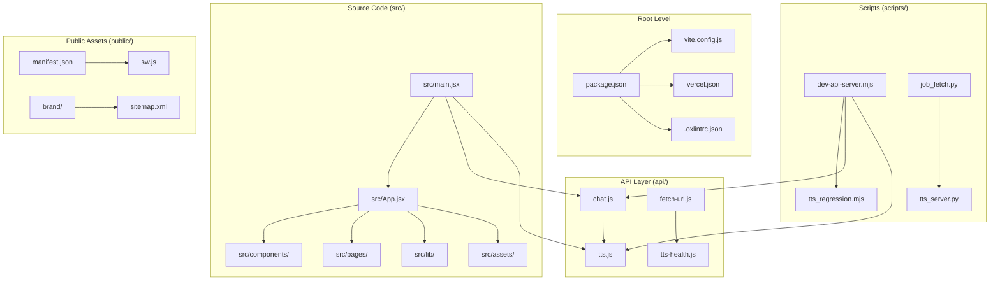
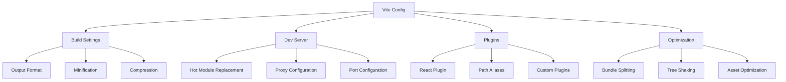
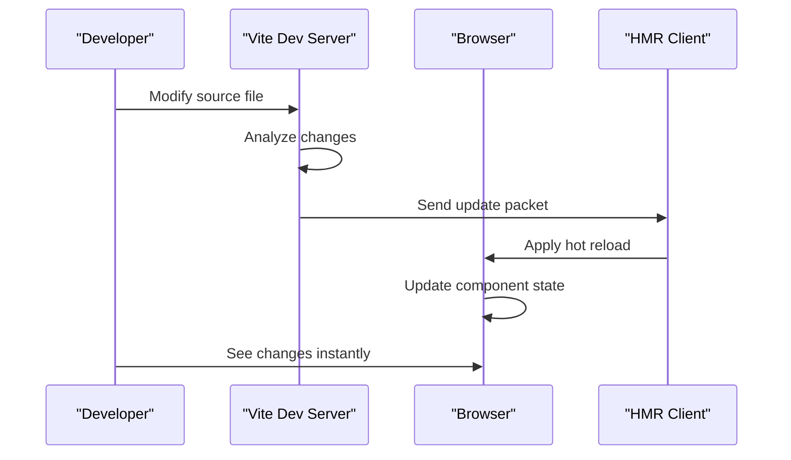
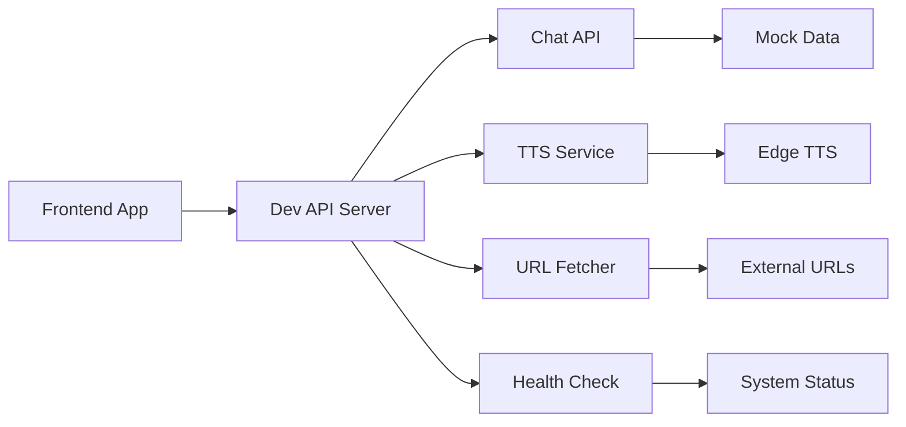
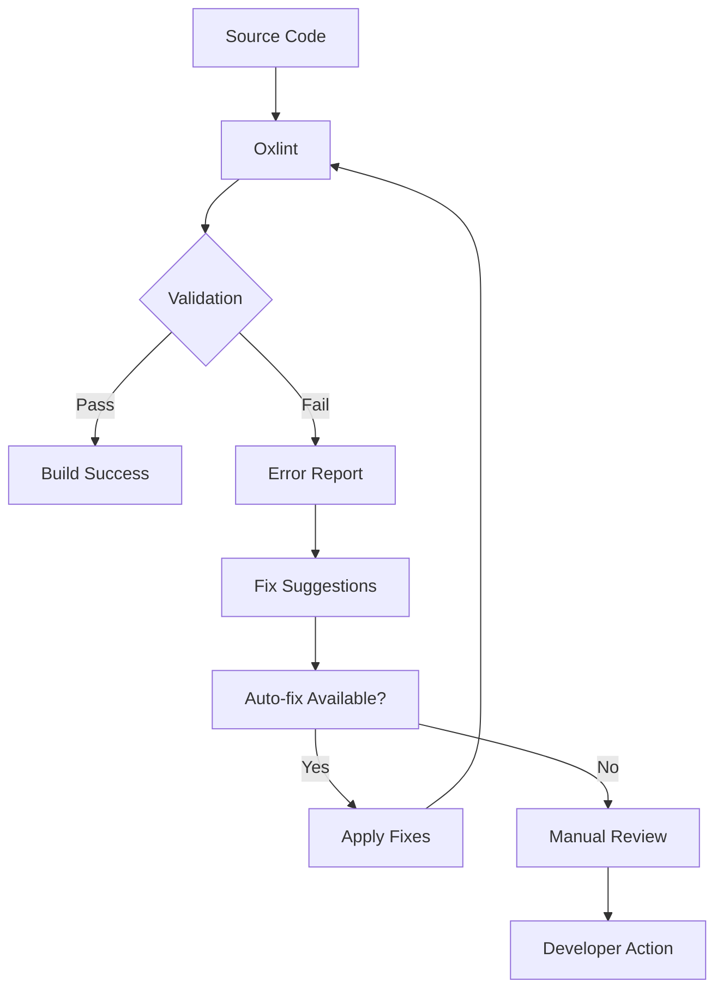
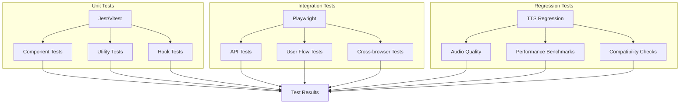
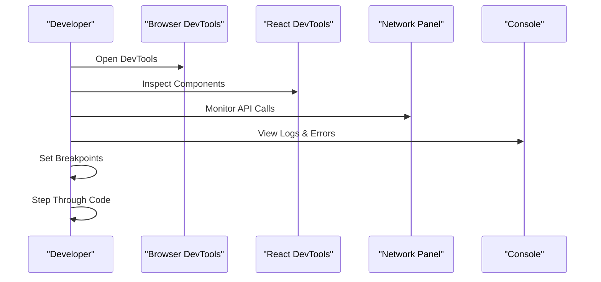
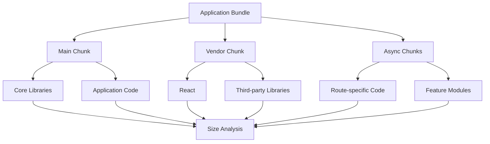
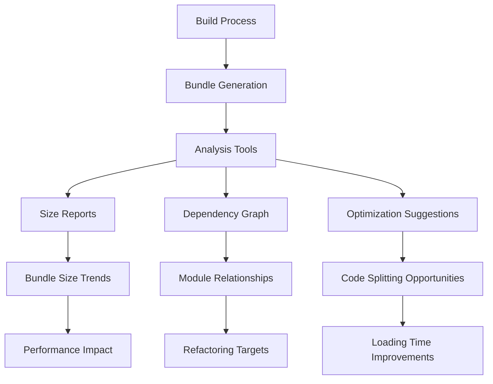
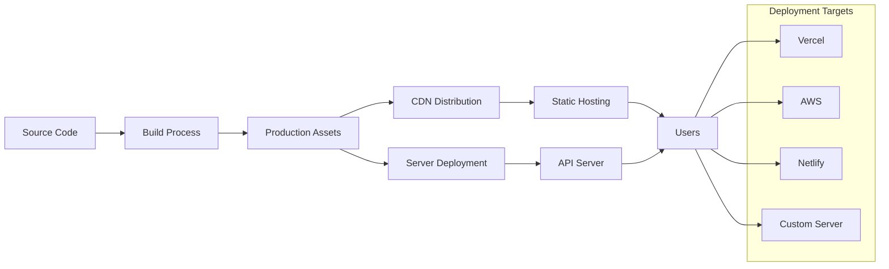

# Development Guide

<cite>
**Referenced Files in This Document**
- [package.json](file://package.json)
- [vite.config.js](file://vite.config.js)
- [README.md](file://README.md)
- [src/main.jsx](file://src/main.jsx)
- [src/App.jsx](file://src/App.jsx)
- [scripts/dev-api-server.mjs](file://scripts/dev-api-server.mjs)
- [scripts/tts_regression.mjs](file://scripts/tts_regression.mjs)
- [scripts/job_fetch.py](file://scripts/job_fetch.py)
- [scripts/tts_server.py](file://scripts/tts_server.py)
- [.oxlintrc.json](file://.oxlintrc.json)
- [vercel.json](file://vercel.json)
</cite>

## Table of Contents
1. [Introduction](#introduction)
2. [Project Structure](#project-structure)
3. [Development Environment Setup](#development-environment-setup)
4. [Build System and Vite Configuration](#build-system-and-vite-configuration)
5. [Development Server and Hot Reloading](#development-server-and-hot-reloading)
6. [API Mocking and Backend Services](#api-mocking-and-backend-services)
7. [Code Style and Linting](#code-style-and-linting)
8. [Testing Strategies](#testing-strategies)
9. [Debugging Techniques](#debugging-techniques)
10. [Performance Optimization](#performance-optimization)
11. [Bundle Analysis](#bundle-analysis)
12. [Production Deployment](#production-deployment)
13. [Contribution Guidelines](#contribution-guidelines)
14. [Troubleshooting](#troubleshooting)
15. [Conclusion](#conclusion)

## Introduction

LineCheck is a modern web application built with React and Vite, designed to provide intelligent document processing and interview preparation capabilities. This development guide serves as a comprehensive resource for contributors and developers working on the LineCheck project, covering everything from local setup to production deployment.

The project follows modern JavaScript development practices with a focus on developer experience, performance optimization, and maintainable code architecture. It utilizes React for the frontend framework, Vite for fast build tooling, and includes comprehensive testing and automation scripts.

## Project Structure

The LineCheck project follows a well-organized modular architecture that separates concerns effectively:



**Diagram sources**
- [src/main.jsx:1-50](file://src/main.jsx#L1-L50)
- [src/App.jsx:1-100](file://src/App.jsx#L1-L100)
- [vite.config.js:1-100](file://vite.config.js#L1-L100)

### Core Directory Organization

- **`src/`**: Main application source code containing React components, pages, and utilities
- **`api/`**: Backend API endpoints for chat functionality and text-to-speech services
- **`scripts/`**: Development utilities, regression testing, and automation tasks
- **`public/`**: Static assets including service worker, manifest, and brand materials
- **`lib/`**: Shared libraries and external integrations

**Section sources**
- [src/main.jsx:1-50](file://src/main.jsx#L1-L50)
- [src/App.jsx:1-100](file://src/App.jsx#L1-L100)
- [vite.config.js:1-100](file://vite.config.js#L1-L100)

## Development Environment Setup

### Prerequisites

Before starting development, ensure you have the following installed:

- **Node.js**: Version 18 or higher recommended
- **npm**: Latest stable version
- **Python 3**: For backend server scripts
- **Git**: For version control

### Initial Setup

1. **Clone the repository**:
   ```bash
   git clone <repository-url>
   cd linecheck
   ```

2. **Install dependencies**:
   ```bash
   npm install
   ```

3. **Environment configuration**:
   Create a `.env` file in the root directory with necessary environment variables:
   ```bash
   # Add required environment variables here
   ```

4. **Start development server**:
   ```bash
   npm run dev
   ```

### Development Dependencies

The project uses modern development tooling including:
- **Vite**: Fast build tool and development server
- **React**: UI framework with JSX support
- **ESLint/Oxlint**: Code linting and quality assurance
- **Playwright**: End-to-end testing framework

**Section sources**
- [package.json:1-100](file://package.json#L1-L100)
- [README.md:1-50](file://README.md#L1-L50)

## Build System and Vite Configuration

### Vite Configuration Overview

The project leverages Vite's powerful build system with custom configurations optimized for React development:



**Diagram sources**
- [vite.config.js:1-200](file://vite.config.js#L1-L200)

### Key Build Features

- **Fast Development Server**: Instant server startup with hot module replacement
- **Optimized Production Builds**: Automatic code splitting and minification
- **Asset Handling**: Efficient image, font, and static asset processing
- **Environment Variables**: Secure configuration management
- **TypeScript Support**: Optional TypeScript compilation and type checking

### Custom Build Scripts

The project includes specialized build scripts for different environments and deployment targets.

**Section sources**
- [vite.config.js:1-200](file://vite.config.js#L1-L200)
- [package.json:1-150](file://package.json#L1-L150)

## Development Server and Hot Reloading

### Development Server Configuration

The development server is configured for optimal developer experience with automatic reloading and debugging support:



**Diagram sources**
- [vite.config.js:1-100](file://vite.config.js#L1-L100)
- [src/main.jsx:1-50](file://src/main.jsx#L1-L50)

### Hot Module Replacement (HMR)

- **Component Updates**: React components update without full page reload
- **State Preservation**: Application state maintained during updates
- **CSS Updates**: Styles change instantly without losing component state
- **Error Overlay**: Real-time error display with stack traces

### Debugging Configuration

The development environment includes comprehensive debugging support:

- **Source Maps**: Full source map generation for debugging
- **React DevTools**: Integration with React Developer Tools
- **Network Inspection**: API call monitoring and debugging
- **Console Logging**: Enhanced logging with context information

**Section sources**
- [vite.config.js:1-150](file://vite.config.js#L1-L150)
- [src/main.jsx:1-100](file://src/main.jsx#L1-L100)

## API Mocking and Backend Services

### Local API Server

The project includes a comprehensive local API server setup for development and testing:



**Diagram sources**
- [scripts/dev-api-server.mjs:1-200](file://scripts/dev-api-server.mjs#L1-L200)
- [api/chat.js:1-100](file://api/chat.js#L1-L100)
- [api/tts.js:1-100](file://api/tts.js#L1-L100)

### API Endpoints

The development server provides mock implementations of all API endpoints:

| Endpoint | Method | Description | Mock Behavior |
|----------|---------|-------------|---------------|
| `/api/chat` | POST | Chat interface endpoint | Returns predefined responses |
| `/api/tts` | POST | Text-to-speech conversion | Generates audio from text |
| `/api/fetch-url` | GET | URL content fetching | Simulates web scraping |
| `/api/tts-health` | GET | TTS service health check | Returns service status |

### Backend Service Management

The project includes Python-based backend services for advanced functionality:

- **TTS Server**: Text-to-speech processing service
- **Job Fetcher**: Background job processing utility
- **Health Monitoring**: Service availability checks

**Section sources**
- [scripts/dev-api-server.mjs:1-200](file://scripts/dev-api-server.mjs#L1-L200)
- [api/chat.js:1-100](file://api/chat.js#L1-L100)
- [api/tts.js:1-100](file://api/tts.js#L1-L100)
- [scripts/tts_server.py:1-100](file://scripts/tts_server.py#L1-L100)

## Code Style and Linting

### Linting Configuration

The project uses Oxlint for fast and efficient code linting with custom rules:



**Diagram sources**
- [.oxlintrc.json:1-100](file://.oxlintrc.json#L1-L100)

### Code Quality Rules

The linting configuration enforces consistent code style and catches common errors:

- **JavaScript Best Practices**: Modern ES6+ syntax enforcement
- **React Patterns**: Component structure and lifecycle validation
- **Import Organization**: Consistent import statement formatting
- **Error Handling**: Proper error catching and reporting
- **Security Rules**: Prevention of common security vulnerabilities

### Pre-commit Hooks

Automated code quality checks run before commits to maintain code standards.

**Section sources**
- [.oxlintrc.json:1-100](file://.oxlintrc.json#L1-L100)
- [package.json:1-100](file://package.json#L1-L100)

## Testing Strategies

### Test Framework Architecture

The project implements a comprehensive testing strategy using multiple frameworks:



**Diagram sources**
- [scripts/tts_regression.mjs:1-200](file://scripts/tts_regression.mjs#L1-L200)
- [package.json:1-150](file://package.json#L1-L150)

### Unit Testing

- **Component Testing**: React component behavior and rendering validation
- **Utility Function Testing**: Helper function logic verification
- **Hook Testing**: Custom React hook functionality validation
- **Mock Services**: External service dependency mocking

### End-to-End Testing

- **User Journey Testing**: Complete user workflow validation
- **Cross-browser Compatibility**: Multi-browser testing coverage
- **Performance Testing**: Load time and responsiveness validation
- **Accessibility Testing**: WCAG compliance verification

### Regression Testing

Specialized regression tests ensure critical functionality remains stable:

- **Text-to-Speech Quality**: Audio output consistency checks
- **Document Processing**: OCR accuracy validation
- **API Response Formats**: Interface contract verification

**Section sources**
- [scripts/tts_regression.mjs:1-200](file://scripts/tts_regression.mjs#L1-L200)
- [package.json:1-200](file://package.json#L1-L200)

## Debugging Techniques

### Development Debugging

The development environment provides comprehensive debugging capabilities:



**Diagram sources**
- [src/main.jsx:1-100](file://src/main.jsx#L1-L100)
- [vite.config.js:1-100](file://vite.config.js#L1-L100)

### Common Debugging Scenarios

- **Component State Issues**: Using React DevTools to inspect component state
- **API Communication Problems**: Network panel inspection for request/response debugging
- **Performance Bottlenecks**: Performance tab analysis for optimization opportunities
- **Memory Leaks**: Memory profiling and heap snapshot analysis

### Error Handling and Logging

Comprehensive error handling and logging throughout the application:

- **Global Error Boundaries**: Catch and report component errors
- **API Error Handling**: Graceful error responses and user feedback
- **Logging Strategy**: Structured logging with appropriate severity levels
- **Error Tracking**: Integration with error monitoring services

**Section sources**
- [src/main.jsx:1-100](file://src/main.jsx#L1-L100)
- [src/App.jsx:1-100](file://src/App.jsx#L1-L100)

## Performance Optimization

### Build-time Optimizations

The Vite build process includes several performance optimizations:

- **Code Splitting**: Automatic chunk splitting for lazy loading
- **Tree Shaking**: Dead code elimination for smaller bundles
- **Asset Optimization**: Image compression and format optimization
- **Caching Strategy**: Long-term caching for immutable assets

### Runtime Performance

- **Lazy Loading**: Components and routes loaded on demand
- **Memoization**: React.memo and useMemo for expensive computations
- **Virtual Scrolling**: Efficient rendering of large lists
- **Web Workers**: Background processing for heavy computations

### Bundle Analysis



**Diagram sources**
- [vite.config.js:1-200](file://vite.config.js#L1-L200)

### Performance Monitoring

- **Core Web Vitals**: Continuous monitoring of performance metrics
- **Bundle Size Tracking**: Automated bundle size regression detection
- **Runtime Performance**: User experience metrics collection
- **Resource Loading**: Asset loading performance analysis

**Section sources**
- [vite.config.js:1-200](file://vite.config.js#L1-L200)
- [package.json:1-150](file://package.json#L1-L150)

## Bundle Analysis

### Bundle Size Analysis

The project includes comprehensive bundle analysis tools to monitor and optimize bundle sizes:



**Diagram sources**
- [vite.config.js:1-200](file://vite.config.js#L1-L200)
- [package.json:1-150](file://package.json#L1-L150)

### Key Metrics

- **Total Bundle Size**: Overall application size impact
- **Initial Load Size**: Critical path bundle size
- **Lazy-loaded Chunks**: On-demand code splitting effectiveness
- **Dependency Analysis**: Third-party library impact assessment

### Optimization Strategies

- **Tree Shaking**: Elimination of unused code
- **Code Splitting**: Strategic chunk separation
- **Asset Optimization**: Image and font compression
- **Dependency Management**: Library selection and version optimization

**Section sources**
- [vite.config.js:1-200](file://vite.config.js#L1-L200)
- [package.json:1-150](file://package.json#L1-L150)

## Production Deployment

### Deployment Configuration

The project supports multiple deployment targets with optimized configurations:



**Diagram sources**
- [vercel.json:1-100](file://vercel.json#L1-L100)
- [vite.config.js:1-200](file://vite.config.js#L1-L200)

### Vercel Deployment

The project includes specific configuration for Vercel deployment:

- **Automatic Build Detection**: Vercel automatically detects Vite configuration
- **Environment Variables**: Secure configuration management
- **Preview Deployments**: Branch-based preview deployments
- **Edge Functions**: Serverless function support for API endpoints

### Build Artifacts

Production builds generate optimized assets:

- **Minified JavaScript**: Reduced bundle size with dead code elimination
- **Optimized Images**: Compressed and modern format images
- **Cached Assets**: Long-term caching headers for improved performance
- **Source Maps**: Optional source maps for production debugging

### Environment Configuration

Different environments use separate configuration files:

- **Development**: Local development settings
- **Staging**: Pre-production testing environment
- **Production**: Live deployment configuration

**Section sources**
- [vercel.json:1-100](file://vercel.json#L1-L100)
- [vite.config.js:1-200](file://vite.config.js#L1-L200)
- [package.json:1-150](file://package.json#L1-L150)

## Contribution Guidelines

### Development Workflow

1. **Fork the Repository**: Create your own fork for development
2. **Create Feature Branch**: Use descriptive branch names (`feature/add-chat-functionality`)
3. **Make Changes**: Implement features with proper testing
4. **Run Tests**: Ensure all tests pass before committing
5. **Submit Pull Request**: Provide detailed description of changes

### Code Standards

- **JavaScript/JSX**: Follow ESLint/Oxlint rules
- **React Patterns**: Use functional components with hooks
- **Naming Conventions**: Consistent naming across the codebase
- **Documentation**: Comment complex logic and export public APIs

### Commit Messages

Use conventional commit messages:
- `feat:` New features
- `fix:` Bug fixes
- `docs:` Documentation changes
- `style:` Code style changes
- `refactor:` Code refactoring
- `test:` Test additions or updates
- `chore:` Maintenance tasks

### Pull Request Process

1. **Self-review**: Review your own changes thoroughly
2. **Update documentation**: Include relevant documentation updates
3. **Add tests**: Ensure adequate test coverage
4. **Request review**: Submit PR for team review
5. **Address feedback**: Respond to review comments promptly

**Section sources**
- [README.md:1-100](file://README.md#L1-L100)
- [package.json:1-100](file://package.json#L1-L100)

## Troubleshooting

### Common Development Issues

#### Development Server Problems

- **Port Conflicts**: Change development server port in configuration
- **Module Resolution**: Verify Node.js version compatibility
- **Cache Issues**: Clear Vite cache and node_modules

#### Build Failures

- **Syntax Errors**: Check for JavaScript/JSX syntax issues
- **Missing Dependencies**: Run `npm install` to ensure all packages are installed
- **Configuration Errors**: Validate Vite configuration syntax

#### Testing Issues

- **Test Environment**: Ensure proper test environment setup
- **Mock Configuration**: Verify API mocking configuration
- **Browser Compatibility**: Check browser target configuration

### Performance Issues

- **Slow Development Server**: Enable incremental builds and optimize imports
- **Large Bundle Size**: Analyze bundle and remove unused dependencies
- **Memory Usage**: Monitor memory usage and optimize large data structures

### Debugging Checklist

1. **Check console logs** for JavaScript errors
2. **Verify network requests** in browser dev tools
3. **Inspect component state** with React DevTools
4. **Review build output** for warnings and errors
5. **Test in incognito mode** to rule out cache issues

**Section sources**
- [vite.config.js:1-200](file://vite.config.js#L1-L200)
- [package.json:1-150](file://package.json#L1-L150)

## Conclusion

This development guide provides comprehensive coverage of the LineCheck project's development ecosystem, from initial setup through production deployment. The project's modern architecture, powered by Vite and React, offers an excellent developer experience with fast iteration cycles and robust build tooling.

Key highlights include:

- **Modern Development Stack**: Vite, React, and contemporary JavaScript tooling
- **Comprehensive Testing**: Multi-layered testing strategy ensuring code quality
- **Performance Focus**: Built-in optimizations and bundle analysis capabilities
- **Flexible Deployment**: Support for multiple deployment targets
- **Developer Experience**: Hot reloading, debugging tools, and clear contribution guidelines

Contributors should follow the established workflows and coding standards to maintain code quality and ensure smooth collaboration. The extensive automation and tooling make it easy to contribute effectively while maintaining high standards.

For additional questions or issues, consult the project documentation or reach out to the development team through the project's communication channels.