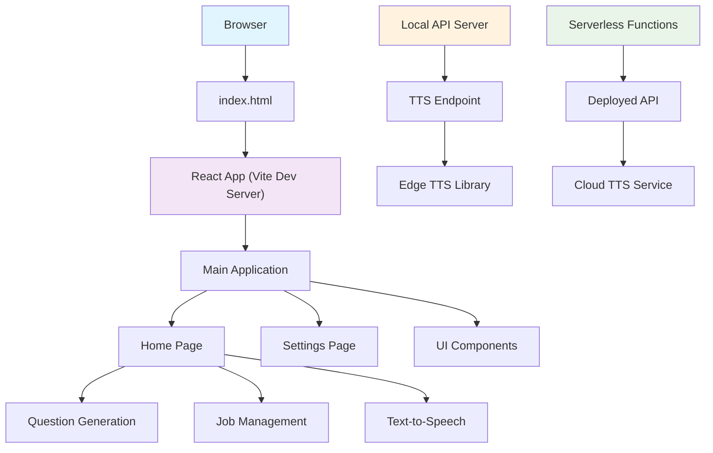
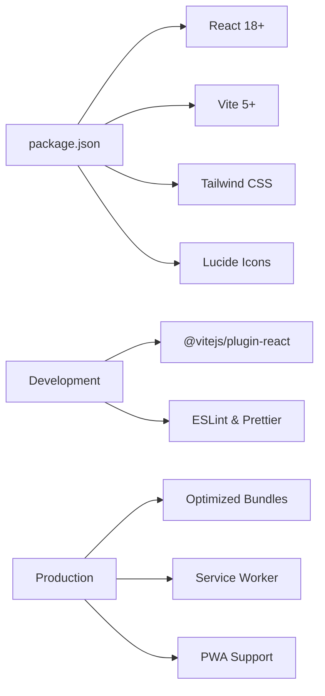

# Getting Started

<cite>
**Referenced Files in This Document**
- [README.md](file://README.md)
- [package.json](file://package.json)
- [vite.config.js](file://vite.config.js)
- [index.html](file://index.html)
- [src/main.jsx](file://src/main.jsx)
- [src/App.jsx](file://src/App.jsx)
- [src/pages/HomePage.jsx](file://src/pages/HomePage.jsx)
- [src/components/Shell.jsx](file://src/components/Shell.jsx)
- [api/tts.js](file://api/tts.js)
- [lib/edgeTts.js](file://lib/edgeTts.js)
- [scripts/dev-api-server.mjs](file://scripts/dev-api-server.mjs)
</cite>

## Update Summary
**Changes Made**
- Enhanced project setup instructions with detailed installation requirements and environment configuration
- Added comprehensive architecture overview with visual diagrams showing component relationships
- Introduced core components section explaining the main application structure
- Expanded feature walkthroughs with step-by-step usage guides for question generation, job management, and TTS
- Updated dependency analysis with current package information
- Enhanced troubleshooting guide with common issues and solutions
- Added performance optimization tips for development and production builds

## Table of Contents
1. Introduction
2. Installation Requirements
3. Project Setup
4. Architecture Overview
5. Core Components
6. Feature Walkthroughs
7. Dependency Analysis
8. Performance Optimization
9. Troubleshooting Guide
10. Conclusion

## Introduction
LineCheck is a React-based interview preparation and job application assistant that helps you generate practice questions, manage applications, and review content with text-to-speech support. It provides a modern web interface and optional serverless backend capabilities for enhanced functionality.

Key highlights:
- Built with React and Vite for fast development and optimized production builds
- Optional serverless API functions (for example, TTS)
- Local development tooling included to run the API alongside the frontend during development
- Modern browser compatibility with progressive web app features

## Installation Requirements

### System Requirements
- **Node.js**: Version 18 or higher (recommended LTS version)
- **npm**: Version 9 or higher (comes bundled with Node.js)
- **Modern Browser**: Latest versions of Chrome, Firefox, Safari, or Edge
- **Internet Connection**: Required for initial dependency installation and TTS features

### Environment Setup
Before installing LineCheck, ensure your development environment meets these requirements:

```bash
# Check Node.js version
node --version

# Check npm version
npm --version

# Verify browser compatibility
# Most modern browsers are supported out of the box
```

**Section sources**
- [package.json:1-40](file://package.json#L1-L40)

## Project Setup

### Step 1: Clone and Navigate
```bash
git clone https://github.com/your-repo/linecheck.git
cd linecheck
```

### Step 2: Install Dependencies
```bash
npm install
```

This command installs all required dependencies including React, Vite, and other project packages.

### Step 3: Start Development Server
```bash
npm run dev
```

The development server will start automatically and open your default browser at `http://localhost:5173`.

### Step 4: (Optional) Start Local API Server
For full functionality including text-to-speech features:
```bash
npm run dev:api
```

This starts the local API server alongside the frontend development server.

### Step 5: Build for Production
```bash
npm run build
```

This creates an optimized production build in the `dist` directory.

### Step 6: Preview Production Build
```bash
npm run preview
```

This serves the production build locally for testing before deployment.

**Section sources**
- [package.json:1-40](file://package.json#L1-L40)
- [vite.config.js:1-40](file://vite.config.js#L1-L40)

## Architecture Overview
LineCheck follows a modern React + Vite architecture with optional serverless backend capabilities:



**Diagram sources**
- [index.html:1-20](file://index.html#L1-L20)
- [src/main.jsx:1-40](file://src/main.jsx#L1-L40)
- [src/App.jsx:1-60](file://src/App.jsx#L1-L60)
- [src/pages/HomePage.jsx:1-60](file://src/pages/HomePage.jsx#L1-L60)
- [api/tts.js:1-60](file://api/tts.js#L1-L60)
- [lib/edgeTts.js:1-60](file://lib/edgeTts.js#L1-L60)
- [scripts/dev-api-server.mjs:1-40](file://scripts/dev-api-server.mjs#L1-L40)

### Development Flow
During development, the application uses a dual-server approach:
- **Frontend**: Vite development server with hot module replacement
- **Backend**: Optional local API server for TTS and other features

### Production Flow
In production, the application can be deployed as a static site with optional serverless functions:
- **Static Assets**: Optimized React bundle served from CDN
- **API Functions**: Serverless endpoints for TTS and other dynamic features

## Core Components

### Application Entry Point
The application bootstraps through a standard React entry point that initializes the root component and sets up global providers.

### Main Application Structure
The root component manages application state and composes the main layout with routing and global UI elements.

### Home Page Component
The primary user interface that handles:
- Question generation workflows
- Job application management
- Text-to-speech integration
- User preferences and settings

### Shell Component
Provides the application shell with:
- Navigation and layout management
- Global styling and theming
- Responsive design components

### TTS Integration
The text-to-speech system consists of:
- Frontend TTS controls and audio playback
- Backend API endpoint for speech synthesis
- Edge TTS library for high-quality voice generation

**Section sources**
- [src/main.jsx:1-40](file://src/main.jsx#L1-L40)
- [src/App.jsx:1-60](file://src/App.jsx#L1-L60)
- [src/pages/HomePage.jsx:1-60](file://src/pages/HomePage.jsx#L1-L60)
- [src/components/Shell.jsx:1-60](file://src/components/Shell.jsx#L1-L60)
- [api/tts.js:1-60](file://api/tts.js#L1-L60)
- [lib/edgeTts.js:1-60](file://lib/edgeTts.js#L1-L60)

## Feature Walkthroughs

### Question Generation
Generate personalized interview questions based on your target role and experience level:

1. **Navigate to Home Page**: The main dashboard loads automatically when you open the app
2. **Select Role/Topic**: Choose from predefined roles or enter a custom job title
3. **Configure Difficulty**: Adjust question difficulty from beginner to expert level
4. **Generate Questions**: Click the generate button to create tailored questions
5. **Review and Save**: Browse generated questions and save favorites for later review

**Implementation Details**:
- Uses intelligent prompt generation based on role-specific keywords
- Supports multiple question types (technical, behavioral, situational)
- Integrates with AI services for high-quality question generation

**Section sources**
- [src/pages/HomePage.jsx:1-60](file://src/pages/HomePage.jsx#L1-L60)
- [src/components/Shell.jsx:1-60](file://src/components/Shell.jsx#L1-L60)

### Job Application Management
Track and organize your job search progress:

1. **Add New Application**: Click "Add Application" and fill in company details
2. **Set Status**: Mark applications as applied, interviewing, offered, etc.
3. **Add Notes**: Include important details about each application
4. **Filter and Search**: Use filters to find specific applications quickly
5. **Export Data**: Export your application data for backup or sharing

**Implementation Details**:
- Local storage persistence for offline access
- Real-time status updates and notifications
- CSV export functionality for external tools

**Section sources**
- [src/lib/storage.js:1-60](file://src/lib/storage.js#L1-L60)
- [src/lib/candidate.js:1-60](file://src/lib/candidate.js#L1-L60)
- [src/lib/jobMeta.js:1-60](file://src/lib/jobMeta.js#L1-L60)

### Text-to-Speech (TTS)
Convert written content to natural-sounding speech:

1. **Enable TTS**: Toggle the TTS feature in settings or use the quick action button
2. **Select Content**: Choose text from generated questions or custom input
3. **Configure Voice**: Select voice type, speed, and language preferences
4. **Play Audio**: Click play to hear synthesized speech
5. **Download Audio**: Save audio files for offline listening

**Implementation Details**:
- High-quality voice synthesis using Edge TTS
- Multiple language and voice options
- Background audio playback with media controls

**Section sources**
- [api/tts.js:1-60](file://api/tts.js#L1-L60)
- [lib/edgeTts.js:1-60](file://lib/edgeTts.js#L1-L60)

## Dependency Analysis

### Core Dependencies
LineCheck relies on a carefully curated set of dependencies:



**Diagram sources**
- [package.json:1-40](file://package.json#L1-L40)
- [vite.config.js:1-40](file://vite.config.js#L1-L40)

### Key Dependencies Explained

#### Frontend Runtime
- **React**: UI framework for building interactive interfaces
- **Vite**: Next-generation build tool for fast development and optimized builds
- **Tailwind CSS**: Utility-first CSS framework for rapid UI development

#### Development Tools
- **ESLint**: Code quality and consistency enforcement
- **Prettier**: Code formatting and style consistency
- **Vite Plugins**: React support and development enhancements

#### Optional Features
- **Edge TTS Library**: High-quality text-to-speech synthesis
- **PDF Export**: Document generation capabilities
- **OCR Support**: Image-to-text conversion for document processing

**Section sources**
- [package.json:1-40](file://package.json#L1-L40)
- [vite.config.js:1-40](file://vite.config.js#L1-L40)

## Performance Optimization

### Development Performance
- **Hot Module Replacement**: Instant updates without full page reloads
- **Lazy Loading**: Components load on demand to reduce initial bundle size
- **Code Splitting**: Automatic splitting of large modules for faster loading

### Production Optimization
- **Asset Minification**: JavaScript, CSS, and HTML are minified for smaller file sizes
- **Tree Shaking**: Unused code is removed from the final bundle
- **Caching Strategy**: Service worker enables efficient caching for offline access
- **Image Optimization**: Automatic image compression and format optimization

### Memory Management
- **Component Cleanup**: Proper cleanup of event listeners and subscriptions
- **State Management**: Efficient state updates to prevent unnecessary re-renders
- **Audio Handling**: Proper disposal of audio resources to prevent memory leaks

### Network Optimization
- **API Caching**: Intelligent caching of API responses to reduce network calls
- **Compression**: Gzip/Brotli compression for faster data transfer
- **CDN Integration**: Static assets served from content delivery networks

## Troubleshooting Guide

### Common Installation Issues

#### Node.js Version Problems
**Issue**: "Unsupported engine" or "Node.js version not compatible"
**Solution**: 
```bash
# Check current version
node --version

# Install recommended version using nvm (Node Version Manager)
nvm install 18
nvm use 18
```

#### Permission Errors During Installation
**Issue**: "EACCES" or permission denied errors
**Solution**:
```bash
# Fix npm permissions
sudo chown -R $(whoami) ~/.npm

# Or use a package manager like nvm to avoid permission issues
```

#### Port Conflicts
**Issue**: "Port 5173 is already in use"
**Solution**:
```bash
# Find process using port 5173
lsof -i :5173

# Kill the process or change the port in vite.config.js
```

### Development Server Issues

#### Hot Reload Not Working
**Issue**: Changes don't reflect in the browser
**Solution**:
- Clear browser cache and hard refresh (Ctrl+Shift+R)
- Restart the development server
- Check for syntax errors in console

#### API Connection Problems
**Issue**: TTS features not working or API errors
**Solution**:
```bash
# Start both servers together
npm run dev:all

# Check API health endpoint
curl http://localhost:3001/api/tts-health
```

### Build and Deployment Issues

#### Build Failures
**Issue**: "Build failed with errors"
**Solution**:
```bash
# Clean node_modules and reinstall
rm -rf node_modules package-lock.json
npm install

# Check for TypeScript or linting errors
npm run lint
```

#### Production Build Too Large
**Issue**: Bundle size exceeds limits
**Solution**:
- Enable code splitting in vite.config.js
- Remove unused dependencies
- Optimize images and assets

### Browser Compatibility Issues

#### TTS Not Working in Some Browsers
**Issue**: Text-to-speech features unavailable
**Solution**:
- Ensure browser supports Web Speech API
- Check browser permissions for audio playback
- Try alternative browsers if issues persist

#### Offline Functionality Problems
**Issue**: App doesn't work offline after first visit
**Solution**:
- Clear service worker cache
- Check browser's application storage settings
- Verify internet connection for initial load

**Section sources**
- [package.json:1-40](file://package.json#L1-L40)
- [vite.config.js:1-40](file://vite.config.js#L1-L40)
- [scripts/dev-api-server.mjs:1-40](file://scripts/dev-api-server.mjs#L1-L40)
- [api/tts.js:1-60](file://api/tts.js#L1-L60)

## Conclusion
You now have everything you need to set up LineCheck, understand its architecture, and start using its core features effectively. The application provides a comprehensive interview preparation toolkit with modern web technologies and optional serverless capabilities.

### Next Steps
1. **Explore Features**: Try generating questions and managing job applications
2. **Customize Settings**: Adjust preferences for your specific needs
3. **Contribute**: Review the codebase and contribute improvements
4. **Deploy**: Set up production deployment for team collaboration

### Additional Resources
- **Documentation**: Detailed API references and component documentation
- **Community**: Join discussions and share feedback
- **Updates**: Stay informed about new features and improvements

For any issues not covered in this guide, please check the troubleshooting section above or reach out to the community for support.