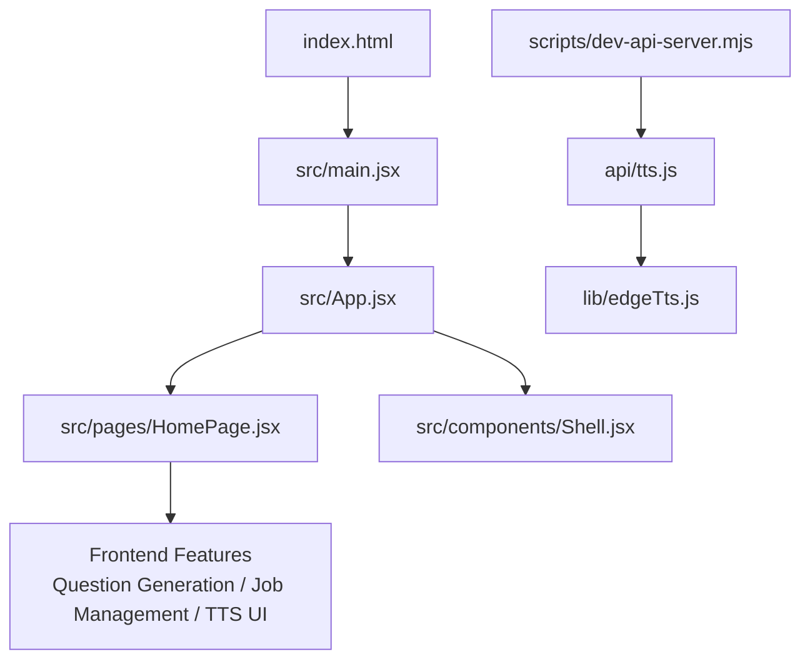
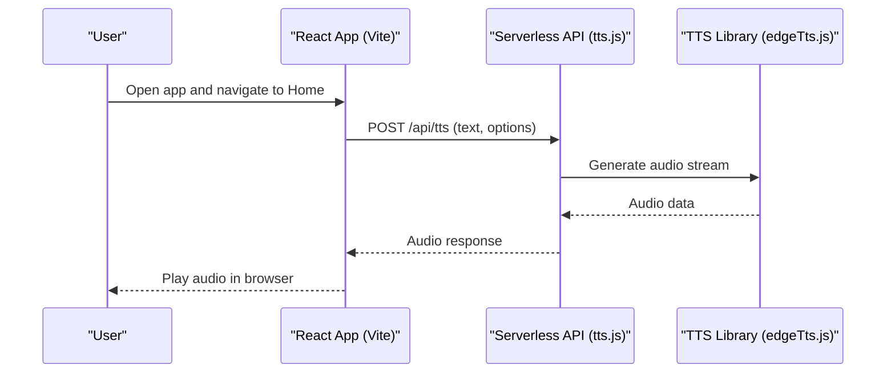
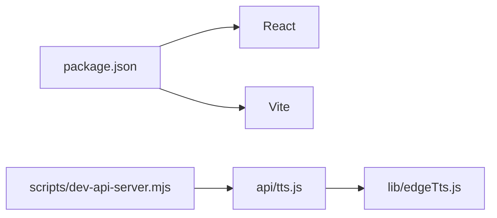

# Getting Started

<cite>
**Referenced Files in This Document**
- [README.md](file://README.md)
- [package.json](file://package.json)
- [vite.config.js](file://vite.config.js)
- [index.html](file://index.html)
- [src/main.jsx](file://src/main.jsx)
- [src/App.jsx](file://src/App.jsx)
- [src/pages/HomePage.jsx](file://src/pages/HomePage.jsx)
- [src/components/Shell.jsx](file://src/components/Shell.jsx)
- [api/tts.js](file://api/tts.js)
- [lib/edgeTts.js](file://lib/edgeTts.js)
- [scripts/dev-api-server.mjs](file://scripts/dev-api-server.mjs)
</cite>

## Table of Contents
1. Introduction
2. Project Structure
3. Core Components
4. Architecture Overview
5. Detailed Component Analysis
6. Dependency Analysis
7. Performance Considerations
8. Troubleshooting Guide
9. Conclusion

## Introduction
LineCheck is a React-based interview preparation and job application assistant that helps you generate practice questions, manage applications, and review content with text-to-speech support. It provides a modern web interface and optional serverless backend endpoints for features like TTS.

Key highlights:
- Built with React and Vite for fast development and optimized production builds
- Optional serverless API functions (for example, TTS)
- Local development tooling included to run the API alongside the frontend during development

## Project Structure
At a high level, the project includes:
- Frontend source under src/
- Serverless API functions under api/
- Shared utilities under lib/
- Development scripts under scripts/
- Build configuration via vite.config.js and package.json
- Entry HTML file index.html

**Diagram sources**
- [index.html:1-20](file://index.html#L1-L20)
- [src/main.jsx:1-40](file://src/main.jsx#L1-L40)
- [src/App.jsx:1-60](file://src/App.jsx#L1-L60)
- [src/pages/HomePage.jsx:1-60](file://src/pages/HomePage.jsx#L1-L60)
- [src/components/Shell.jsx:1-60](file://src/components/Shell.jsx#L1-L60)
- [api/tts.js:1-60](file://api/tts.js#L1-L60)
- [lib/edgeTts.js:1-60](file://lib/edgeTts.js#L1-L60)
- [scripts/dev-api-server.mjs:1-40](file://scripts/dev-api-server.mjs#L1-L40)

**Section sources**
- [package.json:1-40](file://package.json#L1-L40)
- [vite.config.js:1-40](file://vite.config.js#L1-L40)
- [index.html:1-20](file://index.html#L1-L20)
- [src/main.jsx:1-40](file://src/main.jsx#L1-L40)
- [src/App.jsx:1-60](file://src/App.jsx#L1-L60)

## Core Components
- Application shell and routing: The main entry initializes the app and renders the root component, which composes pages and shared UI components.
- Home page: Provides the primary user experience for generating questions and managing job applications.
- Shell component: Wraps layout and global UI elements.
- TTS integration: The frontend can call the TTS endpoint; the serverless function uses a library to synthesize speech.

What you will use most:
- Question generation flow from the home page
- Job application management views
- Text-to-speech playback controls

**Section sources**
- [src/main.jsx:1-40](file://src/main.jsx#L1-L40)
- [src/App.jsx:1-60](file://src/App.jsx#L1-L60)
- [src/pages/HomePage.jsx:1-60](file://src/pages/HomePage.jsx#L1-L60)
- [src/components/Shell.jsx:1-60](file://src/components/Shell.jsx#L1-L60)
- [api/tts.js:1-60](file://api/tts.js#L1-L60)
- [lib/edgeTts.js:1-60](file://lib/edgeTts.js#L1-L60)

## Architecture Overview
The app follows a standard React + Vite architecture with optional serverless functions:
- Browser loads index.html and boots the React app
- Frontend calls local or deployed API endpoints (for example, TTS)
- During development, a helper script can start a local API server

**Diagram sources**
- [src/pages/HomePage.jsx:1-60](file://src/pages/HomePage.jsx#L1-L60)
- [api/tts.js:1-60](file://api/tts.js#L1-L60)
- [lib/edgeTts.js:1-60](file://lib/edgeTts.js#L1-L60)

## Detailed Component Analysis

### Installation and Requirements
- Node.js and npm are required to install dependencies and run dev/build scripts.
- Use a modern browser (latest Chrome/Firefox/Safari/Edge).
- For TTS features, ensure your environment supports the underlying library used by the API.

Where to verify versions and scripts:
- Check engines and available scripts in the package manifest.
- Review build configuration in the Vite config.

**Section sources**
- [package.json:1-40](file://package.json#L1-L40)
- [vite.config.js:1-40](file://vite.config.js#L1-L40)

### Quick Start Tutorial
1. Install dependencies
   - Run the install command defined in the package manifest.
2. Start the development server
   - Use the dev script to launch the Vite dev server.
3. (Optional) Start the local API server
   - Use the provided development script to run API functions locally.
4. Build for production
   - Use the build script to create an optimized bundle.
5. Basic usage
   - Open the app in your browser and explore the home page to generate questions and manage applications.
   - Try the text-to-speech feature if configured.

Relevant commands and files:
- Scripts and metadata: [package.json](file://package.json)
- Dev API helper: [scripts/dev-api-server.mjs](file://scripts/dev-api-server.mjs)
- TTS API function: [api/tts.js](file://api/tts.js)
- TTS library: [lib/edgeTts.js](file://lib/edgeTts.js)

**Section sources**
- [package.json:1-40](file://package.json#L1-L40)
- [scripts/dev-api-server.mjs:1-40](file://scripts/dev-api-server.mjs#L1-L40)
- [api/tts.js:1-60](file://api/tts.js#L1-L60)
- [lib/edgeTts.js:1-60](file://lib/edgeTts.js#L1-L60)

### Feature Walkthroughs

#### Question Generation
- Navigate to the home page and select a topic or role to generate practice questions.
- Use filters or modes to tailor difficulty and focus areas.
- Save or export generated content as needed.

Implementation pointers:
- Home page logic and UI: [src/pages/HomePage.jsx](file://src/pages/HomePage.jsx)
- Layout wrapper: [src/components/Shell.jsx](file://src/components/Shell.jsx)

**Section sources**
- [src/pages/HomePage.jsx:1-60](file://src/pages/HomePage.jsx#L1-L60)
- [src/components/Shell.jsx:1-60](file://src/components/Shell.jsx#L1-L60)

#### Job Application Management
- Add new applications, track status, and store notes.
- Persist data locally using the app’s storage utilities.

Implementation pointers:
- Storage utilities: [src/lib/storage.js](file://src/lib/storage.js)
- Candidate/job helpers: [src/lib/candidate.js](file://src/lib/candidate.js), [src/lib/jobMeta.js](file://src/lib/jobMeta.js)

**Section sources**
- [src/lib/storage.js:1-60](file://src/lib/storage.js#L1-L60)
- [src/lib/candidate.js:1-60](file://src/lib/candidate.js#L1-L60)
- [src/lib/jobMeta.js:1-60](file://src/lib/jobMeta.js#L1-L60)

#### Text-to-Speech (TTS)
- Enter or select text and play synthesized speech.
- The frontend calls the TTS endpoint; the serverless function returns audio data.

Implementation pointers:
- TTS API function: [api/tts.js](file://api/tts.js)
- TTS library: [lib/edgeTts.js](file://lib/edgeTts.js)

**Section sources**
- [api/tts.js:1-60](file://api/tts.js#L1-L60)
- [lib/edgeTts.js:1-60](file://lib/edgeTts.js#L1-L60)

## Dependency Analysis
- Frontend runtime depends on React and Vite.
- Build pipeline is configured via Vite.
- Optional serverless functions depend on the TTS library.

**Diagram sources**
- [package.json:1-40](file://package.json#L1-L40)
- [api/tts.js:1-60](file://api/tts.js#L1-L60)
- [lib/edgeTts.js:1-60](file://lib/edgeTts.js#L1-L60)
- [scripts/dev-api-server.mjs:1-40](file://scripts/dev-api-server.mjs#L1-L40)

**Section sources**
- [package.json:1-40](file://package.json#L1-L40)
- [vite.config.js:1-40](file://vite.config.js#L1-L40)

## Performance Considerations
- Keep dependencies up to date to benefit from performance improvements.
- Use the production build for optimal asset size and caching.
- Avoid heavy synchronous operations in the browser; offload work to serverless functions when appropriate.

[No sources needed since this section provides general guidance]

## Troubleshooting Guide
Common issues and resolutions:
- Missing Node.js or outdated version
  - Ensure you have a supported Node.js version and reinstall dependencies if necessary.
- Port conflicts during development
  - Change the port in the Vite configuration or stop other processes using the same port.
- CORS or API not reachable locally
  - When running the frontend and API separately, configure the API URL accordingly or use the provided dev helper script.
- TTS not working
  - Verify the TTS library is installed and that the API endpoint is reachable. Check logs from the API process.

Where to look:
- Available scripts and engine requirements: [package.json](file://package.json)
- Vite configuration (port, proxies): [vite.config.js](file://vite.config.js)
- Dev API helper: [scripts/dev-api-server.mjs](file://scripts/dev-api-server.mjs)
- TTS API function: [api/tts.js](file://api/tts.js)

**Section sources**
- [package.json:1-40](file://package.json#L1-L40)
- [vite.config.js:1-40](file://vite.config.js#L1-L40)
- [scripts/dev-api-server.mjs:1-40](file://scripts/dev-api-server.mjs#L1-L40)
- [api/tts.js:1-60](file://api/tts.js#L1-L60)

## Conclusion
You now have everything you need to set up LineCheck, run it locally, and start using core features like question generation, job application management, and text-to-speech. Refer to the troubleshooting section if you encounter setup issues, and consult the detailed component analysis for deeper insights into how the app works.