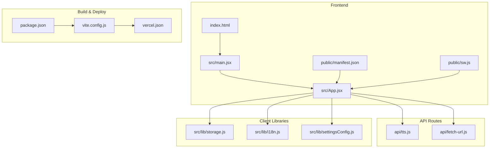
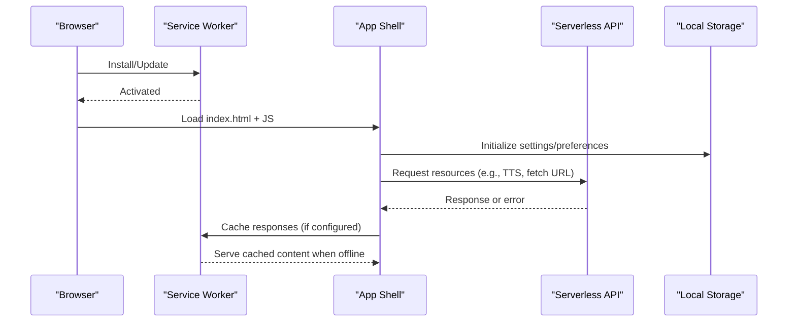
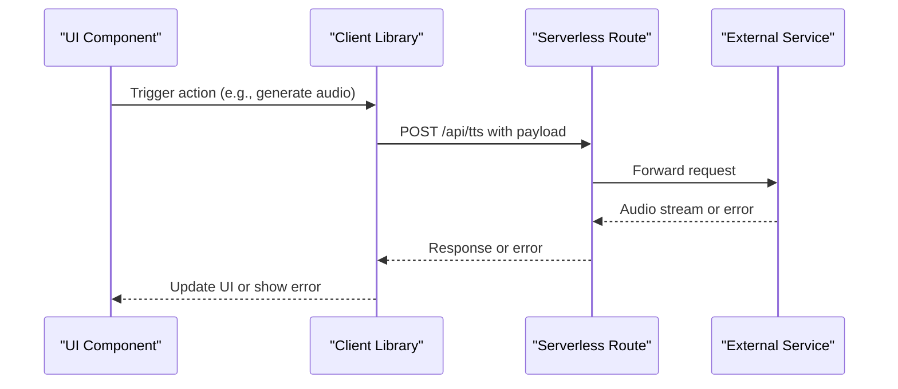
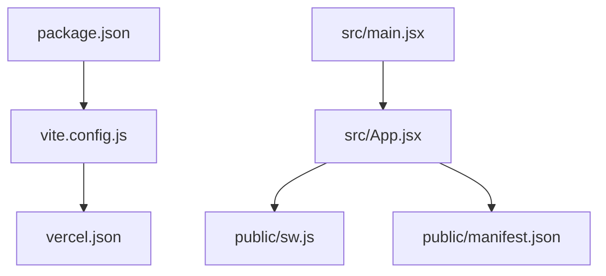

# Troubleshooting & FAQ

<cite>
**Referenced Files in This Document**
- [README.md](file://README.md)
- [package.json](file://package.json)
- [vite.config.js](file://vite.config.js)
- [vercel.json](file://vercel.json)
- [index.html](file://index.html)
- [src/main.jsx](file://src/main.jsx)
- [src/App.jsx](file://src/App.jsx)
- [public/manifest.json](file://public/manifest.json)
- [public/sw.js](file://public/sw.js)
- [src/lib/storage.js](file://src/lib/storage.js)
- [src/lib/i18n.js](file://src/lib/i18n.js)
- [src/lib/settingsConfig.js](file://src/lib/settingsConfig.js)
- [src/components/InstallPrompt.jsx](file://src/components/InstallPrompt.jsx)
- [api/tts.js](file://api/tts.js)
- [api/fetch-url.js](file://api/fetch-url.js)
- [lib/edgeTts.js](file://lib/edgeTts.js)
</cite>

## Table of Contents
1. [Introduction](#introduction)
2. [Project Structure](#project-structure)
3. [Core Components](#core-components)
4. [Architecture Overview](#architecture-overview)
5. [Detailed Component Analysis](#detailed-component-analysis)
6. [Dependency Analysis](#dependency-analysis)
7. [Performance Considerations](#performance-considerations)
8. [Troubleshooting Guide](#troubleshooting-guide)
9. [Conclusion](#conclusion)
10. [Appendices](#appendices)

## Introduction
This document provides comprehensive troubleshooting guidance and frequently asked questions for LineCheck. It focuses on diagnosing browser compatibility issues, performance problems, Progressive Web App (PWA) and service worker behavior, offline functionality, logging and diagnostics, error reporting, and migration/backward compatibility considerations. The goal is to help users and developers quickly identify root causes and apply effective fixes.

## Project Structure
LineCheck is a modern web application built with Vite and React. Key areas include:
- Frontend entry points and app shell
- PWA assets (manifest and service worker)
- API routes for server-side features (e.g., TTS, URL fetching)
- Client libraries for storage, internationalization, settings, and utilities
- Build and deployment configuration

**Diagram sources**
- [index.html:1-200](file://index.html#L1-L200)
- [src/main.jsx:1-200](file://src/main.jsx#L1-L200)
- [src/App.jsx:1-200](file://src/App.jsx#L1-L200)
- [public/manifest.json:1-200](file://public/manifest.json#L1-L200)
- [public/sw.js:1-200](file://public/sw.js#L1-L200)
- [package.json:1-200](file://package.json#L1-L200)
- [vite.config.js:1-200](file://vite.config.js#L1-L200)
- [vercel.json:1-200](file://vercel.json#L1-200)
- [api/tts.js:1-200](file://api/tts.js#L1-L200)
- [api/fetch-url.js:1-200](file://api/fetch-url.js#L1-200)
- [src/lib/storage.js:1-200](file://src/lib/storage.js#L1-L200)
- [src/lib/i18n.js:1-200](file://src/lib/i18n.js#L1-L200)
- [src/lib/settingsConfig.js:1-200](file://src/lib/settingsConfig.js#L1-L200)

**Section sources**
- [README.md:1-200](file://README.md#L1-L200)
- [package.json:1-200](file://package.json#L1-L200)
- [vite.config.js:1-200](file://vite.config.js#L1-L200)
- [vercel.json:1-200](file://vercel.json#L1-200)
- [index.html:1-200](file://index.html#L1-L200)
- [src/main.jsx:1-200](file://src/main.jsx#L1-L200)
- [src/App.jsx:1-200](file://src/App.jsx#L1-L200)
- [public/manifest.json:1-200](file://public/manifest.json#L1-L200)
- [public/sw.js:1-200](file://public/sw.js#L1-L200)
- [src/lib/storage.js:1-200](file://src/lib/storage.js#L1-L200)
- [src/lib/i18n.js:1-200](file://src/lib/i18n.js#L1-L200)
- [src/lib/settingsConfig.js:1-200](file://src/lib/settingsConfig.js#L1-L200)
- [api/tts.js:1-200](file://api/tts.js#L1-L200)
- [api/fetch-url.js:1-200](file://api/fetch-url.js#L1-L200)

## Core Components
- Application bootstrap and routing are initialized from the main entry point and app component. These orchestrate feature modules such as storage, i18n, and settings.
- PWA support is provided via a web manifest and a service worker file.
- Serverless API routes handle external integrations like text-to-speech and URL fetching.
- Client libraries encapsulate persistent storage, language switching, and settings configuration.

Key responsibilities:
- Bootstrap and mount the UI tree
- Register and manage the service worker
- Provide global state and configuration
- Call backend APIs for features requiring server processing

**Section sources**
- [src/main.jsx:1-200](file://src/main.jsx#L1-L200)
- [src/App.jsx:1-200](file://src/App.jsx#L1-L200)
- [public/manifest.json:1-200](file://public/manifest.json#L1-L200)
- [public/sw.js:1-200](file://public/sw.js#L1-L200)
- [api/tts.js:1-200](file://api/tts.js#L1-L200)
- [api/fetch-url.js:1-200](file://api/fetch-url.js#L1-L200)
- [src/lib/storage.js:1-200](file://src/lib/storage.js#L1-L200)
- [src/lib/i18n.js:1-200](file://src/lib/i18n.js#L1-L200)
- [src/lib/settingsConfig.js:1-200](file://src/lib/settingsConfig.js#L1-L200)

## Architecture Overview
The runtime architecture connects the browser-based frontend to serverless endpoints and local storage. The service worker mediates caching and offline behavior.

**Diagram sources**
- [public/sw.js:1-200](file://public/sw.js#L1-L200)
- [src/App.jsx:1-200](file://src/App.jsx#L1-L200)
- [api/tts.js:1-200](file://api/tts.js#L1-L200)
- [api/fetch-url.js:1-200](file://api/fetch-url.js#L1-L200)
- [src/lib/storage.js:1-200](file://src/lib/storage.js#L1-L200)

## Detailed Component Analysis

### Service Worker and Offline Behavior
Common symptoms:
- App does not update after deployment
- Offline pages fail to load
- Stale content persists across sessions

Diagnostic steps:
- Verify registration and activation logs in the browser’s developer tools under Application > Service Workers.
- Check cache names and entries to ensure expected assets are stored.
- Confirm that the service worker scope matches your deployment path.

Resolution strategies:
- Implement cache busting for critical assets by updating filenames or adding versioned query strings during build.
- Ensure the service worker strategy aligns with your needs (e.g., network-first for dynamic data, cache-first for static assets).
- Clear caches and force reload if necessary to validate updates.

**Section sources**
- [public/sw.js:1-200](file://public/sw.js#L1-L200)
- [public/manifest.json:1-200](file://public/manifest.json#L1-L200)

### PWA Manifest and Installation
Common symptoms:
- Install prompt does not appear
- App icon missing or incorrect
- Short name or display mode misconfigured

Diagnostic steps:
- Validate the manifest against a JSON validator and check required fields.
- Inspect the installability criteria in the browser’s Application panel.
- Confirm HTTPS requirement and proper MIME types.

Resolution strategies:
- Add or correct required fields (name, short_name, icons, start_url, display).
- Provide multiple icon sizes for various device densities.
- Ensure start_url resolves correctly and the app is served over HTTPS.

**Section sources**
- [public/manifest.json:1-200](file://public/manifest.json#L1-L200)
- [src/components/InstallPrompt.jsx:1-200](file://src/components/InstallPrompt.jsx#L1-L200)

### API Integration (Text-to-Speech and URL Fetching)
Common symptoms:
- Text-to-speech requests fail or time out
- URL fetching returns CORS errors or blocked responses
- Inconsistent results across environments

Diagnostic steps:
- Inspect network requests and responses in the Network tab.
- Review server logs for API route handlers.
- Validate environment variables and secrets used by serverless functions.

Resolution strategies:
- Configure appropriate CORS headers on the server side.
- Implement retries with exponential backoff for transient failures.
- Add request timeouts and user-facing error messages.

**Diagram sources**
- [api/tts.js:1-200](file://api/tts.js#L1-L200)
- [lib/edgeTts.js:1-200](file://lib/edgeTts.js#L1-L200)
- [api/fetch-url.js:1-200](file://api/fetch-url.js#L1-L200)

**Section sources**
- [api/tts.js:1-200](file://api/tts.js#L1-L200)
- [lib/edgeTts.js:1-200](file://lib/edgeTts.js#L1-L200)
- [api/fetch-url.js:1-200](file://api/fetch-url.js#L1-L200)

### Local Storage and Settings
Common symptoms:
- Preferences do not persist across sessions
- Settings reset unexpectedly
- Storage quota exceeded

Diagnostic steps:
- Inspect Local Storage and Session Storage in the Application panel.
- Validate keys and values for serialization issues.
- Monitor storage usage and quotas.

Resolution strategies:
- Wrap storage operations with try/catch and fallback mechanisms.
- Normalize and sanitize stored values.
- Implement graceful degradation when storage is unavailable.

**Section sources**
- [src/lib/storage.js:1-200](file://src/lib/storage.js#L1-L200)
- [src/lib/settingsConfig.js:1-200](file://src/lib/settingsConfig.js#L1-L200)

### Internationalization (i18n)
Common symptoms:
- Wrong language displayed
- Missing translations
- Language switch not applied

Diagnostic steps:
- Check loaded locales and resource availability.
- Validate fallback chain and default locale configuration.
- Inspect runtime language selection logic.

Resolution strategies:
- Preload essential locales at startup.
- Provide sensible defaults and clear error states for missing keys.
- Ensure language changes propagate through context providers.

**Section sources**
- [src/lib/i18n.js:1-200](file://src/lib/i18n.js#L1-L200)

## Dependency Analysis
Build-time and runtime dependencies influence bundling, caching, and deployment behavior.

**Diagram sources**
- [package.json:1-200](file://package.json#L1-L200)
- [vite.config.js:1-200](file://vite.config.js#L1-L200)
- [vercel.json:1-200](file://vercel.json#L1-200)
- [src/main.jsx:1-200](file://src/main.jsx#L1-L200)
- [src/App.jsx:1-200](file://src/App.jsx#L1-L200)
- [public/sw.js:1-200](file://public/sw.js#L1-L200)
- [public/manifest.json:1-200](file://public/manifest.json#L1-L200)

**Section sources**
- [package.json:1-200](file://package.json#L1-L200)
- [vite.config.js:1-200](file://vite.config.js#L1-L200)
- [vercel.json:1-200](file://vercel.json#L1-200)

## Performance Considerations
- Minimize bundle size by code splitting and lazy loading heavy components.
- Use efficient caching strategies in the service worker; prefer HTTP caching headers where possible.
- Debounce or throttle frequent operations (e.g., search, input handling).
- Profile rendering using browser performance tools; avoid unnecessary re-renders.
- Optimize images and assets; leverage modern formats and responsive sizing.
- Monitor API latency and implement client-side retries with backoff.

[No sources needed since this section provides general guidance]

## Troubleshooting Guide

### Browser Compatibility Issues
Symptoms:
- Features fail on older browsers (e.g., Promise, fetch, WebAssembly)
- Polyfills not applied
- Incorrect behavior due to unsupported APIs

Diagnostics:
- Check target browsers defined in build configuration.
- Inspect transpilation and polyfill inclusion in the final bundle.
- Test on representative devices and browsers.

Resolutions:
- Adjust browser targets to match your audience.
- Include necessary polyfills for legacy environments.
- Gracefully degrade features when APIs are unavailable.

**Section sources**
- [vite.config.js:1-200](file://vite.config.js#L1-L200)
- [package.json:1-200](file://package.json#L1-L200)

### Performance Problems
Symptoms:
- Slow initial load
- Janky interactions
- High memory usage

Diagnostics:
- Use Performance and Memory tabs to capture timelines and heap snapshots.
- Identify large bundles and heavy computations.
- Measure network waterfall and cache hit rates.

Resolutions:
- Split routes and components; defer non-critical work.
- Memoize expensive computations and avoid redundant renders.
- Optimize service worker caching to reduce network overhead.

**Section sources**
- [src/App.jsx:1-200](file://src/App.jsx#L1-L200)
- [public/sw.js:1-200](file://public/sw.js#L1-L200)

### Debugging Techniques
- Enable verbose logging in development; filter logs by module or severity.
- Use structured logging with timestamps and correlation IDs for API calls.
- Capture stack traces for unhandled exceptions and report them centrally.
- Instrument key user flows with timing markers.

**Section sources**
- [src/lib/storage.js:1-200](file://src/lib/storage.js#L1-L200)
- [api/tts.js:1-200](file://api/tts.js#L1-L200)

### Error Reporting Mechanisms
- Centralize error boundaries around major UI sections.
- Serialize minimal context (no sensitive data) for error reports.
- Integrate with an error tracking service for aggregation and alerting.
- Provide user-friendly messages and recovery actions.

**Section sources**
- [src/App.jsx:1-200](file://src/App.jsx#L1-L200)

### Progressive Web App Issues
Symptoms:
- Install prompt not shown
- Background sync fails
- Push notifications not received

Diagnostics:
- Validate manifest fields and icons.
- Check service worker lifecycle events and cache contents.
- Verify permissions and capabilities.

Resolutions:
- Ensure HTTPS and valid manifest.
- Implement robust update flow with user prompts.
- Handle permission denials gracefully.

**Section sources**
- [public/manifest.json:1-200](file://public/manifest.json#L1-L200)
- [public/sw.js:1-200](file://public/sw.js#L1-L200)
- [src/components/InstallPrompt.jsx:1-200](file://src/components/InstallPrompt.jsx#L1-L200)

### Service Worker Problems
Symptoms:
- Updates not applied
- Stale assets served
- Offline mode broken

Diagnostics:
- Inspect SW registration, installation, and activation logs.
- Compare cache versions between deployments.
- Force SW update and clear caches to test.

Resolutions:
- Use cache-busting strategies for critical files.
- Implement precaching for essential assets and runtime caching for dynamic data.
- Provide manual refresh controls for users.

**Section sources**
- [public/sw.js:1-200](file://public/sw.js#L1-L200)

### Offline Functionality Troubleshooting
Symptoms:
- Pages fail to load offline
- Data not available without network
- Sync conflicts

Diagnostics:
- Verify offline routes and cached resources.
- Check background sync queues and retry policies.
- Validate conflict resolution logic.

Resolutions:
- Precache core pages and assets.
- Queue mutations and reconcile on reconnect.
- Show clear offline indicators and instructions.

**Section sources**
- [public/sw.js:1-200](file://public/sw.js#L1-L200)

### Setup and Configuration FAQs
- How to configure build targets? Adjust browser targets in the build configuration.
- How to set environment variables for API routes? Define variables in the hosting platform’s dashboard and reference them in serverless functions.
- How to customize the PWA manifest? Edit the manifest file and provide required fields and icons.

**Section sources**
- [vite.config.js:1-200](file://vite.config.js#L1-L200)
- [vercel.json:1-200](file://vercel.json#L1-200)
- [public/manifest.json:1-200](file://public/manifest.json#L1-L200)

### Feature Usage FAQs
- How to enable text-to-speech? Ensure API route is deployed and accessible; verify credentials and rate limits.
- How to change language? Select a supported locale; confirm resources are loaded and fallbacks are configured.
- How to export or share generated content? Use provided export utilities and verify file format support.

**Section sources**
- [api/tts.js:1-200](file://api/tts.js#L1-L200)
- [src/lib/i18n.js:1-200](file://src/lib/i18n.js#L1-L200)

### Migration Guides and Backwards Compatibility
- Upgrading build tooling: Review breaking changes in dependency updates; adjust configuration accordingly.
- Changing API contracts: Version endpoints and maintain backward-compatible responses during transition.
- Updating PWA behavior: Validate new service worker strategies across devices; provide rollback paths.

**Section sources**
- [package.json:1-200](file://package.json#L1-L200)
- [vite.config.js:1-200](file://vite.config.js#L1-L200)
- [public/sw.js:1-200](file://public/sw.js#L1-L200)

## Conclusion
By systematically inspecting browser capabilities, service worker behavior, API integrations, and local storage, most issues in LineCheck can be diagnosed and resolved efficiently. Adopt robust logging, error reporting, and caching strategies to improve reliability and user experience. Keep configurations aligned with your deployment environment and audience expectations, and plan migrations carefully to maintain backwards compatibility.

[No sources needed since this section summarizes without analyzing specific files]

## Appendices

### Diagnostic Tools Checklist
- Open Developer Tools: Console, Network, Application (Storage, Service Workers), Performance, Memory
- Validate manifest and service worker registration
- Inspect cache entries and versions
- Review server logs for API routes
- Reproduce issues on multiple browsers/devices

**Section sources**
- [public/manifest.json:1-200](file://public/manifest.json#L1-L200)
- [public/sw.js:1-200](file://public/sw.js#L1-L200)
- [api/tts.js:1-200](file://api/tts.js#L1-L200)