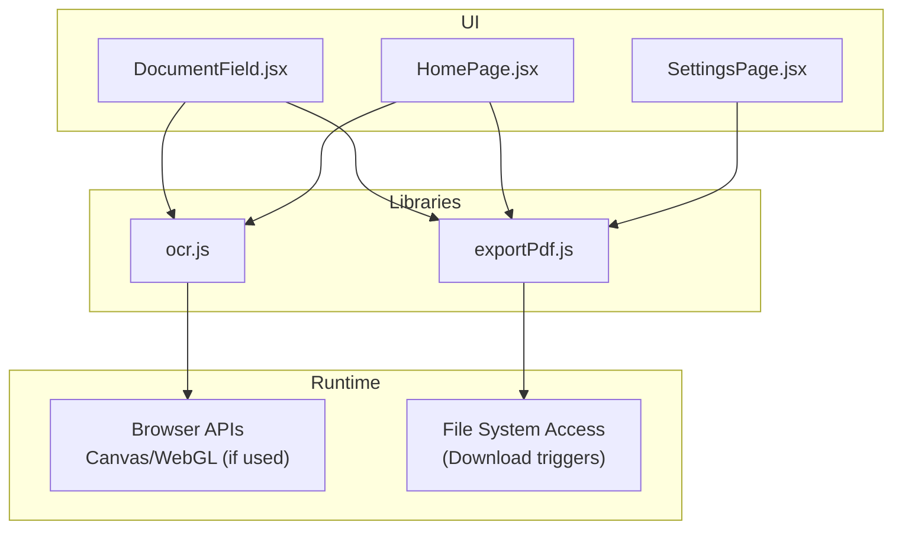
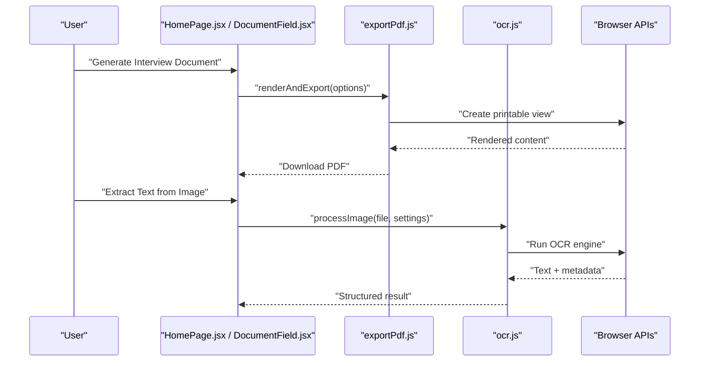
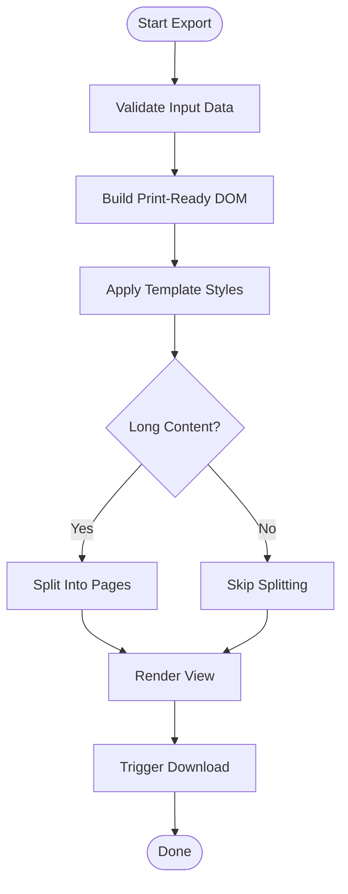
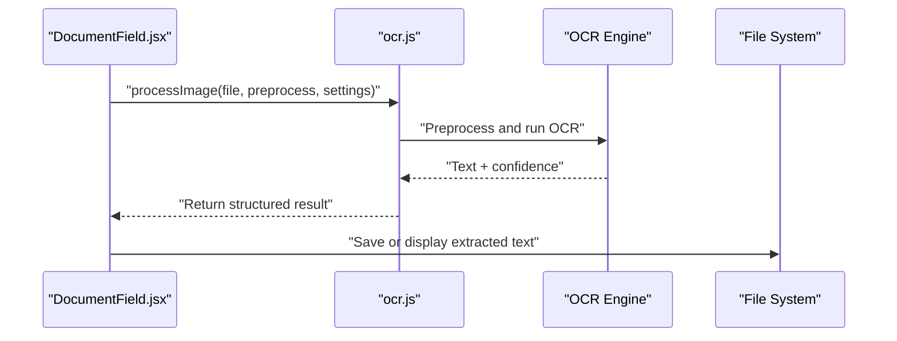
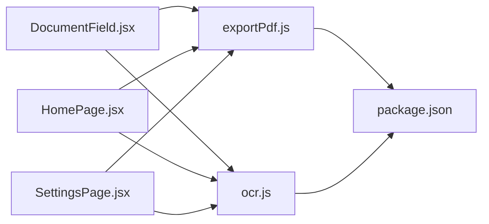

# Document Processing

<cite>
**Referenced Files in This Document**
- [exportPdf.js](file://src/lib/exportPdf.js)
- [ocr.js](file://src/lib/ocr.js)
- [DocumentField.jsx](file://src/components/DocumentField.jsx)
- [HomePage.jsx](file://src/pages/HomePage.jsx)
- [SettingsPage.jsx](file://src/pages/SettingsPage.jsx)
- [package.json](file://package.json)
</cite>

## Table of Contents
1. [Introduction](#introduction)
2. [Project Structure](#project-structure)
3. [Core Components](#core-components)
4. [Architecture Overview](#architecture-overview)
5. [Detailed Component Analysis](#detailed-component-analysis)
6. [Dependency Analysis](#dependency-analysis)
7. [Performance Considerations](#performance-considerations)
8. [Troubleshooting Guide](#troubleshooting-guide)
9. [Conclusion](#conclusion)
10. [Appendices](#appendices)

## Introduction
This document explains LineCheck’s document processing utilities with a focus on PDF export and OCR functionality. It covers the PDF generation API, template customization, layout options, and supported export formats. It also documents OCR integration for image-to-text conversion, including supported file formats, accuracy settings, preprocessing options, and performance tuning. Practical examples are provided for generating interview documents, customizing PDF templates, handling large documents, and optimizing OCR performance. Error handling strategies, fallback mechanisms, and browser compatibility considerations are included to help you build robust workflows.

## Project Structure
The document processing features are implemented as client-side modules:
- PDF export logic resides in a dedicated utility module.
- OCR integration is implemented in a separate utility module.
- UI components expose configuration and trigger actions for both features.
- Pages integrate these utilities into user flows such as creating and exporting interview documents.

[No sources needed since this diagram shows conceptual workflow, not actual code structure]

## Core Components
- PDF Export Utility
  - Provides functions to render content into a printable layout and generate downloadable PDFs.
  - Supports configurable page size, margins, orientation, and header/footer injection.
  - Offers template hooks for branding and section formatting.
  - Handles pagination and page breaks for long content.

- OCR Utility
  - Integrates with browser-based OCR engines or external services to convert images to text.
  - Accepts common image formats and supports optional preprocessing (e.g., grayscale, thresholding).
  - Exposes accuracy and language settings where applicable.
  - Returns structured text results with confidence metrics when available.

- UI Integration
  - DocumentField component exposes fields for configuring export and OCR options.
  - HomePage orchestrates document creation and export flows.
  - SettingsPage centralizes global preferences affecting PDF and OCR behavior.

**Section sources**
- [exportPdf.js](file://src/lib/exportPdf.js)
- [ocr.js](file://src/lib/ocr.js)
- [DocumentField.jsx](file://src/components/DocumentField.jsx)
- [HomePage.jsx](file://src/pages/HomePage.jsx)
- [SettingsPage.jsx](file://src/pages/SettingsPage.jsx)

## Architecture Overview
The system follows a modular architecture:
- UI layers call utility functions from the PDF and OCR modules.
- The PDF module renders HTML/CSS into a print-friendly format and triggers downloads.
- The OCR module processes images using browser capabilities or external endpoints.
- Configuration is centralized via settings and per-document options.

**Diagram sources**
- [HomePage.jsx](file://src/pages/HomePage.jsx)
- [DocumentField.jsx](file://src/components/DocumentField.jsx)
- [exportPdf.js](file://src/lib/exportPdf.js)
- [ocr.js](file://src/lib/ocr.js)

## Detailed Component Analysis

### PDF Export API
- Purpose: Convert structured content into a downloadable PDF with customizable layout and branding.
- Key responsibilities:
  - Build a print-ready DOM tree from input data.
  - Apply styles for page size, margins, headers/footers, and typography.
  - Paginate long sections and handle page breaks.
  - Trigger file download through browser APIs.

- Template customization:
  - Provide a template object that defines header/footer, logo placement, fonts, and section styles.
  - Support dynamic variables for company name, date, and document title.
  - Allow conditional sections based on document type (e.g., interview vs. report).

- Layout options:
  - Page sizes: A4, Letter, Legal.
  - Orientation: Portrait, Landscape.
  - Margins: Small, Medium, Large, Custom.
  - Column layouts and table styling.

- Export formats:
  - Primary: PDF via browser print/download.
  - Fallback: HTML snapshot if PDF is unavailable.

- Example usage patterns:
  - Generate an interview document by passing structured Q&A data and a chosen template.
  - Customize branding by injecting logo and color palette into the template.
  - Handle large documents by enabling pagination and lazy rendering.

**Diagram sources**
- [exportPdf.js](file://src/lib/exportPdf.js)

**Section sources**
- [exportPdf.js](file://src/lib/exportPdf.js)
- [DocumentField.jsx](file://src/components/DocumentField.jsx)
- [HomePage.jsx](file://src/pages/HomePage.jsx)

### OCR Integration
- Purpose: Convert images to machine-readable text using browser-based OCR or external services.
- Supported inputs:
  - Common image formats (PNG, JPEG, WebP).
  - Multi-page TIFF support depends on the underlying engine.

- Accuracy settings:
  - Language selection for better recognition.
  - Confidence thresholds to filter low-quality results.
  - Noise reduction toggles for scanned documents.

- Preprocessing options:
  - Grayscale conversion.
  - Thresholding and binarization.
  - Deskew and rotation correction.
  - Cropping to regions of interest.

- Output structure:
  - Plain text with optional line-level confidence scores.
  - Metadata such as detected language and processing time.

- Performance optimization:
  - Resize large images before processing.
  - Use progressive loading for multi-image batches.
  - Cache OCR results for identical inputs.

**Diagram sources**
- [ocr.js](file://src/lib/ocr.js)
- [DocumentField.jsx](file://src/components/DocumentField.jsx)

**Section sources**
- [ocr.js](file://src/lib/ocr.js)
- [DocumentField.jsx](file://src/components/DocumentField.jsx)

### UI Components and Flows
- DocumentField
  - Exposes controls for PDF template selection, layout options, and OCR preprocessing.
  - Validates inputs and provides feedback for unsupported formats or missing data.

- HomePage
  - Orchestrates end-to-end flows: create interview content, preview, export PDF, and extract text from attachments.

- SettingsPage
  - Centralizes global defaults for page size, margins, OCR language, and accuracy thresholds.

**Section sources**
- [DocumentField.jsx](file://src/components/DocumentField.jsx)
- [HomePage.jsx](file://src/pages/HomePage.jsx)
- [SettingsPage.jsx](file://src/pages/SettingsPage.jsx)

## Dependency Analysis
- Internal dependencies:
  - UI components depend on PDF and OCR utilities.
  - Utilities rely on browser APIs for rendering and file operations.

- External dependencies:
  - Package manifest lists runtime libraries used by the project.

**Diagram sources**
- [DocumentField.jsx](file://src/components/DocumentField.jsx)
- [HomePage.jsx](file://src/pages/HomePage.jsx)
- [SettingsPage.jsx](file://src/pages/SettingsPage.jsx)
- [exportPdf.js](file://src/lib/exportPdf.js)
- [ocr.js](file://src/lib/ocr.js)
- [package.json](file://package.json)

**Section sources**
- [package.json](file://package.json)

## Performance Considerations
- PDF generation:
  - Prefer server-side rendering for very large documents to reduce memory pressure.
  - Use pagination and virtualization techniques to avoid heavy DOM builds.
  - Optimize CSS for print media to minimize reflows.

- OCR processing:
  - Downscale images to reasonable dimensions before OCR.
  - Batch process images asynchronously to keep UI responsive.
  - Leverage caching for repeated files and similar preprocessing pipelines.

- Browser compatibility:
  - Ensure print-to-PDF works across browsers; provide HTML fallback if needed.
  - Verify OCR engine availability and gracefully degrade when unsupported.

[No sources needed since this section provides general guidance]

## Troubleshooting Guide
- PDF export fails:
  - Check browser print dialog permissions and default printer settings.
  - Validate template variables and ensure required assets (logos, fonts) load correctly.
  - Inspect console for CSS errors that break print layout.

- OCR returns poor quality:
  - Increase image resolution within limits and enable preprocessing steps like deskew and thresholding.
  - Select correct language model and adjust confidence thresholds.
  - Test with sample images to calibrate preprocessing parameters.

- Large document handling:
  - Enable pagination and split sections into smaller chunks.
  - Monitor memory usage and consider streaming exports.

- Fallback mechanisms:
  - If PDF generation is blocked, offer HTML export or copy-to-clipboard.
  - If OCR engine is unavailable, prompt users to upload processed images or use an alternative service.

**Section sources**
- [exportPdf.js](file://src/lib/exportPdf.js)
- [ocr.js](file://src/lib/ocr.js)
- [DocumentField.jsx](file://src/components/DocumentField.jsx)

## Conclusion
LineCheck’s document processing utilities provide a flexible, client-first approach to PDF export and OCR. By leveraging modular utilities and configurable UI components, teams can tailor templates, optimize performance, and implement robust error handling. For complex scenarios involving very large documents or specialized OCR needs, consider augmenting client-side logic with server-side processing and advanced preprocessing pipelines.

[No sources needed since this section summarizes without analyzing specific files]

## Appendices

### Example Workflows
- Generating an interview document:
  - Populate structured Q&A data in the UI.
  - Choose a template and layout options.
  - Export to PDF and review output.

- Customizing PDF templates:
  - Update template variables for branding.
  - Adjust margins and page size via settings.
  - Preview changes before final export.

- Handling large documents:
  - Enable pagination and split long sections.
  - Stream content to avoid memory spikes.
  - Validate output across multiple pages.

- Optimizing OCR performance:
  - Preprocess images with grayscale and thresholding.
  - Set appropriate language and confidence thresholds.
  - Cache results and reuse preprocessing configurations.

[No sources needed since this section provides general guidance]