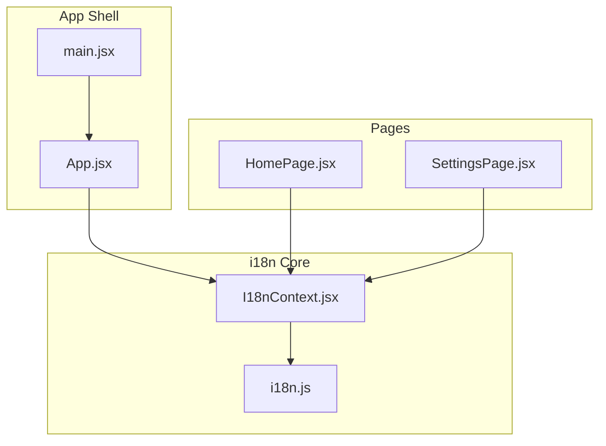
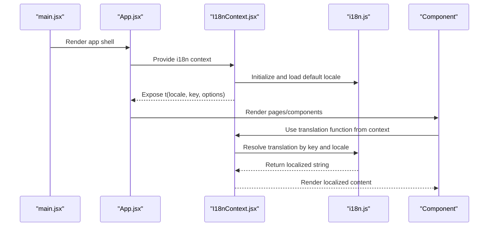
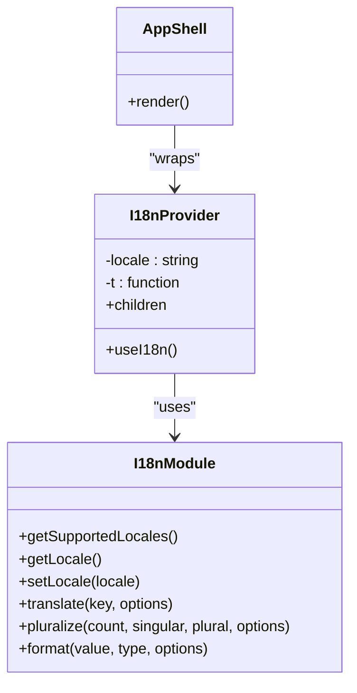
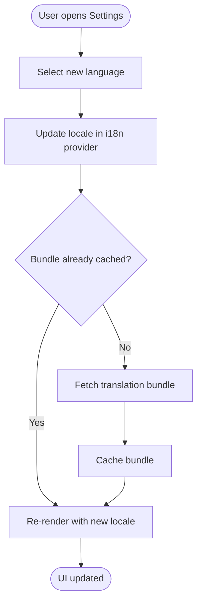
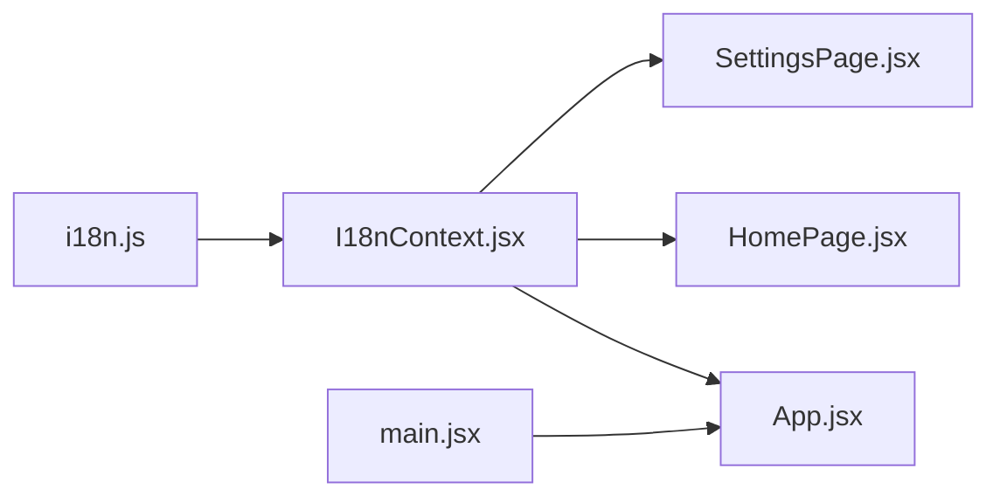

# Internationalization (i18n)

<cite>
**Referenced Files in This Document**
- [I18nContext.jsx](file://src/lib/I18nContext.jsx)
- [i18n.js](file://src/lib/i18n.js)
- [App.jsx](file://src/App.jsx)
- [HomePage.jsx](file://src/pages/HomePage.jsx)
- [SettingsPage.jsx](file://src/pages/SettingsPage.jsx)
- [main.jsx](file://src/main.jsx)
</cite>

## Table of Contents
1. [Introduction](#introduction)
2. [Project Structure](#project-structure)
3. [Core Components](#core-components)
4. [Architecture Overview](#architecture-overview)
5. [Detailed Component Analysis](#detailed-component-analysis)
6. [Dependency Analysis](#dependency-analysis)
7. [Performance Considerations](#performance-considerations)
8. [Troubleshooting Guide](#troubleshooting-guide)
9. [Conclusion](#conclusion)
10. [Appendices](#appendices)

## Introduction
This document explains LineCheck’s internationalization (i18n) system, focusing on the i18n module architecture, language management, translation loading mechanisms, and context-based usage in React components. It also provides guidance for adding new languages, managing keys, handling pluralization and formatting, implementing dynamic language switching, organizing translation files, and optimizing performance for large datasets.

## Project Structure
The i18n implementation is centered around two core modules:
- A runtime loader and API surface that manages available languages, current locale, and translation retrieval.
- A React Context provider that exposes a typed translation function to components.

**Diagram sources**
- [main.jsx](file://src/main.jsx)
- [App.jsx](file://src/App.jsx)
- [I18nContext.jsx](file://src/lib/I18nContext.jsx)
- [i18n.js](file://src/lib/i18n.js)
- [HomePage.jsx](file://src/pages/HomePage.jsx)
- [SettingsPage.jsx](file://src/pages/SettingsPage.jsx)

**Section sources**
- [main.jsx](file://src/main.jsx)
- [App.jsx](file://src/App.jsx)
- [I18nContext.jsx](file://src/lib/I18nContext.jsx)
- [i18n.js](file://src/lib/i18n.js)
- [HomePage.jsx](file://src/pages/HomePage.jsx)
- [SettingsPage.jsx](file://src/pages/SettingsPage.jsx)

## Core Components
- i18n.js: Provides the core API for listing supported locales, setting the active locale, and retrieving translated strings. It may also handle lazy-loading of translation bundles and caching.
- I18nContext.jsx: Wraps the application with a React Context that exposes a translation function and the current locale to any descendant component.

Key responsibilities:
- Language registry and selection
- Translation lookup and fallback behavior
- Locale-aware formatting and pluralization (if implemented)
- Provider integration for React components

**Section sources**
- [i18n.js](file://src/lib/i18n.js)
- [I18nContext.jsx](file://src/lib/I18nContext.jsx)

## Architecture Overview
The i18n architecture follows a thin provider pattern:
- The provider initializes the i18n engine and exposes a stable API to components.
- Components consume translations via a hook or context value rather than importing the i18n module directly.
- The i18n module centralizes translation loading, caching, and locale change logic.

**Diagram sources**
- [main.jsx](file://src/main.jsx)
- [App.jsx](file://src/App.jsx)
- [I18nContext.jsx](file://src/lib/I18nContext.jsx)
- [i18n.js](file://src/lib/i18n.js)

## Detailed Component Analysis

### i18n Module (i18n.js)
Responsibilities:
- Maintain a registry of supported locales and their metadata.
- Load translation resources per locale (static imports or dynamic fetch).
- Cache loaded translations to avoid redundant network requests.
- Provide functions to get the current locale, set a new locale, and retrieve translations by key.
- Optionally support pluralization rules and message formatting.

Design considerations:
- Lazy loading: Load only the requested locale bundle when needed.
- Fallbacks: Gracefully fall back to a default locale if a key is missing.
- Immutability: Avoid mutating shared state; return new values on locale changes.

Common APIs (conceptual):
- Supported locales list
- Get current locale
- Set locale (returns a promise if async loading is required)
- Translate(key, options)
- Pluralize(count, keySingular, keyPlural, options)
- Format(value, type, options)

Best practices:
- Keep keys hierarchical and namespaced by feature area.
- Centralize pluralization rules and number/date formatting utilities.
- Validate keys at build time where possible.

**Section sources**
- [i18n.js](file://src/lib/i18n.js)

### I18nContext (I18nContext.jsx)
Responsibilities:
- Create and manage a React Context for i18n.
- Provide a translation function and current locale to descendants.
- Trigger re-renders when the locale changes.
- Optionally expose helper hooks for convenience.

Provider behavior:
- On mount, initialize the i18n module and load the default locale.
- When locale changes, update the context value so all consumers re-render with the new language.

Consumer patterns:
- Use a hook to access the translation function within functional components.
- Access the current locale for UI adjustments (e.g., text direction).

**Section sources**
- [I18nContext.jsx](file://src/lib/I18nContext.jsx)

### App Integration (App.jsx, main.jsx)
Integration points:
- main.jsx bootstraps the React tree and mounts the root component.
- App.jsx wraps the application with the i18n provider and sets up initial locale.
- Pages and components consume translations through the context.

**Diagram sources**
- [I18nContext.jsx](file://src/lib/I18nContext.jsx)
- [i18n.js](file://src/lib/i18n.js)
- [App.jsx](file://src/App.jsx)
- [main.jsx](file://src/main.jsx)

**Section sources**
- [App.jsx](file://src/App.jsx)
- [main.jsx](file://src/main.jsx)

### Usage in Pages (HomePage.jsx, SettingsPage.jsx)
Components should:
- Consume the translation function from the i18n context.
- Use keys consistently across features.
- For settings, allow users to switch languages dynamically.

Dynamic language switching flow:
- User selects a new language in settings.
- The provider updates the locale and triggers re-renders.
- All components using the context render with the new language.

**Diagram sources**
- [I18nContext.jsx](file://src/lib/I18nContext.jsx)
- [i18n.js](file://src/lib/i18n.js)
- [SettingsPage.jsx](file://src/pages/SettingsPage.jsx)

**Section sources**
- [HomePage.jsx](file://src/pages/HomePage.jsx)
- [SettingsPage.jsx](file://src/pages/SettingsPage.jsx)

## Dependency Analysis
High-level dependencies:
- I18nContext depends on i18n.js for language operations.
- App and pages depend on I18nContext for translation access.
- main.jsx initializes the React tree and mounts the provider.

**Diagram sources**
- [i18n.js](file://src/lib/i18n.js)
- [I18nContext.jsx](file://src/lib/I18nContext.jsx)
- [App.jsx](file://src/App.jsx)
- [HomePage.jsx](file://src/pages/HomePage.jsx)
- [SettingsPage.jsx](file://src/pages/SettingsPage.jsx)
- [main.jsx](file://src/main.jsx)

**Section sources**
- [i18n.js](file://src/lib/i18n.js)
- [I18nContext.jsx](file://src/lib/I18nContext.jsx)
- [App.jsx](file://src/App.jsx)
- [HomePage.jsx](file://src/pages/HomePage.jsx)
- [SettingsPage.jsx](file://src/pages/SettingsPage.jsx)
- [main.jsx](file://src/main.jsx)

## Performance Considerations
Strategies for large translation datasets:
- Lazy-load translation bundles per locale to reduce initial payload size.
- Cache loaded bundles in memory to avoid repeated network requests.
- Preload commonly used locales during idle time or on user interactions.
- Split translation files by feature area to enable selective loading.
- Debounce rapid locale switches to prevent excessive reloads.
- Use memoization in components to minimize unnecessary re-renders.
- Monitor bundle sizes and remove unused keys during builds.

[No sources needed since this section provides general guidance]

## Troubleshooting Guide
Common issues and resolutions:
- Missing translation key: Ensure the key exists in the target locale and falls back gracefully to the default locale.
- Locale not found: Verify the locale code matches the supported list and that the bundle is available.
- Dynamic switching not updating UI: Confirm the provider updates the context value and that components consume it via the correct hook.
- Pluralization/formatting errors: Validate input types and ensure formatter options are correctly passed.

Operational checks:
- Inspect the current locale exposed by the provider.
- Log translation resolution steps to identify fallback paths.
- Validate that translation bundles are cached after first load.

**Section sources**
- [I18nContext.jsx](file://src/lib/I18nContext.jsx)
- [i18n.js](file://src/lib/i18n.js)

## Conclusion
LineCheck’s i18n system centers on a lightweight provider and a centralized i18n module. By leveraging context-based translation access, lazy-loaded bundles, and robust fallbacks, the application supports scalable multilingual experiences. Following the best practices outlined here will help maintain consistency, improve performance, and simplify future localization efforts.

[No sources needed since this section summarizes without analyzing specific files]

## Appendices

### How to Add a New Language
Steps:
- Register the new locale in the supported locales list.
- Create or add translation entries for the new locale.
- Ensure the provider can load the new locale bundle.
- Test dynamic switching and fallback behavior.

**Section sources**
- [i18n.js](file://src/lib/i18n.js)
- [I18nContext.jsx](file://src/lib/I18nContext.jsx)

### Managing Translation Keys
Guidelines:
- Use hierarchical keys grouped by feature (for example, “home.title”, “settings.save”).
- Keep keys consistent across locales.
- Avoid embedding dynamic values in keys; use placeholders instead.
- Remove unused keys periodically to keep bundles small.

**Section sources**
- [i18n.js](file://src/lib/i18n.js)

### Pluralization and Formatting
Recommendations:
- Implement pluralization rules based on locale-specific conventions.
- Provide a format utility for numbers, dates, and currencies.
- Pass explicit options to formatters to ensure consistent output.

**Section sources**
- [i18n.js](file://src/lib/i18n.js)

### Using I18nContext in React Components
Patterns:
- Consume the translation function from the context in functional components.
- Access the current locale for layout or direction adjustments.
- Prefer hooks over direct context consumption for cleaner APIs.

**Section sources**
- [I18nContext.jsx](file://src/lib/I18nContext.jsx)
- [HomePage.jsx](file://src/pages/HomePage.jsx)
- [SettingsPage.jsx](file://src/pages/SettingsPage.jsx)

### Organizing Translation Files
Approaches:
- Group by feature area to enable selective loading.
- Separate common/shared keys from page-specific keys.
- Maintain a canonical key map for validation and tooling.

**Section sources**
- [i18n.js](file://src/lib/i18n.js)