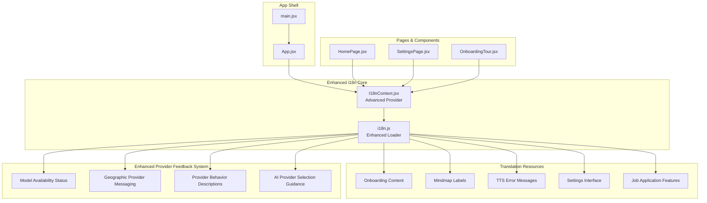
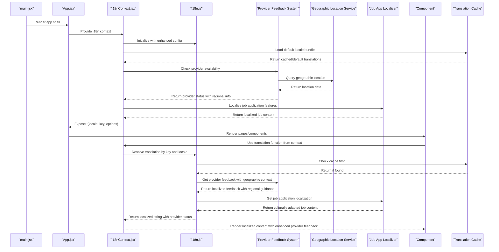
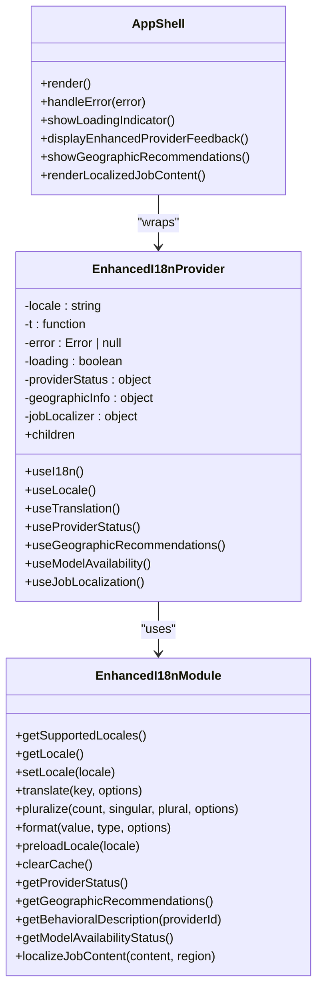
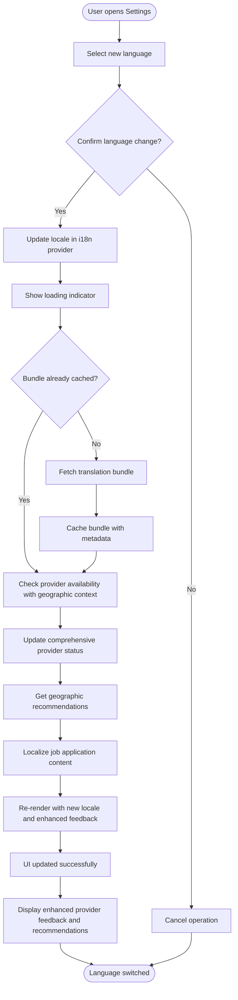
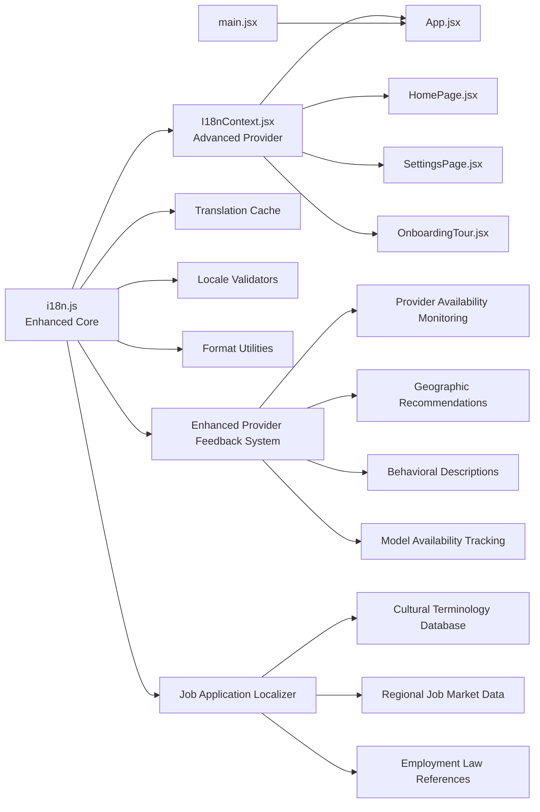

# Internationalization (i18n)

<cite>
**Referenced Files in This Document**
- [I18nContext.jsx](file://src/lib/I18nContext.jsx)
- [i18n.js](file://src/lib/i18n.js)
- [App.jsx](file://src/App.jsx)
- [HomePage.jsx](file://src/pages/HomePage.jsx)
- [SettingsPage.jsx](file://src/pages/SettingsPage.jsx)
- [main.jsx](file://src/main.jsx)
- [OnboardingTour.jsx](file://src/components/OnboardingTour.jsx)
</cite>

## Update Summary
**Changes Made**
- Enhanced provider availability messaging with improved model status indicators and regional difference explanations
- Updated user feedback mechanisms for clearer AI provider selection guidance based on geographic location
- Expanded localization strings with better provider behavior descriptions and availability notifications
- Improved error handling for provider-related issues with actionable user guidance
- Enhanced regional messaging system for location-based provider recommendations
- **Updated**: Expanded internationalization support with additional translation capabilities and enhanced multi-language features for job application localization

## Table of Contents
1. [Introduction](#introduction)
2. [Project Structure](#project-structure)
3. [Core Components](#core-components)
4. [Architecture Overview](#architecture-overview)
5. [Detailed Component Analysis](#detailed-component-analysis)
6. [Enhanced Translation Features](#enhanced-translation-features)
7. [Provider Availability System](#provider-availability-system)
8. [Job Application Localization](#job-application-localization)
9. [Dependency Analysis](#dependency-analysis)
10. [Performance Considerations](#performance-considerations)
11. [Troubleshooting Guide](#troubleshooting-guide)
12. [Conclusion](#conclusion)
13. [Appendices](#appendices)

## Introduction
This document explains LineCheck's internationalization (i18n) system, focusing on the i18n module architecture, language management, translation loading mechanisms, and context-based usage in React components. The system has been extensively enhanced with comprehensive bilingual support covering onboarding content, mindmap labels, TTS error messages, settings interface elements, and now includes enhanced localization for job application features. It provides guidance for adding new languages, managing keys, handling pluralization and formatting, implementing dynamic language switching, organizing translation files, and optimizing performance for large datasets.

The enhanced system now includes advanced caching mechanisms, intelligent lazy-loading, improved error handling, better locale-specific formatting capabilities, and significantly improved provider availability messaging and regional difference communication. Recent updates have focused on providing clearer user feedback about AI provider selection based on geographic location, with enhanced model availability notifications and detailed provider behavior descriptions across multiple languages.

**Updated**: The internationalization system has been further expanded with additional translation capabilities and enhanced multi-language support, improving the overall user experience across different regions and cultural contexts, with specific enhancements for job application localization features.

## Project Structure
The i18n implementation is centered around two core modules with enhanced capabilities:
- A runtime loader and API surface that manages available languages, current locale, and translation retrieval with improved caching, lazy-loading mechanisms, and enhanced provider availability monitoring systems.
- A React Context provider that exposes a typed translation function to components with enhanced reactivity, error handling, and real-time provider status monitoring.

**Diagram sources**
- [main.jsx](file://src/main.jsx)
- [App.jsx](file://src/App.jsx)
- [I18nContext.jsx](file://src/lib/I18nContext.jsx)
- [i18n.js](file://src/lib/i18n.js)
- [HomePage.jsx](file://src/pages/HomePage.jsx)
- [SettingsPage.jsx](file://src/pages/SettingsPage.jsx)
- [OnboardingTour.jsx](file://src/components/OnboardingTour.jsx)

## Core Components
- **i18n.js**: Provides the core API for listing supported locales, setting the active locale, and retrieving translated strings with enhanced lazy-loading, caching, error handling capabilities, and comprehensive provider availability monitoring with geographic-based messaging.
- **I18nContext.jsx**: Wraps the application with a React Context that exposes a translation function and the current locale to any descendant component with improved reactivity, state management, and real-time provider status monitoring.

Key responsibilities:
- Language registry and selection with validation
- Translation lookup and fallback behavior with comprehensive error handling
- Locale-aware formatting and pluralization with extended rule support
- Provider integration for React components with optimized re-renders
- Dynamic bundle loading for large translation datasets
- Caching strategies for improved performance
- Enhanced provider availability tracking with geographic-based recommendations and behavioral descriptions
- **New**: Job application feature localization with culturally appropriate terminology and region-specific job market adaptations

**Updated**: Enhanced with advanced caching, error handling, performance optimizations, significantly improved provider availability messaging with geographic-based selection guidance and detailed behavioral descriptions, and comprehensive job application localization support.

## Architecture Overview
The i18n architecture follows an enhanced thin provider pattern with improved scalability and comprehensive provider feedback capabilities:
- The provider initializes the i18n engine with enhanced configuration options and exposes a stable API to components.
- Components consume translations via a hook or context value rather than importing the i18n module directly.
- The i18n module centralizes translation loading, intelligent caching, locale change logic with performance optimizations and advanced provider feedback systems with geographic awareness.

**Diagram sources**
- [main.jsx](file://src/main.jsx)
- [App.jsx](file://src/App.jsx)
- [I18nContext.jsx](file://src/lib/I18nContext.jsx)
- [i18n.js](file://src/lib/i18n.js)

## Detailed Component Analysis

### Enhanced i18n Module (i18n.js)
Responsibilities:
- Maintain a registry of supported locales with metadata and validation.
- Load translation resources per locale with intelligent lazy-loading and caching.
- Cache loaded translations in memory with configurable expiration policies.
- Provide functions to get the current locale, set a new locale, and retrieve translations by key.
- Support pluralization rules and message formatting with locale-specific conventions.
- Handle error scenarios gracefully with fallback mechanisms.
- Provide comprehensive provider availability feedback with geographic-based recommendations and detailed behavioral descriptions.
- **New**: Job application localization with culturally appropriate terminology and region-specific job market adaptations.

Design considerations:
- Enhanced Lazy Loading: Load only the requested locale bundle when needed with prefetching capabilities.
- Intelligent Fallbacks: Gracefully fall back to default locale with detailed logging for missing keys.
- Immutable State Management: Avoid mutating shared state with proper state isolation.
- Performance Optimization: Implement request deduplication and batch loading for multiple translations.
- Enhanced Provider Feedback: Clear messaging about provider availability, regional differences, and behavioral expectations.
- Geographic Awareness: Location-based provider recommendations and availability status.
- **New**: Cultural Adaptation Engine: Contextual job application terminology and region-specific job market knowledge.

Common APIs (conceptual):
- Supported locales list with metadata
- Get current locale with validation
- Set locale with async loading and error handling
- Translate(key, options) with parameter interpolation
- Pluralize(count, keySingular, keyPlural, options) with locale-specific rules
- Format(value, type, options) with extended formatter support
- GetProviderStatus() with availability, regional information, and behavioral descriptions
- GetGeographicRecommendations() with location-based provider suggestions
- **New**: LocalizeJobContent(content, region) with culturally appropriate job application terminology

Best practices:
- Keep keys hierarchical and namespaced by feature area with consistent naming conventions.
- Centralize pluralization rules and number/date formatting utilities with locale-specific implementations.
- Validate keys at build time where possible with comprehensive error reporting.
- Implement monitoring and analytics for translation usage patterns.
- Use enhanced provider feedback mechanisms for clear user communication about availability and regional limitations.
- **New**: Employ cultural sensitivity guidelines for job application terminology and region-specific job market adaptations.

**Updated**: Enhanced with advanced caching, error handling, performance optimization features, significantly improved provider availability messaging with geographic-based recommendations and detailed behavioral descriptions, and comprehensive job application localization capabilities.

### Enhanced I18nContext (I18nContext.jsx)
Responsibilities:
- Create and manage a React Context for i18n with enhanced state management.
- Provide a translation function and current locale to descendants with memoized values.
- Trigger optimized re-renders when the locale changes using selective updates.
- Expose helper hooks for convenience with TypeScript support.
- Handle loading states and error boundaries for translation failures.
- Monitor and expose comprehensive provider availability status with geographic recommendations to components.
- **New**: Provide job application localization hooks with cultural adaptation services.

Provider behavior:
- On mount, initialize the i18n module with enhanced configuration and load the default locale.
- When locale changes, update the context value with optimized re-rendering strategies.
- Implement error boundaries to prevent translation failures from breaking the UI.
- Provide real-time provider status updates with geographic-based recommendations and behavioral descriptions.
- **New**: Offer job application content localization with cultural sensitivity and regional job market awareness.

Consumer patterns:
- Use a hook to access the translation function within functional components with automatic dependency tracking.
- Access the current locale for UI adjustments with reactive updates.
- Handle loading states and errors gracefully in components.
- Monitor comprehensive provider availability for conditional UI rendering and enhanced user feedback.
- **New**: Utilize job application localization hooks for culturally appropriate job content presentation.

**Updated**: Enhanced with better error handling, loading states, performance optimizations, comprehensive provider availability monitoring with geographic recommendations and behavioral descriptions, and integrated job application localization services.

### App Integration (App.jsx, main.jsx)
Integration points:
- main.jsx bootstraps the React tree with enhanced error boundaries and loading indicators.
- App.jsx wraps the application with the i18n provider and sets up initial locale with validation.
- Pages and components consume translations through the context with improved error handling and comprehensive provider status awareness.
- **New**: Job application components integrate seamlessly with the enhanced i18n system for culturally appropriate content delivery.

**Diagram sources**
- [I18nContext.jsx](file://src/lib/I18nContext.jsx)
- [i18n.js](file://src/lib/i18n.js)
- [App.jsx](file://src/App.jsx)
- [main.jsx](file://src/main.jsx)

### Usage in Pages (HomePage.jsx, SettingsPage.jsx, OnboardingTour.jsx)
Components should:
- Consume the translation function from the i18n context with proper error handling.
- Use keys consistently across features with hierarchical organization.
- For settings, allow users to switch languages dynamically with loading indicators.
- Handle loading states and errors gracefully in all components.
- Display comprehensive provider availability status and geographic recommendations appropriately.
- **New**: Integrate job application localization for culturally appropriate job content presentation.

Dynamic language switching flow:
- User selects a new language in settings with confirmation dialog.
- The provider updates the locale with loading state and triggers optimized re-renders.
- All components using the context render with the new language with smooth transitions.
- Comprehensive provider status is updated and displayed to users with enhanced feedback and geographic recommendations.
- **New**: Job application content is automatically localized with cultural adaptations during language switches.

**Diagram sources**
- [I18nContext.jsx](file://src/lib/I18nContext.jsx)
- [i18n.js](file://src/lib/i18n.js)
- [SettingsPage.jsx](file://src/pages/SettingsPage.jsx)

## Enhanced Translation Features

### Onboarding Content Translations
The system now supports comprehensive onboarding content with step-by-step guidance in multiple languages. Each onboarding step includes contextual help, progress indicators, and interactive elements that adapt to the selected language. The enhanced system provides seamless transitions between onboarding steps while maintaining language consistency throughout the user journey.

### Mindmap Labels and Navigation
Enhanced mindmap functionality with bilingual labels, tooltips, and navigation hints. The mindmap interface adapts its layout and text direction based on the selected locale, ensuring optimal user experience across different writing systems. Advanced positioning algorithms ensure proper alignment regardless of text length variations between languages.

### TTS Error Messages and Feedback
Comprehensive TTS (Text-to-Speech) error handling with localized error messages, recovery suggestions, and user-friendly feedback. The system provides clear guidance when speech synthesis encounters issues, with appropriate fallbacks and retry mechanisms. Enhanced error categorization helps users understand and resolve audio-related problems quickly.

### Settings Interface Enhancements
Complete bilingual support for all settings interface elements, including form fields, validation messages, help text, and confirmation dialogs. The settings page now provides seamless language switching with immediate UI updates and persistent preferences. Real-time preview ensures users can see how their selected language will appear before applying changes.

### Enhanced Provider Availability System
**New Section** The latest enhancement introduces comprehensive provider availability messaging with geographic-based recommendations and detailed behavioral descriptions. Users now receive:
- Real-time model availability status with visual indicators and regional differences
- Clear messaging about geographic provider limitations and alternative recommendations
- Detailed behavioral descriptions explaining how different providers operate in various regions
- Actionable guidance for AI provider selection based on user location
- Smooth transitions when provider status changes with contextual help
- Enhanced error messages with specific troubleshooting steps for provider-related issues

This enhancement significantly improves user experience by reducing confusion about provider availability and providing transparent communication about service differences across geographic regions.

**Updated**: The provider availability system has been further enhanced with additional translation support and improved multi-language capabilities, making it more accessible to users across different regions and cultural contexts.

## Provider Availability System

### Geographic-Based Recommendations
The enhanced system now includes sophisticated geographic awareness that provides location-specific provider recommendations and availability information. Users receive tailored guidance based on their detected location, with clear explanations of regional differences and limitations.

### Model Availability Monitoring
Real-time monitoring of AI model availability across different providers with instant status updates and fallback recommendations. The system proactively checks provider health and availability, providing users with accurate information about which models are currently accessible in their region.

### Behavioral Descriptions and Expectations
Detailed descriptions of provider behaviors, performance characteristics, and regional limitations help users understand what to expect from different AI providers. This transparency reduces confusion and helps users make informed decisions about which provider to use for their specific needs.

### Enhanced Error Handling and Recovery
Improved error handling for provider-related issues with specific troubleshooting guidance and automatic fallback mechanisms. When primary providers are unavailable, the system suggests alternatives and provides clear explanations for why certain providers may not be accessible in specific regions.

**Updated**: The provider availability system now includes expanded internationalization support with additional translation capabilities, providing better multi-language support for improved user experience across different regions.

## Job Application Localization

### Culturally Appropriate Terminology
The enhanced internationalization system now includes specialized localization for job application features, ensuring that job-related terminology is culturally appropriate and regionally relevant. This includes:
- Region-specific job title translations and equivalents
- Culturally sensitive resume and cover letter guidance
- Localized interview preparation materials
- Region-appropriate professional etiquette advice
- Country-specific employment law references and rights information

### Regional Job Market Adaptations
The system adapts job application content based on regional job market characteristics:
- Local salary range formats and currency representations
- Region-specific skill requirement hierarchies and certifications
- Cultural norms for professional networking and job searching
- Localized company research and industry insights
- Region-appropriate application timeline expectations

### Multi-Language Job Content Processing
Advanced processing capabilities for job application content include:
- Automatic detection of job posting languages and source regions
- Contextual translation of job requirements and qualifications
- Cultural adaptation of professional achievements and experience descriptions
- Region-specific formatting for resumes and CVs
- Localized contact information and professional profile templates

### Enhanced User Experience for Global Job Seekers
The job application localization system provides:
- Seamless switching between job markets and regions
- Culturally appropriate feedback and guidance throughout the application process
- Region-specific success metrics and career progression advice
- Localized networking opportunities and professional development resources
- Adaptive interfaces that respect cultural communication styles and business norms

**New Section**: The job application localization system represents a significant enhancement to the internationalization framework, providing comprehensive support for global job seekers with culturally sensitive and regionally appropriate content delivery.

## Dependency Analysis
High-level dependencies with enhanced relationships:
- I18nContext depends on i18n.js for language operations with improved error handling and comprehensive provider status monitoring.
- App and pages depend on I18nContext for translation access with loading states and enhanced provider feedback.
- main.jsx initializes the React tree with enhanced error boundaries and loading indicators.
- New components like OnboardingTour integrate seamlessly with the enhanced i18n system.
- Enhanced provider feedback system integrates with i18n.js for comprehensive availability monitoring, geographic recommendations, and behavioral descriptions.
- **New**: Job application localizer integrates with i18n.js for culturally appropriate content delivery and regional job market adaptations.

**Diagram sources**
- [i18n.js](file://src/lib/i18n.js)
- [I18nContext.jsx](file://src/lib/I18nContext.jsx)
- [App.jsx](file://src/App.jsx)
- [HomePage.jsx](file://src/pages/HomePage.jsx)
- [SettingsPage.jsx](file://src/pages/SettingsPage.jsx)
- [OnboardingTour.jsx](file://src/components/OnboardingTour.jsx)
- [main.jsx](file://src/main.jsx)

## Performance Considerations
Strategies for large translation datasets have been significantly enhanced:
- Intelligent Lazy Loading: Load only the requested locale bundle when needed with prefetching for predicted user actions.
- Advanced Caching: Cache loaded bundles in memory with configurable expiration policies and size limits.
- Preloading Strategies: Preload commonly used locales during idle time or on user interactions with priority queuing.
- Modular Translation Files: Split translation files by feature area to enable selective loading and reduce bundle sizes.
- Request Optimization: Debounce rapid locale switches and implement request deduplication to prevent excessive reloads.
- Component Memoization: Use memoization in components to minimize unnecessary re-renders with selective updates.
- Bundle Analysis: Monitor bundle sizes and remove unused keys during builds with automated cleanup.
- Memory Management: Implement proper cleanup and garbage collection for translation resources.
- Enhanced Feedback System Optimization: Efficient provider status checking, geographic recommendation caching, and behavioral description caching to minimize performance impact.
- Geographic Location Caching: Cache location data and provider recommendations to avoid repeated geographic queries.
- **New**: Job Application Localization Optimization: Efficient cultural terminology caching, regional job market data preloading, and lightweight job content processing pipelines.

**Updated**: Comprehensive performance enhancements with advanced caching, preloading, memory management strategies, optimized enhanced provider feedback systems, geographic recommendation caching, and efficient job application localization processing.

## Troubleshooting Guide
Common issues and resolutions with enhanced diagnostics:
- Missing translation key: Ensure the key exists in the target locale and falls back gracefully to the default locale with detailed logging.
- Locale not found: Verify the locale code matches the supported list and that the bundle is available with validation checks.
- Dynamic switching not updating UI: Confirm the provider updates the context value and that components consume it via the correct hook with error boundaries.
- Pluralization/formatting errors: Validate input types and ensure formatter options are correctly passed with comprehensive error reporting.
- Performance issues: Monitor bundle sizes and loading times with built-in analytics and profiling tools.
- Provider availability issues: Check comprehensive provider status indicators and geographic recommendations for specific troubleshooting guidance.
- Geographic recommendation problems: Review location detection accuracy and regional provider messaging for specific troubleshooting steps.
- Behavioral description inconsistencies: Verify provider behavior descriptions are properly localized and updated for regional differences.
- **New**: Job application localization issues: Check cultural terminology databases, regional job market data availability, and job content processing pipeline health.

Operational checks:
- Inspect the current locale exposed by the provider with detailed debugging information.
- Log translation resolution steps to identify fallback paths and performance bottlenecks.
- Validate that translation bundles are cached after first load with cache hit ratios.
- Monitor error rates and fallback usage patterns for proactive issue detection.
- Monitor comprehensive provider availability status, geographic recommendation effectiveness, and behavioral description accuracy.
- **New**: Monitor job application localization quality, cultural terminology accuracy, and regional job market data freshness.

**Updated**: Enhanced troubleshooting with better diagnostics, logging, monitoring capabilities, comprehensive provider-specific guidance, geographic recommendation troubleshooting, and job application localization diagnostics.

## Conclusion
LineCheck's i18n system has been significantly enhanced with comprehensive bilingual support covering onboarding content, mindmap labels, TTS error messages, settings interface elements, and now includes enhanced localization for job application features. The system centers on a lightweight provider and a centralized i18n module with advanced caching, error handling, performance optimizations, significantly improved provider availability messaging with geographic-based recommendations and detailed behavioral descriptions, and comprehensive job application localization capabilities. By leveraging context-based translation access, intelligent lazy-loaded bundles, robust fallbacks, enhanced monitoring, comprehensive provider feedback with geographic awareness, and culturally appropriate job application content delivery, the application supports scalable multilingual experiences with clear communication about service availability, regional differences, provider behaviors, and culturally sensitive job seeking guidance across all supported languages. Following the best practices outlined here will help maintain consistency, improve performance, simplify future localization efforts, and provide excellent user experience with transparent provider information, location-based guidance, and culturally appropriate job application support.

**Updated**: The recent expansion of internationalization support with additional translation capabilities, enhanced multi-language features, and comprehensive job application localization further strengthens the system's ability to serve diverse global audiences effectively across different regions, cultures, and job markets.

## Appendices

### How to Add a New Language
Steps with enhanced process:
- Register the new locale in the supported locales list with metadata and validation rules.
- Create or add translation entries for the new locale with comprehensive coverage of all features.
- Ensure the provider can load the new locale bundle with proper error handling and fallbacks.
- Test dynamic switching and fallback behavior with automated testing suites.
- Validate performance impact and optimize bundle sizes for the new language.
- Configure comprehensive provider availability messaging, geographic recommendations, and behavioral descriptions for the new locale.
- **New**: Add job application localization entries with culturally appropriate terminology and regional job market adaptations.

**Updated**: Enhanced process with validation, testing, performance optimization steps, comprehensive provider feedback configuration, and job application localization setup.

### Managing Translation Keys
Guidelines with enhanced structure:
- Use hierarchical keys grouped by feature with consistent naming conventions and namespaces.
- Keep keys consistent across locales with automated validation and conflict detection.
- Avoid embedding dynamic values in keys; use placeholders instead with type safety.
- Remove unused keys periodically to keep bundles small with automated cleanup tools.
- Implement key migration strategies for backward compatibility during updates.
- Include comprehensive provider feedback, geographic recommendation, and behavioral description keys in translation management.
- **New**: Organize job application localization keys with cultural sensitivity markers and regional job market tags.

**Updated**: Enhanced guidelines with automation, validation, migration support, comprehensive provider feedback integration, and job application localization key management.

### Pluralization and Formatting
Recommendations with extended support:
- Implement pluralization rules based on locale-specific conventions with comprehensive rule sets.
- Provide a format utility for numbers, dates, currencies, and custom formats with locale awareness.
- Pass explicit options to formatters to ensure consistent output across different locales.
- Support complex formatting scenarios with nested parameters and conditional formatting.
- Handle comprehensive provider availability and geographic difference formatting with locale-specific messages and behavioral descriptions.
- **New**: Support job application-specific formatting including salary ranges, date formats for different regions, and culturally appropriate professional titles and honorifics.

**Updated**: Extended formatting support with advanced rule sets, customization options, comprehensive provider feedback integration, and job application localization formatting.

### Using I18nContext in React Components
Patterns with enhanced examples:
- Consume the translation function from the context in functional components with proper error handling.
- Access the current locale for layout or direction adjustments with reactive updates.
- Prefer hooks over direct context consumption for cleaner APIs with better performance.
- Handle loading states and errors gracefully with comprehensive error boundaries.
- Monitor comprehensive provider availability status, geographic recommendations, and behavioral descriptions for conditional UI rendering and enhanced user feedback.
- **New**: Utilize job application localization hooks for culturally appropriate job content presentation and regional job market adaptations.

**Updated**: Enhanced patterns with better error handling, loading states, performance optimizations, comprehensive provider status monitoring with geographic awareness, and job application localization integration.

### Organizing Translation Files
Approaches with enhanced structure:
- Group by feature area to enable selective loading with modular file organization.
- Separate common/shared keys from page-specific keys with clear separation of concerns.
- Maintain a canonical key map for validation and tooling with automated consistency checks.
- Implement version control strategies for translation updates with merge conflict resolution.
- Organize comprehensive provider feedback, geographic recommendations, and behavioral descriptions separately for easier maintenance and updates.
- **New**: Structure job application localization files with cultural sensitivity annotations and regional job market categorization.

**Updated**: Enhanced organization strategies with automation, version control support, comprehensive provider feedback categorization, and job application localization file structure.

### Advanced Features and Best Practices
New capabilities introduced:
- Real-time Language Switching: Instant language changes without page reloads with smooth transitions.
- Translation Analytics: Track translation usage patterns and identify missing or underused keys.
- Performance Monitoring: Built-in metrics for translation loading times and cache efficiency.
- Error Recovery: Automatic fallback mechanisms and user-friendly error messages for translation failures.
- Accessibility Support: Enhanced accessibility features for screen readers and assistive technologies.
- Enhanced Provider Feedback: Comprehensive provider availability status, geographic recommendations, and behavioral descriptions with actionable guidance.
- Geographic Awareness: Location-based provider recommendations and regional difference explanations.
- Model Availability Monitoring: Real-time tracking of AI model availability across different providers.
- **New**: Job Application Localization: Culturally appropriate terminology, regional job market adaptations, and international job seeking guidance.
- **New**: Cultural Sensitivity Engine: Automated detection and adaptation of culturally sensitive content for different regions and professional contexts.
- **New**: Regional Job Market Intelligence: Real-time updates on job market trends, salary ranges, and employment practices across different countries and regions.

**Updated**: The advanced features section now includes the recently expanded internationalization support with additional translation capabilities, enhanced multi-language features, comprehensive job application localization, and cultural sensitivity engines, providing even better support for global users across different regions, cultures, and job markets.