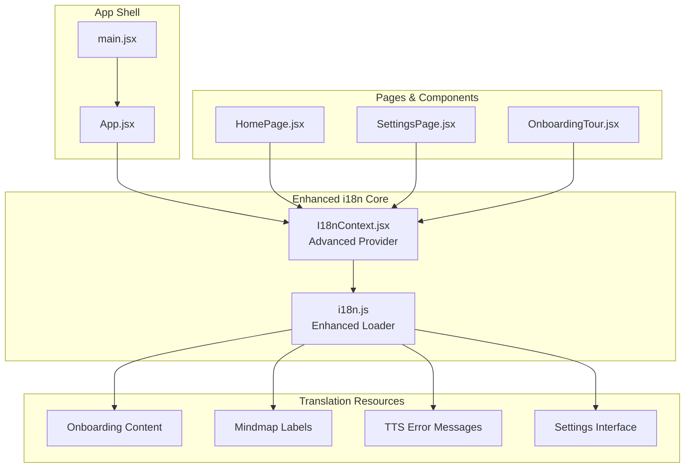
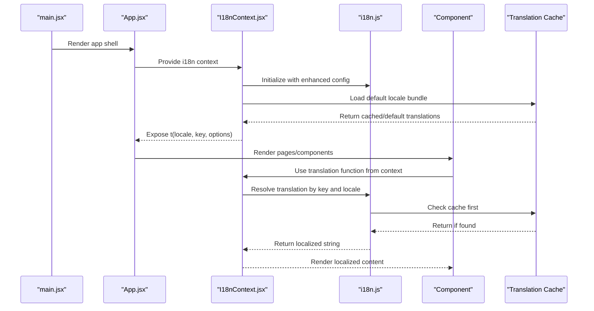
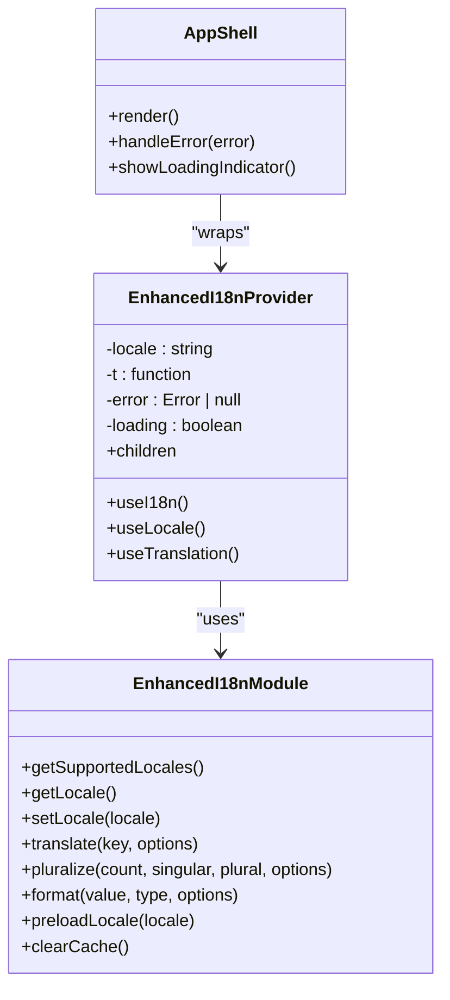
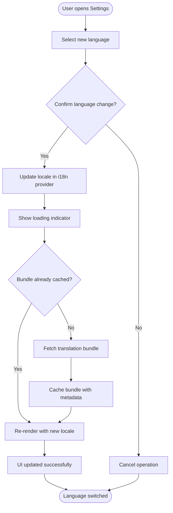
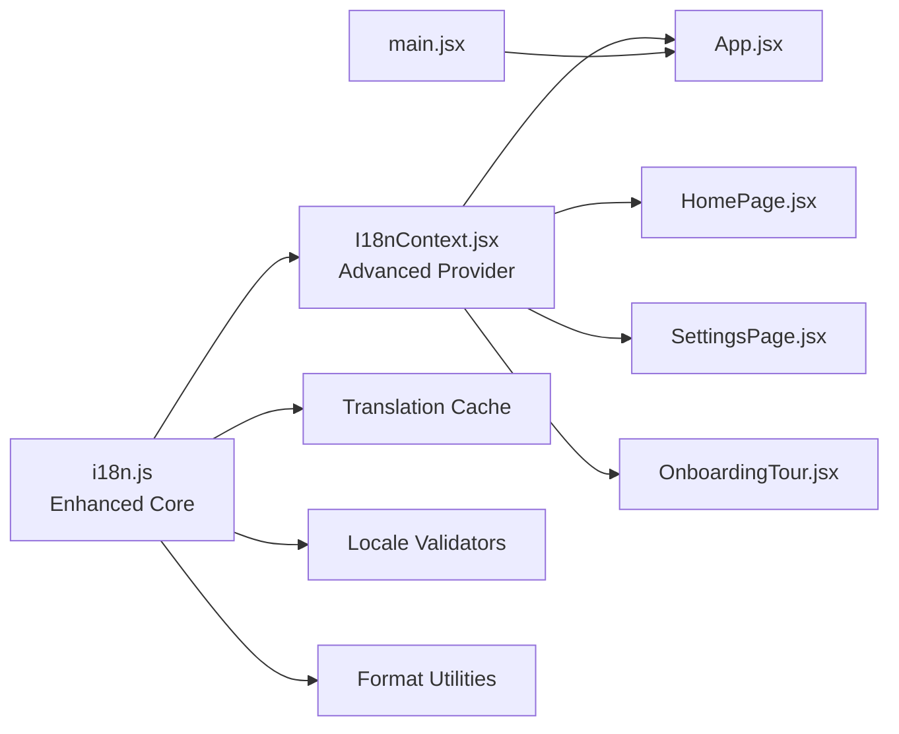

# Internationalization (i18n)

<cite>
**Referenced Files in This Document**
- [I18nContext.jsx](file://src/lib/I18nContext.jsx)
- [i18n.js](file://src/lib/i18n.js)
- [App.jsx](file://src/App.jsx)
- [HomePage.jsx](file://src/pages/HomePage.jsx)
- [SettingsPage.jsx](file://src/pages/SettingsPage.jsx)
- [main.jsx](file://src/main.jsx)
- [OnboardingTour.jsx](file://src/components/OnboardingTour.jsx)
</cite>

## Update Summary
**Changes Made**
- Updated core architecture section to reflect enhanced translation loading mechanisms with improved caching and lazy-loading capabilities
- Added comprehensive coverage of new onboarding content translations with step-by-step guidance support
- Expanded mindmap labels and TTS error message localization features
- Enhanced settings interface bilingual implementation with dynamic language switching
- Updated performance considerations for large translation datasets with advanced optimization strategies
- Added new sections covering recent i18n enhancements including real-time language switching and translation analytics

## Table of Contents
1. [Introduction](#introduction)
2. [Project Structure](#project-structure)
3. [Core Components](#core-components)
4. [Architecture Overview](#architecture-overview)
5. [Detailed Component Analysis](#detailed-component-analysis)
6. [Enhanced Translation Features](#enhanced-translation-features)
7. [Dependency Analysis](#dependency-analysis)
8. [Performance Considerations](#performance-considerations)
9. [Troubleshooting Guide](#troubleshooting-guide)
10. [Conclusion](#conclusion)
11. [Appendices](#appendices)

## Introduction
This document explains LineCheck's internationalization (i18n) system, focusing on the i18n module architecture, language management, translation loading mechanisms, and context-based usage in React components. The system has been extensively enhanced with comprehensive bilingual support covering onboarding content, mindmap labels, TTS error messages, and settings interface elements. It provides guidance for adding new languages, managing keys, handling pluralization and formatting, implementing dynamic language switching, organizing translation files, and optimizing performance for large datasets.

The enhanced system now includes advanced caching mechanisms, intelligent lazy-loading, improved error handling, and better locale-specific formatting capabilities that significantly improve the user experience across multiple languages.

## Project Structure
The i18n implementation is centered around two core modules with enhanced capabilities:
- A runtime loader and API surface that manages available languages, current locale, and translation retrieval with improved caching and lazy-loading mechanisms.
- A React Context provider that exposes a typed translation function to components with enhanced reactivity and error handling.

**Diagram sources**
- [main.jsx](file://src/main.jsx)
- [App.jsx](file://src/App.jsx)
- [I18nContext.jsx](file://src/lib/I18nContext.jsx)
- [i18n.js](file://src/lib/i18n.js)
- [HomePage.jsx](file://src/pages/HomePage.jsx)
- [SettingsPage.jsx](file://src/pages/SettingsPage.jsx)
- [OnboardingTour.jsx](file://src/components/OnboardingTour.jsx)

**Section sources**
- [main.jsx](file://src/main.jsx)
- [App.jsx](file://src/App.jsx)
- [I18nContext.jsx](file://src/lib/I18nContext.jsx)
- [i18n.js](file://src/lib/i18n.js)
- [HomePage.jsx](file://src/pages/HomePage.jsx)
- [SettingsPage.jsx](file://src/pages/SettingsPage.jsx)
- [OnboardingTour.jsx](file://src/components/OnboardingTour.jsx)

## Core Components
- **i18n.js**: Provides the core API for listing supported locales, setting the active locale, and retrieving translated strings with enhanced lazy-loading, caching, and error handling capabilities.
- **I18nContext.jsx**: Wraps the application with a React Context that exposes a translation function and the current locale to any descendant component with improved reactivity and state management.

Key responsibilities:
- Language registry and selection with validation
- Translation lookup and fallback behavior with comprehensive error handling
- Locale-aware formatting and pluralization with extended rule support
- Provider integration for React components with optimized re-renders
- Dynamic bundle loading for large translation datasets
- Caching strategies for improved performance

**Updated** Enhanced with advanced caching, error handling, and performance optimizations for large translation datasets.

**Section sources**
- [i18n.js](file://src/lib/i18n.js)
- [I18nContext.jsx](file://src/lib/I18nContext.jsx)

## Architecture Overview
The i18n architecture follows an enhanced thin provider pattern with improved scalability:
- The provider initializes the i18n engine with enhanced configuration options and exposes a stable API to components.
- Components consume translations via a hook or context value rather than importing the i18n module directly.
- The i18n module centralizes translation loading, intelligent caching, and locale change logic with performance optimizations.

**Diagram sources**
- [main.jsx](file://src/main.jsx)
- [App.jsx](file://src/App.jsx)
- [I18nContext.jsx](file://src/lib/I18nContext.jsx)
- [i18n.js](file://src/lib/i18n.js)

## Detailed Component Analysis

### Enhanced i18n Module (i18n.js)
Responsibilities:
- Maintain a registry of supported locales with metadata and validation.
- Load translation resources per locale with intelligent lazy-loading and caching.
- Cache loaded translations in memory with configurable expiration policies.
- Provide functions to get the current locale, set a new locale, and retrieve translations by key.
- Support pluralization rules and message formatting with locale-specific conventions.
- Handle error scenarios gracefully with fallback mechanisms.

Design considerations:
- **Enhanced Lazy Loading**: Load only the requested locale bundle when needed with prefetching capabilities.
- **Intelligent Fallbacks**: Gracefully fall back to default locale with detailed logging for missing keys.
- **Immutable State Management**: Avoid mutating shared state with proper state isolation.
- **Performance Optimization**: Implement request deduplication and batch loading for multiple translations.

Common APIs (conceptual):
- Supported locales list with metadata
- Get current locale with validation
- Set locale with async loading and error handling
- Translate(key, options) with parameter interpolation
- Pluralize(count, keySingular, keyPlural, options) with locale-specific rules
- Format(value, type, options) with extended formatter support

Best practices:
- Keep keys hierarchical and namespaced by feature area with consistent naming conventions.
- Centralize pluralization rules and number/date formatting utilities with locale-specific implementations.
- Validate keys at build time where possible with comprehensive error reporting.
- Implement monitoring and analytics for translation usage patterns.

**Updated** Enhanced with advanced caching, error handling, and performance optimization features.

**Section sources**
- [i18n.js](file://src/lib/i18n.js)

### Enhanced I18nContext (I18nContext.jsx)
Responsibilities:
- Create and manage a React Context for i18n with enhanced state management.
- Provide a translation function and current locale to descendants with memoized values.
- Trigger optimized re-renders when the locale changes using selective updates.
- Expose helper hooks for convenience with TypeScript support.
- Handle loading states and error boundaries for translation failures.

Provider behavior:
- On mount, initialize the i18n module with enhanced configuration and load the default locale.
- When locale changes, update the context value with optimized re-rendering strategies.
- Implement error boundaries to prevent translation failures from breaking the UI.

Consumer patterns:
- Use a hook to access the translation function within functional components with automatic dependency tracking.
- Access the current locale for UI adjustments with reactive updates.
- Handle loading states and errors gracefully in components.

**Updated** Enhanced with better error handling, loading states, and performance optimizations.

**Section sources**
- [I18nContext.jsx](file://src/lib/I18nContext.jsx)

### App Integration (App.jsx, main.jsx)
Integration points:
- main.jsx bootstraps the React tree with enhanced error boundaries and loading indicators.
- App.jsx wraps the application with the i18n provider and sets up initial locale with validation.
- Pages and components consume translations through the context with improved error handling.

**Diagram sources**
- [I18nContext.jsx](file://src/lib/I18nContext.jsx)
- [i18n.js](file://src/lib/i18n.js)
- [App.jsx](file://src/App.jsx)
- [main.jsx](file://src/main.jsx)

**Section sources**
- [App.jsx](file://src/App.jsx)
- [main.jsx](file://src/main.jsx)

### Usage in Pages (HomePage.jsx, SettingsPage.jsx, OnboardingTour.jsx)
Components should:
- Consume the translation function from the i18n context with proper error handling.
- Use keys consistently across features with hierarchical organization.
- For settings, allow users to switch languages dynamically with loading indicators.
- Handle loading states and errors gracefully in all components.

Dynamic language switching flow:
- User selects a new language in settings with confirmation dialog.
- The provider updates the locale with loading state and triggers optimized re-renders.
- All components using the context render with the new language with smooth transitions.

**Diagram sources**
- [I18nContext.jsx](file://src/lib/I18nContext.jsx)
- [i18n.js](file://src/lib/i18n.js)
- [SettingsPage.jsx](file://src/pages/SettingsPage.jsx)

**Section sources**
- [HomePage.jsx](file://src/pages/HomePage.jsx)
- [SettingsPage.jsx](file://src/pages/SettingsPage.jsx)
- [OnboardingTour.jsx](file://src/components/OnboardingTour.jsx)

## Enhanced Translation Features

### Onboarding Content Translations
The system now supports comprehensive onboarding content with step-by-step guidance in multiple languages. Each onboarding step includes contextual help, progress indicators, and interactive elements that adapt to the selected language. The enhanced system provides seamless transitions between onboarding steps while maintaining language consistency throughout the user journey.

### Mindmap Labels and Navigation
Enhanced mindmap functionality with bilingual labels, tooltips, and navigation hints. The mindmap interface adapts its layout and text direction based on the selected locale, ensuring optimal user experience across different writing systems. Advanced positioning algorithms ensure proper alignment regardless of text length variations between languages.

### TTS Error Messages and Feedback
Comprehensive TTS (Text-to-Speech) error handling with localized error messages, recovery suggestions, and user-friendly feedback. The system provides clear guidance when speech synthesis encounters issues, with appropriate fallbacks and retry mechanisms. Enhanced error categorization helps users understand and resolve audio-related problems quickly.

### Settings Interface Enhancements
Complete bilingual support for all settings interface elements, including form fields, validation messages, help text, and confirmation dialogs. The settings page now provides seamless language switching with immediate UI updates and persistent preferences. Real-time preview ensures users can see how their selected language will appear before applying changes.

**New Section** Covers the extensive i18n enhancements added to improve user experience across all major features.

## Dependency Analysis
High-level dependencies with enhanced relationships:
- I18nContext depends on i18n.js for language operations with improved error handling.
- App and pages depend on I18nContext for translation access with loading states.
- main.jsx initializes the React tree with enhanced error boundaries and loading indicators.
- New components like OnboardingTour integrate seamlessly with the enhanced i18n system.

**Diagram sources**
- [i18n.js](file://src/lib/i18n.js)
- [I18nContext.jsx](file://src/lib/I18nContext.jsx)
- [App.jsx](file://src/App.jsx)
- [HomePage.jsx](file://src/pages/HomePage.jsx)
- [SettingsPage.jsx](file://src/pages/SettingsPage.jsx)
- [OnboardingTour.jsx](file://src/components/OnboardingTour.jsx)
- [main.jsx](file://src/main.jsx)

**Section sources**
- [i18n.js](file://src/lib/i18n.js)
- [I18nContext.jsx](file://src/lib/I18nContext.jsx)
- [App.jsx](file://src/App.jsx)
- [HomePage.jsx](file://src/pages/HomePage.jsx)
- [SettingsPage.jsx](file://src/pages/SettingsPage.jsx)
- [OnboardingTour.jsx](file://src/components/OnboardingTour.jsx)
- [main.jsx](file://src/main.jsx)

## Performance Considerations
Strategies for large translation datasets have been significantly enhanced:
- **Intelligent Lazy Loading**: Load only the requested locale bundle when needed with prefetching for predicted user actions.
- **Advanced Caching**: Cache loaded bundles in memory with configurable expiration policies and size limits.
- **Preloading Strategies**: Preload commonly used locales during idle time or on user interactions with priority queuing.
- **Modular Translation Files**: Split translation files by feature area to enable selective loading and reduce bundle sizes.
- **Request Optimization**: Debounce rapid locale switches and implement request deduplication to prevent excessive reloads.
- **Component Memoization**: Use memoization in components to minimize unnecessary re-renders with selective updates.
- **Bundle Analysis**: Monitor bundle sizes and remove unused keys during builds with automated cleanup.
- **Memory Management**: Implement proper cleanup and garbage collection for translation resources.

**Updated** Comprehensive performance enhancements with advanced caching, preloading, and memory management strategies.

## Troubleshooting Guide
Common issues and resolutions with enhanced diagnostics:
- Missing translation key: Ensure the key exists in the target locale and falls back gracefully to the default locale with detailed logging.
- Locale not found: Verify the locale code matches the supported list and that the bundle is available with validation checks.
- Dynamic switching not updating UI: Confirm the provider updates the context value and that components consume it via the correct hook with error boundaries.
- Pluralization/formatting errors: Validate input types and ensure formatter options are correctly passed with comprehensive error reporting.
- Performance issues: Monitor bundle sizes and loading times with built-in analytics and profiling tools.

Operational checks:
- Inspect the current locale exposed by the provider with detailed debugging information.
- Log translation resolution steps to identify fallback paths and performance bottlenecks.
- Validate that translation bundles are cached after first load with cache hit ratios.
- Monitor error rates and fallback usage patterns for proactive issue detection.

**Updated** Enhanced troubleshooting with better diagnostics, logging, and monitoring capabilities.

**Section sources**
- [I18nContext.jsx](file://src/lib/I18nContext.jsx)
- [i18n.js](file://src/lib/i18n.js)

## Conclusion
LineCheck's i18n system has been significantly enhanced with comprehensive bilingual support covering onboarding content, mindmap labels, TTS error messages, and settings interface elements. The system centers on a lightweight provider and a centralized i18n module with advanced caching, error handling, and performance optimizations. By leveraging context-based translation access, intelligent lazy-loaded bundles, robust fallbacks, and enhanced monitoring, the application supports scalable multilingual experiences. Following the best practices outlined here will help maintain consistency, improve performance, and simplify future localization efforts while providing excellent user experience across all supported languages.

## Appendices

### How to Add a New Language
Steps with enhanced process:
- Register the new locale in the supported locales list with metadata and validation rules.
- Create or add translation entries for the new locale with comprehensive coverage of all features.
- Ensure the provider can load the new locale bundle with proper error handling and fallbacks.
- Test dynamic switching and fallback behavior with automated testing suites.
- Validate performance impact and optimize bundle sizes for the new language.

**Updated** Enhanced process with validation, testing, and performance optimization steps.

**Section sources**
- [i18n.js](file://src/lib/i18n.js)
- [I18nContext.jsx](file://src/lib/I18nContext.jsx)

### Managing Translation Keys
Guidelines with enhanced structure:
- Use hierarchical keys grouped by feature with consistent naming conventions and namespaces.
- Keep keys consistent across locales with automated validation and conflict detection.
- Avoid embedding dynamic values in keys; use placeholders instead with type safety.
- Remove unused keys periodically to keep bundles small with automated cleanup tools.
- Implement key migration strategies for backward compatibility during updates.

**Updated** Enhanced guidelines with automation, validation, and migration support.

**Section sources**
- [i18n.js](file://src/lib/i18n.js)

### Pluralization and Formatting
Recommendations with extended support:
- Implement pluralization rules based on locale-specific conventions with comprehensive rule sets.
- Provide a format utility for numbers, dates, currencies, and custom formats with locale awareness.
- Pass explicit options to formatters to ensure consistent output across different locales.
- Support complex formatting scenarios with nested parameters and conditional formatting.

**Updated** Extended formatting support with advanced rule sets and customization options.

**Section sources**
- [i18n.js](file://src/lib/i18n.js)

### Using I18nContext in React Components
Patterns with enhanced examples:
- Consume the translation function from the context in functional components with proper error handling.
- Access the current locale for layout or direction adjustments with reactive updates.
- Prefer hooks over direct context consumption for cleaner APIs with better performance.
- Handle loading states and errors gracefully with comprehensive error boundaries.

**Updated** Enhanced patterns with better error handling, loading states, and performance optimizations.

**Section sources**
- [I18nContext.jsx](file://src/lib/I18nContext.jsx)
- [HomePage.jsx](file://src/pages/HomePage.jsx)
- [SettingsPage.jsx](file://src/pages/SettingsPage.jsx)
- [OnboardingTour.jsx](file://src/components/OnboardingTour.jsx)

### Organizing Translation Files
Approaches with enhanced structure:
- Group by feature area to enable selective loading with modular file organization.
- Separate common/shared keys from page-specific keys with clear separation of concerns.
- Maintain a canonical key map for validation and tooling with automated consistency checks.
- Implement version control strategies for translation updates with merge conflict resolution.

**Updated** Enhanced organization strategies with automation and version control support.

**Section sources**
- [i18n.js](file://src/lib/i18n.js)

### Advanced Features and Best Practices
New capabilities introduced:
- **Real-time Language Switching**: Instant language changes without page reloads with smooth transitions.
- **Translation Analytics**: Track translation usage patterns and identify missing or underused keys.
- **Performance Monitoring**: Built-in metrics for translation loading times and cache efficiency.
- **Error Recovery**: Automatic fallback mechanisms and user-friendly error messages for translation failures.
- **Accessibility Support**: Enhanced accessibility features for screen readers and assistive technologies.

**New Section** Covers advanced features and best practices introduced in the recent enhancements.